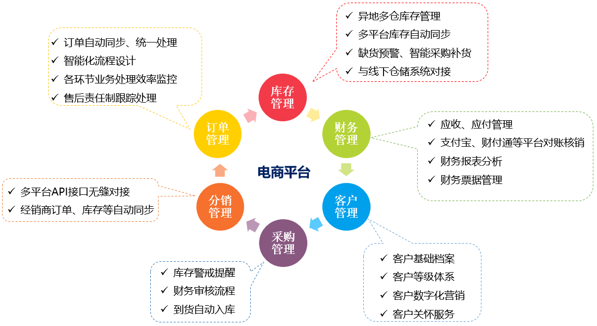
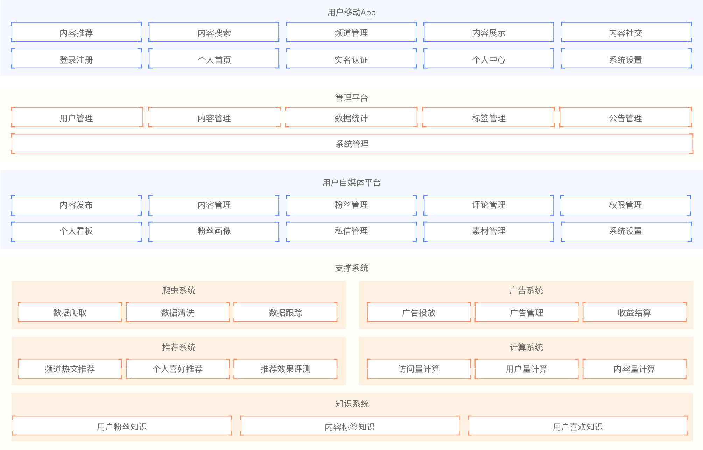
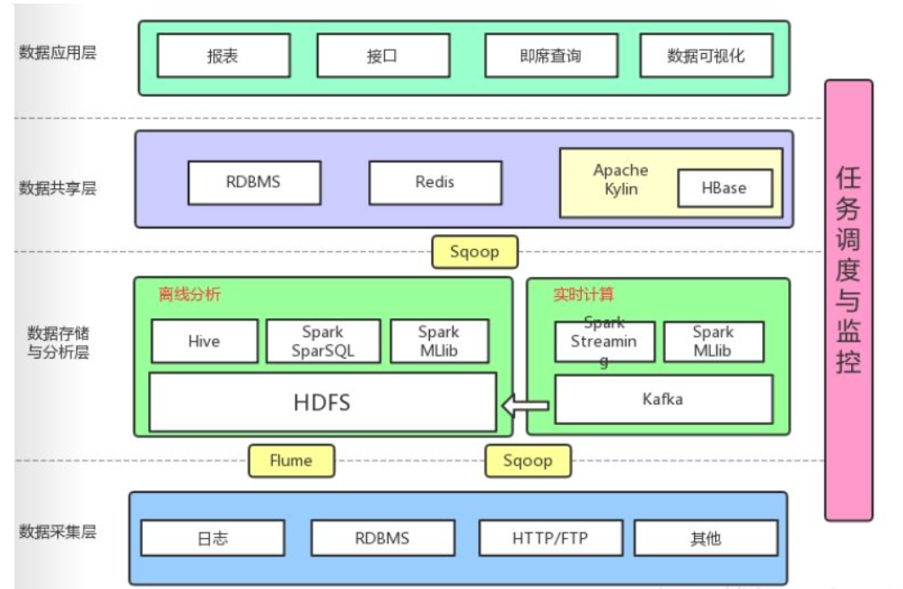
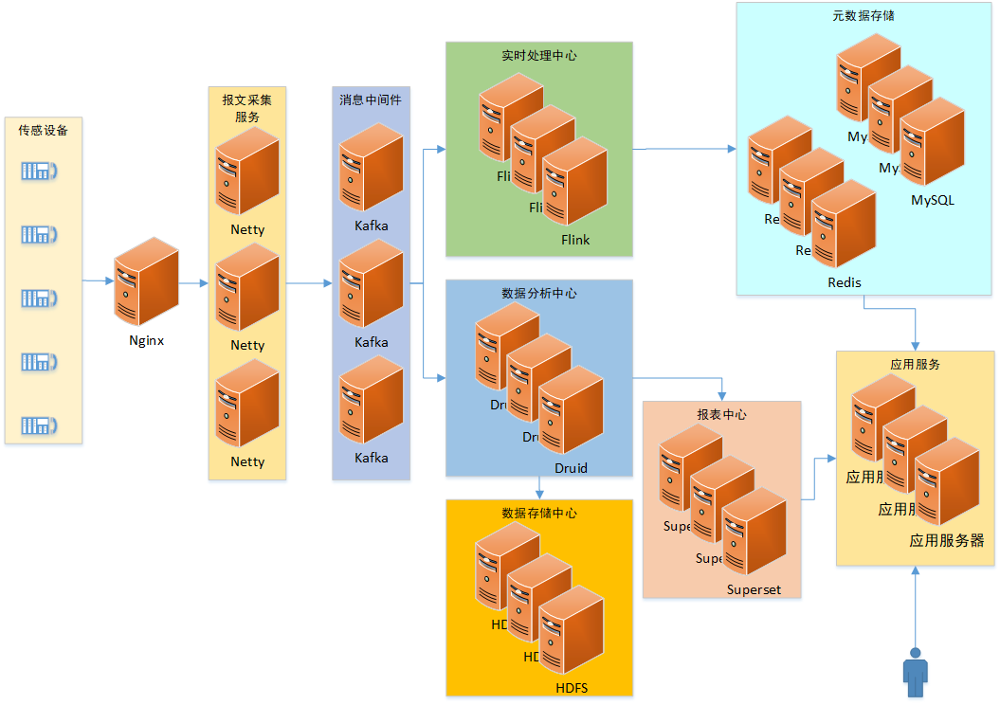

---
title: 架构视角
--- 
架构图是为了表示软件系统的整体轮廓和各个组件之间的相互关系和约束边界，以及软件系统的物理部署和软件系统的演进方向的整体视图。要让干系人理解、遵循架构决策，就需要把架构信息传递出去，架构图就是一个很好的载体。不同的视角和角色，关注点也是不同的，看到的架构图是不一样的。

## 1、业务架构

**使用者**：CEO、CIO、CTO、产品总监

**核心业务流程：**

**核心能力:**

## 2、功能架构

使用者：产品总监、产品经理

**示例：**黑马头条功能架构图

## 3、系统架构

使用者：系统架构师

## 4、 技术架构

使用者：系统架构师

**示例一**：https://www.processon.com/view/5f2a0bfb1e08533a629b7ed3

**示例二**：冷链项目技术架构图

## 5、数据架构

使用者：CTO、系统架构师、数据架构师

**示例一**：数据模型

**示例二**：大数据平台架构

## 6、部署架构

使用者：运维架构师

**示例一**：https://www.processon.com/view/5f2a03cf637689168e49e3fa

**示例二**：冷链项目部署架构图

