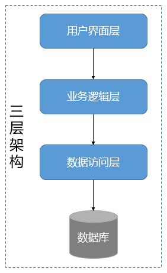

## 1、 解耦

在软件工程中，耦合指的就是对象之间的依赖性。对象之间的耦合度越高，维护成本越高。因此对象的设计应使类和构件之间的耦合最小。软件设计中通常用耦合度和内聚度作为衡量模块独立程度的标准。**划分模块的一个准则就是高内聚低耦合。**

耦合性存在于各个领域，而非软件设计中独有的，理论上说绝对的零耦合是做不到的，但可以通过一些方法将耦合降至最低，降低耦合度即可理解为解耦，在设计上解耦的核心思想是【彼此独立，互不依赖】。

## 2、 分层

分层结构是最为流行、应用最广泛的应用软件的设计方式。在应用了分层结构的系统中，各个子系统按照层次的形式组织起来，上层使用下层的各种服务，而下层对上层一无所知。每一层都对自己的上层隐藏其下层的细节。

**经典三层架构**：

在软件架构中，经典三层架构自顶向下由用户界面层、业务逻辑层、数据访问层组成。在提出该分层架构的时代，多数系统往往较为简单，本质上都是一个单体架构的数据库管理系统。这种分层架构有效地隔离了业务逻辑与数据访问逻辑，使得这两个不同关注点能够相对自由和独立地演化。经典的三层架构如下所示：

**分层的设计原则是：保证同一层的组件处于同一个抽象层次**。即所谓的“单一抽象层次原则”。这一原则可以运用到分层架构中。比如下图所示：

## 3、 封装

假设我们有一个程序，它在逻辑上有一些不同的对象，并且这些对象彼此之间会相互交流。

**在一个类中，当每个对象的状态保持相对孤立，就实现了封装**。其余的对象并不能观察到这个对象的状态。他们能做到的只有调用一些被称作“方法”的通用功能。

因此，对象使用方法掌控着自己的状态，除非明确允许，没有其他人可以接触到它。如果你想和某个对象交流，你需要使用提供的方法。但在默认情况下，你无法改变对象的状态。
