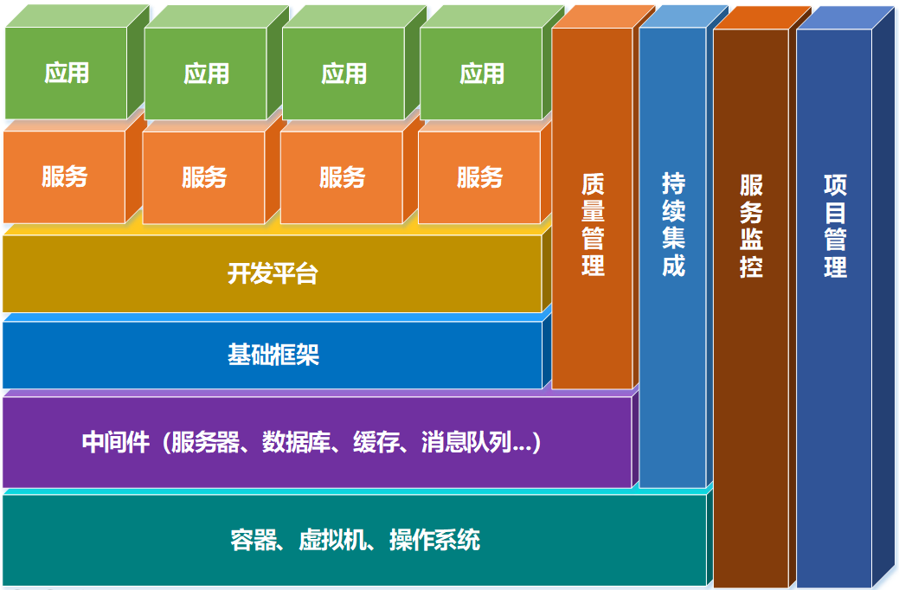

## 1、系统与子系统

**系统**：泛指由一群有关联的个体组成，根据某种规则运作，能完成个别元件不能单独完成的工作的群体。

- **关联**：系统是由一群有关联的个体组成的，没有关联的个体堆在一起不能成为一个系统。例如，把一个汽车发动机和一堆苹果放在一起不能称之为一个系统，把发动机、底盘、轮胎、车架组合起来才能成为一台汽车，构成一个系统。
- **规则**：系统内的个体需要按照指定的规则运作，而不是单个个体各自为政。规则规定了系统内个体分工和协作的方式。例如，汽车发动机负责产生动力，然后通过变速器和传动轴，将动力输出到车轮上，从而驱动汽车前进。
- **能力**：系统能力与个体能力有本质的差别，系统能力不是个体能力之和，而是产生了新的能力。例如，汽车能够载重前进，而发动机、变速器、传动轴、车轮本身都不具备这样的能力。

**子系统**：子系统也是由一群有关联的个体所组成的系统，多半会是更大系统中的一部分。 子系统的定义和系统定义是一样的，只是观察的角度有差异，一个系统可能是另外一个更大系统的子系统。

以微信为例来做一个分析：

- 微信本身是一个系统，包含聊天、登录、支付、朋友圈等子系统。
- 朋友圈这个系统又包括动态、评论、点赞等子系统。
- 评论这个系统可能又包括防刷子系统、审核子系统、发布子系统、存储子系统。
- 评论审核子系统不再包含业务意义上的子系统，而是包括各个模块或者组件，这些模块或者组件本身也是另外一个维度上的系统。例如，MySQL、Redis 等是存储系统，但不是业务子系统

## 2、模块、组件、服务

- **模块**：是一套一致而互相有紧密关连的软件组织。它分别包含了程序和数据结构两部分。现代软件开发往往使用模块作为合成的单位
- **组件**：自包含的、可编程的、可重用的、与语言无关的软件单元，组件可以很容易被用于组装应用程序中

模块和组件都是系统的组成部分，只是从不同的角度拆分系统而已。例如：

- **从逻辑的角度来拆分系统后，得到的单元就是“模块”**；**从物理的角度来拆分系统后，得到的单元就是“组件”**。
- **划分模块的主要目的是职责分离；划分组件的主要目的是单元复用。**

例如我们要做一个学生信息管理系统，这个系统从逻辑的角度来拆分，可以分为：登录注册模块、个人信息模块、个人成绩模块；从物理的角度来拆分，可以拆分为应用程序、 Nginx、Web 服务器、MySQL等

- **服务：**服务和组件有某种相似之处：它们都将被外部的应用程序使用。两者之间最大的差异在于：组件是在本地使用的（例如Jar文件）；而服务是运行起来的，要通过同步或异步的远程接口来远程使用（例如RESTFul接口、web service、消息系统、RPC，或者socket）

服务是可以单独运行，并且对外提供功能的一种形式。可以将一个复杂的项目分解成多个服务。当某一个服务挂掉时不会拖垮整个系统。如果没有服务化，每当一个新的功能被添加到系统中就会影响到所有功能；如果采取服务化，每个服务只对其上下游的服务负责。

## 3、软件架构体系

