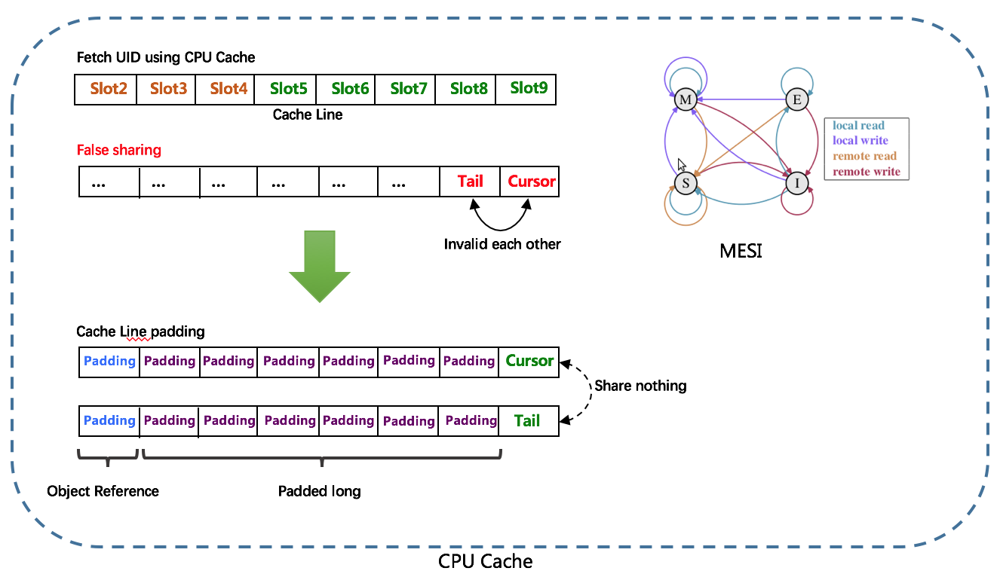
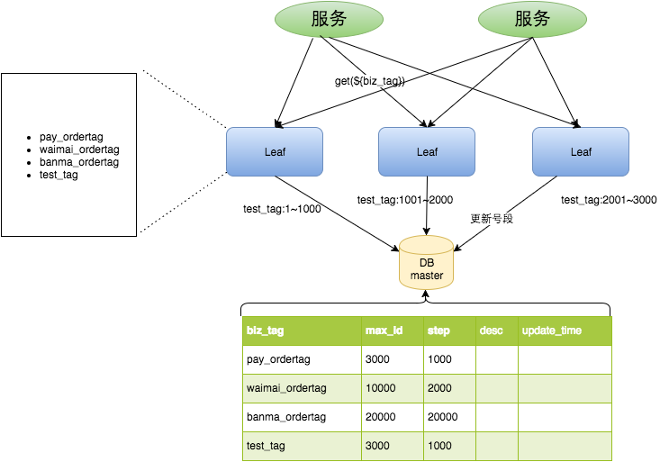

> demo地址：https://gitee.com/javaxiaobear/distributedid.git
## 1、概述

> ID，全称Identifier，中文翻译为标识符，是用来唯一标识对象或记录的符号。比如我们每个人都有自己的身份证号，这个就是我们的标识符，有了这个唯一标识，就能快速识别出每一个人。
>
> **在计算机世界里，复杂的分布式系统中，经常需要对大量的数据、消息、HTTP 请求等进行唯一标识。**比如对于分微服务架构的系统中，服务间相互调用需要唯一标识，幂等处理，调用链路分析，日志追踪的时候都需要使用这个唯一标识，此时我们的系统就迫切的需要一个全局唯一的ID。
>
> 另外随着社会的发展，各种金融、电商、支付、等系统中产生的数据越来越多，对数据库进行分库分表是比较常见的，而分库后则需要有一个唯一ID来标识一条数据或消息，单个数据库的自增ID显然不能满足需求，此时也会需要一个能够生成全局唯一ID的系统。

## 2、为什么需要分布式ID?

> 在以往单体系统，ID我们常用主键自增进行设置，这种ID生成方法在单体项目是可行的，但是对于分布式系统，[分库分表](https://so.csdn.net/so/search?q=分库分表&spm=1001.2101.3001.7020)之后，就不适应了，比如订单表数据量太大了，分成了多个库，如果还采用数据库主键自增的方式，就会出现在不同库id一致的情况，很显然不符合业务的，那出现这个情况，有没有办法能够解决呢？
>
> 分库分表之后，可以根据取余或者主键奇偶性等方式分别插入不同的库不同表。但很显然也不符合业务，还得去做额外的计算

## 3、特点

- **全局唯一**：就是说不能出现重复的ID，既然是唯一标识，这是最基本的要求

- **趋势递增**：

    - **先来了解下什么是趋势递增？**

  简单说就是在一段时间内，生成的ID是递增的趋势，而不强求下一个ID必须大于前一ID。例如在一段时间内生成的ID在【0，1000】之间，过段时间生成的ID在【1000，2000】之间。

    - **为什么要趋势递增？**

  目前大部分的互联网公司使用了开源的MySQL数据库，存储引擎选择InnoDB。MySQL InnoDB引擎中使用的是聚集索引，由于多数RDBMS数据库使用B-tree的数据结构来存储索引数据，在主键的选择上面我们应该尽量使用有序的主键，这样在插入新的数据时B-tree的结构不会时常被打乱重塑，能有效的提高存取效率。

- **单调递增**：通俗的说就是下一个ID一定大于上一个ID，例如事务版本号、IM增量消息、排序等特殊需求。

- **信息安全**：如果ID是连续递增的，那么恶意用户可以根据当前ID推测出下一个ID，爬取系统中数据的工作就非常容易实现，直接按照顺序访问指定URL即可；如果是订单号就更加危险，竞争对手可以直接知道系统一天的总订单量。所以在一些应用场景下，会需要ID无规则、不规则，切不易被破解。

## 4、常用方法

> 解决方案一般有以下8种，可以根据自己项目需求进行设计调整
>
> 1. UUID
> 2. 数据库自增
> 3. 号段模式
> 4. Redis 生成ID
> 5. 雪花算法（SnowFlake）
> 6. 百度 Uidgenerator
> 7. 美团 Leaf
> 8. 滴滴 TinyID

### 1、UUID

> `UUID （Universally Unique Identifier）`，通用唯一识别码的缩写。UUID是由一组32位数的16进制数字所构成，所以UUID理论上的总数为 `16^32=2^128`，约等于 `3.4 x 10^38`。也就是说若每纳秒产生1兆个UUID，要花100亿年才会将所有UUID用完。
>
> 生成的UUID是由 8-4-4-4-12格式的数据组成，其中32个字符和4个连字符' - '，一般我们使用的时候会将连字符删除 uuid.`toString().replaceAll("-","")`。

目前UUID的产生方式有5种版本，每个版本的算法不同，应用范围也不同。

- 版本1：`基于时间的UUID` 这个一般是通过当前时间，随机数，和本地Mac地址来计算出来，可以通过 org.apache.logging.log4j.core.util包中的 UuidUtil.getTimeBasedUuid()来使用或者其他包中工具。由于使用了MAC地址，因此能够确保唯一性，但是同时也暴露了MAC地址，私密性不够好。
- 版本2 ：DCE（Distributed Computing Environment） `DCE安全的UUID` 安全的UUID和基于时间的UUID算法相同，但会把时间戳的前4位置换为POSIX的UID或GID。这个版本的UUID在实际中较少用到。
- 版本3：`基于名字的UUID（MD5）`- 版本3 基于名字的UUID通过计算名字和名字空间的MD5散列值得到。这个版本的UUID保证了：相同名字空间中不同名字生成的UUID的唯一性；不同名字空间中的UUID的唯一性；相同名字空间中相同名字的UUID重复生成是相同的。
- 版本4：`随机UUID` -根据随机数，或者伪随机数生成UUID。这种UUID产生重复的概率是可以计算出来的，但是重复的可能性可以忽略不计，因此该版本也是被经常使用的版本。JDK中使用的就是这个版本。
- 版本5：`基于名字的UUID（SHA1）` - 版本5 和基于名字的UUID算法类似，只是散列值计算使用SHA1（Secure Hash Algorithm 1）算法。

Java中 JDK自带的 UUID产生方式就是版本4根据随机数生成的 UUID 和版本3基于名字的 UUID，有兴趣的可以去看看它的源码。

```java
public static void main(String[] args) {

    //获取一个版本4根据随机字节数组的UUID。
    UUID uuid = UUID.randomUUID();
    System.out.println(uuid.toString().replaceAll("-",""));

    //获取一个版本3(基于名称)根据指定的字节数组的UUID。
    byte[] nbyte = {1, 2, 3};
    UUID uuidFromBytes = UUID.nameUUIDFromBytes(nbyte);
    System.out.println(uuidFromBytes.toString().replaceAll("-",""));
}
```

优点：属于本地解决方案，无网络消耗

缺点：

- 不易于存储：UUID太长，16字节128位，通常以36长度的字符串表示，很多场景不适用
- MAC 地址提供了唯一性的保证，但也带来安全风险，最糟的是它是字符串形式，占用空间大，查询性能低，无法保证趋势递增
- ID作为主键时在特定的环境会存在一些问题，比如做DB主键的场景下，UUID就非常不适用：
    - MySQL官方有明确的建议主键要尽量越短越好，36个字符长度的UUID不符合要求
    - 对MySQL索引不利：如果作为数据库主键，在InnoDB引擎下，UUID的无序性可能会引起数据位置频繁变动，严重影响性能

### 2、数据库自增

> 这种方式也是我们用的最多的方式，通常使用数据库自增，不同数据库自增命令可能不同，以MySQL为例，`AUTO_INCREMENT`可以使主键自增。


优点：

- 单体项目实现简单，命令即可设置，成本小，有DBA专业维护
- 生成的ID有序，可以实现一些对ID有特殊要求的业务。

缺点：

- 不同数据库语法或实现不同，数据库迁移的时候需要处理
- 在单个数据库或读写分离或一主多从多情况下，只有一个主库可以生成ID，有单点故障的风险
- 在性能达不到要求的情况下比较难以扩展
- 数据迁移或者系统数据合并比较麻烦
- 分库分表时会比较麻烦
- ID发号性能瓶颈限制在单台MySQL的读写性能

下面代码即可获取数据库自增ID

```java
@Repository
public class IdDaoImpl implements IdDao {

    @Autowired
    private JdbcTemplate jdbcTemplate;

    @Override
    public Long getAutoincrementId(String bizType) {

        //使用REPLACE关键词，如果没有就新增，如果有就先删除再新增
        //就能够获取自增ID
        final String sql = "REPLACE INTO `sequence_id` (`biz_type`) VALUES (?);";

        // 创建自增key的持有器
        KeyHolder keyHolder = new GeneratedKeyHolder();
        int row = jdbcTemplate.update(connection -> {
            PreparedStatement ps = connection.prepareStatement(sql, Statement.RETURN_GENERATED_KEYS);
            ps.setString(1, bizType);
            return ps;
        }, keyHolder);

        //获取主键ID
        if (row > 0) {
            BigInteger id = (BigInteger) keyHolder.getKeyList().get(0).get("GENERATED_KEY");
            return id.longValue();
        }
        throw new DistributedIdException("获取数据库自增ID失败");
    }
}
```


### 3、号段模式

> 这种模式针对数据库自增的优化方案，也是现在生成分布式 ID 的一种方法。实现思路是，会从数据库获取一个号段范围，比如 [1,1000]，生成 1 到 1000 的自增 ID 加载到内存中。

对于MySQL性能问题，可用如下方案解决：在分布式系统中我们可以多部署几台机器，每台机器设置不同的初始值，且步长和机器数相等。比如有两台机器。设置步长step为2，TicketServer1的初始值为1（1，3，5，7，9，11…）、TicketServer2的初始值为2（2，4，6，8，10…）。这是Flickr团队在2010年撰文介绍的一种主键生成策略（[Ticket Servers: Distributed Unique Primary Keys on the Cheap ](http://code.flickr.net/2010/02/08/ticket-servers-distributed-unique-primary-keys-on-the-cheap/)）。如下所示，为了实现上述方案分别设置两台机器对应的参数，TicketServer1从1开始发号，TicketServer2从2开始发号，两台机器每次发号之后都递增2。

```sql
TicketServer1:
auto-increment-increment = 2
auto-increment-offset = 1

TicketServer2:
auto-increment-increment = 2
auto-increment-offset = 2
```

假设我们要部署N台机器，步长需设置为N，每台的初始值依次为0,1,2…N-1那么整个架构就变成了如下图所示：


这需要用到一张表，表结构如下：

```sql
CREATE TABLE `segment_id_info` (
  `id` bigint unsigned NOT NULL AUTO_INCREMENT COMMENT '自增主键',
  `biz_type` varchar(63) CHARACTER SET utf8 COLLATE utf8_general_ci NOT NULL DEFAULT '' COMMENT '业务类型，唯一',
  `begin_id` bigint NOT NULL DEFAULT '0' COMMENT '开始id，仅记录初始值，无其他含义。初始化时begin_id和max_id应相同',
  `max_id` bigint NOT NULL DEFAULT '0' COMMENT '当前最大id',
  `step` int DEFAULT '0' COMMENT '步长',
  `delta` int NOT NULL DEFAULT '1' COMMENT '每次id增量',
  `remainder` int NOT NULL DEFAULT '0' COMMENT '余数',
  `create_time` timestamp NOT NULL DEFAULT CURRENT_TIMESTAMP COMMENT '创建时间',
  `update_time` timestamp NOT NULL DEFAULT CURRENT_TIMESTAMP COMMENT '更新时间',
  `version` bigint NOT NULL DEFAULT '0' COMMENT '版本号',
  PRIMARY KEY (`id`) USING BTREE,
  UNIQUE KEY `uniq_biz_type` (`biz_type`) USING BTREE
) ENGINE=InnoDB AUTO_INCREMENT=6 DEFAULT CHARSET=utf8mb3 ROW_FORMAT=DYNAMIC COMMENT='号段ID信息表';
```

可根据自身数据进行表结构调整，一般需要的字段有：

- **biz_type**：不同业务类型；
- **max_id** ：当前最大的 id；
- **step**：代表号段的步长；
- **version** ：版本号，每次更新都+1，可以理解为乐观锁

步骤如下：

1. 查询当前的max_id信息，也就是整个号段对象
2. 如果为空，那就进行初始化，初始化完成后，在进行查询
3. 计算新的max_id：   new_max_id = max_id + step
4. 更新数据库中的max_id，同时版本号+1
5. 如果更新成功，则可用号段获取成功，新增可用号段为  max_id,new_max_id
6. 如果更新失败，则号段可能被其他线程获取到，数据不安全，回到步骤1，重试

具体实现类：

```java
@Service("segment")
public class SegmentIdGen implements IdGen {

    private final static Logger log = LoggerFactory.getLogger(SegmentIdGen.class);

    /**
     * 在Id使用完成之前，进行异步加载下一个号段的百分比
     * 当前号段的id使用了百分之多少的时候，就开始加载下一个号段
     */
    private static final int LOADING_PERCENT = 20;

    /**
     * 重试的次数
     */
    private static final int RETRY = 3;

    @Autowired
    private SegmentIdInfoDao segmentIdInfoDao;

    @Override
    @Transactional
    public SegmentId getNextSegmentId(String bizType) {
        //获取下一个号段的时候，可能存在version冲突，需要进行重试
        for (int i = 0; i < RETRY; i++) {
            SegmentIdInfo segmentIdInfo = segmentIdInfoDao.queryByBizType(bizType);
            if (segmentIdInfo == null) {
                //如果没有查询到数据，进行初始化操作
                int row = segmentIdInfoDao.initBizType(bizType);
                if (row < 1) {
                    throw new DistributedIdException("初始化当前业务类型失败");
                }

                //初始化成功，再次进行查询
                segmentIdInfo = segmentIdInfoDao.queryByBizType(bizType);
            }

            //最新的maxId
            Long newMaxId = segmentIdInfo.getMaxId() + segmentIdInfo.getStep();
            //原来的maxId
            Long oldMaxId = segmentIdInfo.getMaxId();

            //修改maxId
            int row = segmentIdInfoDao.updateMaxId(segmentIdInfo.getId(), newMaxId, oldMaxId,
                    segmentIdInfo.getVersion(), segmentIdInfo.getBizType());
            //判断是否修改成功
            if (row == 1) {
                segmentIdInfo.setMaxId(newMaxId);
                SegmentId segmentId = convert(segmentIdInfo);
                log.info("获取下一个号段成功，SegmentIdInfo:{},current:{}", segmentIdInfo, segmentId);
                return segmentId;
            } else {
                log.info("获取下一个号段冲突，SegmentIdInfo:{}", segmentIdInfo);
            }

        }
        throw new DistributedIdException("获取下一个号段冲突，获取失败");
    }

    /**
     * 把数据库号段数据转为客户端所需要使用的号段ID结果对象
     *
     * @param info
     * @return
     */
    private SegmentId convert(SegmentIdInfo info) {
        SegmentId segmentId = new SegmentId();

        segmentId.setCurrentId(new AtomicLong(info.getMaxId() - info.getStep()));
        segmentId.setMaxId(info.getMaxId());
        segmentId.setDelta(info.getDelta() == null ? 1 : info.getDelta());
        segmentId.setRemainder(info.getRemainder() == null ? 0 : info.getRemainder());
        //1000~2000   加载百分比20       1000+1000*20/100   = 1200
        segmentId.setLoadingId(segmentId.getCurrentId().get() + info.getStep() * LOADING_PERCENT / 100);

        return segmentId;
    }
}
```

数据层实现：

```java
@Repository
public class SegmentIdInfoDaoImpl implements SegmentIdInfoDao {

    @Autowired
    private JdbcTemplate jdbcTemplate;

    /**
     * 根据bizType获取数据库中的号段ID对象
     * @param bizType
     * @return
     */
    @Override
    public SegmentIdInfo queryByBizType(String bizType) {
        String sql = "SELECT * FROM `segment_id_info`  WHERE biz_type = ?";

        List<SegmentIdInfo> list = jdbcTemplate.query(sql, new Object[]{bizType}, new SegmentIdInfoRowMapper());

        if (list == null || list.isEmpty()) {
            return null;
        }

        return list.get(0);
    }

    /**
     * 初始化号段 步长为1000
     * @param bizType
     * @return
     */
    @Override
    public int initBizType(String bizType) {
        String sql = "INSERT INTO `segment_id_info` " +
                "( `biz_type`, `begin_id`, `max_id`, `step`, `delta`, `remainder` ) " +
                "VALUES ( ?, 0, 0, 1000, ( SELECT @@auto_increment_increment ), " +
                "( SELECT @@auto_increment_offset - 1 ))";
        return jdbcTemplate.update(sql, bizType);
    }

    /**
     * 根据id、oldMaxId，version，bizType更新最新的maxId
     * @param id
     * @param newMaxId
     * @param oldMaxId
     * @param version
     * @param bizType
     * @return
     */
    @Override
    public int updateMaxId(Long id, Long newMaxId, Long oldMaxId, Long version, String bizType) {
        String sql = "UPDATE `segment_id_info` " +
                "SET `max_id` = ?," +
                "update_time = now( )," +
                "version = version + 1 " +
                "WHERE " +
                "id = ? " +
                "AND max_id = ? " +
                "AND version = ? " +
                "AND biz_type = ?";
        return jdbcTemplate.update(sql, newMaxId, id, oldMaxId, version, bizType);
    }

    private class SegmentIdInfoRowMapper implements RowMapper<SegmentIdInfo> {
        @Override
        public SegmentIdInfo mapRow(ResultSet resultSet, int i) throws SQLException {
            SegmentIdInfo segmentIdInfo = new SegmentIdInfo();

            segmentIdInfo.setId(resultSet.getLong("id"));
            segmentIdInfo.setBizType(resultSet.getString("biz_type"));
            segmentIdInfo.setBeginId(resultSet.getLong("begin_id"));
            segmentIdInfo.setMaxId(resultSet.getLong("max_id"));
            segmentIdInfo.setStep(resultSet.getInt("step"));
            segmentIdInfo.setDelta(resultSet.getInt("delta"));
            segmentIdInfo.setRemainder(resultSet.getInt("remainder"));
            segmentIdInfo.setCreateTime(resultSet.getDate("create_time"));
            segmentIdInfo.setUpdateTime(resultSet.getDate("update_time"));
            segmentIdInfo.setVersion(resultSet.getLong("version"));

            return segmentIdInfo;
        }
    }
}

```

优点：有比较成熟的方案，像百度Uidgenerator，美团Leaf

缺点：

- 系统水平扩展比较困难，比如定义好了步长和机器台数之后，如果要添加机器该怎么做？假设现在只有一台机器发号是1,2,3,4,5（步长是1），这个时候需要扩容机器一台。可以这样做：把第二台机器的初始值设置得比第一台超过很多，比如14（假设在扩容时间之内第一台不可能发到14），同时设置步长为2，那么这台机器下发的号码都是14以后的偶数。然后摘掉第一台，把ID值保留为奇数，比如7，然后修改第一台的步长为2。让它符合我们定义的号段标准，对于这个例子来说就是让第一台以后只能产生奇数。扩容方案看起来复杂吗？貌似还好，现在想象一下如果我们线上有100台机器，这个时候要扩容该怎么做？简直是噩梦。所以系统水平扩展方案复杂难以实现。
- ID没有了单调递增的特性，只能趋势递增，这个缺点对于一般业务需求不是很重要，可以容忍。
- 数据库压力还是很大，每次获取ID都得读写一次数据库，只能靠堆机器来提高性能。


### 4、Redis实现

> Redis 分布式 ID 实现主要是通过提供像 INCR 和 INCRBY 这样的自增原子命令。由于 Redis 单线程的特点，可以保证 ID 的唯一性和有序性。
>
> 这种实现方式，如果并发请求量上来后，就需要集群。不过集群后，又要和传统数据库一样，设置分段和步长。

具体实现：

```java
public class RedisIdWorker {

    private static final long BEGIN_TIMESTAMP = 1640995200L;

    private static final int COUNT_BITS = 32;

    @Resource
    private StringRedisTemplate stringRedisTemplate;

    /**
     * redis 生成器
     * @param keyPrefix id前缀
     * @return
     */
    public long nextId(String keyPrefix){
        //1.生成时间戳
        LocalDateTime now = LocalDateTime.now();
        long nowSecond = now.toEpochSecond(ZoneOffset.UTC);
        long timestamp = nowSecond - BEGIN_TIMESTAMP;
        //生成序列号
        //获取当前日期，精确到天
        String date = now.format(DateTimeFormatter.ofPattern("yyyy:MM:dd"));
        //这样可用根据日期去统计订单量 自动拆箱回产生空指针，但事实上这里并不会，redis发现没有，会自动生成
        long increment = stringRedisTemplate.opsForValue().increment("icr:" + keyPrefix + date);
        //拼接返回
        // 这里拼接返回的是long类型，字符串拼接返回的是字符串
        //这里需要使用 位运算 时间戳向左移动32位 在高位, 系列号采用或运算去填充
        return timestamp << COUNT_BITS | increment;
    }
}
```

**优点**：Redis 性能相对比较好，而且可以保证唯一性和有序性；

**缺点**：需要依赖 Redis 来实现，系统需要引入 Redis 组件。


### 5、雪花算法（SnowFlake）

> Snowflake，雪花算法是由Twitter开源的分布式ID生成算法，以划分命名空间的方式将 64-bit位分割成多个部分，每个部分代表不同的含义。而 Java中64bit的整数是Long类型，所以在 Java 中 SnowFlake 算法生成的 ID 就是 long 来存储的。
>
> - **第1位**占用1bit，其值始终是0，可看做是符号位不使用。
> - **第2位**开始的41位是时间戳，41-bit位可表示2^41个数，每个数代表毫秒，那么雪花算法可用的时间年限是`(1L<<41)/(1000L360024*365)`=69 年的时间。
> - **中间的10-bit位**可表示机器数，即2^10 = 1024台机器，但是一般情况下我们不会部署这么台机器。如果我们对IDC（互联网数据中心）有需求，还可以将 10-bit 分 5-bit 给 IDC，分5-bit给工作机器。这样就可以表示32个IDC，每个IDC下可以有32台机器，具体的划分可以根据自身需求定义。
> - **最后12-bit位**是自增序列，可表示2^12 = 4096个数。
>
> 这样的划分之后相当于**在一毫秒一个数据中心的一台机器上可产生4096个有序的不重复的ID**。但是我们 IDC 和机器数肯定不止一个，所以毫秒内能生成的有序ID数是翻倍的。

下面是Java版本的雪花算法的实现

```java
/**
 * Twitter的Snowflake算法
 * <p>
 * 协议格式   1：  41位时间戳      2:5位数据中心标识     3：5位机器标识   4:12位序列号
 * <p>
 * 1111111111111111111111111111111   11111    11111    111111111111
 */
public class Snowflake {

    //起始时间戳，可以修改为服务器第一次启动的时间
    //一旦服务已经开始使用，起始时间戳就不能改变了，理论上可以使用69年
    private final static long START_TIME = 1484754361114L;

    /**
     * 每一个部分占用的位数
     */
    private final static long SEQUENCE_BIT = 12;//序列号占用的位数
    private final static long MACHINE_BIT = 5;//序机器标识 占用的位数
    private final static long DATA_CENTER_BIT = 5;//数据中心标识占用的位数

    /**
     * 每一个部分的最大值  11111111111111111    1111111100000   000000000011111
     */
    private final static long MAX_DATA_CENTER_ID = ~(-1L << DATA_CENTER_BIT);
    private final static long MAX_MACHINE_ID = ~(-1L << MACHINE_BIT);
    private final static long MAX_SEQUENCE = ~(-1L << SEQUENCE_BIT);

    /**
     * 每一部分向左位移数 1111111111111111111111111111111   11111    11111    111111111111
     */
    private final static long MACHINE_LEFT = SEQUENCE_BIT;
    private final static long DATA_CENTER_LEFT = SEQUENCE_BIT + MACHINE_BIT;
    private final static long TIMESTAMP_LEFT = DATA_CENTER_LEFT + DATA_CENTER_BIT;

    private long dataCenterId;//数据中心ID
    private long machineId;//数据中心ID
    private long sequence = 0L;
    private long lastTimestamp = -1L;


    /**
     * 分布式部署的时候，数据节点标识和机器标识作为联合键，必须唯一的
     *
     * @param dataCenterId 数据中心标识ID
     * @param machineId    机器标识ID
     */
    public Snowflake(long dataCenterId, long machineId) {
        if (dataCenterId > MAX_DATA_CENTER_ID || dataCenterId < 0) {
            throw new DistributedIdException("数据中心ID不合法");
        }

        if (machineId > MAX_MACHINE_ID || machineId < 0) {
            throw new DistributedIdException("机器标识ID不合法");
        }

        this.dataCenterId = dataCenterId;
        this.machineId = machineId;
    }

    /**
     * 获取下一个ID
     *
     * @return
     */
    public synchronized long nextId() {
        long currentTmestamp = getNowTimestamp();

        if (currentTmestamp < lastTimestamp) {
            throw new RuntimeException("时钟错误，拒绝生成ID");
        }

        if (currentTmestamp == lastTimestamp) {
            //相同毫秒内，序列号自增
            sequence = (sequence + 1) & MAX_SEQUENCE;

            //同一毫秒的序列号已经达到最大
            if (sequence == 0L) {
                currentTmestamp = getNexMill();
            }
        } else {
            //不同毫秒内，序列号置为0
            sequence = 0L;
        }

        lastTimestamp = currentTmestamp;

        return (currentTmestamp - START_TIME) << TIMESTAMP_LEFT  //时间戳的部分
                | dataCenterId << DATA_CENTER_LEFT //数据中心的部分
                | machineId << MACHINE_LEFT //机器标识的部分
                | sequence;  //序列号的部分


    }

    /**
     * 保证获取到的毫秒值是在最后一次分发ID的毫秒值之后lastTimestamp
     * 当某一个毫秒，序列号用完了之后，等待到下一个毫秒，在进行序列号的使用
     *
     * @return
     */
    private long getNexMill() {
        long timestamp = this.getNowTimestamp();

        //不断的遍历，直到获取到lastTimestamp下一个毫秒值
        while (timestamp <= lastTimestamp) {
            //进行时间回拨
            timestamp = this.getNowTimestamp();
        }

        return timestamp;
    }

    /**
     * 获取当前毫秒值
     * @return
     */
    private long getNowTimestamp() {
        return System.currentTimeMillis();
    }


    /**
     * 使用当前计算机的MAC生成数据中心标识ID
     *
     * @param maxDataCenterId
     * @return
     */
    private static long getDataCenterId(long maxDataCenterId) {
        long id = 0L;

        try {
            InetAddress ip = InetAddress.getLocalHost();
            NetworkInterface network = NetworkInterface.getByInetAddress(ip);

            if (network == null) {
                id = 1L;
            } else {
                byte[] mac = network.getHardwareAddress();
                if (mac != null) {
                    id = ((0x000000FF & (long) mac[mac.length - 1]) | (0x0000FF00 & (((long) mac[mac.length - 2])
                            << 8))) >> 6;
                    id = id % (maxDataCenterId + 1);
                }
            }
        } catch (Exception e) {
            e.printStackTrace();
        }
        return id;
    }


    /**
     * 根据当前计算机的进程PID生成机器识别ID
     * @param dataCenterId
     * @param maxMachineId
     * @return
     */
    private static long getMachineId(long dataCenterId, long maxMachineId) {
        StringBuilder sb = new StringBuilder();
        sb.append(dataCenterId);

        //获取JVM进程的PID
        String name = ManagementFactory.getRuntimeMXBean().getName();
        if (name != null) {
            sb.append(name.split("@")[0]);
        }

        /**
         * MAC+PID 的hashcode 获取16个低位
         */
        int id = sb.toString().hashCode() & 0xffff;
        return id % (maxMachineId + 1);
    }

    public Snowflake() {
        dataCenterId = getDataCenterId(MAX_DATA_CENTER_ID);
        machineId = getMachineId(dataCenterId, MAX_MACHINE_ID);
    }

    //public static void main(String[] args) {
    //    //指定数据中心和机器识别id
    //    Snowflake snowflake = new Snowflake(2, 3);
    //    System.out.println("指定数据中心和机器识别ID来生成ID");
    //    for (int i = 0; i < 10; i++) {
    //        System.out.println(snowflake.nextId());
    //    }
    //
    //    //默认快速使用方式
    //    snowflake = new Snowflake();
    //    System.out.println("快速使用方式来生成ID");
    //    for (int i = 0; i < 10; i++) {
    //        System.out.println(snowflake.nextId());
    //    }
    //}

}
```

优点：

- 毫秒数在高位，自增序列在低位，整个ID都是趋势递增的。
- 不依赖数据库等第三方系统，以服务的方式部署，稳定性更高，生成ID的性能也是非常高的。
- 可以根据自身业务特性分配bit位，非常灵活。

缺点：

- 强依赖机器时钟，如果机器上时钟回拨，会导致发号重复或者服务会处于不可用状态。

### 6、百度 Uidgenerator

> `UidGenerator`是Java实现的, 基于[Snowflake](https://github.com/twitter/snowflake)算法的唯一ID生成器。`UidGenerator`以组件形式工作在应用项目中, 支持自定义workerId位数和初始化策略, 从而适用于[docker](https://www.docker.com/)等虚拟化环境下实例自动重启、漂移等场景。 在实现上, `UidGenerator`通过借用未来时间来解决sequence天然存在的并发限制; 采用RingBuffer来缓存已生成的UID, 并行化UID的生产和消费, 同时对CacheLine补齐，避免了由RingBuffer带来的硬件级「伪共享」问题. 最终单机QPS可达600万。
>
> 官方地址：https://github.com/baidu/uid-generator

uid-generator提供了两种生成器: DefaultUidGenerator、CachedUidGenerator。如对UID生成性能有要求, 请使用CachedUidGenerator

**CachedUidGenerator**

RingBuffer环形数组，数组每个元素成为一个slot。RingBuffer容量，默认为Snowflake算法中sequence最大值，且为2^N。可通过`boostPower`配置进行扩容，以提高RingBuffer 读写吞吐量。

Tail指针、Cursor指针用于环形数组上读写slot：

- Tail指针
  表示Producer生产的最大序号(此序号从0开始，持续递增)。Tail不能超过Cursor，即生产者不能覆盖未消费的slot。当Tail已赶上curosr，此时可通过`rejectedPutBufferHandler`指定PutRejectPolicy
- Cursor指针
  表示Consumer消费到的最小序号(序号序列与Producer序列相同)。Cursor不能超过Tail，即不能消费未生产的slot。当Cursor已赶上tail，此时可通过`rejectedTakeBufferHandler`指定TakeRejectPolicy

[](https://github.com/baidu/uid-generator/blob/master/doc/ringbuffer.png)

CachedUidGenerator采用了双RingBuffer，Uid-RingBuffer用于存储Uid、Flag-RingBuffer用于存储Uid状态(是否可填充、是否可消费)

由于数组元素在内存中是连续分配的，可最大程度利用CPU cache以提升性能。但同时会带来「伪共享」FalseSharing问题，为此在Tail、Cursor指针、Flag-RingBuffer中采用了CacheLine 补齐方式。

[](https://github.com/baidu/uid-generator/blob/master/doc/cacheline_padding.png)

**RingBuffer填充时机**

- 初始化预填充
  RingBuffer初始化时，预先填充满整个RingBuffer.
- 即时填充
  Take消费时，即时检查剩余可用slot量(`tail` - `cursor`)，如小于设定阈值，则补全空闲slots。阈值可通过`paddingFactor`来进行配置，请参考Quick Start中CachedUidGenerator配置
- 周期填充
  通过Schedule线程，定时补全空闲slots。可通过`scheduleInterval`配置，以应用定时填充功能，并指定Schedule时间间隔


#### 1、导入依赖

```xml
<!-- https://mvnrepository.com/artifact/com.xfvape.uid/uid-generator -->
<dependency>
    <groupId>com.xfvape.uid</groupId>
    <artifactId>uid-generator</artifactId>
    <version>0.0.4-RELEASE</version>
</dependency>
```


#### 2、创建表WORKER_NODE

运行sql脚本以导入表WORKER_NODE, 脚本如下:

```sql
DROP DATABASE IF EXISTS `xxxx`;
CREATE DATABASE `xxxx` ;
use `xxxx`;
DROP TABLE IF EXISTS WORKER_NODE;
CREATE TABLE WORKER_NODE
(
ID BIGINT NOT NULL AUTO_INCREMENT COMMENT 'auto increment id',
HOST_NAME VARCHAR(64) NOT NULL COMMENT 'host name',
PORT VARCHAR(64) NOT NULL COMMENT 'port',
TYPE INT NOT NULL COMMENT 'node type: ACTUAL or CONTAINER',
LAUNCH_DATE DATE NOT NULL COMMENT 'launch date',
MODIFIED TIMESTAMP NOT NULL COMMENT 'modified time',
CREATED TIMESTAMP NOT NULL COMMENT 'created time',
PRIMARY KEY(ID)
)
 COMMENT='DB WorkerID Assigner for UID Generator',ENGINE = INNODB;
```

#### 3、maven依赖

```xml
 <dependencies>
        <dependency>
            <groupId>com.xiaobear.distributedid</groupId>
            <artifactId>distributedid-core</artifactId>
            <version>1.0-SNAPSHOT</version>
        </dependency>
        <dependency>
            <groupId>org.springframework.boot</groupId>
            <artifactId>spring-boot-starter-web</artifactId>
        </dependency>
        <dependency>
            <groupId>org.springframework.boot</groupId>
            <artifactId>spring-boot-starter-jdbc</artifactId>
        </dependency>

        <dependency>
            <groupId>mysql</groupId>
            <artifactId>mysql-connector-java</artifactId>
            <scope>runtime</scope>
        </dependency>
        <dependency>
            <groupId>org.mybatis.spring.boot</groupId>
            <artifactId>mybatis-spring-boot-starter</artifactId>
            <version>2.1.0</version>
        </dependency>
        <!--必须放在最后-->
        <!-- https://mvnrepository.com/artifact/com.xfvape.uid/uid-generator -->
        <dependency>
            <groupId>com.xfvape.uid</groupId>
            <artifactId>uid-generator</artifactId>
            <version>0.0.4-RELEASE</version>
            <exclusions>
                <exclusion>
                    <groupId>org.slf4j</groupId>
                    <artifactId>log4j-over-slf4j</artifactId>
                </exclusion>
                <exclusion>
                    <groupId>ch.qos.logback</groupId>
                    <artifactId>logback-classic</artifactId>
                </exclusion>
                <exclusion>
                    <groupId>org.slf4j</groupId>
                    <artifactId>slf4j-api</artifactId>
                </exclusion>
                <exclusion>
                    <groupId>org.mybatis</groupId>
                    <artifactId>mybatis-spring</artifactId>
                </exclusion>
                <exclusion>
                    <groupId>org.mybatis</groupId>
                    <artifactId>mybatis</artifactId>
                </exclusion>
            </exclusions>
        </dependency>
    </dependencies>
```

#### 4、配置文件

```yaml
spring:
  datasource:
    type: com.zaxxer.hikari.HikariDataSource
    url: jdbc:mysql://127.0.0.1:3306/distributedid?serverTimezone=Asia/Shanghai&characterEncoding=utf8&useUnicode=true&useSSL=false&autoReconnect=true
    username: root
    password: 密码
    driver-class-name: com.mysql.cj.jdbc.Driver
server:
  port: 8088

mybatis:
  type-aliases-package: com.xiaobear.distributedid.core.domain
  mapper-locations: classpath*:mapper/*.xml
```

#### 5、主启动类

```java
@SpringBootApplication
@MapperScan("com.xiaobear.distributedid.mapper")
public class UidgeneratorApplication {

    public static void main(String[] args) {
        SpringApplication.run(UidgeneratorApplication.class);
        System.out.println("百度生成ID 启动成功");
    }
}
```

#### 6、业务类

##### 1、实体类

```java
public class WorkerNode {

    private Long id;

    private String hostName;

    private String port;

    private Integer type;

    private Date launchDate;

    private Date modified;

    private Date created;

    public Long getId() {
        return id;
    }

    public void setId(Long id) {
        this.id = id;
    }

    public String getHostName() {
        return hostName;
    }

    public void setHostName(String hostName) {
        this.hostName = hostName;
    }

    public String getPort() {
        return port;
    }

    public void setPort(String port) {
        this.port = port;
    }

    public Integer getType() {
        return type;
    }

    public void setType(Integer type) {
        this.type = type;
    }

    public Date getLaunchDate() {
        return launchDate;
    }

    public void setLaunchDate(Date launchDate) {
        this.launchDate = launchDate;
    }

    public Date getModified() {
        return modified;
    }

    public void setModified(Date modified) {
        this.modified = modified;
    }

    public Date getCreated() {
        return created;
    }

    public void setCreated(Date created) {
        this.created = created;
    }

    @Override
    public String toString() {
        return "WorkerNode{" +
                "id=" + id +
                ", hostName='" + hostName + '\'' +
                ", port='" + port + '\'' +
                ", type=" + type +
                ", launchDate=" + launchDate +
                ", modified=" + modified +
                ", created=" + created +
                '}';
    }
}
```

##### 2、数据层接口

```java
@Mapper
public interface WorkerNodeMapper {

    /**
     * 添加对象
     * @param workerNodeEntity
     * @return
     */
    int addWorkerNode(WorkerNode workerNodeEntity);


    /**
     * 通过host port 获取ID
     * @param host
     * @param port
     * @return
     */
    WorkerNode getWorkerNodeByHostPort(@Param("host") String host, @Param("port") String port);
}
```

mapper.xml

```xml
<?xml version="1.0" encoding="UTF-8"?>
<!DOCTYPE mapper PUBLIC "-//mybatis.org//DTD Mapper 3.0//EN" "http://mybatis.org/dtd/mybatis-3-mapper.dtd">
<mapper namespace="com.xiaobear.distributedid.mapper.WorkerNodeMapper">
    <resultMap id="workerNodeRes" type="com.xiaobear.distributedid.core.domain.WorkerNode">
        <id column="ID" jdbcType="BIGINT" property="id"/>
        <result column="HOST_NAME" jdbcType="VARCHAR" property="hostName"/>
        <result column="PORT" jdbcType="VARCHAR" property="port"/>
        <result column="TYPE" jdbcType="INTEGER" property="type"/>
        <result column="LAUNCH_DATE" jdbcType="DATE" property="launchDate"/>
        <result column="MODIFIED" jdbcType="TIMESTAMP" property="modified"/>
        <result column="CREATED" jdbcType="TIMESTAMP" property="created"/>
    </resultMap>

    <insert id="addWorkerNode" useGeneratedKeys="true" keyProperty="id"
            parameterType="com.xiaobear.distributedid.core.domain.WorkerNode">
        INSERT INTO WORKER_NODE
        (HOST_NAME,
         PORT,
         TYPE,
         LAUNCH_DATE,
         MODIFIED,
         CREATED)
        VALUES (
                   #{hostName},
                   #{port},
                   #{type},
                   #{launchDate},
                   NOW(),
                   NOW())
    </insert>

    <select id="getWorkerNodeByHostPort" resultMap="workerNodeRes">
        SELECT
            ID,
            HOST_NAME,
            PORT,
            TYPE,
            LAUNCH_DATE,
            MODIFIED,
            CREATED
        FROM
            WORKER_NODE
        WHERE
            HOST_NAME = #{host} AND PORT = #{port}
    </select>
</mapper>
```

##### 3、实现层接口

```java
public interface IWorkerNodeService {

    /**
     * 获取ID
     * @return
     */
    public long genUid();
}
```

##### 4、实现层实现类

```java
@Service
public class WorkerNodeServiceImpl implements IWorkerNodeService {
    @Resource
    private UidGenerator uidGenerator;

    /**
     * 获取百度生成ID
     * @return
     */
    @Override
    public long genUid() {
        return uidGenerator.getUID();
    }
}
```

##### 5、控制层接口

```java
@RestController
public class WorkerNodeController {

    @Resource
    private IWorkerNodeService workerNodeService;

    /**
     *使用百度 Uidgenerator获取ID
     * @return
     */
    @GetMapping("/Uidgenerator")
    public RestResponse getIdByBaiDuUid(){
        long id = workerNodeService.genUid();
        return RestResponse.success(id);
    }
}
```


#### 7、测试

http://localhost:8088/Uidgenerator

```json
{"code":200,"msg":"成功","result":7067247636209745920}
```

#### 8、uid-generator核心对象装配为spring的bean

1、重写WorkerIdAssigner接口

```java
public class DisposableWorkerIdAssigner implements WorkerIdAssigner{
    @Resource
    private WorkerNodeMapper workerNodeMapper;

    @Override
    @Transactional(rollbackFor = Exception.class)
    public long assignWorkerId() {
        WorkerNode workerNode = buildWorkerNode();

        workerNodeMapper.addWorkerNode(workerNode);

        return workerNode.getId();
    }

    private WorkerNode buildWorkerNode() {
        WorkerNode workNode = new WorkerNode();
        if (DockerUtils.isDocker()) {
            workNode.setType(WorkerNodeType.CONTAINER.value());
            workNode.setHostName(DockerUtils.getDockerHost());
            workNode.setPort(DockerUtils.getDockerPort());
        } else {
            workNode.setType(WorkerNodeType.ACTUAL.value());
            workNode.setHostName(NetUtils.getLocalAddress());
            workNode.setPort(System.currentTimeMillis() + "-" + RandomUtils.nextInt(100000));
        }
        workNode.setLaunchDate(new Date());

        return workNode;
    }
}
```

2、自动转配bean

```java
@Configuration
public class WorkerNodeConfig {

    @Bean(name = "disposableWorkerIdAssigner")
    public DisposableWorkerIdAssigner disposableWorkerIdAssigner(){
        return new DisposableWorkerIdAssigner();
    }

    @Bean(name = "cachedUidGenerator")
    public UidGenerator uidGenerator(DisposableWorkerIdAssigner disposableWorkerIdAssigner){
        CachedUidGenerator cachedUidGenerator = new CachedUidGenerator();
        cachedUidGenerator.setWorkerIdAssigner(disposableWorkerIdAssigner);
        return cachedUidGenerator;
    }
}
```

3、使用，在实现类指定生成ID的bean

```java
@Service
public class WorkerNodeServiceImpl implements IWorkerNodeService {
    @Resource(name = "cachedUidGenerator")
    private UidGenerator uidGenerator;

    /**
     * 获取百度生成ID
     * @return
     */
    @Override
    public long genUid() {
        return uidGenerator.getUID();
    }
}
```


### 7、美团 Leaf

> Leaf这个名字是来自德国哲学家、数学家莱布尼茨的一句话： >There are no two identical leaves in the world > “世界上没有两片相同的树叶”
>
> 综合对比上述几种方案，每种方案都不完全符合我们的要求。所以Leaf分别在上述第二种和第三种方案上做了相应的优化，实现了`Leaf-segment`和`Leaf-snowflake`方案。

#### Leaf-segment数据库方案

第一种Leaf-segment方案，在使用数据库的方案上，做了如下改变： - 原方案每次获取ID都得读写一次数据库，造成数据库压力大。改为利用proxy server批量获取，每次获取一个segment(step决定大小)号段的值。用完之后再去数据库获取新的号段，可以大大的减轻数据库的压力。 - 各个业务不同的发号需求用biz_tag字段来区分，每个biz-tag的ID获取相互隔离，互不影响。如果以后有性能需求需要对数据库扩容，不需要上述描述的复杂的扩容操作，只需要对biz_tag分库分表就行。

数据库表设计如下：

```sql
+-------------+--------------+------+-----+-------------------+-----------------------------+
| Field       | Type         | Null | Key | Default           | Extra                       |
+-------------+--------------+------+-----+-------------------+-----------------------------+
| biz_tag     | varchar(128) | NO   | PRI |                   |                             |
| max_id      | bigint(20)   | NO   |     | 1                 |                             |
| step        | int(11)      | NO   |     | NULL              |                             |
| desc        | varchar(256) | YES  |     | NULL              |                             |
| update_time | timestamp    | NO   |     | CURRENT_TIMESTAMP | on update CURRENT_TIMESTAMP |
+-------------+--------------+------+-----+-------------------+-----------------------------+
```

重要字段说明：biz_tag用来区分业务，max_id表示该biz_tag目前所被分配的ID号段的最大值，step表示每次分配的号段长度。原来获取ID每次都需要写数据库，现在只需要把step设置得足够大，比如1000。那么只有当1000个号被消耗完了之后才会去重新读写一次数据库。读写数据库的频率从1减小到了1/step，大致架构如下图所示：



test_tag在第一台Leaf机器上是1~1000的号段，当这个号段用完时，会去加载另一个长度为step=1000的号段，假设另外两台号段都没有更新，这个时候第一台机器新加载的号段就应该是3001~4000。同时数据库对应的biz_tag这条数据的max_id会从3000被更新成4000，更新号段的SQL语句如下：

```sql
Begin
UPDATE table SET max_id=max_id+step WHERE biz_tag=xxx
SELECT tag, max_id, step FROM table WHERE biz_tag=xxx
Commit
```

这种模式有以下优缺点：

优点：

- Leaf服务可以很方便的线性扩展，性能完全能够支撑大多数业务场景。
- ID号码是趋势递增的8byte的64位数字，满足上述数据库存储的主键要求。
- 容灾性高：Leaf服务内部有号段缓存，即使DB宕机，短时间内Leaf仍能正常对外提供服务。
- 可以自定义max_id的大小，非常方便业务从原有的ID方式上迁移过来。

缺点：

- ID号码不够随机，能够泄露发号数量的信息，不太安全。
- TP999数据波动大，当号段使用完之后还是会hang在更新数据库的I/O上，tg999数据会出现偶尔的尖刺。
- DB宕机会造成整个系统不可用。

##### 双buffer优化

对于第二个缺点，Leaf-segment做了一些优化，简单的说就是：

Leaf 取号段的时机是在号段消耗完的时候进行的，也就意味着号段临界点的ID下发时间取决于下一次从DB取回号段的时间，并且在这期间进来的请求也会因为DB号段没有取回来，导致线程阻塞。如果请求DB的网络和DB的性能稳定，这种情况对系统的影响是不大的，但是假如取DB的时候网络发生抖动，或者DB发生慢查询就会导致整个系统的响应时间变慢。

为此，我们希望DB取号段的过程能够做到无阻塞，不需要在DB取号段的时候阻塞请求线程，即当号段消费到某个点时就异步的把下一个号段加载到内存中。而不需要等到号段用尽的时候才去更新号段。这样做就可以很大程度上的降低系统的TP999指标。详细实现如下图所示：


采用双buffer的方式，Leaf服务内部有两个号段缓存区segment。当前号段已下发10%时，如果下一个号段未更新，则另启一个更新线程去更新下一个号段。当前号段全部下发完后，如果下个号段准备好了则切换到下个号段为当前segment接着下发，循环往复。

- 每个biz-tag都有消费速度监控，通常推荐segment长度设置为服务高峰期发号QPS的600倍（10分钟），这样即使DB宕机，Leaf仍能持续发号10-20分钟不受影响。
- 每次请求来临时都会判断下个号段的状态，从而更新此号段，所以偶尔的网络抖动不会影响下个号段的更新。

##### Leaf高可用容灾

对于第三点“DB可用性”问题，我们目前采用一主两从的方式，同时分机房部署，Master和Slave之间采用**半同步方式[5]**同步数据。同时使用公司Atlas数据库中间件（已开源，改名为[DBProxy](https://github.com/Meituan-Dianping/DBProxy)）做主从切换。当然这种方案在一些情况会退化成异步模式，甚至在**非常极端**情况下仍然会造成数据不一致的情况，但是出现的概率非常小。如果你的系统要保证100%的数据强一致，可以选择使用“类Paxos算法”实现的强一致MySQL方案，如MySQL 5.7前段时间刚刚GA的[MySQL Group Replication](https://dev.mysql.com/doc/refman/5.7/en/group-replication.html)。但是运维成本和精力都会相应的增加，根据实际情况选型即可。


同时Leaf服务分IDC部署，内部的服务化框架是“MTthrift RPC”。服务调用的时候，根据负载均衡算法会优先调用同机房的Leaf服务。在该IDC内Leaf服务不可用的时候才会选择其他机房的Leaf服务。同时服务治理平台OCTO还提供了针对服务的过载保护、一键截流、动态流量分配等对服务的保护措施。


#### Leaf-snowflake方案

Leaf-segment方案可以生成趋势递增的ID，同时ID号是可计算的，不适用于订单ID生成场景，比如竞对在两天中午12点分别下单，通过订单id号相减就能大致计算出公司一天的订单量，这个是不能忍受的。面对这一问题，我们提供了 Leaf-snowflake方案。


Leaf-snowflake方案完全沿用snowflake方案的bit位设计，即是“1+41+10+12”的方式组装ID号。对于workerID的分配，当服务集群数量较小的情况下，完全可以手动配置。Leaf服务规模较大，动手配置成本太高。所以使用Zookeeper持久顺序节点的特性自动对snowflake节点配置wokerID。Leaf-snowflake是按照下面几个步骤启动的：

1. 启动Leaf-snowflake服务，连接Zookeeper，在leaf_forever父节点下检查自己是否已经注册过（是否有该顺序子节点）。
2. 如果有注册过直接取回自己的workerID（zk顺序节点生成的int类型ID号），启动服务。
3. 如果没有注册过，就在该父节点下面创建一个持久顺序节点，创建成功后取回顺序号当做自己的workerID号，启动服务。


##### 弱依赖ZooKeeper

除了每次会去ZK拿数据以外，也会在本机文件系统上缓存一个workerID文件。当ZooKeeper出现问题，恰好机器出现问题需要重启时，能保证服务能够正常启动。这样做到了对三方组件的弱依赖。一定程度上提高了SLA。

##### 解决时钟问题

因为这种方案依赖时间，如果机器的时钟发生了回拨，那么就会有可能生成重复的ID号，需要解决时钟回退的问题。


参见上图整个启动流程图，服务启动时首先检查自己是否写过ZooKeeper leaf_forever节点：

1. 若写过，则用自身系统时间与`leaf_forever/${self}`节点记录时间做比较，若小于`leaf_forever/${self}`时间则认为机器时间发生了大步长回拨，服务启动失败并报警。
2. 若未写过，证明是新服务节点，直接创建持久节点leaf_forever/${self}并写入自身系统时间，接下来综合对比其余Leaf节点的系统时间来判断自身系统时间是否准确，具体做法是取leaf_temporary下的所有临时节点(所有运行中的Leaf-snowflake节点)的服务IP：Port，然后通过RPC请求得到所有节点的系统时间，计算sum(time)/nodeSize。
3. 若abs( 系统时间-sum(time)/nodeSize ) < 阈值，认为当前系统时间准确，正常启动服务，同时写临时节点leaf_temporary/${self} 维持租约。
4. 否则认为本机系统时间发生大步长偏移，启动失败并报警。
5. 每隔一段时间(3s)上报自身系统时间写入leaf_forever/${self}。

由于强依赖时钟，对时间的要求比较敏感，在机器工作时NTP同步也会造成秒级别的回退，建议可以直接关闭NTP同步。要么在时钟回拨的时候直接不提供服务直接返回ERROR_CODE，等时钟追上即可。**或者做一层重试，然后上报报警系统，更或者是发现有时钟回拨之后自动摘除本身节点并报警**，如下：

```java
 //发生了回拨，此刻时间小于上次发号时间
 if (timestamp < lastTimestamp) {
  			  
            long offset = lastTimestamp - timestamp;
            if (offset <= 5) {
                try {
                	//时间偏差大小小于5ms，则等待两倍时间
                    wait(offset << 1);//wait
                    timestamp = timeGen();
                    if (timestamp < lastTimestamp) {
                       //还是小于，抛异常并上报
                        throwClockBackwardsEx(timestamp);
                      }    
                } catch (InterruptedException e) {  
                   throw  e;
                }
            } else {
                //throw
                throwClockBackwardsEx(timestamp);
            }
        }
 //分配ID       
        
```

**从上线情况来看，在2017年闰秒出现那一次出现过部分机器回拨，由于Leaf-snowflake的策略保证，成功避免了对业务造成的影响。**


#### 实现

> 官方教程：https://github.com/Meituan-Dianping/Leaf/blob/feature/spring-boot-starter/README_CN.md
>
> 从官方可以看出，并没有提供仓库依赖和jar下载，需要自己拉取项目进行打包


### 8、滴滴 TinyID

Tinyid是用Java开发的一款分布式id生成系统，基于数据库号段算法实现。Tinyid扩展了leaf-segment算法，支持了多数据库和tinyid-client

Tinyid也是基于号段算法实现，系统实现图如下：


- 优点：方便集成，有成熟的方案和解决实现
- 缺点：依赖 DB的稳定性，需要采用集群主从备份的方式提高 DB的可用性

> 滴滴TinyID wiki：https://github.com/didi/tinyid/wiki
