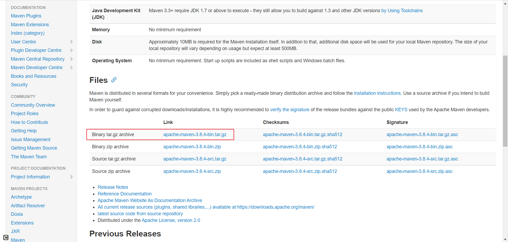
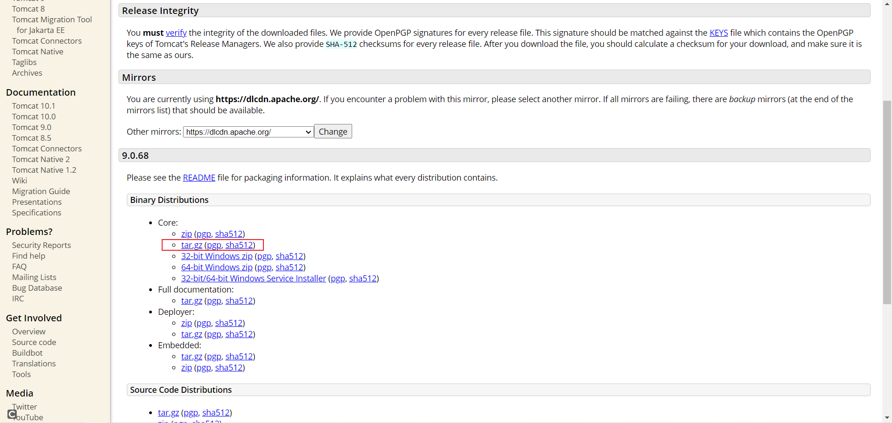
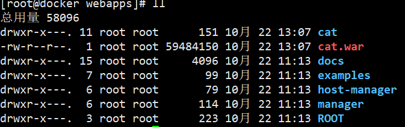

## 1、linux安装 Docker

> Docker 安装文档：https://docs.docker.com/install/linux/docker-ce/centos/

1. 卸载系统之前的docker

   ```
   sudo yum remove docker \
   docker-client \
   docker-client-latest \
   docker-common \
   docker-latest \
   docker-latest-logrotate \
   docker-logrotate \
   docker-engine
   ```

2. 安装Docker-CE

    - 安装必须的依赖

      ```
      sudo yum install -y yum-utils \
      device-mapper-persistent-data \
      lvm2
      ```

    - 设置docker repo 的yum 位置

      ```
      sudo yum-config-manager \
      --add-repo \
      https://download.docker.com/linux/centos/docker-ce.repo
      ```

    - 安装docker，以及docker-cli

      ```
      sudo yum install docker-ce docker-ce-cli containerd.io
      ```

3. 启动docker

   ```
   sudo systemctl start docker
   ```

    - 查看docker版本

      ```
      docker -v
      ```

    - 查看docker 镜像列表

      ```
      docker images
      ```

4. 设置开机自启动

   ```
   sudo systemctl enable docker
   ```

5. 测试docker 常用命令，注意切换到root 用户下

   > https://docs.docker.com/engine/reference/commandline/docker/

6. 配置docker 镜像加速

   > 阿里云，容器镜像服务
   > 针对Docker 客户端版本大于1.10.0 的用户
   > 您可以通过修改daemon 配置文件/etc/docker/daemon.json 来使用加速器


### 常见错误：

### 1、镜像名重复或已存在

```
docker: Error response from daemon: Conflict. The container name "/mysql" is already in use by container "9f52d88a12eadbfb81707191fe2c2090f5dcfbd1f6a7461d97e32ad947c2feab". You have to remove (or rename) that container to be able to reuse that name.
```

解法方法：

- 先查看镜像

  ```
  docker ps -a
  ```

  ```
  [root@xiaobear ~]# docker ps -a
  CONTAINER ID   IMAGE     COMMAND                  CREATED         STATUS                     PORTS     NAMES
  9f52d88a12ea   mysql     "docker-entrypoint.s…"   7 minutes ago   Exited (1) 7 minutes ago             mysql
  ```

- 移除`CONTAINER ID`名

  ```
  docker rm 9f52d88a12ea
  ```

- 再创建新的容器


## 2、linux安装jdk

1、先去官网下载好对应的linux版本的压缩包，https://www.oracle.com/java/technologies/downloads/#java8

2、将压缩包通过ftp进行上传至服务器

3、进入目录，进行解压

```
cd /压缩包目录
tar  -zxvf  jdk-8u131-linux-x64.tar.gz
```

4、进入环境变量文件

```
vi /etc/profile
```

5、增加环境变量

```bash
//JAVA_HOME=解压后的jdk路径(改成自己的)
export JAVA_HOME=/usr/local/java/jdk1.8.0_181
export PATH=$JAVA_HOME/bin:$PATH
```

6、配置文件生效

```
source /etc/profile
```

7、查看是否安装成功

```
java -version
```


## 3、linux安装 Nacos

1、从官网地址下载最新安装包：https://github.com/alibaba/nacos/releases

```
nacos-server-2.0.3.tar.gz
```

2、查看官方安装教程：https://nacos.io/zh-cn/docs/quick-start.html

3、解压nacos

```
tar -zvxf nacos-server-2.0.3.tar.gz
```

4、更改配置

```properties
server.port=8848
 
#*************** Network Related Configurations ***************#
### If prefer hostname over ip for Nacos server addresses in cluster.conf:
# nacos.inetutils.prefer-hostname-over-ip=false
 
### Specify local server's IP:
# nacos.inetutils.ip-address=
#*************** Config Module Related Configurations ***************#
### If use MySQL as datasource:
spring.datasource.platform=mysql
### Count of DB:
db.num=1
### Connect URL of DB:
db.url.0=jdbc:mysql://127.0.0.1:3306/ry-config?characterEncoding=utf8&connectTimeout=1000&socketTimeout=3000&autoReconnect=true&useUnicode=true&useSSL=false&serverTimezone=UTC
db.user=root
db.password=123456
### Connection pool configuration: hikariCP
db.pool.config.connectionTimeout=30000
db.pool.config.validationTimeout=10000
db.pool.config.maximumPoolSize=20
db.pool.config.minimumIdle=2
```

5、启动命令(standalone代表着单机模式运行，非集群模式)

```
cd nacos/bin
sh startup.sh -m standalone
```

6、关闭服务器

```
sh shutdown.sh
```

备注：

2.0以上版本记得多开放端口

Nacos2.0版本相比1.X新增了gRPC的通信方式，因此需要增加2个端口。新增端口是在配置的主端口(server.port)基础上，进行一定偏移量自动生成。

| 端口 | 与主端口的偏移量 | 描述                                                       |
| :--- | :--------------- | :--------------------------------------------------------- |
| 9848 | 1000             | 客户端gRPC请求服务端端口，用于客户端向服务端发起连接和请求 |
| 9849 | 1001             | 服务端gRPC请求服务端端口，用于服务间同步等                 |


## 4、linux安装 maven

1. 去官网下载对应的版本：https://maven.apache.org/download.cgi

   

2. 将下载好的 maven压缩文件置于指定的目录下：cd /root/tools/

3. 解压

   ```
   tar -zvxf apache-maven-3.8.4-bin.tar.gz
   ```

4. 配置环境变量，vi /etc/profile

   ```
   # 添加配置
   export MAVEN_HOME=/root/tools/apache-maven-3.8.4
   export PATH=$MAVEN_HOME/bin:$PATH
   ```

5. 重载配置文件

   ```
   source /etc/profile
   ```

6. 查看是否安装成功

   ```
   mvn -v
   ```

7. 配置settings，找到maven的安装路径下的conf/settings.xml文件

   ```xml
   <!--配置仓库地址-->
   <localRepository>/root/tools/apache-maven-3.8.4/repo</localRepository>
   
   <!--配置镜像仓库地址-->
   <mirror>
         <id>alimaven</id>
         <name>aliyun maven</name>
          <url>http://maven.aliyun.com/nexus/content/groups/public/</url>
         <mirrorOf>central</mirrorOf>
   </mirror>
   ```

8. 查看是否配置成功，执行命令，是否从镜像仓库下载

   ```
   mvn help:system
   ```


## 5、linux安装Nginx

### 1、yum安装

1. 安装命令

   ```
   yum -y install nginx   # 安装 nginx
   yum remove nginx  # 卸载 nginx
   ```

2. 配置文件路径，/etc/nginx目录下

3. 配置nginx

   ```
   systemctl enable nginx # 设置开机启动 
   service nginx start # 启动 nginx 服务
   service nginx stop # 停止 nginx 服务
   service nginx restart # 重启 nginx 服务
   service nginx reload # 重新加载配置，一般是在修改过 nginx 配置文件时使用。
   ```


## 6、linux安装MySQL

1. 检测系统是否自带安装 MySQL

   ```
   rpm -qa | grep mysql
   ```

2. 卸载

   ```
   rpm -e mysql　　// 普通删除模式
   rpm -e --nodeps mysql　　// 强力删除模式，如果使用上面命令删除时，提示有依赖的其它文件，则用该命令可以对其进行强力删除
   ```

## 7、Linux安装RabbitMQ
> 我使用的Linux搭建，搭建流程可参考官网：https://www.rabbitmq.com/install-rpm.html
>
> 查看系统版本号，Rabbitmq 对 Erlang 有版本要求，不能使用太旧的Erlang版本：https://www.rabbitmq.com/which-erlang.html
>
> Erlang下载地址：https://github.com/rabbitmq/erlang-rpm/releases


#### 1、下载rpm包

> - erlang-23.3.4.8-1.el7.x86_64.rpm
>
> - rabbitmq-server-3.10.5-1.el8.noarch.rpm


#### 2、上传至服务器

```
#创建存放目录
mkdir -p /usr/rabbitmq
```


#### 3、安装文件

```
[root@xiaobear rabbitmq]# rpm -Uvih erlang-25.0.2-1.el8.x86_64.rpm 
警告：erlang-25.0.2-1.el8.x86_64.rpm: 头V4 RSA/SHA256 Signature, 密钥 ID cc4bbe5b: NOKEY
错误：依赖检测失败：
	libcrypto.so.1.1()(64bit) 被 erlang-25.0.2-1.el8.x86_64 需要
	libcrypto.so.1.1(OPENSSL_1_1_0)(64bit) 被 erlang-25.0.2-1.el8.x86_64 需要
	libcrypto.so.1.1(OPENSSL_1_1_1)(64bit) 被 erlang-25.0.2-1.el8.x86_64 需要
	libstdc++.so.6(CXXABI_1.3.9)(64bit) 被 erlang-25.0.2-1.el8.x86_64 需要
	libtinfo.so.6()(64bit) 被 erlang-25.0.2-1.el8.x86_64 需要
	libz.so.1(ZLIB_1.2.7.1)(64bit) 被 erlang-25.0.2-1.el8.x86_64 需要
```

PS：这是因为下载版本的问题，el8下载的是8的版本，改回下载7的就可以了

我下载的版本：[erlang-23.3.4.8-1.el7.x86_64.rpm](https://github.com/rabbitmq/erlang-rpm/releases/download/v23.3.4.8/erlang-23.3.4.8-1.el7.x86_64.rpm)

```
[root@xiaobear rabbitmq]# rpm -Uivh erlang-23.3.4.8-1.el7.x86_64.rpm 
警告：erlang-23.3.4.8-1.el7.x86_64.rpm: 头V4 RSA/SHA256 Signature, 密钥 ID cc4bbe5b: NOKEY
准备中...                          ################################# [100%]
正在升级/安装...
   1:erlang-23.3.4.8-1.el7            ################################# [100%]
[root@xiaobear rabbitmq]# yum install socat -y
```

查看版本

```
# 测试
erl -version
```

`rabbitmq `在安装过程中需要依赖`socat`这个插件，需要先安装

```
[root@xiaobear rabbitmq]# rpm -ivh rabbitmq-server-3.10.5-1.el8.noarch.rpm 
警告：rabbitmq-server-3.10.5-1.el8.noarch.rpm: 头V4 RSA/SHA512 Signature, 密钥 ID 6026dfca: NOKEY
准备中...                          ################################# [100%]
正在升级/安装...
   1:rabbitmq-server-3.10.5-1.el8     ################################# [100%]
[root@xiaobear rabbitmq]# 
```


#### 4、常用命令

```
#开机启动 chkconfig rabbitmq-server on会转发到下面命令
systemctl enable rabbitmq-server.service
# 启动服务
systemctl start rabbitmq-server
# 查看服务状态，running表示启动成功
systemctl status rabbitmq-server.service
# 开机自启动
systemctl enable rabbitmq-server
# 停止服务
systemctl stop rabbitmq-server
```


#### 5、安装Web管理插件

```
rabbitmq-plugins enable rabbitmq_management
#安装完成后，重启服务
systemctl restart rabbitmq-server
```


#### 6、访问web页面

访问地址：服务器 IP+端口号（默认15672）,若没有反应，请开放端口，执行下面命令

```
# 防火墙开放15672端口
firewall-cmd --zone=public --add-port=15672/tcp --permanent
firewall-cmd --reload
```

注意：

- 在对应服务器（阿里云，腾讯云等）的安全组中开放`15672`端口（rabbitmq默认端口号），5672端口后续程序需要使用也要开放
- rabbitmq有一个默认账号和密码都是：`guest`默认情况只能在 localhost本计下访问，所以需要添加一个远程登录的用户


#### 7、添加用户

- 创建账号

  ```
  rabbitmqctl add_user admin admin123
  ```


- 分配角色

  ```
  rabbitmqctl set_user_tags admin administrator
  ```

  用户操作权限分四种级别：

   1. administrator：可以登录控制台、查看所有信息、可以对 rabbitmq进行管理
   2. monitoring：监控者 登录控制台，查看所有信息
   3. policymaker：策略制定者 登录控制台，指定策略
   4. managment 普通管理员 登录控制台

- 设置权限

  > `set_permissions [-p <vhostpath>] <user> <conf> <write> <read>`
  >
  > 用户 user_admin 具有/vhost1 这个 virtual host 中所有资源的配置、写、读权限当前用户和角色

  ```
  rabbitmqctl set_permissions -p "/" admin ".*" ".*" ".*"
  ```


- 再次访问登录，即可成功


#### 8、重置命令

```
#关闭应用的命令
rabbitmqctl stop_app
#清除的命令
rabbitmqctl reset
#重新启动命令
rabbitmqctl start_app
```


#### 9、其他命令

```
# 添加账号、密码
rabbitmqctl add_user
# 设置账号为管理员
rabbitmqctl set_user_tags 账号 administrator
# 修改账号密码
rabbitmqctl change_password Username Newpassword
# 查看用户清单
rabbitmqctl list_users
# 添加账号查看资源的权限
rabbitmqctl set_permissions -p / 用户名 ".*"".*"".*"
```

## 8、Linux安装Tomcat

1. 下载tomcat安装包，[链接](https://tomcat.apache.org/download-90.cgi)

   

2. 解压缩安装包，安装Tomcat

   ```
   tar -zxvf apache-tomcat-9.0.68.tar.gz
   ```

3. 进入Tomcat服务bin目录

   ```
   cd apache-tomcat-9.0.68/bin
   ```

4. 启动Tomcat

   ```
   [root@docker bin]# bash startup.sh 
   Using CATALINA_BASE:   /usr/xiaobear-study-tool/apache-tomcat-9.0.68
   Using CATALINA_HOME:   /usr/xiaobear-study-tool/apache-tomcat-9.0.68
   Using CATALINA_TMPDIR: /usr/xiaobear-study-tool/apache-tomcat-9.0.68/temp
   Using JRE_HOME:        /root/jre1.8.0_301
   Using CLASSPATH:       /usr/xiaobear-study-tool/apache-tomcat-9.0.68/bin/bootstrap.jar:/usr/xiaobear-study-tool/apache-tomcat-9.0.68/bin/tomcat-juli.jar
   Using CATALINA_OPTS:   
   Tomcat started.
   ```

5. 访问tomcat，是否启动成功，http://ip:8080

    - 若是没反应，则检查是否开启端口号，防火墙，[防火墙专题](https://javaxiaobear.gitee.io/notes/devTools/Linux.html#_11%E3%80%81%E9%98%B2%E7%81%AB%E5%A2%99)


## 9、Linux安装CAT链路追踪

1. 下载[CAT源码](https://github.com/dianping/cat), 如GIT方式过慢， 可用Download Zip 方式打包下载

2. 构建CAT服务war包
   可以导入IDEA工程进行编译， 或者直接用MAVEN进行编译，这里编译的目录是：`cat-home`
   将MAVEN加入到系统PATH， 执行mvn命令：

   ```sh
   mvn clean install -Dmaven.test.skip=true 
   ```

3. 创建数据库

   先创建CAT数据库， 采用utf8mb4字符集， 再导入{CAT_SRC}/script/目录下的CatApplication.sql脚本。

4. 创建目录，因为cat需要/data的全部权限，运行盘下的/data/appdatas/cat和/data/applogs/cat有读写权限

   ```
   mkdir /data/appdatas/cat/
   chmod -R 777 /data/appdatas/cat/
   ```

5. 将打包好的war包传入tomcat的webapp下

   

6. 创建客户端的配置/data/appdatas/cat/client.xml (客户端使用)

   ```xml
   <?xml version="1.0" encoding="utf-8"?>
   <config mode="client">
       <servers>
           <server ip="127.0.0.1" port="2280" http-port="8080"/>
       </servers>
   </config>
   ```

7. 创建服务端的配置/data/appdatas/cat/datasources.xml (服务端使用)

   ```xml
   <?xml version="1.0" encoding="utf-8"?>  
   <data-sources>
   <data-source id="cat">
   	<maximum-pool-size>3</maximum-pool-size>
   	<connection-timeout>1s</connection-timeout>
   	<idle-timeout>10m</idle-timeout>
   	<statement-cache-size>1000</statement-cache-size>
   	<properties>
   		<driver>com.mysql.jdbc.Driver</driver>
   		<url><![CDATA[jdbc:mysql://127.0.0.1:3306/cat]]></url>  <!-- 请替换为真实数据库URL及Port  -->
   		<user>root</user>  <!-- 请替换为真实数据库用户名  -->
   		<password>123456</password>  <!-- 请替换为真实数据库密码  -->
   		<connectionProperties><![CDATA[useUnicode=true&characterEncoding=UTF-8&autoReconnect=true&socketTimeout=120000]]></connectionProperties>
   	</properties>
   </data-source>
   </data-sources>
   ```


8. Tomcat配置，修改tomcat conf 目录下 server.xml， 检查好端口没有被其他程序占用。

   ```xml
   <Connector port="8080" protocol="HTTP/1.1"
           URIEncoding="utf-8"    connectionTimeout="20000"
               redirectPort="8443" />  <!-- 增加  URIEncoding="utf-8"  -->  
   ```

   如需内存不足，需作调整

   ```
   CATALINA_OPTS="-Xms1024m -Xmx2048m -Xss1024K  -XX:MetaspaceSize=512m -XX:MaxMetaspaceSize=1024m"
   ```

9. 启动

   进入tomcat bin目录下

   ```
   bash startup.sh
   ```

10. 访问cat客户端

    + 打开控制台地址： http://ip:8080/cat/s/config?op=routerConfigUpdate

    + 默认用户名：admin 默认密码：admin

    + 正常可以看到后台：

      


