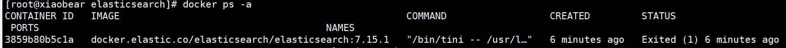

## 常用命令

1. 查询镜像

   ```
   docker search mysql
   ```

2. 拉取镜像

   ```
   docker pull 镜像名称[:version]
   ```

3. 删除镜像

   ```
   # 删除一个镜像
   docker rmi 镜像名称/id
   # 删除多个镜像
   docker rmi 镜像名称1/id1 镜像名称2/id2 ...
   # 删除所有镜像
   docker rmi `docker images ‐q`
   ```

4. 创建容器

   ```
   docker run [options] image command [ARG...]
   ```

   options选项: ‐i、‐t、‐d、‐‐name
   ‐i：交互式容器
   ‐t：tty，终端
   ‐d:后台运行，并且打印容器id

   --restart=always：docker 的容器自动在开机启动

   **创建的容器名称不能重复**

5. 进入容器

   ```
   #方式一
   docker attach 容器名称/id (ps:exit,容器停止)
   
   #方式二
   docker exec ‐it 容器名称/id /bin/bash （ps:exit,容器不会停止）
   ```

6. 查看容器

   ```
   docker ps：查看正在运行的容器
   docker ps ‐a：查看运行过的容器（历史）
   docker ps ‐l：最后一次运行的容器
   ```

7. 停止/启动容器

   ```
   docker start 容器名称/id
   docker stop 容器名称/id
   ```

8. 获取容器/镜像的元数据

   ```
   #查看容器/镜像全部信息：
   docker inspect 容器/镜像
   #查看容器/镜像部分信息：
   docker inspect ‐f='{{.NetworkSettings.IPAddress}}' 容器/镜像
   ‐f：可通过‐‐format代替
   ```

9. 删除容器

   ```
   #删除一个容器：
   docker rm 容器名称/id
   #删除多个容器：
   docker rm 容器名称1/id1 容器名称2/id2 ...
   #删除所有容器
   docker rm `docker ps ‐a ‐q`
   ```

   **PS：无法删除正在运行的容器**

10. 查看容器日志

    ```
    docker logs 容器名称/id
    ```

11. 文件拷贝

    ```
    docker cp 需要拷贝的文件或目录 容器名称:容器目录
    例如：docker cp 1.txt c2:/root
    ```


12. 目录挂载

    > 我们可以在创建容器的时候，将宿主机的目录与容器内的目录进行映射，这样我们就可以通过修改宿主机某个目录的文件从而去影响容器。
    >
    > 创建容器 添加-v参数 后边为 宿主机目录:容器目录

    ```
    docker run ‐id ‐‐name=c4 ‐v /opt/:/usr/local/myhtml centos
    ```

    如果你共享的是多级的目录，可能会出现权限不足的提示

    这是因为CentOS7中的安全模块selinux把权限禁掉了，我们需要添加参数 --privileged=true 来解决挂载的目录没有权限的问题

    ```
    docker run ‐id ‐‐privileged=true ‐‐name=c4 ‐v /opt/:/usr/local/myhtml centos
    ```


13. 创建容器时没有添加参数 `--restart=always` ，导致的后果是：当 Docker 重启时，容器未能自动启动。

    ```
    docker container update --restart=always 容器名字
    ```

14.


## 1、docker安装MySQL

1. 查看mysql可用的版本

   > 访问 MySQL 镜像库地址：https://hub.docker.com/_/mysql?tab=tags 。
   >
   > 可以通过 Sort by 查看其他版本的 MySQL，默认是最新版本 **mysql:latest** 。

2. 拉取 MySQL 镜像

   ```
   docker pull mysql:latest
   ```

3. 查看本地镜像

   ```
   docker images
   ```

4. 运行容器

   ```
   docker run -itd --name mysql -p 3306:3306 -e MYSQL_ROOT_PASSWORD=123456 mysql
   ```

    - **-p 3306:3306** ：映射容器服务的 3306 端口到宿主机的 3306 端口，外部主机可以直接通过 **宿主机ip:3306** 访问到 MySQL 的服务。
    - **MYSQL_ROOT_PASSWORD=123456**：设置 MySQL 服务 root 用户的密码。

5. 查看是否启动成功

   ```
   docker ps
   ```

6. MySQL 配置

   ```
   vim /mydata/mysql/conf/my.cnf
   ```

   ```
   [client]
   default-character-set=utf8
   
   [mysql]
   default-character-set=utf8
   
   [mysqld]
   init_connect='SET collation_connection = utf8_unicode_ci'
   init_connect='SET NAMES utf8'
   character-set-server=utf8
   collation-server=utf8_unicode_ci
   skip-character-set-client-handshake
   skip-name-resolve
   ```

7. 重启mysql

   ```
   docker restart mysql
   ```

8. 进入容器

   ```
   docker exec -it mysql bash
   ```

9. 登录mysql

   ```
   mysql -u root -p
   ALTER USER 'root'@'localhost' IDENTIFIED BY '123456';
   ```

10. 添加远程登录用户

    ```
    CREATE USER 'root'@'% IDENTIFIED WITH mysql_native_password BY '123456';
    
    alter user 'root'@'%' identified with mysql_native_password by '123456';
    ```

11. 授权使用

    ```
    GRANT ALL PRIVILEGES ON *.* TO 'root'@'%' WITH GRANT OPTION;
    ```


## 2、docker安装Redis

1. 查看可用的 Redis 版本

   > 访问 Redis 镜像库地址： https://hub.docker.com/_/redis?tab=tags。

2. 取最新版的 Redis 镜像

   ``` 
   docker pull redis
   ```

3. 查看本地镜像

   ```
   docker images
   ```

4. 运行容器

   ```
   docker run -itd --name redis -p 6379:6379 redis
   ```

    - **-p 6379:6379**：映射容器服务的 6379 端口到宿主机的 6379 端口。外部可以直接通过宿主机ip:6379 访问到 Redis 的服务

5. 查看运行状态

   ```
   docker ps
   ```

6. redis-cli 连接测试使用 redis 服务

   ```
   docker exec -it redis /bin/bash
   redis-
   ```

7.


## 3、docker安装Elasticsearch

> 官网镜像：https://hub.docker.com/_/elasticsearch/tags

1、取最新版的 elasticsearch镜像

```
docker pull docker.elastic.co/elasticsearch/elasticsearch:7.15.1 #存储和检索数据
```


2、查看本地镜像

```
docker images
```

3、运行容器

```
docker run --name elasticsearch -p 9200:9200 -p 9300:9300 \
-e "discovery.type=single-node" \
-e ES_JAVA_OPTS="-Xms64m -Xmx512m" \
-v /mydata/elasticsearch/config/elasticsearch.yml:/usr/share/elasticsearch/config/elasticsearch.yml \
-v /mydata/elasticsearch/data:/usr/share/elasticsearch/data \
-v /mydata/elasticsearch/plugins:/usr/share/elasticsearch/plugins \
-d docker.elastic.co/elasticsearch/elasticsearch:7.15.1
```

- `-p 9200:9200 -p 9300:9300`：这里是外部访问端口9200，elasticsearch集群内部端口9300
- `-e "discovery.type=single-node"`：以单节点方式启动
- `-e ES_JAVA_OPTS="-Xms64m -Xmx512m"`：设置内存，不然elasticsearch会全部占用，导致死机
- `-v /mydata/elasticsearch/plugins:/usr/share/elasticsearch/plugins \`：这里以它为例，进行目录挂载
- `-d docker.elastic.co/elasticsearch/elasticsearch:7.15.1`：启动容器的名称

4、查看运行状态

```
docker ps
```

5、发现突然就挂了，查看日志

```
docker logs elasticsearch
```

```
ElasticsearchException[failed to bind service]; nested: AccessDeniedException[/usr/share/elasticsearch/data/nodes];
Likely root cause: java.nio.file.AccessDeniedException: /usr/share/elasticsearch/data/nodes
	at java.base/sun.nio.fs.UnixException.translateToIOException(UnixException.java:90)
	at java.base/sun.nio.fs.UnixException.rethrowAsIOException(UnixException.java:106)
	at java.base/sun.nio.fs.UnixException.rethrowAsIOException(UnixException.java:111)
	at java.base/sun.nio.fs.UnixFileSystemProvider.createDirectory(UnixFileSystemProvider.java:398)
	at java.base/java.nio.file.Files.createDirectory(Files.java:700)
	at java.base/java.nio.file.Files.createAndCheckIsDirectory(Files.java:807)
	at java.base/java.nio.file.Files.createDirectories(Files.java:793)
	at org.elasticsearch.env.NodeEnvironment.lambda$new$0(NodeEnvironment.java:265)
	at org.elasticsearch.env.NodeEnvironment$NodeLock.<init>(NodeEnvironment.java:202)
	at org.elasticsearch.env.NodeEnvironment.<init>(NodeEnvironment.java:262)
	at org.elasticsearch.node.Node.<init>(Node.java:383)
	at org.elasticsearch.node.Node.<init>(Node.java:288)
	at org.elasticsearch.bootstrap.Bootstrap$5.<init>(Bootstrap.java:219)
	at org.elasticsearch.bootstrap.Bootstrap.setup(Bootstrap.java:219)
	at org.elasticsearch.bootstrap.Bootstrap.init(Bootstrap.java:399)
	at org.elasticsearch.bootstrap.Elasticsearch.init(Elasticsearch.java:167)
	at org.elasticsearch.bootstrap.Elasticsearch.execute(Elasticsearch.java:158)
	at org.elasticsearch.cli.EnvironmentAwareCommand.execute(EnvironmentAwareCommand.java:75)
	at org.elasticsearch.cli.Command.mainWithoutErrorHandling(Command.java:114)
	at org.elasticsearch.cli.Command.main(Command.java:79)
	at org.elasticsearch.bootstrap.Elasticsearch.main(Elasticsearch.java:123)
	at org.elasticsearch.bootstrap.Elasticsearch.main(Elasticsearch.java:81)
For complete error details, refer to the log at /usr/share/elasticsearch/logs/elasticsearch.log

```

ps：没有权限访问config目录

6、添加权限

```
chmod -R 777 /mydata/elasticsearch/ 保证权限
```

- `-R`：遍历改目录下的所有目录

7、重新启动

```
docker ps -a
```



```
docker start 385
```

8、查看运行状态

```
docker ps
```

9、外网访问 http://虚拟机ip:9200/

```
{
  "name" : "3859b80b5c1a",
  "cluster_name" : "elasticsearch",
  "cluster_uuid" : "dSKyudV8Qleuc_CXEIYvkA",
  "version" : {
    "number" : "7.15.1",
    "build_flavor" : "default",
    "build_type" : "docker",
    "build_hash" : "83c34f456ae29d60e94d886e455e6a3409bba9ed",
    "build_date" : "2021-10-07T21:56:19.031608185Z",
    "build_snapshot" : false,
    "lucene_version" : "8.9.0",
    "minimum_wire_compatibility_version" : "6.8.0",
    "minimum_index_compatibility_version" : "6.0.0-beta1"
  },
  "tagline" : "You Know, for Search"
}
```

11、运行kibana

```

```


## 4、docker安装Kibana

1. 取 kibana镜像

   ```
   docker pull docker.elastic.co/kibana/kibana:7.15.1
   ```

2. 运行kibana

   ```
   docker run --name kibana -e ELASTICSEARCH_HOSTS=http://192.168.222.129:9200 -p 5601:5601 \
   -d docker.elastic.co/kibana/kibana:7.15.1
   ```

    - `ELASTICSEARCH_HOSTS`：elasticsearch的安装服务器ip

3. 访问访问：http://ip:5601/

## 5、docker安装Nginx

1、启动一个nginx的实例，如果不存在实例，则会安装再启动

```
docker run -p 80:80 --name nginx -d nginx
```

2、将容器内的配置文件拷贝到当前目录，后面有个点

```
docker container cp nginx:/etc/nginx .
```

3、修改文件名称，把这个conf 移动到/mydata/nginx 下

```
mv nginx conf
```

4、终止原容器

```
docker stop nginx
```

5、删除容器

```
docker rm nginx
```

6、创建新的nginx

```
docker run -p 80:80 --name nginx \
-v /mydata/nginx/html:/usr/share/nginx/html \
-v /mydata/nginx/logs:/var/log/nginx \
-v /mydata/nginx/conf:/etc/nginx \
-d nginx
```

给nginx 的html 下面放的所有资源可以直接访问


## 6、docker安装Tomcat
### 1、正常安装
1、搜索镜像

```
docker search tomcat
```


2、拉取镜像

```
docker pull tomcat
```


3、查看镜像

```
docker images
```


4、创建容器示例

```
docker run -it -p 8080:8080 tomcat
```

- -p 小写，主机端口:docker容器端口
- -P 大写，随机分配端口
- i:交互
- t:终端
- d:后台

PS：宿主机8080映射到容器内的8080端口


#### 测试

访问http://[ip]:8080/


#### 解决

1. 可能没有映射端口或者没有关闭防火墙

2. 查看tomcat文件，把webapps.dist目录换成webapps

    1. 先后台启动tomcat

       ```
       docker run -d -p 8080:8080 tomcat
       ```

    2. 进入容器内部

       ```
       docker exec -it tomcat /bin/bash
       ```

    3. 查看文件目录，webapps.dist目录换成webapps

       ```
       root@90c2f8c553b0:/usr/local/tomcat# ls
       BUILDING.txt	 LICENSE  README.md	 RUNNING.txt  conf  logs	    temp     webapps.dist
       CONTRIBUTING.md  NOTICE   RELEASE-NOTES  bin	      lib   native-jni-lib  webapps  work
       root@90c2f8c553b0:/usr/local/tomcat# rm -f webapps
       rm: cannot remove 'webapps': Is a directory
       root@90c2f8c553b0:/usr/local/tomcat# rm -r webapps
       root@90c2f8c553b0:/usr/local/tomcat# mv webapps.dist webapps
       root@90c2f8c553b0:/usr/local/tomcat# ls
       BUILDING.txt	 LICENSE  README.md	 RUNNING.txt  conf  logs	    temp     work
       CONTRIBUTING.md  NOTICE   RELEASE-NOTES  bin	      lib   native-jni-lib  webapps
       root@90c2f8c553b0:/usr/local/tomcat# 
       ```

    4. 重新访问：http://[ip]:8080/


### 2、免修改版

#### 拉取镜像

```
docker pull billygoo/tomcat8-jdk8
```


#### 创建容器

```
docker run -d -p 8080:8080 --name mytomcat8 billygoo/tomcat8-jdk8
```


## 8、docker安装Nacos

1. 查看可用的版本

   ```
   docker search nacos
   ```

2. 拉取最新的版本

   ```
   # 下载镜像 https://hub.docker.com/ docker 官方搜索查看有哪些 nacos 镜像版本
   docker pull nacos/nacos-server
   ```

3. 启动容器，以单例模式启动

   ```
   docker run -d -p 8848:8848 --env MODE=standalone  --name nacos  nacos/nacos-server
   ```

4. 访问：http://192.168.130.135:8848/nacos

5. 如果出现404，则是没有开放对应的端口

   ```
   #查看开放端口
   firewall-cmd --list-port
   #防火墙开放8848端口
   firewall-cmd --zone=public --add-port=8848/tcp --permanent
   #重启防火墙
   firewall-cmd --reload
   ```


6. 为Nacos配置数据库，不然未启动30天后配置就消失了

    - 修改容器的配置文件

      ```
      #执行如下命令进入配置nacos
      docker exec -it nacos bash
      #修改conf/application.properties文件，可以修改可以覆盖如下
      #注意如果mysql也是使用docker启动的，需要指定mysql在docker中的ip，这里我只需要一个主数据库配置
      server.contextPath=/nacos
      server.servlet.contextPath=/nacos
      server.port=8848
      spring.datasource.platform=mysql
      db.num=1
      db.url.0=jdbc:mysql://127.0.0.1:3306/nacos?characterEncoding=utf8&connectTimeout=1000&socketTimeout=3000&autoReconnect=true
      db.user=root
      db.password=123456
      nacos.cmdb.dumpTaskInterval=3600
      nacos.cmdb.eventTaskInterval=10
      nacos.cmdb.labelTaskInterval=300
      nacos.cmdb.loadDataAtStart=false
      management.metrics.export.elastic.enabled=false
      management.metrics.export.influx.enabled=false
      server.tomcat.accesslog.enabled=true
      server.tomcat.accesslog.pattern=%h %l %u %t "%r" %s %b %D %{User-Agent}i
      nacos.security.ignore.urls=/,/**/*.css,/**/*.js,/**/*.html,/**/*.map,/**/*.svg,/**/*.png,/**/*.ico,/console-fe/public/**,/v1/auth/login,/v1/console/health/**,/v1/cs/**,/v1/ns/**,/v1/cmdb/**,/actuator/**,/v1/console/server/**
      nacos.naming.distro.taskDispatchThreadCount=1
      nacos.naming.distro.taskDispatchPeriod=200
      nacos.naming.distro.batchSyncKeyCount=1000
      nacos.naming.distro.initDataRatio=0.9
      nacos.naming.distro.syncRetryDelay=5000
      nacos.naming.data.warmup=true
      nacos.naming.expireInstance=true
      ```

      记得重启容器

      ```
      docker restart nacos
      ```


- 启动时配置

  ```
  docker run -d \
  -e TZ="Asia/Shanghai" \
  -e MODE=standalone \
  -e SPRING_DATASOURCE_PLATFORM=mysql \
  -e MYSQL_MASTER_SERVICE_HOST=192.168.101.11 \
  -e MYSQL_MASTER_SERVICE_PORT=3306 \
  -e MYSQL_MASTER_SERVICE_USER=root \
  -e MYSQL_MASTER_SERVICE_PASSWORD=root \
  -e MYSQL_MASTER_SERVICE_DB_NAME=nacos-config \
  -e MYSQL_SLAVE_SERVICE_HOST=192.168.101.11 \
  -p 8848:8848 \
  --expose=8848 \
  --name nacos \
  --restart=always \
  -v /root/nacos/standalone-logs/:/home/nacos/logs \
  nacos/nacos-server:1.1.0
  ```

  具体配置参数参考[官方文档](https://nacos.io/zh-cn/docs/quick-start-docker.html)，这里有个注意的是 `MYSQL_SLAVE_SERVICE_HOST `也需要配置


## 7、docker安装Elasticsearch-head

> 官网镜像：https://hub.docker.com/r/mobz/elasticsearch-head/tags

1. 搜索镜像

   ```
   docker search elasticsearch-head
   ```

2. 拉取镜像

   ```
   docker pull mobz/elasticsearch-head:5
   ```

3. 运行容器

   ```
   docker run --name es-head -d -p 9100:9100 mobz/elasticsearch-head:5
   ```

4. 访问是否正常：http://192.168.130.135:9100/


## 9、docker安装Seata

> docker镜像仓库：https://hub.docker.com/r/seataio/seata-server/tags

1. 搜索镜像

   ```
   docker search seataio/seata-server:1.5.0
   ```

2. 拉取镜像

   ```
   docker pull seataio/seata-server:1.5.0
   ```

3. 运行

   ```
   docker run -itd --name seata-server -p 8091:8091 -p 7091:7091 seataio/seata-server:1.5.0
   ```
    
