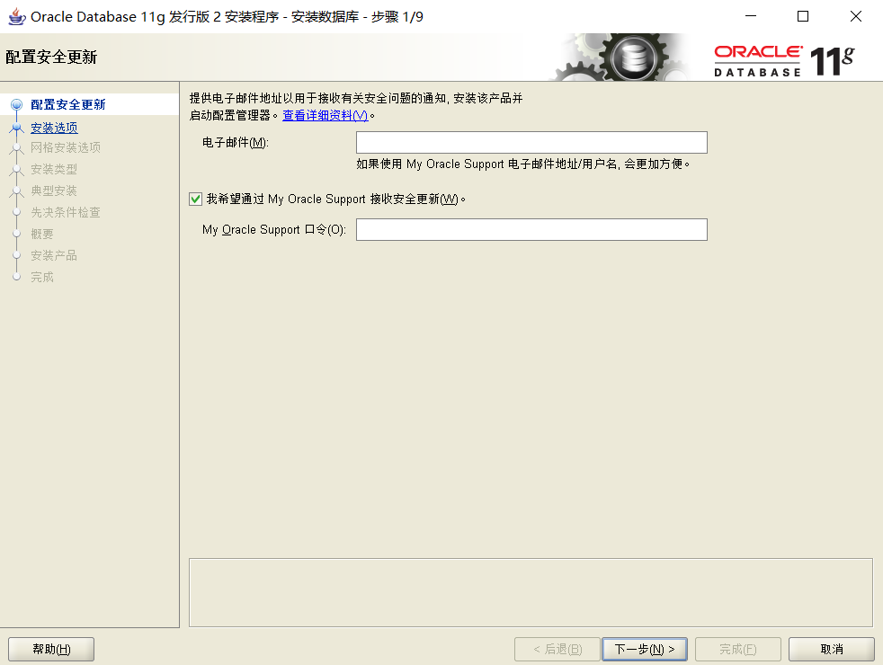

## 1、安装mysql(非安装版本)

1、将下载的zip文件解压至相应目录，例如C:\web\mysql-8.0.11

2、配置mysql的配置文件，在解压的文件下C:\web\mysql-8.0.11创建my.ini配置文件

```ini
[mysqld]
# 设置 3307 端口
port=3307
# 设置 mysql 的安装目录
basedir=D:\Java-tool\mysql\mysql-8.0.26-winx64-3307
# 设置 mysql 数据库的数据的存放目录
datadir=D:\Java-tool\mysql\mysql-8.0.26-winx64-3307\data
# 允许最大连接数
max_connections=200
# 允许连接失败的次数。这是为了防止有人从该主机试图攻击数据库系统
max_connect_errors=10
# 服务端使用的字符集默认为 UTF8
character-set-server=utf8
# 创建新表时将使用的默认存储引擎
default-storage-engine=INNODB
# 默认使用“mysql_native_password”插件认证
default_authentication_plugin=mysql_native_password

sql_mode='STRICT_TRANS_TABLES,NO_ZERO_IN_DATE,NO_ZERO_DATE,ERROR_FOR_DIVISION_BY_ZERO,NO_ENGINE_SUBSTITUTION'

[mysql]
# 设置 mysql 客户端默认字符集
default-character-set=utf8
[client]
# 设置 mysql 客户端连接服务端时默认使用的端口
port=3307
default-character-set=utf8
```

3、以管理员身份运行cmd，切换目录

```
cd C:\web\mysql-8.0.26\bin
```

4、初始化数据库

```
mysqld --initialize --console
```

执行完成后，会输出 root 用户的初始默认密码,如

```
2021-12-17T01:33:30.597838Z 6 [Note] [MY-010454] [Server] A temporary password is generated for root@localhost: q(rGq1!u2P)8
```

随机密码：`q(rGq1!u2P)8`

5、安装mysql

```
mysqld install
```

6、启动mysql

```
net start mysql
```

7、登录mysql

```
mysql -u root -p
```

输入密码即可:exclamation:


忘记密码教程：


## 2、安装JDK

1、下载JDk

:link:[下载地址](https://www.oracle.com/java/technologies/downloads/)，例如：:namibia:  jdk-8u311-windows-x64.exe

2、双击默认安装，可自行更改安装地址

3、配置环境变量

> 配置环境变量：右击“我的电脑”-->"属性"-->"高级系统设置"-->"环境变量"

#1、JAVA_HOME环境变量

> 配置方法：在系统变量里点击新建，变量名填写JAVA_HOME，变量值填写JDK的安装路径。（根据自己的安装路径填写）

```
JAVA_HOME  C:\Program Files\Java\jdk1.8.0_251
```

#2、CLASSPATH环境变量

> 配置方法： 新建CLASSPATH变量，变量值为：`.;%JAVA_HOME%\lib\dt.jar;%JAVA_HOME%\lib\tools.jar;`。CLASSPATH变量名字，可以大写也可以小写。注意不要忘记前面的点和中间的分号。且要在英文输入的状态下的分号和逗号。

```
CLASSPATH   .;%JAVA_HOME%\lib\dt.jar;%JAVA_HOME%\lib\tools.jar;
```

#3、path环境变量

> 在系统变量里找到Path变量，这是系统自带的，不用新建。双击Path，由于原来的变量值已经存在，故应在已有的变量后加上`;%JAVA_HOME%\bin;%JAVA_HOME%\jre\bin`。注意前面的分号。


4、测试

```
检验是否配置成功 运行cmd 分别输入java，javac， java -version （java 和 -version 之间有空格）。
```


## 3、安装maven

1、maven下载

> Maven 下载地址：http://maven.apache.org/download.cgi


2、解压至目录

> E:\Maven\apache-maven-3.3.9

3、添加环境变量

1. 添加环境变量`MAVEN_HOME`

   ```
   右键 "计算机"，选择 "属性"，之后点击 "高级系统设置"，点击"环境变量"，来设置环境变量，有以下系统变量需要配置：
   
   新建系统变量 MAVEN_HOME，变量值：E:\Maven\apache-maven-3.3.9
   ```

2. 编辑Path

   ```
   编辑系统变量 Path，添加变量值：;%MAVEN_HOME%\bin
   ```

4、测试

```
检验是否配置成功 运行cmd 输入mvn -v。
```


## 4、安装Redis

1、官网下载

[redis下载地址](https://github.com/MicrosoftArchive/redis/releases)，解压至相应目录

2、进入解压目录，启动redis

```
redis-server redis.windows.conf
```

3、安装服务至windows

```
redis-server --service-install redis.windows.conf
```

4、安装后的启动服务

```
redis-server --service-start
```

5、常用命令

```
卸载服务：redis-server --service-uninstall

开启服务：redis-server --service-start

停止服务：redis-server --service-stop
```

## 5、安装Oracle

1. 下载安装包

   Oracle 11g 官网下载地址：[点击下载](http://www.oracle.com/technetwork/cn/database/enterprise-edition/downloads/index.html)

2. 解压

3. 点击setup.exe文件安装

   

4. 配置更新安全

   这里可以不填写电子邮件，点击是即可

   

5. 安装选项，选择第一个【创建和配置数据库】，然后单击【下一步】按钮

   

6. 系统类，选择桌面类

   

7. 典型安装

   > 选择数据安装目录，填写管理员密码

   

8. 接下来自动安装数据库，大概5分钟左右安装完毕

   

9. 将文件复制到相应的文件夹并安装 Oracle 组件和服务。完成所需的时间需要几分钟，请耐心等待

   

10. 等待完成


