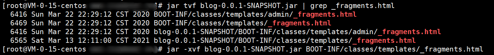
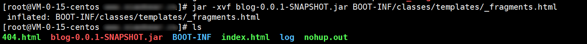
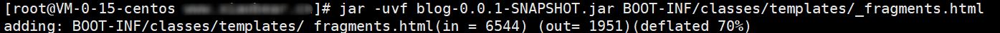

## 1、修改jar里的文件

1. 使用jar tvf jar名称 | grep 目标文件名 查询出目标文件在war包中的目录

2. 使用jar xvf jar名称 目标文件名(copy上面查出的全路径) 将目标文件及所在war包中的目录解压到当前路径

3. 修改目标文件的内容，或者将要新的目标文件替换掉提取出来的目标文件

4. 使用jar uvf jar名称 目标文件名（和步骤（2）中的目标文件名相同） 将新目标文件替换到 jar包中

#### 1、具体

这里以blog.jar为例进行操作

1、首先，查找你需要修改的文件

```shell
jar tvf blog-0.0.1-SNAPSHOT.jar | grep _fragments.html
```



2、解压文件到当前目录

```shell
jar -xvf blog-0.0.1-SNAPSHOT.jar BOOT-INF/classes/templates/_fragments.html
```



3、如果你有替换的文件就直接替换，没有则修改你需要修改的部分

```shell
vim _fragments.html
cp 文件 目标文件
```

4、将修改的新文件替换到jar包中

```shell
jar -uvf blog-0.0.1-SNAPSHOT.jar BOOT-INF/classes/templates/_fragments.html
```




## 2、关于centos 8下载依赖报错问题

```shell
Error: Failed to download metadata for repo 'appstream': Cannot prepare internal mirrorlist: No URLs in mirrorlist
```

**原因**

在2022年1月31日，CentOS团队终于从官方镜像中移除CentOS 8的所有包。

CentOS 8已于2021年12月31日寿终正非，但软件包仍在官方镜像上保留了一段时间。现在他们被转移到[https://vault.centos.org](https://vault.centos.org/)

**解决方法**

如果你仍然需要运行CentOS 8，你可以在/etc/yum.repos.d中更新一下源。使用[vault.centos.org](http://vault.centos.org/)代替[mirror.centos.org](http://mirror.centos.org/)。

```shell
sed -i -e "s|mirrorlist=|#mirrorlist=|g" /etc/yum.repos.d/CentOS-*
sed -i -e "s|#baseurl=http://mirror.centos.org|baseurl=http://vault.centos.org|g" /etc/yum.repos.d/CentOS-*
```


## 3、启动centos 没有ip，重启网卡失败，服务状态 Failed to start LSB: Bring up/down networking

> 解决方式：禁用NetworkManager
>
> 1. systemctl stop NetworkManager
> 2. systemctl disable NetworkManager
> 3. systemctl restart network
