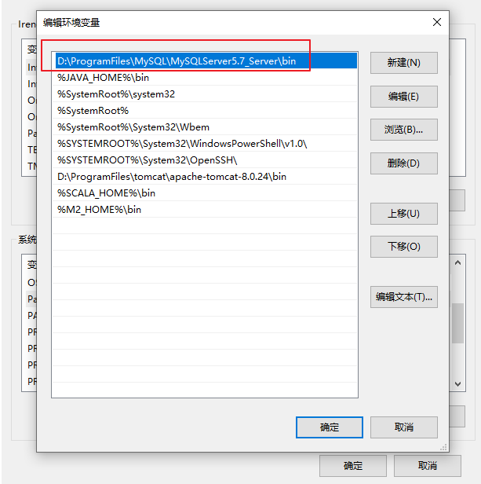
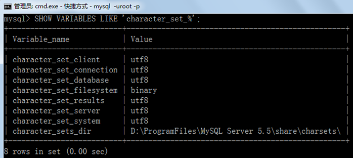
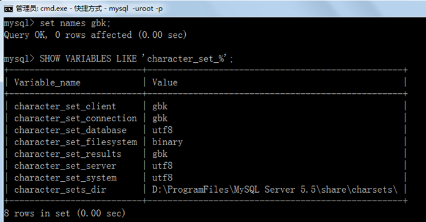

## 1、mysql忘记密码解决方法

1、停止mysql服务

```shell
net stop mysql
```

2、以管理员身份运行cmd

进入mysql的bin目录下，开启跳过密码验证登录的mysql服务

```
mysqld --console --skip-grant-tables --shared-memory
```

这个界面不要关闭

3、以管理员身份打开第二个CMD，进入mysql的bin目录下

```shell
#第一步：
mysql
#刷新权限
flush privileges;
#第二步，MySQL 5.7.6及更高版本
ALTER USER 'root'@'localhost' IDENTIFIED BY 'MyNewPass';
#MySQL 5.7.5及更早版本
SET PASSWORD FOR 'root'@'localhost' = PASSWORD('MyNewPass');
```

4、关闭第一个CMD程序，启动mysql服务

```shell
#启动mysql服务
net start mysql
#登录
mysql -u root -p
```

## 2、mysql数据库编码问题

1. 修改表的编码

   ```sql
   alter table 表名 character set utf8mb4;
   ```

2. 修改表中所有字段编码

   ```sql
   alter table 表名 convert to character set utf8mb4;
   ```


## 3、MYSQL安装出现问题（The service already exists）

1. 以管理员运行cmd

2. 查询mysql服务

   ```
   sc query mysql
   ```

3. 删除mysql

   ```
   sc delete mysql
   ```

## 4、mysql命令报“不是内部或外部命令”

> 如果输入mysql命令报“不是内部或外部命令”，把mysql安装目录的bin目录配置到环境变量path中。如下：




## 5、错误ERROR ：没有选择数据库就操作表格和数据

| ERROR 1046 (3D000): No database selected                     |
| ------------------------------------------------------------ |
| 解决方案一：就是使用“USE 数据库名;”语句，这样接下来的语句就默认针对这个数据库进行操作 |
| 解决方案二：就是所有的表对象前面都加上“数据库.”              |

## 6、命令行客户端的字符集问题

```shell
mysql> INSERT INTO t_stu VALUES(1,'张三','男');
ERROR 1366 (HY000): Incorrect string value: '\xD5\xC5\xC8\xFD' for column 'sname' at row 1
```

原因：服务器端认为你的客户端的字符集是utf-8，而实际上你的客户端的字符集是GBK。


查看所有字符集：**SHOW VARIABLES LIKE 'character_set_%';**



解决方案，设置当前连接的客户端字符集 **“SET NAMES GBK;”**




## 7、修改数据库和表的字符编码

修改编码：

（1)先停止服务，（2）修改my.ini文件（3）重新启动服务

说明：

如果是在修改my.ini之前建的库和表，那么库和表的编码还是原来的Latin1，要么删了重建，要么使用alter语句修改编码。

```mysql
mysql> create database 0728db charset Latin1;
Query OK, 1 row affected (0.00 sec)
```

```
mysql> use 0728db;
Database changed
```

```mysql
mysql> create table student (id int , name varchar(20)) charset Latin1;
Query OK, 0 rows affected (0.02 sec)


mysql> show create table student\G
*************************** 1. row ***************************
       Table: student
Create Table: CREATE TABLE `student` (
  `id` int(11) NOT NULL,
  `name` varchar(20) DEFAULT NULL,
  PRIMARY KEY (`id`)
) ENGINE=InnoDB DEFAULT CHARSET=latin1
1 row in set (0.00 sec)
```

```mysql
mysql> alter table student charset utf8; #修改表字符编码为UTF8
Query OK, 0 rows affected (0.01 sec)
Records: 0  Duplicates: 0  Warnings: 0


mysql> show create table student\G
*************************** 1. row ***************************
       Table: student
Create Table: CREATE TABLE `student` (
  `id` int(11) NOT NULL,
  `name` varchar(20) CHARACTER SET latin1 DEFAULT NULL,  #字段仍然是latin1编码
  PRIMARY KEY (`id`)
) ENGINE=InnoDB DEFAULT CHARSET=utf8
1 row in set (0.00 sec)


mysql> alter table student modify name varchar(20) charset utf8; #修改字段字符编码为UTF8
Query OK, 0 rows affected (0.05 sec)
Records: 0  Duplicates: 0  Warnings: 0


mysql> show create table student\G
*************************** 1. row ***************************
       Table: student
Create Table: CREATE TABLE `student` (
  `id` int(11) NOT NULL,
  `name` varchar(20) DEFAULT NULL,
  PRIMARY KEY (`id`)
) ENGINE=InnoDB DEFAULT CHARSET=utf8
1 row in set (0.00 sec)
```

```mysql
mysql> show create database 0728db;;
+--------+-----------------------------------------------------------------+
|Database| Create Database                                                 |
+------+-------------------------------------------------------------------+
|0728db| CREATE DATABASE `0728db` /*!40100 DEFAULT CHARACTER SET latin1 */ |
+------+-------------------------------------------------------------------+
1 row in set (0.00 sec)


mysql> alter database 0728db charset utf8; #修改数据库的字符编码为utf8
Query OK, 1 row affected (0.00 sec)


mysql> show create database 0728db;
+--------+-----------------------------------------------------------------+
|Database| Create Database                                                 |
+--------+-----------------------------------------------------------------+
| 0728db | CREATE DATABASE `0728db` /*!40100 DEFAULT CHARACTER SET utf8 */ |
+--------+-----------------------------------------------------------------+
1 row in set (0.00 sec)
```


## 8、MySQL 8以上的版本的数据导入到5.7的编码问题

提示**[ERR] 1273 - Unknown collation: ‘utf8mb4_0900_ai_ci’** ，原因是数据文件版本是SQL8，而本地数据库是SQL5.7

> - **方法一**：数据库升级到8
> - **方法二**：利用编辑器进行批量替换，把sql文件中所有的`utf8mb4`换成`utf8 `,`utf8mb4_0900_ai_ci`换成`utf8_general_ci`

## 9、使用`Group By`分组报错

> 报错信息：ERROR 1055 (42000): Expression #2 of SELECT list is not in GROUP BY clause and contains nonaggregated column 'school_db.SC.Cid' which is not functionally dependent on columns in GROUP BY clause; this is incompatible with sql_mode=only_full_group_by

ONLY_FULL_GROUP_BY的意思是：对于GROUP BY聚合操作，如果在SELECT中的列，没有在GROUP BY中出现，那么这个SQL是不合法的，因为列不在GROUP BY从句中，也就是说查出来的列必须在group by后面出现否则就会报错，或者这个字段出现在聚合函数里面。

**解决**

1. 查看`sql_mode`参数命令，查看是否存在ONLY_FULL_GROUP_BY这个配置

 ```sql
-- 查看ONLY_FULL_GROUP_BY 校验规则是否开启
 SELECT @@GLOBAL.sql_mode;
 SELECT @@SESSION.sql_mode;
 ```

2. 去除校验
   (1)第一种，通过命令去除

 ```sql
 -- 关闭only_full_group_by的规则校验
set @@GLOBAL.sql_mode='STRICT_TRANS_TABLES,NO_ZERO_IN_DATE,NO_ZERO_DATE,ERROR_FOR_DIVISION_BY_ZERO, NO_AUTO_CREATE_USER,NO_ENGINE_SUBSTITUTION';
set @@SESSION.sql_mode='STRICT_TRANS_TABLES,NO_ZERO_IN_DATE,NO_ZERO_DATE,ERROR_FOR_DIVISION_BY_ZERO, NO_AUTO_CREATE_USER,NO_ENGINE_SUBSTITUTION';
 ```

(2)第二种，通过修改配置文件my.ini

 ```
 在 [mysqld] 下面添加代码：
sql_mode=STRICT_TRANS_TABLES,NO_ZERO_IN_DATE,NO_ZERO_DATE,ERROR_FOR_DIVISION_BY_ZERO,NO_ENGINE_SUBSTITUTION
 ```

重启mysql服务


