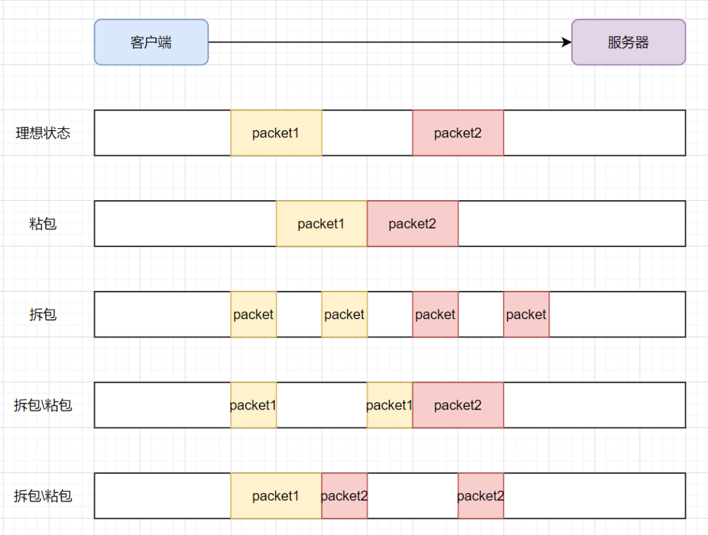

## 1、OSI 七层网络模型，你了解吗？具体功能有哪些？

> 网络的七层架构从下到上主要包括物理层、数据链路层、网络层、传输层、会话层、表示层和应用层；
>
> - **物理层**：主要定义物理设备标准，它的主要作用是传输比特流，具体做法是在发送端将1 、0 转化为电流强弱来进行传输，在到达目的地后再将电流强弱转化为l 、0 ， 也就是我们常说的模数转换与数模转换，这一层的数据叫作比特
> - **数据链路层**：主要用于对数据包中的MAC 地址进行解析和封装。这一层的数据叫作数据帧。在这一层工作的设备是网卡、网桥、交换机
> - **网络层**：主要用于对数据包中的 IP 地址进行封装和解析，这一层的数据叫作数据包。在这一层工作的设备有路由器、交换机、防火墙等
> - **传输层**：定义了传输数据的协议和端口号，主要用于数据的分段、传输和重组。在这一层工作的协议有TCP 和UDP 等。
    >   - TCP 是传输控制协议，传输效率低，可靠性强，用于传输对可靠性要求高、数据量大的数据，比如支付宝转账使用的就是
          >     TCP;
>   - UDP 是用户数据报协议，与TCP 的特性恰恰相反，用于传输可靠性要求不高、数据量小的数据，例如抖音等视频服务就使用了UDP 。
> - **会话层**：在传输层的基础上建立连接和管理会话，具体包括登录验证、断点续传、数据粘包与分包等。在设备之间需要互相识别的可以是IP ， 也可以是MAC 或者主机名。
> - **表示层**：主要对接收的数据进行解释、加密、解密、压缩、解压缩等，即把计算机能够识别的内容转换成人能够识别的内容（图片、声音、文字等）。
> - **应用层**：基于网络构建具体应用，例如FTP 文件上传下载服务、Telnet 服务、HTTP 服务、DNS 服务、SNMP 邮件服务等


## 2、TCP/IP四层模型？

> TCP/IP 不是指TCP 和IP 这两个协议的合称， 而是指因特网的整个TCP/IP 协议簇。
>
> **网络接口层**：定义了主机间网络连通的协议，具体包括Echernet 、FDDI 、ATM 等通信协议
>
> **网络层**：主要用于数据的传输、路由及地址的解析，以保障主机可以把数据发送给任何网络上的目标。数据经过网络传输，发送的顺序和到达的顺序可能发生变化。在网络层使用IP ( Internet Protocol ）和地址解析协议（ ARP ）
>
> **传输层**：使源端和目的端机器上的对等实体可以基于会话相互通信。在这一层定义了两个端到端的协议TCP 和UDP 。TCP 是面向连接的协议，提供可靠的报文传输和对上层应用的连接服务，除了基本的数据传输，它还有可靠性保证、流量控制、多路复用、优先权和安全性控制等功能。UDP 是面向无连接的不可靠传输的协议，主要用于不需要TCP 的排序和流量控制等功能的应用程序
>
> **应用层**：负责具体应用层协议的定义，包括
>
> - Telnet( TELecommunications NETwork ，虚拟终端协议）
> - FTP (File Transfer Protocol ,文件传输协议）
> - SMTP ( Simple Mail Transfer Protoco l ，电子邮件传输协议）
> - DNS (Domain Name Serv i ce ，域名服务）
> - NNTP (Net News Transfer Protoco l ,网上新闻传输协议）
> - HTTP ( HyperText Transfer Protoco l ，超文本传输协议）


## 3、说一下TCP的三次握手？

> 官方回答：
>
> 1. 客户端发送SYN ( seq=x ）报文给服务器端，进入SYN_SEND 状态。
> 2. 服务器端收到SYN 报文， 回应一个SYN (seq =y ） 和ACK ( ack=x+ I ）报文，进入SYN RECV 状态。
> 3. 客户端收到服务器端的SYN 报文， 回应一个ACK ( ack=y+ 1 ）报文，进入Established 状态
>
> 

## 4、为什么要三次握手？两次行不行？四次呢？

> 非官方解释三次握手
>
> 第一次握手：客户端发送网络包，服务端收到了。服务端得出结论：客户端的发送能力、服务端的接收能力是正常的。
>
> 第二次握手：服务端发包，客户端收到了。客户端得出结论：服务端的接收、发送能力，客户端的接收、发送能力是正常的。不过此时服务器并不能确认客户端的接收能力是否正常。
>
> 第三次握手：客户端发包，服务端收到了。服务端得出结论：客户端的接收、发送能力正常，服务器自己的发送、接收能力也正常。
>
> **三次握手能防止历史连接的建立，能减少双方不必要的资源开销，能帮助双方同步初始化序列号**
>
> 不使用「两次握手」和「四次握手」的原因：
>
> - 「两次握手」：无法防止历史连接的建立，会造成双方资源的浪费，也无法可靠的同步双方序列号；
> - 「四次握手」：三次握手就已经理论上最少可靠连接建立，所以不需要使用更多的通信次数。

## 5、为什么建立连接是三次握手，关闭连接确是四次挥手呢？

> TCP 在建立连接时要进行三次握手，在断开连接时要进行四次挥手，这是由于TCP的半关闭造成的。因为TCP 连接是全双工的（即数据可在两个方向上同时传递），所以在进行关闭时对每个方向都要单独进行关闭，这种单方向的关闭叫作半关闭。在二方完
> 成它的数据发送任务时，就发送一个FIN 来向另一方通告将要终止这个方向的连接。

## 6、TCP四次挥手的过程？

> 1. 客户端应用进程调用断开连接的请求，向服务器端发送一个终止标志位FIN = 1，seq=u 的消息，表示在客户端关闭链路前要发送的数据已经安全发送完毕，可以开始关闭链路操作，并请求服务器端确认关闭客户端到服务器的链路操作。此时客户端处于
     >    FIN-WAIT-l 状态。
> 2. 服务器在收到这个FIN 消息后返回一个ACK=l,ack=u+ 1 ,seq=v 的消息给客户端，表示接收到客户端断开链路的操作请求，这时TCP 服务器端进程通知高层应用进程释放客户端到服务器端的链路服务器处于CLOSE - WAIT 状态，即半关闭状态。客户端在收到消息后处于FIN - WAIT- 2 状态
> 3. 服务器端将关闭链路前需要发送给客户端的消息发送给客户端，在等待该数据发送完成后， 发送一个终止标志位FIN = l ,ACK= l ,seq=w,a ck= u+ 1 的消息给客户端，表示关闭链路前服务器需要向客户端发送的消息已经发送完毕，请求客户端确认关闭从服务器到客户端的链路操作， 此时服务器端处于LAS 下A C K 状态，等待客户端最终断开链路。
> 4. 客户端在接收到这个最终FI N 消息后，发送一个ACK = l ,seq=u + l ,ack=w+ I 的消息给服务器端，表示接收到服务器端的断开连接请求并准备断开服务器端到客户端的链路。此时客户端处于TIM-WA IT 状态， TCP 连接还没有释放，然后经过等待计时器
     >    ( 2MSL ）设置的时间后，客户端将进入CLOSE 状态。
>
> 

## 7、如果已经建立了连接，但是客户端突然出现故障了怎么办？

> TCP还设有一个保活计时器，显然，客户端如果出现故障，服务器不能一直等下去，白白浪费资源。服务器每收到一次客户端的请求后都会重新复位这个计时器，时间通常是设置为2小时，若两小时还没有收到客户端的任何数据，服务器就会发送一个探测报文段，以后每隔75秒发送一次。若一连发送10个探测报文仍然没反应，服务器就认为客户端出了故障，接着就关闭连接。

## 8、为什么客户端最后还要等待2MSL？

> MSL（Maximum Segment Lifetime），TCP允许不同的实现可以设置不同的MSL值。
>
> - 保证客户端发送的最后一个ACK报文能够到达服务器，因为这个ACK报文可能丢失，站在服务器的角度看来，我已经发送了FIN+ACK报文请求断开了，客户端还没有给我回应，应该是我发送的请求断开报文它没有收到，于是服务器又会重新发送一次，而客户端就能在这个2MSL时间段内收到这个重传的报文，接着给出回应报文，并且会重启2MSL计时器
> - 防止类似与“三次握手”中提到了的“已经失效的连接请求报文段”出现在本连接中。客户端发送完最后一个确认报文后，在这个2MSL时间中，就可以使本连接持续的时间内所产生的所有报文段都从网络中消失。这样新的连接中不会出现旧连接的请求报文

## 9、HTTP的原理？

> HTTP 是一个无状态的协议。无状态是指客户机（Web 浏览器）和服务器之间不需要建立持久的连接，这意味着当一个客户端向服务器端发出请求，然后服务器返回响应(response)，连接就被关闭了，在服务器端不保留连接的有关信息
>
> HTTP 遵循请求(Request)/应答(Response)模型。客户机（浏览器）向服务器发送请求，服务器处理请求并返回适当的应答。所有HTTP 连接都被构造成一套请求和应答。

## 10、如何理解HTTP协议是无状态的？

> 当浏览器第一次发送请求给服务器时，服务器响应了；如果同个浏览器发起第二次请求给服务器时，它还是会响应，但是呢，服务器不知道你就是刚才的那个浏览器。简言之，服务器不会去记住你是谁，所以是无状态协议.

## 11、从浏览器地址栏输入url到显示主页的过程？

> 1. 浏览器通过域名查找对应的ip地址
> 2. 浏览器与服务器通过三次握手建议TCP连接
> 3. 浏览器向服务器发送一个HTTP请求
> 4. 服务器处理请求（处理请求参数、cookie，生成HTML响应）
> 5. 服务器返回一个HTML响应
> 6. 浏览器解析渲染页面
> 7. TCP四次挥手，结束

## 12、HTTP的传输过程？

> 1. 地址解析： 地址解析通过域名系统DNS 解析服务器域名从而获得主机的IP 地址。例如， 用客户端的浏览器请求http ://localhost.com: 8080/index . htm ， 则可从中分解出协议名、主机名、端口、对象路径等部分结果如下。
     >    - 协议名： HTTP 。
>    - 主机名： localhost.com
>    - 端口： 8080
>    - 对象路径： /index. html
> 2. 封装HTTP 数据包： 解析协议名、主机名、端口、对象路径等并结合本机自己的信息封装成一个HTTP 请求数据包
> 3. 封装TCP 包： 将HTTP 请求数据包进一步封装成TCP 数据包。
> 4. 建立TCP 连接： 基于TCP 的三次握手机制建立TCP 连接。
> 5. 客户端发送请求： 在建立连接后，客户端发送一个请求给服务器
> 6. 服务器响应：服务器在接收到请求后，结合业务逻辑进行数据处理，然后向客户端返回相应的响应信息。在响应信息中包含状态行、协议版本号、成功或错误的代码、消息体等内容
> 7. 服务器关闭TCP 连接： 服务器在向浏览器发送请求响应数据后关闭TCP 连接。但如果浏览器或者服务器在消息头中加入了Connection: keep - alive ，则TCP 连接在请求响应数据发送后仍然保持连接状态，在下一次请求中浏览器可以继续使用相同的连接发送请求。采用keep-alive 方式不但减少了请求响应的时间，还节约了网络带宽和系统资源。

## 13、说下HTTP/1.0，1.1，2.0的区别？

> 简化版区别：
>
> HTTP/1.0：默认是短连接，可以强制开启，通过加入Connection: keep - alive
>
> - 默认使用**短连接**，每次请求都需要建立一个TCP连接
>
> HTTP/1.1：默认为长连接
>
> - 最主要的改进就是引入了持久连接。所谓的持久连接即**TCP连接默认不关闭，可以被多个请求复用**
> - 引入了管道机制（pipelining），即在同一个TCP连接里面，客户端可以同时发送多个请求。这样就进一步改进了HTTP协议的效率
>
> HTTP/2.0：多路复用
>
> - 多路复用：在一个连接里，客户端和浏览器都可以同时发送多个请求或回应，而且不用按照顺序一一对应
> - 做了Header压缩、服务端推送等优化

## 14、说一下TCP与UDP的区别？

| 区别               | TCP          | UDP         |
| ------------------ | ------------ | ----------- |
| 可靠性传输         | 可靠         | 不可靠      |
| 连接               | 面向连接     | 无连接      |
| 传输数据有序性     | 有序         | 无序        |
| 传输速度           | 相对UDP较慢  | 较快        |
| 流量控制和拥塞控制 | 有           | 没有        |
| 字节               | 首部有20字节 | 首部有8字节 |
| 报文格式           | 面向字节流   | 面向报文    |
| 适用场景           | 网页、邮件   | 语音广播    |


## 15、HTTP 如何实现长连接？在什么时候会超时？

> 通过在头部（请求和响应头）设置**Connection**字段指定为`keep-alive`，HTTP/1.0协议支持，但是是默认关闭的，从HTTP/1.1以后，连接默认都是长连接。
>
> HTTP一般会有httpd守护进程，里面可以设置**keep-alive timeout**，当tcp连接闲置超过这个时间就会关闭，也可以在HTTP的header里面设置超时时间；TCP 的**keep-alive**包含三个参数，支持在系统内核的net.ipv4里面设置；当 TCP 连接之后，闲置了**tcp_keepalive_time**，则会发生侦测包，如果没有收到对方的ACK，那么会每隔 tcp_keepalive_intvl再发一次，直到发送了**tcp_keepalive_probes**，就会丢弃该连接。
>
> ```
> 1. tcp_keepalive_intvl = 15
> 2. tcp_keepalive_probes = 5
> 3. tcp_keepalive_time = 1800
> ```

## 16、说说HTTP常用的状态码及其含义？

| 状态码 | 类别             |
| ------ | ---------------- |
| 1XX    | 信息性状态码     |
| 2XX    | 成功类状态码     |
| 3XX    | 重定向状态码     |
| 4XX    | 客户端错误状态码 |
| 5XX    | 服务端错误状态码 |


## 17、什么是HTTPS？

> HTTPS 是以安全为目标的HTTP 通道，它在HTTP 中加入SSL 层以提高数据传输的安全性。
>
> HTTP 被用于在Web 浏览器和网站服务器之间传递信息，但以明文方式发送内容，不提供任何方式的数据加密，如果攻击者截取了Web 浏览器和网站服务器之间的传输报文，就可以直接读懂其中的信息，因此HTTP 不适合传输一些敏感信息，比如身份证号码、密码等。为了数据传输的安全， HTTPS 在HTTP 的基础上加入了SSL 协议，SSL 依靠证书来验证服务器的身份，并对浏览器和服务器之间的通信进行数据加密，以保障数据传输的安全性，其端口一般是443 。

## 18、HTTPS的加密流程是怎样的？

> 1. 发起请求： 客户端在通过TCP 和服务器建立连接之后（ 443 端口），发出一个请求证书的消息给服务器，在该请求消息里包含自己可实现的算法列表和其他需要的消息。
> 2. 证书返回：服务器端在收到消息后回应客户端并返回证书，在证书中包含服务器信息、域名、申请证书的公司、公钥、数据加密算法等。
> 3. 证书验证： 客户端在收到证书后，判断证书签发机构是否正确，并使用该签发机构的公钥确认签名是否有效， 客户端还会确保在证书中列出的域名就是它正在连接的域名。如果客户端确认证书有效，则生成对称密钥，并使用公钥将对称密钥加密。
> 4. 密钥交换： 客户端将加密后的对称密钥发送给服务器，服务器在接收到对称密钥后使用私钥解密
> 5. 数据传输： 经过上述步骤，客户端和服务器就完成了密钥对的交换， 在之后的数据传输过程中， 客户端和服务端就可以基于对称加密（ 加密和解密使用相同密钥的加密算法）对数据加密后在网络上传输，保证了网络数据传输的安全性。


## 19、HTTP 与 HTTPS 的区别？

|              | HTTP   | HTTPS |
| ------------ | ------ | ----- |
| 安全性       | 不安全 | 安全  |
| 默认端口     | 80     | 443   |
| 资源消耗     | 较少   | 较多  |
| 是否需要证书 | 不需要 | 需要  |
| 报文是否加密 | 明文   | 密文  |

## 20、HTTP 常用的请求方式，区别和用途？

| 请求方式 | 用途                                                    |
| -------- | ------------------------------------------------------- |
| GET      | 对服务资源获取的简单请求                                |
| POST     | 用于发送包含用户提交数据的请求                          |
| PUT      | 向服务提交数据，以修改数据                              |
| DELETE   | 删除服务器上的某些资源                                  |
| HEAD     | 请求页面的首部，获取资源的元信息                        |
| CONNECT  | HTTP/1.1 协议中预留给能够将连接改为管道方式的代理服务器 |
| OPTIONS  | 允许客户端查看服务器的性能                              |
| TRACE    | 回显服务器收到的请求，主要用于测试或诊断                |
| PATCH    | 是对 PUT 方法的补充，用来对已知资源进行局部更新         |


## 21、TCP的粘包和拆包？

> TCP是面向流，没有界限的一串数据。TCP底层并不了解上层业务数据的具体含义，它会根据TCP缓冲区的实际情况进行包的划分，所以在业务上认为，一**个完整的包可能会被TCP拆分成多个包进行发送**，**也有可能把多个小的包封装成一个大的数据包发送**，这就是所谓的TCP粘包和拆包问题
>
> 
>
> **为什么会产生粘包和拆包呢?**
>
> - 要发送的数据小于TCP发送缓冲区的大小，TCP将多次写入缓冲区的数据一次发送出去，将会发生粘包；
> - 接收数据端的应用层没有及时读取接收缓冲区中的数据，将发生粘包；
> - 要发送的数据大于TCP发送缓冲区剩余空间大小，将会发生拆包；
> - 待发送数据大于MSS（最大报文长度），TCP在传输前将进行拆包。即TCP报文长度-TCP头部长度>MSS
>
> **如何解决？**
>
> - 发送端将每个数据包封装为固定长度
> - 在数据尾部增加特殊字符进行分割
> - 将数据分为两部分，一部分是头部，一部分是内容体；其中头部结构大小固定，且有一个字段声明内容体的大小

## 22、说一下TCP的流量控制？

> TCP三次握手，发送端和接收端进入到ESTABLISHED状态，它们即可以愉快地传输数据啦。
>
> 但是发送端不能疯狂地向接收端发送数据，因为接收端接收不过来的话，接收方只能把处理不过来的数据存在缓存区里。如果缓存区都满了，发送方还在疯狂发送数据的话，接收方只能把收到的数据包丢掉，这就浪费了网络资源啦
>
> TCP 提供一种机制可以让发送端根据接收端的实际接收能力控制发送的数据量，这就是**流量控制**

## 23、IP地址有哪些分类？

> 一般可以这么认为，IP地址=网络号+主机号。
>
> 1. 网络号：它标志主机所连接的网络地址表示属于互联网的哪一个网络。
> 2. 主机号：它标志主机地址表示其属于该网络中的哪一台主机
>
> IP地址分为A，B，C，D，E五大类：
>
> - A类地址(1~126)：以0开头，网络号占前8位，主机号占后面24位。
> - B类地址(128~191)：以10开头，网络号占前16位，主机号占后面16位。
> - C类地址(192~223)：以110开头，网络号占前24位，主机号占后面8位。
> - D类地址(224~239)：以1110开头，保留位多播地址。
> - E类地址(240~255)：以11110开头，保留位为将来使用
>
> 

## 24、说下ARP 协议的工作过程？

> ARP 协议协议，**Address Resolution Protocol**，地址解析协议，它是用于实现IP地址到MAC地址的映射
>
> 当源主机和目的主机要进行通信时
>
> 1. 当源主机需要将一个数据包要发送到目的主机时，会首先检查自己的ARP列表，是否存在该IP地址对应的MAC地址；如果有，就直接将数据包发送到这个MAC地址
> 2. 如果没有，就向本地网段发起一个ARP请求的广播包，查询此目的主机对应的MAC地址。此ARP请求的数据包里，包括源主机的IP地址、硬件地址、以及目的主机的IP地址
> 3. 网络中所有的主机收到这个ARP请求后，会检查数据包中的目的IP是否和自己的IP地址一致。如果不相同，就会忽略此数据包；如果相同，该主机首先将发送端的MAC地址和IP地址添加到自己的ARP列表中，如果ARP表中已经存在该IP的信息，则将其覆盖，然后给源主机发送一个 ARP响应数据包，告诉对方自己是它需要查找的MAC地址
> 4. 源主机收到这个ARP响应数据包后，将得到的目的主机的IP地址和MAC地址添加到自己的ARP列表中，并利用此信息开始数据的传输。如果源主机一直没有收到ARP响应数据包，表示ARP查询失败

## 25、TCP 和 UDP 分别对应的常见应用层协议有哪些？

> **基于TCP的应用层协议有：HTTP、FTP、SMTP、TELNET、SSH**
>
> - **HTTP**：HyperText Transfer Protocol（超文本传输协议），默认端口80
> - **FTP**: File Transfer Protocol (文件传输协议), 默认端口(20用于传输数据，21用于传输控制信息)
> - **SMTP**: Simple Mail Transfer Protocol (简单邮件传输协议) ,默认端口25
> - **TELNET**: Teletype over the Network (网络电传), 默认端口23
> - **SSH**：Secure Shell（安全外壳协议），默认端口 22
>
> **基于UDP的应用层协议：DNS、TFTP、SNMP**
>
> - **DNS** : Domain Name Service (域名服务),默认端口 53
> - **TFTP**: Trivial File Transfer Protocol (简单文件传输协议)，默认端口69
> - **SNMP**：Simple Network Management Protocol（简单网络管理协议），通过UDP端口161接收，只有Trap信息采用UDP端口162。

## 26、 URI和URL的区别？

> - URI，全称是Uniform Resource Identifier)，中文翻译是统一资源标志符，主要作用是唯一标识一个资源。
> - URL，全称是Uniform Resource Location)，中文翻译是统一资源定位符，主要作用是提供资源的路径
>
> URI像是身份证，可以唯一标识一个人，而URL更像一个住址，可以通过URL找到这个人

## 27、说一下TCP的拥塞控制？

> 官方回答：**TCP拥塞控制**是[传输控制协议](https://zh.m.wikipedia.org/wiki/传输控制协议)（英语：Transmission Control Protocol，缩写TCP）避免网络拥塞的算法，是[互联网](https://zh.m.wikipedia.org/wiki/互联网)上主要的一个[拥塞控制](https://zh.m.wikipedia.org/wiki/拥塞控制)措施。它使用一套基于[线增积减模式](https://zh.m.wikipedia.org/wiki/和性增长/乘性降低)的多样化网络拥塞控制方法（包括慢启动和拥塞窗口等模式）来控制拥塞。
>
> **拥塞控制**，控制的目的就是**避免「发送方」的数据填满整个网络**。
>
> 为了在「发送方」调节所要发送数据的量，定义了一个叫做「**拥塞窗口**」的概念
>
> **拥塞窗口 cwnd**是发送方维护的一个的状态变量，它会根据**网络的拥塞程度动态变化的**。
>
> 拥塞窗口 `cwnd` 变化的规则：
>
> - 只要网络中没有出现拥塞，`cwnd` 就会增大；
> - 但网络中出现了拥塞，`cwnd` 就减少
>
> 其实只要「发送方」没有在规定时间内接收到 ACK 应答报文，也就是**发生了超时重传，就会认为网络出现了拥塞**

## 28、TCP拥塞控制的算法有哪些？

> 1. 慢启动
> 2. 拥塞避免
> 3. 拥塞发生
> 4. 快速恢复
>
> 具体详情参考文章：https://xiaolincoding.com/network/3_tcp/tcp_feature.html#%E9%87%8D%E4%BC%A0%E6%9C%BA%E5%88%B6

## 29、拔掉网线后，原有的TCP连接还在吗？

> TCP 连接在 Linux 内核中是一个名为 `struct socket` 的结构体，该结构体的内容包含 TCP 连接的状态等信息。当拔掉网线的时候，操作系统并不会变更该结构体的任何内容，所以 TCP 连接的状态也不会发生改变。

## 30、TCP Keepalive 和 HTTP Keep-Alive 是一个东西吗？

> - HTTP 的 Keep-Alive，是由**应用层（用户态）** 实现的，称为 HTTP 长连接；
> - TCP 的 Keepalive，是由 **TCP 层（内核态）** 实现的，称为 TCP 保活机制；

## 31、HTTP缓存有哪些？

> - 强制缓存：只要浏览器判断缓存没有过期，则直接使用浏览器的本地缓存，决定是否使用缓存的主动性在于浏览器这边
> - 协商缓存：通过服务端告知客户端是否可以使用缓存的方式，**协商缓存就是与服务端协商之后，通过协商结果来判断是否使用本地缓存**。

## 32、HTTPS一定安全可靠吗？

> 从协议本身来说，HTTPS协议目前是没有任何漏洞的，即使你成功进行中间人攻击，本质上是利用了客户端的漏洞（用户点击继续访问或者被恶意导入伪造的根证书），并不是 HTTPS 不够安全。

## 33、HTTPS解决了HTTP的哪些问题？

> HTTP 由于是明文传输，所以安全上存在以下三个风险：
>
> - **窃听风险**，比如通信链路上可以获取通信内容，用户号容易没。
> - **篡改风险**，比如强制植入垃圾广告，视觉污染，用户眼容易瞎。
> - **冒充风险**，比如冒充淘宝网站，用户钱容易没。
>
> HTTP**S** 在 HTTP 与 TCP 层之间加入了 `SSL/TLS` 协议，可以很好的解决了上述的风险：
>
> - **信息加密**：交互信息无法被窃取，但你的号会因为「自身忘记」账号而没。
> - **校验机制**：无法篡改通信内容，篡改了就不能正常显示，但百度「竞价排名」依然可以搜索垃圾广告。
> - **身份证书**：证明淘宝是真的淘宝网，但你的钱还是会因为「剁手」而没。
>
> **混合加密**的方式实现信息的**机密性**，解决了窃听的风险。
>
> **摘要算法**的方式来实现**完整性**，它能够为数据生成独一无二的「指纹」，指纹用于校验数据的完整性，解决了篡改的风险。
>
> 将服务器公钥放入到**数字证书**中，解决了冒充的风险。

## 34、TCP 和 UDP 可以同时绑定相同的端口吗？

> 可以。
>
> 传输层的「端口号」的作用，是为了区分同一个主机上不同应用程序的数据包。
>
> 传输层有两个传输协议分别是 TCP 和 UDP，在内核中是两个完全独立的软件模块。
>
> 当主机收到数据包后，可以在 IP 包头的「协议号」字段知道该数据包是 TCP/UDP，所以可以根据这个信息确定送给哪个模块（TCP/UDP）处理，送给 TCP/UDP 模块的报文根据「端口号」确定送给哪个应用程序处理。

## 35、 多个 TCP 服务进程可以绑定同一个端口吗？

> 如果两个 TCP 服务进程同时绑定的 IP 地址和端口都相同，那么执行 bind() 时候就会出错，错误是“Address already in use”
>
> 如果两个TCP服务进程绑定的IP地址不同，端口相同，则可以绑定(不包含0.0.0.0，可以代表任意地址）

## 36、客户端的端口可以重复使用吗？

> 在客户端执行 connect 函数的时候，只要客户端连接的服务器不是同一个，内核允许端口重复使用。
>
> TCP 连接是由四元组（源IP地址，源端口，目的IP地址，目的端口）唯一确认的，那么只要四元组中其中一个元素发生了变化，那么就表示不同的 TCP 连接的。
>
> 所以，如果客户端已使用端口 64992 与服务端 A 建立了连接，那么客户端要与服务端 B 建立连接，还是可以使用端口 64992 的，因为内核是通过四元祖信息来定位一个 TCP 连接的，并不会因为客户端的端口号相同，而导致连接冲突的问题。

## 37、客户端 TCP 连接 TIME_WAIT 状态过多，会导致端口资源耗尽而无法建立新的连接吗？

> 要看客户端是否都是与同一个服务器（目标地址和目标端口一样）建立连接。
>
> 如果客户端都是与同一个服务器（目标地址和目标端口一样）建立连接，那么如果客户端 TIME_WAIT 状态的连接过多，当端口资源被耗尽，就无法与这个服务器再建立连接了。即使在这种状态下，还是可以与其他服务器建立连接的，只要客户端连接的服务器不是同一个，那么端口是重复使用的。

## 38、HTTPS TSL和TCP能同时握手吗？

> HTTPS 是先进行 TCP 三次握手，再进行 TLSv1.2 四次握手
>
> 同时握手的前提：
>
> - **客户端和服务端都开启了 TCP Fast Open 功能，且 TLS 版本是 1.3；**
> - **客户端和服务端已经完成过一次通信；**

## 39、如何在 Linux 系统中查看 TCP 状态？

> TCP 的连接状态查看，在 Linux 可以通过 `netstat -napt` 命令查看
>
> 

## 40、为什么每次建立 TCP 连接时，初始化的序列号都要求不一样呢？

> - 为了防止历史报文被下一个相同四元组（源地址、源端口、目的地址、目的端口）的连接接收（主要方面）；
> - 了安全性，防止黑客伪造的相同序列号的 TCP 报文被对方接收；

## 41、TCP第一次握手丢失了，会发生什么？

> 当客户端想和服务端建立 TCP 连接的时候，首先第一个发的就是 SYN 报文，然后进入到 `SYN_SENT` 状态。
>
> 此时客户端迟迟收不到服务端发送的SYN+ACK报文，就会触发**超时重传**机制，重传 SYN 报文，而且**重传的 SYN 报文的序列号都是一样的**
>
> 在 Linux 里，客户端的 SYN 报文最大重传次数由 `tcp_syn_retries`内核参数控制，这个参数是可以自定义的，默认值一般是 5。
>
> ```
> # cat /proc/sys/net/ipv4/tcp_syn_retries
> 5
> ```
>
> 通常，第一次超时重传是在 1 秒后，第二次超时重传是在 2 秒，第三次超时重传是在 4 秒后，第四次超时重传是在 8 秒后，第五次是在超时重传 16 秒后。没错，**每次超时的时间是上一次的 2 倍**。
>
> 当第五次超时重传后，会继续等待 32 秒，如果服务端仍然没有回应 ACK，客户端就不再发送 SYN 包，然后断开 TCP 连接。

## 42、TCP第二次握手丢失了，会发生什么？

> - 客户端会重传 SYN 报文，也就是第一次握手，最大重传次数由 `tcp_syn_retries`内核参数决定；
> - 服务端会重传 SYN-ACK 报文，也就是第二次握手，最大重传次数由 `tcp_synack_retries` 内核参数决定

## 43、TCP第三次握手丢失了，会发生什么？

> 第三次握手过程：客户端收到服务端的 SYN-ACK 报文后，就会给服务端回一个 ACK 报文，也就是第三次握手，此时客户端状态进入到 `ESTABLISH` 状态。
>
> 因为这个第三次握手的 ACK 是对第二次握手的 SYN 的确认报文，所以当第三次握手丢失了，如果服务端那一方迟迟收不到这个确认报文，就会触发超时重传机制，重传 SYN-ACK 报文，直到收到第三次握手，或者达到最大重传次数。
>
> 注意，**ACK 报文是不会有重传的，当 ACK 丢失了，就由对方重传对应的报文**。
