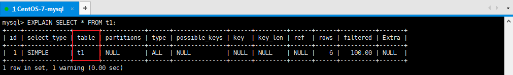
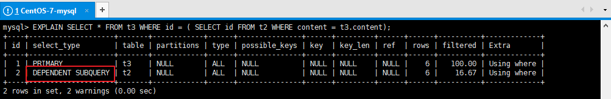
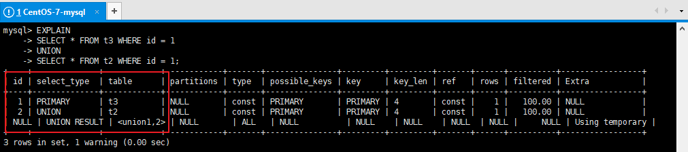
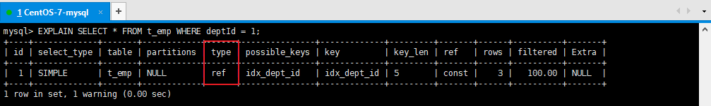
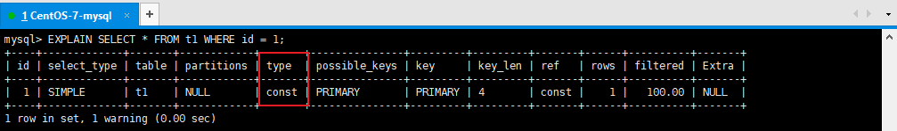
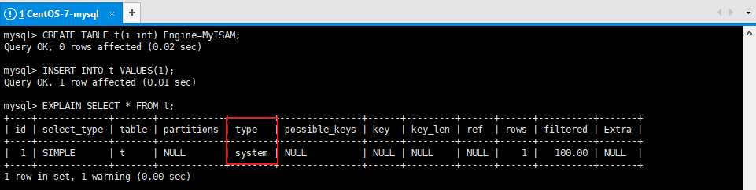
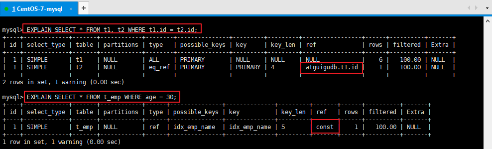
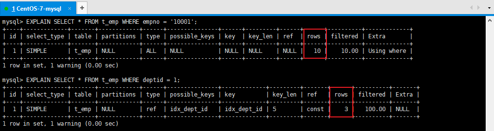
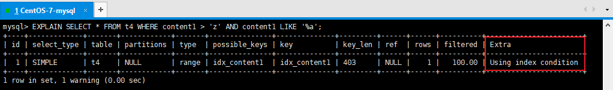
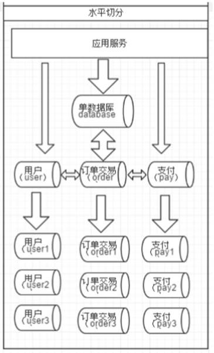

### 102、可以使用MySQL直接存储文件吗？

> 可以使用 BLOB (binary large object)，用来存储二进制大对象的字段类型。
>
> TinyBlob 255 值的长度加上用于记录长度的1个字节(8位)
>
> Blob 65K值的长度加上用于记录长度的2个字节(16位)
>
> MediumBlob 16M值的长度加上用于记录长度的3个字节(24位)
>
> LongBlob 4G 值的长度加上用于记录长度的4个字节(32位)。

### 103、什么时候存，什么时候不存？

> 存：需要高效查询并且文件很小的时候
>
> 不存：文件比较大，数据量多或变更频繁的时候

### 104	存储的时候有遇到过什么问题吗？

> 1. 上传数据过大sql执行失败 调整max_allowed_packet
> 2. 主从同步数据时比较慢
> 3. 应用线程阻塞
> 4. 占用网络带宽
> 5. 高频访问的图片无法使用浏览器缓存

### 105	Emoji乱码怎么办？

> 使用utf8mb4
>
> MySQL在5.5.3之后增加了这个utf8mb4的编码，mb4就是most bytes 4的意思，专门用来兼容四字节的unicode。好在utf8mb4是utf8的超集，除了将编码改为utf8mb4外不需要做其他转换。当然，一般情况下使用utf8也就够了。

### 106 如何存储ip地址？

> 1. 使用字符串
> 2. 使用无符号整型
>
> - 4个字节即解决问题
> - 可以支持范围查询
> - **INET_ATON()** 和 **INET_NTOA()** ipv6 使用 **INET6_ATON()** 和 **INET6_NTOA()**

### 107 长文本如何存储？

> 可以使用Text存储
>
> **TINYTEXT(255长度)**
>
> **TEXT(65535)**
>
> **MEDIUMTEXT（int最大值16M）**
>
> **LONGTEXT(long最大值4G)**

### 108、大段文本如何设计表结构？

> 1. 或将大段文本同时存储到搜索引擎
> 2. 分表存储
> 3. 分表后多段存储

### 109、大段文本查找时如何建立索引？

> 1. 全文检索，模糊匹配最好存储到搜索引擎中
> 2. 指定索引长度
> 3. 分段存储后创建索引

### 110、有没有在开发中使用过TEXT,BLOB 数据类型

>  BLOB 之前做ERP的时候使用过，互联网项目一般不用BLOB
>
>  TEXT  文献，文章，小说类，新闻，会议内容 等

### 111、日期，时间如何存取？

> 1. 使用 TIMESTAMP，DATETIME
> 2. 使用字符串

### 112、TIMESTAMP，DATETIME 的区别是什么？

> 跨时区的业务使用 TIMESTAMP，TIMESTAMP会有时区转换

1、两者的存储方式不一样:
对于TIMESTAMP，它把客户端插入的时间从当前时区转化为UTC（世界标准时间）进行存储。查询时，将其又转化为客户端当前时区进行返回。
而对于DATETIME，不做任何改变，基本上是原样输入和输出。

2、存储字节大小不同

| 数据类型  | MySQL 5.6.4之前需要存储 | MySQL 5.6.4之后需要存储 |
| --------- | ----------------------- | ----------------------- |
| DATETIME  | 8 bytes                 | 5 bytes + 小数秒存储    |
| TIMESTAMP | 4 bytes                 | 4 bytes + 小数秒存储    |

| 分秒数精度 | 存储字节大小 |
| ---------- | ------------ |
| 0          | 0 bytes      |
| 1,2        | 1 bytes      |
| 3,4        | 2 bytes      |
| 5,6        | 3 bytes      |

3、两者所能存储的时间范围不一样:

- timestamp所能存储的时间范围为：'1970-01-01 00:00:01.000000' 到 '2038-01-19 03:14:07.999999'。
- datetime所能存储的时间范围为：'1000-01-01 00:00:00.000000' 到 '9999-12-31 23:59:59.999999'。


### 113、为什么不使用字符串存储日期？

> 字符串无法完成数据库内部的范围筛选
>
> 在大数据量存储优化索引时，查询必须加上时间范围

### 114、如果需要使用时间戳 timestamp和int该如何选择？

> **int** 存储空间小，运算查询效率高，不受时区影响，精度低
>
> **timestamp** 存储空间小，可以使用数据库内部时间函数比如更新，精度高，需要注意时区转换，timestamp更易读
>
> 一般选择timestamp，两者性能差异不明显，本质上存储都是使用的int

### 115、char与varchar的区别？如何选择？

> - char的优点是存储空间固定（最大255），没有碎片，尤其更新比较频繁的时候，方便数据文件指针的操作，所以存储读取速度快。缺点是空间冗余，对于数据量大的表，非固定长度属性使用char字段，空间浪费。
>
> - varchar字段，存储的空间根据存储的内容变化，空间长度为L+size，存储内容长度加描述存储内容长度信息，优点就是空间节约，缺点就是读取和存储时候，需要读取信息计算下标，才能获取完整内容。

### 116	财务计算有没有出现过错乱？

> 第一类：锁包括多线程，数据库，UI展示后超时提交等
>
> 第二类：应用与数据库浮点运算精度丢失
>
> 1. 应用开发问题：多线程共享数据读写，
> 2. 之前有过丢失精度的问题，使用decimal解决
> 3. 使用乘法替换除法
> 4. 使用事务保证acid特性
> 5. 更新时使用悲观锁 SELECT … FOR UPDATE
> 6. 数据只有标记删除
> 7. 记录详细日志方便溯源

### 117、decimal与float,double的区别是什么？

> float：浮点型，4字节，32bit。
>
> double：双精度实型，8字节，64位
>
> decimal：数字型，128bit，不存在精度损失
>
> 对于声明语法DECIMAL(M,D)，自变量的值范围如下：
>
> - M是最大位数（精度），范围是1到65。可不指定，默认值是10。
> - D是小数点右边的位数（小数位）。范围是0到30，并且不能大于M，可不指定，默认值是0。
>
> 例如字段 salary DECIMAL(5,2)，能够存储具有五位数字和两位小数的任何值，因此可以存储在salary列中的值的范围是从-999.99到999.99。

### 118、浮点类型如何选型？为什么？

> - 需要不丢失精度的计算使用DECIMAL
>
> - 仅用于展示没有计算的小数存储可以使用字符串存储
> - 低价值数据允许计算后丢失精度可以使用float double
> - 整型记录不会出现小数的不要使用浮点类型

### 119、预编译sql是什么？

> 所谓预编译语句就是将此类 SQL 语句中的值用占位符替代，可以视为将 SQL 语句模板化或者说参数化，一般称这类语句叫Prepared Statements。
> 预编译语句的优势在于归纳为：一次编译、多次运行，省去了解析优化等过程；此外预编译语句能防止 SQL 注入

完整解释：https://dev.MySQL.com/doc/refman/8.0/en/prepare.html

### 120、预编译sql有什么好处？

- 预编译sql会被MySQL缓存下来
- 作用域是每个session，对其他session无效，重新连接也会失效
- 提高安全性防止sql注入
    - select * from user where id =?
    - "1;delete from user where id = 1";
- 编译语句有可能被重复调用，也就是说sql相同参数不同在同一session中重复查询执行效率明显比较高
- MySQL 5,8 支持服务器端的预编译

### 121	子查询与join哪个效率高？

>  子查询虽然很灵活，但是执行效率并不高。

### 122、为什么子查询效率低？

> 在执行子查询的时候，MySQL创建了临时表，查询完毕后再删除这些临时表
>
> 子查询的速度慢的原因是多了一个创建和销毁临时表的过程。
> 而join 则不需要创建临时表 所以会比子查询快一点

### 123、join查询可以无限叠加吗？MySQL对join查询有什么限制吗？

> 建议join不超过3张表关联，MySQL对内存敏感，关联过多会占用更多内存空间，使性能下降
>
> Too many tables; MySQL can only use 61 tables in a join；
>
> 系统限制最多关联61个表

### 124、join 查询算法了解吗？

> - Simple Nested-Loop Join：SNLJ，简单嵌套循环连接
> - Index Nested-Loop Join：INLJ，索引嵌套循环连接
> - Block Nested-Loop Join：BNLJ，缓存块嵌套循环连接

### 125、如何优化过多join查询关联？

> - 适当使用冗余字段减少多表关联查询
> - 驱动表和被驱动表（小表join大表）
> - 业务允许的话 尽量使用inner join 让系统帮忙自动选择驱动表
> - 关联字段一定创建索引
> - 调整JOIN BUFFER大小

### 126	是否有过MySQL调优经验？

> 1. sql调优
> 2. 表（结构）设计调优
> 3. 索引调优
> 4. 慢查询调优
> 5. 操作系统调优
> 6. 数据库参数调优

### 127、开发中使用过哪些调优工具？

> 官方自带：
>
> - EXPLAIN
> - MySQLdumpslow
> - show profiles 时间
> - optimizer_trace
>
> 第三方：性能诊断工具，参数扫描提供建议，参数辅助优化

### 128、如何监控线上环境中执行比较慢的sql？ 129		如何分析一条慢sql？

开启慢查询日志，收集sql

Ø 默认情况下，MySQL数据库没有开启慢查询日志，需要我们手动来设置这个参数。

Ø 当然，如果不是调优需要的话，一般不建议启动该参数，因为开启慢查询日志会或多或少带来一定的性能影响。慢查询**日志支持将日志记录写入文件**。


**查看及开启**

1. 默认关闭

`SHOW VARIABLES LIKE '%slow_query_log%'; `

默认情况下slow_query_log的值为OFF，表示慢查询日志是禁用的，

​

1. 开启：`set global     slow_query_log=1;` 只对窗口生效，重启服务失效


1. 慢查询日志记录long_query_time时间

```sql
SHOW VARIABLES LIKE '%long_query_time%';

SHOW GLOBAL VARIABLES LIKE 'long_query_time';
```

l 全局变量设置，对所有客户端有效。但，必须是设置后进行登录的客户端。

SET GLOBAL long_query_time=0.1;


l 对当前会话连接立即生效，对其他客户端无效。

SET SESSION long_query_time=0.1; #session可省略


假如运行时间正好等于long_query_time的情况，并不会被记录下来。也就是说，

在MySQL源码里是判断大于long_query_time，而非大于等于。

1. 永久生效

1. - 修改配置文件my.cnf（其它系统变量也是如此）
- [MySQLd]下增加或修改参数
- slow_query_log 和slow_query_log_file后，然后重启MySQL服务器。也即将如下两行配置进my.cnf文件

slow_query_log =1

slow_query_log_file=/var/lib/MySQL/localhost-slow.log

long_query_time=3

log_output=FILE

1. - 关于慢查询的参数slow_query_log_file，它指定慢查询日志文件的存放路径，如果不设置，系统默认文件：[host_name]-slow.log

**case**

Ø 记录慢SQL并后续分析

SELECT * FROM emp;

SELECT * FROM emp WHERE deptid > 1;

Ø 查询当前系统中有多少条慢查询记录或者直接看慢查询日志

/var/lib/MySQL/localhost-slow.log

SHOW GLOBAL STATUS LIKE '%Slow_queries%';


**日志分析工具MySQLdumpslow**

1. 在生产环境中，如果要手工分析日志，查找、分析SQL，显然是个体力活，MySQL提供了日志分析工具MySQLdumpslow。

2. 查看MySQLdumpslow的帮助信息


```
a)   MySQLdumpslow --help

·    -a: 将数字抽象成N，字符串抽象成S

·    -s: 是表示按照何种方式排序；

 c: 访问次数

 l: 锁定时间

 r: 返回记录

 **t:** **查询时间**

 al:平均锁定时间

 ar:平均返回记录数

 at:平均查询时间

·    -t: 即为返回前面多少条的数据；

·    -g: 后边搭配一个正则匹配模式，大小写不敏感的；

  得到返回记录集最多的10个SQL  MySQLdumpslow  -s r -t 10 /var/lib/MySQL/localhost-slow.log  得到访问次数最多的10个SQL  MySQLdumpslow  -s c -t 10 /var/lib/MySQL/localhost-slow.log  得到按照时间排序的前10条里面含有左连接的查询语句  MySQLdumpslow  -s t -t 10 -g  "left join"  /var/lib/MySQL/localhost-slow.log  另外建议在使用这些命令时结合 | 和more 使用 ，否则有可能出现爆屏情况  MySQLdumpslow  -s r -t 10 /var/lib/MySQL/localhost-slow.log | more  
```


### 130、如何查看当前sql使用了哪个索引？

> 可以使用EXPLAIN，选择索引过程可以使用 optimizer_trace

### 131、索引如何进行分析和调优？

### 132、EXPLAIN关键字中的重要指标有哪些？

使用EXPLAIN关键字可以`模拟优化器执行SQL查询语句`，从而知道MySQL是如何处理你的SQL语句的。`分析你的查询语句或是表结构的性能瓶颈`。

EXPLAIN的用法

**用法：**

```sql
EXPLAIN + SQL语句
```


**数据准备：**

```sql
USE atguigudb;
 
CREATE TABLE t1(id INT(10) AUTO_INCREMENT, content VARCHAR(100) NULL, PRIMARY KEY (id));
CREATE TABLE t2(id INT(10) AUTO_INCREMENT, content VARCHAR(100) NULL, PRIMARY KEY (id));
CREATE TABLE t3(id INT(10) AUTO_INCREMENT, content VARCHAR(100) NULL, PRIMARY KEY (id));
CREATE TABLE t4(id INT(10) AUTO_INCREMENT, content1 VARCHAR(100) NULL, content2 VARCHAR(100) NULL, PRIMARY KEY (id));

CREATE INDEX idx_content1 ON t4(content1);  -- 普通索引

# 以下新增sql多执行几次，以便演示
INSERT INTO t1(content) VALUES(CONCAT('t1_',FLOOR(1+RAND()*1000)));
INSERT INTO t2(content) VALUES(CONCAT('t2_',FLOOR(1+RAND()*1000)));
INSERT INTO t3(content) VALUES(CONCAT('t3_',FLOOR(1+RAND()*1000)));
INSERT INTO t4(content1, content2) VALUES(CONCAT('t4_',FLOOR(1+RAND()*1000)), CONCAT('t4_',FLOOR(1+RAND()*1000)));

```


#### 各字段解释

##### table

- **单表：**显示这一行的数据是关于哪张表的

```sql
EXPLAIN SELECT * FROM t1;
```




- **多表关联：**t1为驱动表，t2为被驱动表。

`注意：`内连接时，MySQL性能优化器会自动判断哪个表是驱动表，哪个表示被驱动表，和书写的顺序无关

```sql
EXPLAIN SELECT * FROM t1 INNER JOIN t2;
```


##### id

表示查询中执行select子句或操作表的顺序


- **id相同：**执行顺序由上至下

```sql
EXPLAIN SELECT * FROM t1, t2, t3;
```


- **id不同：**如果是子查询，id的序号会递增，id值越大优先级越高，越先被执行

```sql
EXPLAIN SELECT t1.id FROM t1 WHERE t1.id =(
  SELECT t2.id FROM t2 WHERE t2.id =(
    SELECT t3.id FROM t3 WHERE t3.content = 't3_434'
  )
);
```


`注意：`查询优化器可能对涉及子查询的语句进行优化，`转为连接查询`

```sql
EXPLAIN SELECT * FROM t1 WHERE content IN (SELECT content FROM t2 WHERE content = 'a');
```


- **id为NULL：**最后执行

```sql
EXPLAIN SELECT * FROM t1 UNION SELECT * FROM t2;
```


**小结：**

- id如果相同，可以认为是一组，从上往下顺序执行
- 在所有组中，id值越大，优先级越高，越先执行
- 关注点：id号每个号码，表示一趟独立的查询, 一个sql的查询趟数越少越好


##### select_type

查询的类型，主要是用于区别普通查询、联合查询、子查询等的复杂查询。


- **SIMPLE：**简单查询。查询中不包含子查询或者UNION。

```sql
EXPLAIN SELECT * FROM t1;
```


- **PRIMARY：**主查询。查询中若包含子查询，则最外层查询被标记为PRIMARY。
- **SUBQUERY：**子查询。在SELECT或WHERE列表中包含了子查询。

```sql
EXPLAIN SELECT * FROM t3 WHERE id = ( SELECT id FROM t2 WHERE content= 'a');
```


- **DEPENDENT SUBQUREY：**如果包含了子查询，并且查询语句不能被优化器转换为连接查询，并且子查询是`相关子查询（子查询基于外部数据列）`，则子查询就是DEPENDENT SUBQUREY。

```sql
EXPLAIN SELECT * FROM t3 WHERE id = ( SELECT id FROM t2 WHERE content = t3.content);
```




- **UNCACHEABLE SUBQUREY：**表示这个subquery的查询要受到外部系统变量的影响

```sql
EXPLAIN SELECT * FROM t3 
WHERE id = ( SELECT id FROM t2 WHERE content = @@character_set_server);
```


- **UNION：**对于包含UNION或者UNION ALL的查询语句，除了最左边的查询是PRIMARY，其余的查询都是UNION。
- **UNION RESULT：**UNION会对查询结果进行查询去重，MySQL会使用临时表来完成UNION查询的去重工作，针对这个临时表的查询就是"UNION RESULT"。

```sql
EXPLAIN 
SELECT * FROM t3 WHERE id = 1 
UNION  
SELECT * FROM t2 WHERE id = 1;
```




- **DEPENDENT UNION：**子查询中的UNION或者UNION ALL，除了最左边的查询是DEPENDENT SUBQUREY，其余的查询都是DEPENDENT UNION。

```sql
 EXPLAIN SELECT * FROM t1 WHERE content IN
 (
 SELECT content FROM t2 
 UNION 
 SELECT content FROM t3
 );
```


- **DERIVED：**在包含`派生表（子查询在from子句中）`的查询中，MySQL会递归执行这些子查询，把结果放在临时表里。

```sql
EXPLAIN SELECT * FROM (
   SELECT content, COUNT(*) AS c FROM t1 GROUP BY content
) AS derived_t1 WHERE c > 1;
```

这里的`<derived2>`就是在id为2的查询中产生的派生表。


**补充：**MySQL在处理带有派生表的语句时，优先尝试把派生表和外层查询进行合并，如果不行，再把派生表`物化掉（执行子查询，并把结果放入临时表）`，然后执行查询。下面的例子就是就是将派生表和外层查询进行合并的例子：

```sql
EXPLAIN SELECT * FROM (SELECT * FROM t1 WHERE content = 't1_832') AS derived_t1;
```


- **MATERIALIZED：**优化器对于包含子查询的语句，`如果选择将子查询物化后再与外层查询连接查询`，该子查询的类型就是MATERIALIZED。如下的例子中，查询优化器先将子查询转换成物化表，然后将t1和物化表进行连接查询。

```sql
 EXPLAIN SELECT * FROM t1 WHERE content IN (SELECT content FROM t2);
```


##### partitions

代表分区表中的命中情况，非分区表，该项为NULL


##### type **☆**

> **说明：**
>
> 结果值从最好到最坏依次是：
>
> `system > const > eq_ref > ref` > fulltext > ref_or_null > index_merge > unique_subquery > index_subquery > `range > index > ALL`
>
> `比较重要的包含：system、const 、eq_ref 、ref、range > index > ALL`
>
> SQL 性能优化的目标：至少要达到 `range` 级别，要求是 `ref` 级别，最好是 `consts`级别。（阿里巴巴
> 开发手册要求）


- **ALL：**全表扫描。Full Table Scan，将遍历全表以找到匹配的行

```sql
EXPLAIN SELECT * FROM t1;
```


- **index：**当使用`覆盖索引`，但需要扫描全部的索引记录时

`覆盖索引：`如果能通过读取索引就可以得到想要的数据，那就不需要读取用户记录，或者不用再做回表操作了。一个索引包含了满足查询结果的数据就叫做覆盖索引。

```sql
-- 只需要读取聚簇索引部分的非叶子节点，就可以得到id的值，不需要查询叶子节点
EXPLAIN SELECT id FROM t1;
```


```sql
-- 只需要读取二级索引，就可以在二级索引中获取到想要的数据，不需要再根据叶子节点中的id做回表操作
EXPLAIN SELECT id, deptId FROM t_emp;
```


- **range：**只检索给定范围的行，使用一个索引来选择行。key 列显示使用了哪个索引，一般就是在你的where语句中出现了between、<、>、in等的查询。这种范围扫描索引扫描比全表扫描要好，因为它只需要开始于索引的某一点，而结束于另一点，不用扫描全部索引。

```sql
EXPLAIN SELECT * FROM t1 WHERE id IN (1, 2, 3);
```


- **ref：**通过普通二级索引列与常量进行等值匹配时

```sql
EXPLAIN SELECT * FROM t_emp WHERE deptId = 1;
```




- **eq_ref：**连接查询时通过主键或不允许NULL值的唯一二级索引列进行等值匹配时

```sql
EXPLAIN SELECT * FROM t1, t2 WHERE t1.id = t2.id;
```


- **const：**根据`主键`或者`唯一二级索引`列与`常数`进行匹配时

```sql
EXPLAIN SELECT * FROM t1 WHERE id = 1;
```




- **system：**MyISAM引擎中，当表中只有一条记录时。`（这是所有type的值中性能最高的场景）`

```sql
CREATE TABLE t(i int) Engine=MyISAM;
INSERT INTO t VALUES(1);
EXPLAIN SELECT * FROM t;
```




**其他不太常见的类型（了解）：**

- **index_subquery**：利用`普通索引`来关联子查询，针对包含有IN子查询的查询语句。`content1是普通索引字段`

```sql
EXPLAIN SELECT * FROM t1 WHERE content IN (SELECT content1 FROM t4 WHERE t1.content = t4.content2) OR content = 'a';
```


- **unique_subquery**：类似于index_subquery，利用`唯一索引`来关联子查询。`t2的id是主键，也可以理解为唯一的索引字段`

```sql
EXPLAIN SELECT * FROM t1 WHERE id IN (SELECT id FROM t2 WHERE t1.content = t2.content) OR content = 'a';
```


- **index_merge**：在查询过程中需要`多个索引组合使用`，通常出现在有 or 的关键字的sql中。

```sql
EXPLAIN SELECT * FROM t_emp WHERE deptId = 1 OR id = 1;
```


- **ref_or_null**：当对普通二级索引进行等值匹配，且该索引列的值也可以是NULL值时。

```sql
EXPLAIN SELECT * FROM t_emp WHERE deptId = 1 OR deptId IS NULL;
```


- **fulltext：**全文索引。`一般通过搜索引擎实现，这里我们不展开。`


##### possible_keys 和 keys **☆**

- `possible_keys`表示执行查询时可能用到的索引，一个或多个。 查询涉及到的字段上若存在索引，则该索引将被列出，**但不一定被查询实际使用**。

- `keys`表示实际使用的索引。如果为NULL，则没有使用索引。

```sql
EXPLAIN SELECT id FROM t1 WHERE id = 1;
```


##### key_len **☆**

表示索引使用的字节数，根据这个值可以判断索引的使用情况，`检查是否充分利用了索引，针对联合索引值越大越好。`

**如何计算：**

1. 先看索引上字段的类型+长度。比如：int=4 ; varchar(20) =20 ; char(20) =20
2. 如果是varchar或者char这种字符串字段，视字符集要乘不同的值，比如utf8要乘 3，如果是utf8mb4要乘4，GBK要乘2
3. varchar这种动态字符串要加2个字节
4. 允许为空的字段要加1个字节

```sql
-- 创建索引
CREATE INDEX idx_age_name ON t_emp(age, `name`);
-- 测试1
EXPLAIN SELECT * FROM t_emp WHERE age = 30 AND `name` = 'ab%';
-- 测试2
EXPLAIN SELECT * FROM t_emp WHERE age = 30;
```


##### ref

显示与key中的索引进行比较的列或常量。

```sql
-- ref=atguigudb.t1.id   关联查询时出现，t2表和t1表的哪一列进行关联
EXPLAIN SELECT * FROM t1, t2 WHERE t1.id = t2.id;

-- ref=const  与索引列进行等值比较的东西是啥，const表示一个常数
EXPLAIN SELECT * FROM t_emp WHERE age = 30;
```




##### rows **☆**

MySQL认为它执行查询时必须检查的行数。值越小越好。

```sql
-- 如果是全表扫描，rows的值就是表中数据的估计行数
EXPLAIN SELECT * FROM t_emp WHERE empno = '10001';

-- 如果是使用索引查询，rows的值就是预计扫描索引记录行数
EXPLAIN SELECT * FROM t_emp WHERE deptId = 1;
```




filtered

最后查询出来的数据占所有服务器端检查行数（rows）的`百分比`。值越大越好。

```sql
-- 先根据二级索引deptId找到数据的主键，有3条记录满足条件，
-- 再根据主键进行回表，最终找到3条记录，有100%的记录满足条件
EXPLAIN SELECT * FROM t_emp WHERE deptId = 1;

-- 这个例子如果name列是索引列则 filtered = 100 否则filtered = 10(全表扫描)
EXPLAIN SELECT * FROM t_emp WHERE `name` = '风清扬';
```


##### Extra **☆**

包含不适合在其他列中显示但十分重要的额外信息。通过这些额外信息来`理解MySQL到底将如何执行当前的查询语句`。MySQL提供的额外信息有好几十个，这里只挑介绍比较重要的介绍。


- **Impossible WHERE**：where子句的值总是false

```sql
EXPLAIN SELECT * FROM t_emp WHERE 1 != 1;
```


- **Using where：**使用了where，但在where上有字段没有创建索引

```sql
EXPLAIN SELECT * FROM t_emp WHERE `name` = '风清扬';
```


- **Using temporary：**使了用临时表保存中间结果

```sql
EXPLAIN SELECT DISTINCT content FROM t1;
```


- **Using filesort：**

在对查询结果中的记录进行排序时，是可以使用索引的，如下所示：

```sql
EXPLAIN SELECT * FROM t1 ORDER BY id;
```


如果排序操作无法使用到索引，只能在内存中（记录较少时）或者磁盘中（记录较多时）进行排序（filesort），如下所示：

```sql
EXPLAIN SELECT * FROM t1 ORDER BY content;
```


- **Using index：**使用了覆盖索引，表示直接访问索引就足够获取到所需要的数据，不需要通过索引回表

```sql
 EXPLAIN SELECT id, content1 FROM t4;
```


```sql
EXPLAIN SELECT id FROM t1;
```


- **Using index condition：**叫作  `Index Condition Pushdown Optimization （索引下推优化）`
    - `如果没有索引下推（ICP）`，那么MySQL在存储引擎层找到满足`content1 > 'z'`条件的第一条二级索引记录。`主键值进行回表`，返回完整的记录给server层，server层再判断其他的搜索条件是否成立。如果成立则保留该记录，否则跳过该记录，然后向存储引擎层要下一条记录。
    - `如果使用了索引下推（ICP`），那么MySQL在存储引擎层找到满足`content1 > 'z'`条件的第一条二级索引记录。`不着急执行回表`，而是在这条记录上先判断一下所有关于`idx_content1`索引中包含的条件是否成立，也就是`content1 > 'z' AND content1 LIKE '%a'`是否成立。如果这些条件不成立，则直接跳过该二级索引记录，去找下一条二级索引记录；如果这些条件成立，则执行回表操作，返回完整的记录给server层。

```sql
-- content1列上有索引idx_content1
EXPLAIN SELECT * FROM t4 WHERE content1 > 'z' AND content1 LIKE '%a';
```



**注意：**如果这里的查询条件`只有content1 > 'z'`，那么找到满足条件的索引后也会进行一次索引下推的操作，判断content1 > 'z'是否成立（这是源码中为了编程方便做的冗余判断）


- **Using join buffer：**在连接查询时，当被驱动表不能有效的利用索引时，MySQL会为其分配一块名为连接缓冲区（join buffer）的内存来加快查询速度

```sql
EXPLAIN  SELECT * FROM t1, t2 WHERE t1.content = t2.content;
```


下面这个例子就是被驱动表使用了索引：

```sql
EXPLAIN SELECT * FROM t_emp, t_dept WHERE t_dept.id = t_emp.deptId;
```


### 133、MySQL数据库cpu飙升的话你会如何分析

> 重点是定位问题.
>
> **1 使用top观察MySQLd的cpu利用率**
>
> - 切换到常用的数据库
> - 使用show full processlist;查看会话
> - 观察是哪些sql消耗了资源，其中重点观察state指标
> - 定位到具体sql
>
> **2 pidstat**
>
> - 定位到线程
>
> - 在PERFORMANCE_SCHEMA.THREADS中记录了thread_os_id 找到线程执行的sql
>
> - 根据操作系统id可以到processlist表找到对应的会话
>
> - 在会话中即可定位到问题sql
>
> **3 使用show profile观察sql各个阶段耗时**
>
> **4 服务器上是否运行了其他程序**
>
> **5 检查一下是否有慢查询**
>
> **6 pref top**
>
> 使用pref 工具分析哪些函数引发的cpu过高来追踪定位


### 134、有没有进行过分库分表？

> 这个如实回答即可，针对你的业务回答更加分

### 135、什么是分库分表？

**垂直分库**

一个数据库由很多表的构成，每个表对应着**不同的业务**，垂直切分是指按照业务将表进行分类，分布到不同 的数据库上面，这样也就将数据或者说压力分担到不同的库上面，如下图：

​                

系统被切分成了，用户，订单交易，支付几个模块。

**水平分表**

把一张表里的内容按照不同的规则 写到不同的库里

相对于垂直拆分，水平拆分不是将表做分类，而是按照某个字段的某种规则来分散到多个库之中，每个表中包含一部分数据。简单来说，我们可以将数据的水平切分理解为是按照数据行的切分，就是将表中的某些行切分 到一个数据库，而另外的某些行又切分到其他的数据库中，如图：




### 136、什么时候进行分库分表？有没有配合es使用经验？

> 1. 能不分就不分
> 2. 单机性能下降明显的时候
> 3. 增加缓存（通常查询量比较大），细分业务
> 4. 首先尝试主被集群，读写分离
> 5. 尝试分库
> 6. 尝试分表 -> 冷热数据分离
>
> 大数据量下可以配合es完成高效查询

### 137、说一下实现分库分表工具的实现思路

> 1. 伪装成MySQL服务器，代理用户请求转发到真实服务器
> 2. 基于本地aop实现，拦截sql，改写，路由和结果归集处理。

### 138、用过哪些分库分表工具？


### 139、分库分表后可能会有哪些问题？

> 经典的问题：
>
> 1. 执行效率明显降低
> 2. 表结构很难再次调整
> 3. 引发分布式id问题
> 4. 产生跨库join
> 5. 代理类中间件网络io成为瓶颈

### 140、说一下读写分离常见方案？


### 141、为什么要使用视图？ 什么是视图？

> **视图定义**：
> 1、视图是一个虚表，是从一个或几个基本表（或视图）导出的表。
> 2、只存放视图的定义，不存放视图对应的数据。
> 3、基表中的数据发生变化，从视图中查询出的数据也随之改变。
>
> **视图的作用**：
> 1、视图能够简化用户的操作
> 2、视图使用户能以多种角度看待同一数据
> 3、视图对重构数据库提供了一定程度的逻辑独立性
> 4、视图能够对机密数据提供安全保护
> 5、适当的利用视图可以更清晰的表达查询

### 142、什么是存储过程？有没有使用过？

> 项目中禁止使用存储过程，存储过程难以调试和扩展，更没有移植性

### 143、有没有使用过外键？有什么需要注意的地方？

> 不得使用外键与级联，一切外键概念必须在应用层解决。
>
> 说明：以学生和成绩的关系为例，学生表中的 student_id是主键，那么成绩表中的 student_id 则为外键。如果更新学生表中的 student_id，同时触发成绩表中的 student_id 更新，即为 级联更新。外键与级联更新适用于单机低并发，不适合分布式、高并发集群；级联更新是强阻 塞，存在数据库更新风暴的风险；外键影响数据库的插入速度。

### 144、用过processlist吗？

关键的就是state列，MySQL列出的状态主要有以下几种：

- Checking table
  正在检查数据表（这是自动的）。
- Closing tables
  正在将表中修改的数据刷新到磁盘中，同时正在关闭已经用完的表。这是一个很快的操作，如果不是这样的话，就应该确认磁盘空间是否已经满了或者磁盘是否正处于重负中。
- Connect Out
  复制从服务器正在连接主服务器。
- Copying to tmp table on disk
  由于临时结果集大于tmp_table_size，正在将临时表从内存存储转为磁盘存储以此节省内存。
- Creating tmp table
  正在创建临时表以存放部分查询结果。
- deleting from main table
  服务器正在执行多表删除中的第一部分，刚删除第一个表。
- deleting from reference tables
  服务器正在执行多表删除中的第二部分，正在删除其他表的记录。
- Flushing tables
  正在执行FLUSH TABLES，等待其他线程关闭数据表。
- Killed
  发送了一个kill请求给某线程，那么这个线程将会检查kill标志位，同时会放弃下一个kill请求。MySQL会在每次的主循环中检查kill标志位，不过有些情况下该线程可能会过一小段才能死掉。如果该线程程被其他线程锁住了，那么kill请求会在锁释放时马上生效。
- Locked
  被其他查询锁住了。
- Sending data
  正在处理Select查询的记录，同时正在把结果发送给客户端。Sending data”状态的含义，原来这个状态的名称很具有误导性，所谓的“Sending data”并不是单纯的发送数据，而是包括“收集 + 发送 数据”。
- Sorting for group
  正在为GROUP BY做排序。
- Sorting for order
  正在为ORDER BY做排序。
- Opening tables
  这个过程应该会很快，除非受到其他因素的干扰。例如，在执Alter TABLE或LOCK TABLE语句行完以前，数据表无法被其他线程打开。正尝试打开一个表。
- Removing duplicates
  正在执行一个Select DISTINCT方式的查询，但是MySQL无法在前一个阶段优化掉那些重复的记录。因此，MySQL需要再次去掉重复的记录，然后再把结果发送给客户端。
- Reopen table
  获得了对一个表的锁，但是必须在表结构修改之后才能获得这个锁。已经释放锁，关闭数据表，正尝试重新打开数据表。
- Repair by sorting
  修复指令正在排序以创建索引。
- Repair with keycache
  修复指令正在利用索引缓存一个一个地创建新索引。它会比Repair by sorting慢些。
- Searching rows for update
  正在讲符合条件的记录找出来以备更新。它必须在Update要修改相关的记录之前就完成了。
- Sleeping
  正在等待客户端发送新请求.
- System lock
  正在等待取得一个外部的系统锁。如果当前没有运行多个MySQLd服务器同时请求同一个表，那么可以通过增加--skip-external-locking参数来禁止外部系统锁。
- Upgrading lock
  Insert DELAYED正在尝试取得一个锁表以插入新记录。=
- Updating
  正在搜索匹配的记录，并且修改它们。
- User Lock
  正在等待GET_LOCK()。
- Waiting for tables
  该线程得到通知，数据表结构已经被修改了，需要重新打开数据表以取得新的结构。然后，为了能的重新打开数据表，必须等到所有其他线程关闭这个表。以下几种情况下会产生这个通知：FLUSH TABLES tbl_name, Alter TABLE, RENAME TABLE, REPAIR TABLE, ANALYZE TABLE,或OPTIMIZE TABLE。
- waiting for handler insert
  Insert DELAYED已经处理完了所有待处理的插入操作，正在等待新的请求。

### 145、某个表有数千万数据，查询比较慢，如何优化？说一下思路

> 1. 前端优化 减少查询
     >    1. 合并请求:多个请求需要的数据尽量一条sql拿出来
     >    2. 会话保存：和用户会话相关的数据尽量一次取出重复使用
>    3. 避免无效刷新
> 2. 多级缓存 不要触及到数据库
     >    1. 应用层热点数据高速查询缓存（低一致性缓存）
     >    2. 高频查询大数据量镜像缓存（双写高一致性缓存）
>    3. 入口层缓存（几乎不变的系统常量）
> 3. 使用合适的字段类型，比如varchar换成char
> 4. 一定要高效使用索引。
     >    1. 使用explain 深入观察索引使用情况
     >    2. 检查select 字段最好满足索引覆盖
>    3. 复合索引注意观察key_len索引使用情况
>    4. 有分组，排序，注意file sort，合理配置相应的buffer大小
> 5. 检查查询是否可以分段查询，避免一次拿出过多无效数据
> 6. 多表关联查询是否可以设置冗余字段，是否可以简化多表查询或分批查询
> 7. 分而治之：把服务拆分成更小力度的微服务
> 8. 冷热数据分库存储
> 9. 读写分离，主被集群 然后再考虑分库分表

### 146、count(列名)和 count(*)有什么区别？

> count(*)是 SQL92 定义的
> 标准统计行数的语法，跟数据库无关，跟 NULL 和非 NULL 无关。
> 说明：count(*)会统计值为 NULL 的行，而 count(列名)不会统计此列为 NULL 值的行。

### 147、如果有超大分页改怎么处理？

- `select name from user limit 10000,10;`在 使用的时候并不是跳过 offset 行，而是取 offset+N 行，然后返回放弃前 offset 行，返回 N 行

- 通过索引优化的方案：

    - 如果主键自增可以 `select name from user where id > 10000 limit 10;`
    - 延迟关联
    - 需要order by时
        - 一定注意增加筛选条件，避免全表排序
            - where  -》 order by -》 limit
        - 减少select字段
        - 优化相关参数避免filesort

- 一般大分页情况比较少（很少有人跳转到几百万页去查看数据），实际互联网业务中多数还是按顺序翻页，可以使用缓存提升前几页的查询效率，实际上大多数知名互联网项目也都是这么做的


在阿里巴巴《Java开发手册》中的建议：

【推荐】利用延迟关联或者子查询优化超多分页场景。 说明：MySQL 并不是跳过 offset 行，而是取 offset+N 行，然后返回放弃前 offset 行，返回 N 行，那当 offset 特别大的时候，效率就非常的低下，要么控制返回的总页数，要么对超过 特定阈值的页数进行 SQL 改写。 正例：先快速定位需要获取的 id 段，然后再关联： SELECT a.* FROM 表 1 a, (select id from 表 1 where 条件 LIMIT 100000,20 ) b where a.id=b.id

### 148、MySQL服务器毫无规律的异常重启如何排查问题？

首先是查看MySQL和系统日志来定位错误

**最常见的是关闭swap分区后OOM问题：**

MySQL 分为应用进程和守护进程

当应用进程内存占用过高的时候操作系统可能会kill掉进程，此时守护进程又帮我们重启了应用进程，运行一段时间后又出现OOM如此反复

可以排查以下几个关键点

- 运行时内存占用率
- MySQL buffer相关参数
- MySQL 网络连接相关参数

**异常关机或kill -9 MySQL 后导致表文件损坏**

- 直接使用备份
- 配置 innodb_force_recovery 跳过启动恢复过程

### 149、MySQL 线上修改表结构有哪些风险?

> 针对ddl命令，有以下几种方式
>
> - copy table  锁原表，创建临时表并拷贝数据
> - inplace 针对索引修改删除的优化，不需要拷贝所有数据
> - Online DDL 细分DDL命令来决定是否锁表
>
> - 可能会锁表，导致无法读写
> - ORM中的映射失效
> - 索引失效
>
> 建议：建个新表，导入数据后重命名

### 150 什么是MySQL多实例部署？

> 指的是在一台主机上部署多个实例
>
> 主要目的是压榨服务器性能
>
> 缺点是互相影响
