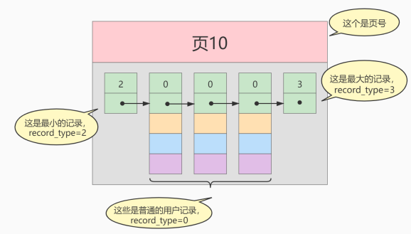
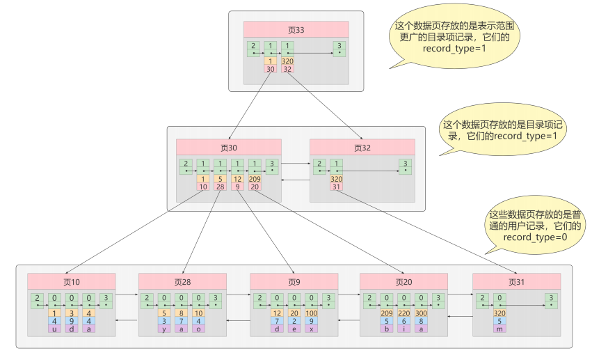
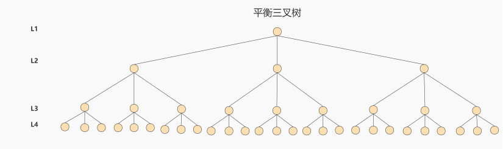
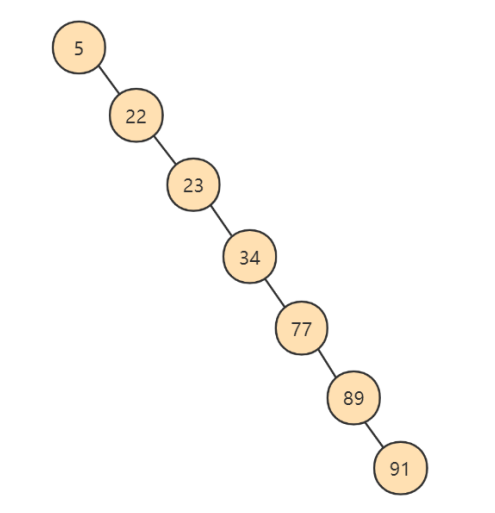
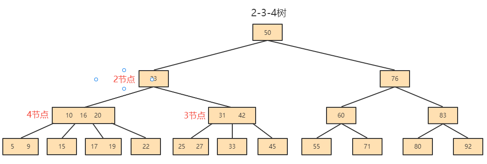
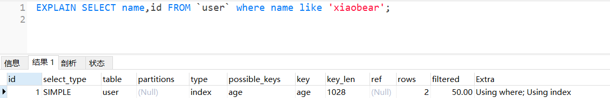

### 1、MySQL如何实现的索引机制？

> MySQL中索引分三类：B+树索引、Hash索引、全文索引

### 2、InnoDB索引与MyISAM索引实现的区别是什么？

- `MyISAM的索引方式都是非聚簇的，与InnoDB包含1个聚簇索引是不同的。`

    - 在InnoDB存储引擎中，我们只需要根据主键值对聚簇索引进行一次查找就能找到对应的记录，而在MyISAM中却需要进行一次回表操作，意味着MyISAM中建立的索引相当于全部都是二级索引 。

    - InnoDB的数据文件本身就是索引文件，而MyISAM索引文件和数据文件是分离的 ，索引文件仅保存数据记录的地址。
        - MyISAM的表在磁盘上存储在以下文件中：  `*.sdi（描述表结构）`、`*.MYD（数据）`，`*.MYI（索引）`
        - InnoDB的表在磁盘上存储在以下文件中： `.ibd（表结构、索引和数据都存在一起）`

    - InnoDB的非聚簇索引data域存储相应记录主键的值 ，而MyISAM索引记录的是地址 。换句话说，InnoDB的所有非聚簇索引都引用主键作为data域。
    - MyISAM的回表操作是十分快速的，因为是拿着地址偏移量直接到文件中取数据的，反观InnoDB是通过获取主键之后再去聚簇索引里找记录，虽然说也不慢，但还是比不上直接用地址去访问。
    - InnoDB要求表必须有主键 （ MyISAM可以没有 ）。如果没有显式指定，则MySQL系统会自动选择一个可以非空且唯一标识数据记录的列作为主键。如果不存在这种列，则MySQL自动为InnoDB表生成一个隐含字段作为主键，这个字段长度为6个字节，类型为长整型。

  


### 3、一个表中如果没有创建索引，那么还会创建B+树吗？

> 会
>
> - 如果有主键会创建聚簇索引
>
> - 如果没有主键会生成rowid作为隐式主键

### 4、说一下B+树索引实现原理（数据结构）

假设有一个表index_demo，表中有2个INT类型的列，1个CHAR(1)类型的列，c1列为主键：

```sql
CREATE TABLE index_demo(c1 INT,c2 INT,c3 CHAR(1),PRIMARY KEY(c1)) ;
```

index_demo表的简化的行格式示意图如下：


我们只在示意图里展示记录的这几个部分：

- `record_type：`表示记录的类型， 0是普通记录、 2是最小记录、 3 是最大记录、1是B+树非叶子节点记录。
- `next_record：`表示下一条记录的相对位置，我们用箭头来表明下一条记录。
- `各个列的值：`这里只记录在 index_demo 表中的三个列，分别是 c1 、 c2 和 c3 。
- `其他信息：`除了上述3种信息以外的所有信息，包括其他隐藏列的值以及记录的额外信息。


将`其他信息`项暂时去掉并把它竖起来的效果就是这样：


把一些记录放到页里的示意图就是（这里一页就是一个磁盘块，代表一次IO）：



name age sex


`MySQL InnoDB的默认的页大小是16KB`，因此数据存储在磁盘中，可能会占用多个数据页。如果各个页中的记录没有规律，我们就不得不依次遍历所有的数据页。`如果我们想快速的定位到需要查找的记录在哪些数据页中`，我们可以这样做 ：

- 下一个数据页中用户记录的主键值必须大于上一个页中用户记录的主键值
- 给所有的页建立目录项


以`页28`为例，它对应`目录项2` ，这个目录项中包含着该页的`页号28`以及该页中用户记录的`最小主键值 5`。我们只需要把几个目录项在物理存储器上连续存储（比如：数组），就可以实现根据主键值快速查找某条记录的功能了。`比如：查找主键值为 20 的记录，具体查找过程分两步：`

1. 先从目录项中根据二分法快速确定出`主键值为20的记录在目录项3中`（因为 12 ≤ 20 < 209 ），`对应页9`。
2. 再到页9中根据二分法快速定位到主键值为 20 的用户记录。

至此，针对数据页做的简易目录就搞定了。这个目录有一个别名，称为`索引` 。


#### InnoDB中的索引方案

我们新分配一个编号为30的页来专门存储`目录项记录`，页10、28、9、20专门存储`用户记录`：


`目录项记录和普通的用户记录的不同点：`

- 目录项记录 的 record_type 值是1，而 普通用户记录 的 record_type 值是0。
- 目录项记录只有主键值和页的编号两个列，而普通的用户记录的列是用户自己定义的，包含很多列，另外还有InnoDB自己添加的隐藏列。

`现在查找主键值为 20 的记录，具体查找过程分两步：`

1. 先到页30中通过二分法快速定位到对应目录项，因为 12 ≤ 20 < 209 ，就是页9。
2. 再到页9中根据二分法快速定位到主键值为 20 的用户记录。


**更复杂的情况如下：**

我们生成了一个存储更高级目录项的 页33 ，这个页中的两条记录分别代表页30和页32，如果用户记录的主键值在 `[1, 320)` 之间，则到页30中查找更详细的目录项记录，如果主键值 不小于320 的话，就到页32中查找更详细的目录项记录。**这个数据结构，它的名称是 B+树 。**



### 5、聚簇索引与非聚簇索引b+树实现有什么区别？

##### 聚簇索引

**特点：**

- `索引和数据保存在同一个B+树中`

- `页内的记录`是按照`主键`的大小顺序排成一个`单向链表` 。
- `页和页之间`也是根据页中记录的`主键`的大小顺序排成一个`双向链表` 。
- 非叶子节点存储的是记录的`主键+页号`。
- 叶子节点存储的是`完整的用户记录`。

**优点：**

- 数据访问更快 ，因为`索引和数据保存在同一个B+树中`，因此从聚簇索引中获取数据比非聚簇索引更快。
- 聚簇索引对于主键的`排序查找`和`范围查找`速度非常快。
- 按照聚簇索引排列顺序，查询显示一定范围数据的时候，由于`数据都是紧密相连`，数据库可以从更少的数据块中提取数据，`节省了大量的IO操作` 。

**缺点：**

- 插入速度严重依赖于插入顺序 ，按照主键的顺序插入是最快的方式，否则将会出现页分裂，严重影响性能。因此，对于InnoDB表，我们一般都会定义一个`自增的ID列为主键`。
- 更新主键的代价很高 ，因为将会导致被更新的行移动。因此，对于InnoDB表，我们一般定义`主键为不可更新`。

**限制：**

- 只有InnoDB引擎支持聚簇索引，`MyISAM不支持聚簇索引`。
- 由于数据的物理存储排序方式只能有一种，所以`每个MySQL的表只能有一个聚簇索引`。
- 如果没有为表定义主键，InnoDB会选择`非空的唯一索引列代替`。如果没有这样的列，InnoDB会`隐式的定义一个主键`作为聚簇索引。
- 为了充分利用聚簇索引的聚簇特性，InnoDB中表的`主键应选择有序的id`，不建议使用无序的id，比如UUID、MD5、HASH、字符串作为主键，无法保证数据的顺序增长。


##### 非聚簇索引

**（二级索引、辅助索引）**

`聚簇索引`，只能在搜索条件是`主键值`时才发挥作用，因为B+树中的数据都是按照主键进行排序的，如果我们想以别的列作为搜索条件，那么需要创建`非聚簇索引`。

**例如，**`以c2列作为搜索条件`，那么需要使`用c2列创建一棵B+树`，如下所示：


**这个B+树与聚簇索引有几处不同：**

- `页内的记录`是按照从`c2列`的大小顺序排成一个`单向链表` 。
- `页和页之间`也是根据页中记录的`c2列`的大小顺序排成一个`双向链表` 。

- 非叶子节点存储的是记录的`c2列+页号`。
- 叶子节点存储的并不是完整的用户记录，而只是`c2列+主键`这两个列的值。


**一张表可以有多个非聚簇索引：**


### 6、说一下B+树中聚簇索引的查找（匹配）逻辑


### 7、说一下B+树中非聚簇索引的查找（匹配）逻辑

**例如：**根据c2列的值查找c2=4的记录，查找过程如下：

1. 根据`根页面44`定位到`页42`（因为`2 ≤  4 < 9`）
2. 由于`c2列没有唯一性约束`，所以c2=4的记录可能分布在多个数据页中，又因为 `2 ≤ 4  ≤ 4`，所以确定实际存储用户记录的页在`页34和页35`中。
3. 在页34和35中`定位到具体的记录`。
4. 但是这个B+树的叶子节点`只存储了c2和c1（主键）`两个列，所以我们必须`再根据主键值去聚簇索引中再查找`一遍完整的用户记录。
5. like 张%


### 8、平衡二叉树，红黑树，B树和B+树的区别是什么？都有哪些应用场景？

平衡二叉树

- 基础数据结构
- 左右平衡
- 高度差大于1会自旋
- 每个节点记录一个数据

**平衡二叉树（AVL）**

AVL树全称G.M. Adelson-Velsky和E.M. Landis，这是两个人的人名。

平衡二叉树也叫平衡二叉搜索树（Self-balancing binary search tree）又被称为AVL树， 可以保证查询效率较高。

`具有以下特点：`

- 它是一棵空树或它的左右两个子树的高度差的绝对值不超过1
- 并且左右两个子树都是一棵平衡二叉树。


AVL的生成演示：https://www.cs.usfca.edu/~galles/visualization/AVLtree.html


**AVL的问题**

众所周知，IO操作的效率很低，在大量数据存储中，查询时我们不能一下子将所有数据加载到内存中，只能逐节点加载（一个节点一次IO）。如果我们利用二叉树作为索引结构，`那么磁盘的IO次数和索引树的高度是相关的`。平衡二叉树由于树深度过大而造成磁盘IO读写过于频繁，进而导致效率低下。


为了提高查询效率，就需要 减少磁盘IO数 。`为了减少磁盘IO的次数，就需要尽量降低树的高度` ，需要把原来“瘦高”的树结构变的“矮胖”，树的每层的分叉越多越好。针对同样的数据，如果我们把二叉树改成 三叉树：



上面的例子中，我们将二叉树变成了三叉树，降低了树的高度。如果能够在一个节点中存放更多的数据，我们还可以进一步减少节点的数量，从而进一步降低树的高度。这就是`多叉树`。

**普通树的问题**

- 左子树全部为空，从形式上看，更像一个单链表，不能发挥BST的优势。
- `解决方案：平衡二叉树(AVL)`



红黑树

- hashmap存储
- 两次旋转达到平衡
- 分为红黑节点

在这个棵严格的平台树上又进化为“红黑树”{是一个非严格的平衡树 左子树与右子树的高度差不能超过1}，红黑树的长子树只要不超过短子树的两倍即可！


当再次插入7的时候，这棵树就会发生旋转


**B+** **树和** **B** **树的差异：**

- B+树中非叶子节点的关键字也会同时存在在子节点中，并且是在子节点中所有关键字的最大值（或最小）。
- B+树中非叶子节点仅用于索引，不保存数据记录，跟记录有关的信息都放在叶子节点中。而B树中， 非叶子节点既保存索引，也保存数据记录 。
- B+树中所有关键字都在叶子节点出现，叶子节点构成一个有序链表，而且叶子节点本身按照关键字的大小从小到大顺序链接。


### 9、一个b+树中大概能存放多少条索引记录？

> - `真实环境`中一个页存放的记录数量是非常大的（默认16KB），假设指针与键值忽略不计（或看做10个字节），数据占 1 kb 的空间：
> - 如果B+树只有1层，也就是只有1个用于存放用户记录的节点，最多能存放 16 条记录。
> - 如果B+树有2层，最多能存放 `1600×16=25600` 条记录。
> - 如果B+树有3层，最多能存放 `1600×1600×16=40960000` 条记录。
> - 如果存储千万级别的数据，只需要三层就够了
>
> `B+树的非叶子节点不存储用户记录，只存储目录记录，相对B树每个节点可以存储更多的记录，树的高度会更矮胖，IO次数也会更少。`

### 10、使用B+树存储的索引crud执行效率如何？

c 新增

O(lognN)

N = 高度

### 11、什么是自适应哈希索引？

自适应哈希索引是Innodb引擎的一个特殊功能，当它注意到某些索引值被使用的非常频繁时，会在内存中基于B-Tree所有之上再创建一个哈希索引，这就让B-Tree索引也具有哈希索引的一些优点，比如快速哈希查找。这是一个完全自动的内部行为，用户无法控制或配置

使用命令

```
SHOW ENGINE INNODB STATUS \G ;
```

查看INSERT BUFFER AND ADAPTIVE HASH INDEX

### 12、什么是2-3树 2-3-4树？

多叉树（multiway tree）允许`每个节点可以有更多的数据项和更多的子节点`。2-3树，2-3-4树就是多叉树，多叉树通过`重新组织节点，减少节点数量，增加分叉，减少树的高度`，能对二叉树进行优化。


**2-3树**

下面2-3树就是一颗多叉树


2-3树具有如下特点：

- 2-3树的所有叶子节点都在同一层。
- 有两个子节点的节点叫二节点，二节点要么没有子节点，要么有两个子节点。
- 有三个子节点的节点叫三节点，三节点要么没有子节点，要么有三个子节点。
- 2-3树是由二节点和三节点构成的树。
- 对于三节点的子树的值大小仍然遵守 BST 二叉排序树的规则。


**2-3-4树**




### 13、为什么官方建议使用自增长主键作为索引？（说一下自增主键和字符串类型主键的区别和影响）

> - 自增主键能够维持底层数据顺序写入
> - 读取可以由b+树的二分查找定位
> - 支持范围查找，范围数据自带顺序
>
> 字符串无法完成以上操作

### 14、使用int自增主键后 最大id是10，删除id 10和9，再添加一条记录，最后添加的id是几？删除后重启MySQL然后添加一条记录最后id是几？

> 删除之后
>
> - 如果重启，会从最大的id开始递增
> - 如果没重启，会延续删除之前最大的id开始递增

### 15、索引的优缺点是什么？

**优点**

聚簇（主键）索引：

- 顺序读写
- 范围快速查找
- 范围查找自带顺序

非聚簇索引：

- 条件查询避免全表扫描scan
- 范围，排序，分组查询返回行id，排序分组后，再回表查询完整数据，有可能利用顺序读写
- 覆盖索引不需要回表操作

**索引的代价**

索引是个好东西，可不能乱建，它在空间和时间上都会有消耗：

- **空间上的代价**

每建立一个索引都要为它建立一棵B+树，`每一棵B+树的每一个节点都是一个数据页，一个页默认会占用 16KB 的存储空间`，一棵很大的B+树由许多数据页组成，那就是很大的一片存储空间。

- **时间上的代价**

`每次对表中的数据进行 增、删、改 操作时，都需要去修改各个B+树索引`。而增、删、改操作可能会对节点和记录的排序造成破坏`，所以存储引擎需要额外的时间进行一些记录移位、页面分裂、页面回收等操作来维护好节点和记录的排序。`如果我们建了许多索引，每个索引对应的B+树都要进行相关的维护操作，会给性能拖后腿。

B 树和 B+ 树都可以作为索引的数据结构，**在 MySQL 中采用的是 B+ 树。**

但B树和B+树各有自己的应用场景，不能说B+树完全比B树好，反之亦然。

### 16、使用索引一定能提升效率吗？

> 不一定
>
> - 少量数据全表扫描也很快，可以直接获取到全量数据
> - 唯一索引会影响插入速度，但建议使用
> - 索引过多会影响更新，插入，删除数据速度

### 17、如果是大段文本内容，如何创建（优化）索引？

```
B 树和 B+ 树都可以作为     索引的数据结构，**在 MySQL 中采用的是 B+ 树。**
```

> 第一种方式是分表存储，然后创建索引
>
> 第二是使用es为大文本创建索引

### 18、什么是聚簇索引？

聚簇索引数据和索引存放在一起组成一个b+树

参考第5题

### 19、一个表中可以有多个（非）聚簇索引吗？

> 聚簇索引只能有一个
>
> 非聚簇索引可以有多个

### 20、聚簇索引与非聚集索引的特点是什么？

参考005题

### 21、CRUD时聚簇索引与非聚簇索引的区别是什么？

> - 聚簇索引插入新值比采用非聚簇索引插入新值的速度要慢很多，因为插入要保证主键不能重复
> - 聚簇索引范围，排序查找效率高，因为是有序的
> - 非聚簇索引访问需要两次索引查找，第一次找到主键值，第二次根据主键值找到行数据

### 22、非聚簇索引为什么不存数据地址值而存储主键？

> 因为聚簇索引中有时会引发分页操作、重排操作数据有可能会移动

### 23、什么是回表操作？

> 通俗的讲就是，如果索引的列在 select 所需获得的列中（因为在 MySQL 中索引是根据索引列的值进行排序的，所以索引节点中存在该列中的部分值）或者根据一次索引查询就能获得记录就不需要回表，如果 select 所需获得列中有大量的非索引列，索引就需要到表中找到相应的列的信息，这就叫回表。

```sql
表中字段：id age name sex
age -> index（建立索引）
```

- 如果我们要查询id的数据，执行`select * from user where id = ？`，这条语句不需要回表，原因是根据主键的查询方式，则只需要搜索 ID 这棵 B+ 树。主键是唯一的，根据这个唯一的索引，MySQL 就能确定搜索的记录。

- 如果我们根据索引来进行查询，`select * from user where age >20` ,这时候需要回表，原因是通过非主键索引列进行查询时，先搜索age索引树，第一次通过索引age取回id，第二次（回表）根据id拿到完整数据，这个过程虽然用了索引，但实际上底层进行了两次索引查询，这个过程就称为回表。

### 024	什么是覆盖索引？

> 只需要在一棵索引树上就能获取SQL所需的所有列数据，无需回表，速度更快。
>
> explain的输出结果Extra字段为Using index时，能够触发索引覆盖

```
表中字段：id age name sex
20 -> index（建立索引）
```

**实现覆盖索引**：常见的方法是将被查询的字段，建立到联合索引里去

示例：

```sql
select * from user where age > 20 ;
```

第一次 取回id，第二次（回表）根据id拿到完整数据

**使用联合索引**

```sql
age,name -> index
#执行下面语句
select age from user where age >20 and name like"张%" ;
```

单列索引升级成了联合索引后，索引的叶子节点存储了节点值，都能够命中，不会回表查询，查询效率也是比较高的

### 25、非聚集索引一定回表查询吗?

> 不一定，只要b+树中包含的字段（创建索引的字段），覆盖（包含）想要select 的字段，那么就不会回表查询了。

### 26、为什么要回表查询？直接存储数据不可以吗？

> 为了控制非聚簇索引的大小

### 27、如果把一个 InnoDB 表的主键删掉，是不是就没有主键，就没办法进行回表查询了？

> 不是，InnoDB会生成rowid辅助回表查询

### 28、什么是联合索引，组合索引，复合索引？

`为c2和c3列建立联合索引，`如下所示：

c2，c3 - > index

c3,c2 -> index

where c3=?

全职匹配

最左前缀


### 29、复合索引创建时字段顺序不一样使用效果一样吗？

我们也可以同时以多个列的大小作为排序规则，也就是同时为多个列建立索引，比方说我们想让B+树按照 `c2和c3列` 的大小进行排序，这个包含两层含义：

- 先把各个记录和页按照`c2`列进行排序。
- 在记录的`c2`列相同的情况下，采用`c3`列进行排序
- B+树叶子节点处的记录由`c2列、c3列和主键c1列组成`
- 本质上也是二级索引

`create index idx_c2_c3 on user (c2,c3); `

### 30、什么是唯一索引？

- 随表一起创建索引：

```sql
CREATE TABLE customer (
    
  id INT UNSIGNED AUTO_INCREMENT,
  customer_no VARCHAR(200),
  customer_name VARCHAR(200),
    
  PRIMARY KEY(id), -- 主键索引：列设定为主键后会自动建立索引，唯一且不能为空。
  UNIQUE INDEX uk_no (customer_no), -- 唯一索引：索引列值必须唯一，允许有NULL值，且NULL可能会出现多次。
  KEY idx_name (customer_name), -- 普通索引：既不是主键，列值也不需要唯一，单纯的为了提高查询速度而创建。
  KEY idx_no_name (customer_no,customer_name) -- 复合索引：即一个索引包含多个列。
);
```


- 单独建创索引：

```sql
CREATE TABLE customer1 (
  id INT UNSIGNED,
  customer_no VARCHAR(200),
  customer_name VARCHAR(200)
);

ALTER TABLE customer1 ADD PRIMARY KEY customer1(id); -- 主键索引
CREATE UNIQUE INDEX uk_no ON customer1(customer_no); -- 唯一索引
CREATE INDEX idx_name ON customer1(customer_name);  -- 普通索引
CREATE INDEX idx_no_name ON customer1(customer_no,customer_name); -- 复合索引
```


### 	31、唯一索引是否影响性能？

> 是
>
> - 对于读操作而言，跟普通索引没区别
> - 对于写操作来说，唯一索引需要将数据页读入内存，判断到没有冲突，插入这个值，语句执行结束；而普通索引更新记录在 change buffer，语句执行就结束

### 	32、什么时候使用唯一索引？

> 业务需求唯一字段的时候，一般不考虑性能问题
>
> 【强制】业务上具有唯一特性的字段，即使是多个字段的组合，也必须建成唯一索引。 说明：不要以为唯一索引影响了 insert 速度，这个速度损耗可以忽略，但提高查找速度是明 显的；另外，即使在应用层做了非常完善的校验控制，只要没有唯一索引，根据墨菲定律，必 然有脏数据产生。

### 33、什么时候适合创建索引，什么时候不适合创建索引？

> **适合创建索引**
>
> - 频繁作为where条件语句查询字段
>
> - 关联字段需要建立索引
> - 排序字段可以建立索引
>
> - 分组字段可以建立索引(因为分组前提是排序)
>
> - 统计字段可以建立索引（如.count(),max()）
>
> **不适合创建索引**
>
> - 频繁更新的字段不适合建立索引
>
> - where，分组，排序中用不到的字段不必要建立索引
>
> - 可以确定表数据非常少不需要建立索引
>
> - 参与MySQL函数计算的列不适合建索引

创建索引时避免有如下极端误解：

1）宁滥勿缺。认为一个查询就需要建一个索引。

2）宁缺勿滥。认为索引会消耗空间、严重拖慢更新和新增速度。

3）抵制惟一索引。认为业务的惟一性一律需要在应用层通过“先查后插”方式解决。

### 34、什么是索引下推？

5.6之前的版本是没有索引下推这个优化的

**Using index condition：**叫作  `Index Condition Pushdown Optimization （索引下推优化）`

- `如果没有索引下推（ICP）`，那么MySQL在存储引擎层找到满足`content1 > 'z'`条件的第一条二级索引记录。`主键值进行回表`，返回完整的记录给server层，server层再判断其他的搜索条件是否成立。如果成立则保留该记录，否则跳过该记录，然后向存储引擎层要下一条记录。
- `如果使用了索引下推（ICP`），那么MySQL在存储引擎层找到满足`content1 > 'z'`条件的第一条二级索引记录。`不着急执行回表`，而是在这条记录上先判断一下所有关于`idx_content1`索引中包含的条件是否成立，也就是`content1 > 'z' AND content1 LIKE '%a'`是否成立。如果这些条件不成立，则直接跳过该二级索引记录，去找下一条二级索引记录；如果这些条件成立，则执行回表操作，返回完整的记录给server层。

**总结**：

未开启索引下推：

- 根据筛选条件在索引树中筛选第一个条件
- 获得结果集后回表操作
- 进行其他条件筛选
- 再次回表查询

开启索引下推：在条件查询时，当前索引树如果满足全部筛选条件，可以在当前树中完成全部筛选过滤，得到比较小的结果集再进行回表操作

### 035 有哪些情况会导致索引失效？

- 计算、函数导致索引失效

```
-- 显示查询分析
EXPLAIN SELECT * FROM emp WHERE emp.name  LIKE 'abc%';
EXPLAIN SELECT * FROM emp WHERE LEFT(emp.name,3) = 'abc'; --索引失效
```

- LIKE以%，_ 开头索引失效

> **拓展：Alibaba《Java开发手册》**
>
> 【强制】页面搜索严禁左模糊或者全模糊，如果需要请走搜索引擎来解决。

```
EXPLAIN SELECT * FROM emp WHERE name LIKE '%ab%'; --索引失效
```


- 不等于(!= 或者<>)索引失效

```
EXPLAIN SELECT SQL_NO_CACHE * FROM emp WHERE emp.name = 'abc' ;
EXPLAIN SELECT SQL_NO_CACHE * FROM emp WHERE emp.name <> 'abc' ; --索引失效
```


- IS NOT NULL 失效 和 IS NULL

```
EXPLAIN SELECT * FROM emp WHERE emp.name IS NULL;
EXPLAIN SELECT * FROM emp WHERE emp.name IS NOT NULL; --索引失效
```

**注意：**当数据库中的数据的索引列的`NULL值达到比较高的比例的时候`，即使在IS NOT NULL 的情况下 MySQL的查询优化器会选择使用索引，`此时type的值是range（范围查询）`

```sql
-- 将 id>20000 的数据的 name 值改为 NULL
UPDATE emp SET `name` = NULL WHERE `id` > 20000;

-- 执行查询分析，可以发现 IS NOT NULL 使用了索引
-- 具体多少条记录的值为NULL可以使索引在IS NOT NULL的情况下生效，由查询优化器的算法决定
EXPLAIN SELECT * FROM emp WHERE emp.name IS NOT NULL
```

- 类型转换导致索引失效

```sql
EXPLAIN SELECT * FROM emp WHERE name='123'; 
EXPLAIN SELECT * FROM emp WHERE name= 123; --索引失效
```

- 复合索引未用左列字段失效
- 如果MySQL觉得全表扫描更快时（数据少）;

### 36 、为什么LIKE以%开头索引会失效？

```sql
id,name,age
name 创建索引
```

示例1：

```sql
SELECT * FROM `user` where name like 'xiaobear';
```


```sql
select name,id  from user where  name like '%xiaobear'
```



- 查询所有的时候，索引没有生效，会直接type=all
- 查询索引字段的时候，type=index，表示遍历了索引树，再回表查询

没有高效使用索引是因为字符串索引会逐个转换成accii码，生成b+树时按首个字符串顺序排序，类似复合索引未用左列字段失效一样，跳过开始部分也就无法使用生成的b+树了


### 37 、一个表有多个索引的时候，能否手动选择使用哪个索引？

> 不可用手动直接干预，只能通过MySQL优化器自动选择

### 38、如何查看一个表的索引？

```
show index from t_emp; // 显示表上的索引
explain select * from t_emp where id=1; // 显示可能会用到的索引及最终使用的索引
```

### 39、能否查看到索引选择的逻辑？是否使用过optimizer_trace？

```
set session optimizer_trace="enabled=on",end_markers_in_json=on;

SELECT * FROM information_schema.OPTIMIZER_TRACE;
set session optimizer_trace="enabled=off";
```


### 40、多个索引优先级是如何匹配的？

> 1. 主键（唯一索引）匹配
> 2. 全值匹配（单值匹配）
> 3. 最左前缀匹配
> 4. 范围匹配
> 5. 索引扫描
> 6. 全表扫描

**一般性建议**

Ø 对于单键索引，尽量选择过滤性更好的索引（例如：手机号，邮件，身份证）

Ø 在选择组合索引的时候，过滤性最好的字段在索引字段顺序中，位置越靠前越好。

Ø 选择组合索引时，尽量包含where中更多字段的索引

Ø 组合索引出现范围查询时，尽量把这个字段放在索引次序的最后面

Ø 尽量避免造成索引失效的情况

### 41、使用Order By时能否通过索引排序？

> 没有过滤条件不走索引

### 42、通过索引排序内部流程是什么？

select name,id  from user where  name like '%明' order by name；

select name,id，age  from user where  name like '%明'

关键配置：

- sort_buffer可供排序的内存缓冲区大小
- max_length_for_sort_data 单行所有字段总和限制，超过这个大小启动双路排序

1. 通过索引检过滤筛选条件索到需要排序的字段+其他字段（如果是符合索引）
2. 判断索引内容是否覆盖select的字段
    1. 如果覆盖索引，select的字段和排序都在索引上，那么在内存中进行排序，排序后输出结果
    2. 如果索引没有覆盖查询字段，接下来计算select的字段是否超过max_length_for_sort_data限制，如果超过，启动双路排序，否则使用单路

### 43、什么是双路排序和单路排序

> 单路排序：一次取出所有字段进行排序，内存不够用的时候会使用磁盘
>
> 双路排序：取出排序字段进行排序，排序完成后再次回表查询所需要的其他字段

如果不在索引列上，filesort有两种算法： MySQL就要启动双路排序和单路排序

**双路排序（慢）**

Select id,age,name from stu order by name;

Ø MySQL 4.1之前是使用双路排序，字面意思就是两次扫描磁盘，最终得到数据， 读取行指针和order by列，对他们进行排序，然后扫描已经排序好的列表，按照列表中的值重新从列表中读取对应的数据输出

Ø 从磁盘取排序字段，在buffer进行排序，再从磁盘取其他字段。

Ø 取一批数据，要对磁盘进行两次扫描，众所周知，I\O是很耗时的，所以在MySQL4.1之后，出现了第二种改进的算法，就是单路排序。

**单路排序（快）**

从磁盘读取查询需要的所有列，按照order by列在buffer对它们进行排序，然后扫描排序后的列表进行输出， 它的效率更快一些，避免了第二次读取数据。并且把随机IO变成了顺序IO，但是它会使用更多的空间， 因为它把每一行都保存在内存中了。

**结论及引申出的问题**

但是用单路有问题

在sort_buffer中，单路比多路要多占用很多空间，因为单路是把所有字段都取出, 所以有可能取出的数据的总大小超出了sort_buffer的容量，导致每次只能取sort_buffer容量大小的数据，进行排序（创建tmp文件，多路合并），排完再取sort_buffer容量大小，再排……从而多次I/O。

单路本来想省一次I/O操作，反而导致了大量的I/O操作，反而得不偿失。

**优化策略**

Ø 增大sort_buffer_size参数的设置

Ø 增大max_length_for_sort_data参数的设置

Ø 减少select 后面的查询的字段。 禁止使用select *

**提高Order By的速度**

1. Order by时select * 是一个大忌。只Query需要的字段， 这点非常重要。在这里的影响是：

l 当Query的字段大小总和小于max_length_for_sort_data 而且排序字段不是 TEXT|BLOB 类型时，会用改进后的算法——单路排序， 否则用老算法——多路排序。

l 两种算法的数据都有可能超出sort_buffer的容量，超出之后，会创建tmp文件进行合并排序，导致多次I/O，但是用单路排序算法的风险会更大一些，所以要提高sort_buffer_size。

2. 尝试提高 sort_buffer_size

l 不管用哪种算法，提高这个参数都会提高效率，当然，要根据系统的能力去提高，因为这个参数是针对每个进程（connection）的 1M-8M之间调整。 MySQL5.7和8.0，InnoDB存储引擎默认值是1048576字节，1MB。

SHOW VARIABLES LIKE '%sort_buffer_size%';

​

3. 尝试提高 max_length_for_sort_data

提高这个参数， 会增加用改进算法的概率。

SHOW VARIABLES LIKE '%max_length_for_sort_data%';

\#5.7默认1024字节

\#8.0默认4096字节

l 但是如果设的太高，数据总容量超出sort_buffer_size的概率就增大，明显症状是高的磁盘I/O活动和低的处理器使用率。如果需要返回的列的总长度大于max_length_for_sort_data，使用双路算法，否则使用单路算法。1024-8192字节之间调整

### 44、group by 分组和order by在索引使用上有什么区别？

> group by 使用索引的原则几乎跟order by一致 ，唯一区别：
>
> - group by 先排序再分组，遵照索引建的最佳左前缀法则
> - group by没有过滤条件，也可以用上索引。Order By 必须有过滤条件才能使用上索引。

### 45、如果表中有字段为null，又被经常查询该不该给这个字段创建索引？

应该创建索引，使用的时候尽量使用is null判断。

- IS NOT NULL 失效 和 IS NULL

```
EXPLAIN SELECT * FROM emp WHERE emp.name IS NULL;
EXPLAIN SELECT * FROM emp WHERE emp.name IS NOT NULL; --索引失效
```

**注意：**当数据库中的数据的索引列的`NULL值达到比较高的比例的时候`，即使在IS NOT NULL 的情况下 MySQL的查询优化器会选择使用索引，`此时type的值是range（范围查询）`

```sql
-- 将 id>20000 的数据的 name 值改为 NULL
UPDATE emp SET `name` = NULL WHERE `id` > 20000;

-- 执行查询分析，可以发现 IS NOT NULL 使用了索引
-- 具体多少条记录的值为NULL可以使索引在IS NOT NULL的情况下生效，由查询优化器的算法决定
EXPLAIN SELECT * FROM emp WHERE emp.name IS NOT NULL
```


### 46、有字段为null索引是否会失效？

> 不一定会失效，每一条sql具体有没有使用索引 可以通过trace追踪一下
>
> 最好还是给上默认值
>
> 数字类型的给0，字符串给个空串“”，
>
> 参考上一题
