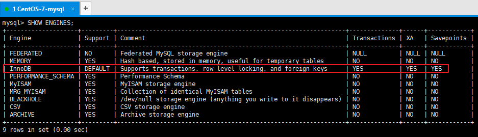

### 47、MySQL内部支持缓存查询吗？

> 当MySQL接收到客户端的查询SQL之后，仅仅只需要对其进行相应的权限验证之后，就会通过Query Cache来查找结果，甚至都不需要经过Optimizer模块进行执行计划的分析优化，更不需要发生任何存储引擎的交互
>
> MySQL5.7支持内部缓存，8.0之后就废弃掉了

### 48、MySQL8为何废弃掉查询缓存？

> 缓存的意义在于快速查询提升系统性能，可以灵活控制缓存的一致性
>
> MySQL缓存的限制
>
> 1. MySQL基本没有手段灵活的管理缓存失效和生效，尤其对于频繁更新的表
> 2. SQL必须完全一致才会导致cache命中
> 3. 为了节省内存空间，太大的result set不会被cache (< query_cache_limit)；
> 4. MySQL缓存在分库分表环境下是不起作用的；
> 5. 执行SQL里有触发器,自定义函数时，MySQL缓存也是不起作用的；
> 6. 在表的结构或数据发生改变时，基于该表相关cache立即全部失效。

### 49、MySQL 8废除缓存的替代方案是什么？

> 应用层组织缓存，最简单的是使用redis，ehcached等

### 50、MySQL内部有哪些核心模块组成，作用是什么？


**Connectors（客户端）**

MySQL服务器之外的客户端程序，与具体的语言相关，例如Java中的JDBC，图形用户界面SQLyog等。`本质上都是在TCP连接上通过MySQL协议和MySQL服务器进行通信。`


**MySQL Server（服务器）**

**第1层：连接层**

- 系统（客户端）访问 MySQL 服务器前，做的`第一件事就是建立 TCP 连接`。
- 经过三次握手建立连接成功后， MySQL 服务器对 TCP 传输过来的账号密码做`身份认证、权限获取`。
    - 用户名或密码不对`，会收到一个`Access denied for user`错误，客户端程序结束执行`
    - `用户名密码认证通过`，会从权限表`查出账号拥有的权限`与连接关联，之后的权限判断逻辑，都将依赖于此时读到的权限
- TCP 连接收到请求后，必须要分配给一个线程专门与这个客户端的交互。所以还会有个线程池，去走后面的流程。每一个连接从线程池中获取线程，省去了创建和销毁线程的开销。


**第2层：服务层**

**Management Serveices & Utilities： 系统管理和控制工具**

**SQL Interface：SQL接口：**

- `接收用户的SQL命令，并且返回用户需要查询的结果。`比如SELECT ... FROM就是调用SQL Interface
- MySQL支持DML（数据操作语言）、DDL（数据定义语言）、存储过程、视图、触发器、自定义函数等多种SQL语言接口

**Parser：解析器：**

- 在SQL命令传递到解析器的时候会被解析器验证和解析。解析器中SQL 语句进行`语法分析、语法解析`，并为其创建`语法树`。

**语法分析**

语法分析主要是把输入转化成若干个tokens，包含key和非key。

在分析之后，会得到4个Token，其中有2个key，它们分别是SELECT、FROM。

| key    | 非key | key  | 非key |
| ------ | ----- | ---- | ----- |
| SELECT | age   | FROM | user  |


- 典型的解析树如下：


**Optimizer：查询优化器：**

- SQL语句在语法解析后、查询前会使用查询优化器对查询进行优化，`确定SQL语句的执行路径，生成一个执行计划`。

**Caches & Buffers： 查询缓存组件：**

- MySQL内部维持着一些Cache和Buffer，比如Query Cache用来缓存一条SELECT语句的执行结果，如果能够在其中找到对应的查询结果，那么就不必再进行查询解析、查询优化和执行的整个过程了，直接将结果反馈给客户端。
- 这个缓存机制是由一系列小缓存组成的。比如表缓存，记录缓存，key缓存，权限缓存等 。
- 这个查询缓存可以在不同客户端之间共享 。


**第3层：引擎层**

插件式存储引擎层（ Storage Engines），`负责MySQL中数据的存储和提取，对物理服务器级别维护的底层数据执行操作，服务器通过API与存储引擎进行通信`。不同的存储引擎具有的功能不同，管理的表有不同的存储结构，采用的存取算法也不同，这样我们可以根据自己的实际需要进行选取。例如MyISAM引擎和InnoDB引擎。


**存储层**

所有的数据、数据库、表的定义、表的每一行的内容、索引，都是存在`文件系统` 上，以文件的方式存在，并完成与存储引擎的交互。


### 51、一条sql发送给MySQL后，内部是如何执行的？（说一下 MySQL 执行一条查询语句的内部执行过程？）

1.5、查询流程说明


**首先，**`MySQL客户端通过协议与MySQL服务器建连接，通过SQL接口发送SQL语句，先检查查询缓存，如果命中，直接返回结果，否则进行语句解析。`也就是说，在解析查询之前，服务器会先访问查询缓存，如果某个查询结果已经位于缓存中，服务器就不会再对查询进行解析、优化、以及执行。它仅仅将缓存中的结果返回给用户即可，这将大大提高系统的性能。

**接下来，**`MySQL解析器通过关键字将SQL语句进行解析，并生成一棵对应的解析树，`解析器使用MySQL语法规则验证和解析SQL语句。例如，它将验证是否使用了错误的关键字，或者使用关键字的顺序是否正确，引号能否前后匹配等；`预处理器则根据MySQL规则进一步检查解析树是否合法，`例如，这里将检查数据表和数据列是否存在，还会解析名字和别名，看是否有歧义等。`然后预处理器会进行查询重写，生成一棵新解析树。`

**接下来，**`查询优化器将解析树转化成执行计划。`MySQL优化程序会对我们的语句做一些优化，如子查询转换为连接、表达式简化等等。优化的结果就是生成一个执行计划，这个执行计划表明了应该使用哪些索引执行查询，以及表之间的连接顺序是啥样，等等。我们可以使用EXPLAIN语句来查看某个语句的执行计划。

**最后，**`进入执行器阶段。`完成查询优化后，`查询执行引擎`会按照生成的执行计划调用存储引擎提供的接口执行SQL查询并将结果返回给客户端。在MySQL8以下的版本，如果设置了查询缓存，这时会将查询结果进行缓存，再返回给客户端。


### 52、MySQL 提示“不存在此列”是执行到哪个节点报出的？

> 是在Parser：解析器 分析sql语法的时候检查的列。

### 53、如果一张表创建了多个索引，在哪个阶段或模块进行的索引选择？

> 在优化器阶段**Optimizer：查询优化器：**

### 54、MySQL 支持哪些存储引擎？默认使用哪个？

查看MySQL提供什么存储引擎

```sql
SHOW ENGINES;
```

下面的结果表示MySQL中默认使用的存储引擎是InnoDB，支持事务，行锁，外键，支持分布式事务(XA)，支持保存点(回滚)




也可以通过以下语句查看默认的存储引擎：

```sql
SHOW VARIABLES LIKE '%default_storage_engine%';
```


### 55、MySQL8.0自带哪些存储引擎？分别是做什么的？

`1. InnoDB存储引擎`

- InnoDB是MySQL的默认事务型引擎，它被设计用来`处理大量的短期(short-lived)事务`。可以确保事务的完整提交(Commit)和回滚(Rollback)。

- 除非有非常特别的原因需要使用其他的存储引擎，否则`应该优先考虑InnoDB引擎`。

- 数据文件结构：

    - 表名.frm 存储表结构（MySQL8.0时，合并在表名.ibd中）


- 表名.ibd 存储数据和索引

- InnoDB不仅缓存索引还要缓存真实数据， 对内存要求较 高 ，而且内存大小对性能有决定性的影响。


`2. MyISAM存储引擎`

- MyISAM提供了大量的特性，包括全文索引、压缩、空间函数(GIS)等，但`MyISAM不支持事务和行级锁`，有一个毫无疑问的缺陷就是崩溃后无法安全恢复。

- 优势是访问的 速度快 ，对事务完整性没有要求或者以SELECT、INSERT为主的应用。

- 数据文件结构：

    - 表名.frm 存储表结构


- 表名.MYD 存储数据


- 表名.MYI 存储索引

- MyISAM只缓存索引，不缓存真实数据。


`3. Archive引擎`

- `Archive档案存储引擎只支持INSERT和SELECT操作`。
- Archive表适合日志和数据采集（档案）类应用。
- 根据英文的测试结论来看，Archive表比MyISAM表要小大约75%，比支持事务处理的InnoDB表小大约83%。


`4. Blackhole引擎`

- `Blackhole引擎没有实现任何存储机制，它会丢弃所有插入的数据，不做任何保存`。
- 但服务器会记录Blackhole表的日志，所以可以用于复制数据到备库，或者简单地记录到日志。但这种应用方式会碰到很多问题，因此并不推荐。


`5. CSV引擎`

- `CSV引擎可以将普通的CSV文件作为MySQL的表来处理，但不支持索引`。
- CSV引擎可以作为一种数据交换的机制，非常有用。
- CSV存储的数据直接可以在操作系统里，用文本编辑器，或者excel读取。


`6. Memory引擎`

- 如果需要快速地访问数据，并且这些数据不会被修改，重启以后丢失也没有关系，那么使用Memory表是非常有用。
- Memory表至少比MyISAM表要快一个数量级。


`7. Federated引擎`

- `Federated引擎是访问其他MySQL服务器的一个代理（跨库关联查询）`，尽管该引擎看起来提供了一种很好的跨服务器的灵活性，但也经常带来问题，因此默认是禁用的。

### 56、MySQL 存储引擎架构了解吗？

https://dev.MySQL.com/doc/refman/5.7/en/innodb-architecture.html

下面是官方的InnoDB引擎结构图，主要分为内存结构和磁盘结构两大部分。


**内存区域**

**Buffer Pool**:在InnoDB访问表记录和索引时会在Buffer Pool的页中缓存，以后使用可以减少磁盘IO操作，提升效率。主要用来缓存热的数据页和索引页。

**Log Buffer**：用来缓存redolog

**Adaptive Hash Index**：自适应哈希索引

**Change Buffer**:它是一种应用在非唯一普通索引页（non-unique secondary index page）不在缓冲池中，对页进行了写操作，并不会立刻将磁盘页加载到缓冲池，而仅仅记录缓冲变更（Buffer Changes），等未来数据被读取时，再将数据合并（Merge）恢复到缓冲池中的技术。写缓冲的目的是降低写操作的磁盘IO，提升数据库性能。


**磁盘区域**

磁盘中的结构分为两大类：表空间和重做日志。

- 表空间：分为系统表空间(MySQL 目录的 ibdata1 文件)，临时表空间，常规表空间，Undo 表空间以及 file-per-table 表空间(MySQL5.7默认打开file_per_table 配置）。系统表空间又包括了InnoDB数据字典，双写缓冲区(Doublewrite Buffer)，修改缓存(Change Buffer），Undo日志等。
- Redo日志：存储的就是 Log Buffer 刷到磁盘的数据。


官方文档：

https://dev.MySQL.com/doc/refman/8.0/en/innodb-storage-engine.html


### 57、能否单独为一张表设置存储引擎？

`方法1：`

设置默认存储引擎：

```sql
SET DEFAULT_STORAGE_ENGINE=MyISAM;
```

`方法2：`

或者修改 my.cnf 文件：vim /etc/my.cnf
新增一行：default-storage-engine=MyISAM
重启MySQL：systemctl restart MySQLd

`方法3：`

我们可以为 不同的表设置不同的存储引擎

```sql
CREATE TABLE 表名( 建表语句; ) ENGINE = 存储引擎名称;
ALTER TABLE 表名 ENGINE = 存储引擎名称;
```


### 58、阿里、京东等大厂都有自研的存储引擎，如何开发一套自己的？

开发存储引擎并不难，难的是开发出来高效的有意义的存储引擎。

简单例子可以看一下官方源码中的示例，可以实现一个什么也没做的存储引擎。

有兴趣可以参考官方文档：https://dev.MySQL.com/doc/dev/MySQL-server/latest/

### 59、MyISAM 和 InnoDB 的区别是什么？

| **对比项**     | **MyISAM**                                               | **InnoDB**                                                   |
| -------------- | -------------------------------------------------------- | ------------------------------------------------------------ |
| 外键           | 不支持                                                   | 支持                                                         |
| 事务           | 不支持                                                   | 支持                                                         |
| 行表锁         | 表锁，即使操作一条记录也会锁住整个表，不适合高并发的操作 | 行锁，操作时只锁某一行，不对其它行有影响，适合高并发的操作   |
| 缓存           | 只缓存索引，不缓存真实数据                               | 不仅缓存索引还要缓存真实数据，对内存要求较高，而且内存大小对性能有决定性的影响 |
| 关注点         | 并发查询，节省资源、消耗少、简单业务                     | 并发写、事务、多表关系、更大资源                             |
| 默认安装       | Y                                                        | Y                                                            |
| 默认使用       | N                                                        | Y                                                            |
| 自带系统表使用 | Y                                                        | N                                                            |


### 60、具体说一下如何做技术选型

> 除非几乎没有写操作全部都是高频的读操作可以选择MyISAM作为表的存储引擎，其他业务可以一律使用InnoDB。
