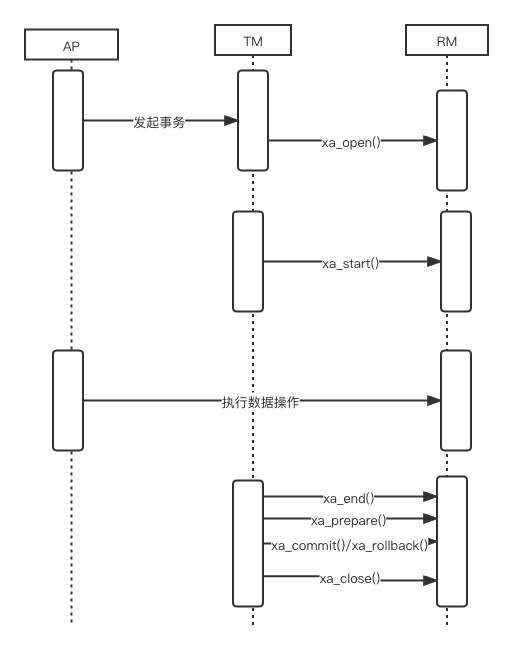
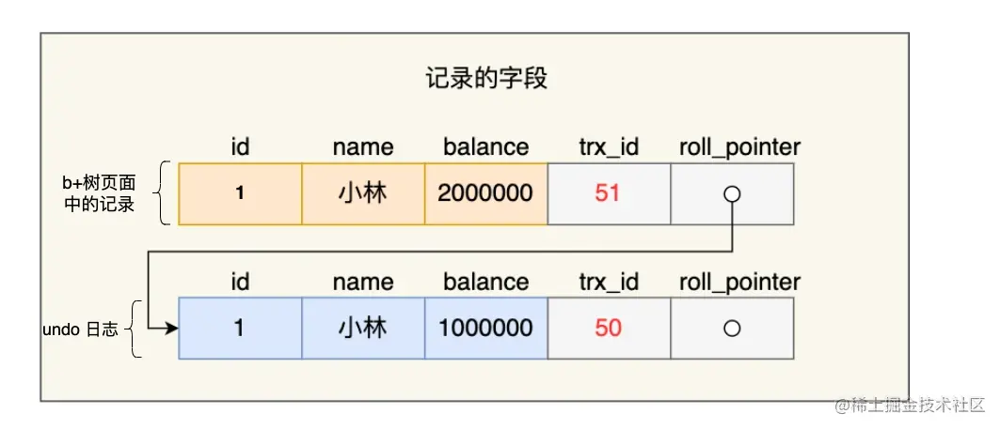

### 61、什么是数据库事务？事务的特性是什么？

> **事务**：
>
> - 是数据库操作的最小工作单元，是作为单个逻辑工作单元执行的一系列操作；
>
> - 这些操作作为一个整体一起向系统提交，要么都执行、要么都不执行；
>
> - 事务是一组不可再分割的操作集合（工作逻辑单元）

事务都有 **ACID** 特性

### 62、什么是ACID？

**1 、原子性**  atomicity

过程的保证

**只做一个步骤**：给钱 ——> 去买 ——> 交回来

事务是数据库的逻辑工作单位，事务中包含的各操作**要么都做，要么都不做**

**2 、一致性**  consistency

结果的保证

**保证要吃完** 刚张嘴挂了，失去一致性

事 务执行的结果必须是使数据库从一个一致性状态变到另一个一致性状态。因此当数据库只包含成功事务提交的结果时，就说数据库处于一致性状态。如果数据库系统 运行中发生故障，有些事务尚未完成就被迫中断，这些未完成事务对数据库所做的修改有一部分已写入物理数据库，这时数据库就处于一种不正确的状态，或者说是 不一致的状态。

**3 、隔离性** isolation

并发事务互相干扰

**不被干扰** 刚张嘴别人塞了东西

一个事务的执行不能其它事务干扰。即一个事务内部的操作及使用的数据对其它并发事务是隔离的，并发执行的各个事务之间不能互相干扰。

**4 、持续性** **永久性** durability

**保存** 吃到肚子里

也称永久性，指一个事务一旦提交，它对数据库中的数据的改变就应该是永久性的。接下来的其它操作或故障不应该对其执行结果有任何影响。

### 63、并发事务会有哪些问题？

> 多个事务并发执行一定会产生相互争夺资源的问题

### 64、什么是脏读

> **脏读（Dirty read）**
>
> 是一个事务在处理过程中读取了另外一个事务未提交的数据
>
> 当一个事务正在访问数据并且对其进行了修改，但是还没提交事务，这时另外一个事务也访问了这个数据，然后使用了这个数据，因为这个数据的修改还没提交到数据库，所以另外一个事务读取的数据就是“**脏数据**”，这种行为就是“**脏读**”，依据“**脏数据**”所做的操作可能是会出现问题的。

### 65、丢失修改

> **修改丢失（Lost of modify）**：*是指一个事务读取一个数据时，另外一个数据也访问了该数据，那么在第一个事务修改了这个数据之后，第二个事务也修改了这个数据。这样第一个事务内的修改结果就被丢失，这种情况就被称为\**修改丢失

### 66、不可重复读

> **不可重复读（Unrepeatableread）**：**指在一个事务内多**次读取同一数据**，在这个事务还没结束时，另外一个事务也访问了这个数据并**对这个数据进行了修改**，那么就可能造成第一个事务两次读取的数据不一致，这种情况就被称为\**不可重复读。

###    67、幻读

> **幻读（Phantom read）**
>
> 是指同一个事务内多次查询返回的结果集总数不一样（比如增加了或者减少了行记录）。
>
> 幻读与不可重复读类似，幻读是指一个事务**读取了几行数据**，这个事务还没结束，接着另外一个事务**插入了一些数据**，在随后的查询中，第一个事务读取到的数据就会**比原本读取到的多**，就好像发生了幻觉一样，所以称为\**幻读**。

### 68、不可重复读和幻读有什么区别？

> 不可重复读 针对的是一份数据的修改
>
> 幻读 针对的是行数修改

### 69、MySQL是如何避免事务并发问题的？

> 避免事务并发问题是需要付出性能代价的，此时和分布式系统设计一样（CAP定理及base理论），为了保证一致性就一定会牺牲性能，要做取舍
>
> 在MySQL内部通过加锁的方式实现好了解决方案可供选择，就是配置事务隔离级别

### 70、什么是事务隔离级别？

```pgsql
事务隔离级别                    脏读     不可重复读(被修改)    幻读（删减）
读未提交（read-uncommitted）    是        是                    是
不可重复读（read-committed）    否        是                    是
可重复读（repeatable-read）     否        否                    是
串行化（serializable）          否        否                    否
```

### 71、默认的级别是什么？

`MySQL InnoDB`存储引擎默认的事务隔离级别是**可重复读（REPEATABLE-READ）**

```
MySQL 5.7 SELECT @@tx_isolation;
MySQL 8.0 SELECT @@transaction_isolation;
```

### 72、如何选择事务隔离级别？

> 隔离级别越低，事务请求的锁越少相应性能也就越高，如没有特殊要求或有错误发生，使用默认的隔离级别即可，如果系统中有高频读写并且对一致性要求高那么就需要比较高的事务隔离级别甚至串行化。

### 73、靠缓存可以提升高事务隔离级别的性能吗？

> 提升事务级别的目的本质是提供更高的数据一致性，如果前置有缓存，那么缓存只能提供高效读并不能保证数据及时一致性，相反的我们还需要对缓存管理有额外的开销。

### 74、MySQL事务隔离是如何实现的？

> 隔离的实现主要是读写锁和MVCC

### 75、什么是一致性非锁定读和锁定读？

**锁定读**

使用到了读写锁

读写锁是最简单直接的的事务隔离实现方式

- 每次读操作需要获取一个共享(读)锁，每次写操作需要获取一个写锁。
- 共享锁之间不会产生互斥，共享锁和写锁之间、以及写锁与写锁之间会产生互斥。
- 当产生锁竞争时，需要等待其中一个操作释放锁后，另一个操作才能获取到锁。

锁机制，解决的就是**多个事务同时更新数据**，此时必须要有一个加锁的机制

- 行锁（记录锁）：解决的就是**多个事务同时更新一行数据**
- 间隙锁：解决的就是**多个事务同时更新多行数据**

下列操作属于锁定读

```
select ... lock in share mode
select ... for update
insert、update、delete
```


**非锁定读**

v10 -> age=18

v11 ->age=19

v12 ->age=15

使用mvcc 多版本控制实现

### 76、说一下MVCC内部细节

> https://dev.MySQL.com/doc/refman/5.7/en/innodb-multi-versioning.html
>
> Multi-Version Concurrency Control 多版本并发控制，*MVCC* 是一种并发控制的方法，一般在数据库管理系统中，实现对数据库的并发访问
>
> InnoDB是一个多版本的存储引擎。它保存有关已更改行的旧版本的信息，以支持并发和回滚等事务特性。这些信息存储在一个称为回滚段的数据结构中的系统表空间或undo表空间中。参见第14.6.3.4节“撤消表空间”。InnoDB使用回滚段中的信息来执行事务回滚所需的撤消操作。它还使用这些信息构建行的早期版本，以实现一致的读取
>
> MVCC 的实现依赖于：隐藏字段、Read View、undo log

**隐藏字段**

- A 6-byte `DB_TRX_ID` 用来标识最近一次对本行记录做修改 (insert 、update) 的事务的标识符 ，即最后一次修改本行记录的事务 id。 如果是 delete 操作， 在 InnoDB 存储引擎内部也属于一次 update 操作，即更新行中的一个特殊位 ，将行标识为己删除，并非真正删除。
- A 7-byte `DB_ROLL_PTR` 回滚指针，指向该行的 undo log 。如果该行未被更新，则为空.
- A 6-byte `DB_ROW_ID` 如果没有设置主键且该表没有唯一非空索引时，`InnoDB` 会使用该 id 来生成聚簇索引.

**Read View**

不同的事务隔离级别中，当有事物在执行过程中修改了数据（更新版本号），在并发事务时需要判断一下版本链中的哪个版本是当前事务可见的。为此InnoDB有了ReadView的概念，使用ReadView来记录和隔离不同事务并发时此记录的哪些版本是对当前访问事物可见的。

**undo log**

除了用来回滚数据，还可以读取可见版本的数据。以此实现非锁定读

### 77、MySQL事务一致性，原子性是如何实现的？

> 首先是通过锁和mvcc实现了执行过程中的一致性和原子性
>
> 其次是在灾备方面通过Redo log实现，Redo log会把事务在执行过程中对数据库所做的所有修改都记录下来，在之后系统崩溃重启后可以把事务所做的任何修改都恢复出来。

### 78、MySQL事务的持久性是如何实现的？

> 使用Redo log保证了事务的持久性。当事务提交时，必须先将事务的所有日志写入日志文件进行持久化，就是我们常说的WAL(write ahead log)机制，如果出现断电重启便可以从redolog中恢复，如果redolog写入失败那么也就意味着修改失败整个事务也就直接回滚了。

### 79、表级锁和行级锁有什么区别？

> **表级锁**：串行化（serializable）时，整表加锁，事务访问表数据时需要申请锁，虽然可分为读锁和写锁，但毕竟是锁住整张表，会导致并发能力下降，一般是做ddl处理时使用
>
> **行级锁**：除了串行化（serializable）时 InnoDB使用的都是行级锁，只锁一行数据，其他行数据不影响，并发能力强。

### 80、什么是行级锁？MySQL如何完成的？

> 行级锁实现比较复杂不是单纯锁住一行数据，是由mvcc完成的。

### 81、什么是共享锁（读锁）？

> 共享锁或S锁，其它事务可以继续加共享锁，但不能加排它锁

### 82、什么是排它锁（写锁/独占锁）？

> 排它锁或X锁，在进行写操作之前要申请并获得，其它事务不能再获得任何锁。

### 83、什么是意向锁？

> 它分为意向共享锁（IS）和意向排他锁（IX）
>
> 一个事务对一张表的某行添加共享锁前，必须获得对该表一个IS锁或者优先级更高的锁。
> 一个事务对一张表的某行添加排他锁之前，它必须对该表获取一个IX锁。
>
> 意向锁属于表锁，它不与innodb中的行锁冲突，任意两个意向锁之间也不会产生冲突，但是会与表锁（S锁和X锁）产生冲突

### 84、InnoDB支持哪几种锁？

> 表锁，行锁，间隙锁，Next-Key锁等
>
> 在Serializable中读加共享锁，写加排他锁，读写互斥
>
> 两段锁协议，将事务分成两个阶段，加锁阶段和解锁阶段（所以叫两段锁）

### 85、当前读和快照读分别是什么？

> 当前读 ：在锁定读（使用锁隔离事物）的时候读到的是最新版本的数据
>
> 快照读：可重复读（repeatable-read）下 mvcc生效读取的是数据的快照，并不是最新版本的数据（未提交事物的数据）

### 086 什么是XA协议？

https://dev.MySQL.com/doc/refman/8.0/en/xa.html



- AP（Application Program）：应用程序，定义事务边界（定义事务开始和结束）并访问事务边界内的资源。
- RM（Resource Manger）资源管理器: 管理共享资源并提供外部访问接口。供外部程序来访问数据库等共享资源。此外，RM还具有事务的回滚能力。
- TM（Transaction Manager）事务管理器：TM是分布式事务的协调者，TM与每个RM进行通信，负责管理全局事务，分配事务唯一标识，监控事务的执行进度，并负责事务的提交、回滚、失败恢复等。


- 应用程序AP向事务管理器TM发起事务请求
- TM调用xa_open()建立同资源管理器的会话
- TM调用xa_start()标记一个事务分支的开头
- AP访问资源管理器RM并定义操作，比如插入记录操作
- TM调用xa_end()标记事务分支的结束
- TM调用xa_prepare()通知RM做好事务分支的提交准备工作。其实就是二阶段提交的提交请求阶段。
- TM调用xa_commit()通知RM提交事务分支，也就是二阶段提交的提交执行阶段。
- TM调用xa_close管理与RM的会话。
    - 这些接口一定要按顺序执行，比如xa_start接口一定要在xa_end之前。此外，这里千万要注意的是事务管理器只是标记事务分支并不执行事务，事务操作最终是由应用程序通知资源管理器完成的。另外，我们来总结下XA的接口
- xa_start:负责开启或者恢复一个事务分支，并且管理XID到调用线程
- xa_end:负责取消当前线程与事务分支的关系
- xa_prepare:负责询问RM 是否准备好了提交事务分支 xa_commit:通知RM提交事务分支
- xa_rollback:通知RM回滚事务分支

### 87、什么是MySQL xa事务？

MySQL的xa事务分为两部分：

1. InnoDB内部本地普通事务操作协调数据写入与log写入两阶段提交
2. 外部分布式事务

```
5.7 SHOW VARIABLES LIKE '%innodb_support_xa%';
8.0 默认开启无法关闭
```


XA 事务语法示例如下：

```text
XA START '自定义事务id';

SQL语句...

XA END '自定义事务id';
XA PREPARE '自定义事务id';
XA COMMIT\ROLLBACK '自定义事务id';
```

XA PREPARE 执行成功后，事务信息将被持久化。即使会话终止甚至应用服务宕机，只要我们将【自定义事务id】记录下来，后续仍然可以使用它对事务进行 rollback 或者 commit。

### 88、XA事务与普通事务区别是什么？

> xa事务可以跨库或跨服务器，属于分布式事务，同时xa事务还支撑了InnoDB内部日志两阶段记录
>
> 普通事务只能在单库中执行

### 89、什么是2pc 3pc？

两阶段提交协议与3阶段提交协议，额外增加了参与的角色保证分布式事务完成更完善

### 90、是否使用过select for update？会产生哪些操作？

```
查询库存 = 100  0 扣减库存  = -1 99
记录日志 = log
提交  commit
```

select本身是一个查询语句，查询语句是不会产生冲突的一种行为，一般情况下是没有锁的，用select for update 会让select语句产生一个排它锁(X), 这个锁和update的效果一样，会使两个事务无法同时更新一条记录。

https://dev.MySQL.com/doc/refman/8.0/en/innodb-locks-set.html

https://dev.MySQL.com/doc/refman/8.0/en/select.html

- for update仅适用于InnoDB，且必须在事务块(BEGIN/COMMIT)中才能生效。

- 在进行事务操作时，通过“for update”语句，MySQL会对查询结果集中每行数据都添加排他锁，其他线程对该记录的更新与删除操作都会阻塞。排他锁包含行锁、表锁。
- **InnoDB默认是行级别的锁，在筛选条件中当有明确指定主键或唯一索引列的时候，是行级锁。否则是表级别。**

示例

```
SELECT … FOR UPDATE [OF column_list][WAIT n|NOWAIT][SKIP LOCKED];
select * from t for update 会等待行锁释放之后，返回查询结果。
select * from t for update nowait 不等待行锁释放，提示锁冲突，不返回结果
select * from t for update wait 5 等待5秒，若行锁仍未释放，则提示锁冲突，不返回结果
select * from t for update skip locked 查询返回查询结果，但忽略有行锁的记录
```


### 091说一下MySQL死锁的原因和处理方法

```
事务 a

表 t  id=100 更新  加行锁
表 t  id=200 更新  已加锁


事务 b

表 t  id=200 更新 加行锁
表 t  id=100 更新 已加锁
```


- 死锁与锁等待是两个概念
    - 如未开启事务，多个客户端执行的insert操作
- 当多个事务同时持有和请求同一资源上的锁而产生循环依赖的时候就产生了死锁。

排查：

- 正在运行的任务
    - show full processlist;  找到卡主的进程
- 解开死锁
    - UNLOCK TABLES ；
- 查看当前运行的事务
    - SELECT * FROM information_schema.INNODB_TRX;
- 当前出现的锁
    - SELECT * FROM information_schema.INNODB_LOCKS;
- 观察错误日志
- 查看InnoDB锁状态
    - `show status like "innodb_row_lock%";`

lnnodb_row_lock_current_waits:当前正在等待锁定的数量;
lnnodb_row_lock_time :从系统启动到现在锁定的总时间长度，单位ms;
Innodb_row_lock_time_avg :每次等待所花平均时间;
Innodb_row_lock_time_max:从系统启动到现在等待最长的一次所花的时间;
lnnodb_row_lock_waits :从系统启动到现在总共等待的次数。

- kill  id 杀死进程


解决：

- 死锁无法避免，上线前要进行严格的压力测试

- 快速失败
    - innodb_lock_wait_timeout 行锁超时时间
- 拆分sql，严禁大事务
- 充分利用索引，优化索引，尽量把有风险的事务sql使用上覆盖索，优化where条件前缀匹配，提升查询速度，引减少表锁
- 无法避免时：
    - 操作多张表时，尽量以相同的顺序来访问避免形成等待环路
    - 单张表时先排序再操作
    - 使用排它锁 比如 for update

### 092 MySQL会产生几种日志？

> - **错误日志（error log）**
>
> error log主要记录MySQL在启动、关闭或者运行过程中的错误信息，在MySQL的配置文件my.cnf中，可以通过log-error=/var/log/MySQLd.log 执行MySQL错误日志的位置。
>
> - **慢查询日志（slow query log）**
>
> 0.1秒
>
> Ø MySQL的慢查询日志是MySQL提供的一种日志记录，它用来记录在MySQL中响应时间超过阀值的语句，具体指运行时间超过long_query_time值的SQL，则会被记录到慢查询日志中。
>
> Ø long_query_time的默认值为10，意思是运行10秒以上的语句。
>
> Ø 由他来查看哪些SQL超出了我们的最大忍耐时间值，比如一条sql执行超过5秒钟，我们就算慢SQL，希望能收集超过5秒的sql，结合之前explain进行全面分析。
>
> Ø 默认情况下，MySQL数据库没有开启慢查询日志，需要我们手动来设置这个参数。
>
> Ø 当然，如果不是调优需要的话，一般不建议启动该参数，因为开启慢查询日志会或多或少带来一定的性能影响。慢查询**日志支持将日志记录写入文件**。
>
>  在生产环境中，如果要手工分析日志，查找、分析SQL，显然是个体力活，MySQL提供了日志分析工具MySQLdumpslow。
>
> - **一般查询日志（general log）**
>
> general log 记录了客户端连接信息以及执行的SQL语句信息，通过MySQL的命令
>
> - **重写日志（redo log）**
>
> - **回滚日志（undo log）**
>
> - **二进制日志（bin log）******

### 93、bin log作用是什么？

> MySQL的bin log日志是用来记录MySQL中增删改时的记录日志。
>
> 当你的一条sql操作对数据库中的内容进行了更新，就会增加一条bin log日志。查询操作不会记录到bin log中。
>
> bin log最大的用处就是进行**主从复制，以及数据库的恢复。**

### 94、redo log作用是什么？

> redo log是一种基于磁盘的数据结构，用来在MySQL宕机情况下将不完整的事务执行数据纠正，redo日志记录事务执行后的状态。
>
> 当事务开始后，redo log就开始产生，并且随着事务的执行不断写入redo log file中。redo log file中记录了xxx页做了xx修改的信息，我们都知道数据库的更新操作会在内存中先执行，最后刷入磁盘。
>
> redo log就是为了恢复更新了内存但是由于宕机等原因没有刷入磁盘中的那部分数据。

### 95、undo log作用是什么？

> undo log主要用来回滚到某一个版本，是一种逻辑日志。
>
> undo log记录的是修改之前的数据，比如：当delete一条记录时，undolog中会记录一条对应的insert记录，从而保证能恢复到数据修改之前。在执行事务回滚的时候，就可以通过undo log中的记录内容并以此进行回滚。
>
> undo log还可以提供多版本并发控制下的读取（MVCC）。

### 96、MySQL日志是否实时写入磁盘？

> 每个日志都不一样，这个得分情况考虑

### 97、bin log刷盘机制是如何实现的？

> `sync_binlog`参数控制着事务提交时binlog写入磁盘的策略
>
> binlog 写入策略：
>
> **1、sync_binlog=0** 的时候，表示每次提交事务binlog不会马上写入到磁盘，而是先写到page cache,相对于磁盘写入来说写page cache要快得多,不过在MySQL 崩溃的时候会有丢失日志的风险。
>
> **2、sync_binlog=1** 的时候，表示每次提交事务都会执行 fsync 写入到磁盘 ；
>
> **3、sync_binlog的值大于1** 的时候，表示每次提交事务都 先写到page cach，只有等到积累了N个事务之后才fsync 写入到磁盘，同样在此设置下MySQL 崩溃的时候会有丢失N个事务日志的风险。
>
> 很显然三种模式下，sync_binlog=1 是强一致的选择，选择0或者N的情况下在极端情况下就会有丢失日志的风险，具体选择什么模式还是得看系统对于一致性的要求。

### 98、redo log刷盘机制是如何实现的？

> 事务执行过程中，InnoDB会先把redo log日志写到InnoDB的log buffer内存中。MySQL支持用户自定义在commit（这里的commit指的是sql中的commit，在具体的两阶段提交中对应的prepare阶段）时`将log buffer中的日志刷log file中的策略`，通过`innodb_flush_log_at_trx_commit`参数设置
>
> - `设置为0`：仅将日志写入log file buffer中。该模式下，在事务提交的时候，不会主动触发写入磁盘的操作，仅依靠InnoDB  的后台线程每秒执行一次刷盘操作，即`每秒一次write cache和flush disk`。
>
> - `设置为1`：每次事务commit时MySQL都会把log buffer的数据立即写入log file的os cache中，并且立即flush刷到磁盘中去。即`每次commit都write cache和flush disk，这是默认设置`。
>
> - `设置为2`：每次事务commit时MySQL都会把log buffer的数据写入log file的os cache 缓存，但是flush刷到磁盘的操作并不会同时进行，仅依靠InnoDB 的后台线程每秒执行一次真正的刷盘操作。即`每次commit都write cache，每秒一次flush disk`。

### 99、undo log刷盘机制是如何实现的？

> undo log 是一种用于撤销回退的日志。在事务没提交之前，MySQL 会先记录更新前的数据到 undo log 日志文件里面，当事务回滚时，可以利用 undo log 来进行回滚。
>
> 条记录的每一次更新操作产生的 undo log 格式都有一个 roll_pointer 指针和一个 trx_id 事务id：
>
> - 通过 trx_id 可以知道该记录是被哪个事务修改的；
> - 通过 roll_pointer 指针可以将这些 undo log 串成一个链表，这个链表就被称为版本链；
>
> 版本链如下图：
>
> 
>
> undo log 两大作用：
>
> - **实现事务回滚，保障事务的原子性**。事务处理过程中，如果出现了错误或者用户执 行了 ROLLBACK 语句，MySQL 可以利用 undo log 中的历史数据将数据恢复到事务开始之前的状态。
> - **实现 MVCC（多版本并发控制）关键因素之一**。MVCC 是通过 ReadView + undo log 实现的。undo log 为每条记录保存多份历史数据，MySQL 在执行快照读（普通 select 语句）的时候，会根据事务的 Read View 里的信息，顺着 undo log 的版本链找到满足其可见性的记录。

时机顺序：

- 1 开启事务

- 2 查询数据库中需要更新的字段，加载到内存中 形成数据**脏页**

- 3 记录undo log到内存缓冲区（用于回滚和mvcc）并关联redo log   -> 可刷盘

- 4 记录 redo log到内存缓冲区 （用于失败重放）准备提交事务           -> 可刷盘

- 5 修改内存中的脏页数据

- 6 提交事务触发redolog刷盘

- 7 undo log 和脏页 刷盘

- 8 事务成功


### 100 MySQL的binlog有有几种录入格式？分别有什么区别？

> logbin格式：
>
> - binlog_format=STATEMENT（默认）：数据操作的时间，同步时不一致 每一条会修改数据的sql语句会记录到binlog中。优点是并不需要记录每一 条sql语句和每一行的 数据变化，减少了binlog日志量，节约IO，提高性能。缺点是在某些情况下会导致 master-slave 中的数据不一致( 如sleep()函数， last_insert_id()，以及user-defined functions(udf)等会 出	现 问题)
> - binlog_format=ROW：批量数据操作时，效率低   不记录每条sql语句的上下文信息，仅需记录哪条数据被修改了，修改成什么样 了。而且不会出 现某些特定情况下的存储过程、或function、或trigger的调用和触发无法被正确复制的 问题。缺 点是会产生大量的日志，尤其是alter table的时候会让日志暴涨。
> - binlog_format=MIXED：是以上两种level的混合使用，有函数用ROW，没函数用STATEMENT，但是无法识别系统变量

### 101 MySQL集群同步时为什么使用binlog？优缺点是什么？

> - binlog是MySQL提供的日志，所有存储引擎都可用。
> - 支持增量同步
> - binlog还可以供其他中间件读取，比如同步到hdfs中
> - 如果复制表数据：
    >   - 不支持某个阶段回放
    >   - 直接复制数据过程中一旦中断复制（比如断网），很难确定复制的offset
