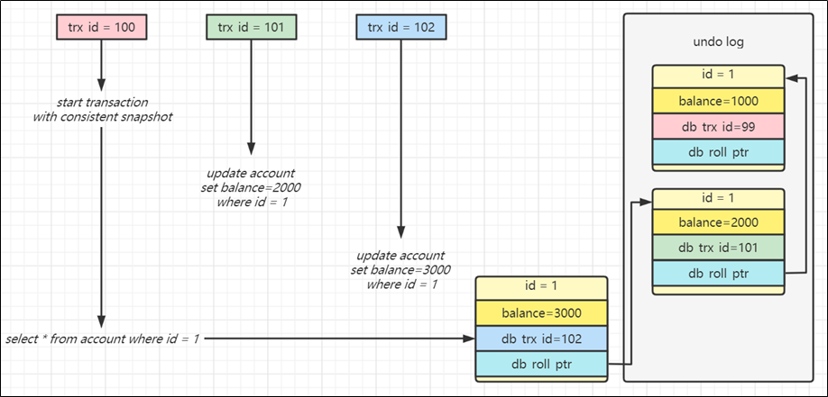

## 1、数据库三范式是什么?

> - 第一范式（1NF）：字段具有原子性,不可再分。(所有关系型数据库系统都满足第一范式数据库表中的字段都是单一属性的，不可再分)
> - 第二范式（2NF）是在第一范式（1NF）的基础上建立起来的，即满足第二范式（2NF）必须先满足第一范式（1NF）。要求数据库表中的每个实例或行必须可以被惟一地区分。通常需要为表加上一个列，以存储各个实例的惟一标识。这个惟一属性列被称为主关键字或主键。
> - 满足第三范式（3NF）必须先满足第二范式（2NF）。简而言之，第三范式（3NF）要求一个数据库表中不包含已在其它表中已包含的非主关键字信息。 所以第三范式具有如下特征：
    >   - 每一列只有一个值
>   - 每一行都能区分。
>   - 每一个表都不包含其他表已经包含的非主关键字信息。


## 2、请简述常用的索引有哪些种类?

> 从 **功能逻辑** 上说，索引主要有 4 种，分别是普通索引、唯一索引、主键索引、全文索引。
>
> 按照 **物理实现**方式 ，索引可以分为 2 种：聚簇索引和非聚簇索引。
>
> 按照 **作用字段个数** 进行划分，分成单列索引和联合索引
>
> - **普通索引:** 即针对数据库表创建索引
> - **唯一索引**: 与普通索引类似，不同的就是：MySQL数据库索引列的值必须唯一，但允许有空值
> - **主键索引**: 它是一种特殊的唯一索引，不允许有空值。一般是在建表的时候同时创建主键索引
> - **组合索引**: 为了进一步榨取MySQL的效率，就要考虑建立组合索引。即将数据库表中的多个字段联合起来作为一个组合索引。
> - **全文索引**：是目前搜索引擎使用的一种关键技术，对文本的内容进行分词、搜索。
> - **覆盖索引**：查询列要被所建的索引覆盖，不必读取数据行


## 3、MySQL数据库中索引的工作机制是什么？

> 数据库索引，是数据库管理系统中一个排序的数据结构，以协助快速查询、更新数据库表中数据。
>
> 索引的实现通常使用B树及其变种B+树


## 4、MySQL的基础操作命令

> - MySQL 是否处于运行状态:
    >   - Debian 上运行命令 `service mysql status`，
>   - 在RedHat 上运行命令 `service mysqld status`
> - 开启或停止 MySQL 服务
    >   - service mysqld start 开启服务
>   - service mysqld stop 停止服务
> - 列出所有数据库:运行命令 show databases;
> - 切换到某个数据库并在上面工作:运行命令 use databasename; 进入名为 databasename 的数据库
> - 列出某个数据库内所有表: show tables;


## 5、一张表，里面有ID自增主键，当insert了17条记录之后，删除了第15,16,17条记录，再把Mysql重启，再insert一条记录，这条记录的ID是18还是15 ？

> 1. 如果表的类型为`MyISAM`，ID为18
     >    - 因为MyISAM表会把自增主键的最大ID记录到数据文件里，重启MySQL自增主键的最大ID也不会丢失
> 2. 如果表的类型是`InnoDB`，ID是15
     >    - InnoDB表只是把自增主键的最大ID记录到内存中，所以重启数据库或者是对表进行OPTIMIZE操作，都会导致最大ID丢失


## 6、MySQL中varchar与char的区别以及varchar(32)中的32代表的涵义？

> `varchar`与`char`的区别:
>
> - char是一种固定长度的类型
> - varchar则是一种可变长度的类型.
>
> `varchar(32)`中32的涵义 : 最多存放32个字节
>
> int（20）中20的涵义: int(M)中的M indicates the maximum display width (最大显示宽度)for integer types. The maximum legal display width is 255.


## 7、`SELECT *` 和`SELECT 全部字段`的2种写法有何优缺点?

|              |    SELECT *    |   SELECT 全部字段    |
| ------------ | :------------: | :------------------: |
| 解析数据字典 |      需要      |        不需要        |
| 输出顺序     | 建表列顺序相同 |     指定字段顺序     |
| 字段改名     |   不需要修改   |         需要         |
| 索引优化     |    无法优化    | 可以建立索引进行优化 |
| 可读性       |    可读性低    |       可读性高       |

## 8、HAVNG 子句 和 WHERE的异同点?

|          |               having               |          where          |
| -------- | :--------------------------------: | :---------------------: |
| 语法上   |       having用select结果别名       |    where 用表中列名     |
| 结果范围 |          返回客户端的行数          | where从表读出数据的行数 |
| 索引     | 不能使用索引，只能在临时结果集操作 |      可以使用索引       |
| 聚集函数 |         专门使用聚集函数的         |    不能使用聚集函数     |


## 9、如何区分FLOAT和DOUBLE？

> - 浮点数以8位精度存储在FLOAT中，并且有四个字节
> - 浮点数存储在DOUBLE中，精度为18位，有八个字节

## 10、一张表最多创建多少索引？

> 任何标准表最多可以创建16个索引列。

## 11、MySQL里记录金钱用什么字段类型?

> `NUMERIC`和`DECIMAL`类型被Mysql实现为同样的类型，这在SQL92标准允许。他们被用于保存值，该值的准确精度是极其重要的值，例如与金钱有关的数据。当声明一个类是这些类型之一时，精度和规模的能被(并且通常是)指定。

PS：`salary DECIMAL(9,2)`

在这个例子中，9(precision)代表将被用于存储值的总的小数位数，而2(scale)代表将被用于存储小数点后的位数。

因此，在这种情况下，能被存储在salary列中的值的范围是从-9999999.99到9999999.99。在ANSI/ISO SQL92中，句法DECIMAL(p)等价于DECIMAL(p,0)。

同样，句法DECIMAL等价于DECIMAL(p,0)，这里实现被允许决定值p。Mysql当前不支持DECIMAL/NUMERIC数据类型的这些变种形式的任何一种。


## 12、MySQL 中有哪几种锁？

> `表级锁`： 开销小， 加锁快； 不会出现死锁； 锁定粒度大， 发生锁冲突的概率最高， 并发度最低。<br/>
> `行级锁`： 开销大， 加锁慢； 会出现死锁； 锁定粒度最小， 发生锁冲突的概率最低， 并发度也最高。<br/>
> `页面锁`： 开销和加锁时间界于表锁和行锁之间； 会出现死锁； 锁定粒度界于表锁和行锁之间， 并发度一般。


## 13、MySQL 中有哪些不同的表格？

> - MyISAM
> - Heap
> - Merge
> - INNODB
> - MISAM
>
> MyISAM是Mysql的默认存储引擎。


## 14、Mysql如何优化DISTINCT？

> DISTINCT在所有列上转换为GROUP BY，并与ORDER BY子句结合使用。

## 15、CHAR 和VARCHAR 的区别？

> - CHAR 和 VARCHAR **类型在存储和检索方面有所不同**
> - CHAR 列长度固定为创建表时声明的长度， 长度值范围是 1 到 255 当 CHAR 值被存储时， 它们被用空格填充到特定长度， 检索 CHAR 值时需删除尾随空格。

## 16、MySQL 数据库作发布系统的存储，一天五万条以上的增量， 预计运维三年,怎么优化？

> - 设计良好的数据库结构， 允许部分数据冗余， 尽量避免 join 查询， 提高效率。
> - 选择合适的表字段数据类型和存储引擎， 适当的添加索引。
> - MySQL 库主从读写分离。
> - 找规律分表， 减少单表中的数据量提高查询速度。
> - 添加缓存机制， 比如 memcached， apc等。
> - 不经常改动的页面， 生成静态页面。
> - 书写高效率的 SQL。比如 SELECT * FROM TABEL 改为 SELECT field_1, field_2, field_3 FROM TABLE.

## 17、limit 1000000加载很慢的话，你是怎么解决的呢？

> **方案一：如果id是连续的，可以这样，返回上次查询的最大记录(偏移量)，再往下limit**
>
> ```
> select id，name from employee where id>1000000 limit 10.
> ```
>
> ### **方案二：在业务允许的情况下限制页数：**
>
> 建议跟业务讨论，有没有必要查这么后的分页啦。因为绝大多数用户都不会往后翻太多页。
>
> ### **方案三：order by + 索引（id为索引）**
>
> ```
> select id，name from employee order by id  limit 1000000，10
> ```
>
> ### **方案四：利用延迟关联或者子查询优化超多分页场景。（先快速定位需要获取的id段，然后再关联）**
>
> ```
> SELECT a.* FROM employee a, (select id from employee where 条件 LIMIT 1000000,10 ) b where a.id=b.
> ```

## 18、实践中如何优化 MySQL？

> - SQL 语句及索引的优化
> - 数据库表结构的优化
> - 系统配置的优化
> - 硬件的优化

## 19、优化数据库的方法？

> - 选取最适用的字段属性，尽可能减少定义字段宽度，尽量把字段设置 NOTNULL， 例如’ 省份’、’ 性别’ 最好适用 ENUM
> - 使用连接(JOIN)来代替子查询
> - 适用联合(UNION)来代替手动创建的临时表
> - 事务处理
> - 分库分表
> - 读写分离
> - 锁定表、优化事务处理
> - 适用外键， 优化锁定表
> - 建立索引
> - 优化查询语句

## 20、InnoDB与MyISAM的区别

> - InnoDB支持事务，MyISAM不支持事务
> - InnoDB支持外键，MyISAM不支持外键
> - InnoDB 支持 MVCC(多版本并发控制)，MyISAM 不支持
> - select count(*) from table时，MyISAM更快，因为它有一个变量保存了整个表的总行数，可以直接读取，InnoDB就需要全表扫描。
> - Innodb不支持全文索引，而MyISAM支持全文索引（5.7以后的InnoDB也支持全文索引）
> - InnoDB支持表、行级锁，而MyISAM支持表级锁。
> - InnoDB表必须有主键，而MyISAM可以没有主键
> - Innodb表需要更多的内存和存储，而MyISAM可被压缩，存储空间较小，。
> - Innodb按主键大小有序插入，MyISAM记录插入顺序是，按记录插入顺序保存。
> - InnoDB 存储引擎提供了具有提交、回滚、崩溃恢复能力的事务安全，与 MyISAM 比 InnoDB 写的效率差一些，并且会占用更多的磁盘空间以保留数据和索引

## 21、MySQL遇到过死锁问题吗，你是如何解决的？

> - 查看死锁日志show engine innodb status;
> - 找出死锁Sql
> - 分析sql加锁情况
> - 模拟死锁案发
> - 分析死锁日志
> - 分析死锁结果

## 22、创建索引的原则

> - 最左前缀匹配原则
> - 频繁作为查询条件的字段才去创建索引
> - 频繁更新的字段不适合创建索引
> - 索引列不能参与计算，不能有函数操作
> - 优先考虑扩展索引，而不是新建索引，避免不必要的索引
> - 在order by或者group by子句中，创建索引需要注意顺序
> - 区分度低的数据列不适合做索引列(如性别）
> - 定义有外键的数据列一定要建立索引。
> - 对于定义为text、image数据类型的列不要建立索引。
> - 删除不再使用或者很少使用的索引


## 23、创建索引的方式有哪些？

> 1. 在创建表的时候创建索引
     >
     >    ```sql
>    CREATE TABLE table_name [col_name data_type] [UNIQUE | FULLTEXT | SPATIAL] [INDEX | KEY] [index_name] (col_name [length]) [ASC | DESC]
>    ```
     >
     >    - UNIQUE 、 FULLTEXT 和 SPATIAL 为可选参数，分别表示唯一索引、全文索引和空间索引；
>    - INDEX 与 KEY 为同义词，两者的作用相同，用来指定创建索引；
>
>    - index_name 指定索引的名称，为可选参数，如果不指定，那么MySQL默认col_name为索引名；
>
>    - col_name 为需要创建索引的字段列，该列必须从数据表中定义的多个列中选择；
>
>    - length 为可选参数，表示索引的长度，只有字符串类型的字段才能指定索引长度；
>
>    - ASC 或 DESC 指定升序或者降序的索引值存储。
>
> 2. 使用ALTER TABLE命令添加索引
     >
     >    ```sql
>    alter table table_name ADD index index_name(column);
>    ```
>
>
>
> 3. 使用CREATE INDEX命令创建
     >
     >    ```sql
>    create index index_name ON table_name(column);
>    ```


## 24、如何删除百万级别以上的数据？

> - 可以删除百万数据的时候可以先删除索引
> - 然后批量删除其中无用数据
> - 删除完成后重新创建索引


## 25、索引的优缺点？

> **优点：**
>
> - 类似大学图书馆建书目索引，提高数据检索的效率，降低 数据库的IO成本 ，这也是创建索引最主要的原因
> - 通过创建唯一索引，可以保证数据库表中每一行 数据的唯一性
> - 在实现数据的参考完整性方面，可以 加速表和表之间的连接 。换句话说，对于有依赖关系的子表和父表联合查询时，可以提高查询速度
> - 在使用分组和排序子句进行数据查询时，可以显著 减少查询中分组和排序的时 间 ，降低了CPU的消耗
>
> **缺点：**
>
> - 创建索引和维护索引要 耗费时间 ，并且随着数据量的增加，所耗费的时间也会增加
> - 索引需要占 磁盘空间 ，除了数据表占数据空间之外，每一个索引还要占一定的物理空间， 存储在磁盘上 ，如果有大量的索引，索引文件就可能比数据文件更快达到最大文件尺寸
> - 虽然索引大大提高了查询速度，同时却会 降低更新表的速度 。当对表中的数据进行增加、删除和修改的时候，索引也要动态地维护，这样就降低了数据的维护速度


## 26、哪些情况适合创建索引？

### 1、字段的数值有唯一性的限制

> 业务上具有唯一特性的字段，即使是组合字段，也必须建成唯一索引。（来源：Alibaba）
>
> 说明：不要以为唯一索引影响了 insert 速度，这个速度损耗可以忽略，但提高查找速度是明显的。


### 2、频繁作为WHERE查询条件的字段

> 某个字段在SELECT语句的 WHERE 条件中经常被使用到，那么就需要给这个字段创建索引了。尤其是在数据量大的情况下，创建普通索引就可以大幅提升数据查询的效率。
>
> 例如：比如student_info数据表（含100万条数据），假设我们想要查询 student_id=123110 的用户信息。


### 3、经常 GROUP BY 和 ORDER BY 的列

> 索引就是让数据按照某种顺序进行存储或检索，因此当我们使用 `GROUP BY `对数据进行分组查询，或者使用` ORDER BY` 对数据进行排序的时候，就需要 对分组或者排序的字段进行索引 。如果待排序的列有多个，那么可以在这些列上建立` 组合索引 `


### 4、UPDATE、DELETE 的 WHERE 条件列

> 对数据按照某个条件进行查询后再进行 UPDATE 或 DELETE 的操作，如果对 WHERE 字段创建了索引，就能大幅提升效率。原理是因为我们需要先根据 WHERE 条件列检索出来这条记录，然后再对它进行更新或删除。**如果进行更新的时候，更新的字段是非索引字段，提升的效率会更明显，这是因为非索引字段更新不需要对索引进行维护。**


### 5、DISTINCT 字段需要创建索引

> 有时候我们需要对某个字段进行去重，使用 DISTINCT，那么对这个字段创建索引，也会提升查询效率


### 6、多表 JOIN 连接操作时，创建索引注意事项

> 1. 连接表的数量尽量不要超过 3 张 ，因为每增加一张表就相当于增加了一次嵌套的循环，数量级增长会非常快，严重影响查询的效率。
> 2. 对 WHERE 条件创建索引 ，因为 WHERE 才是对数据条件的过滤。如果在数据量非常大的情况下，没有 WHERE 条件过滤是非常可怕的。
> 3. 对用于连接的字段创建索引 ，并且该字段在多张表中的 类型必须一致 。比如 course_id 在 student_info 表和 course 表中都为 int(11) 类型，而不能一个为 int 另一个为 varchar 类型


### 7、使用列的类型小的创建索引


### 8、使用字符串前缀创建索引

创建一张商户表，因为地址字段比较长，在地址字段上建立前缀索引

```sql
create table shop(address varchar(120) not null); 
alter table shop add index(address(12));
```

问题是，截取多少呢？截取得多了，达不到节省索引存储空间的目的；截取得少了，重复内容太多，字段的散列度(选择性)会降低。**怎么计算不同的长度的选择性呢？**

先看一下字段在全部数据中的选择度：

```sql
select count(distinct address) / count(*) from shop;
```

通过不同长度去计算，与全表的选择性对比：

**公式**：

```sql
count(distinct left(列名, 索引长度))/count(*)
```

例如：

```sql
select count(distinct left(address,10)) / count(*) as sub10, -- 截取前10个字符的选择度 
count(distinct left(address,15)) / count(*) as sub11, -- 截取前15个字符的选择度 
count(distinct left(address,20)) / count(*) as sub12, -- 截取前20个字符的选择度 
count(distinct left(address,25)) / count(*) as sub13 -- 截取前25个字符的选择度
from shop;
```

**引申另一个问题：索引列前缀对排序的影响**

**拓展：Alibaba《Java开发手册》**

【 强制 】在 varchar 字段上建立索引时，必须指定索引长度，没必要对全字段建立索引，根据实际文本区分度决定索引长度。

说明：索引的长度与区分度是一对矛盾体，一般对字符串类型数据，长度为 20 的索引，区分度会 高达 90% 以上 ，可以使用 count(distinct left(列名, 索引长度))/count(*)的区分度来确定。


### 9、 区分度高(散列性高)的列适合作为索引

### 10、使用最频繁的列放到联合索引的左侧

> 这样也可以较少的建立一些索引。同时，由于"最左前缀原则"，可以增加联合索引的使用率。

### 11、在多个字段都要创建索引的情况下，联合索引优于单值索引


## 27、哪些情况下创建索引，但是没有生效？

> 1. 查询条件包含or，可能导致索引失效
> 2. 如何字段类型是字符串，where时一定用引号括起来，否则索引失效
> 3. like通配符可能导致索引失效。
> 4. 联合索引，查询时的条件列不是联合索引中的第一个列，索引失效。
> 5. 在索引列上使用mysql的内置函数，索引失效。
> 6. 对索引列运算（如，+、-、*、/），索引失效。
> 7. 索引字段上使用（！= 或者 < >，not in）时，可能会导致索引失效。
> 8. 索引字段上使用is null， is not null，可能导致索引失效。
> 9. 左连接查询或者右连接查询查询关联的字段编码格式不一样，可能导致索引失效。
> 10. mysql估计使用全表扫描要比使用索引快,则不使用索引。


## 28、数据库索引的原理，为什么要用B+树，为什么不用二叉树？

> **为什么不是一般二叉树？**
>
> 如果二叉树特殊化为一个链表，相当于全表扫描。平衡二叉树相比于二叉查找树来说，查找效率更稳定，总体的查找速度也更快。
>
> **为什么不是平衡二叉树呢？**
>
> 我们知道，在内存比在磁盘的数据，查询效率快得多。如果树这种数据结构作为索引，那我们每查找一次数据就需要从磁盘中读取一个节点，也就是我们说的一个磁盘块，但是平衡二叉树可是每个节点只存储一个键值和数据的，如果是B树，可以存储更多的节点数据，树的高度也会降低，因此读取磁盘的次数就降下来啦，查询效率就快啦。
>
> **那为什么不是B树而是B+树呢？**
>
> - B+树非叶子节点上是不存储数据的，仅存储键值，而B树节点中不仅存储键值，也会存储数据。innodb中页的默认大小是16KB，如果不存储数据，那么就会存储更多的键值，相应的树的阶数（节点的子节点树）就会更大，树就会更矮更胖，如此一来我们查找数据进行磁盘的IO次数有会再次减少，数据查询的效率也会更快。
>
> - B+树索引的所有数据均存储在叶子节点，而且数据是按照顺序排列的，链表连着的。那么B+树使得范围查找，排序查找，分组查找以及去重查找变得异常简单。


## 29、如何选择合适的分布式主键？

> - 数据库自增长序列或字段
> - UUID
> - Redis生成ID
> - Twitter的snowflake算法
> - 利用zookeeper生成唯一ID
> - MongoDB的ObjectId


## 30、在高并发情况下，如何做到安全的修改同一行数据？

> 这种情况下，采用加锁的方式进行安全修改
>
> ### **使用悲观锁**
>
> 悲观锁思想就是，当前线程要进来修改数据时，别的线程都得拒之门外~ 比如，可以使用select…for update ~
>
> ```
> select * from User where name=‘jay’ for update
> ```
>
> 以上这条sql语句会锁定了User表中所有符合检索条件（name=‘jay’）的记录。本次事务提交之前，别的线程都无法修改这些记录。
>
> ### **使用乐观锁**
>
> 乐观锁思想就是，有线程过来，先放过去修改，如果看到别的线程没修改过，就可以修改成功，如果别的线程修改过，就修改失败或者重试。实现方式：乐观锁一般会使用版本号机制或CAS算法实现。


## 31、数据库自增主键可能遇到什么问题

> - 使用自增主键对数据库做分库分表，可能出现诸如主键重复等的问题。解决方案的话，简单点的话可以考虑使用UUID解决，复杂的可以考虑前面提到的分布式主键方案
> - 自增主键会产生表锁，从而引发问题
> - 自增主键可能用完问题。


## 32、MVCC你了解吗？

> **多版本并发控制**技术的英文全称是 **Multiversion Concurrency Control**，简称 **MVCC**。
>
> **多版本并发控制（MVCC）** 是通过保存数据在某个时间点的快照来实现并发控制的。也就是说，不管事务执行多长时间，事务内部看到的数据是不受其它事务影响的，根据事务开始的时间不同，每个事务对同一张表，同一时刻看到的数据可能是不一样的。
>
> 简单来说，**多版本并发控制** 的思想就是保存数据的历史版本，通过对数据行的多个版本管理来实现数据库的并发控制。这样我们就可以通过比较版本号决定数据是否显示出来，读取数据的时候不需要加锁也可以保证事务的隔离效果。
>
> **MVCC需要关注这几个知识点：**
>
> - 事务版本号
> - 表的隐藏列
> - undo log
> - read view


## 33、说一下大表查询的优化方案

> - 优化shema、sql语句+索引；
> - 可以考虑加缓存，memcached, redis，或者JVM本地缓存；
> - 主从复制，读写分离；
> - 分库分表；


## 34、Blob和text有什么区别？

> - Blob用于存储二进制数据，而Text用于存储大字符串。
> - Blob值被视为二进制字符串（字节字符串）,它们没有字符集，并且排序和比较基于列值中的字节的数值。
> - text值被视为非二进制字符串（字符字符串）。它们有一个字符集，并根据字符集的排序规则对值进行排序和比较。


## 35、组合索引是什么？为什么需要注意组合索引中的顺序？

> 组合索引，用户可以在多个列上建立索引,这种索引叫做组合索引。
>
> 因为InnoDB引擎中的索引策略的最左原则，所以需要注意组合索引中的顺序。


## 36、为什么要使用视图？什么是视图？

**为什么要使用视图？**

为了提高复杂SQL语句的复用性和表操作的安全性，MySQL数据库管理系统提供了视图特性。

**什么是视图？**

> 视图是一个虚拟的表，是一个表中的数据经过某种筛选后的显示方式，视图由一个预定义的查询select语句组成。


## 37、视图有哪些特点？哪些使用场景？

> **视图特点：**
>
> - 视图的列可以来自不同的表，是表的抽象和在逻辑意义上建立的新关系。
> - 视图是由基本表(实表)产生的表(虚表)。
> - 视图的建立和删除不影响基本表。
> - 对视图内容的更新(添加，删除和修改)直接影响基本表。
> - 当视图来自多个基本表时，不允许添加和删除数据。
>
> **视图用途：** 简化sql查询，提高开发效率，兼容老的表结构。
>
> **视图的常见使用场景：**
>
> - 重用SQL语句；
> - 简化复杂的SQL操作。
> - 使用表的组成部分而不是整个表；
> - 保护数据
> - 更改数据格式和表示。视图可返回与底层表的表示和格式不同的数据。


## 38、视图的优点，缺点，讲一下？

> - 查询简单化。视图能简化用户的操作
> - 数据安全性。视图使用户能以多种角度看待同一数据，能够对机密数据提供安全保护
> - 逻辑数据独立性。视图对重构数据库提供了一定程度的逻辑独立性


## 39、count(1)、count(*) 与 count(列名) 的区别？

> - count(*)：包括了所有的列，相当于行数，在统计结果的时候，不会忽略列值为NULL
> - count(1)：包括了忽略所有列，用1代表代码行，在统计结果的时候，不会忽略列值为NULL
> - count(列名)：只包括列名那一列，在统计结果的时候，会忽略列值为空（这里的空不是指空字符串或者0，而是表示null）的计数，即某个字段值为NULL时，不统计。


## 40、什么是存储过程？有哪些优缺点？

> **存储过程**，就是一些编译好了的SQL语句，这些SQL语句代码像一个方法一样实现一些功能（对单表或多表的增删改查），然后给这些代码块取一个名字，在用到这个功能的时候调用即可。
>
> **优点：**
>
> - 存储过程是一个预编译的代码块，执行效率比较高
> - 存储过程在服务器端运行，减少客户端的压力
> - 允许模块化程序设计，只需要创建一次过程，以后在程序中就可以调用该过程任意次，类似方法的复用
> - 一个存储过程替代大量T_SQL语句 ，可以降低网络通信量，提高通信速率
> - 可以一定程度上确保数据安全
>
> **缺点：**
>
> - 调试麻烦
> - 可移植性不灵活
> - 重新编译问题


## 41、什么是触发器？触发器的使用场景有哪些？

> **触发器**，指一段代码，当触发某个事件时，自动执行这些代码。
>
> **使用场景：**
>
> - 可以通过数据库中的相关表实现级联更改。
> - 实时监控某张表中的某个字段的更改而需要做出相应的处理。
> - 例如可以生成某些业务的编号。
> - 注意不要滥用，否则会造成数据库及应用程序的维护困难。


## 42、MySQL中都有哪些触发器？

> MySQL 数据库中有六种触发器：
>
> - Before Insert
> - After Insert
> - Before Update
> - After Update
> - Before Delete
> - After Delete


## 43、drop、delete与truncate的区别

|          | delete                                   | truncate                       | drop                                                 |
| :------- | :--------------------------------------- | :----------------------------- | ---------------------------------------------------- |
| 类型     | DML                                      | DDL                            | DDL                                                  |
| 回滚     | 可回滚                                   | 不可回滚                       | 不可回滚                                             |
| 删除内容 | 表结构还在，删除表的全部或者一部分数据行 | 表结构还在，删除表中的所有数据 | 从数据库中删除表，所有的数据行，索引和权限也会被删除 |
| 删除速度 | 删除速度慢，逐行删除                     | 删除速度快                     | 删除速度最快                                         |


## 44、列值为NULL时，查询是否会用到索引？

> 列值为NULL也是可以走索引的
>
> 计划对列进行索引，应尽量避免把它设置为可空，因为这会让 MySQL 难以优化引用了可空列的查询，同时增加了引擎的复杂度


## 45、如果要存储用户的密码散列，应该使用什么字段进行存储？

> 密码散列，盐，用户身份证号等固定长度的字符串，应该使用char而不是varchar来存储，这样可以节省空间且提高检索效率。


## 46、Innodb的事务实现原理？

> - 原子性：是使用 undo log来实现的，如果事务执行过程中出错或者用户执行了rollback，系统通过undo log日志返回事务开始的状态。
> - 持久性：使用 redo log来实现，只要redo log日志持久化了，当系统崩溃，即可通过redo log把数据恢复。
> - 隔离性：通过锁以及MVCC,使事务相互隔离开。
> - 一致性：通过回滚、恢复，以及并发情况下的隔离性，从而实现一致性。


## 47、MySQL中TEXT数据类型的最大长度

> - TINYTEXT：256 bytes
> - TEXT：65,535 bytes(64kb)
> - MEDIUMTEXT：16,777,215 bytes(16MB)
> - LONGTEXT：4,294,967,295 bytes(4GB)

## 48、MySQL 事务隔离级别

- 未提交读 - 读到其它事务未提交的数据（最新的版本）
    - 错误现象：有脏读、不可重复读、幻读现象

- 提交读（RC） - 读到其它事务已提交的数据（最新已提交的版本）
    - 错误现象：有不可重复读、幻读现象
    - 使用场景：希望看到最新的有效值

- 可重复读（RR） - 在事务范围内，多次读能够保证一致性（快照建立时最新已提交版本）
    - 错误现象：有幻读现象，可以用加锁避免
    - 使用场景：事务内要求更强的一致性，但看到的未必是最新的有效值

- 串行读 - 在事务范围内，仅有读读可以并发，读写或写写会阻塞其它事务，用这种办法保证更强的一致性
    - 错误现象：无

#### 1、脏读现象

| **tx1**                                                   | **tx2**                                              |
| --------------------------------------------------------- | ---------------------------------------------------- |
| set session transaction isolation level read uncommitted; |                                                      |
| start transaction;                                        |                                                      |
| select * from account;/*两个账户都为 1000*/               |                                                      |
|                                                           | start transaction;                                   |
|                                                           | update account set balance = 2000 where accountNo=1; |
| select * from account;/*1号账户2000, 2号账户1000*/        |                                                      |


> tx2 未提交的情况下，tx1 仍然读取到了它的更改，此时与第一次读取的数据不一致，则是产生了脏读

#### 2、不可重复读现象

| **tx1**                                                  | **tx2**                                               |
| -------------------------------------------------------- | ----------------------------------------------------- |
| set  session transaction isolation level read committed; |                                                       |
| start  transaction;                                      |                                                       |
| select  * from account; /*两个账户都为 1000*/            |                                                       |
|                                                          | update  account set balance = 2000 where accountNo=1; |
| select  * from account; /*1号账户2000, 2号账户1000*/     |                                                       |


> tx1 在同一事务内，两次读取的结果不一致，当然，此时 tx2 的事务已提交

#### 3、幻读现象

| **tx1**                                                      | **tx2**                               |
| ------------------------------------------------------------ | ------------------------------------- |
| set  session transaction isolation level repeatable read;    |                                       |
| start  transaction;                                          |                                       |
| select  * from account; /*存在 1,2 两个账户*/                |                                       |
|                                                              | insert  into account values(3, 1000); |
| select  * from account; /*发现还是只有 1,2 两个账户*/        |                                       |
| insert  into account values(3, 5000);  /* ERROR  1062 (23000): Duplicate entry '3' for key 'PRIMARY'  */ |                                       |


>  tx1 查询时并没有发现 3 号账户，执行插入时却发现主键冲突异常，就好像出现了幻觉一样

#### 4、使用 for update 避免幻读现象

| **tx1**                                                   | **tx2**                                           |
| --------------------------------------------------------- | ------------------------------------------------- |
| set  session transaction isolation level repeatable read; |                                                   |
| start  transaction;                                       |                                                   |
| select  * from account; /*存在 1,2 两个账户*/             |                                                   |
| select  * from account where accountNo=3  for update;     |                                                   |
|                                                           | insert  into account values(3, 1000);  /* 阻塞 */ |
| insert  into account values(3, 5000);                     |                                                   |

* 在 for update 这行语句执行时，虽然此时 3 号账户尚不存在，但 MySQL 在 repeatable read 隔离级别下会用间隙锁，锁住 2 号记录与正无穷大之间的间隙
* 此时 tx2 想插入 3 号记录就不行了，被间隙锁挡住了

#### 5、串行读避免幻读

| **tx1**                                                | **tx2**                                           |
| ------------------------------------------------------ | ------------------------------------------------- |
| set  session transaction isolation level serializable; |                                                   |
| start  transaction;                                    |                                                   |
| select  * from account; /* 存在 1,2 两个账户 */        |                                                   |
|                                                        | insert  into account values(3, 1000);  /* 阻塞 */ |
| insert  into account values(3, 5000);                  |                                                   |

> 串行读隔离级别下，普通的 select 也会加共享读锁，其它事务的查询可以并发，但增删改就只能阻塞了

## 49、快照读与当前读

#### 1、当前读

>  当前读，即读取最新提交的数据，查询时需要加锁，以下情况都属于当前读
>
> - select … for update
>
> - insert、update、delete，都会按最新提交的数据进行操作

#### 2、快照读

> 快照读，读取某一个快照建立时（可以理解为某一时间点）的数据，快照读主要体现在 select 时，不同隔离级别下，select 的行为不同
>
> - 在 Serializable 隔离级别下 - 普通 select 也变成当前读
> - 在 RC 隔离级别下 - 每次 select 都会建立新的快照
> - 在 RR 隔离级别下
    >   - 事务启动后，首次 select 会建立快照
    >   - 如果事务启动选择了 with consistent snapshot，事务启动时就建立快照
>   - 基于旧数据的修改操作，会重新建立快照
>
> **快照读本质上读取的是历史数据（原理是回滚段），属于无锁查询**

##### 1、RR 下，快照建立时机 - 第一次 select 时

| **tx1**                                                      | **tx2**                                               |
| ------------------------------------------------------------ | ----------------------------------------------------- |
| set  session transaction isolation level repeatable read;    |                                                       |
| start  transaction;                                          |                                                       |
| select  * from account;  /* 此时建立快照，两个账户为 1000  */ |                                                       |
|                                                              | update  account set balance = 2000 where accountNo=1; |
| select  * from account;  /* 两个账户仍为 1000 */             |                                                       |

* 快照一旦建立，以后的查询都基于此快照，因此 tx1 中第二次 select 仍然得到 1 号账户余额为 1000

如果 tx2 的 update 先执行

| **tx1**                                                      | **tx2**                                               |
| ------------------------------------------------------------ | ----------------------------------------------------- |
| set  session transaction isolation level repeatable read;    |                                                       |
| start  transaction;                                          |                                                       |
|                                                              | update  account set balance = 2000 where accountNo=1; |
| select  * from account; /* 此时建立快照，1号余额已经为2000 */ |                                                       |


##### 2、RR 下，快照建立时机 - 事务启动时

如果希望事务启动时就建立快照，可以添加 with consistent snapshot 选项

| **tx1**                                                      | **tx2**                                               |
| ------------------------------------------------------------ | ----------------------------------------------------- |
| set  session transaction isolation level repeatable read;    |                                                       |
| start  transaction with consistent snapshot; /* 此时建立快照，两个账户为 1000  */ |                                                       |
|                                                              | update  account set balance = 2000 where accountNo=1; |
| select  * from account; /* 两个账户仍为 1000 */              |                                                       |


##### 3、RR 下，快照建立时机 - 修改数据时

| **tx1**                                                     | **tx2**                                                     |
| ----------------------------------------------------------- | ----------------------------------------------------------- |
| set  session transaction isolation level repeatable read;   |                                                             |
| start  transaction;                                         |                                                             |
| select  * from account; /* 此时建立快照，两个账户为 1000 */ |                                                             |
|                                                             | update  account set balance=balance+1000 where accountNo=1; |
| update  account set balance=balance+1000 where accountNo=1; |                                                             |
| select  * from account; /* 1号余额为3000 */                 |                                                             |

* tx1 内的修改必须重新建立快照，否则，就会发生丢失更新的问题


## 50、InnoDB vs MyISAM

#### 1、InnoDB

> * 索引分为聚簇索引与二级索引
    >   * 聚簇索引：主键值作为索引数据，叶子节点还包含了所有字段数据，索引和数据是存储在一起的
    >   * 二级索引：除主键外的其它字段建立的索引称为二级索引。被索引的字段值作为索引数据，叶子节点还包含了主键值
>
> * 支持事务
    >   * 通过 undo log 支持事务回滚、当前读（多版本查询）
    >   * 通过 redo log 实现持久性
>   * 通过两阶段提交实现一致性
>   * 通过当前读、锁实现隔离性
>
> * 支持行锁、间隙锁
>
> * 支持外键

**InnoDB 索引特点**

聚簇索引：主键值作为索引数据，叶子节点还包含了所有字段数据，索引和数据是存储在一起的


* 主键即 7369、7499、7521 等

二级索引：除主键外的其它字段建立的索引称为二级索引。被索引的字段值作为索引数据，叶子节点还包含了主键值


* 上图中 800、950、1100 这些是工资字段的值，根据它们建立了二级索引


* 上图中，如果执行查询 `select empno, ename, sal from emp where sal = 800`，这时候可以利用二级索引定位到 800 这个工资，同时还能知道主键值 7369
* 但 select 字句中还出现了 ename 字段，在二级索引中不存在，因此需要根据主键值 7369 查询聚簇索引来获取 ename 的信息，这个过程俗称**回表**

#### 2、MyISAM

> * 索引只有一种
    >   * 被索引字段值作为索引数据，叶子节点还包含了该记录数据页地址，数据和索引是分开存储的
> * 不支持事务，没有 undo log 和 redo log
>
> * 仅支持表锁
>
> * 不支持外键
>
> * 会保存表的总行数

**MyISAM 索引特点**

被索引字段值作为索引数据，叶子节点还包含了该记录数据页地址，数据和索引是分开存储的


## 51、查询语句执行流程

**执行 SQL 语句 select * from user where id = 1 时发生了什么**


1. 连接器：负责建立连接、检查权限、连接超时时间由 wait_timeout 控制，默认 8 小时

2. 查询缓存：会将 SQL 和查询结果以键值对方式进行缓存，修改操作会以表单位导致缓存失效

3. 分析器：词法、语法分析

4. 优化器：决定用哪个索引，决定表的连接顺序等

5. 执行器：根据存储引擎类型，调用存储引擎接口

6. 存储引擎：数据的读写接口，索引、表都在此层实现


## 52、undo log 与 redo log

#### 1、undo log

* 回滚数据，以行为单位，记录数据每次的变更，一行记录有多个版本并存
* 多版本并发控制，即快照读（也称为一致性读），让查询操作可以去访问历史版本



1. 每个事务会按照开始时间，分配一个单调递增的事务编号 trx id
2. 每次事务的改动都会以行为单位记入回滚日志，包括当时的事务编号，改动的值等
3. 查询操作，事务编号大于自己的数据是不可见的，事务编号小于等于自己的数据才是可见的
* 例如图中红色事务看不到 trx id=102 以及 trx id=101 的数据，只有 trx id=99 的数据对它可见


#### 2、redo log

redo log 的作用主要是实现 ACID 中的持久性，保证提交的数据不丢失

* 它记录了事务提交的变更操作，服务器意外宕机重启时，利用 redo log 进行回放，重新执行已提交的变更操作
* 事务提交时，首先将变更写入 redo log，事务就视为成功。至于数据页（表、索引）上的变更，可以放在后面慢慢做
    * 数据页上的变更宕机丢失也没事，因为 redo log 里已经记录了
    * 数据页在磁盘上位置随机，写入速度慢，redo log 的写入是顺序的速度快

它由两部分组成，内存中的 redo log buffer，磁盘上的 redo log file

* redo log file 由一组文件组成，当写满了会循环覆盖较旧的日志，这意味着不能无限依赖 redo log，更早的数据恢复需要 binlog
* buffer 和 file 两部分组成意味着，写入了文件才真正安全，同步策略由参数 innodb_flush_log_at_trx_commit  控制
    * 0 - 每隔 1s 将日志 write and flush 到磁盘
    * 1 - 每次事务提交将日志 write and flush（默认值）
    * 2 - 每次事务提交将日志 write，每隔 1s flush 到磁盘，意味着 write 意味着写入操作系统缓存，如果 MySQL 挂了，而操作系统没挂，那么数据不会丢失


## 53、MySQL锁

#### 1、全局锁

用作全量备份时，保证**表与表之间的数据一致性**

如果不加任何包含，数据备份时就可能产生不一致的情况，如下图所示


全局锁的语法：

```sql
flush tables with read lock;	
```

* 使用全局读锁锁定所有数据库的所有表。这时会阻塞其它所有 DML 以及 DDL 操作，这样可以避免备份过程中的数据不一致。接下来可以执行备份，最后用 unlock tables 来解锁

> ***注意***
>
> 但 flush tables 属于比较重的操作，可以使用 --single-transaction 参数来完成不加锁的一致性备份（仅针对 InnoDB 引擎的表）
>
> ```sql
> mysqldump --single-transaction -uroot -p test > 1.sql
> ```

#### 2、表级锁

##### 1、表锁

> * 语法：加锁 lock tables 表名 read/write，解锁 unlock tables
> * 缺点：粒度较粗，在 InnoDB 引擎很少使用

##### 2、 元数据锁

> * 即 metadata-lock（MDL），主要是为**了避免 DML 与 DDL 冲突**，DML 的元数据锁之间不互斥
>
> * 加元数据锁的几种情况
    >
    >   * `lock tables read/write`，类型为 SHARED_READ_ONLY 和 SHARED_NO_READ_WRITE
    >   * `alter table`，类型为 EXCLUSIVE，与其它 MDL 都互斥
>   * `select，select … lock in share mode`，类型为 SHARED_READ
>   * `insert，update，delete，select for update`，类型为 SHARED_WRITE
>
> * 查看元数据锁（适用于 MySQL 8.0 以上版本）
    >
    >   `select object_type,object_schema,object_name,lock_type,lock_duration from performance_schema.metadata_locks;`

##### 3、IS（意向共享） 与 IX（意向排他）

* 主要是**避免 DML 与表锁冲突**，DML 主要目的是加行锁，为了让表锁不用检查每行数据是否加锁，加意向锁（表级）来减少表锁的判断，意向锁之间不会互斥
* 加意向表锁的几种情况
    * `select  … lock in share mode` 会加 IS 锁
    * `insert，update，delete， select … for update` 会加 IX 锁
* 查看意向表锁（适用于 MySQL 8.0 以上版本）
    * select object_schema,object_name,index_name,lock_type,lock_mode,lock_data from performance_schema.data_locks;


#### 3、行级锁

* 种类
    * 行锁 – 在 RC 下，锁住的是行，防止其他事务对此行 update 或 delete
    * 间隙锁 – 在 RR 下，锁住的是间隙，防止其他事务在这个间隙 insert 产生幻读
    * 临键锁 – 在 RR 下，锁住的是前面间隙+行，特定条件下可优化为行锁

* 查看行级锁
    * `select object_schema,object_name,index_name,lock_type,lock_mode,lock_data from performance_schema.data_locks where object_name='表名';`

> ***注意***
>
> * 它们锁定的其实都是**索引**上的行与间隙，根据索引的有序性来确定间隙


测试数据

```sql
create table t (id int primary key, name varchar(10),age int, key (name)); 
insert into t values(1, 'zhangsan',18); 
insert into t values(2, 'lisi',20); 
insert into t values(3, 'wangwu',21); 
insert into t values(4, 'zhangsan', 17); 
insert into t values(8,'zhang',18);
insert into t values(12,'zhang',20);
```

> **说明**
>
> * 1,2,3,4 之间其实并不可能有间隙
> * 4 与 8 之间有间隙
> * 8 与 12 之间有间隙
> * 12 与正无穷大之间有间隙
> * 其实我们的例子中还有负无穷大与 1 之间的间隙，想避免负数可以通过建表时选择数据类型为 unsigned int


间隙锁例子

事务1：

```sql
begin;
select * from t where id = 9 for update; /* 锁住的是 8 与 12 之间的间隙 */
```

事务2：

```sql
update t set age=100 where id = 8; /* 不会阻塞 */
update t set age=100 where id = 12; /* 不会阻塞 */
insert into t values(10,'aaa',18); /* 会阻塞 */
```


临键锁和记录锁例子

事务1：

```sql
begin;
select * from t where id >= 8 for update;
```

* 临键锁锁定的是左开右闭的区间，与上条查询条件相关的区间有 (4,8]，(8,12]，(12,+∞)
* 临键锁在某些条件下可以被优化为记录锁，例如 (4,8] 被优化为只针对 8 的记录锁，前面的区间不会锁住

事务2：

```sql
insert into t values(7,'aaa',18); /* 不会阻塞 */
update t set age=100 where id = 8; /* 会阻塞 */
insert into t values(10,'aaa',18); /* 会阻塞 */
update t set age=100 where id = 12; /* 会阻塞 */
insert into t values(13,'aaa',18); /* 会阻塞 */
```
