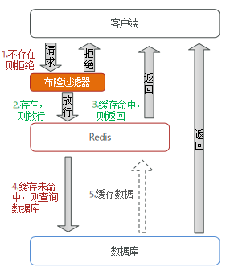

## 1、什么是Redis?

> Redis 是完全开源免费的， 遵守 BSD 协议， 是一个高性能的 key-value 数据库。
>
> 特点：
>
> - Redis 支持数据的持久化，可以将内存中的数据保存在磁盘中，重启的时候可以再次加载进行使用。
> - Redis 不仅仅支持简单的 key-value 类型的数据， 同时还提供 list， set， zset， hash 等数据结构的存储。、
> - Redis 支持数据的备份， 即 master-slave 模式的数据备份。

## 2、Redis的数据类型？

- string（ 字符串）

  > 字符串最基础的数据结构。字符串类型的值实际可以是字符串（简单的字符串、复杂的字符串（例如JSON、XML））、数字 （整数、浮点数），甚至是二进制（图片、音频、视频），但是值最大不能超过512MB。
  >
  > 字符串主要有以下几个典型使用场景：
  >
  > - 缓存功能
  > - 计数
  > - 共享Session
  > - 限速

- hash（ 哈希）

  > 哈希类型是指键值本身又是一个键值对结构。
  >
  > 哈希主要有以下典型应用场景：
  >
  > - 缓存用户信息
  > - 缓存对象

- list（ 列表）

  > 列表（list）类型是用来存储多个有序的字符串。列表是一种比较灵活的数据结构，它可以充当栈和队列的角色
  >
  > 列表主要有以下几种使用场景：
  >
  > - 消息队列
  > - 文章列表

- set（ 集合）

  > 集合（set）类型也是用来保存多个的字符串元素，但和列表类型不一 样的是，集合中不允许有重复元素，并且集合中的元素是无序的。
  >
  > 集合主要有如下使用场景：
  >
  > - 标签（tag）
  > - 共同关注

- zset（有序集合)

  > 有序集合中的元素可以排序。但是它和列表使用索引下标作为排序依据不同的是，它给每个元素设置一个权重（score）作为排序的依据。
  >
  > 有序集合主要应用场景：
  >
  > - 用户点赞统计
  > - 用户排序

- [HyperLogLog](https://yhx1001.github.io/xiaobear_docsify/#/docs/Redis学习笔记?id=_8、hyperloglog)

- pub/sub

## 3、Redis有哪些优缺点？

> 优点：
>
> - 读写性能优异， Redis能读的速度是110000次/s，写的速度是81000次/s。
> - 支持数据持久化，支持AOF和RDB两种持久化方式。
> - 支持事务，Redis的所有操作都是原子性的，同时Redis还支持对几个操作合并后的原子性执行。
> - 数据结构丰富，除了支持string类型的value外还支持hash、set、zset、list等数据结构。
> - 支持主从复制，主机会自动将数据同步到从机，可以进行读写分离。
>
> 缺点：
>
> - 数据库容量受到物理内存的限制，不能用作海量数据的高性能读写，因此Redis适合的场景主要局限在较小数据量的高性能操作和运算上。
> - Redis 不具备自动容错和恢复功能，主机从机的宕机都会导致前端部分读写请求失败，需要等待机器重启或者手动切换前端的IP才能恢复。
> - 主机宕机，宕机前有部分数据未能及时同步到从机，切换IP后还会引入数据不一致的问题，降低了系统的可用性。
> - Redis 较难支持在线扩容，在集群容量达到上限时在线扩容会变得很复杂。为避免这一问题，运维人员在系统上线时必须确保有足够的空间，这对资源造成了很大的浪费。

## 4、为什么要用 Redis做缓存？

> 主要从“高性能”和“高并发”这两点来看待这个问题。
>
> - 高性能：假如用户第一次访问数据库中的某些数据。这个过程会比较慢，因为是从硬盘上读取的。将该用户访问的数据存在数缓存中，这样下一次再访问这些数据的时候就可以直接从缓存中获取了。操作缓存就是直接操作内存，所以速度相当快。如果数据库中的对应数据改变的之后，同步改变缓存中相应的数据即可！
>
> - 高并发：直接操作缓存能够承受的请求是远远大于直接访问数据库的，所以我们可以考虑把数据库中的部分数据转移到缓存中去，这样用户的一部分请求会直接到缓存这里而不用经过数据库。
>   

## 5、Redis为什么这么快？

> 1. 完全基于内存，绝大部分请求是纯粹的内存操作，非常快速。数据存在内存中，类似于 HashMap，HashMap 的优势就是查找和操作的时间复杂度都是O(1)；
> 2. 数据结构简单，对数据操作也简单，Redis 中的数据结构是专门进行设计的；
> 3. 采用单线程，避免了不必要的上下文切换和竞争条件，也不存在多进程或者多线程导致的切换而消耗 CPU，不用去考虑各种锁的问题，不存在加锁释放锁操作，没有因为可能出现死锁而导致的性能消耗；
> 4. 使用多路 I/O 复用模型，非阻塞 IO；
> 5. 使用底层模型不同，它们之间底层实现方式以及与客户端之间通信的应用协议不一样，Redis直接自己构建了 VM 机制 ，因为一般的系统调用系统函数的话，会浪费一定的时间去移动和请求；

## 6、Redis的应用场景

> 1. 计数器：可以对 String 进行自增自减运算，从而实现计数器功能。Redis 这种内存型数据库的读写性能非常高，很适合存储频繁读写的计数量。
>
> 2. 缓存：将热点数据放到内存中，设置内存的最大使用量以及淘汰策略来保证缓存的命中率。
>
> 3. 会话缓存：可以使用 Redis 来统一存储多台应用服务器的会话信息。当应用服务器不再存储用户的会话信息，也就不再具有状态，一个用户可以请求任意一个应用服务器，从而更容易实现高可用性以及可伸缩性。
>
> 4. 全页缓存（FPC）：除基本的会话token之外，Redis还提供很简便的FPC平台。以Magento为例，Magento提供一个插件来使用Redis作为全页缓存后端。此外，对WordPress的用户来说，Pantheon有一个非常好的插件 wpredis，这个插件能帮助你以最快速度加载你曾浏览过的页面。
>
> 5. 查找表：  例如 DNS 记录就很适合使用 Redis 进行存储。查找表和缓存类似，也是利用了 Redis 快速的查找特性。但是查找表的内容不能失效，而缓存的内容可以失效，因为缓存不作为可靠的数据来源。
>
> 6. 消息队列(发布/订阅功能)：List 是一个双向链表，可以通过 lpush 和 rpop 写入和读取消息。不过最好使用 Kafka、RabbitMQ 等消息中间件。
>    发布/订阅的使用场景确实非常多。还可作为基于发布/订阅的脚本触发器，甚至用 Redis 的发布/订阅功能来建立聊天系统！
>
> 7. 分布式锁实现：在分布式场景下，无法使用单机环境下的锁来对多个节点上的进程进行同步。可以使用 Redis 自带的SETNX 命令实现分布式锁，除此之外，还可以使用官方提供的 RedLock 分布式锁实现。
>
> 8. 排行榜：排行榜 Redis提供了列表和有序集合数据结构，合理地使用这些数据结构可以很方便地构建各种排行榜系统。
>
> 9. 社交网络 赞/踩、粉丝、共同好友/喜好、推送、下拉刷新。

Redis的应用一般会结合项目去问，以一个电商项目的用户服务为例：

- Token存储：用户登录成功之后，使用Redis存储Token
- 登录失败次数计数：使用Redis计数，登录失败超过一定次数，锁定账号
- 地址缓存：对省市区数据的缓存
- 分布式锁：分布式环境下登录、注册等操作加分布式锁，防止一人多卖增加分布式锁
- ……


## 7、什么是持久化？

> 持久化就是把内存的数据写到磁盘中去，防止服务宕机了内存数据丢失。

## 8、Redis 的持久化机制是什么？各自的优缺点？

> 持久化机制：
>
> -  RDB（默认）`Redis DataBase`
> -  AOF `Append Only File`

**RDB**

> RDB是Redis默认的持久化方式。
>
> 工作机制：每隔一段时间，就把内存中的数据保存到硬盘上的指定文件中。对应产生的数据文件为dump.rdb
>
> 触发RDB的方式有两种：手动触发和自动触发
>
> 
> 手动触发分别对应save和bgsave命令
> - save命令：阻塞当前Redis服务器，直到RDB过程完成为止，对于内存比较大的实例会造成长时间阻塞，线上环境不建议使用。
> - bgsave命令：Redis进程执行fork操作创建子进程，RDB持久化过程由子进程负责，完成后自动结束。阻塞只发生在fork阶段，一般时间很短。
> 
> 以下场景会自动触发RDB持久化：
> 1.使用save相关配置，如“save m n”。表示m秒内数据集存在n次修改时，自动触发bgsave。
> 2.如果从节点执行全量复制操作，主节点自动执行bgsave生成RDB文件并发送给从节点
> 3.执行debug reload命令重新加载Redis时，也会自动触发save操作
> 4.默认情况下执行shutdown命令时，如果没有开启AOF持久化功能则自动执行bgsave。
> 
>
> 优点：
>
> - 只有一个文件 dump.rdb，方便持久化。
> - 容灾性好，一个文件可以保存到安全的磁盘。
> - 性能最大化，fork 子进程来完成写操作，让主进程继续处理命令，所以是 IO 最大化。使用单独子进程来进行持久化，主进程不会进行任何 IO 操作，保证了 redis 的高性能
> - 相对于数据集大时，比 AOF 的启动效率更高。
>
> 缺点：
>
> - 数据安全性低。RDB 是间隔一段时间进行持久化，如果持久化之间 redis 发生故障，会发生数据丢失。所以这种方式更适合数据要求不严谨的时候。如果redis要故障时要尽可能少的丢失数据，RDB没有AOF好，例如1:00进行的快照，在1:10又要进行快照的时候宕机了，这个时候就会丢失10分钟的数据。
> - RDB每次fork出子进程来执行RDB快照生成文件时，如果文件特别大，可能会导致客户端提供服务暂停数毫秒或者几秒

**AOF**

> AOF 是 以日志的形式来记录每个写操作，将每一次对数据进行修改，都把新建、修改数据的命令保存到指 定文件中。Redis 重新启
>
> 动时读取这个文件，重新执行新建、修改数据的命令恢复数据。
>
> 当两种方式同时开启时，数据恢复Redis会优先选择AOF恢复
>
> 优点：
>
> - 数据安全，AOF持久化可以配置 appendfsync 属性，有 always，每进行一次 命令操作就记录到 AOF文件中一次。
>
> - 通过 append 模式写文件，即使中途服务器宕机，可以通过 redis-check-aof 工具解决数据一致性问题。
>
> - AOF日志文件的命令通过非常可读的方式进行记录，这个非常适合做灾难性的误删除紧急恢复，如果某人不小心用flushall命令
    >
    >   清空了所有数据，只要这个时候还没有执行rewrite，那么就可以将日志文件中的flushall删除，进行恢复
>
> 缺点：
>
> - 对于同一份文件AOF文件比RDB数据快照要大。
> - AOF开启后支持写的QPS会比RDB支持的写的QPS低，因为AOF一般会配置成每秒fsync操作，每秒的fsync操作还是很高的、
> - 数据恢复比较慢，不适合做冷备。


## 9、RDB和AOF到底如何选择？

**如何看待数据“绝对”安全？**

> Redis 作为内存数据库从本质上来说，如果不想牺牲性能，就不可能做到数据的“绝对”安全。 RDB 和AOF 都只是尽可能在兼顾性能的前提下降低数据丢失的风险，如果真的发生数据丢失问题，尽可能 减少损失。 在整个项目的架构体系中，Redis 大部分情况是扮演“二级缓存”角色。
>
> 二级缓存适合保存的数据
>
> - 经常要查询，很少被修改的数据。
>
> - 不是非常重要，允许出现偶尔的并发问题。
>
> - 不会被其他应用程序修改。
    >
    >   如果Redis 是作为缓存服务器，那么说明数据在MySQL 这样的传统关系型数据库中是有正式版本的。数据最终以MySQL 中的为准。

**RDB和AOF到底如何选择?**

> - 不要仅仅使用RDB这样会丢失很多数据。
>
> - 也不要仅仅使用AOF，因为这会有两个问题，第一通过AOF做冷备没有RDB做冷备恢复的速度快；第二RDB每次简单粗暴生成数据快照，更加健壮。
>
> - 综合AOF和RDB两种持久化方式，用AOF来保证数据不丢失，作为恢复数据的第一选择；用RDB来做不同程度的冷备，在AOF文件都丢失或损坏不可用的时候，可以使用RDB进行快速的数据恢复。
    >
    >   **官方推荐两个都用：**==如果对数据不敏感，可以选单独用RDB；不建议单独用AOF，因为可能出现Bug;如果只是 做纯内存缓存，可以都不用==

## 10、Redis持久化数据和缓存怎么做扩容？

> - 如果Redis被当做缓存使用，使用一致性哈希实现动态扩容缩容。
>
> - 如果Redis被当做一个持久化存储使用，必须使用固定的keys-to-nodes映射关系，节点的数量一旦确定不能变化。否则的话(即
    >
    >   Redis节点需要动态变化的情况），必须使用可以在运行时进行数据再平衡的一套系统，而当前只有Redis集群可以做到这样。

## 11、Redis 过期键的删除策略？

> - **定时删除**：每个设置过期时间的key都需要创建一个定时器，到过期时间就会立即清除。该策略可以立即清除过期的数据，对内存很友好；但是会占用大量的CPU资源去处理过期的数据，从而影响缓存的响应时间和吞吐量。
>
> - **惰性删除**：只有当访问一个key时，才会判断该key是否已过期，过期则清除。该策略可以最大化地节省CPU资源，却对内存非常不友好。极端情况可能出现大量的过期key没有再次被访问，从而不会被清除，占用大量内存。
>
> - **定期过期**：每隔一定的时间，会扫描一定数量的数据库的expires字典中一定数量的key，并清除其中已过期的key。该策略是前两者的一个折中方案。通过调整定时扫描的时间间隔和每次扫描的限定耗时，可以在不同情况下使得CPU和内存资源达到最优的平衡效果。 (expires字典会保存所有设置了过期时间的key的过期时间数据，其中，key是指向键空间中的某个键的指针，value是该键的毫秒精度的UNIX时间戳表示的过期时间。键空间是指该Redis集群中保存的所有键。)
    >
    >   * redis 有一个定时任务处理器 serverCron，负责周期性任务处理，默认 100 ms 执行一次（hz 参数控制）包括：① 处理过期 key、② hash 表 rehash、③ 更新统计结果、④ 持久化、⑤ 清理过期客户端
>
>   * 对于处理过期 key 会：依次遍历库，在规定时间内运行如下操作
      >
      >     ① 从每个库的 expires 过期字典中随机选择 20 个 key 检查，如果过期则删除
      >
      >     ② 如果删除达到 5 个，重复 ① 步骤，没有达到，遍历至下一个库
      >
      >     ③ 规定时间没有做完，等待下一轮 serverCron 运行
>
> PS：Redis中同时使用了**惰性删除**和**定期删除**两种过期策略。


## 12、Redis的内存淘汰策略有哪些？

> Redis的内存淘汰策略是指在Redis的用于缓存的内存不足时，怎么处理需要新写入且需要申请额外空间的数据。

**全局的键空间选择性移除**

- noeviction：当内存不足以容纳新写入数据时，新写入操作会报错。
- allkeys-lru：当内存不足以容纳新写入数据时，在键空间中，移除最近最少使用的key。（这个是最常用的）
- allkeys-random：当内存不足以容纳新写入数据时，在键空间中，随机移除某个key。

**设置过期时间的键空间选择性移除**

- volatile-lru：当内存不足以容纳新写入数据时，在设置了过期时间的键空间中，移除最近最少使用的key。
- volatile-random：当内存不足以容纳新写入数据时，在设置了过期时间的键空间中，随机移除某个key。
- volatile-ttl：当内存不足以容纳新写入数据时，在设置了过期时间的键空间中，有更早过期时间的key优先移除。

PS：Redis的内存淘汰策略的选取并不会影响过期的key的处理。内存淘汰策略用于处理内存不足时的需要申请额外空间的数据；过期策略用于处理过期的缓存数据

## 13、Redis如何做内存优化？

> 可以好好利用Hash,list,sorted set,set等集合类型数据，因为通常情况下很多小的Key-Value可以用更紧凑的方式存放到一起。尽可能使用散列表（hashes），散列表（是说散列表里面存储的数少）使用的内存非常小，所以你应该尽可能的将你的数据模型抽象到一个散列表里面。比如你的web系统中有一个用户对象，不要为这个用户的名称，姓氏，邮箱，密码设置单独的key，而是应
> 该把这个用户的所有信息存储到一张散列表里面

## 14、什么是事务？

> 事务是一个单独的隔离操作：事务中的所有命令都会序列化、按顺序地执行。事务在执行的过程中，不会被其他客户端发送来的命令请求所打断。
> 事务是一个原子操作：事务中的命令要么全部被执行，要么全部都不执行。

## 15、Redis事务的概念

> Redis 事务的本质是通过MULTI、EXEC、WATCH等一组命令的集合。事务支持一次执行多个命令，一个事务中所有命令都会被序列化。在事务执行过程，会按照顺序串行化执行队列中的命令，其他客户端提交的命令请求不会插入到事务执行命令序列中。
> 总结：redis事务就是一次性、顺序性、排他性的执行一个队列中的一系列命令。

## 16、Redis事务的三个阶段

> - 事务开始 MULTI
> - 命令入队
> - 事务执行 EXEC


## 17、 Redis事务相关命令

> Redis事务功能是通过MULTI、EXEC、DISCARD和WATCH 四个原语实现的
>
> Redis会将一个事务中的所有命令序列化，然后按顺序执行。
>
> 1. **redis** **不支持回滚**，“Redis 在事务失败时不进行回滚，而是继续执行余下的命令”， 所以 Redis 的内部可以保持简单且快速。
>
> 2. **如果在一个事务中的命令出现错误，那么所有的命令都不会执行**；
>
> 3. **如果在一个事务中出现运行错误，那么正确的命令会被执行**。
>
> WATCH 命令是一个乐观锁，可以为 Redis 事务提供 check-and-set （CAS）行为。 可以监控一个或多个键，一旦其中有一个键被修改（或删除），之后的事务就不会执行，监控一直持续到EXEC命令。
>
> MULTI命令用于开启一个事务，它总是返回OK。 MULTI执行之后，客户端可以继续向服务器发送任意多条命令，这些命令不会立即被执行，而是被放到一个队列中，当EXEC命令被调用时，所有队列中的命令才会被执行。
>
> EXEC：执行所有事务块内的命令。返回事务块内所有命令的返回值，按命令执行的先后顺序排列。 当操作被打断时，返回空值 nil。
>
> 通过调用DISCARD，客户端可以清空事务队列，并放弃执行事务， 并且客户端会从事务状态中退出。
>
> UNWATCH命令可以取消watch对所有key的监控。


## 18、 事务管理（ACID）概述

> - 原子性（Atomicity）
>
> 原子性是指事务是一个不可分割的工作单位，事务中的操作要么都发生，要么都不发生。
>
> - 一致性（Consistency）
>
> 事务前后数据的完整性必须保持一致。
>
> - 隔离性（Isolation）
>
> 多个事务并发执行时，一个事务的执行不应影响其他事务的执行
>
> - 持久性（Durability）
>
> 持久性是指一个事务一旦被提交，它对数据库中数据的改变就是永久性的，接下来即使数据库发生故障也不应该对其有任何影响
>
>
>
> Redis的事务总是具有ACID中的一致性和隔离性，其他特性是不支持的。当服务器运行在_AOF_持久化模式 下，并且appendfsync选项的值为always时，事务也具有耐久性。


## 19、Redis事务支持隔离性吗

> Redis 是单进程程序，并且它保证在执行事务时，不会对事务进行中断，事务可以运行直到执行完所有事务队列中的命令为止。因此，**Redis** **的事务是总是带有隔离性的**。

## 20、主从复制了解吗？


> **主从复制**，是指将一台 Redis 服务器的数据，复制到其他的 Redis 服务器。前者称为 **主节点(master)**，后者称为 **从节点(slave)**。且数据的复制是 **单向** 的，只能由主节点到从节点。Redis 主从复制支持 **主从同步** 和 **从从同步** 两种，后者是 Redis 后续版本新增的功能，以减轻主节点的同步负担。
>
> 作用：
>
> - **数据冗余：** 主从复制实现了数据的热备份，是持久化之外的一种数据冗余方式。
> - **故障恢复：** 当主节点出现问题时，可以由从节点提供服务，实现快速的故障恢复 *(实际上是一种服务的冗余)*。
> - **负载均衡：** 在主从复制的基础上，配合读写分离，可以由主节点提供写服务，由从节点提供读服务 *（即写 Redis 数据时应用连接主节点，读 Redis 数据时应用连接从节点）*，分担服务器负载。尤其是在写少读多的场景下，通过多个从节点分担读负载，可以大大提高 Redis 服务器的并发量。
> - **高可用基石：** 除了上述作用以外，主从复制还是哨兵和集群能够实施的 **基础**，因此说主从复制是 Redis 高可用的基础。


## 21、Redis主从有几种常见的拓扑结构？

> Redis的复制拓扑结构可以支持单层或多层复制关系，根据拓扑复杂性可以分为以下三种：一主一从、一主多从、树状主从结构。
>
> - 一主一从结构
    >
    >   一主一从结构是最简单的复制拓扑结构，用于主节点出现宕机时从节点提供故障转移支持。
    >
    >   
>
> - 一主多从结构
    >
    >   主多从结构（又称为星形拓扑结构）使得应用端可以利用多个从节点实现读写分离）。对于读占比较大的场景，可以把读命令发送到从节点来分担主节点压力。
    >
    >   
>
> - 树状主从结构
    >
    >   树状主从结构（又称为树状拓扑结构）使得从节点不但可以复制主节点数据，同时可以作为其他从节点的主节点继续向下层复制。通过引入复制中间层，可以有效降低主节点负载和需要传送给从节点的数据量。
    >
    >   
>
> -


## 22、Redis的主从复制原理了解吗？


1. 保存主节点（master）信息 这一步只是保存主节点信息，保存主节点的ip和port。
2. 主从建立连接 从节点（slave）发现新的主节点后，会尝试和主节点建立网络连接。
3. 发送ping命令 连接建立成功后从节点发送ping请求进行首次通信，主要是检测主从之间网络套接字是否可用、主节点当前是否可接受处理命令。
4. 权限验证 如果主节点要求密码验证，从节点必须正确的密码才能通过验证。
5. 同步数据集 主从复制连接正常通信后，主节点会把持有的数据全部发送给从节点。
6. 命令持续复制 接下来主节点会持续地把写命令发送给从节点，保证主从数据一致性。


## 23、主从数据同步的方式？

> Redis在2.8及以上版本使用psync命令完成主从数据同步，同步过程分为：
>
> - 全量复制
>
> - 部分复制

## 全量复制

> 一般用于初次复制场景，Redis早期支持的复制功能只有全量复制，它会把主节点全部数据一次性发送给从节点，当数据量较大时，会对主从节点和网络造成很大的开销。

全量复制的完整运行流程如下：


1. 发送psync命令进行数据同步，由于是第一次进行复制，从节点没有复制偏移量和主节点的运行ID，所以发送psync-1。
2. 主节点根据psync-1解析出当前为全量复制，回复+FULLRESYNC响应。
3. 从节点接收主节点的响应数据保存运行ID和偏移量offset
4. 主节点执行bgsave保存RDB文件到本地
5. 主节点发送RDB文件给从节点，从节点把接收的RDB文件保存在本地并直接作为从节点的数据文件
6. 对于从节点开始接收RDB快照到接收完成期间，主节点仍然响应读写命令，因此主节点会把这期间写命令数据保存在复制客户端缓冲区内，当从节点加载完RDB文件后，主节点再把缓冲区内的数据发送给从节点，保证主从之间数据一致性。
7. 从节点接收完主节点传送来的全部数据后会清空自身旧数据
8. 从节点清空数据后开始加载RDB文件
9. 从节点成功加载完RDB后，如果当前节点开启了AOF持久化功能， 它会立刻做bgrewriteaof操作，为了保证全量复制后AOF持久化文件立刻可用。


## 部分复制

> 部分复制主要是Redis针对全量复制的过高开销做出的一种优化措施， 使用psync{runId}{offset}命令实现。当从节点（slave）正在复制主节点 （master）时，如果出现网络闪断或者命令丢失等异常情况时，从节点会向 主节点要求补发丢失的命令数据，如果主节点的复制积压缓冲区内存在这部分数据则直接发送给从节点，这样就可以保持主从节点复制的一致性。


1. 当主从节点之间网络出现中断时，如果超过repl-timeout时间，主节点会认为从节点故障并中断复制连接
2. 主从连接中断期间主节点依然响应命令，但因复制连接中断命令无法发送给从节点，不过主节点内部存在的复制积压缓冲区，依然可以保存最近一段时间的写命令数据，默认最大缓存1MB。
3. 当主从节点网络恢复后，从节点会再次连上主节点
4. 当主从连接恢复后，由于从节点之前保存了自身已复制的偏移量和主节点的运行ID。因此会把它们当作psync参数发送给主节点，要求进行部分复制操作。
5. 主节点接到psync命令后首先核对参数runId是否与自身一致，如果一 致，说明之前复制的是当前主节点；之后根据参数offset在自身复制积压缓冲区查找，如果偏移量之后的数据存在缓冲区中，则对从节点发送+CONTINUE响应，表示可以进行部分复制。
6. 主节点根据偏移量把复制积压缓冲区里的数据发送给从节点，保证主从复制进入正常状态。


## 24、主从复制存在哪些问题呢？

> 主从复制虽好，但也存在一些问题：
>
> - 一旦主节点出现故障，需要手动将一个从节点晋升为主节点，同时需要修改应用方的主节点地址，还需要命令其他从节点去复制新的主节点，整个过程都需要人工干预。
> - 主节点的写能力受到单机的限制。
> - 主节点的存储能力受到单机的限制。
>
> 第一个问题是Redis的高可用问题，第二、三个问题属于Redis的分布式问题。


## 25、Redis为什么早期选择单线程？

> 官方解释：https://redis.io/topics/faq
>
> 官方FAQ表示，因为Redis是基于内存的操作，CPU成为Redis的瓶颈的情况很少见，Redis的瓶颈最有可能是内存的大小或者网络限制。
>
> 如果想要最大程度利用CPU，可以在一台机器上启动多个Redis实例。
>
> PS：网上有这样的回答，吐槽官方的解释有些敷衍，其实就是历史原因，开发者嫌多线程麻烦，后来这个CPU的利用问题就被抛给了使用者。
>
> 同时FAQ里还提到了， Redis 4.0 之后开始变成多线程，除了主线程外，它也有后台线程在处理一些较为缓慢的操作，例如清理脏数据、无用连接的释放、大 Key 的删除等等。


## 26、Redis6.0使用多线程是怎么回事?

> Redis6.0的多线程是用多线程来处理数据的**读写和协议解析**，但是Redis**执行命令**还是单线程的。
>
> 这样做的⽬的是因为Redis的性能瓶颈在于⽹络IO⽽⾮CPU，使⽤多线程能提升IO读写的效率，从⽽整体提⾼Redis的性能。


## 27、Redis Sentinel（哨兵）了解吗

主从复制存在一个问题，没法完成自动故障转移。所以我们需要一个方案来完成自动故障转移，它就是Redis Sentinel（哨兵）。


Redis Sentinel ，它由两部分组成，哨兵节点和数据节点：

- 哨兵节点：哨兵系统由一个或多个哨兵节点组成，哨兵节点是特殊的 Redis 节点，不存储数据，对数据节点进行监控。
- 数据节点：主节点和从节点都是数据节点；

在复制的基础上，哨兵实现了 **自动化的故障恢复** 功能，下面是官方对于哨兵功能的描述：

- **监控（Monitoring）：** 哨兵会不断地检查主节点和从节点是否运作正常。
- **自动故障转移（Automatic failover）：** 当 **主节点** 不能正常工作时，哨兵会开始 **自动故障转移操作**，它会将失效主节点的其中一个 **从节点升级为新的主节点**，并让其他从节点改为复制新的主节点。
- **配置提供者（Configuration provider）：** 客户端在初始化时，通过连接哨兵来获得当前 Redis 服务的主节点地址。
- **通知（Notification）：** 哨兵可以将故障转移的结果发送给客户端。

其中，监控和自动故障转移功能，使得哨兵可以及时发现主节点故障并完成转移。而配置提供者和通知功能，则需要在与客户端的交互中才能体现。


## 28、Redis Sentinel（哨兵）实现原理知道吗？

哨兵模式是通过哨兵节点完成对数据节点的监控、下线、故障转移。


## 定时监控


Redis Sentinel通过三个定时监控任务完成对各个节点发现和监控：

- 每隔10秒，每个Sentinel节点会向主节点和从节点发送info命令获取最新的拓扑结构
- 每隔2秒，每个Sentinel节点会向Redis数据节点的__sentinel__：hello 频道上发送该Sentinel节点对于主节点的判断以及当前Sentinel节点的信息
- 每隔1秒，每个Sentinel节点会向主节点、从节点、其余Sentinel节点发送一条ping命令做一次心跳检测，来确认这些节点当前是否可达


**主观下线和客观下线**主观下线就是哨兵节点认为某个节点有问题，客观下线就是超过一定数量的哨兵节点认为主节点有问题。


1. 主观下线 每个Sentinel节点会每隔1秒对主节点、从节点、其他Sentinel节点发送ping命令做心跳检测，当这些节点超过 down-after-milliseconds没有进行有效回复，Sentinel节点就会对该节点做失败判定，这个行为叫做主观下线。
2. 客观下线 当Sentinel主观下线的节点是主节点时，该Sentinel节点会通过sentinel is- master-down-by-addr命令向其他Sentinel节点询问对主节点的判断，当超过 `quorum`个数，Sentinel节点认为主节点确实有问题，这时该Sentinel节点会做出客观下线的决定


**领导者Sentinel节点选举**Sentinel节点之间会做一个领导者选举的工作，选出一个Sentinel节点作为领导者进行故障转移的工作。Redis使用了Raft算法实现领导者选举。

**故障转移**

领导者选举出的Sentinel节点负责故障转移，过程如下：


1. 在从节点列表中选出一个节点作为新的主节点，这一步是相对复杂一些的一步
2. Sentinel领导者节点会对第一步选出来的从节点执行slaveof no one命令让其成为主节点
3. Sentinel领导者节点会向剩余的从节点发送命令，让它们成为新主节点的从节点
4. Sentinel节点集合会将原来的主节点更新为从节点，并保持着对其关注，当其恢复后命令它去复制新的主节点


## 29、领导者Sentinel节点选举了解吗？

Redis使用了Raft算法实 现领导者选举，大致流程如下：


1. 每个在线的Sentinel节点都有资格成为领导者，当它确认主节点主观 下线时候，会向其他Sentinel节点发送sentinel is-master-down-by-addr命令， 要求将自己设置为领导者。
2. 收到命令的Sentinel节点，如果没有同意过其他Sentinel节点的sentinel is-master-down-by-addr命令，将同意该请求，否则拒绝。
3. 如果该Sentinel节点发现自己的票数已经大于等于max（quorum， num（sentinels）/2+1），那么它将成为领导者。
4. 如果此过程没有选举出领导者，将进入下一次选举。


## 30、新的主节点是怎样被挑选出来的？

1. 过滤：“不健康”（主观下线、断线）、5秒内没有回复过Sentinel节 点ping响应、与主节点失联超过down-after-milliseconds*10秒。
2. 选择slave-priority（从节点优先级）最高的从节点列表，如果存在则返回，不存在则继续。
3. 选择复制偏移量最大的从节点（复制的最完整），如果存在则返 回，不存在则继续。
4. 选择runid最小的从节点。


## 31、Redis 集群了解吗？

> 前面说到了主从存在高可用和分布式的问题，哨兵解决了高可用的问题，而集群就是终极方案，一举解决高可用和分布式问题。

1. **数据分区：** 数据分区 *(或称数据分片)* 是集群最核心的功能。集群将数据分散到多个节点，一方面 突破了 Redis 单机内存大小的限制，**存储容量大大增加**；**另一方面** 每个主节点都可以对外提供读服务和写服务，**大大提高了集群的响应能力**。
2. **高可用：** 集群支持主从复制和主节点的 **自动故障转移** *（与哨兵类似）*，当任一节点发生故障时，集群仍然可以对外提供服务。


## 32、集群中数据如何分区？

分布式的存储中，要把数据集按照分区规则映射到多个节点，常见的数据分区规则三种：

- 哈希取余分区
- 一致性哈希算法分区
- 哈希槽分区

### 1、哈希取余分区


> 2亿条记录就是2亿个k,v，我们单机不行必须要分布式多机，假设有3台机器构成一个集群，用户每次读写操作都是根据公式：
> hash(key) % N个机器台数，计算出哈希值，用来决定数据映射到哪一个节点上。

**优点：**

  ```
简单粗暴，直接有效，只需要预估好数据规划好节点，例如3台、8台、10台，就能保证一段时间的数据支撑。使用Hash算法让固定的一部分请求落到同一台服务器上，这样每台服务器固定处理一部分请求（并维护这些请求的信息），起到负载均衡+分而治之的作用。
  ```

**缺点：**

 ```
  原来规划好的节点，进行扩容或者缩容就比较麻烦了额，不管扩缩，每次数据变动导致节点有变动，映射关系需要重新进行计算，在服务器个数固定不变时没有问题，如果需要弹性扩容或故障停机的情况下，原来的取模公式就会发生变化：Hash(key)/3会变成Hash(key) /?。此时地址经过取余运算的结果将发生很大变化，根据公式获取的服务器也会变得不可控。
某个redis机器宕机了，由于台数数量变化，会导致hash取余全部数据重新洗牌。
 ```


### 2、一致性哈希算法分区

> 　　　　一致性哈希算法在1997年由麻省理工学院中提出的，设计目标是**为了解决分布式缓存数据变动和映射问题，某个机器宕机了，分母数量改变了，自然取余数不OK了。**

**作用：**

> 提出一致性Hash解决方案。目的是当服务器个数发生变动时，尽量减少影响客户端到服务器的映射关系

**步骤：**

1. 算法构建一致性哈希环

   **一致性哈希环**

   > ​    一致性哈希算法必然有个hash函数并按照算法产生hash值，这个算法的所有可能哈希值会构成一个全量集，这个集合可以成为一个hash空间[0,2^32-1]，这个是一个线性空间，但是在算法中，我们通过适当的逻辑控制将它首尾相连(0 = 2^32),这样让它逻辑上形成了一个环形空间。
   >
   > 它也是按照使用取模的方法，前面笔记介绍的节点取模法是对节点（服务器）的数量进行取模。而一致性Hash算法是对2^32 取模，简单来说，一致性Hash算法将整个哈希值空间组织成一个虚拟的圆环，如假设某哈希函数H的值空间为0-2^32-1 （即哈希值是一个32位无符号整形），整个哈希环如下图：整个空间按顺时针方向组织，圆环的正上方的点代表0，0点右侧的第一个点代表1，以此类推，2、3、4、……直到2^32-1 ，也就是说0点左侧的第一个点代表2^32-1， 0和2^32-1 在零点中方向重合，我们把这个由2^32个点组成的圆环称为Hash环。

   

2. 服务器IP节点映射

   节点映射

   >    将集群中各个IP节点映射到环上的某一个位置。
   >    将各个服务器使用Hash进行一个哈希，具体可以选择服务器的IP或主机名作为关键字进行哈希，这样每台机器就能确定其在哈希环上的位置。假如4个节点NodeA、B、C、D，经过IP地址的哈希函数计算(hash(ip))，使用IP地址哈希后在环空间的位置如下：

   

3. key落到服务器的落键规则

   > 当我们需要存储一个kv键值对时，首先计算key的hash值，hash(key)，将这个key使用相同的函数Hash计算出哈希值并确定此数据在环上的位置，从此位置沿环顺时针“行走”，第一台遇到的服务器就是其应该定位到的服务器，并将该键值对存储在该节点上。
   > 如我们有Object A、Object B、Object C、Object D四个数据对象，经过哈希计算后，在环空间上的位置如下：根据一致性Hash算法，数据A会被定为到Node A上，B被定为到Node B上，C被定为到Node C上，D被定为到Node D上。

   


**优点：**

1.一致性哈希算法的容错性

> 容错性
> 假设Node C宕机，可以看到此时对象A、B、D不会受到影响，只有C对象被重定位到Node D。一般的，在一致性Hash算法中，如果一台服务器不可用，则受影响的数据仅仅是此服务器到其环空间中前一台服务器（即沿着逆时针方向行走遇到的第一台服务器）之间数据，其它不会受到影响。简单说，就是C挂了，受到影响的只是B、C之间的数据，并且这些数据会转移到D进行存储。


2.一致性哈希算法的扩展性

> 扩展性
> 数据量增加了，需要增加一台节点NodeX，X的位置在A和B之间，那收到影响的也就是A到X之间的数据，重新把A到X的数据录入到X上即可，不会导致hash取余全部数据重新洗牌。


**缺点：**

> 一致性哈希算法的数据倾斜问题
>
> 一致性Hash算法在服务节点太少时，容易因为节点分布不均匀而造成数据倾斜（被缓存的对象大部分集中缓存在某一台服务器上）问题，
> 例如系统中只有两台服务器：


**总结：**

> 为了在节点数目发生改变时尽可能少的迁移数据
>
> 将所有的存储节点排列在收尾相接的Hash环上，每个key在计算Hash后会顺时针找到临近的存储节点存放。
> 而当有节点加入或退出时仅影响该节点在Hash环上顺时针相邻的后续节点。
>
> **优点**    加入和删除节点只影响哈希环中顺时针方向的相邻的节点，对其他节点无影响。
>
> **缺点**    数据的分布和节点的位置有关，因为这些节点不是均匀的分布在哈希环上的，所以数据在进行存储时达不到均匀分布的效果。


### 3、哈希槽分区

> 哈希槽实质就是一个数组，数组[0,2^14 -1]形成hash slot空间。
>
> **作用：**解决一致性哈希算法的数据倾斜问题

解决均匀分配的问题，在数据和节点之间又加入了一层，把这层称为哈希槽（slot），用于管理数据和节点之间的关系，现在就相当于节点上放的是槽，槽里放的是数据。


槽解决的是粒度问题，相当于把粒度变大了，这样便于数据移动。
哈希解决的是映射问题，使用key的哈希值来计算所在的槽，便于数据分配。


#### 哈希槽的计算

> Redis 集群中内置了 16384 个哈希槽，redis 会根据节点数量大致均等的将哈希槽映射到不同的节点。当需要在 Redis 集群中放置一个 key-value时，redis 先对 key 使用 crc16 算法算出一个结果，然后把结果对 16384 求余数，这样每个 key 都会对应一个编号在 0-16383 之间的哈希槽，也就是映射到某个节点上。如下代码，key之A 、B在Node2， key之C落在Node3上


## 33、什么是缓存击穿、缓存穿透、缓存雪崩？

> - 缓存穿透：key对应的数据在数据源并不存在，每次针对此key的请求从缓存获取不到，请求都会到数据源，从而可能压垮数据源。比如用一个不存在的用户id获取用户信息，不论缓存还是数据库都没有，若黑客利用此漏洞进行攻击可能压垮数据库。
> - 缓存击穿：key对应的数据存在，但在redis中过期，此时若有大量并发请求过来，这些请求发现缓存过期一般都会从后端DB加载数据并回设到缓存，这个时候大并发的请求可能会瞬间把后端DB压垮。
> - 缓存雪崩：某⼀时刻发生大规模的缓存失效的情况，例如缓存服务宕机、缓存服务器重启、大量缓存集中在某一个时间段失效，这样在失效的时候，也会给后端系统(比如DB)带来很大压力。


### 缓存击穿解决方案

> - 加锁更新，⽐如请求查询A，发现缓存中没有，对A这个key加锁，同时去数据库查询数据，写⼊缓存，再返回给⽤户，这样后⾯的请求就可以从缓存中拿到数据了。
> - 将过期时间组合写在value中，通过异步的⽅式不断的刷新过期时间，防⽌此类现象。

#### 1、互斥锁

> 所谓互斥，就是不同线程，通过竞争进入临界区（共享的数据和硬件资源），为了防止访问冲突，在有限的时间内只允许其中之一独占性的使用共享资源。如不允许同时写。


1. 线程1发起请求，查询缓存发现未命中，然后获取互斥锁，成功之后，则去查询数据库重建缓存数据，写入缓存，释放锁。
2. 线程2在线程1未释放锁之前发起请求，查询缓存未命中，然后获取互斥锁，发现被线程1占用了，则获取失败，休眠一会儿，再重新获取锁（直到线程1释放），最后缓存命中。

存在的问题：互斥等待时间，如果1000个线程同时访问，则只有1个获取成功，其他999个都是在等待，性能会下降


#### 2、逻辑过期

> 逻辑过期：原来我们存储数据到redis中的时候，存的是k:v键值对，那逻辑过期，就是手动给value增加一个expire时间

| **KEY**      | **VALUE**                                   |
| ------------ | ------------------------------------------- |
| heima:user:1 | {name:"Jack", age:21, **expire:152141223**} |


1. 线程1发起请求，查询缓存，发现逻辑时间已过期，则回获取互斥锁，此时线程会开启一个新线程2（用于查询数据存入缓存），先返回过期的数据
2. 线程2查询数据库后，重建缓存数据，写入缓存后，重置逻辑过期时间，最后释放锁
3. 线程3发起请求（与线程1同步），查询缓存，发现逻辑时间已过期，获取互斥锁失败，就先返回旧数据
4. 线程4查询缓存，此时线程2已经释放锁，缓存命中，逻辑过期时间未过期，则直接返回


#### 3、比较

| **解决方案**         | **优点**                                 | **缺点**                               |
| -------------------- | ---------------------------------------- | -------------------------------------- |
| **互斥锁**（一致性） | 没有额外的内存消耗、保证一致性、实现简单 | 线程需要等待，性能受影响可能有死锁风险 |
| **逻辑过期**（性能） | 线程无需等待，性能较好                   | 不保证一致性、有额外内存消耗、实现复杂 |


### 缓存穿透解决方案

#### 1、缓存空对象

> 当客户端请求到redis后，未命中去查询数据库，数据库查询返回为null，则缓存为null

优点：

- 实现简单，维护方便

缺点：

- 额外的内存消耗

  > 若客户端请求大量数据都是不存在的，则redis会缓存大量的null数据

- 可能造成短期的不一致

  > 客户端请求不存在的数据后，redis缓存数据为null，并设置了超时时间，此时就新增了一条数据，则再去查询时（还在TTL内），还是为null，只有当时间失效时，才会查询到
  >
  > - 可在新增时，更新缓存，可解决短期的不一致


#### 2、布隆过滤器

> 布隆过滤器是一个 bit 向量或者说 bit 数组（超长超长，记住一定要足够长）
>
> 将所有可能存在的数据哈希到一个足够大的bitmap中，一个一定不存在的数据会被 这个bitmap拦截掉，从而避免了对底层存储系统的查询压力。

优点：

- 内存占用较少，没有多余key

缺点：

- 实现复杂
- 存在误判可能




| 解决缓存穿透 | 适用场景                           | 维护成本                                     |
| ------------ | ---------------------------------- | -------------------------------------------- |
| 缓存空对象   | 数据命中不高；数据频繁实时性高     | 代码维护简单；需要较多的缓存空间；数据不一致 |
| 布隆过滤器   | 数据命中不高；数据相对固定实时性低 | 代码维护复杂；缓存空间占用少                 |


### 缓存雪崩解决方案

- **提高缓存可用性**

1. 集群部署：通过集群来提升缓存的可用性，可以利用Redis本身的Redis Cluster或者第三方集群方案如Codis等。
2. 多级缓存：设置多级缓存，第一级缓存失效的基础上，访问二级缓存，每一级缓存的失效时间都不同。

- **过期时间**

1. 均匀过期：为了避免大量的缓存在同一时间过期，可以把不同的 key 过期时间随机生成，避免过期时间太过集中。
2. 热点数据永不过期。

- **熔断降级**

1. 服务熔断：当缓存服务器宕机或超时响应时，为了防止整个系统出现雪崩，暂时停止业务服务访问缓存系统。
2. 服务降级：当出现大量缓存失效，而且处在高并发高负荷的情况下，在业务系统内部暂时舍弃对一些非核心的接口和数据的请求，而直接返回一个提前准备好的 fallback（退路）错误处理信息。

- **给业务添加多级缓存**


## 34、如何保证缓存和数据库数据的⼀致性？

> 根据CAP理论，在保证可用性和分区容错性的前提下，无法保证一致性，所以缓存和数据库的绝对一致是不可能实现的，只能尽可能保存缓存和数据库的最终一致性。

### 选择合适的缓存更新策略

**1. 删除缓存而不是更新缓存**

> 当一个线程对缓存的key进行写操作的时候，如果其它线程进来读数据库的时候，读到的就是脏数据，产生了数据不一致问题。
>
> 相比较而言，删除缓存的速度比更新缓存的速度快很多，所用时间相对也少很多，读脏数据的概率也小很多。


2.**先更数据，后删缓存**先更数据库还是先删缓存？这是一个问题。

> 更新数据，耗时可能在删除缓存的百倍以上。在缓存中不存在对应的key，数据库又没有完成更新的时候，如果有线程进来读取数据，并写入到缓存，那么在更新成功之后，这个key就是一个脏数据。
>
> 毫无疑问，先删缓存，再更数据库，缓存中key不存在的时间的时间更长，有更大的概率会产生脏数据。
>
> 目前最流行的缓存读写策略cache-aside-pattern就是采用先更数据库，再删缓存的方式。


### 缓存不一致处理

> 如果不是并发特别高，对缓存依赖性很强，其实一定程序的不一致是可以接受的。但是如果对一致性要求比较高，那就得想办法保证缓存和数据库中数据一致。

缓存和数据库数据不一致常见的两种原因：

- 缓存key删除失败
- 并发导致写入了脏数据

解决方案：

- **消息队列保证key被删除**
- **数据库订阅+消息队列保证key被删除**
- **延时双删防止脏数据**
- **设置缓存过期时间兜底**

### 消息队列保证key被删除

> 可以引入消息队列，把要删除的key或者删除失败的key丢尽消息队列，利用消息队列的重试机制，重试删除对应的key。


这种方案看起来不错，缺点是对业务代码有一定的侵入性。


### 数据库订阅+消息队列保证key被删除

> 可以用一个服务（比如阿里的 canal）去监听数据库的binlog，获取需要操作的数据。然后用一个公共的服务获取订阅程序传来的信息，进行缓存删除操作。


这种方式降低了对业务的侵入，但其实整个系统的复杂度是提升的，适合基建完善的大厂。

### 延时双删防止脏数据

> 还有一种情况，是在缓存不存在的时候，写入了脏数据，这种情况在先删缓存，再更数据库的缓存更新策略下发生的比较多，解决方案是延时双删。简单说，就是在第一次删除缓存之后，过了一段时间之后，再次删除缓存。


这种方式的延时时间设置需要仔细考量和测试。

### 设置缓存过期时间兜底

> 这是一个朴素但是有用的办法，给缓存设置一个合理的过期时间，即使发生了缓存数据不一致的问题，它也不会永远不一致下去，缓存过期的时候，自然又会恢复一致。


## 35、缓存预热怎么做呢？

> 所谓缓存预热，就是提前把数据库里的数据刷到缓存里，通常有这些方法：
>
> 1、直接写个缓存刷新页面或者接口，上线时手动操作
>
> 2、数据量不大，可以在项目启动的时候自动进行加载
>
> 3、定时任务刷新缓存.


## 36、热点key重建？问题？解决？

开发的时候一般使用“缓存+过期时间”的策略，既可以加速数据读写，又保证数据的定期更新，这种模式基本能够满足绝大部分需求。

但是有两个问题如果同时出现，可能就会出现比较大的问题：

- 当前key是一个热点key（例如一个热门的娱乐新闻），并发量非常大。
- 重建缓存不能在短时间完成，可能是一个复杂计算，例如复杂的 SQL、多次IO、多个依赖等。在缓存失效的瞬间，有大量线程来重建缓存，造成后端负载加大，甚至可能会让应用崩溃。

> **怎么处理呢？**

要解决这个问题也不是很复杂，解决问题的要点在于：

- 减少重建缓存的次数。
- 数据尽可能一致。
- 较少的潜在危险。

所以一般采用如下方式：

1. 互斥锁（mutex key） 这种方法只允许一个线程重建缓存，其他线程等待重建缓存的线程执行完，重新从缓存获取数据即可。
2. 永远不过期 “永远不过期”包含两层意思：

- 从缓存层面来看，确实没有设置过期时间，所以不会出现热点key过期后产生的问题，也就是“物理”不过期。
- 从功能层面来看，为每个value设置一个逻辑过期时间，当发现超过逻辑过期时间后，会使用单独的线程去构建缓存。


## 37、Redis报内存不足怎么处理？

> Redis 内存不足有这么几种处理方式：
>
> - 修改配置文件 redis.conf 的 maxmemory 参数，增加 Redis 可用内存
> - 也可以通过命令set maxmemory动态设置内存上限
> - 修改内存淘汰策略，及时释放内存空间
> - 使用 Redis 集群模式，进行横向扩容。


## 38、大key问题了解吗？

Redis使用过程中，有时候会出现大key的情况， 比如：

- 单个简单的key存储的value很大，size超过10KB
- hash， set，zset，list 中存储过多的元素（以万为单位）


**大key会造成什么问题呢？**

- 客户端耗时增加，甚至超时
- 对大key进行IO操作时，会严重占用带宽和CPU
- 造成Redis集群中数据倾斜
- 主动删除、被动删等，可能会导致阻塞


**如何找到大key?**

- bigkeys命令：使用bigkeys命令以遍历的方式分析Redis实例中的所有Key，并返回整体统计信息与每个数据类型中Top1的大Key
- redis-rdb-tools：redis-rdb-tools是由Python写的用来分析Redis的rdb快照文件用的工具，它可以把rdb快照文件生成json文件或者生成报表用来分析Redis的使用详情。


**如何处理大key?**

- **删除大key**
- - 当Redis版本大于4.0时，可使用UNLINK命令安全地删除大Key，该命令能够以非阻塞的方式，逐步地清理传入的Key。
- 当Redis版本小于4.0时，避免使用阻塞式命令KEYS，而是建议通过SCAN命令执行增量迭代扫描key，然后判断进行删除。
- **压缩和拆分key**
- - 当vaule是string时，比较难拆分，则使用序列化、压缩算法将key的大小控制在合理范围内，但是序列化和反序列化都会带来更多时间上的消耗。
- 当value是string，压缩之后仍然是大key，则需要进行拆分，一个大key分为不同的部分，记录每个部分的key，使用multiget等操作实现事务读取。
- 当value是list/set等集合类型时，根据预估的数据规模来进行分片，不同的元素计算后分到不同的片。


## 39、Redis常见性能问题和解决方案？

> 1. Master 最好不要做任何持久化工作，包括内存快照和 AOF 日志文件，特别是不要启用内存快照做持久化。
> 2. 如果数据比较关键，某个 Slave 开启 AOF 备份数据，策略为每秒同步一次。
> 3. 为了主从复制的速度和连接的稳定性，Slave 和 Master 最好在同一个局域网内。
> 4. 尽量避免在压力较大的主库上增加从库。
> 5. Master 调用 BGREWRITEAOF 重写 AOF 文件，AOF 在重写的时候会占大量的 CPU 和内存资源，导致服务 load 过高，出现短暂服务暂停现象。
> 6. 为了 Master 的稳定性，主从复制不要用图状结构，用单向链表结构更稳定，即主从关为：Master<–Slave1<–Slave2<–Slave3…，这样的结构也方便解决单点故障问题，实现 Slave 对 Master 的替换，也即，如果 Master 挂了，可以立马启用 Slave1 做 Master，其他不变。


## 40、使用Redis 如何实现异步队列？

**使用list作为队列，lpush生产消息，rpop消费消息**

这种方式，消费者死循环rpop从队列中消费消息。但是这样，即使队列里没有消息，也会进行rpop，会导致Redis CPU的消耗。


可以通过让消费者休眠的方式的方式来处理，但是这样又会又消息的延迟问题。

-**使用list作为队列，lpush生产消息，brpop消费消息**

brpop是rpop的阻塞版本，list为空的时候，它会一直阻塞，直到list中有值或者超时。


这种方式只能实现一对一的消息队列。

- **使用Redis的pub/sub来进行消息的发布/订阅**

发布/订阅模式可以1：N的消息发布/订阅。发布者将消息发布到指定的频道频道（channel），订阅相应频道的客户端都能收到消息。


但是这种方式不是可靠的，它不保证订阅者一定能收到消息，也不进行消息的存储。

所以，一般的异步队列的实现还是交给专业的消息队列。


## 41、Redis 如何实现延时队列?

**使用zset，利用排序实现**

> 可以使用 zset这个结构，用设置好的时间戳作为score进行排序，使用 zadd score1 value1 ....命令就可以一直往内存中生产消息。再利用 zrangebysocre 查询符合条件的所有待处理的任务，通过循环执行队列任务即可。


## 42、Redis和Lua脚本的使用了解吗？

Redis的事务功能比较简单，平时的开发中，可以利用Lua脚本来增强Redis的命令。

Lua脚本能给开发人员带来这些好处：

- Lua脚本在Redis中是原子执行的，执行过程中间不会插入其他命令。
- Lua脚本可以帮助开发和运维人员创造出自己定制的命令，并可以将这 些命令常驻在Redis内存中，实现复用的效果。
- Lua脚本可以将多条命令一次性打包，有效地减少网络开销。

比如这一段很（烂）经（大）典（街）的秒杀系统利用lua扣减Redis库存的脚本：

```lua
   -- 库存未预热
   if (redis.call('exists', KEYS[2]) == 1) then
        return -9;
    end;
    -- 秒杀商品库存存在
    if (redis.call('exists', KEYS[1]) == 1) then
        local stock = tonumber(redis.call('get', KEYS[1]));
        local num = tonumber(ARGV[1]);
        -- 剩余库存少于请求数量
        if (stock < num) then
            return -3
        end;
        -- 扣减库存
        if (stock >= num) then
            redis.call('incrby', KEYS[1], 0 - num);
            -- 扣减成功
            return 1
        end;
        return -2;
    end;
    -- 秒杀商品库存不存在
    return -1;
```


## 43、Redis回收进程如何工作的？

> 1. 一个客户端运行了新的命令，添加了新的数据。
>
> 2. Redis检查内存使用情况，如果大于maxmemory的限制， 则根据设定好的策略进行回收。
>
> 3. 一个新的命令被执行，等等。
>
> 4. 所以我们不断地穿越内存限制的边界，通过不断达到边界然后不断地回收回到边界以下。
>
> 如果一个命令的结果导致大量内存被使用（例如很大的集合的交集保存到一个新的键），不用多久内存限制就会被 这个内存使用量超越。


## 44、假如Redis里面有1亿个key，其中有10w个key是以某个固定的已知的前缀开头的，如果将它们全部找出来？

> 使用keys指令可以扫出指定模式的key列表。
>
> 如果这个redis正在给线上的业务提供服务，那使用keys指令会有什么问题？
>
> 这个时候你要回答redis关键的一个特性：redis的单线程的。keys指令会导致线程阻塞一段时间，线上服务会停顿，直到指令执行完毕，服务才能恢复。这个时候可以使用scan指令，scan指令可以无阻塞的提取出指定模式的key列表，但是会有一定的重复概率，在客户端做一次去重就可以了，但是整体所花费的时间会比直接用keys指令长。

## 45、Redis 底层的数据结构了解吗？

> 数据类型实际描述的是 value 的类型，key 都是 string，常见数据类型（value）有
>
> 1. string（embstr、raw、int）
> 2. list（quicklist，由多个 ziplist 双向链表组成）
> 3. hash（ziplist、hashtable）
> 4. set（intset、hashtable）
> 5. sorted set（ziplist、skiplist）
> 6. bitmap
> 7. hyperloglog
>
> 每一种类型都用 redisObject 结构体来表示，每种类型根据情况不同，有不同的编码 encoding（即底层数据结构）

**String**

1. 如果字符串保存的是整数值，则底层编码为 **int**，实际使用 long 来存储
   - 占用空间小
   - 作为数据运算时方便，不需要转换
2. 如果字符串保存的是非整数值（浮点数字或其它字符）又分两种情况
   1. 长度 <= 39 字节，使用 **embstr** 编码来保存，即将 redisObject 和 sdshdr 结构体保存在一起，分配内存只需一次
   2. 长度 > 39 字节，使用 **raw** 编码来保存，即 redisObject 结构体分配一次内存，sdshdr 结构体分配一次内存，用指针相连
3. sdshdr 称为**简单动态字符串**，实现上有点类似于 java 中的 StringBuilder，有如下特性
   1. 单独存储字符长度，相比 char* 获取长度效率高（char* 是 C 语言原生字符串表示）
   2. 支持动态扩容，方便字符串拼接操作
   3. 预留空间，减少内存分配、释放次数（< 1M 时容量是字符串实际长度 2 倍，>= 1M 时容量是原有容量 + 1M）
   4. 二进制安全，例如传统 char* 以 \0 作为结束字符，这样就不能保存视频、图片等二进制数据，而 sds 以长度来进行读取

**List**

1. 3.2 开始，Redis 采用 quicklist 作为其编码方式，它是一个双向链表，节点元素是 ziplist
   1. 由于是链表，**内存上不连续**
   2. **操作头尾效率高**，时间复杂度 O(1)
   3. 链表中 ziplist 的大小和元素个数都可以设置，其中大小默认 8kb

2. ziplist 用一块**连续的内存**存储数据，设计目标是让数据存储更紧凑，减少碎片开销，节约内存，它的结构如下 
   1. zlbytes – 记录整个 ziplist 占用字节数
   2. zltail-offset – 记录尾节点偏移量
   3. zllength – 记录节点数量
   4. entry – 节点，1 ~ N 个，每个 entry 记录了前一 entry 长度，本 entry 的编码、长度、实际数据，为了节省内存，根据**实际数据长度不同，用于记录长度的字节数也不同**，例如前一 entry 长度是 253 时，需要用 1 个字节，但超过了 253，需要用 5 个字节
   5. zlend – 结束标记

3. ziplist **适合存储少量元素，否则查询效率不高，并且长度可变的设计会带来连锁更新问题*


**Hash**

1. 在数据量较小时，采用 ziplist 作为其编码，当键或值长度过大（64）或个数过多（512）时，转为 hashtable 编码

2. hashtable 编码

   * hash 函数，Redis 5.0 采用了 SipHash 算法

   * 采用拉链法解决 key 冲突

   * **rehash 时机**

     ① 当元素数 < 1 * 桶个数时，不扩容

     ② 当元素数 > 5 * 桶个数时，一定扩容

     ③ 当 1 * 桶个数 <= 元素数 <= 5 * 桶个数时，如果此时没有进行 AOF 或 RDB 操作时

     ④ 当元素数 < 桶个数 / 10 时，缩容

   * **rehash 要点**

     ① 每个字典有两个哈希表，桶个数为 $2^n$，平时使用 ht[0]，ht[1] 开始为 null，扩容时新数组大小为元素个数 * 2

     ② **渐进式 rehash**，即不是一次将所有桶都迁移过去，每次对这张表 CRUD 仅迁移一个桶

     ③ **active rehash**，server 的主循环中，每 100 ms 里留出 1s 进行主动迁移

     ④ rehash 过程中，新增操作 ht[1] ，其它操作先操作 ht[0]，若没有，再操作 ht[1]

     ⑤ redis 所有 CRUD 都是单线程，因此 rehash 一定是线程安全的

**Sorted Set**

1. 在数据量较小时，采用 ziplist 作为其编码，按 score 有序，当键或值长度过大（64）或个数过多（128）时，转为 skiplist + hashtable 编码，同时采用的理由是
   * 只用 hashtable，CRUD 是 O(1)，但要执行有序操作，需要排序，带来额外时间空间复杂度
   * 只用 skiplist，虽然范围操作优点保留，但时间复杂度上升
   * 虽然同时采用了两种结构，但由于采用了指针，元素并不会占用双份内存

2. skiplist 要点：多层链表、排序规则、 backward、level（span，forward）


* score 存储分数、member 存储数据、按 score 排序，如果 score 相同再按 member 排序
* backward 存储上一个节点指针
* 每个节点中会存储层级信息（level），同一个节点可能会有多层，每个 level 有属性：
  * foward 同层中下一个节点指针
  * span 跨度，用于计算排名，不是所有跳表都实现了跨度，Redis 实现特有

3. 多层链表可以加速查询，规则为，从顶层开始

   1. 大于同层右边的，继续在同层向右找

   2. 相等找到了

   3. 小于同层右边的或右边为 NULL，下一层，重复 1、2 步骤


* 以查找【崔八】为例
  1. 从顶层（4）层向右找到【王五】节点，22 > 7 继续向右找，但右侧是 NULL，下一层
  2. 在【王五】节点的第 3 层向右找到【孙二】节点，22 < 37，下一层
  3. 在【王五】节点的第 2 层向右找到【赵六】节点，22 > 19，继续向右找到【孙二】节点，22 < 37，下一层
  4. 在【赵六】节点的第 1 层向右找到【崔八】节点，22 = 22，返回

## 46、Redis的管道命令你是怎么理解的？

> pipeline出现的背景及是什么
>
> Redis客户端执行一条命令分4个过程：发送命令－〉命令排队－〉命令执行－〉返回结果
>
> 这个过程称为Roundtriptime(简称RTT,往返时间)，Redis的原生批命令（mget和mset）有效节约了RTT，但大部分命令不支持批量操作，需要消耗N次RTT产生多次往返，比如set k1 v1,get k1,lpush key...
>
> 一个命令来回一趟，徒增RTT。这个时候需要pipeline来解决这个问题。
>
> Pipeline是为了解决RTT往返回时，仅仅是将命令打包一次性发送，对整个Redis的执行不选成其它任何影响，是提升性能的利器。
>
> 

## 47、为什么Redis集群的最大槽树是16384？

> CRC16算法产生的hash值有16bit，该算法可以产生2^16=65536个值。换句话说值是分布在0~65535之间，有更大的65536不用为什么只用16384就够？作者在做mod运算的时候，为什么不mod65536，而选择mod16384？ HASH_SLOT = CRC16(key) mod 65536为什么没启用？
>
> 作者回答：https://github.com/redis/redis/issues/2576
>
> 1. 正常的心跳数据包携带节点的完整配置，可以以幂等方式替换旧配置以更新旧配置。这意味着它们以原始形式包含节点的插槽配置，该节点使用带有 16k 插槽的 2k 空间，但使用 65k 插槽时会使用令人望而却步的 8k 空间。
> 2. 同时，由于其他设计权衡，Redis 集群不太可能扩展到超过 1000 个主节点。
>
> 因此，16k 处于正确的范围内，可以确保每个主机有足够的插槽，最多 1000 个主机，但数量足够小，可以轻松地将插槽配置作为原始位图传播。请注意，在小簇中，位图将难以压缩，因为当 N 很小时，位图将具有插槽/N 位设置，这是位设置的很大百分比。


(1)如果槽位为65536，发送心跳信息的消息头达8k，发送的心跳包过于庞大。

在消息头中最占空间的是myslots[CLUSTER_SLOTS/8]。 当槽位为65536时，这块的大小是: 65536÷8÷1024=8kb 

在消息头中最占空间的是myslots[CLUSTER_SLOTS/8]。 当槽位为16384时，这块的大小是: 16384÷8÷1024=2kb 

因为每秒钟，redis节点需要发送一定数量的ping消息作为心跳包，如果槽位为65536，这个ping消息的消息头太大了，浪费带宽。

 

(2)redis的集群主节点数量基本不可能超过1000个。

集群节点越多，心跳包的消息体内携带的数据越多。如果节点过1000个，也会导致网络拥堵。因此redis作者不建议redis cluster节点数量超过1000个。 那么，对于节点数在1000以内的redis cluster集群，16384个槽位够用了。没有必要拓展到65536个。


(3)槽位越小，节点少的情况下，压缩比高，容易传输

Redis主节点的配置信息中它所负责的哈希槽是通过一张bitmap的形式来保存的，在传输过程中会对bitmap进行压缩，但是如果bitmap的填充率slots / N很高的话(N表示节点数)，bitmap的压缩率就很低。 如果节点数很少，而哈希槽数量很多的话，bitmap的压缩率就很低。

## 48、 请谈谈实现一个Redis分布式锁要达到哪些要求或条件?

> 1. 独占性：任何时刻有且仅有一个线程占有
> 2. 高可用：Redis集群环境下，不能因为一个节点挂了而出现获取锁或释放锁失败的情况；高并发请求下，性能依旧很好
> 3. 防死锁：杜绝死锁，必须有超时控制机制或撤销机制，有个兜底终止跳出方案
> 4. 不乱抢：不能私下unlock别人的锁，只能自己加锁自己释放
> 5. 重入性：同一个节点的同一个线程如果获得锁之后，它可以再次获取这个锁

## 49、手写Redis分布式锁的思路和步骤？

> 通常开发中，秒杀下单、抢红包等等业务场景，都需要用到分布式锁。而Redis非常适合作为分布式锁使用。
>
> 1、Redis分布式锁方案一：SETNX+EXPIRE (项目中一般不用，仅供学习)
>
> 2、Redis分布式锁方案二：while判断并自旋重试获取锁+hset含自然过期时间+Lock接口规范+Lua脚本删除锁命令
>
> 3、Redis分布式锁方案三：采用Redisson框架实现，Redisson框架实现的锁非常丰富，底层也是采用Redis实现，框架内实现了可重入锁、读写锁、信号量锁、闭锁、红锁等。

## 50、Redis分布式锁如何续期？watchDog看门狗是什么意思？

> 确保redisLock过期时间大于业务执行时间的问题，自动续期问题，俗称看门狗。
>
> 当我们加锁成功拿到redis分布式锁后，同时也异步启动一个线程，这个就是看门狗线程，它会判断对应key是否到过期时间的1/3，
>
> 如果到了，自动执行expire key命令，对key进行续期，直到任务完成。比如过期时间是30秒，到第10秒后，会自动给key续命加到30秒，以此类推。当然，实现看门狗的任务通过lua脚本来完成
>
> ```lua
> //==============自动续期
> if redis.call('HEXISTS',KEYS[1],ARGV[1]) == 1 then
>   return redis.call('expire',KEYS[1],ARGV[2])
> else
>   return 0
> end
> ```

## 51、Redis的源码读过吗，请说一下RedisObject对象？

> Redis内部所有存储的数据都使用redisObject来封装。
>
> 为了便于操作，Redis采用redisObject结构来统一五种不同的数据类型，这样所有的数据类型就都可以以相同的形式在函数间传递而不用使用特定的类型结构。同时，为了识别不同的数据类型，redisObject中定义了type和encoding字段对不同的数据类型加以区别。简单地说，redisObject就是string、hash、list、set、zset的父类，可以在函数间传递时隐藏具体的类型信息，所以作者抽象了redisObject结构来到达同样的目的。


各个字段的含义

- 4位的type表示具体的数据类型

- 4位的encoding表示该类型的物理编码方式见下表，同一种数据类型可能有不同的编码方式。(比如String就提供了3种:int embstr raw)

  

- lru字段表示当内存超限时采用LRU算法清除内存中的对象。

- refcount表示对象的引用计数。

- ptr指针指向真正的底层数据结构的指针。


比如，set age 17


## 52、Redis跳表你了解吗？

> 跳表是一种特殊的链表，特殊的点在于其可以进行二分查找。普通的链表要查找元素只能挨个遍历链表中的所有元素，而跳表则利用了空间换时间的策略，在原来有序链表的基础上面增加了多级索引，然后利用类似二分查找的思路来快速实现查找功能。跳表可以支持快速的查找，插入，删除等操作，时间复杂度为O(logn)，空间复杂度为O(n)。
>
> 跳表是可以实现二分查找的有序链表！跳表 = 链表 + 多级索引

## 53、Redis单线程如何处理并发客户端连接，为什么单线程还这么快？

> Redis的IO多路复用是的单线程也依旧很快，性能强大
>
> Redis利用epoll来实现IO多路复用，将连接信息和事件放到队列中，一次放到文件事件分派器，事件分派器将事件分发给事件处理器。


Redis 是跑在单线程中的，所有的操作都是按照顺序线性执行的，但是由于读写操作等待用户输入或输出都是阻塞的，所以 I/O 操作在一般情况下往往不能直接返回，这会导致某一文件的 I/O 阻塞导致整个进程无法对其它客户提供服务，而 I/O 多路复用就是为了解决这个问题而出现。

所谓 I/O 多路复用机制，就是说通过一种机制，可以监视多个描述符，一旦某个描述符就绪（一般是读就绪或写就绪），能够通知程序进行相应的读写操作。这种机制的使用需要 select 、 poll 、 epoll 来配合。多个连接共用一个阻塞对象，应用程序只需要在一个阻塞对象上等待，无需阻塞等待所有连接。当某条连接有新的数据可以处理时，操作系统通知应用程序，线程从阻塞状态返回，开始进行业务处理。

Redis 服务采用 Reactor 的方式来实现文件事件处理器（每一个网络连接其实都对应一个文件描述符） 

Redis基于Reactor模式开发了网络事件处理器，这个处理器被称为文件事件处理器。它的组成结构为4部分：

- 多个套接字、

- IO多路复用程序、

- 文件事件分派器、

- 事件处理器。

因为文件事件分派器队列的消费是单线程的，所以Redis才叫单线程模型