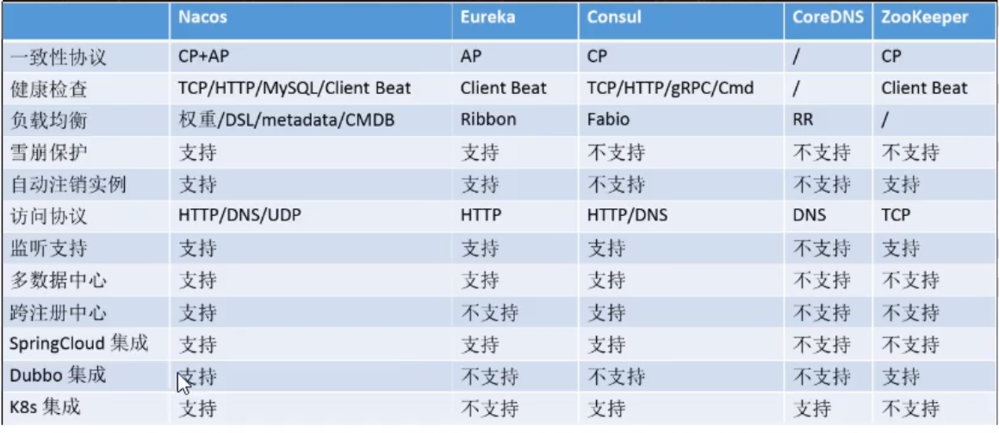

## 1、有了Spring Cloud，为什么又出现了Spring Cloud Alibaba？

> `Spring Cloud netflix`进入维护模式,将模块置于维护模式，意味着 Spring Cloud 团队将不会再向模块添加新功能。我们将修复 block 级别的 bug 以及安全问题，我们也会考虑并审查社区的小型 pull request。

## 2、什么是Spring Cloud Alibaba?

> Spring Cloud Alibaba 致力于提供微服务开发的一站式解决方案。此项目包含开发分布式应用微服务的必需组件，方便开发者通过 Spring Cloud 编程模型轻松使用这些组件来开发分布式应用服务。

## 3、Spring Cloud Alibaba有哪些功能？

> - **服务限流降级**：默认支持 WebServlet、WebFlux, OpenFeign、RestTemplate、Spring Cloud Gateway, Zuul, Dubbo 和 RocketMQ 限流降级功能的接入，可以在运行时通过控制台实时修改限流降级规则，还支持查看限流降级 Metrics 监控。
>
> - **服务注册与发现**：适配 Spring Cloud 服务注册与发现标准，默认集成了 Ribbon 的支持。
> - **分布式配置管理**：支持分布式系统中的外部化配置，配置更改时自动刷新。
> - **消息驱动能力**：基于 Spring Cloud Stream 为微服务应用构建消息驱动能力。
> - **分布式事务**：使用 @GlobalTransactional 注解， 高效并且对业务零侵入地解决分布式事务问题。
> - **阿里云对象存储**：阿里云提供的海量、安全、低成本、高可靠的云存储服务。支持在任何应用、任何时间、任何地点存储和访问任意类型的数据。
> - **分布式任务调度**：提供秒级、精准、高可靠、高可用的定时（基于 Cron 表达式）任务调度服务。同时提供分布式的任务执行模型，如网格任务。网格任务支持海量子任务均匀分配到所有 Worker（schedulerx-client）上执行。
> - **阿里云短信服务**：覆盖全球的短信服务，友好、高效、智能的互联化通讯能力，帮助企业迅速搭建客户触达通道。

## 4、Spring Cloud Alibaba的常用组件有哪些？

> **[Sentinel](https://github.com/alibaba/Sentinel)**：把流量作为切入点，从流量控制、熔断降级、系统负载保护等多个维度保护服务的稳定性。
>
> **[Nacos](https://github.com/alibaba/Nacos)**：一个更易于构建云原生应用的动态服务发现、配置管理和服务管理平台。
>
> **[RocketMQ](https://rocketmq.apache.org/)**：一款开源的分布式消息系统，基于高可用分布式集群技术，提供低延时的、高可靠的消息发布与订阅服务。
>
> **[Dubbo](https://github.com/apache/dubbo)**：Apache Dubbo™ 是一款高性能 Java RPC 框架。
>
> **[Seata](https://github.com/seata/seata)**：阿里巴巴开源产品，一个易于使用的高性能微服务分布式事务解决方案。
>
> **[Alibaba Cloud OSS](https://www.aliyun.com/product/oss)**: 阿里云对象存储服务（Object Storage Service，简称 OSS），是阿里云提供的海量、安全、低成本、高可靠的云存储服务。您可以在任何应用、任何时间、任何地点存储和访问任意类型的数据。
>
> **[Alibaba Cloud SchedulerX](https://help.aliyun.com/document_detail/43136.html)**: 阿里中间件团队开发的一款分布式任务调度产品，提供秒级、精准、高可靠、高可用的定时（基于 Cron 表达式）任务调度服务。
>
> **[Alibaba Cloud SMS](https://www.aliyun.com/product/sms)**: 覆盖全球的短信服务，友好、高效、智能的互联化通讯能力，帮助企业迅速搭建客户触达通道。

## 5、什么是Nacos？

> 前面组件中也有简单介绍；Nacos命名的由来：前四个字母分别是Naming和Configuration的前两个字母，后面的s是Service
>
> Nacos是一个易于使用的动态服务发现，配置和服务管理平台，用于构建云本机应用程序。使用Spring Cloud Alibaba Nacos Discovery，您可以基于Spring Cloud的编程模型快速访问Nacos服务注册功能。
>
> `Nacos`就是注册中心+配置中心的组合
>
> `Nacos` = `Eureka` + `Config` + `Bus`

## 6、Nacos有什么作用？

> - 替代`Eureka`做服务注册
> -  替代`Config`做配置中心
>
> 1. **服务发现与服务健康检查**
     >   Nacos使服务更容易注册，并通过DNS或HTTP接口发现其他服务，Nacos还提供服务的实时健康检查，以防
     >   止向不健康的主机或服务实例发送请求。
> 2. **动态配置管理**
     >   动态配置服务允许您在所有环境中以集中和动态的方式管理所有服务的配置。Nacos消除了在更新配置时重新
     >   部署应用程序，这使配置的更改更加高效和灵活。
> 3. **动态DNS服务**
     >   Nacos提供基于DNS 协议的服务发现能力，旨在支持异构语言的服务发现，支持将注册在Nacos上的服务以
     >   域名的方式暴露端点，让三方应用方便的查阅及发现。
> 4. **服务和元数据管理**
     >   Nacos 能让您从微服务平台建设的视角管理数据中心的所有服务及元数据，包括管理服务的描述、生命周
     >   期、服务的静态依赖分析、服务的健康状态、服务的流量管理、路由及安全策略。

## 7、目前主流配置中心的区别？

> 目前市面上用的比较多的配置中心有：Spring Cloud Config、Apollo、Nacos和Disconf等。
> 由于Disconf不再维护，下面主要对比一下Spring Cloud Config、Apollo和Nacos。

| 对比项目     | Spring Cloud Config    | Apollo                   | Nacos                    |
| ------------ | ---------------------- | ------------------------ | ------------------------ |
| 配置实时推送 | 支持(Spring Cloud Bus) | 支持(HTTP长轮询1s内)     | 支持(HTTP长轮询1s内)     |
| 版本管理     | 支持(Git)              | 支持                     | 支持                     |
| 配置回滚     | 支持(Git)              | 支持                     | 支持                     |
| 灰度发布     | 支持                   | 支持                     | 不支持                   |
| 权限管理     | 支持(依赖Git)          | 支持                     | 不支持                   |
| 多集群       | 支持                   | 支持                     | 支持                     |
| 多环境       | 支持                   | 支持                     | 支持                     |
| 监听查询     | 支持                   | 支持                     | 支持                     |
| 多语言       | 只支持Java             | 主流语言，提供了Open API | 主流语言，提供了Open API |
| 配置格式校验 | 不支持                 | 支持                     | 支持                     |
| 单机读(QPS)  | 7(限流所致)            | 9000                     | 15000                    |
| 单击写(QPS)  | 5(限流所致)            | 1100                     | 1800                     |
| 3节点读(QPS) | 21(限流所致)           | 27000                    | 45000                    |
| 3节点写(QPS) | 5(限流所致)            | 3300                     | 5600                     |

从配置中心角度来看，性能方面Nacos的读写性能最高，Apollo次之，Spring Cloud Config依赖Git场景不适合开放的大规模自动化运维API。

功能方面Apollo最为完善，nacos具有Apollo大部分配置管理功能，而Spring CloudConfig不带运维管理界面，需要自行开发。Nacos的一大优势是整合了注册中心、配置中心功能，部署和操作相比Apollo都要直观简单，因此它简化了架构复杂度，并减轻运维及部署工作。

综合来看，Nacos的特点和优势还是比较明显的。

## 8、服务注册中心对比？




## 9、Nacos支持Ap和Cp的切换，该如何选择呢？

> 一般来说，如果不需要存储服务级别的信息且服务实例是通过nacos-client注册，并能够保持心跳上报，那么就可以选择AP模式。当前主流的服务如 Spring cloud 和 Dubbo 服务，都适用于AP模式，AP模式为了服务的可能性而减弱了一致性，因此AP模式下只支持注册临时实例。
>
>
> 如果需要在服务级别编辑或者存储配置信息，那么 CP 是必须，K8S服务和DNS服务则适用于CP模式。
>
> CP模式下则支持注册持久化实例，此时则是以 Raft 协议为集群运行模式，该模式下注册实例之前必须先注册服务，如果服务不存在，则会返回错误。
>
> 模式切换代码
>
> ```
> curl -X PUT '$NACOS_SERVER:8848/nacos/v1/ns/operator/switches?entry=serverMode&value=CP'
> ```

## 10、Nacos读取配置文件的有哪几种方案？
> - `Data ID`方案：指定spring.profile.active和配置文件的DataID来使不同环境下读取不同的配置
> - `Group`方案：通过Group实现环境区分
> -  `Namespace`方案：通过建立不同NameSpace来区分

## 11、什么是Spring Cloud Sentinel？
> Sentinel 是面向分布式服务架构的流量控制组件，主要以流量为切入点，从流量控制、熔断降级、系统自适应保护等多个维度来帮助您保障微服务的稳定性。
> 官方地址：https://github.com/alibaba/Sentinel/wiki/%E4%BB%8B%E7%BB%8D   https://sentinelguard.io/zh-cn/docs/introduction.html

## 12、Sentinel 基本概念有哪些？
> **资源**
> 资源是 Sentinel 的关键概念。它可以是 Java 应用程序中的任何内容，例如，由应用程序提供的服务，或由应用程序调用的其它应用提供的服务，甚至可以是一段代码。在接下来的文档中，我们都会用资源来描述代码块。
> 只要通过 Sentinel API 定义的代码，就是资源，能够被 Sentinel 保护起来。大部分情况下，可以使用方法签名，URL，甚至服务名称作为资源名来标示资源。
> **规则**
> 围绕资源的实时状态设定的规则，可以包括流量控制规则、熔断降级规则以及系统保护规则。所有规则可以动态实时调整。

## 13、Sentinel有哪些优点？
> - **丰富的适用场景**：哨兵在阿里巴巴得到了广泛的应用，几乎覆盖了近10年双11（11.11）购物节的所有核心场景，比如需要限制突发流量的“秒杀”满足系统能力、消息削峰填谷、不依靠业务断路、流量控制等。
> - **实时监控**：Sentinel 还提供实时监控能力。可以实时查看单台机器的运行时信息，以及以下 500 个节点的集群运行时信息。
> - **广泛的开源生态**：Sentinel 提供与 Spring、Dubbo 和 gRPC 等常用框架和库的开箱即用集成。
> - **多语言支持**：Sentinel 为 Java、[Go](https://github.com/alibaba/sentinel-golang)和[C++](https://github.com/alibaba/sentinel-cpp)提供了本机支持。
> - **丰富的 SPI 扩展**：Sentinel 提供简单易用的 SPI 扩展接口，可以让您快速自定义逻辑，例如自定义规则管理、适配数据源等。

## 14、Sentinel有哪几种流控模式？
> - 直接（默认）：api达到限流条件，直接限流
> - 关联：当关联的资料达到阈值时，就限流自己。当与A关联的资源B达到阈值后，就限流A
> - 链路：链路流控模式指的是，当从某个接口过来的资源达到限流条件时，开启限流；它的功能有点类似于针对 来源配置项，区别在于：针对来源是针对上级微服务，而链路流控是针对上级接口，也就是说它的粒度 更细；

## 15、Sentinel有哪几种流控效果呢？
> - 直接（默认的流控处理）:该方式是默认的流量控制方式，当QPS超过任意规则的阈值后，新的请求就会被立即拒绝，拒绝方式为抛出`FlowException`
> - 预热(Warm Up)：阈值除以coldFactor(默认为3)，经过预热时长后才达到阈值，案例，阀值为10+预热时长设置5秒。系统初始化的阀值为10 / 3 约等于3,即阀值刚开始为3；然后过了5秒后阀值才慢慢升高恢复到10
> - 排队等待：匀速器（`RuleConstant.CONTROL_BEHAVIOR_RATE_LIMITER`）方式。这种方式严格控制了请求通过的间隔时间，也即是让请求以均匀的速度通过，对应的是漏桶算法

## 16、Sentinel 有哪些降级规则（熔断策略）？
> - 慢调用比例 (`SLOW_REQUEST_RATIO`)：选择以慢调用比例作为阈值，需要设置允许的慢调用 RT（即最大的响应时间），请求的响应时间大于该值则统计为慢调用。当单位统计时长（`statIntervalMs`）内请求数目大于设置的最小请求数目，并且慢调用的比例大于阈值，则接下来的熔断时长内请求会自动被熔断。经过熔断时长后熔断器会进入探测恢复状态（HALF-OPEN 状态），若接下来的一个请求响应时间小于设置的慢调用 RT 则结束熔断，若大于设置的慢调用 RT 则会再次被熔断。
>
> - 异常比例 (`ERROR_RATIO`)：当单位统计时长（`statIntervalMs`）内请求数目大于设置的最小请求数目，并且异常的比例大于阈值，则接下来的熔断时长内请求会自动被熔断。经过熔断时长后熔断器会进入探测恢复状态（HALF-OPEN 状态），若接下来的一个请求成功完成（没有错误）则结束熔断，否则会再次被熔断。异常比率的阈值范围是 `[0.0, 1.0]`，代表 0% - 100%。
>
> - 异常数 (`ERROR_COUNT`)：当单位统计时长内的异常数目超过阈值之后会自动进行熔断。经过熔断时长后熔断器会进入探测恢复状态（HALF-OPEN 状态），若接下来的一个请求成功完成（没有错误）则结束熔断，否则会再次被熔断。

## 17、 分布式事务存在的问题？
> 单体应用被拆分成微服务应用，原来的三个模块被拆分成三个独立的应用，分别使用三个独立的数据源，
> 业务操作需要调用三个服务来完成。此时每个服务内部的数据一致性由本地事务来保证，但是**全局的数据一致性问题**没法保证。

## 18、什么是Spring Cloud Seata？
> Seata 是一款开源的分布式事务解决方案，致力于提供高性能和简单易用的分布式事务服务。Seata 将为用户提供了 AT、TCC、SAGA 和 XA 事务模式，为用户打造一站式的分布式解决方案。

## 19、分布式事务的处理过程是怎样的？
>分布式事务处理过程的唯一ID+三组件模型：
>- Transaction ID XID（全局唯一的事务ID）
>- **三组件概念**
>- - TC (Transaction Coordinator) - 事务协调者：维护全局和分支事务的状态，驱动全局事务提交或回滚。
>- - TM (Transaction Manager) - 事务管理器：定义全局事务的范围：开始全局事务、提交或回滚全局事务。
>- - RM (Resource Manager) - 资源管理器：管理分支事务处理的资源，与TC交谈以注册分支事务和报告分支事务的状态，并驱动分支事务提交或回滚。
>
处理过程

1.  TM 向 TC 申请开启一个全局事务，全局事务创建成功并生成一个全局唯一的 XID；

2.  XID 在微服务调用链路的上下文中传播；

3.  RM 向 TC 注册分支事务，将其纳入 XID 对应全局事务的管辖；

4.  TM 向 TC 发起针对 XID 的全局提交或回滚决议；

5.  TC 调度 XID 下管辖的全部分支事务完成提交或回滚请求。

## 20、Seata分布式事务框架实现原理？
> Seata有三个组成部分：事务协调器TC：协调者、事务管理器TM：发起方、资源管理器RM：参与方

- 发起方会向协调者申请一个全局事务id，并保存到ThreadLocal中（为什么要保存到ThreadLocal中？弱引用，线程之间不会发生数据冲突） 
- Seata数据源代理发起方和参与方的数据源，将前置镜像和后置镜像写入到undo_log表中，方便后期回滚使用 
- 发起方获取全局事务id，通过改写Feign客户端请求头传入全局事务id。 
- 参与方从请求头中获取全局事务id保存到ThreadLocal中，并把该分支注册到SeataServer中。 
- 如果没有出现异常，发起方会通知协调者，协调者通知所有分支，通过全局事务id和本地事务id删除undo_log数据，如果出现异常，通过undo_log逆向生成sql语句并执行，然后删除undo_log语句。如果处理业务逻辑代码超时，也会回滚。
