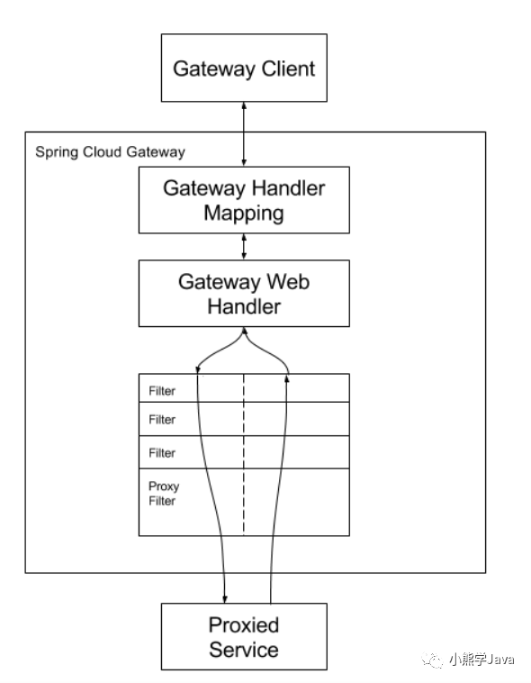

## 1、什么是微服务？

> ```
> The microservice architectural style is an approach to developing a single application as a suite of small services, each running in its own process and communicating with lightweight mechanisms, often an HTTP resource API. These services are built around business capabilities and independently deployable by fully automated deployment machinery. There is a bare minimum of centralized management of these services , which may be written in different programming languages and use different data storage technologies.
> ```
>
> 首先微服务并没有一个官方的定义，想要直接描述微服务比较困难，我们可以通过对比传统WEB应用，来理解什么是微服务。
>
> ## 1、传统的web项目VS微服务
>
> ### 1、传统的Web项目
>
> 传统的WEB应用核心分为业务逻辑、适配器以及API或通过UI访问的WEB界面。业务逻辑定义业务流程、业务规则以及领域实体。适配器包括数据库访问组件、消息组件以及访问接口等。
>
> 尽管也是遵循模块化开发，但最终它们会打包并部署为单体式应用。例如Java应用程序会被打包成WAR，部署在Tomcat或者Jetty上。
>
> 这种单体应用比较适合于小项目，优点是：
>
> - 开发简单直接，集中式管理
> - 基本不会重复开发
> - 功能都在本地，没有分布式的管理开销和调用开销
>
> 它的缺点也十分明显，特别对于互联网公司来说：
>
> - 开发效率低：所有的开发在一个项目改代码，递交代码相互等待，代码冲突不断
> - 代码维护难：代码功能耦合在一起，新人不知道何从下手
> - 部署不灵活：构建时间长，任何小修改必须重新构建整个项目，这个过程往往很长
> - 稳定性不高：一个微不足道的小问题，可以导致整个应用挂掉
> - 扩展性不够：无法满足高并发情况下的业务需求
>
> ### 2、微服务项目
>
> 现在主流的设计一般会采用微服务架构。其思路不是开发一个巨大的单体式应用，而是将应用分解为小的、互相连接的微服务。一个微服务完成某个特定功能，比如乘客管理和下单管理等。每个微服务都有自己的业务逻辑和适配器。一些微服务还会提供API接口给其他微服务和应用客户端使用
>
> **微服务架构的优点**
>
> - 解决了复杂性问题
    >
    > 它将单体应用分解为一组服务。虽然功能总量不变，但应用程序已被分解为可管理的模块或服务。这些服务定义了明确的RPC或消息驱动的API边界。微服务架构强化了应用模块化的水平，而这通过单体代码库很难实现。因此，微服务开发的速度要快很多，更容易理解和维护。
>
> - 单独开发每个服务，与其他服务互不干扰
    >
    > 只要符合服务API契约，开发人员可以自由选择开发技术。这就意味着开发人员可以采用新技术编写或重构服务，由于服务相对较小，所以这并不会对整体应用造成太大影响。
>
> - 可以独立部署每个微服务
    >
    > 开发人员无需协调对服务升级或更改的部署。这些更改可以在测试通过后立即部署。所以微服务架构也使得CI／CD成为可能。
>
> **微服务的缺点**
>
> - 多服务运维难度
> - 系统部署依赖
> - 服务间通信成本
> - 数据一致性
> - 系统集成测试
> - 重复工作
> - 性能监控

## 2、实现微服务要解决的四个问题？

> 1. 客户端如何访问这些服务？
> 2. 服务之间如何通信？
> 3. 这么多服务，怎么找?
> 4. 服务挂了怎么办？

### 1、客户端如何访问这些服务

原来的服务都是可以进行单独调用，现在按功能拆分成独立的服务，变成了一个独立的Java进程了。客户端UI如何访问他的？后台有N个服务，前台就需要记住管理N个服务，一个服务下线/更新/升级，前台就要重新部署，这明显不服务我们拆分的理念，特别当前台是移动应用的时候，通常业务变化的节奏更快。另外，N个小服务的调用也是一个不小的网络开销。还有一般微服务在系统内部，通常是无状态的，用户登录信息和权限管理最好有一个统一的地方维护管理（OAuth）。

所以，一般在后台N个服务和UI之间一般会一个代理或者叫`API Gateway`，他的作用包括

- 提供统一服务入口，让微服务对前台透明
- 聚合后台的服务，节省流量，提升性能
- 提供安全，过滤，流控等API管理功能

我的理解其实这个API Gateway可以有很多广义的实现办法，可以是一个软硬一体的盒子，也可以是一个简单MVC框架，甚至是一个Node.js的服务端。他们最重要的作用是为前台（通常是移动应用）提供后台服务的聚合，提供一个统一的服务出口，解除他们之间的耦合，不过API Gateway也有可能成为单点故障点或者性能的瓶颈。

### 2、 服务之间如何通信？

因为所有的微服务都是独立的Java进程跑在独立的虚拟机上，所以服务间的通行就是IPC（inter process communication），已经有很多成熟的方案。现在基本最通用的有两种方式。

- 同步调用

- - REST（JAX-RS）
- RPC（Dubbo）

- 异步消息调用(Kafka, Notify, MetaQ)

> 一般同步调用比较简单，一致性强，但是容易出调用问题，性能体验上也会差些，特别是调用层次多的时候。RESTful和RPC的比较也是一个很有意思的话题。一般REST基于HTTP，更容易实现，更容易被接受，服务端实现技术也更灵活些，各个语言都能支持，同时能跨客户端，对客户端没有特殊的要求，只要封装了HTTP的SDK就能调用，所以相对使用的广一些。RPC也有自己的优点，传输协议更高效，安全更可控，特别在一个公司内部，如果有统一个的开发规范和统一的服务框架时，他的开发效率优势更明显些。就看各自的技术积累实际条件，自己的选择了。
>
> 而异步消息的方式在分布式系统中有特别广泛的应用，他既能减低调用服务之间的耦合，又能成为调用之间的缓冲，确保消息积压不会冲垮被调用方，同时能保证调用方的服务体验，继续干自己该干的活，不至于被后台性能拖慢。不过需要付出的代价是一致性的减弱，需要接受数据最终一致性；还有就是后台服务一般要实现幂等性，因为消息发送出于性能的考虑一般会有重复（保证消息的被收到且仅收到一次对性能是很大的考验）；最后就是必须引入一个独立的broker，如果公司内部没有技术积累，对broker分布式管理也是一个很大的挑战。

### 3、这么多服务，怎么找?

在微服务架构中，一般每一个服务都是有多个拷贝，来做负载均衡。一个服务随时可能下线，也可能应对临时访问压力增加新的服务节点。服务之间如何相互感知？服务如何管理？这就是服务发现的问题了。一般有两类做法，也各有优缺点。基本都是通过zookeeper等类似技术做服务注册信息的分布式管理。当服务上线时，服务提供者将自己的服务信息注册到ZK（或类似框架），并通过心跳维持长链接，实时更新链接信息。服务调用者通过ZK寻址，根据可定制算法，找到一个服务，还可以将服务信息缓存在本地以提高性能。当服务下线时，ZK会发通知给服务

客户端。

- 客户端做：优点是架构简单，扩展灵活，只对服务注册器依赖。缺点是客户端要维护所有调用服务的地址，有

  技术难度，一般大公司都有成熟的内部框架支持，比如Dubbo。

- 服务端做：优点是简单，所有服务对于前台调用方透明，一般在小公司在云服务上部署的应用采用的比较多。

### 4、这么多服务，服务挂了怎么办？

前面提到，Monolithic方式开发一个很大的风险是，把所有鸡蛋放在一个篮子里，一荣俱荣，一损俱损。而分布式最大的特性就是网络是不可靠的。通过微服务拆分能降低这个风险，不过如果没有特别的保障，结局肯定是噩梦。我们刚遇到一个线上故障就是一个很不起眼的SQL计数功能，在访问量上升时，导致数据库load彪高，影响了所在应用的性能，从而影响所有调用这个应用服务的前台应用。所以当我们的系统是由一系列的服务调用链组成的时候，我们必须确保任一环节出问题都不至于影响整体链路。相应的手段有很多：

- 重试机制
- 限流
- 熔断机制
- 负载均衡
- 降级（本地缓存）

## 3、分布式和微服务有什么区别？

> 分布式，就是将巨大的一个系统划分为多个模块，这一点和微服务是一样的，都是要把系统进行拆分，部署到不同机器上，因为一台机器可能承受不了这么大的访问压力，或者说要支撑这么大的访问压力需要采购一台性能超级好的服务器，其财务成本非常高，有这些预算完全可以采购很多台普通的服务器了，分布式系统各个模块通过接口进行数据交互，其实分布式也是一种微服务，因为都是把模块拆分变为独立的单元，提供接口来调用，那么它们本质的区别是什么？
>
> 它们的本质的区别体现在“目标”上， 何为目标，就是你采用分布式架构或者采用微服务架构，你最终是为了什么，要达到什么目的？
>
> 分布式架构的目标是什么？就是访问量很大一台机器承受不了，或者是成本问题，不得不使用多台机器来完成服务的部署；
>
> 而微服务的目标是什么？只是让各个模块拆分开来，不会被互相影响，比如模块的升级或者出现BUG或者是重构等等都不要影响到其他模块，微服务它是可以在一台机器上部署；
>
> 但是：分布式也是微服务的一种，微服务也属于分布式；

## 4、微服务与Spring Cloud的关系或区别？

> 微服务只是一种项目的架构方式、架构理念，或者说是一种概念，就如同我们的MVC架构一样， 那么Spring Cloud便是对这种架构方式的技术落地实现；

## 5、微服务一定要使用Spring Cloud吗？

> 微服务只是一种项目的架构方式、架构理念，所以任何技术都可以实现这种架构理念，只是微服务架构里面有很多问题需要我们去解决，比如：负载均衡，服务的注册与发现，服务调用，服务路由，服务熔断等等一系列问题，如果你自己从0开始实现微服务的架构理念，那头发都掉光了，所以Spring Cloud 帮我们做了这些事情，Spring Cloud将处理这些问题的的技术全部打包好了，我们只需要开箱即用；

## 6、什么是Spring Cloud?

> 官方解释：Spring Cloud是一系列框架的有序集合。它利用Spring Boot的开发便利性巧妙地简化了分布式系统基础设施的开发，如服务发现注册、配置中心、消息总线、负载均衡、断路器、数据监控等，都可以用Spring Boot的开发风格做到一键启动和部署。Spring Cloud并没有重复制造轮子，它只是将各家公司开发的比较成熟、经得起实际考验的服务框架组合起来，通过Spring Boot风格进行再封装屏蔽掉了复杂的配置和实现原理，最终给开发者留出了一套简单易懂、易部署和易维护的分布式系统开发工具包。

## 7、Spring Cloud的优缺点有哪些？

> **优点：**
>
> 1. 服务拆分粒度更细，有利于资源重复利用，有利于提高开发效率
> 2. 可以更精准的制定优化服务方案，提高系统的可维护性
> 3. 微服务架构采用去中心化思想，服务之间采用Restful等轻量级通讯，比ESB更轻量
> 4. 适于互联网时代，产品迭代周期更短
>
> **缺点：**
>
> 1. 微服务过多，治理成本高，不利于维护系统
> 2. 分布式系统开发的成本高（容错，分布式事务等）对团队挑战大
>
> 总的来说优点大过于缺点，目前看来SpringCloud是一套非常完善的分布式框架，目前很多企业开始用微服务、Spring Cloud的优势是显而易见的。因此对于想研究微服务架构的同学来说，学习 Spring Cloud 是一个不错的选择。

## 8、Spring Cloud版本号了解吗？

> pring Cloud 采用了英国伦敦地铁站的名称来命名，并由地铁站名称字母A-Z依次类推的形式来发布迭代版本
>
> SpringCloud是一个由许多子项目组成的综合项目，各子项目有不同的发布节奏。为了管理SpringCloud与各子项目的版本依赖关系，发布了一个清单，其中包括了某个SpringCloud版本对应的子项目版本。为了避免SpringCloud版本号与子项目版本号混淆，SpringCloud版本采用了名称而非版本号的命名，这些版本的名字采用了伦敦地铁站的名字，根据字母表的顺序来对应版本时间顺序。例如Angel是第一个版本, Brixton是第二个版本。
>
> 当SpringCloud的发布内容积累到临界点或者一个重大BUG被解决后，会发布一个"service releases"版本，简称SRX版本，比如Greenwich.SR2就是SpringCloud发布的Greenwich版本的第2个SRX版本。

## 9、Spring Cloud与Spring Boot依赖关系？

> 官方提供版本之间的依赖关系，请参考官方：https://spring.io/projects/spring-cloud#overview
>
> 更详细版本对应的查看：https://start.spring.io/actuator/info

## 10、 SpringBoot和SpringCloud的区别？

> - SpringBoot专注于快速方便的开发单个个体微服务；SpringCloud是关注全局的微服务协调整理治理框架，它将SpringBoot开发的一个个单体微服务整合并管理起来，为各个微服务之间提供，配置管理、服务发现、断路器、路由、微代理、事件总线、全局锁、决策竞选、分布式会话等等集成服务
>
> - SpringBoot可以离开SpringCloud独立使用开发项目， 但是SpringCloud离不开SpringBoot ，属于依赖的关系
>
> - SpringBoot专注于快速、方便的开发单个微服务个体；SpringCloud关注全局的服务治理框架。

## 11、 Spring Cloud 和Dubbo区别?

> |              | Spring Cloud                     | Dubbo      |
> | ------------ | -------------------------------- | ---------- |
> | 服务调用方式 | Rest APi                         | RPC        |
> | 注册中心     | Eureka、Zookeeper、Nacos、Consul | Zookeeper  |
> | 服务网关     | Zuul、GateWay                    | 第三方整合 |

## 12、Spring Cloud有哪些组件?

> - 服务发现--Netflix Eureka
> - 客户端负载均衡--Netflix Ribbon
> - 断路器--Netflix Hystrix
> - 服务网关--Netflix Zuul
> - 分布式配置--Spring Cloud Config

## 13、Eureka的服务治理是什么？

> Spring Cloud 封装了 Netflix 公司开发的 Eureka 模块来实现服务治理。
>
> 在传统的rpc远程调用框架中，管理每个服务与服务之间依赖关系比较复杂，管理比较复杂，所以需要使用服务治理，管理服务于服务之间依赖关系，可以实现服务调用、负载均衡、容错等，实现服务发现与注册。

## 14、Eureka的服务注册是什么？

> Eureka采用了CS的设计架构，Eureka Server 作为服务注册功能的服务器，它是服务注册中心。而系统中的其他微服务，使用 Eureka的客户端连接到 Eureka Server并维持心跳连接。这样系统的维护人员就可以通过 Eureka Server 来监控系统中各个微服务是否正常运行。
>
> 在服务注册与发现中，有一个注册中心。当服务器启动的时候，会把当前自己服务器的信息 比如 服务地址通讯地址等以别名方式注册到注册中心上。另一方（消费者|服务提供者），以该别名的方式去注册中心上获取到实际的服务通讯地址，然后再实现本地RPC调用RPC远程调用框架核心设计思想：在于注册中心，因为使用注册中心管理每个服务与服务之间的一个依赖关系(服务治理概念)。在任何rpc远程框架中，都会有一个注册中心(存放服务地址相关信息(接口地址))
>
> 

## 15、Eureka如何实现高可用？

> 搭建集群环境，服务之间相互注册

## 16、Eureka如何获取服务信息？

> 通过服务发现的方式获取，自动装配`DiscoveryClient`，调用里面方法即可
>
> ```
> //获取所有服务
> List<String> services = discoveryClient.getServices();
> //指定服务名获取对应的信息
> List<ServiceInstance> instances = discoveryClient.getInstances("XIAOBEAR-CLOUD-PAYMENT-SERVICE");
> ```

## 17、Eureka的自我保护模式是什么？

> 默认情况下，如果EurekaServer在一定时间内没有接收到某个微服务实例的心跳，EurekaServer将会注销该实例（默认90秒）。但是当网络分区故障发生(延时、卡顿、拥挤)时，微服务与EurekaServer之间无法正常通信，以上行为可能变得非常危险了——因为微服务本身其实是健康的，此时本不应该注销这个微服务。Eureka通过“自我保护模式”来解决这个问题——当EurekaServer节点在短时间内丢失过多客户端时（可能发生了网络分区故障），那么这个节点就会进入自我保护模式。
>
> **在自我保护模式中，Eureka Server会保护服务注册表中的信息，不再注销任何服务实例。**
>
> 它的设计哲学就是宁可保留错误的服务注册信息，也不盲目注销任何可能健康的服务实例。一句话讲解：好死不如赖活着.
>
> 综上，自我保护模式是一种应对网络异常的安全保护措施。它的架构哲学是宁可同时保留所有微服务（健康的微服务和不健康的微服务都会保留）也不盲目注销任何健康的微服务。使用自我保护模式，可以让Eureka集群更加的健壮、稳定。

## 18、为什么会产生Eureka的自我保护呢？

> 为了防止EurekaClient可以正常运行，但是 与 EurekaServer网络不通情况下，EurekaServer不会立刻将EurekaClient服务剔除.

## 19、如何关闭Eureka的自我保护机制？

> **出厂默认，自我保护机制是开启的**
>
> 关闭可以通过配置文件进行关闭👇
>
> ```
> eureka:
> instance:
>  hostname: eureka7001.com  #eureka服务端的实例名称
> client:
>  register-with-eureka: false   #false表示不向注册中心注册自己。
>  fetch-registry: false      #false表示自己端就是注册中心，我的职责就是维护服务实例，并不需要去检索服务
>  service-url:
>    defaultZone: http://eureka7002.com:7002/eureka/
>     #设置与Eureka Server交互的地址查询服务和注册服务都需要依赖这个地址。
> server:
>   #关闭自我保护机制，保证不可用服务被及时踢除
>  enable-self-preservation: false
>  eviction-interval-timer-in-ms: 1000
> ```

## 20、Consul是什么？

> Consul 是一套开源的分布式服务发现和配置管理系统，由 HashiCorp 公司用 Go 语言开发。提供了微服务系统中的服务治理、配置中心、控制总线等功能。这些功能中的每一个都可以根据需要单独使用，也可以一起使用以构建全方位的服务网格，总之Consul提供了一种完整的服务网格解决方案。
>
> 它具有很多优点。包括：基于 raft 协议，比较简洁；支持健康检查, 同时支持 HTTP 和 DNS 协议 支持跨数据中心的 WAN 集群 提供图形界面 跨平台，支持 Linux、Mac、Windows

## 21、Consul有哪些特性？

> - 服务发现：提供HTTP和DNS两种服务发现方式
> - 健康监测：支持多种方式，Http、TCP、Docker、Shell脚本定制化监控
> - KV存储：key、value的存储方式
> - 多数据中心：支持多数据中心
> - 可视化Web界面

## 22、Eureka、Consul、Zookeeper三者都是注册中心，有什么区别？

|              | Eureka     | Consul   | Zookeeper |
| ------------ | ---------- | -------- | --------- |
| 语言         | Java       | Go       | Java      |
| CAP          | AP         | CP       | CP        |
| 服务健康检查 | 可配置支持 | 支持     | 支持      |
| 对外暴露接口 | HTTP       | HTTP/DNS | 客户端    |
| Spring Cloud | 可集成     | 可集成   | 可集成    |

### CAP

- C：consistency(强一致性)
- A：Availability(可用性)
- P：Partition tolerance(分区容错性)

## 23、什么是Spring Cloud Ribbon？

> Spring Cloud Ribbon是基于Netflix Ribbon实现的一套**客户端负载均衡**的工具。
>
> 简单的说，Ribbon是Netflix发布的开源项目，主要功能是提供客户端的软件负载均衡算法和服务调用。Ribbon客户端组件提供一系列完善的配置项如连接超时，重试等。简单的说，就是在配置文件中列出Load Balancer（简称LB）后面所有的机器，Ribbon会自动的帮助你基于某种规则（如简单轮询，随机连接等）去连接这些机器。

## 24、LB负载均衡(Load Balance)是什么

> 简单的说就是将用户的请求平摊的分配到多个服务上，从而达到系统的HA（高可用）。

## 25、Ribbon的本质是什么？

> **Ribbon就是负载均衡+RestTemplate调用**

## 26、Ribbon负载均衡算法，你了解吗？

> **负载均衡算法：rest接口第几次请求数 % 服务器集群总数量 = 实际调用服务器位置下标 ，每次服务重启动后rest接口计数从1开始。**
>
> ```
> List<ServiceInstance> instances = discoveryClient.getInstances("XIAOBEAR-CLOUD-PAYMENT-SERVICE");
> 如：  List [0] instances = 127.0.0.1:8002
> 　　　List [1] instances = 127.0.0.1:8001
> ```
>
> 8001+ 8002 组合成为集群，它们共计2台机器，集群总数为2， 按照轮询算法原理：
>
> 当总请求数为1时：1 % 2 =1 对应下标位置为1 ，则获得服务地址为127.0.0.1:8001
>
> 当总请求数位2时：2 % 2 =0 对应下标位置为0 ，则获得服务地址为127.0.0.1:8002
>
> 当总请求数位3时：3 % 2 =1 对应下标位置为1 ，则获得服务地址为127.0.0.1:8001
>
> 当总请求数位4时：4 % 2 =0 对应下标位置为0 ，则获得服务地址为127.0.0.1:8002
>
> 依次类推......

## 27、Ribbon负载均衡策略有哪些？

> - RoundRobinRule（轮询策略）：轮询，按照顺序依次选择
> - RandomRule（随机策略）：随机，随机选择一个服务
> - RetryRule（重试策略）：先按照RoundRobinRule的 策略获取服务，如果服务获取失败，则在指定的时间内重试，获取可用的服务
> - RestAvailableRule（最小连接策略）：先过滤调由于多次访问故障而处于断路器跳闸状态的服务，然后选择一个并发量最小的服务
> - AvailabilityFulteringRule（可用性敏感策略）：先过滤调故障实例，再选择并发量最小的实例
> - WeightedResponseTimeRule（权重策略）：对RoundRobinRule的扩展，响应速度越快的实例选择权重越大，越容易被选择。它的实现原理是，刚开始使用轮询策略并开启一个计时器，每一段时间收集一次所有服务提供者的平均响应时间，然后再给每个服务提供者附上一个权重，权重越高被选中的概率也越大。
> - ZoneAvoidanceRule（区域敏感策略）：默认规则，复合判断server所在区域的性能和server的可用性选择服务器

## 28、 Ribbon底层实现原理？

> Ribbon使用discoveryClient从注册中心读取目标服务信息，对同一接口请求进行计数，使用%取余算法获取目标服务集群索引，返回获取到的目标服务信息。

## 29、Ribbon本地负载均衡客户端 VS Nginx服务端负载均衡区别？

> - Nginx是服务器负载均衡，客户端所有请求都会交给nginx，然后由nginx实现转发请求。即负载均衡是由服务端实现的。
> - Ribbon本地负载均衡，在调用微服务接口时候，会在注册中心上获取注册信息服务列表之后缓存到JVM本地，从而在本地实现RPC远程服务调用技术。

## 28、Spring Cloud Feign是什么？

> Feign是一个声明式WebService客户端。使用Feign能让编写Web Service客户端更加简单。
>
> 它的使用方法是定义一个服务接口然后在上面添加注解。Feign也支持可拔插式的编码器和解码器。Spring Cloud对Feign进行了封装，使其支持了Spring MVC标准注解和HttpMessageConverters。Feign可以与Eureka和Ribbon组合使用以支持负载均衡

## 29、Feign与OpenFeign的区别？

> | Feign                                                        | OpenFeign                                                    |
> | ------------------------------------------------------------ | ------------------------------------------------------------ |
> | Feign是Spring Cloud组件中的一个轻量级RESTful的HTTP服务客户端；Feign内置了Ribbon，用来做客户端负载均衡，去调用服务注册中心的服务。Feign的使用方式是：使用Feign的注解定义接口，调用这个接口，就可以调用服务注册中心的服务 | OpenFeign是Spring Cloud 在Feign的基础上支持了SpringMVC的注解，如@RequesMapping等等。OpenFeign的@FeignClient可以解析SpringMVC的@RequestMapping注解下的接口，并通过动态代理的方式产生实现类，实现类中做负载均衡并调用其他服务。 |
> | `<dependency>  <groupId>org.springframework.cloud</groupId> <artifactId>spring-cloud-starter-feign</artifactId></dependency>` | `<dependency> <groupId>org.springframework.cloud</groupId> <artifactId>spring-cloud-starter-openfeign</artifactId></dependency> `|

## 30、OpenFeign的超时控制你了解？

> 默认Feign客户端只等待一秒钟，但是服务端处理需要超过1秒钟，导致Feign客户端不想等待了，直接返回报错。
>
> 为了避免这样的情况，有时候我们需要设置Feign客户端的超时控制。
>
> ```
> #设置feign客户端超时时间(OpenFeign默认支持ribbon)
> ribbon:
> #指的是建立连接所用的时间，适用于网络状况正常的情况下,两端连接所用的时间
> ReadTimeout: 5000
> #指的是建立连接后从服务器读取到可用资源所用的时间
> ConnectTimeout: 5000
> ```

## 31、什么是Hystrix断路器？

> Hystrix是一个用于处理分布式系统的延迟和容错的开源库，在分布式系统里，许多依赖不可避免的会调用失败，比如超时、异常等，Hystrix能够保证在一个依赖出问题的情况下，不会导致整体服务失败，避免级联故障，以提高分布式系统的弹性。

## 32、Hystrix实现延迟和容错的方法有哪些？

> - 包裹请求：使用HystrixCommand包裹对依赖的调用逻辑，每个命令在独立线程中执行。这使用了设计模式中的“命令模式”。
> - 跳闸机制：当某服务的错误率超过一定的阈值时，Hystrix可以自动或手动跳闸，停止请求该服务一段时间。
> - 资源隔离：Hystrix为每个依赖都维护了一个小型的线程池（或者信号量）。如果该线程池已满，发往该依赖的请求就被立即拒绝，而不是排队等待，从而加速失败判定。
> - 监控：Hystrix可以近乎实时地监控运行指标和配置的变化，例如成功、失败、超时、以及被拒绝的请求等。
> - 回退机制：当请求失败、超时、被拒绝，或当断路器打开时，执行回退逻辑。回退逻辑由开发人员自行提供，例如返回一个缺省值。
> - 自我修复：断路器打开一段时间后，会自动进入“半开”状态。

## 33、雪崩效应，你了解吗？

> 在微服务架构中，一个请求需要调用多个服务是非常常见的。如客户端访问A服务，而A服务需要调用B服务，B服务需要调用C服务，由于网络原因或者自身的原因，如果B服务或者C服务不能及时响应，A服务将处于阻塞状态，直到B服务C服务响应。此时若有大量的请求涌入，容器的线程资源会被消耗完毕，导致服务瘫痪。服务与服务之间的依赖性，故障会传播，造成连锁反应，会对整个微服务系统造成灾难性的严重后果，这就是服务故障的“雪崩”效应。
>
> 造成雪崩效应的原因：
>
> - 单个服务的代码存在bug
> - 请求访问量激增导致服务发生崩溃(如大型商城的枪红包，秒杀功能)
> - 服务器的硬件故障也会导致部分服务不可用

## 34、服务降级，你了解吗？

> 所谓降级，就是当某个服务熔断之后，服务器将不再被调用，此时客户端可以自己准备一个本地的fallback回调，返回一个缺省值。也可以理解为兜底方法。
>
> **会发生降级的情况**
>
> - 程序运行异常
> - 超时
> - 服务熔断触发服务降级
> - 线程池、信号量打满也会导致服务降级

## 35、服务熔断，你了解吗？

> 类比保险丝达到最大的服务访问后，直接拒绝访问，拉闸限电，然后调用服务降级的方法并返回友好提示
>
> 就相当于保险丝，服务的降级-----》进而熔断-----》恢复调用链路

## 36、服务限流，你了解吗？

> 限流可以认为服务降级的一种，限流就是限制系统的输入和输出流量已达到保护系统的目的。一般来说系统的吞吐量是可以被测算的，为了保证系统的稳固运行，一旦达到的需要限制的阈值，就需要限制流量并采取少量措施以完成限制流量的目的。比方：推迟解决，拒绝解决，或者者部分拒绝解决等等。秒杀高并发等操作，严禁一窝蜂的一样拥挤，排队有序进行，一秒钟N个，有序进行

## 37、Hystrix工作流程？

> 
>
> | 序号 | 操作                                                         |
> | ---- | ------------------------------------------------------------ |
> | 1    | 创建 HystrixCommand（用在依赖的服务返回单个操作结果的时候） 或 HystrixObserableCommand（用在依赖的服务返回多个操作结果的时候） 对象。 |
> | 2    | 命令执行。其中 HystrixComand 实现了下面前两种执行方式；而 HystrixObservableCommand 实现了后两种执行方式：execute()：同步执行，从依赖的服务返回一个单一的结果对象， 或是在发生错误的时候抛出异常。queue()：异步执行， 直接返回 一个Future对象， 其中包含了服务执行结束时要返回的单一结果对象。observe()：返回 Observable 对象，它代表了操作的多个结果，它是一个 Hot Obserable（不论 "事件源" 是否有 "订阅者"，都会在创建后对事件进行发布，所以对于 Hot Observable 的每一个 "订阅者" 都有可能是从 "事件源" 的中途开始的，并可能只是看到了整个操作的局部过程）。toObservable()：同样会返回 Observable 对象，也代表了操作的多个结果，但它返回的是一个Cold Observable（没有 "订阅者" 的时候并不会发布事件，而是进行等待，直到有 "订阅者" 之后才发布事件，所以对于 Cold Observable 的订阅者，它可以保证从一开始看到整个操作的全部过程）。 |
> | 3    | 若当前命令的请求缓存功能是被启用的， 并且该命令缓存命中， 那么缓存的结果会立即以 Observable 对象的形式 返回。 |
> | 4    | 检查断路器是否为打开状态。如果断路器是打开的，那么Hystrix不会执行命令，而是转接到 fallback 处理逻辑（第 8 步）；如果断路器是关闭的，检查是否有可用资源来执行命令（第 5 步）。 |
> | 5    | 线程池/请求队列/信号量是否占满。如果命令依赖服务的专有线程池和请求队列，或者信号量（不使用线程池的时候）已经被占满， 那么 Hystrix 也不会执行命令， 而是转接到 fallback 处理逻辑（第8步）。 |
> | 6    | Hystrix 会根据我们编写的方法来决定采取什么样的方式去请求依赖服务。HystrixCommand.run() ：返回一个单一的结果，或者抛出异常。HystrixObservableCommand.construct()：返回一个Observable 对象来发射多个结果，或通过 onError 发送错误通知。 |
> | 7    | Hystrix会将 "成功"、"失败"、"拒绝"、"超时" 等信息报告给断路器， 而断路器会维护一组计数器来统计这些数据。断路器会使用这些统计数据来决定是否要将断路器打开，来对某个依赖服务的请求进行 "熔断/短路"。 |
> | 8    | 当命令执行失败的时候， Hystrix 会进入 fallback 尝试回退处理， 我们通常也称该操作为 "服务降级"。而能够引起服务降级处理的情况有下面几种：第4步：当前命令处于"熔断/短路"状态，断路器是打开的时候。第5步：当前命令的线程池、 请求队列或 者信号量被占满的时候。第6步：HystrixObservableCommand.construct() 或 HystrixCommand.run() 抛出异常的时候。 |
> | 9    | 当Hystrix命令执行成功之后， 它会将处理结果直接返回或是以Observable 的形式返回。 |
>
> tips：如果我们没有为命令实现降级逻辑或者在降级处理逻辑中抛出了异常， Hystrix 依然会返回一个 Observable 对象， 但是它不会发射任何结果数据， 而是通过 onError 方法通知命令立即中断请求，并通过onError()方法将引起命令失败的异常发送给调用者。

## 38、 什么是Spring Cloud Zuul？

> Zuul是对SpringCloud提供的成熟对的路由方案，他会根据请求的路径不同，网关会定位到指定的微服务，并代理请求到不同的微服务接口，他对外隐蔽了微服务的真正接口地址。三个重要概念：动态路由表，路由定位，反向代理
>
> - 动态路由表：Zuul支持Eureka路由，手动配置路由，这俩种都支持自动更新
> - 路由定位：根据请求路径，Zuul有自己的一套定位服务规则以及路由表达式匹配
> - 反向代理：客户端请求到路由网关，网关受理之后，在对目标发送请求，拿到响应之后在 给客户端

## 39、Zuul的应用场景有哪些？

> 对外暴露，权限校验，服务聚合，日志审计

## 40、网关与过滤器有什么区别？

> 网关是对所有服务的请求进行分析过滤，过滤器是对单个服务而言

## 41、Zuul与Nginx有什么区别？

> Zuul是java语言实现的，主要为java服务提供网关服务，尤其在微服务架构中可以更加灵活的对网关进行操作。
>
> Nginx是使用C语言实现，性能高于Zuul，但是实现自定义操作需要熟悉lua语言，对程序员要求较高，可以使用Nginx做Zuul集群。

## 42、 ZuulFilter常用有那些方法？

> - Run()：过滤器的具体业务逻辑
>
> - shouldFilter()：判断过滤器是否有效
>
> - fifilterOrder()：过滤器执行顺序
>
> - fifilterType()：过滤器拦截位置

## 43、什么是Spring Cloud GateWay？

> Spring Cloud Gateway 作为 Spring Cloud 生态系统中的网关，目标是替代 Zuul，在Spring Cloud 2.0以上版本中，没有对新版本的Zuul 2.0以上最新高性能版本进行集成，仍然还是使用的Zuul 1.x非Reactor模式的老版本。
>
> **而为了提升网关的性能，SpringCloud Gateway是基于WebFlux框架实现的，而WebFlux框架底层则使用了高性能的Reactor模式通信框架Netty。**
>
> Spring Cloud Gateway的目标提供统一的路由方式且基于 Filter 链的方式提供了网关基本的功能，例如：安全，监控/指标，和限流。

## 44、为什么我们选择GateWay？

> 1. netflix不靠谱，迟迟不发布
     >
     >    因为Zuul1.0已经进入了维护阶段，而且Gateway是SpringCloud团队研发的，是亲儿子产品，值得信赖。而且很多功能Zuul都没有用起来也非常的简单便捷。
     >
     >    Gateway是基于异步非阻塞模型上进行开发的，性能方面不需要担心。虽然Netflix早就发布了最新的 Zuul 2.x，但 Spring Cloud 貌似没有整合计划。而且Netflix相关组件都宣布进入维护期；不知前景如何？
     >
     >    多方面综合考虑Gateway是很理想的网关选择。
>
> 2. Spring Cloud GateWay有很多特性
>
> 3. - 基于Spring Framework 5, Project Reactor 和 Spring Boot 2.0 进行构建；
>    - 动态路由：能够匹配任何请求属性；
>    - 可以对路由指定 Predicate（断言）和 Filter（过滤器）；
>    - 集成Hystrix的断路器功能；
>    - 集成 Spring Cloud 服务发现功能；
>    - 易于编写的 Predicate（断言）和 Filter（过滤器）；
>    - 请求限流功能；
>    - 支持路径重写。

## 45、Spring Cloud Gateway 与 Zuul的区别？

> 1. Zuul 1.x，是一个基于阻塞 I/ O 的 API Gateway
> 2. Zuul 1.x 基于Servlet 2. 5使用阻塞架构它不支持任何长连接(如 WebSocket) Zuul 的设计模式和Nginx较像，每次 I/ O 操作都是从工作线程中选择一个执行，请求线程被阻塞到工作线程完成，但是差别是Nginx 用C++ 实现，Zuul 用 Java 实现，而 JVM 本身会有第一次加载较慢的情况，使得Zuul 的性能相对较差。
> 3. Zuul 2.x理念更先进，想基于Netty非阻塞和支持长连接，但SpringCloud目前还没有整合。Zuul 2.x的性能较 Zuul 1.x 有较大提升。在性能方面，根据官方提供的基准测试， Spring Cloud Gateway 的 RPS（每秒请求数）是Zuul 的 1. 6 倍。
> 4. Spring Cloud Gateway 建立 在 Spring Framework 5、 Project Reactor 和 Spring Boot 2 之上， 使用非阻塞 API。
> 5. Spring Cloud Gateway 还 支持 WebSocket， 并且与Spring紧密集成拥有更好的开发体验

## 46、Spring Cloud GateWay工作流程？

> 
>
> 客户端向 Spring Cloud Gateway 发出请求。然后在 Gateway Handler Mapping 中找到与请求相匹配的路由，将其发送到 Gateway Web Handler。
>
> Handler 再通过指定的过滤器链来将请求发送到我们实际的服务执行业务逻辑，然后返回。
>
> 过滤器之间用虚线分开是因为过滤器可能会在发送代理请求之前（“pre”）或之后（“post”）执行业务逻辑。
>
> Filter在“pre”类型的过滤器可以做参数校验、权限校验、流量监控、日志输出、协议转换等，
>
> 在“post”类型的过滤器中可以做响应内容、响应头的修改，日志的输出，流量监控等有着非常重要的作用。
>
> 核心逻辑：**路由转发+执行过滤链**

## 47、Spring Cloud GateWay网关配置的两种方式？

> - yaml配置
    >
    >   ```
>    server:
>      port: 9527
>   
>    spring:
>      application:
>        name: xiaobear-cloud-gateway
>      cloud:
>        gateway:
>          routes:
>            - id: payment_routh #payment_route    #路由的ID，没有固定规则但要求唯一，建议配合服务名
>              uri: http://localhost:8001         #匹配后提供服务的路由地址
>              predicates:
>                - Path=/payment/selectOne/**         # 断言，路径相匹配的进行路由
>   
>            - id: payment_routh2 #payment_route   #路由的ID，没有固定规则但要求唯一，建议配合服务名
>              uri: http://localhost:8001         #匹配后提供服务的路由地址
>              predicates:
>                - Path=/payment/payment/lb/**         # 断言，路径相匹配的进行路由
>   ```
>
>
>
> - 代码中注入`RouteLocator`的`Bean`
    >
    >   ```
>    @Configuration
>    public class GateWayConfig {
>   
>        @Bean
>        public RouteLocator customRouteLocator(RouteLocatorBuilder routeBuilder){
>            return routeBuilder.routes().route("xiaobear-config",r -> r.path("/spring-cloud-gateway-configuration").uri("https://www.bilibili.com/video/BV18E411x7eT")).build();
>       }
>    }
>   ```

## 48、Spring Cloud GateWay常用的断言方式有哪些？

> - After Route Predicate Factory：表示在这个时区里的时间点才允许访问，时间格式为Java 8新特性的时区时间格式
    >
    >   ```
>    ZonedDateTime zbj = ZonedDateTime.now(); // 默认时区
>     ZonedDateTime zny = ZonedDateTime.now(ZoneId.of("America/New_York")); // 用指定时区获取当前时间
>   ```
    >
    >   ```
>    spring:
>     application:
>       name: xiaobear-cloud-gateway
>     cloud:
>       gateway:
>         routes:
>         - id: payment_routh2 #payment_route   #路由的ID，没有固定规则但要求唯一，建议配合服务名
>             uri: lb://XIAOBEAR-CLOUD-PAYMENT-SERVICE
>              #uri: http://localhost:8001         #匹配后提供服务的路由地址
>             predicates:
>               - Path=/payment/payment/lb/**         # 断言，路径相匹配的进行路由
>               - After=2021-05-24T15:17:53.623+08:00[Asia/Shanghai]         # 断言，路径相匹配的进行路由
>   ```
>
> - Before Route Predicate Factory：在时间点前才允许访问
    >
    >   ```
>    spring:
>     application:
>       name: xiaobear-cloud-gateway
>     cloud:
>       gateway:
>         routes:
>         - id: payment_routh2 #payment_route   #路由的ID，没有固定规则但要求唯一，建议配合服务名
>             uri: lb://XIAOBEAR-CLOUD-PAYMENT-SERVICE
>              #uri: http://localhost:8001         #匹配后提供服务的路由地址
>             predicates:
>               - Path=/payment/payment/lb/**         # 断言，路径相匹配的进行路由
>               - Before=2021-05-24T15:17:53.623+08:00[Asia/Shanghai]         # 断言，路径相匹配的进行路由
>   ```
>
>
>
> - Between Route Predicate Factory：在两者之间
    >
    >   ```
>    spring:
>     application:
>       name: xiaobear-cloud-gateway
>     cloud:
>       gateway:
>         routes:
>         - id: payment_routh2 #payment_route   #路由的ID，没有固定规则但要求唯一，建议配合服务名
>             uri: lb://XIAOBEAR-CLOUD-PAYMENT-SERVICE
>              #uri: http://localhost:8001         #匹配后提供服务的路由地址
>             predicates:
>               - Path=/payment/payment/lb/**         # 断言，路径相匹配的进行路由
>               - Between=2021-05-24T15:17:53.623+08:00[Asia/Shanghai], 2021-05-24T15:30:53.623+08:00[Asia/Shanghai]         # 断言，路径相匹配的进行路由
>   ```
>
>
>
> - Cookie Route Predicate Factory：Cookie Route Predicate需要两个参数，一个是 Cookie name ,一个是正则表达式。
    >
    >   路由规则会通过获取对应的 Cookie name 值和正则表达式去匹配，如果匹配上就会执行路由，如果没有匹配上则不执行
    >
    >   ```
>    spring:
>     application:
>       name: xiaobear-cloud-gateway
>     cloud:
>       gateway:
>         routes:
>         - id: payment_routh2 #payment_route   #路由的ID，没有固定规则但要求唯一，建议配合服务名
>             uri: lb://XIAOBEAR-CLOUD-PAYMENT-SERVICE
>              #uri: http://localhost:8001         #匹配后提供服务的路由地址
>             predicates:
>               - Path=/payment/payment/lb/**         # 断言，路径相匹配的进行路由
>               - Between=2021-05-24T15:17:53.623+08:00[Asia/Shanghai], 2021-05-24T15:30:53.623+08:00[Asia/Shanghai]         # 断言，路径相匹配的进行路由
>   ```
>
>
>
> - Header Route Predicate Factory：两个参数：一个是属性名称和一个正则表达式，这个属性值和正则表达式匹配则执行。
    >
    >   ```
>    spring:
>     application:
>       name: xiaobear-cloud-gateway
>     cloud:
>       gateway:
>         routes:
>         - id: payment_routh2 #payment_route   #路由的ID，没有固定规则但要求唯一，建议配合服务名
>             uri: lb://XIAOBEAR-CLOUD-PAYMENT-SERVICE
>              #uri: http://localhost:8001         #匹配后提供服务的路由地址
>             predicates:
>               - Path=/payment/payment/lb/**         # 断言，路径相匹配的进行路由
>               - Header=X-Request-Id, \d+  # 请求头要有X-Request-Id属性并且值为整数的正则表达式        
>   ```
>
>
>
> - Host Route Predicate Factory：Host Route Predicate 接收一组参数，一组匹配的域名列表，这个模板是一个 ant 分隔的模板，用.号作为分隔符。它通过参数中的主机地址作为匹配规则。
    >
    >   ```
>    spring:
>     application:
>       name: xiaobear-cloud-gateway
>     cloud:
>       gateway:
>         routes:
>         - id: payment_routh2 #payment_route   #路由的ID，没有固定规则但要求唯一，建议配合服务名
>             uri: lb://XIAOBEAR-CLOUD-PAYMENT-SERVICE
>              #uri: http://localhost:8001         #匹配后提供服务的路由地址
>             predicates:
>               - Path=/payment/payment/lb/**         # 断言，路径相匹配的进行路由
>               - Host=**.xiaobear.com         # 断言，路径相匹配的进行路由
>   ```
>
>
>
> 其他的请参照官网：https://docs.spring.io/spring-cloud-gateway/docs/current/reference/html/#gateway-request-predicates-factories
>
> 总结：`Predicate`就是为了实现一组匹配规则，让请求找到对应的`Route`进行处理

## 49、什么是Spring Cloud GateWay Filter过滤？

> 路由过滤器可用于修改进入的HTTP请求和返回的HTTP响应，路由过滤器只能指定路由进行使用。
>
> Spring Cloud Gateway 内置了多种路由过滤器，他们都由GatewayFilter的工厂类来产生。

## 50、Spring Cloud GateWay Filter过滤器的分类有哪些？

> **按生命周期分类**
>
> - `Pre`
> - `Post`
>
> **按种类分类**
>
> - GatewayFilter Factories
> - Global Filters

## 51、如何自定义Spring Cloud GateWay全局过滤器？

> 自定义全局过滤器`Global Filters`
>
> 主要是实现两个接口 `implements GlobalFilter,Ordered`
>
> 具体案例请参考：实例教程

## 52、什么是Spring Cloud Config？

> SpringCloud Config为微服务架构中的微服务提供集中化的外部配置支持，配置服务器为各个不同微服务应用的所有环境提供了一个中心化的外部配置。
>
> SpringCloud Config分为**服务端**和**客户端**两部分。
>
> - 服务端也称为分布式配置中心，它是一个独立的微服务应用，用来连接配置服务器并为客户端提供获取配置信息，加密/解密信息等访问接口
> - 客户端则是通过指定的配置中心来管理应用资源，以及与业务相关的配置内容，并在启动的时候从配置中心获取和加载配置信息配置服务器默认采用git来存储配置信息，这样就有助于对环境配置进行版本管理，并且可以通过git客户端工具来方便的管理和访问配置内容。

## 53、Spring Cloud Config有什么作用？

> - 集中管理配置文件
> - 不同环境不同配置，动态化的配置更新，分环境部署，比如/dev、/test、/prod、/beta、/release
> - 运行期间动态调整配置，不再需要在每个服务部署的机器上编写配置文件，服务会向配置中心统一拉取配置自己的信息
> - 当配置发生变动时，服务不需要重启即可感知到配置的变化并应用新的配置
> - 将配置信息以REST接口的形式暴露
> - post、curl访问刷新即可

## 54、Spring Cloud Config怎么读取配置文件？

> ```
> /{application}/{profile}[/{label}]
> /{application}-{profile}.yml
> /{label}/{application}-{profile}.yml
> /{application}-{profile}.properties
> /{label}/{application}-{profile}.properties
> ```
>
> 其中“应用程序”作为`SpringApplication`中的`spring.config.name`注入（即常规Spring Boot应用程序中通常为“应用程序”），“配置文件”是活动配置文件（或逗号分隔列表）的属性），“label”是可选的git标签（默认为“master”）
>
> label：分支(branch)
>
> name ：服务名
>
> profiles：环境(dev/test/prod)

## 55、Spring Cloud Config修改配置文件，如何动态刷新？

> 配合`Spring Cloud Bus`实现配置的动态的刷新

## 56、什么是Spring Cloud Bus消息总线？

> Spring Cloud Bus将分布式系统的节点与轻量级消息代理链接。这可以用于广播状态更改（例如配置更改）或其他管理指令。一个关键的想法是，Bus就像一个扩展的Spring Boot应用程序的分布式执行器，但也可以用作应用程序之间的通信渠道。当前唯一的实现是使用AMQP代理作为传输，但是相同的基本功能集（还有一些取决于传输）在其他传输的路线图上。

## 57、Spring Cloud Bus如何动态刷新全局广播？

> - 利用消息总线触发一个客户端/bus/refresh，而刷新所有客户端配置
> - 利用消息总线触发一个服务端ConfigServer的/bus/refresh端点，而刷新所有客户端的配置
>
> **推荐：**第二个思想更合适一点，第一个不适合原因如下：
>
> - 打破了微服务的单一职责性，因为微服务本身是业务模块，它本不应该承担配置刷新的职责
> - 破坏了微服务各节点的对等性
> - 有一定的局限性。比如微服务在迁移时，它的网络地址时常发生变化，这时要想做到自动刷新，那就会增加更多的修改

## 58、Spring Cloud Bus如何动态刷新定点通知？

> 不想通知所有刷新，而只是想刷新一部分配置，公式如下👇
>
> http://localhost:配置中心的端口号/actuator/bus-refresh/{destination}
>
> bus/refresh请求不再发送到具体的服务实例上，而是发给config server并通过destination参数类指定需要更新配置的服务或实例
>
> 示例：以刷新运行在3355端口上的config-client为例
>
> - curl -X POST "http://localhost:3344/actuator/bus-refresh/config-client:3355"

## 59、Spring Cloud Stream消息驱动是什么？

> 屏蔽底层消息中间件的差异,降低切换成本，统一消息的编程模型；轻量级事件驱动微服务框架，可以使用简单的声明式模型来发送及接收消息，主要实现为Apache Kafka及RabbitMQ；

## 60、为什么Spring Cloud Stream可以统一底层差异？

> 在没有绑定器这个概念的情况下，我们的SpringBoot应用要直接与消息中间件进行信息交互的时候，由于各消息中间件构建的初衷不同，它们的实现细节上会有较大的差异性通过定义绑定器作为中间层，完美地实现了**应用程序与消息中间件细节之间的隔离**。通过向应用程序暴露统一的Channel通道，使得应用程序不需要再考虑各种不同的消息中间件实现。**通过定义绑定器Binder作为中间层，实现了应用程序与消息中间件细节之间的隔离。**

## 61、Spring Cloud Stream如何解决重复消费和持久化？

> 加入分组属性`Group`，微服务应用放置于同一个`Group`中，就能够保证消息只会被其中一个应用消费一次。不同的组是可以消费的，同一个组内会发生竞争关系，只有其中一个可以消费。

## 62、什么是Spring Cloud Sleuth？

> Spring Cloud Sleuth提供了一套完整的服务跟踪的解决方案，在分布式系统中提供追踪解决方案并且兼容支持了zipkin。
