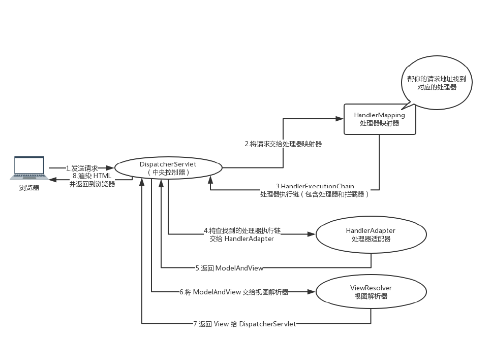

## 1、什么是Spring MVC?

> Spring MVC是一个基于Java的实现了MVC设计模式的请求驱动类型的轻量级Web框架，通过把模型-视图-控制器分离，将web层进行职责解耦，把复杂的web应用分成逻辑清晰的几部分，简化开发，减少出错，方便组内开发人员之间的配合。

## 2、Spring MVC的优点？

> - 可以支持各种视图技术，而不仅仅局限于JSP
> - 与Spring 框架继承（IOC、AOP）
> - 清晰的角色分配：前端控制器（DispatcherServlet）,请求到处理器映射（HandleMapping）,处理器适配器（HandleAdapter）,视图解析器（ViewResolver）
> - 支持各种请求资源的映射策略
> - 易于扩展的

## 3、Spring MVC的主要组件

> - 前端控制器（DispatcherServlet）
    >
    >   作用：接收请求、响应结果，相当于转发器，有了DispatcherServlet就减少了其他组件之间的耦合度
>
> - 处理器映射器HandlerMapping（不需要程序员开发）
    >
    >   作用：根据请求的URL来查找Handler
>
> - 处理器适配器HandlerAdapter
    >
    >   在编写Handler的时候要按照HandlerAdapter要求的规则去编写，这样适配器HandlerAdapter才可以正确的去执行Handler。
>
> - 处理器Handler（需要程序员开发）
>
> - 视图解析器 ViewResolver（不需要程序员开发）
    >
    >   作用：进行视图的解析，根据视图逻辑名解析成真正的视图（view）
>
> - 视图View（需要程序员开发jsp）
    >
    >   View是一个接口， 它的实现类支持不同的视图类型（jsp，freemarker，pdf等等）


## 4、什么是DispatcherServlet

> Spring的MVC框架是围绕DispatcherServlet来设计的，它用来处理所有的HTTP请求和响应。


## 5、什么是Spring MVC框架的控制器？

> 控制器提供一个访问应用程序的行为，此行为通常通过服务接口实现。控制器解析用户输入并将其转换为一个由视图呈现给用户的模型。Spring用一个非常抽象的方式实现了一个控制层，允许用户创建多种用途的控制器。


## 6、Spring MVC的控制器是不是单例模式,如果是,有什么问题,怎么解决？

> 是单例模式,所以在多线程访问的时候有线程安全问题,不要用同步,会影响性能的,解决方案是在控制器里面不能写字段。


## 7、Spring MVC的工作原理




## 8、MVC是什么？MVC设计模式的好处有哪些？

> - mvc是一种设计模式（设计模式就是日常开发中编写代码的一种好的方法和经验的总结）。模型（model）-视图（view）-控制器（controller），三层架构的设计模式。用于实现前端页面的展现与后端业务数据处理的分离。
> - 好处：
    >   - 分层设计，实现了业务系统各个组件之间的解耦，有利于业务系统的可扩展性，可维护性。
>   - 有利于系统的并行开发，提升开发效率。


## 9、注解的原理是什么

> 注解本质是一个继承了Annotation的特殊接口，其具体实现类是Java运行时生成的动态代理类。我们通过反射获取注解时，返回的是Java运行时生成的动态代理对象。通过代理对象调用自定义注解的方法，会最终调用AnnotationInvocationHandler的invoke方法。该方法会从memberValues这个Map中索引出对应的值。而memberValues的来源是Java常量池。

## 10、Spring MVC常用的注解有哪些？

> `@RequestMapping`：用于处理请求 url 映射的注解，可用于类或方法上。用于类上，则表示类中的所有响应请求的方法都是以该地址作为父路径。
>
> `@RequestBody`：注解实现接收http请求的json数据，将json转换为java对象。
>
> `@ResponseBody`：注解实现将conreoller方法返回对象转化为json对象响应给客户。
>
> `@Conntroller`：控制器的注解，表示是表现层,不能用用别的注解代替

## 11、SpingMvc中的控制器的注解一般用哪个,有没有别的注解可以替代？

> 一般用@Controller注解,也可以使用@RestController,@RestController注解相当于@ResponseBody ＋ @Controller,表示是表现层,除此之外，一般不用别的注解代替。

## 12、@RequestMapping注解的作用

> RequestMapping是一个用来处理请求地址映射的注解，可用于类或方法上。用于类上，表示类中的所有响应请求的方法都是以该地址作为父路径。
>
> RequestMapping注解有六个属性
>
> -  value， method
     >    - value： 指定请求的实际地址，指定的地址可以是URI Template 模式（后面将会说明）
>    - method： 指定请求的method类型， GET、POST、PUT、DELETE等
> -  consumes，produces
     >    - consumes： 指定处理请求的提交内容类型（Content-Type），例如application/json,text/html;
>    - produces: 指定返回的内容类型，仅当request请求头中的(Accept)类型中包含该指定类型才返回；
> -  params，headers
     >    - params： 指定request中必须包含某些参数值是，才让该方法处理。
>    - headers： 指定request中必须包含某些指定的header值，才能让该方法处理请求。

## 13、@ResponseBody注解的作用

> **作用**： 该注解用于将Controller的方法返回的对象，通过适当的HttpMessageConverter转换为指定格式后，写入到Response对象的body数据区。
>
> **使用时机**：返回的数据不是html标签的页面，而是其他某种格式的数据时（如json、xml等）使用；

## 14、@PathVariable和@RequestParam的区别

> 请求路径上有个id的变量值，可以通过@PathVariable来获取 @RequestMapping(value =“/page/{id}”, method = RequestMethod.GET)
>
> @RequestParam用来获得静态的URL请求入参 spring注解时action里用到。

## 15、Spring MVC与Struts2区别

> **相同点**：都是基于mvc的表现层框架，都用于web项目的开发。
>
> **不同点**：
>
> 1. 前端控制器不一样。
     >    - Spring MVC的前端控制器是servlet：DispatcherServlet。
>    - struts2的前端控制器是filter：StrutsPreparedAndExcutorFilter。
> 2. 请求参数的接收方式不一样。
     >    - Spring MVC是使用方法的形参接收请求的参数，基于方法的开发，线程安全，可以设计为单例或者多例的开发，推荐使用单例模式的开发（执行效率更高），默认就是单例开发模式。
>    - struts2是通过类的成员变量接收请求的参数，是基于类的开发，线程不安全，只能设计为多例的开发。
> 3. Struts采用值栈存储请求和响应的数据，通过OGNL存取数据；Spring MVC通过参数解析器是将request请求内容解析，并给方法形参赋值，将数据和视图封装成ModelAndView对象，最后又将ModelAndView中的模型数据通过reques域传输到页面。Jsp视图解析器默认使用jstl。
> 4. 与spring整合不一样。
     >    - Spring MVC是spring框架的一部分，不需要整合。在企业项目中，SpringMVC使用更多一些。

## 16、Spring MVC怎么样设定重定向和转发的？

> **重定向**：在返回值前面加"forward:"，譬如"forward:user.do?name=method4"
>
> **转发**：在返回值前面加"redirect:"，譬如"redirect:www.baidu.com"

## 17、Spring MVC怎么和AJAX相互调用的？

> 通过Jackson框架就可以把Java里面的对象直接转化成Js可以识别的Json对象。具体步骤如下：
>
> - 加入Jackson.jar
> - 在配置文件中配置json的映射
> - 在接受Ajax方法里面可以直接返回Object,List等,但方法前面要加上@ResponseBody注解。

## 18、如何解决POST请求中文乱码问题，GET的又如何处理呢？

> **POST处理中文乱码**：在web.xml中配置一个CharacterEncodingFilter过滤器，设置成utf-8；
>
> ```xml
> <filter>
>  <filter-name>CharacterEncodingFilter</filter-name>
>  <filterclass>
>      org.springframework.web.filter.CharacterEncodingFilter</filter-class>
>  <init-param>
>      <param-name>encoding</param-name>
>      <param-value>utf-8</param-value>
>  </init-param>
> </filter>
> <filter-mapping>
>  <filter-name>CharacterEncodingFilter</filter-name>
>  <url-pattern>/*</url-pattern>
> </filter-mapping>
> ```

> **GET请求中文参数出现乱码解决方法**:
>
> - 修改tomcat配置文件添加编码与工程编码一致，如下：
    >
    >   ```xml
>   <ConnectorURIEncoding="utf-8" connectionTimeout="20000" port="8080"protocol="HTTP/1.1" redirectPort="8443"/>
>   ```
>
>
>
> - 对参数进行重新编码
    >
    >   ```java
>   String userName = new String(request.getParamter(“userName”).getBytes(“ISO8859-1”),“utf-
>   8”)
>   ```
    >
    >   ISO8859-1是tomcat默认编码，需要将tomcat编码后的内容按utf-8编码。

## 19、Spring MVC的异常处理

> 可以将异常抛给Spring框架，由Spring框架来处理；我们只需要配置简单的异常处理器，在异常处理器中添视图页面即可。

## 20、如果在拦截请求中，我想拦截get方式提交的方法,怎么配置

> 可以在@RequestMapping注解里面加上method=RequestMethod.GET。

## 21、怎样在方法里面得到Request,或者Session？

> 直接在方法的形参中声明request,Spring MVC就自动把request对象传入。

## 22、如果想在拦截的方法里面得到从前台传入的参数,怎么得到？

> 直接在形参里面声明这个参数就可以,但必须名字和传过来的参数一样。

## 23、如果前台有很多个参数传入,并且这些参数都是一个对象的,那么怎么样快速得到这个对象？

> 直接在方法中声明这个对象,Spring MVC就自动会把属性赋值到这个对象里面。

## 24、Spring MVC中函数的返回值是什么？

> 返回值可以有很多类型,有String, ModelAndView。ModelAndView类把视图和数据都合并的一起的，但一般用String比较好。

## 25、Spring MVC用什么对象从后台向前台传递数据的？

> 通过ModelMap对象,可以在这个对象里面调用put方法,把对象加到里面,前台就可以通过el表达式拿到。

## 26、怎么样把ModelMap里面的数据放入Session里面？

> 可以在类上面加上@SessionAttributes注解,里面包含的字符串就是要放入session里面的key。

## 27、Spring MVC里面拦截器是怎么写的

> 有两种写法,一种是实现HandlerInterceptor接口，另外一种是继承适配器类，接着在接口方法当中，实现处理逻辑；然后在Spring MVC的配置文件中配置拦截器即可：
