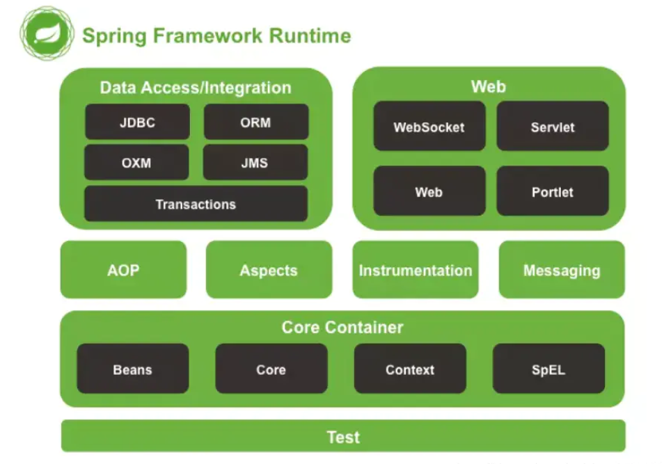
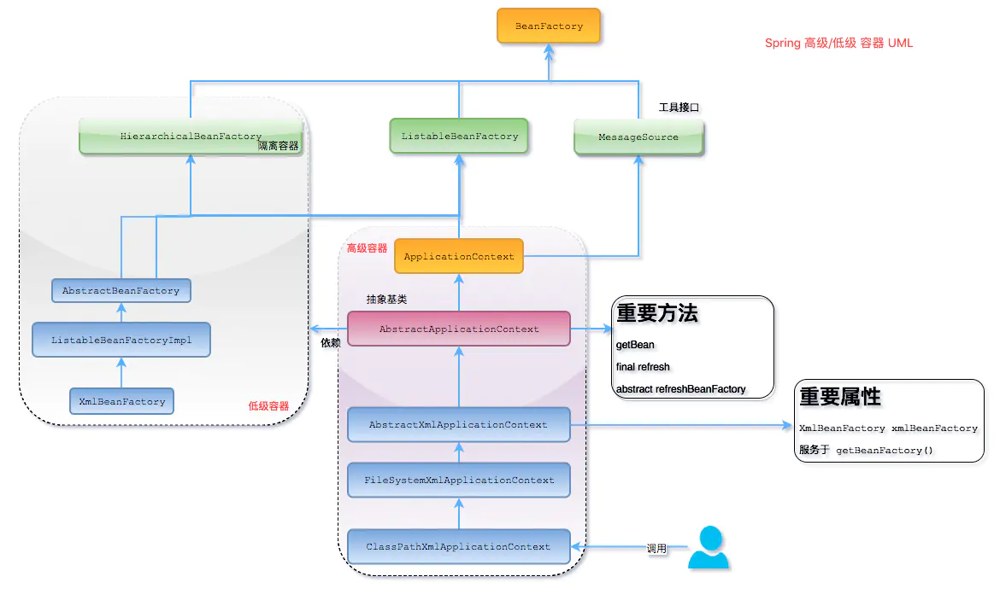
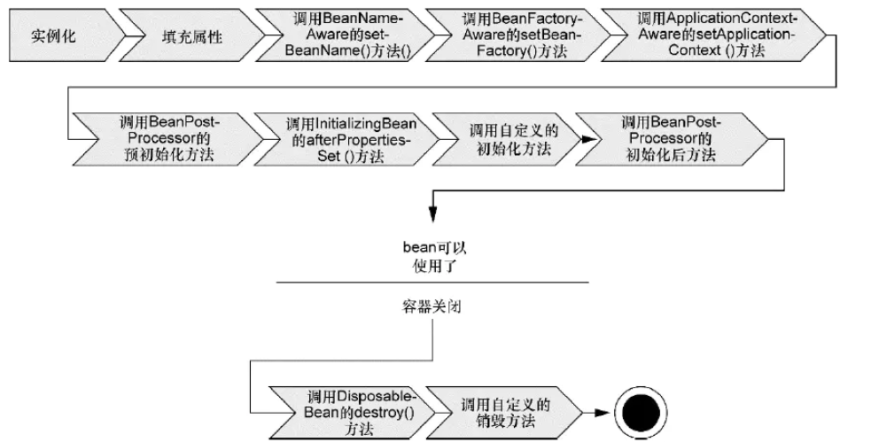

## 1、什么是Spring?

> Spring是一个轻量级Java开发框架，最早有Rod Johnson创建，目的是为了解决企业级应用开发的业务逻辑层和其他各层的耦合问题。它是一个分层的JavaSE/JavaEE full-stack（一站式）轻量级开源框架，为开发Java应用程序提供全面的基础架构支持。Spring负责基础架构，因此Java开发者可以专注于应用程序的开发。
> Spring最根本的使命是**解决企业级应用开发的复杂性，即简化Java开发**。
> Spring可以做很多事情，它为企业级开发提供给了丰富的功能，但是这些功能的底层都依赖于它的两个核心特性，也就是**依赖注入**（dependency injection，DI）和**面向切面编程**（aspectorientedprogramming，AOP）。

为了降低Java开发的复杂性，Spring采取了以下4种关键策略：

- 基于POJO的轻量级和最小侵入性编程；
- 通过依赖注入和面向接口实现松耦合；
- 基于切面和惯例进行声明式编程；
- 通过切面和模板减少样板式代码。


## 2、Spring的两大核心概念

### 1、IOC（控制反转）

> **控制反转，也叫依赖注入**，他就是不会直接创建对象，只是把对象声明出来，在代码 中不直接与对象和服务进行连接，但是在配置文件中描述了哪一项组件需要哪一项服 务，容器将他们组件起来。在一般的IOC场景中容器创建了所有的对象，并设置了必 要的属性将他们联系在一起，等到需要使用的时候才把他们声明出来，使用注解就跟 方便了，容器会自动根据注解把对象组合起来

### 2、AOP（面向切面编程）

> **面对切面编程**，这是一种编程模式，他允许程序员通过自定义的横切点进行模块化，将那些影响多个类的行为封装到可重用的模块中。 例子：比如日志输出，不使用AOP的话就需要把日志的输出语句放在所有类中，方法中，但是有了AOP就可以把日志输出语句封装一个可重用模块，在以声明的方式将他们放在类中，每次使用类就自动完成了日志输出。

## 3、Spring的优缺点是什么？

### 1、优点

> 方便解耦，简化开发
>
> - Spring就是一个大工厂，可以将所有对象的创建和依赖关系的维护，交给Spring管理。
>
> AOP编程的支持
>
> - Spring提供面向切面编程，可以方便的实现对程序进行权限拦截、运行监控等功能。
>
> 声明式事务的支持
>
> - 只需要通过配置就可以完成对事务的管理，而无需手动编程。
>
> 方便程序的测试
>
> - Spring对Junit4支持，可以通过注解方便的测试Spring程序。
>
> 方便集成各种优秀框架
>
> - Spring不排斥各种优秀的开源框架，其内部提供了对各种优秀框架的直接支持（如：Struts、Hibernate、MyBatis等）。
>
> 降低JavaEE API的使用难度
>
> - Spring对JavaEE开发中非常难用的一些API（JDBC、JavaMail、远程调用等），都提供了封装，使这些API应用难度大大降低。

### 2、缺点

> - Spring明明一个很轻量级的框架，却给人感觉大而全
> - Spring依赖反射，反射影响性能
> - 使用门槛升高，入门Spring需要较长时间

## 4、Spring由哪些模块组成？

> Spring 总共大约有 20 个模块， 由 1300 多个不同的文件构成。 而这些组件被分别整合在核心容器（Core Container） 、 AOP（Aspect Oriented Programming）和设备支持（Instrmentation） 、数据访问与集成（Data Access/Integeration） 、 Web 、 消息（Messaging） 、 Test 等 6 个模块中。



- Spring core：提供了框架的基本组成部分，包括控制反转（Inversion of Control，IOC）和依赖注入（Dependency Injection，DI）功能。
- spring beans：提供了BeanFactory，是工厂模式的一个经典实现，Spring将管理对象称为Bean。
- spring context：构建于 core 封装包基础上的 context 封装包，提供了一种框架式的对象访问方法。
- spring jdbc：提供了一个JDBC的抽象层，消除了烦琐的JDBC编码和数据库厂商特有的错误代码解析， 用于简化JDBC。
- spring aop：提供了面向切面的编程实现，让你可以自定义拦截器、切点等。
- spring Web：提供了针对 Web 开发的集成特性，例如文件上传，利用 servlet listeners 进行 ioc容器初始化和针对 Web 的 ApplicationContext。
- spring test：主要为测试提供支持的，支持使用JUnit或TestNG对Spring组件进行单元测试和集成测试。

## 5、Spring中用到了哪些设计模式？

> - **工厂模式**：BeanFactory就是简单工厂模式的体现，用来创建对象的实例
> - **单例模式**：Bean默认为单例模式
> - **代理模式**：Spring的AOP功能用到了JDK的动态代理和CGLIB字节码生成技术
> - **模板方法**：用来解决代码重复的问题。比如. RestTemplate, JmsTemplate, JpaTemplate
> - **观察者模式**：定义对象键一种一对多的依赖关系，当一个对象的状态发生改变时，所有依赖于它的对象都会得到通知被制动更新，如Spring中listener的实现–ApplicationListener。

## 6、讲解一下核心容器（spring context应用上下文) 模块

> - 这是基本的Spring模块，提供Spring框架的基础功能，BeanFactory 是 任何以spring为基础的应用的核心。Spring 框架建立在此模块之上，它使Spring成为一个容器。
> - Bean工厂是工厂模式的一个体现，提供了控制反转的功能，用来把应用的配置和依赖从真正的应用代码分离出来，最常用的就是org.springframework.beans.factory.xml.XmlBeanFactory ，它根据XML文件中的定义加载beans。该容器从XML 文件读取配置元数据并用它去创建一个完全配置的系统或应用。

## 7、Spring框架中有哪些不同类型的事件？

> 1. **上下文更新事件（ContextRefreshedEvent）**：在调用ConfigurableApplicationContext 接口中的refresh()方法时被触发。
> 2. **上下文开始事件（ContextStartedEvent）**：当容器调用ConfigurableApplicationContext的Start()方法开始/重新开始容器时触发该事件。
> 3. **上下文停止事件（ContextStoppedEvent）**：当容器调用ConfigurableApplicationContext的Stop()方法停止容器时触发该事件。
> 4. **上下文关闭事件（ContextClosedEvent）**：当ApplicationContext被关闭时触发该事件。容器被关闭时，其管理的所有单例Bean都被销毁。
> 5. **请求处理事件（RequestHandledEvent）**：在Web应用中，当一个http请求（request）结束触发该事件。如果一个bean实现了ApplicationListener接口，当一个ApplicationEvent 被发布以后，bean会自动被通知。

## 8、什么是Spring IOC容器？

> - **控制反转即IOC (Inversion of Control)**：它把传统上由程序代码直接操控的对象的调用权交给容器，通过容器来实现对象组件的装配和管理。所谓的“控制反转”概念就是对组件对象控制权的转移，从程序代码本身转移到了外部容器。
> - Spring IOC 负责创建对象，管理对象（通过依赖注入（DI），装配对象，配置对象，并且管理这些对象的整个生命周期。

## 9、控制反转（IOC）有什么用？

> - **管理对象的创建和依赖关系的维护**。对象的创建并不是一件简单的事，在对象关系比较复杂时，如果依赖关系需要我们来维护的话，那是相当头疼的
> - **解耦**，由Spring容器去维护具体的对象
> - 托管了类的产生过程，比如我们需要在类的产生过程中做一些处理，最直接的例子就是代理，如果有容器程序可以把这部分处理交给容器，应用程序则无需去关心类是如何完成代理的

## 10、IOC的优点有哪些？

> - IOC(依赖注入)把应用的代码量降到最低
> - 它使应用容易测试，单元测试不在需要单例和JNDI查找机制
> - 最小的代价和最小的侵入性使松散耦合得以实现
> - IOC容器支持加载服务时的饿汉式初始化和懒加载

## 11、Spring IOC的实现机制

> 工厂模式+反射机制

```java
interface Fruit {
    public abstract void eat();
}
class Apple implements Fruit {
    public void eat(){
        System.out.println("Apple");
    }
}
class Orange implements Fruit {
    public void eat(){
        System.out.println("Orange");
    }
}
class Factory {
    public static Fruit getInstance(String ClassName) {
        Fruit f=null;
        try {
            f=(Fruit)Class.forName(ClassName).newInstance();
        } catch (Exception e) {
            e.printStackTrace();
        }
        return f;
    }
}
class Client {
    public static void main(String[] a) {
        Fruit f=Factory.getInstance("io.github.dunwu.spring.Apple");
        if(f!=null){
            f.eat();
        }
    }
}
```

## 12、BeanFactory 和 ApplicationContext有什么区别？

`BeanFactory`和`ApplicationContext`是`Spring`的两大核心接口，都可以当做`Spring`的容器。其中`ApplicationContext`是`BeanFactory`的子接口。

| 不同     | BeanFactory                                                  | ApplicationContext                                           |
| -------- | ------------------------------------------------------------ | ------------------------------------------------------------ |
| 依赖关系 | 是Spring里面最底层的接口，包含了各种Bean的定义，读取bean配置文档，管理bean的加载、实例化，控制bean的生命周期，维护bean之间的依赖关系。 | 作为BeanFactory的派生，除了提供BeanFactory所具有的功能外，还提供了更完整的框架功能：<br/>继承MessageSource，因此支持国际化。<br/>统一的资源文件访问方式。<br/>提供在监听器中注册bean的事件。<br/>同时加载多个配置文件。<br/>载入多个（有继承关系）上下文 ，使得每一个上下文都专注于一个特定的层次，比如应用的web层。 |
| 加载方式 | 采用的是延迟加载形式来注入Bean的，即只有在使用到某个Bean时(调用getBean())，才对该Bean进行加载实例化。这样，我们就不能发现一些存在的Spring的配置问题。如果Bean的某一个属性没有注入，BeanFacotry加载后，直至第一次使用调用getBean方法才会抛出异常。 | 它是在容器启动时，一次性创建了所有的Bean。这样，在容器启动时，我们就可以发现Spring中存在的配置错误，这样有利于检查所依赖属性是否注入。ApplicationContext启动后预载入所有的单实例Bean，通过预载入单实例bean ,确保当你需要的时候，你就不用等待，因为它们已经创建好了。 |
| 创建方式 | 以编程的方式创建                                             | 以声明的形式创建；如使用`ContextLoader`                      |
| 注册方式 | 手动注册                                                     | 自动注册                                                     |

> **相对于基本的BeanFactory，ApplicationContext 唯一的不足是占用内存空间。当应用程序配置Bean较多时，程序启动较慢。**

## 13、Spring 如何设计容器的，BeanFactory和ApplicationContext的关系详解

> Spring 作者 Rod Johnson 设计了两个接口用以表示容器。
>
> - `BeanFactory`
    >   - BeanFactory 简单粗暴，可以理解为就是个 HashMap，Key 是 BeanName，Value 是 Bean 实例。通常只提供注册（put），获取（get）这两个功能。我们可以称之为 “低级容器”。
> - `ApplicationContext`
    >   - ApplicationContext 可以称之为 “高级容器”。因为他比 BeanFactory 多了更多的功能。他继承了多个接口。因此具备了更多的功能。例如资源的获取，支持多种消息（例如 JSP tag 的支持），对BeanFactory 多了工具级别的支持等待。所以你看他的名字，已经不是 BeanFactory 之类的工厂了，而是 “应用上下文”， 代表着整个大容器的所有功能。该接口定义了一个 refresh 方法，此方法是所有阅读 Spring 源码的人的最熟悉的方法，用于刷新整个容器，即重新加载/刷新所有的bean。



1. 最上面的是 BeanFactory，下面的 3 个绿色的，都是功能扩展接口
2. 看下面的隶属 ApplicationContext 粉红色的 “高级容器”，依赖着 “低级容器”，这里说的是依赖，不是继承哦。他依赖着 “低级容器” 的 getBean 功能。而高级容器有更多的功能：支持不同的信息源头，可以访问文件资源，支持应用事件（Observer 模式）
3. 通常用户看到的就是 “高级容器”。 但 BeanFactory 也非常够用啦
4. 左边灰色区域的是 “低级容器”， 只负载加载 Bean，获取 Bean。容器其他的高级功能是没有的。例如上图画的 refresh 刷新 Bean 工厂所有配置，生命周期事件回调等

**总结**：

IOC在Spring里，只需要低级容器（Spring 低级容器（BeanFactory）的 IOC）就可以实现

- 加载配置文件，解析成 BeanDefinition 放在 Map 里
- 调用 getBean 的时候，从 BeanDefinition 所属的 Map 里，拿出 Class 对象进行实例化，同时，如果有依赖关系，将递归调用 getBean 方法 —— 完成依赖注入

## 14、ApplicationContext通常的实现是什么？

> - **FileSystemXmlApplicationContext** ：此容器从一个XML文件中加载beans的定义，XML Bean配置文件的全路径名必须提供给它的构造函数
    >
    >   ```java
>   ApplicationContext context = new FileSystemXmlApplicationContext(“bean.xml”);
>   ```
>
> - **ClassPathXmlApplicationContext**：从classpath的XML配置文件中读取上下文，并生成上下文定义。应用程序上下文从程序环境变量中
    >
    >   ```java
>   ApplicationContext context = new ClassPathXmlApplicationContext(“bean.xml”);
>   ```
>
> - **WebXmlApplicationContext**：由Web应用的XML文件读取上下文。

## 15、什么是Spring的依赖注入？

> 控制反转IOC是一个很大的概念，可以用不同的方式来实现。其主要实现方式有两种：依赖注入和依赖查找依赖注入；
>
> **依赖注入（Dependency Injection**），即组件之间的依赖关系由容器在应用系统运行期来决定，也就是由容器动态地将某种依赖关系的目标对象实例注入到应用系统中的各个关联的组件之中。组件不做定位查询，只提供普通的Java方法让容器去决定依赖关系。

## 16、依赖注入的基本原则

> 应用组件不应该负责查找资源或者其他依赖的协作对象。
>
> 配置对象的工作应该由IOC容器负责，“查找资源”的逻辑应该从应用组件的代码中抽取出来，交给IOC容器负责。
>
> 容器全权负责组件的装配，它会把符合依赖关系的对象通过属性（JavaBean中的setter）或者是构造器传递给需要的对象。

## 17、依赖注入有什么优势？

> 依赖注入之所以更流行是因为它是一种更可取的方式：让容器全权负责依赖查询，受管组件只需要暴露JavaBean的setter方法或者带参数的构造器或者接口，使容器可以在初始化时组装对象的依赖关系。其与依赖查找方式相比，主要优势为：
>
> - 查找定位操作与应用代码完全无关。
> - 不依赖于容器的API，可以很容易地在任何容器以外使用应用对象。
> - 不需要特殊的接口，绝大多数对象可以做到完全不必依赖容器。

## 18、依赖注入有几种实现方式？

> 依赖注入是时下最流行的IOC实现方式，依赖注入分为接口注入（Interface Injection），Setter方法注入（Setter Injection）和构造器注入（Constructor Injection）三种方式。其中接口注入由于在灵活性和易用性比较差，现在从Spring4开始已被废弃。
>
> - **构造器依赖注入**：构造器依赖注入通过容器触发一个类的构造器来实现的，该类有一系列参数，每个参数代表一个对其他类的依赖。
> - **Setter方法注入**：Setter方法注入是容器通过调用无参构造器或无参static工厂 方法实例化bean之后，调用该bean的setter方法，即实现了基于setter的依赖注入。

## 19、构造器依赖注入和 Setter方法注入的区别？

| 构造器注入                 | Setter方法注入               |
| -------------------------- | ---------------------------- |
| 没有部分注入               | 有部分注入                   |
| 不会覆盖 setter 属性       | 会覆盖 setter 属性           |
| 任意修改都会创建一个新实例 | 任意修改都不会创建一个新实例 |
| 适用于设置很多属性         | 适用于设置少量属性           |

> 两种依赖方式都可以使用，构造器注入和Setter方法注入。最好的解决方案是用构造器参数实现强制依赖，setter方法实现可选依赖。

## 20、什么是Spring Bean?

> Spring beans 是那些形成Spring应用的主干的java对象。它们被Spring IOC容器初始化，装配，和管理。这些beans通过容器中配置的元数据创建。比如，以XML文件中 的形式定义

## 21、如何给Spring 容器提供配置元数据？Spring有几种配置方式

> - XML配置文件
> - 基于注解的配置
> - 基于Java的配置

## 22、Spring基于xml注入bean的几种方式

> 1. Setter方法注入
> 2. 构造器注入
> 3. 通过index设置参数的位置
> 4. 通过Type设置参数的类型
> 5. 静态工厂注入
> 6. 实例工厂

## 23、Spring支持的几种bean的作用域

| 作用域         | 描述                                                         |
| -------------- | ------------------------------------------------------------ |
| singleton      | （默认）将单个 bean 定义范围限定为每个 Spring IoC 容器的单个对象实例。 |
| prototype      | 一个bean的定义可以有多个实例                                 |
| request        | 每次http请求都会创建一个bean，该作用域仅在基于web的Spring ApplicationContext情形下有效 |
| session        | 在一个HTTP Session中，一个bean定义对应一个实例。该作用域仅在基于web的Spring ApplicationContext情形下有效 |
| global-session | 在一个全局的HTTP Session中，一个bean定义对应一个实例。该作用域仅在基于web的Spring ApplicationContext情形下有效 |
| application    | 将单个 bean 定义范围限定为`ServletContext`. 仅在 web-aware Spring 的上下文中有效`ApplicationContext` |
| webSocket      | 将单个 bean 定义范围限定为`WebSocket`. 仅在 web-aware Spring 的上下文中有效`ApplicationContext` |

> ==注意==： 缺省的Spring bean 的作用域是Singleton。使用 prototype 作用域需要慎重的思考，因为频繁创建和销毁 bean 会带来很大的性能开销。

## 24、Spring框架中的单例bean是线程安全的吗？

> 不是。spring 中的 bean 默认是单例模式，spring 框架并没有对单例 bean 进行多线程的封装处理。
>
> 实际上大部分时候 spring bean 无状态的（比如 dao 类），所有某种程度上来说 bean 也是安全的，但如果 bean 有状态的话（比如 view model 对象），那就要开发者自己去保证线程安全了，最简单的就是改变 bean 的作用域，把“singleton”变更为“prototype”，这样请求 bean 相当于new Bean()了，所以就可以保证线程安全了。
>
> - 有状态就是有数据存储功能。
> - 无状态就是不会保存数据。

## 25、Spring如何处理线程并发问题？

> 1. 在一般情况下，只有无状态的Bean才可以在多线程环境下共享，在Spring中，绝大部分Bean都可以声明为singleton作用域，因为Spring对一些Bean中非线程安全状态采用**ThreadLocal**进行处理，解决线程安全问题
> 2. ThreadLocal和线程同步机制都是为了解决多线程中相同变量的访问冲突问题。同步机制采用了“时间换空间”的方式，仅提供一份变量，不同的线程在访问前需要获取锁，没获得锁的线程则需要排队。而ThreadLocal采用了“空间换时间”的方式。
> 3. ThreadLocal会为每一个线程提供一个独立的变量副本，从而隔离了多个线程对数据的访问冲突。因为每一个线程都拥有自己的变量副本，从而也就没有必要对该变量进行同步了。ThreadLocal提供了线程安全的共享对象，在编写多线程代码时，可以把不安全的变量封装进ThreadLocal。

## 26、Spring Bean的生命周期

> 在传统的Java应用中，bean的生命周期很简单。使用Java关键字new进行bean实例化，然后该bean就可以使用了。一旦该bean不再被使用，则由Java自动进行垃圾回收。相比之下，Spring容器中的bean的生命周期就显得相对复杂多了



1. Spring对Bean进行实例化
2. Spring将值和bean的引用注入到Bean对应的属性中
3. 如果bean实现了BeanNameAware接口，Spring将bean的ID传递给setBean-Name()方法；
4. 如果bean实现了BeanFactoryAware接口，Spring将调用setBeanFactory()方法，将BeanFactory容器实例传入；
5. 如果bean实现了ApplicationContextAware接口，Spring将调用setApplicationContext()方法，将bean所在的应用上下文的引用传入进来；
6. 如果bean实现了BeanPostProcessor接口，Spring将调用它们的post-ProcessBeforeInitialization()方法；
7. 如果bean实现了InitializingBean接口，Spring将调用它们的after-PropertiesSet()方法。类似地，如果bean使用initmethod声明了初始化方法，该方法也会被调用；
8. 如果bean实现了BeanPostProcessor接口，Spring将调用它们的post-ProcessAfterInitialization()方法；
9. 此时，bean已经准备就绪，可以被应用程序使用了，它们将一直驻留在应用上下文中，直到该应用上下文被销毁；
10. 如果bean实现了DisposableBean接口，Spring将调用它的destroy()接口方法。同样，如果bean使用destroy-method声明了销毁方法，该方法也会被调用。

## 27、什么是Spring的内部bean？什么是Spring inner beans？

> 在Spring框架中，当一个bean仅被用作另一个bean的属性时，它能被声明为一个内部bean。内部bean可以用setter注入“属性”和构造方法注入“构造参数”的方式来实现，内部bean通常是匿名的，它们的Scope一般是prototype。

## 28、什么是bean的自动装配？

> **装配**：在Spring 容器中把bean组装到一起，前提是容器需要知道bean的依赖关系，如何通过依赖注入来把它们装配到一起。
>
> **自动装配**：在Spring框架中，在配置文件中设定bean的依赖关系是一个很好的机制，Spring 容器能够自动装配相互合作的bean，这意味着容器不需要和配置，能通过Bean工厂自动处理bean之间的协作。这意味着 Spring可以通过向Bean Factory中注入的方式自动搞定bean之间的依赖关系。自动装配可以设置在每个bean上，也可以设定在特定的bean上。

## 29、解释不同方式的自动装配，spring 自动装配 bean 有哪些方式？

> 在spring中，对象无需自己查找或创建与其关联的其他对象，由容器负责把需要相互协作的对象引用赋予各个对象，使用autowire来配置自动装载模式。
>
> 在Spring框架xml配置中共有5种自动装配：
>
> - no：默认的方式是不进行自动装配的，通过手工设置ref属性来进行装配bean。
> - byName：通过bean的名称进行自动装配，如果一个bean的 property 与另一bean 的name 相同，就进行自动装配。
> - byType：通过参数的数据类型进行自动装配。
> - constructor：利用构造函数进行装配，并且构造函数的参数通过byType进行装配。
> - autodetect：自动探测，如果有构造方法，通过 construct的方式自动装配，否则使用byType的方式自动装配。

## 30、使用@Autowired注解自动装配的过程是怎样的？

> 使用@Autowired注解来自动装配指定的bean。在使用@Autowired注解之前需要在Spring配置文件进行配置
>
> ```xml
> <context:annotation-config />
> ```
>
> 1. 在启动spring IOC时，容器自动装载了一个AutowiredAnnotationBeanPostProcessor后置处理器，当容器扫描到@Autowied、@Resource或@Inject时，就会在IOC容器自动查找需要的bean，并装配给该对象的属性
> 2. 在使用@Autowired时，首先在容器中查询对应类型的bean：
     >    - 如果查询结果刚好为一个，就将该bean装配给@Autowired指定的数据；
>    - 如果查询的结果不止一个，那么@Autowired会根据名称来查找；
>    - 如果上述查找的结果为空，那么会抛出异常。解决方法时，使用required=false。

## 31、自动装配有哪些局限性？

> - 重写：需要用配置来定义依赖，意味着总要重写自动装配
> - 基本数据类型：不能自动装配简单的属性，如基本数据类型，String字符串和类
> - 模糊特性：自动装配不如显示装配精确，如果有可能，建议使用显示装配

## 32、可以在Spring中注入一个null 和一个空字符串吗？

> 可以

## 33、什么是基于Java的Spring注解配置？

> 基于Java的配置，允许你在少量的Java注解的帮助下，进行你的大部分Spring配置而非通过XML文件。
>
> 以@Configuration 注解为例，它用来标记类可以当做一个bean的定义，被Spring IOC容器使用。
>
> 另一个例子是@Bean注解，它表示此方法将要返回一个对象，作为一个bean注册进Spring应用上下文

```JAVA
@Configuration
public class StudentConfig {
    @Bean
    public StudentBean myStudent() {
        return new StudentBean();
    }
}
```

## 34、@Component, @Controller, @Repository, @Service 有何区别？

> - @Component：这将 java 类标记为 bean。它是任何 Spring 管理组件的通用构造型。spring 的组件扫描机制现在可以将其拾取并将其拉入应用程序环境中。
> - @Controller：这将一个类标记为 Spring Web MVC 控制器。标有它的 Bean 会自动导入到 IOC 容器中。
> - @Service：此注解是组件注解的特化。它不会对 @Component 注解提供任何其他行为。您可以在服务层类中使用 @Service 而不是 @Component，因为它以更好的方式指定了意图。
> - @Repository：这个注解是具有类似用途和功能的 @Component 注解的特化。它为 DAO 提供了额外的好处。它将 DAO 导入 IOC 容器，并使未经检查的异常有资格转换为 SpringDataAccessException。

## 35、@Autowired 注解有什么作用？

> @Autowired默认是按照类型装配注入的，默认情况下它要求依赖对象必须存在（可以设置它required属性为false）。@Autowired 注解提供了更细粒度的控制，包括在何处以及如何完成自动装配。它的用法和@Required一样，修饰setter方法、构造器、属性或者具有任意名称和/或多个参数的PN方法。

```java
public class Employee {
    private String name;
    @Autowired
    public void setName(String name) {
        this.name=name;
    }
    public string getName(){
        return name;
    }
}
```

## 36、@Autowired和@Resource之间的区别

> @Autowired和@Resource可用于：构造函数、成员变量、Setter方法
>
> @Autowired和@Resource之间的区：
>
> - @Autowired默认是按照**类型**装配注入的，默认情况下它要求依赖对象必须存在（可以设置它required属性为false）。
> - @Resource默认是按照**名称**来装配注入的，只有当找不到与名称匹配的bean才会按照类型来装配注入。

## 37、@Qualifier 注解有什么作用

> 当您创建多个相同类型的 bean 并希望仅使用属性装配其中一个 bean 时，您可以使用@Qualifier注解和 @Autowired 通过指定应该装配哪个确切的 bean 来消除歧义

## 38、Spring支持的事务管理类型， spring 事务实现方式有哪些？

> - **编程式事务管理**：通过编程的方式管理事务，给你带来极大的灵活性，但是难维护。
> - **声明式事务管理**：可以将业务代码和事务管理分离，你只需用注解和XML配置来管理事务。

## 39、Spring事务的实现方式和实现原理

> Spring事务的本质其实就是数据库对事务的支持，没有数据库的事务支持，spring是无法提供事务功能的。真正的数据库层的事务提交和回滚是通过binlog或者redo log实现的。

## 40、Spring的事务传播行为

spring事务的传播行为说的是，当多个事务同时存在的时候，spring如何处理这些事务的行为。

> 1. PROPAGATION_REQUIRED：如果当前没有事务，就创建一个新事务，如果当前存在事务，就加入该事务，该设置是最常用的设置。
> 2. PROPAGATION_SUPPORTS：支持当前事务，如果当前存在事务，就加入该事务，如果当前不存在事务，就以非事务执行。
> 3. PROPAGATION_MANDATORY：支持当前事务，如果当前存在事务，就加入该事务，如果当前不存在事务，就抛出异常。
> 4. PROPAGATION_REQUIRES_NEW：创建新事务，无论当前存不存在事务，都创建新事务。
> 5. PROPAGATION_NOT_SUPPORTED：以非事务方式执行操作，如果当前存在事务，就把当前事务挂起。
> 6. PROPAGATION_NEVER：以非事务方式执行，如果当前存在事务，则抛出异常。
> 7. PROPAGATION_NESTED：如果当前存在事务，则在嵌套事务内执行。如果当前没有事务，则按REQUIRED属性执行。

## 41、spring 的事务隔离？

> spring 有五大隔离级别，默认值为 ISOLATION_DEFAULT（使用数据库的设置），其他四个隔离级别和数据库的隔离级别一致：
>
> - ISOLATION_DEFAULT：用底层数据库的设置隔离级别，数据库设置的是什么我就用什么；
> - ISOLATION_READ_UNCOMMITTED：未提交读，最低隔离级别、事务未提交前，就可被其他事务读取（会出现幻读、脏读、不可重复读）；
> - ISOLATION_READ_COMMITTED：提交读，一个事务提交后才能被其他事务读取到（会造成幻读、不可重复读），SQL server 的默认级别；
> - ISOLATION_REPEATABLE_READ：可重复读，保证多次读取同一个数据时，其值都和事务开始时候的内容是一致，禁止读取到别的事务未提交的数据（会造成幻读），MySQL 的默认级别；
> - ISOLATION_SERIALIZABLE：序列化，代价最高最可靠的隔离级别，该隔离级别能防止脏读、不可重复读、幻读。

**脏读** ：表示一个事务能够读取另一个事务中还未提交的数据。比如，某个事务尝试插入记录 A，此时该事务还未提交，然后另一个事务尝试读取到了记录 A。

**不可重复读** ：是指在一个事务内，多次读同一数据。

**幻读** ：指同一个事务内多次查询返回的结果集不一样。比如同一个事务 A 第一次查询时候有 n 条记录，但是第二次同等条件下查询却有 n+1 条记录，这就好像产生了幻觉。发生幻读的原因也是另外一个事务新增或者删除或者修改了第一个事务结果集里面的数据，同一个记录的数据内容被修改了，所有数据行的记录就变多或者变少了。

## 42、Spring框架的事务管理有哪些优点？

> - 为不同的事务API 如 JTA，JDBC，Hibernate，JPA 和JDO，提供一个不变的编程模式。
> - 为编程式事务管理提供了一套简单的API而不是一些复杂的事务API
> - 支持声明式事务管理。
> - 和Spring各种数据访问抽象层很好得集成。

## 43、你更倾向用那种事务管理类型？

> 大多数Spring框架的用户选择声明式事务管理，因为它对应用代码的影响最小，因此更符合一个无侵入的轻量级容器的思想。声明式事务管理要优于编程式事务管理，虽然比编程式事务管理（这种方式允许你通过代码控制事务）少了一点灵活性。唯一不足地方是，最细粒度只能作用到方法级别，无法做到像编程式事务那样可以作用到代码块级别。

## 44、什么是AOP?

> **OOP(Object-Oriented Programming)面向对象编程**，允许开发者定义纵向的关系，但并适用于定义横向的关系，导致了大量代码的重复，而不利于各个模块的重用。
>
> **AOP(Aspect-Oriented Programming)，一般称为面向切面编程**，作为面向对象的一种补充，用于将那些与业务无关，但却对多个对象产生影响的公共行为和逻辑，抽取并封装为一个可重用的模块，这个模块被命名为“切面”（Aspect），减少系统中的重复代码，降低了模块间的耦合度，同时提高了系统的可维护性。可用于权限认证、日志、事务处理等。

## 45、Spring AOP and AspectJ AOP 有什么区别？AOP 有哪些实现方式？

> AOP实现的关键在于**代理模式**，AOP代理主要分为静态代理和动态代理。**静态代理的代表为AspectJ**；**动态代理则以Spring AOP为代表。**
>
> - AspectJ是静态代理的增强，所谓静态代理，就是AOP框架会在编译阶段生成AOP代理类，因此也称为编译时增强，它会在编译阶段将AspectJ(切面)织入到Java字节码中，运行的时候就是增强之后的AOP对象。
> - Spring AOP使用的动态代理，所谓的动态代理就是说AOP框架不会去修改字节码，而是每次运行时在内存中临时为方法生成一个AOP对象，这个AOP对象包含了目标对象的全部方法，并且在特定的切点做了增强处理，并回调原对象的方法。

## 46、JDK动态代理和CGLIB动态代理的区别？

> - JDK动态代理只提供接口的代理，不支持类的代理。核心InvocationHandler接口和Proxy类，InvocationHandler 通过invoke()方法反射来调用目标类中的代码，动态地将横切逻辑和业务编织在一起；接着，Proxy利用 InvocationHandler动态创建一个符合某一接口的的实例, 生成目标类的代理对象。
> - 如果代理类没有实现 InvocationHandler 接口，那么Spring AOP会选择使用CGLIB来动态代理目标类。CGLIB（Code Generation Library），是一个代码生成的类库，可以在运行时动态的生成指定类的一个子类对象，并覆盖其中特定方法并添加增强代码，从而实现AOP。CGLIB是通过继承的方式做的动态代理，因此如果某个类被标记为final，那么它是无法使用CGLIB做动态代理的。

静态代理与动态代理区别在于生成AOP代理对象的时机不同，相对来说AspectJ的静态代理方式具有更好的性能，但是AspectJ需要特定的编译器进行处理，而Spring AOP则无需特定的编译器处理。

> InvocationHandler 的 invoke(Object proxy,Method method,Object[] args)：proxy是最终生成的代理实例; method 是被代理目标实例的某个具体方法; args 是被代理目标实例某个方法的具体入参, 在方法反射调用时使用。

## 47、Spring AOP里面的几个名词

| 名词                      | 描述                                                         |
| ------------------------- | ------------------------------------------------------------ |
| 切面（Aspect）            | 切面是通知和切点的结合。通知和切点共同定义了切面的全部内容。 在Spring AOP中，切面可以使用通用类（基于模式的风格） 或者在普通类中以 @AspectJ 注解来实现。 |
| 连接点（Join point）      | 指方法，在Spring AOP中，一个连接点 总是 代表一个方法的执行。应用可能有数以千计的时机应用通知。这些时机被称为连接点。连接点是在应用执行过程中能够插入切面的一个点。这个点可以是调用方法时、抛出异常时、甚至修改一个字段时。切面代码可以利用这些点插入到应用的正常流程之中，并添加新的行为。 |
| 通知（Advice）            | 在AOP术语中，切面的工作被称为通知。                          |
| 切入点（Pointcut）        | 切点的定义会匹配通知所要织入的一个或多个连接点。我们通常使用明确的类和方法名称，或是利用正则表达式定义所匹配的类和方法名称来指定这些切点。 |
| 引入（Introduction）      | 引入允许我们向现有类添加新方法或属性。                       |
| 目标对象（Target Object） | 被一个或者多个切面（aspect）所通知（advise）的对象。它通常是一个代理对象。也有人把它叫做 被通知（adviced） 对象。 既然Spring AOP是通过运行时代理实现的，这个对象永远是一个 被代理（proxied） 对象 |
| 织入（Weaving）           | 织入是把切面应用到目标对象并创建新的代理对象的过程。在目标对象的生命周期里有多少个点可以进行织入**编译期**：切面在目标类编译时被织入。AspectJ的织入编译器是以这种方式织入切面的。<br/>**类加载期**：切面在目标类加载到JVM时被织入。需要特殊的类加载器，它可以在目标类被引入应用之前增强该目标类的字节码。AspectJ5的加载时织入就支持以这种方式织入切面。<br/>运行期：切面在应用运行的某个时刻被织入。一般情况下，在织入切面时，AOP容器会为目标对象动态地创建一个代理对象。SpringAOP就是以这种方式织入切面。 |

## 48、Spring在运行时通知对象

> 通过在代理类中包裹切面，Spring在运行期把切面织入到Spring管理的bean中。代理封装了目标类，并拦截被通知方法的调用，再把调用转发给真正的目标bean。当代理拦截到方法调用时，在调用目标bean方法之前，会执行切面逻辑。
>
> 直到应用需要被代理的bean时，Spring才创建代理对象。如果使用的是ApplicationContext的话，在ApplicationContext从BeanFactory中加载所有bean的时候，Spring才会创建被代理的对象。因为Spring运行时才创建代理对象，所以我们不需要特殊的编译器来织入SpringAOP的切面。

## 49、Spring只支持方法级别的连接点？

> 因为Spring基于动态代理，所以Spring只支持方法连接点。Spring缺少对字段连接点的支持，而且它不支持构造器连接点。方法之外的连接点拦截功能，我们可以利用Aspect来补充。

## 50、在Spring AOP 中，关注点和横切关注的区别是什么？在 springaop 中 concern 和 cross-cutting concern 的不同之处？

> **关注点（concern）**是应用中一个模块的行为，一个关注点可能会被定义成一个我们想实现的一个功能。
> **横切关注点（cross-cutting concern）**是一个关注点，此关注点是整个应用都会使用的功能，并影响整个应用，比如日志，安全和数据传输，几乎应用的每个模块都需要的功能。因此这些都属于横切关注点。

## 51、Spring通知有哪些类型？

> 1. 前置通知（Before）：在目标方法被调用之前调用通知功能；
> 2. 后置通知（After）：在目标方法完成之后调用通知，此时不会关心方法的输出是什么；
> 3. 返回通知（After-returning ）：在目标方法成功执行之后调用通知；
> 4. 异常通知（After-throwing）：在目标方法抛出异常后调用通知；
> 5. 环绕通知（Around）：通知包裹了被通知的方法，在被通知的方法调用之前和调用之后执行自定义的行为。

## 52、什么是切面 Aspect？

> aspect 由 pointcount 和 advice 组成，切面是通知和切点的结合。 它既包含了横切逻辑的定义,也包括了连接点的定义. Spring AOP 就是负责实施切面的框架, 它将切面所定义的横切逻辑编织到切面所指定的连接点中. AOP 的工作重心在于如何将增强编织目标对象的连接点上, 这里包含两个工作:
>
> - 如何通过 pointcut 和 advice 定位到特定的 joinpoint 上
> - 如何在 advice 中编写切面代码.
>
> 可以简单地认为, 使用 @Aspect 注解的类就是切面.
