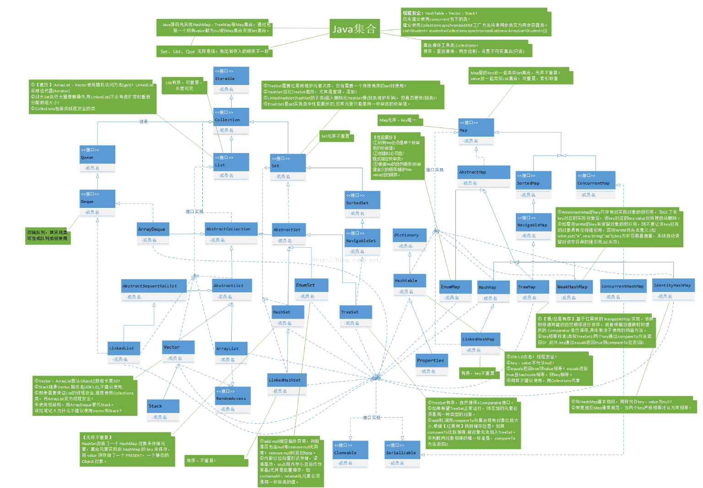
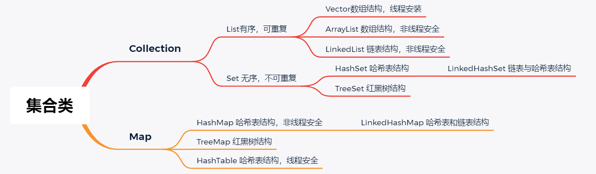
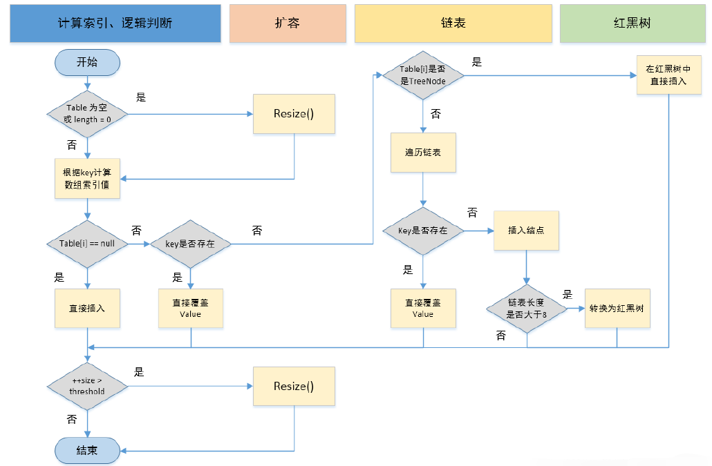

## 1、什么是集合？



> - 集合就是一个放数据的容器，准确的说是放数据对象引用的容器
> - 集合类存放的都是对象的引用，而不是对象的本身
> - 集合类型主要有3种：set(集）、list(列表）和map(映射)。
>
> 集合的特点主要有如下两点：
>
> - 集合用于存储对象的容器，对象是用来封装数据，对象多了也需要存储集中式管理。
>
> - 和数组对比对象的大小不确定。因为集合是可变长度的。数组需要提前定义大小

## 2、常用的集合类有哪些？



**Collection**集合主要有**List**和**Set**两大接口：

- **List**：一个有序（元素存入集合的顺序和取出的顺序一致）容器，元素可以重复，可以插入多个null元素，元素都有索引。常用的实现类有 ArrayList、LinkedList 和 Vector。
- **Set**：一个无序（存入和取出顺序有可能不一致）容器，不可以存储重复元素，只允许存入一个null元素，必须保证元素唯一性。Set 接口常用实现类是 HashSet、LinkedHashSet 以及TreeSet。

**Map**是一个键值对集合，存储键、值和之间的映射。 Key无序，唯一；value 不要求有序，允许重复。Map没有继承于Collection接口，从Map集合中检索元素时，只要给出键对象，就会返回对应的值对象。

- Map 的常用实现类：HashMap、TreeMap、HashTable、LinkedHashMap、ConcurrentHashMap

## 3、快速失败(fail-fast)和安全失败(fail-safe)的区别是什么？

> **Iterator 的安全失败是基于对底层集合做拷贝**，因此，它不受源集合上修改的影响。java.util包下面的所有的集合类都是快速失败的，而 java.util.concurrent 包下面的所有的类都是安全失败的。快速失败的迭代器会抛出 ConcurrentModificationException 异常，而安全失败的迭代器永远不会抛出这样的异常。

## 4、迭代器Iterator是什么？

> Iterator 接口提供遍历任何 Collection 的接口。我们可以从一个 Collection 中使用迭代器方法来获取迭代器实例。迭代器取代了 Java 集合框架中的 Enumeration，迭代器允许调用者在迭代过程中移除元素。
>
> ```java
> public interface Collection<E> extends Iterable<E> {
>  ......
> }
> ```

## 5、Iterator怎么使用？有什么特点？

> 使用：
>
> ```java
> List<String> list = new ArrayList<>(); 
> Iterator<String> it = list.iterator(); 
> while(it.hasNext()){
>  String obj = it.next(); 
>  System.out.println(obj); 
> }
> ```
>
> Iterator 的特点是只能**单向遍历**，但是更加安全，因为它可以确保，在当前遍历的集合元素被更改的时候，就会抛出 ConcurrentModifificationException 异常。

## 6、如何边遍历边移除Collection中的元素？

> 边遍历边修改 Collection 的唯一正确方式是使用 Iterator.remove() 方法
>
> ```java
> Iterator<Integer> it = list.iterator(); 
> while(it.hasNext()){ 
>  *// do something* it.remove(); 
> }
> ```
>
> **常见错误代码**：用for循环进行移除
>
> ```java
> for(Integer i : list){ 
>  list.remove(i) 
> }
> ```
>
> 解析：运行以上错误代码会报 **ConcurrentModifificationException** **异常**。这是因为当使用foreach(for(Integer i : list)) 语句时，会自动生成一个iterator 来遍历该 list，但同时该 list 正在被Iterator.remove() 修改。Java 一般不允许一个线程在遍历 Collection 时另一个线程修改它。

## 7、 Iterator和ListIterator有什么区别？

> - Iterator 可以遍历 Set 和 List 集合，而 ListIterator 只能遍历 List。
>
> - Iterator 只能单向遍历，而 ListIterator 可以双向遍历（向前/后遍历）。
>
> - ListIterator 实现 Iterator 接口，然后添加了一些额外的功能，比如添加一个元素、替换一个元素、获取前面或后面元素的索引位置。

## 8、 遍历一个List有哪些不同的方式？每种方法的实现原理是什么？Java中List遍历的最佳实践是什么？

**遍历方式以及原理**：

> 1. **for循环**：基于计数器。在集合外部维护一个计数器，然后依次读取每一个位置的元素，当读取到最后一个元素后停止。
> 2. **迭代器遍历**：Iterator 是面向对象的一个设计模式，目的是屏蔽不同数据集合的特点，统一遍历集合的接口。Java 在 Collections 中支持了 Iterator 模式。
> 3. **foreach 循环**：foreach 内部也是采用了 Iterator 的方式实现，使用时不需要显式声明Iterator 或计数器。优点是代码简洁，不易出错；缺点是只能做简单的遍历，不能在遍历过程中操作数据集合，例如删除、替换。

**最佳实践方式**：

> Java Collections 框架中提供了一个 RandomAccess 接口，用来标记 List 实现是否支持 Random Access。
>
> - 如果一个数据集合实现了该接口，就意味着它支持 Random Access，按位置读取元素的平均时间复杂度为 O(1)，如ArrayList。
> - 如果没有实现该接口，表示不支持 Random Access，如LinkedList。
>
> 推荐的做法：**支持 Random Access 的列表可用 for 循环遍历，否则建议用 Iterator 或foreach 遍历。**

## 9、 ArrayList的优缺点？

> **优点**：
>
> - ArrayList 底层以数组实现，是一种随机访问模式。ArrayList 实现了 RandomAccess 接口，因此查找的时候非常快。
> - ArrayList 在顺序添加一个元素的时候非常方便。
>
> **缺点**：
>
> - 删除元素的时候，需要做一次元素复制操作。如果要复制的元素很多，那么就会比较耗费性能。
> - 插入元素的时候，也需要做一次元素复制操作，缺点同上。
>
> **ArrayList 比较适合顺序添加、随机访问的场景。**

## 10、 List 的三个子类的特点？

> **ArrayList**：底层结构是数组，非线程安全，底层查询快，增删慢。
>
> **LinkedList**：底层结构是链表型的，非线程安全，增删快，查询慢。
>
> **vector**：底层结构是数组，线程安全的，增删慢，查询慢。

## 11、如何实现数组和List之间的转换？

> - 数组转List：使用Arrays.asList(array)进行转换
>
> - List转数组：使用List自带的toArray()方法
    >
    >   ```java
    >   // list to array
    >   List<String> list = new ArrayList<String>();
    >   list.add("123");
    >   list.add("456");
    >   list.toArray();
    >
    >   // array to list
    >   String[] array = new String[]{"123","456"};
    >   Arrays.asList(array);
    >   ```

## 12、Java 中 ArrayList 和 Linkedlist 区别？

> ArrayList 和 Vector 使用了数组的实现，可以认为 ArrayList 或者 Vector 封装了对内部数组的操作，比如向数组中添加，删除，插入新的元素或者数据的扩展和重定向。
>
> ArrayList 是基于索引的数据接口，它的底层是数组。它可以以 **O(1)**时间复杂度对元素进行**随机访问**。与此对应，LinkedList 是以元素列表的形式存储它的数据，每一个元素都和它的前一个和后一个元素链接在一起，在这种情况下，查找某个元素的时间复杂度是 **O(n)**。
>
> 相对于 ArrayList，LinkedList 的插入，添加，删除操作速度更快，因为当元素被添加到集合任意位置的时候，不需要像数组那样重新计算大小或者是更新索引。LinkedList 比 ArrayList 更占内存，因为 LinkedList 为每一个节点存储了两个引用，一个指向前
>
> 一个元素，一个指向下一个元素。

## 13、List a=new ArrayList()和 ArrayList a =new ArrayList()的区别？

> ```java
> List list = new ArrayList();
> ```
>
> 这句话创建了一个ArrayList的对象，然后上溯到了List，此时list已经是List对象了，有些ArrayList有的属性和方法，而List没有的属性和方法，list就不能再使用了。
>
> ```java
> ArrayList list=new ArrayList();
> ```
>
> 创建一对象则保留了ArrayList 的所有属性。
>
> 例如：
>
> ```java
> List list = new ArrayList();
> ArrayList arrayList = new ArrayList();
> list.trimToSize(); //错误，没有该方法。
> arrayList.trimToSize(); //ArrayList 里有该方法。
> ```

## 14、多线程场景下如何使用ArrayList？

> ArrayList不是线程安全的，如若遇到多线程场景，可以通过 Collections 的 synchronizedList 方法将其转换成线程安全的容器后再使用。
>
> ```java
> List<String> synchronizedList = Collections.synchronizedList(list);
> synchronizedList.add("aaa"); 
> synchronizedList.add("bbb"); 
> for (int i = 0; i < synchronizedList.size(); i++)
> { 
>  System.out.println(synchronizedList.get(i)); 
> }                                            
> ```

## 15、List与Set的区别

> List ， Set 都是继承自Collection 接口
>
> **List 特点**：一个有序（元素存入集合的顺序和取出的顺序一致）容器，元素可以重复，可以插入多个null元素，元素都有索引。常用的实现类有 ArrayList、LinkedList 和 Vector。
>
> **Set 特点**：一个无序（存入和取出顺序有可能不一致）容器，不可以存储重复元素，只允许存入一个null元素，必须保证元素唯一性。Set 接口常用实现类是 HashSet、LinkedHashSet 以及TreeSet。
>
> 另外 List 支持for循环，也就是通过下标来遍历，也可以用迭代器，但是set只能用迭代，因为他无序，无法用下标来取得想要的值。
>
> **Set和List对比**
>
> Set：检索元素效率低下，删除和插入效率高，插入和删除不会引起元素位置改变。
>
> List：和数组类似，List可以动态增长，查找元素效率高，插入删除元素效率低，因为会引起其他元素位置改变

## 16、HashSet的实现原理？

> HashSet 是基于 HashMap 实现的，HashSet的值存放于HashMap的key上，HashMap的value统一为present，因此 HashSet 的实现比较简单，相关 HashSet 的操作，基本上都是直接调用底层HashMap 的相关方法来完成，HashSet 不允许重复的值。

## 17、Hash如何检查重复？如何保证数据不重复？

> **检查重复**：向HashSet 中add ()元素时，判断元素是否存在的依据，不仅要比较hash值，同时还要结合equles 方法比较。
>
> HashSet 中的add ()方法会使用HashMap 的put()方法。
>
> **保证数据不重复**：HashMap 的 key 是唯一的，由源码可以看出 HashSet 添加进去的值就是作为HashMap 的key，
>
> 并且在HashMap中如果K/V相同时，会用新的V覆盖掉旧的V，然后返回旧的V。所以不会重复（HashMap 比较key是否相等是先比较hashcode 再比较equals ）。
>
> HashSet的部分源码：
>
> ```java
> private static final Object PRESENT = new Object(); 
> private transient HashMap<E,Object> map; 
> public HashSet() { 
>  map = new HashMap<>(); 
> }
> public boolean add(E e) { 
>  // 调用HashMap的put方法,PRESENT是一个至始至终都相同的虚值 
>  return map.put(e, PRESENT)==null; 
> }
> ```
>
> 扩展：
>
> **hashCode（）与equals（）的相关规定**：
>
> 1. 如果两个对象相等，则hashcode一定也是相同的，hashCode是jdk根据对象的地址或者字符串或者数字算出来的int类型的数值
>
> 2. 两个对象相等，对象两个equals方法返回true
>
> 3. 两个对象有相同的hashcode值，它们也不一定是相等的
>
> 4. 综上，equals方法被覆盖过，则hashCode方法也必须被覆盖
>
> 5. hashCode()的默认行为是对堆上的对象产生独特值。如果没有重写hashCode()，则该class的两个对象无论如何都不会相等（即使这两个对象指向相同的数据）。
>
> **==与equals的区别**
>
> 1. ==是判断两个变量或实例是不是指向同一个内存空间 equals是判断两个变量或实例所指向的内存空间的值是不是相同
>
> 2. ==是指对内存地址进行比较 equals()是对字符串的内容进行比较

## 18、HashSet与HashMap的区别

| HashSet                                                      | HashMap                                              |
| ------------------------------------------------------------ | ---------------------------------------------------- |
| 实现Set接口                                                  | 实现Map接口                                          |
| 仅存储对象                                                   | 存储键值对                                           |
| 调用add()向Set中添加元素，                                   | 调用put()向Map中添加元素                              |
| 使用成员对象计算hashcode值，对于两个对象来说，hashcode可能相同，所以equals()方法用来判断对象的相等性 | HashMap使用键（Key）计算                             |
| HashSet较HashMap来说比较慢                                   | HashMap相对于HashSet较快，因为它使用唯一的键获取对象 |

## 19、什么Hash算法

> 哈希算法是指把任意长度的二进制映射为固定长度的较小的二进制值，这个较小的二进制值叫做哈希值。

## 20、HashMap的实现原理

**HashMap概述**：HashMap是基于哈希表的Map接口的非同步实现。此实现提供所有可选的映射操作，并允许使用null值和null键。此类不保证映射的顺序，特别是它不保证该顺序恒久不变。

**HashMap的数据结构**： 在Java编程语言中，最基本的结构就是两种，一个是数组，另外一个是模拟指针（引用），所有的数据结构都可以用这两个基本结构来构造的，HashMap也不例外。HashMap实际上是一个“**链表散列”**的数据结构，即数组和链表的结合体。

> HashMap 基于 Hash 算法实现的
>
> 1. 当我们往HashMap中put元素时，利用key的hashCode重新hash计算出当前对象的元素在数组中的下标
> 2. 存储时，如果出现hash值相同的key，此时有两种情况。
     >    - 如果key相同，则覆盖原始值；
     >    - 如果key不同（出现冲突），则将当前的key-value放入链表中
> 3. 获取时，直接找到hash值对应的下标，在进一步判断key是否相同，从而找到对应值。
> 4. 理解了以上过程就不难明白HashMap是如何解决hash冲突的问题，核心就是使用了数组的存储方式，然后将冲突的key的对象放入链表中，一旦发现冲突就在链表中做进一步的对比。
> 5. 需要注意Jdk 1.8中对HashMap的实现做了优化，**当链表中的节点数据超过八个之后，该链表会转为红黑树来提高查询效率，从原来的O(n)到O(logn)**

## 21、HashMap在JDK1.7与JDK1.8中有哪些不同？

| 不同                     | JDK1.7                                                       | JDK1.8                                                       |
| ------------------------ | ------------------------------------------------------------ | ------------------------------------------------------------ |
| 存储结构                 | 数组+链表                                                    | 数组+链表+红黑树                                             |
| 初始化方式               | 单独函数： inflateTable()                                    | 直接集成到了扩容函数resize() 中                              |
| hash值计算方式           | 扰动处理 = 9次扰动 = 4次位运算 + 5次异或运算                 | 扰动处理 = 2次扰动 = 1次位运算 + 1次异或运算                 |
| 存放数据的规则           | 无冲突时，存放数组；冲突时，存放链表                         | 无冲突时，存放数组；冲突 & 链表长度 <8：存放单链表；冲突 & 链表长度 > 8：树化并存放红黑树 |
| 插入数据方式             | 头插法（先讲原位置的数据移到后1位，再插入数据到该位置）      | 尾插法（直接插入到链表尾部/红黑树）                          |
| 扩容后存储位置的计算方式 | 全部按照原来方法进行计算（即hashCode ->> 扰动函数 ->> (h&length-1)） | 按照扩容后的规律计算（即扩容后的位置=原位置 or 原位置 + 旧容量） |

## 22、HashMap的put方法的具体流程？

> 当我们put的时候，首先计算 key 的hash 值，这里调用了 hash 方法， hash 方法实际是让key.hashCode() 与key.hashCode()>>>16 进行异或操作，高16bit补0，一个数和0异或不变，
>
> 所以 hash 函数大概的作用就是：高16bit不变，低16bit和高16bit做了一个异或，目的是减少碰撞。按照函数注释，因为bucket数组大小是2的幂，计算下标index = (table.length - 1) &hash ，如果不做 hash 处理，相当于散列生效的只有几个低 bit 位，
>
> 为了减少散列的碰撞，设计者综合考虑了速度、作用、质量之后，使用高16bit和低16bit异或来简单处理减少碰撞，而且JDK8中
> 用了复杂度 O（logn）的树结构来提升碰撞下的性能。



## 23、能否使用任何类作为 Map 的 key？

> 可以使用任何类作为 Map 的 key，然而在使用之前，需要考虑以下几点：
>
> - 如果类重写了 equals() 方法，也应该重写 hashCode() 方法。
> - 类的所有实例需要遵循与 equals() 和 hashCode() 相关的规则。
> - 如果一个类没有使用 equals()，不应该在 hashCode() 中使用它。
> - 用户自定义 Key 类最佳实践是使之为不可变的，这样 hashCode() 值可以被缓存起来，拥有更好的性能。不可变的类也可以确保 hashCode() 和 equals() 在未来不会改变，这样就会解决与可变相关的问题了。

## 23、为什么HashMap中String、Integer这样的包装类适合作为Key？

> String、Integer等包装类的特性能够保证hash值的不可更改性和计算准确性，能够有效较少hash的碰撞几率。
>
> 原因：
>
> - 都是final类型，即不可变性，保证key的不可更改性，不会存在获取hash值不同的情况。
> - 内部已重写了equals() 、hashCode() 等方法，遵守了HashMap内部的规范（不清楚可以去上面看看putValue的过程），不容易出现Hash值计算错误的情况；

## 24、如果使用Object作为HashMap的Key，应该怎么办呢？

> **重写hashCode() 和equals() 方法**
>
> 1. 重写hashCode() 是因为需要计算存储数据的存储位置，需要注意不要试图从散列码计算中
     >    排除掉一个对象的关键部分来提高性能，这样虽然能更快但可能会导致更多的Hash碰撞；
> 2. 重写equals() 方法，需要遵守自反性、对称性、传递性、一致性以及对于任何非null的引用
     >    值x，x.equals(null)必须返回false的这几个特性，目的是为了保证key在哈希表中的唯一性；

## 25、HashMap 与 HashTable 有什么区别？

| 不同                                                     | HashMap                                                    | HashTable                                      |
| -------------------------------------------------------- | ---------------------------------------------------------- | ---------------------------------------------- |
| 线程安全                                                 | 非线程安全                                                 | 线程安全，内部通过`synchronized`修饰           |
| 效率                                                     | HashMap 要比 HashTable 效率高一点                          | 几乎不使用，线程安全使用`ConcurrentHashMap`    |
| 对Null key 和Null value的支持                            | null作为key，有且只有一个，但可以对应一个或多个null的value | 不支持，只要有，就会抛出`NullPointerException` |
| 初始容量大小和每次扩充容量大小的不同**：创建不指定容量** | 初始为16，每次扩充变为原来的2倍                            | 初始为11，扩充每次变为原来的2n+1               |
| 初始容量大小和每次扩充容量大小的不同**：创建指定容量**   | 扩充为2的幂次方大小                                        | 指定容量大小                                   |
| 底层数据结构                                             | 哈希表结构                                                 | 哈希表结构                                     |

## 26、如何决定使用 HashMap 还是 TreeMap？

> 对于在Map中**插入、删除和定位**元素这类操作，**HashMap是最好的选择**。然而，假如你需要对一个有序的key集合进行**遍历**，**TreeMap**是更好的选择。基于你的collection的大小，也许向HashMap中添加元素会更快，将map换为TreeMap进行有序key的遍历。

## 27、HashMap 和 ConcurrentHashMap 的区别？

> 1. ConcurrentHashMap对整个桶数组进行了分割分段(Segment)，然后在每一个**分段上都用lock锁进行保护**，相对于HashTable的synchronized锁的粒度更精细了一些，并发性能更好，而HashMap没有锁机制，不是线程安全的。（JDK1.8之后ConcurrentHashMap启用了一种全新的方式实现,利用**CAS算法**。）
> 2. HashMap的键值对允许有null，但是ConCurrentHashMap都不允许。

## 28、Collection 和 Collections 有什么区别？

> **java.util.Collection 是一个集合接口（集合类的一个顶级接口）**。它提供了对集合对象进行基本操作的通用接口方法。Collection接口在Java 类库中有很多具体的实现。Collection接口的意义是为各种具体的集合提供了最大化的统一操作方式，其直接继承接口有List与Set。
>
> **Collections则是集合类的一个工具类/帮助类**，其中提供了一系列静态方法，用于对集合中元素进行排序、搜索以及线程安全等各种操作。

