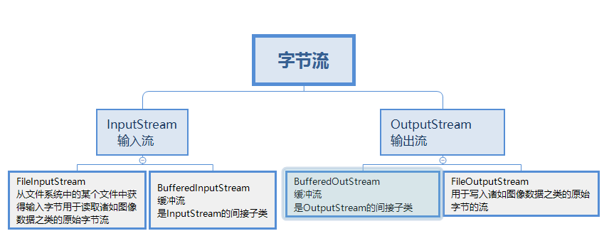

## 1、什么是比特(Bit),什么是字节(Byte),什么是字符(Char),它们长度是多少,各有什么区别？

> Bit最小的二进制单位 ，是计算机的操作部分取值0或者1。
>
> Byte是计算机中存储数据的单元，是一个8位的二进制数，（计算机内部，一个字节可表示一个英文字母，两个字节可表示一个汉字。） 取值（-128-127）
>
> Char是用户的可读写的最小单位，他只是抽象意义上的一个符号。如‘5’，‘中’，‘￥’等等。在java里面由16位bit组成Char 取值（0-65535）
>
> Bit 是最小单位 计算机他只能认识0或者1
>
> Byte是8个字节 是给计算机看的
>
> 字符 是看到的东西 一个字符=二个字节

## 2、什么是IO？

> **Java IO**：是以流为基础进行数据的输入输出的，所有数据被串行化(所谓串行化就是数据要按顺序进行输入输出)写入输出流。简单来说就是java通过io流方式和外部设备进行交互。
> 在Java类库中，IO部分的内容是很庞大的，因为它涉及的领域很广泛：标准输入输出，文件的操作，网络上的数据传输流，字符串流，对象流等等等。
>
> 比如程序从服务器上下载图片，就是通过流的方式从网络上以流的方式到程序中，在到硬盘中

## 3、在了解不同的IO之前先了解：同步与异步，阻塞与非阻塞的区别？

> **同步**：一个任务的完成之前不能做其他操作，必须等待（等于在打电话）
> **异步**：一个任务的完成之前，可以进行其他操作（等于在聊QQ）
> **阻塞**：是相对于CPU来说的， 挂起当前线程，不能做其他操作只能等待
> **非阻塞**：无须挂起当前线程，可以去执行其他操作

## 4、什么是BIO?

> **BIO**：**同步并阻塞**，服务器实现一个连接一个线程，即客户端有连接请求时服务器端就需要启动一个线程进行处理，没处理完之前此线程不能做其他操作（如果是单线程的情况下，我传输的文件很大呢？），当然可以通过线程池机制改善。
>
> BIO方式**适用于连接数目比较小且固定的架构**，这种方式对服务器资源要求比较高，并发局限于应用中，JDK1.4以前的唯一选择，但程序直观简单易理解。

## 5、什么是NIO？

> **NIO**：**同步非阻塞**，服务器实现一个连接一个线程，即客户端发送的连接请求都会注册到多路复用器上，多路复用器轮询到连接有I/O请求时才启动一个线程进行处理。
>
> NIO方式**适用于连接数目多且连接比较短（轻操作）的架构**，比如聊天服务器，并发局限于应用中，编程比较复杂，JDK1.4之后开始支持。

## 6、什么是AIO？

> **AIO**：**异步非阻塞**，服务器实现模式为一个有效请求一个线程，客户端的I/O请求都是由操作系统先完成了再通知服务器应用去启动线程进行处理，AIO方式使用于连接数目多且连接比较长（重操作）的架构，比如相册服务器，充分调用操作系统参与并发操作，编程比较复杂，JDK1.7之后开始支持。
>
> AIO属于NIO包中的类实现，其实**IO主要分为BIO和NIO**，AIO只是附加品，解决IO不能异步的实现在以前很少有Linux系统支持AIO，Windows的IOCP就是该AIO模型。但是现在的服务器一般都是支持AIO操作

## 7、什么是Netty?

> Netty是由JBOSS提供的一个Java开源框架。Netty提供异步的、事件驱动的网络应用程序框架和工具，用以快速开发高性能、高可靠性的网络服务器和客户端程序。
> Netty 是一个基于NIO的客户、服务器端编程框架，使用Netty 可以确保你快速和简单的开发出一个网络应用，例如实现了某种协议的客户，服务端应用。Netty相当简化和流线化了网络应用的编程开发过程，例如，TCP和UDP的socket服务开发。
>
> Netty是由NIO演进而来，使用过NIO编程的用户就知道NIO编程非常繁重，Netty是能够能跟好的使用NIO

## 8、BIO和NIO、AIO的区别？

> BIO是阻塞的，NIO是非阻塞的.
>
> BIO是面向流的，只能单向读写，NIO是面向缓冲的, 可以双向读写
>
> 使用BIO做Socket连接时，由于单向读写，当没有数据时，会挂起当前线程，阻塞等待，为防止影响其它连接,，需要为每个连接新建线程处理.，然而系统资源是有限的,，不能过多的新建线程，线程过多带来线程上下文的切换，从来带来更大的性能损耗，因此需要使用NIO进行BIO多路复用，使用一个线程来监听所有Socket连接，使用本线程或者其他线程处理连接
>
> AIO是非阻塞 以异步方式发起 I/O 操作。当 I/O 操作进行时可以去做其他操作，由操作系统内核空间提醒IO操作已完成（不懂的可以往下看）

## 9、IO流的分类?

> ==按流的方向==：
>
> - **输入流（InputStream）**：从文件读入到内存。只能进行读操作。
> - **输出流（OuputStream）**：从内存读出到文件。只能进行写操作。
> - 注：输出流可以帮助我们创建文件，而输入流不会。
>
> ==按处理数据单位==：
>
> - **字节流**：以字节为单位，每次次读入或读出是8位数据。可以读任何类型数据，图片、文件、音乐视频等。 (Java代码接收数据只能为byte数组)
> - **字符流**：以字符为单位，每次读入或读出是==16位==数据。其只能读取字符类型数据。 (Java代码接收数据为一般为char数组，也可以是别的)
>
> ==按角色==：
>
> - **节点流**：直接与数据源相连，读入或读出。
> - **处理流**：也叫**包装流**，是对一个对于已存在的流的连接进行封装，通过所封装的流的功能调用实现数据读写。如添加个Buffering缓冲区。（意思就是有个缓存区，等于软件和mysql中的redis）
> - 注意：为什么要有处理流？主要作用是在读入或写出时，对数据进行缓存，以减少I/O的次数，




## 10、5种IO模型

### 1、阻塞BIO(Blocking IO)

> 例：A拿着一支鱼竿在河边钓鱼，并且一直在鱼竿前等，在等的时候不做其他的事情，十分专心。只有鱼上钩的时，才结束掉等的动作，把鱼钓上来。
> 在内核将数据准备好之前，系统调用会一直等待所有的套接字，默认的是阻塞方式。


### 2、非阻塞NIO(NoBlocking IO)

> B也在河边钓鱼，但是B不想将自己的所有时间都花费在钓鱼上，在等鱼上钩这个时间段中，B也在做其他的事情（一会看看书，一会读读报纸，一会又去看其他人的钓鱼等），但B在做这些事情的时候，每隔一个固定的时间检查鱼是否上钩。一旦检查到有鱼上钩，就停下手中的事情，把鱼钓上来。 ==B在检查鱼竿是否有鱼，是一个轮询的过程==。


### 3、异步AIO(asynchronous IO)

> C也想钓鱼，但C有事情，于是他雇来了D、E、F，让他们帮他等待鱼上钩，一旦有鱼上钩，就打电话给C，C就会将鱼钓上去


当应用程序请求数据时，内核一方面去取数据报内容返回，另一方面将程序控制权还给应用进程，应用进程继续处理其他事情，是一种非阻塞的状态。

### 4、信号驱动IO(signal blocking IO)

> G也在河边钓鱼，但与A、B、C不同的是，G比较聪明，他给鱼竿上挂一个铃铛，当有鱼上钩的时候，这个铃铛就会被碰响，G就会将鱼钓上来。


信号驱动IO模型，应用进程告诉内核：当数据报准备好的时候，给我发送一个信号，对SIGIO信号进行捕捉，并且调用我的信号处理函数来获取数据报。

### 5、IO多路转接(IO multiplexing)

> H同样也在河边钓鱼，但是H生活水平比较好，H拿了很多的鱼竿，一次性有很多鱼竿在等，H不断的查看每个鱼竿是否有鱼上钩。增加了效率，减少了等待的时间。


> IO多路转接是多了一个select函数，select函数有一个参数是文件描述符集合，对这些文件描述符进行循环监听，当某个文件描述符就绪时，就对这个文件描述符进行处理。
>
> - **IO多路转接是属于阻塞IO**，但可以对多个文件描述符进行阻塞监听，所以效率较阻塞IO的高。

## 11、什么叫对象序列化？什么是反序列化？实现对象序列化需要做哪些工作？

> 对象序列化：将对象以二进制的形式保存在硬盘上
> 反序列化：将二进制的文件转化为对象读取
> 准备工作：实现serializable接口，不想让字段放在硬盘上就加transient

## 12、在实现序列化接口是时候一般要生成一个serialVersionUID字段,它叫做什么,

一般有什么用

> 如果用户没有自己声明一个serialVersionUID,接口会默认生成一个serialVersionUID，但是强烈建议用户自定义一个serialVersionUID,因为默认的serialVersinUID对于class的细节非常敏感，反序列化时可能会导致InvalidClassException这个异常。
> 比如说先进行序列化，然后在反序列化之前修改了类，那么就会报错。因为修改了类，对应的SerialversionUID也变化了，而序列化和反序列化就是通过对比其SerialversionUID来进行的，一旦SerialversionUID不匹配，反序列化就无法成功。

## 13、怎么生成SerialversionUID？

> 可序列化类可以通过声明名为 "serialVersionUID" 的字段（该字段必须是静态 (static)、最终(final) 的 long 型字段）显式声明其自己的 serialVersionUID

```java
private static final long serialVersionUID = 1L;
```

## 14、BufferedReader属于哪种流,它主要是用来做什么的,它里面有那些经典的方法

> 属于处理流中的缓冲流，可以将读取的内容存在内存里面，有readLine（）方法

## 15、Java中流类的超类主要有那些？

> - 超类代表顶端的父类（都是抽象类）
> - java.io.InputStream
> - java.io.OutputStream
> - java.io.Reader
> - java.io.Writer
