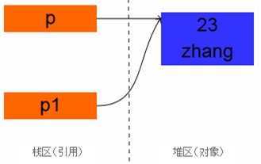
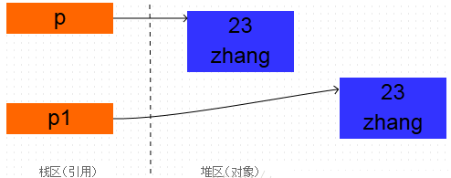
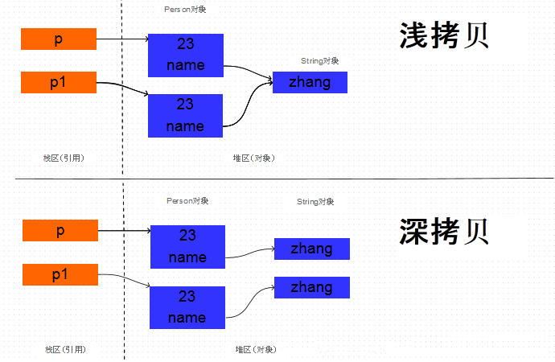
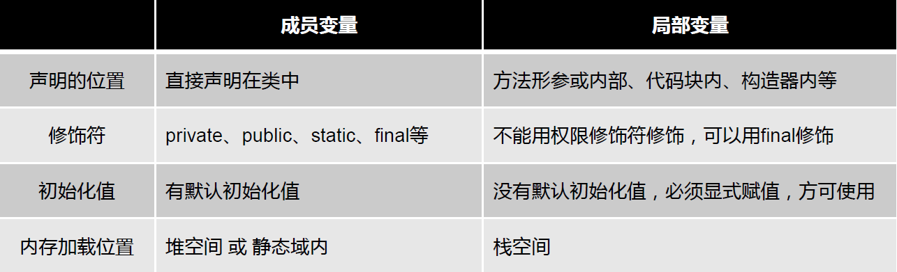

## 1、面向对象都有哪些特性以及你对这些特性的理解？

> 1. **继承**：继承是从已有类得到继承信息创建新类的过程。提供继承信息的类被称为父类（超类、基类）；得到继承信息的 类被称为子类（派生类）。继承让变化中的软件系统有了一定的延续性，同时继承也是封装程序中可变因素的重要手段。
> 2. **封装**：通常认为封装是把数据和操作数据的方法绑定起来，对数据的访问只能通过已定义的接口。面向对象的本质就是将现实世界描绘成一系列完全自治、封闭的对象。我们在类中编写的方法就是对实现细节的一种封装；我们编写一个类就是对数据和数据操作的封装。可以说，封装就是隐藏一切可隐藏的东西，只向外界提供最简单的编程接口。
> 3. **多态性**：多态性是指允许不同子类型的对象对同一消息作出不同的响应。简单的说就是用同样的对象引用调用同样的方法但是做了不同的事情。多态性分为编译时的多态性和运行时的多态性。如果将对象的方法视为对象向外界提供的服务，那么运行时的多态性可以解释为：当 A 系统访问 B 系统提供的服务时， B 系统有多种提供服务的方式，但一切对 A 系统来说都是透明的。方法重载（ overload ）实现的是编译时的多态性（也称为前绑定），而方法重写override ）实现的是运行时的多态性（也称为后绑定）。运行时的多态是面向对象最精髓的东西，要实现 多态需要做两件事： 1. 方法重写（子类继承父类并重写父类中已有的或抽象的方法）； 2. 对象造型（用父类型引用引用子类型对象，这样同样的引用调用同样的方法就会根据子类对象的不同而表现出不同的行为）。
> 4. **抽象**：抽象是将一类对象的共同特征总结出来构造类的过程，包括数据抽象和行为抽象两方面。抽象只关注对象有哪些属性和行为，并不关注这些行为的细节是什么。

## 2、访问 权限 修饰符 public 、 private 、 protected， 以及不写（默认）时的区别

| 修饰符    | 当前类 | 同包 | 子类 | 其他包 |
| --------- | ------ | ---- | ---- | ------ |
| public    | √      | √    | √    | √      |
| protected | √      | √    | √    | ×      |
| default   | √      | √    | ×    | ×      |
| private   | √      | ×    | ×    | ×      |

## 3、如何理解 clone 对象

### 1、为什么要用 clone

> 在实际编程过程中，我们常常要遇到这种情况：有一个对象A ，在某一时刻 A 中已经包含了一些有效值，此时可能会需要一个和 A 完全相同新对象 B ，并且此后对 B 任何改动都不会影响到 A 中的值，也就是说， A 与 B 是两个独立的对象，但 B 的初始值是由 A 对象确定的。在 Java 语言中，用简单的赋值语句是不能满足这种需求的。要满足这种需求虽然有很多途径，但实现 clone （）方法是其中最简单，也是最高效的手段。

### 2、new一个对象的过程和 clone一个对象的过程区别？

> new操作符的本意是分配内存。程序执行到 new 操作符时，首先去看 new 操作符后面的类型，因为知道了类型，才能知道要分配多大的内存空间。分配完内存之后，再调用构造函数，填充对象的各个域，这一步叫做对象的初始化，构造方法返回后，一个对象创建完毕，可以把他的引用（地址）发布到外部，在外部就可以使用这个引用操纵这个对象。
>
> clone在第一步是和 new 相似的，都是分配内存，调用 clone 方法时，分配的内存和原对象（即调用 clone 方法的对象）相同，然后再使用原对象中对应的各个域，填充新对象的域，填充完成之后， clone 方法返回，一个新的相同的对象被创建，同样可以把这个新对象的引用发布到外部。

### 3、clone对象的使用？

#### 1、复制对象和复制引用的区别

```java
Person p = new Person(23,"xiaobear");
Person p1 = p;
System.out.println(p);
System.out.println(p1);
```

当Person p1 = p; 执行之后， 是创建了一个新的对象吗？ 首先看打印结果：

```
Person@2f9ee1ac
Person@2f9ee1ac
```

可以看出，打印的地址值是相同的，既然地址都是相同的，那么肯定是同一个对象。p 和 p1 只是引用而已，他们都指向了一个相同的对象 Person(23, zhang ””) 。 可以把这种现象叫做**引用的复制**。上面代码执行完成之后，内存中的情景如下图所示：



而下面的代码是真真正正的克隆了一个对象。

```java
Person p = new Person(23, "xiaobear");
Person p1 = (Person) p.clone();
System.out.println(p);
System.out.println(p1);
```

从打印结果可以看出，两个对象的地址是不同的，也就是说创建了新的对象，而不是把原对象的地址赋给了一个新的引用变量：

```
Person@2f9ee1ac
Person@67f1fba0
```

以上代码执行完成后，内存中的情景如下图所示：



#### 2、深拷贝和浅拷贝

上面的示例代码中，Person 中有两个成员变量，分别是 name 和 age name 是 String 类型， age 是 int 类型。代码非常简单，如下所示：

```java
public class Person implements Cloneable{
	private int age ;
    private String name;
    public Person(int age, String name) {
     this.age = age;
     this.name = name;
    }

     public Person() {}
     public int getAge() {
     return age;
     }

     public String getName() {
         return name;
     }
     @Override
     protected Object clone() throws CloneNotSupportedException {
     return (Person)super.clone();
     }
}
```

由于age 是基本数据类型， 那么对它的拷贝没有什么疑议，直接将一个 4 字节的整数值拷贝过来就行。但是 name是 String 类型的， 它只是一个引用， 指向一个真正的 String 对象，那么对它的拷贝 有两种方式： 直接将原对象中的 name 的引用值拷贝给新对象的 name 字段， 或者是根据原 Person 对象中的 name 指向的字符串对象创建一个新的相同的字符串对象，将这个新字符串对象的引用赋给新拷贝的 Person 对象的 name 字段。这两种拷贝方式分别
叫做浅拷贝和深拷贝。深拷贝和浅拷贝的原理如下图所示：



下面通过代码进行验证。如果两个Person 对象的 name 的地址值相同， 说明两个对象的 name 都指向同一个String 对象，也就是浅拷贝， 而如果两个对象的 name 的地址值不同， 那 么就说明指向不同的 String 对象， 也就是在拷贝 Person 对象的时候， 同时拷贝了 name 引用的 String 对象， 也就是深拷贝。验证代码如下：

```java
 Person p = new Person(23, "xiaobear");
 Person p1 = (Person) p.clone();
 String result = p.getName() == p1.getName() ? "clone 是浅拷贝的 " : "clone 是深拷贝的
 System.out.println(result);
```

打印结果为：

```
clone 是浅拷贝的
```

所以，**clone 方法执行的是浅拷贝**。

#### 3、如何进行深拷贝

> 如果想要深拷贝一个对象，这个对象必须要实现Cloneable 接口，实现 clone方法，并且在 clone 方法内部，把该对象引用的其他对象也要 clone 一份，这就要求这个被引用的对象必须也要实现Cloneable 接口并且实现 clone 方法。

```java
public class DeepCopy {
    static class Body implements Cloneable{
        public Head head;
        public Body(){ }
        public Body(Head head) {
            this.head = head;
        }

        @Override
        protected Object clone() throws CloneNotSupportedException {
            Body clone = (Body) super.clone();
            clone.head = (Head) head.clone();
            return clone;
        }
    }

    static class Head implements Cloneable{
        public Face face;
        public Head(Face deepCopy) {
        }

        @Override
        protected Object clone() throws CloneNotSupportedException {
            return super.clone();
        }
    }
    static class Face implements Cloneable{
        @Override
        protected Object clone() throws CloneNotSupportedException {
            return super.clone();
        }
    }

    public static void main(String[] args) throws CloneNotSupportedException {
        Body body = new Body(new Head(new Face()));
        Body body1 = (Body) body.clone();
        System.out.println("body == body1 : " + (body == body1) );
        System.out.println("body.head == body1.head : " + (body.head == body1.head));
    }
}
```

打印输出结果：

```
body == body1 : false
body.head == body1.head : false
```

## 4、用户不能调用构造方法，只能通过new关键字自动调用？

> 错误
>
> 1. 在类内部可以用户可以使用关键字**this.构造方法名()**调用（参数决定调用的是本类对应的构造方法）
> 2. 在子类中用户可以通过关键字**super.父类构造方法名()**调用（参数决定调用的是父类对应的构造方法。）
>
> 3. 在反射中可以使用newInstance()的方式调用。

## 5、讲讲类的实例化顺序，比如父类静态数据，构造函数，子类静态数据，构造函数?

> 基本上代码块分为三种：Static静态代码块、构造代码块、普通代码块
>
> 代码块执行顺序**静态代码块——> 构造代码块 ——> 构造函数——> 普通代码块** 
>
> 继承中代码块执行顺序：**父类静态块——>子类静态块——>父类代码块——>父类构造器——>子类代码块——>子类构造器**

```java
public class Parent{
    {
        System.out.println("父类非静态代码块");
    }
    static{
        System.out.println("父类静态代码块");
    }
    public Parent(){
        System.out.println("父类构造器");
    }
}
public class Son extends parent{
    public Son(){
        System.out.println("子类构造器");
    }
    static{
        System.out.println("子类静态代码块");
    }
    {
      System.out.println("子类非静态代码块");   
    }
}

public class Test {
    public static void main(String[] args){
        Son son = new Son();
    }
}
```

运行结果：

```
父类静态块
子类静态代码块
父类非静态代码块
父类构造器
子类非静态代码块
子类构造器
```

> **类实例化顺序为：**==父类静态代码块/静态域->子类静态代码块/静态域 -> 父类非静态代码块 -> 父类构造器 -> 子类非静态代码块 -> 子类构造器==

## 6、构造器（constructor）是否可被重写（override）？

> 构造器不能被继承，因此不能被重写，但可以被重载。每一个类必须有自己的构造函数，负责构造自己这部分的构造。子类不会覆盖父类的构造函数，相反必须一开始调用父类的构造函数。

## 7、创建对象的几种方式？

> 1. new创建新对象
> 2. 通过反射机制
> 3. 采用clone机制
> 4. 通过序列化机制

## 8、Super与this表示什么？

> Super表示当前类的父类对象
> This表示当前类的对象

## 9、Java四种引用类型

> 1. **强引用**：强引用是平常中使用最多的引用，强引用在程序内存不足（OOM）的时候也不会被回收。
     >
     >    ```java
>    String str = new String("str");
>    ```
>
> 2. **软引用**：软引用在程序内存不足时，会被回收。
     >
     >    ```java
>    // 注意：wrf这个引用也是强引用，它是指向SoftReference这个对象的，
>    // 这里的软引用指的是指向new String("str")的引用，也就是SoftReference类中T
>    SoftReference<String> wrf = new SoftReference<String>(new String("str"));
>    ```
     >
     >    ==可用场景==： 创建缓存的时候，创建的对象放进缓存中，当内存不足时，JVM就会回收早先创建的对象。
>
> 3. **弱引用**：只要JVM垃圾回收器发现了它，就会将之回收
     >
     >    ```java
>    WeakReference<String>wrf=newWeakReference<String>(str);
>    ```
     >
     >    ==可用场景==：Java源码中的java.util.WeakHashMap中的key就是使用弱引用，我的理解就是，一旦我不需要某个引用，JVM会自动帮我处理它，这样我就不需要做其它操作。
>
> 4. **虚引用**：虚引用的回收机制跟弱引用差不多，但是它被回收之前，会被放入ReferenceQueue中。注意哦，其它引用是被JVM回收后才被传入ReferenceQueue中的。由于这个机制，所以虚引用大多被用于引用销毁前的处理工作。还有就是，虚引用创建的时候，必须带有ReferenceQueue
     >
     >    ```java
>    PhantomReference<String>prf=newPhantomReference<String>(new
>    String("str"),newReferenceQueue<>());
>    ```
     >
     >    ==可用场景==： 对象销毁前的一些操作，比如说资源释放等。Object.finalize() 虽然也可以做这类动作，但是这个方式即不安全又低效上诉所说的几类引用，都是指对象本身的引用，而不是指 Reference 的四个子类的引用( SoftReference 等)。

## 10、成员变量（属性）和局部变量的区别？




