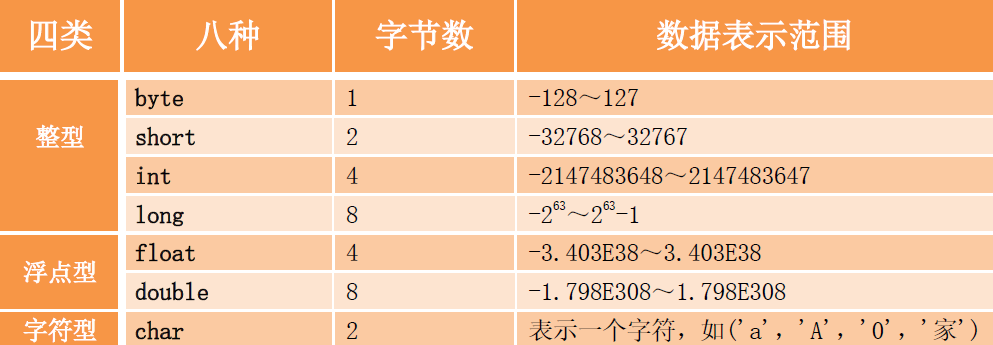

## 1、Java 的基本数据类型都有哪些各占几个字节？




## 2、String 是最基本的数据类型吗？

> 不是，String是引用类型，底层是用char数组实现的。
>
> Java 中的基本数据类型只有8 个：`byte`、`short`、`int`、`long`、`float`、`double`、`char`、`boolean`；除了基本类型（primitive type），剩下的都是引用类型（referencetype）， Java 5 以后引入的枚举类型也算是一种比较特殊的引用类型。

## 3、运行short s1 = 1， s1 = s1 + 1 ；会出现什么结果？运行short s1 = 1; s1 += 1 ；又会出现什么结果？

> - 运行第一个会报错，因为1是`int`类型，而s是`short`类型，通过+运算后s1自动转换成`int`型。错误提示：Error:(21, 17) java: 不兼容的类型: 从`int`转换到`short`可能会有损失
> - 运行第二个是正确的，s1=2，+1是`int`类型的操作，s1自动转换`int`类型

## 4、int 和Integer 有什么区别？

> Java 是一个近乎纯洁的面向对象编程语言，但是为了编程的方便还是引入了基本数据类型，但是为了能够将这些基本数据类型当成对象操作，Java 为每一个基本数据类型都引入了对应的包装类型（wrapper class），int 的包装类就是Integer，从Java 5 开始引入了自动装箱/拆箱机制，使得二者可以相互转换。
>
> - 原始类型:   boolean， char，     byte， short，  int，    long，  float，double
> - 包装类型：Boolean，Character，Byte，Short，Integer，Long，Float，Double

```java
public class AutomaticUnboxing {
    public static void main(String[] args) {
        Integer a1 = 100,a2 = 100,z3 = 139, z4 =139;
        System.out.println(a1 == a2); //true
        System.out.println(z3 == z4); //false
    }
}
```

**如果整型字面量的值在-128 到127 之间，那么不会new 新的Integer对象，而是直接引用常量池中的Integer 对象**

## 5、float f=3.4;是否正确？

> 不正确。3.4是双精度。将双精度型（double） 赋值给浮点型（float）属于下转型（ down-casting，也称为窄化）会造成精度损失，因此需要强制类型转换`float f =(float)3.4`; 或者写成`float f =3.4F`;。

## 6、用最高效率的方法算出2 乘以8 等于多少。

> 移位运算符：`int i = 2 << 3`;

## 7、String 类常用方法

| 方法                                                         | 描述                                                         |
| ------------------------------------------------------------ | :----------------------------------------------------------- |
| [ int length()](https://www.runoob.com/java/java-string-length.html) | 返回此字符串的长度                                           |
| [int indexOf(int ch)](https://www.runoob.com/java/java-string-indexof.html) | 返回指定字符在此字符串中第一次出现处的索引                   |
| [ int indexOf(int ch, int fromIndex)](https://www.runoob.com/java/java-string-indexof.html) | 返回在此字符串中第一次出现指定字符处的索引，从指定的索引开始搜索 |
| [ int lastIndexOf(int ch)](https://www.runoob.com/java/java-string-lastindexof.html) | 返回指定字符在此字符串中最后一次出现处的索引                 |
| [ String concat(String str)](https://www.runoob.com/java/java-string-concat.html) | 将指定字符串连接到此字符串的结尾。                           |
| [ boolean endsWith(String suffix)](https://www.runoob.com/java/java-string-endswith.html) | 测试此字符串是否以指定的后缀结束。                           |
| [ String replace(char oldChar, char newChar)](https://www.runoob.com/java/java-string-replace.html) | 返回一个新的字符串，它是通过用 newChar 替换此字符串中出现的所有 oldChar 得到的。 |
| [String[] split(String regex)](https://www.runoob.com/java/java-string-split.html) | 根据给定正则表达式的匹配拆分此字符串。                       |
| [String substring(int beginIndex)](https://www.runoob.com/java/java-string-substring.html) | 返回一个新的字符串，它是此字符串的一个子字符串               |
| [ String trim()](https://www.runoob.com/java/java-string-trim.html) | 返回字符串的副本，忽略前导空白和尾部空白                     |
| [ boolean equals(Object anObject)](https://www.runoob.com/java/java-string-equals.html) | 将此字符串与指定的对象比较。                                 |

## 8、String 、 StringBuffer 、 StringBuilder 的区别？

> **1、可变与不可变**
>
> String：字符串常量，在修改时不改变自身；若修改，等于生成新的字符串对象
>
> StringBuffer：在修改时会改变对象自身，每次操作都是对 StringBuffer 对象本身进行修改，不是生成新的对象；使用场景：对字符串经常改变情况下，主要方法： append insert （）等。
>
> **2、线程是否安全**
>
> String：对象定义后不可变，线程安全。
>
> StringBuffer：是线程安全的（对调用方法加入同步锁），执行效率较慢，适用于多线程下操作字符串缓冲区大量数据。
>
> StringBuilder ：是线程不安全的，适用于单线程下操作字符串缓冲区大量数据。
>
> **3、共同点**
>
> StringBuilder 与 StringBuffer 有公共父类 AbstractStringBuilder(抽象类)。
>
> ```java
> public final class StringBuilder extends AbstractStringBuilder implements java.io.Serializable, CharSequence
> 
> public final class StringBuffer extends AbstractStringBuilder implements java.io.Serializable, CharSequence
> ```
>
> StringBuilder、StringBuffer 的方法都会调用 AbstractStringBuilder 中的公共方法，如 super.append(...)。只是 StringBuffer 会在方法上加 **synchronized** 关键字，进行同步。最后，如果程序不是多线程的，那么使用StringBuilder 效率高于StringBuffer。

**对于三者使用的总结**

- 如果要操作少量的数据用 = String

- 单线程操作字符串缓冲区下操作大量数据 = StringBuilder

- 多线程操作字符串缓冲区下操作大量数据 = StringBuffffer

## 9、 while 和do while 有什么区别？

> while是先判断再执行；do...while是先执行再判断，同等条件下，后者多执行了一次。

## 10、switch 语句能否作用在byte 、long 、String 上？

> - 可以用在`byte、int、short、char`以及它们的封装类上
> - 不能用在其他基本类型上`long、double、float、boolean`以及封装类
> - jdk1.7及以上，可以用以字符串
> - 可以用于枚举类型

## 11、`String s ＝new String("xyz")；`，创建了几个String 对象？二者之间再什么区别。

> 创建了2个对象，一个是内存中的“xyz”，还有一个是s，指向xyz

## 12、自动装箱与拆箱

> 自动装箱：将基本类型用他们的引用类型包装起来
>
> 自动拆箱：将包装类型转换为基本类型

## 13、Math.round(11.5) 等于多少？Math.round(-11.5)等于多少？

> Math.round(11.5)的返回值是 12，Math.round(-11.5)的返回值是-11。**四舍五入的原理是在参数上加 0.5 然后进行下取整**。

## 14、下面代码运行结果是多少？

```java
int count = 0;
for (int k = 0; k < 100; k++) {
    count = count++;
}
System.out.println(count);
```

**解析**：++是先赋值，再自增，所以count永远是0

## 15、Java中基本类型是如何转换的？

> 基本类型等级从低到高：
>
> - byte、short、int、long、float、double
> - char、int、long、float、double
>
> 自动转换：运算过程中，低级可以自动向高级进行转换
>
> 强制转换：高级需要强制转换成低级，可能会丢失精度
>
> **规则**：
>
> - = 右边先自动转换成表达式中最高级的数据类型，再进行运算。整型经过运算会自动转化最低 int 级别，如两个 char 类型的相加，得到的是一个 int 类型的数值。
> - = 左边数据类型级别 大于 右边数据类型级别，右边会自动升级
> - = 左边数据类型级别 小于 右边数据类型级别，需要强制转换右边数据类型
> - char 与 short，char 与 byte 之间需要强转，因为 char 是无符号类型

## 16、String. intern() 你了解吗？

> String.intern()是一个Native(本地)方法，它的作用是如果**字符串常量池已经包含一个等于此String对象的字符串，则返回字符串常量池中这个字符串的引用**, **否则将当前String对象的引用地址（堆中）添加到字符串常量池中并返回**。
>
> ```java
> public class StringInternTest {
>     public static void main(String[] args) {
>       	// 基本数据类型之间的 ==  是比较值，引用数据类型 == 比较的是地址值
>       	// 1：在Java Heap中创建对象 2：在字符串常量池中添加 小熊学Java
>         String a = new String("小熊学Java");
>       	// 调用 intern 方法，因上一步中已经将 小熊学Java 存入常量池中，这里直接返回常量池 小熊学Java 的引用地址
>         String b = a.intern();
>       	// a 的地址在Java Heap中 ， b的地址在 常量池中 ，所以结果是flase
>         System.out.println(a == b);
>       	// 因为常量池中已经包含小熊学Java，所以直接返回
>         String c = "小熊学Java";
>         // b c 的地址一致，所以是true
>         System.out.println(b == c);
>     }
> }
> 
> //结果
> false
> true
> ```

## 16、String类为什么要设置成不可变?

> 1. 线程安全性：不可变的String对象可以在多线程环境下安全地共享，因为它们的值不能被修改。这消除了在并发环境中进行同步的需要，提高了程序的性能和可靠性。
> 2. 缓存哈希值：String类经常被用作哈希表的键，因此将String设置为不可变可以确保哈希值的稳定性。如果String是可变的，那么在修改String的值后，它的哈希值也会改变，导致在哈希表中无法正确找到对应的键。
> 3. 安全性：不可变的String对象可以被安全地用作方法的参数，因为调用方法时无法修改它们的值。这样可以防止恶意代码通过修改参数值来破坏方法的行为。
> 4. 字符串池：Java中的字符串池是一种字符串缓存机制，它可以重用相同值的字符串对象，以节省内存。由于String是不可变的，可以将相同值的字符串对象存储在字符串池中，从而提高内存利用率。
