## 1、什么是JVM？

> JVM（Java Virtual Machine）是用于运行Java字节码的虚拟机，包括一套字节码指令集、一组程序寄存器、一个虚拟机栈、一个虚拟机堆、一个方法区和一个垃圾回收器。JVM运行在操作系统之上，不与硬件设备直接交互。
>
> Java源文件在通过编译器之后被编译成相应的.Class文件（字节码文件），.Class文件又被JVM中的解释器编译成机器码在不同的操作系统（Windows、Linux、Mac）上运行。每种操作系统的解释器都是不同的，但基于解释器实现的虚拟机是相同的，这也是Java能够跨平台的原因。在一个Java进程开始运行后，虚拟机就开始实例化了，有多个进程启动就会实例化多个虚拟机实例。进程退出或者关闭，则虚拟机实例消亡，在多个虚拟机实例之间不能共享数据。

## 2、JVM虚拟机包含了哪些区域？

> Java虚拟机包括一个类加载器子系统（Class Loader SubSystem）、运行时数据区（Runtime Data Area）、执行引擎和本地接口库（Native Interface Library）。本地接口库通过调用本地方法库（Native Method Library）与操作系统交互
>
> 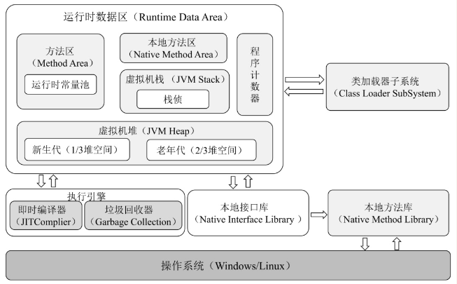
>
> 其中：
>
> - 类加载器子系统用于将编译好的.Class文件加载到JVM中；
> - 运行时数据区用于存储在JVM运行过程中产生的数据，包括程序计数器、方法区、本地方法区、虚拟机栈和虚拟机堆；
> - 执行引擎包括即时编译器和垃圾回收器，即时编译器用于将Java字节码编译成具体的机器码，垃圾回收器用于回收在运行过程中不再使用的对象；
> - 本地接口库用于调用操作系统的本地方法库完成具体的指令操作。

## 3、在JVM后台运行的线程有哪些？

> - 虚拟机线程（JVMThread）：虚拟机线程在JVM到达安全点（SafePoint）时出现。
> - 周期性任务线程：通过定时器调度线程来实现周期性操作的执行。
> - GC线程：GC线程支持JVM中不同的垃圾回收活动。
> - 编译器线程：编译器线程在运行时将字节码动态编译成本地平台机器码，是JVM跨平台的具体实现。
> - 信号分发线程：接收发送到JVM的信号并调用JVM方法

## 4、JVM内存区域怎么区分？

> JVM内存区域分为：**线程私有区域**和**线程共享区域**以及**直接内存**
>
> 线程私有区域：程序计数器、虚拟机、本地方法区
>
> 线程共享区域：虚拟机堆、方法区
>
> 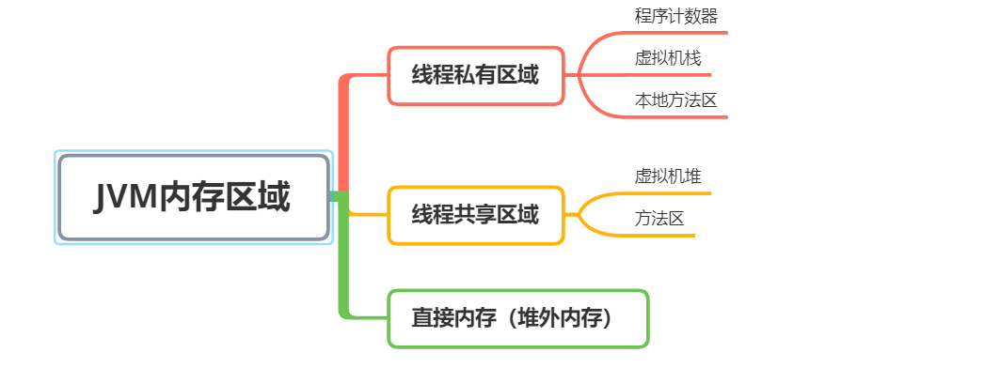

## 5、JVM内存区域的生命周期

> **线程私有区域**：与线程的生命周期相同，随线程的启动而创建，随线程的结束而销毁
>
> **线程共享区域**：与虚拟机的生命周期相同，随虚拟机的启动而创建，随虚拟机的结束而销毁

## 6、JVM直接内存，你了解吗？

> 直接内存也叫作堆外内存，它并不是JVM运行时数据区的一部分，但在并发编程中被频繁使用。JDK的NIO模块提供的基于Channel与Buffer的I/O操作方式就是基于堆外内存实现的，NIO模块通过调用Native函数库直接在操作系统上分配堆外内存，然后使用DirectByteBuffer对象作为这块内存的引用对内存进行操作，Java进程可以通过堆外内存技术避免在Java堆和Native堆中来回复制数据带来的资源占用和性能消耗，因此堆外内存在高并发应用场景下被广泛使用（Netty、Flink、HBase、Hadoop都有用到堆外内存）

## 7、什么是程序计数器？

> 程序计数器（Program Counter Register）是一块较小的内存空间，它可以看作是当前线程所执行的字节码的行号指示器；在Java虚拟机的概念模型里，字节码解释器工作时就是通过改变这个计数器的值来选取下一条需要执行的字节码指令，它是程序控制流的指示器，分支、循环、跳转、异常处理、线程恢复等基础功能都需要依赖这个计数器来完成。
>
> 由于Java虚拟机的多线程是通过线程轮流切换、分配处理器执行时间的方式来实现的，在任何一个确定的时刻，一个处理器（对于多核处理器来说是一个内核）都只会执行一条线程中的指令。因此，为了线程切换后能恢复到正确的执行位置，每条线程都需要有一个独立的程序计数器，各条线程之间计数器互不影响，独立存储，我们称这类内存区域为“线程私有”的内存。
>
> 如果线程正在执行的是一个Java方法，这个计数器记录的是正在执行的虚拟机字节码指令的地址；如果正在执行的是本地（Native）方法，这个计数器值则应为空（Undefined）。
>
> 此内存区域是唯一一个在《Java虚拟机规范》中没有规定任何OutOfMemoryError情况的区域。
>
> 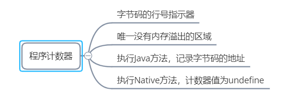

## 8、什么是虚拟机栈？

> 虚拟机栈描述的是Java方法执行的线程内存模型：每个方法被执行的时候，Java虚拟机都会同步创建一个栈帧（Stack Frame）用于存储局部变量表、操作数栈、动态连接、方法出口等信息。
>
> 每一个方法被调用直至执行完毕的过程，就对应着一个栈帧在虚拟机栈中从入栈到出栈的过程。
>
> 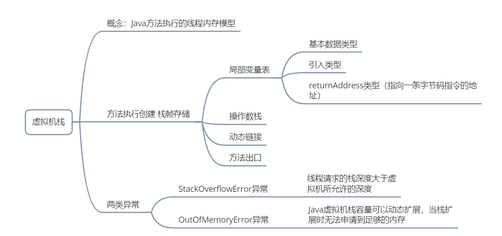

## 9、什么是本地方法栈（本地方法区）？

> 本地方法栈（Native Method Stacks）与虚拟机栈所发挥的作用是非常相似的，其区别只是虚拟机栈为虚拟机执行Java方法（也就是字节码）服务，而本地方法栈则是为虚拟机使用到的本地（Native）方法服务。
>
> 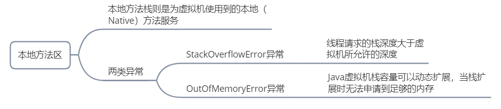

## 10、什么是Java堆？

> 在JVM运行过程中创建的对象和产生的数据都被存储在堆中，堆是被线程共享的内存区域，也是垃圾收集器进行垃圾回收的最主要的内存区域。
>
> 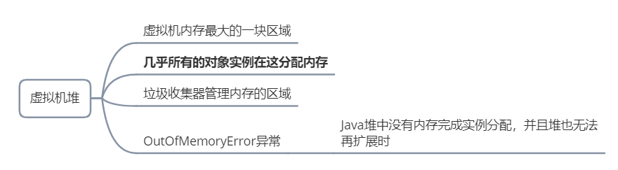

## 11、什么是方法区？

> 方法区（Method Area）与Java堆一样，是各个线程共享的内存区域，它用于存储已被虚拟机加载的类型信息、常量、静态变量、即时编译器编译后的代码缓存等数据。
>
> 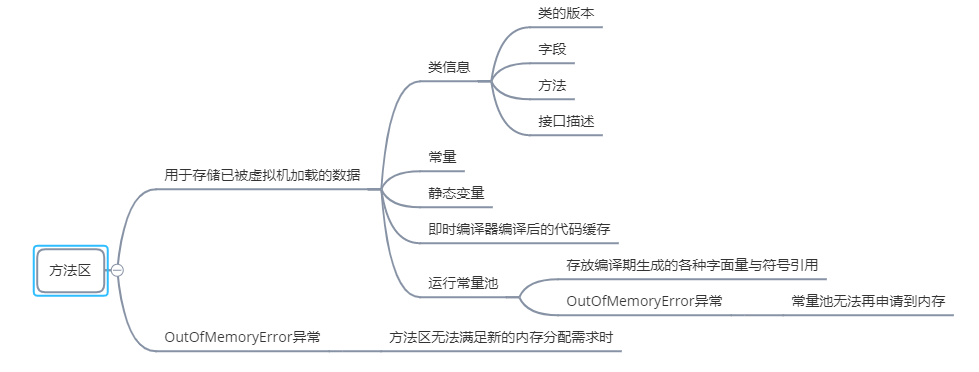

## 12、什么是运行时常量池？

> 用于存放编译期生成的各种字面量与符号引用，这部分内容将在类加载后存放到方法区的运行时常量池中.

## 13、对象的创建过程？

> 1. Java虚拟机遇到一个new字节码指令
> 2. 检查指令参数是否在常量池定位的引用，引用代表的类是否执行了类加载机制
> 3. 若未找到，则进行类加载机制的7个阶段
> 4. 类加载机制通过后，为对象分配内存
> 5. 将分配到的内存空间（但不包括对象头）都初始化为零值
> 6. 对创建的对象进行设置（这个对象是哪个类的实例、如何才能找到类的元数据信息、对象的哈希码（实际上对象的哈希码会延后到真正调用Object::hashCode()方法时才计算）、对象的GC分代年龄等信息）
> 7. 此时，对于虚拟机来说，对象的创建已经完成，但对于Java程序来说，才刚开始，构造函数还没初始化
> 8. 调用init()方法后，对象才算真正创建成功
>
> 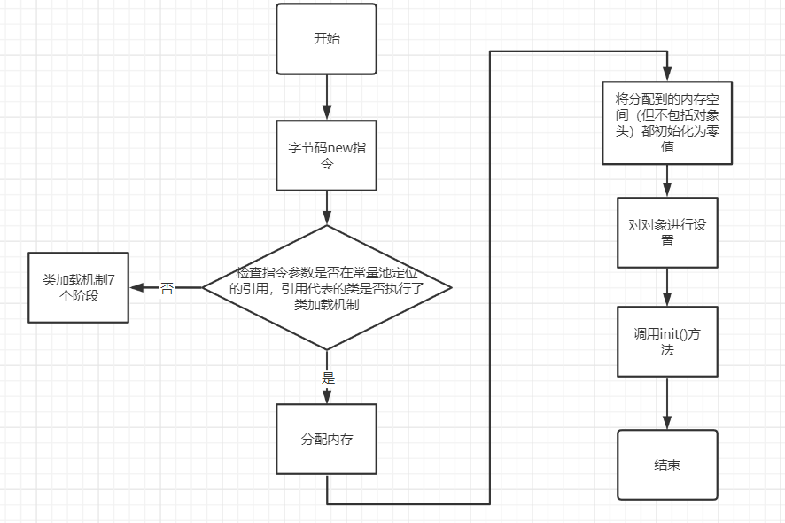

## 14、对象在内存中的分布布局?

> 在HotSpot虚拟机里，对象在堆内存中的存储布局可以划分为三个部分：
>
> - **对象头**（Header）：一部分用于存储对象自身的运行时数据；另一部分是类型指针，即对象指向它的类型元数据的指针，Java虚拟机通过这个指针
    >   来确定该对象是哪个类的实例
> - **实例数据**（Instance Data）：对象真正存储的有效信息，即我们在程序代码里面所定义的各种类型的字段内容，无论是从父类继承下来的，还是在子类中定义的字段都必须记录起来
> - **对齐填充**（Padding)：它仅仅起着占位符的作用
>
> 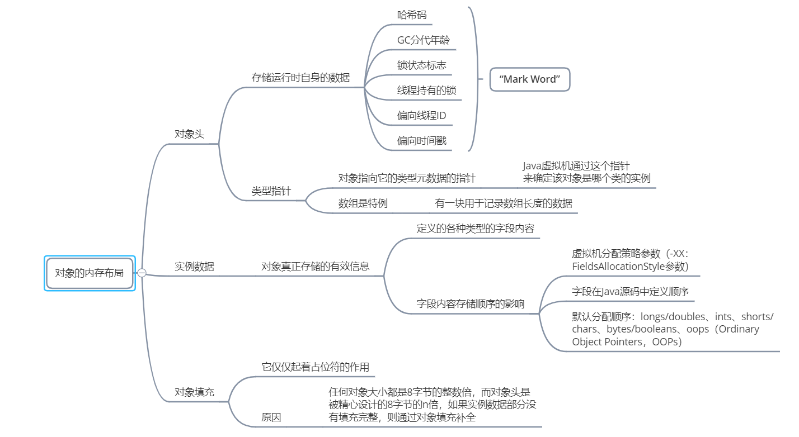

## 15、对象的访问定位？

> 创建对象自然是为了后续使用该对象，我们的Java程序会通过栈上的reference数据来操作堆上的具体对象。由于reference类型在《Java虚拟机规范》里面只规定了它是一个指向对象的引用，并没有定义这个引用应该通过什么方式去定位、访问到堆中对象的具体位置，所以对象访问方式也是由虚拟机实现而定的，主流的访问方式有：
>
> - 使用句柄：Java堆中将可能会划分出一块内存来作为句柄池，reference中存储的就是对象的句柄地址，而句柄中包含了对象实例数据与类型数据各自具体的地址信息
> - 直接指针：Java堆中对象的内存布局就必须考虑如何放置访问类型数据的相关信息，reference中存储的直接就是对象地址，如果只是访问对象本身的话，就不需要多一次间接访问的开销
>
> 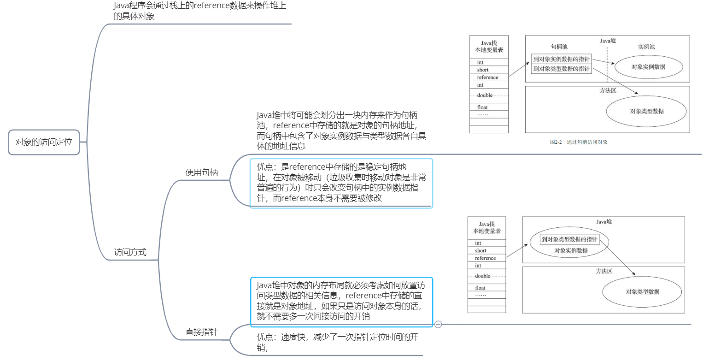

## 16、哪些区域会存在OutOfMemoryError异常？

> 前面其实已经提到了
>
> - Java堆溢出
> - 虚拟机栈和本地方法栈溢出
> - 方法区和运行时常量池溢出
> - 本机内存溢出

## 17、如何确定垃圾可以回收？

> 方法：引用计数器和可达性分析
>
> **引用计数器**：在Java 中如果要操作对象，就必须先获取该对象的引用，因此可以通过引用计数法来判断一个对象是否可以被回收。在为对象添加一个引用时，引用计数加l ；在为对象删除一个引用时， 引进计数减l ；如果一个对象的引用计数为0 ，则表示此刻该对象没有被引用，可以被回收。
>
> 存在的问题：如果两个互相引用，则不会回收
>
> **可达性分析**：为了解决引用计数器方法的循环引用问题，首先定义一些GC Root s 对象，然后以这些GC Roots 对象作为起
> 点向下搜索，如果在GC roots 和一个对象之间没有可达路径， 则称该对象是不可达的。不可达对象要经过至少两次标记才能判定其是否可以被囚lj史，如果在两次标记后该对象仍然是不可达的，则将被垃圾收集器回收。
>
> 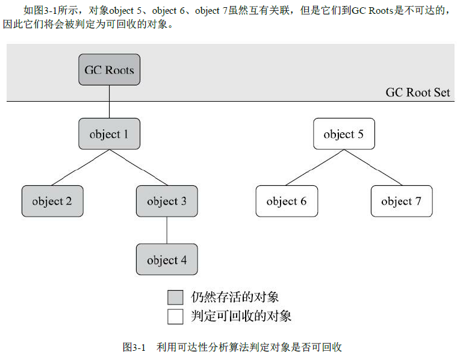

## 18、在Java体系中，可固定作为GC Roots的对象有哪些？

> - 在虚拟机栈（栈帧中的本地变量表）中引用的对象，譬如各个线程被调用的方法堆栈中使用到的参数、局部变量、临时变量等
> - 在方法区中类静态属性引用的对象，譬如Java类的引用类型静态变量
> - 在方法区中常量引用的对象，譬如字符串常量池（String Table）里的引用
> - 在本地方法栈中JNI（即通常所说的Native方法）引用的对象
> - Java虚拟机内部的引用，如基本数据类型对应的Class对象，一些常驻的异常对象（比如NullPointExcepiton、OutOfMemoryError）等，还有系统类加载器
> - 所有被同步锁（synchronized关键字）持有的对象
> - 反映Java虚拟机内部情况的JMXBean、JVMTI中注册的回调、本地代码缓存

## 19、Java中的4中引用类型？

> - **强引用（Strongly Re-ference）**：强引用是最传统的“引用”的定义，是指在程序代码之中普遍存在的引用赋值，即类似“Object
>   obj=new Object()”这种引用关系。无论任何情况下，只要强引用关系还存在，垃圾收集器就永远不会回收掉被引用的对象
> - **软引用（Soft Reference）**：用来描述一些还有用，但非必须的对象。只被软引用关联着的对象，在系统将要发生内
>   存溢出异常前，会把这些对象列进回收范围之中进行第二次回收，如果这次回收还没有足够的内存，才会抛出内存溢出异常。在`JDK 1.2`版之后提供了`SoftReference`类来实现软引用
> - **弱引用（Weak Reference）**：也是用来描述那些非必须对象，但是它的强度比软引用更弱一些，被弱引用关联的对象只
>   能生存到下一次垃圾收集发生为止。当垃圾收集器开始工作，无论当前内存是否足够，都会回收掉只被弱引用关联的对象。在JDK 1.2版之后提供了`WeakReference`类来实现弱引用
> - **虚引用（Phantom Reference）**:也称为“幽灵引用”或者“幻影引用”，它是最弱的一种引用关系。一个对象是否有虚引用的
>   存在，完全不会对其生存时间构成影响，也无法通过虚引用来取得一个对象实例。为一个对象设置虚引用关联的唯一目的只是为了能在这个对象被收集器回收时收到一个系统通知。在`JDK 1.2` 版之后提供了`PhantomReference`类来实现虚引用

## 20、垃圾回收算法有哪些？

> Java 中常用的垃圾回收算法有：
>
> - 标记清除（ Mark-Sweep ）
> - 标记复制（ Copying ）
> - 标记整理( Mark-Compact ）
> - 分代收集（ Generational Collecting ）

## 21、什么是分代收集算法？

> 分代收集算法根据对象的不同类型将内存划分为不同的区域， JVM 将堆划分为新生代和老年代。新生代主要存放新生成的对象，其特点是对象数量多但是生命周期短，在每次进行垃圾回收时都有大量的对象被回收；老年代主要存放大对象和生命周期长的对
> 象，因此可回收的对象相对较少。因此， JVM 根据不同的区域对象的特点选择了不同的算法。

## 22、什么是GC?

> GC：是garbage collection的缩写，垃圾回收
>
> - `Minor GC/Young GC`：新生代垃圾回收
> - `Major GC/Old GC`：目标老年代垃圾回收，不同资料可能有不同的所指
> - `Mixed GC`：混合收集，收集整个新生代以及部分老年代的垃圾收集。目前只有G1收集器会有这种行为
> - `Full GC`：整堆收集，收集整个堆和方法区的垃圾

## 23、什么是标记清除算法？

> 标记清除，顾名思义，就是把标记的清除掉，分两个阶段，第一阶段，标记，第二阶段，清除；
>
> 首先标记出所有需要回收的对象，在标记完成后，统一回收掉所有被标记的对象，也可以反过来，标记存活的对象，统一回
> 收所有未被标记的对象。标记过程就是对象是否属于垃圾的判定过程，它是最早出现也是最基础的算法
>
> 缺点：
>
> - 执行效率不高：如果Java堆中包含大量对象，而且其中大部分是需要被回收的，这时必须进行大量标记和清除的动作，导致标记和清除两个过程的执行效率都随对象数量增长而降低。
> - 内存空间的碎片化问题：标记、清除之后会产生大量不连续的内存碎片，空间碎片太多可能会导致当以后在程序运行过程中需要分配较大对象时无法找到足够的连续内存而不得不提前触发另一次垃圾收集动作
>
> 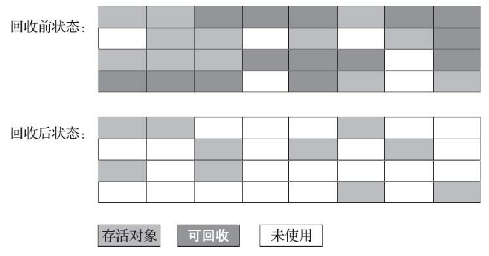

## 24、什么是标记复制算法？

> 复制算法是为了解决标记清除算法内存碎片化的问题而设计的。复制算法首先将内存划分为两块大小相等的内存区域， 即区域l 和区
>
> 域2 ， 新生成的对象都被存放在区域l中，在区域l 内的对象存储满后会对区域l 进行一次标记，并将标记后仍然存活的对象全部复制
>
> 到区域2 中，这时区域l 将不存在任何存活的对象，直接清理整个区域l 的内存即可.
>
> 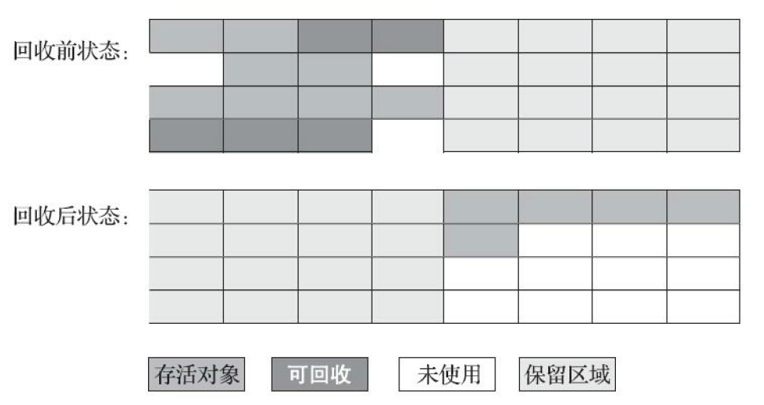

## 25、什么是标记整理算法？

> 标记整理算法结合了标记清除算法和复制算法的优点，其标记阶段和标记清除算法的标记阶段相同，在标记完成后将存活的对象移到内存的另一端，然后清除该端的对象并释放内存.
>
> 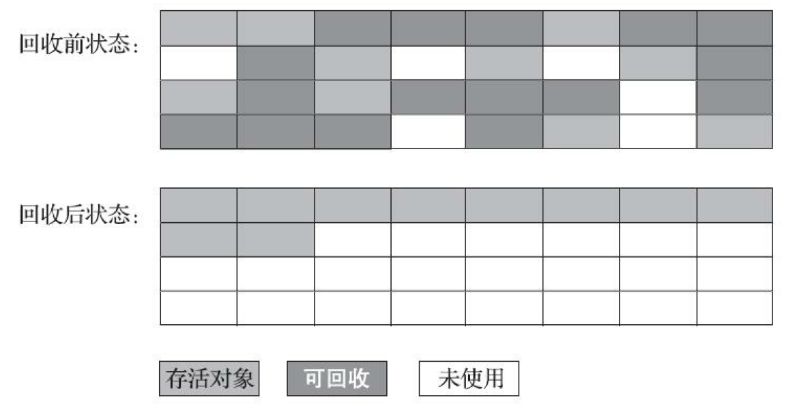

