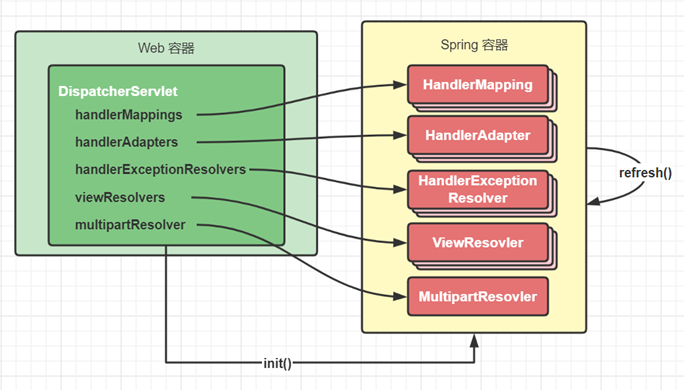
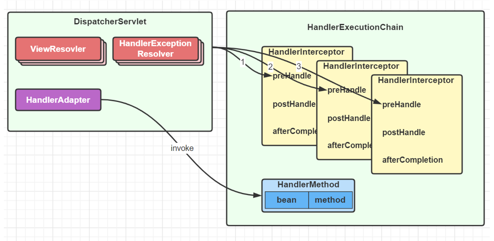
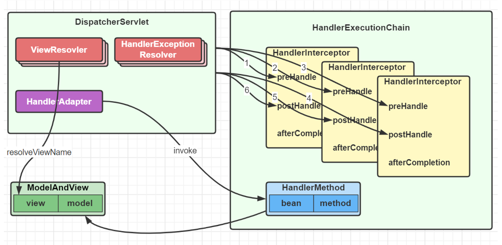

> 把整个流程分成三个阶段：**准备阶段——> 匹配阶段——>执行阶段**

### **准备阶段**

1. 在 Web 容器第一次用到 DispatcherServlet 的时候，会创建其对象并执行 init 方法

2. init 方法内会创建 Spring Web 容器，并调用容器 refresh 方法

3. refresh 过程中会创建并初始化 SpringMVC 中的重要组件， 例如 MultipartResolver，HandlerMapping，HandlerAdapter，HandlerExceptionResolver、ViewResolver 等

   DispatcherServlet源码分析

   ```java
   protected void onRefresh(ApplicationContext context) {
       this.initStrategies(context);
   }
   
   protected void initStrategies(ApplicationContext context) {
       //初始化多部 请求解析器，没有默认的实现
       this.initMultipartResolver(context);
       //初始化地域解析器,默认的实现为AcceptHeaderLocaleResolver
       this.initLocaleResolver(context);
       //初始化主题解析器，默认的实现为FixedThemeResolver
       this.initThemeResolver(context);
       //初始化处理器映射器，这是一个集合，默认的实现为 BeanNameUrlHandlerMapping
       this.initHandlerMappings(context);
       //初始化处理器适配器，这也是一个集合，默认的实现有HttpRequestHandlerAdapter、SimpleControllerHandlerAdapter
       this.initHandlerAdapters(context);
       //初始化异常解析器，也是一个集合
       this.initHandlerExceptionResolvers(context);
       //初始化请求到视图名解析器，默认的实现为DefaultRequestToViewNameTranslator
       this.initRequestToViewNameTranslator(context);
       //初始化视图解析器，也是一个集合，InternalResourceViewResolver
       this.initViewResolvers(context);
       this.initFlashMapManager(context);
   }
   ```


4. 容器初始化后，会将上一步初始化好的重要组件，赋值给 DispatcherServlet 的成员变量，留待后用



### **匹配阶段**

1. 用户发送的请求统一到达前端控制器 DispatcherServlet

2. DispatcherServlet 遍历所有 HandlerMapping ，找到与路径匹配的处理器

   ① HandlerMapping 有多个，每个 HandlerMapping 会返回不同的处理器对象，谁先匹配，返回谁的处理器。其中能识别 @RequestMapping 的优先级最高

   ② 对应 @RequestMapping 的处理器是 HandlerMethod，它包含了控制器对象和控制器方法信息

   ③ 其中路径与处理器的映射关系在 HandlerMapping 初始化时就会建立好


3. 将 HandlerMethod 连同匹配到的拦截器，生成调用链对象 HandlerExecutionChain 返回


4. 遍历HandlerAdapter 处理器适配器，找到能处理 HandlerMethod 的适配器对象，开始调用


### **调用阶段**

1. 执行拦截器 preHandle


2. 由 HandlerAdapter 调用 HandlerMethod

   ① 调用前处理不同类型的参数

   ② 调用后处理不同类型的返回值



3. 第 2 步没有异常

   ① 返回 ModelAndView

   ② 执行拦截器 postHandle 方法

   ③ 解析视图，得到 View 对象，进行视图渲染



4. 第 2 步有异常，进入 HandlerExceptionResolver 异常处理流程


5. 最后都会执行拦截器的 afterCompletion 方法

6. 如果控制器方法标注了 @ResponseBody 注解，则在第 2 步，就会生成 json 结果，并标记 ModelAndView 已处理，这样就不会执行第 3 步的视图渲染
