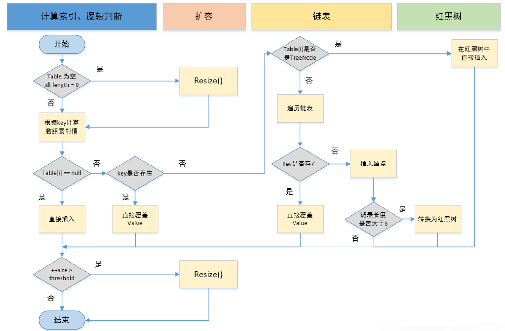
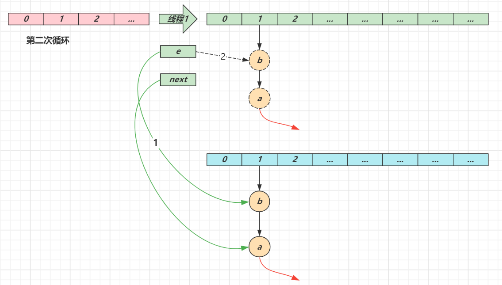

### 1、底层结构

> 相信大家都已经听过很多了，这里就不多阐述了，至于什么时候是数组，什么时候会变成链表，后续会讲解，别急！

| JDK版本 | 数据结构                  |
| ------- | ------------------------- |
| JDK1.7  | 数组+链表                 |
| JDK1.8  | 数组 + （链表 \| 红黑树） |


### 2、树化与退化

#### 1、为什么要用红黑树，为何一上来不树化，树化阈值为何是 8？

> 1. 红黑树用来避免 DoS 攻击，防止链表超长时性能下降，树化应当是偶然情况
> 2. hash 表的查找，更新的时间复杂度是 O(1)，而红黑树的查找，更新的时间复杂度是 O(log_2n)，TreeNode 占用空间也比普通 Node 的大，如非必要，尽量还是使用链表。
> 3. hash 值如果足够随机，则在 hash 表内按泊松分布，在负载因子 0.75 的情况下，长度超过 8 的链表出现概率是 0.00000006，选择 8 就是为了让树化几率足够小

#### 2、何时会树化？

> - 链表长度超过树化阈值；
>
> - 数组容量 >= 64

```java
static final int TREEIFY_THRESHOLD = 8;

/**
 * 当桶数组容量小于该值时，优先进行扩容，而不是树化
 */
static final int MIN_TREEIFY_CAPACITY = 64;

static final class TreeNode<K,V> extends LinkedHashMap.Entry<K,V> {
    TreeNode<K,V> parent;  // red-black tree links
    TreeNode<K,V> left;
    TreeNode<K,V> right;
    TreeNode<K,V> prev;    // needed to unlink next upon deletion
    boolean red;
    TreeNode(int hash, K key, V val, Node<K,V> next) {
        super(hash, key, val, next);
    }
}

/**
 * 将普通节点链表转换成树形节点链表
 */
final void treeifyBin(Node<K,V>[] tab, int hash) {
    int n, index; Node<K,V> e;
    // 桶数组容量小于 MIN_TREEIFY_CAPACITY，优先进行扩容而不是树化
    if (tab == null || (n = tab.length) < MIN_TREEIFY_CAPACITY)
        resize();
    else if ((e = tab[index = (n - 1) & hash]) != null) {
        // hd 为头节点（head），tl 为尾节点（tail）
        TreeNode<K,V> hd = null, tl = null;
        do {
            // 将普通节点替换成树形节点
            TreeNode<K,V> p = replacementTreeNode(e, null);
            if (tl == null)
                hd = p;
            else {
                p.prev = tl;
                tl.next = p;
            }
            tl = p;
        } while ((e = e.next) != null);  // 将普通链表转成由树形节点链表
        if ((tab[index] = hd) != null)
            // 将树形链表转换成红黑树
            hd.treeify(tab);
    }
}

TreeNode<K,V> replacementTreeNode(Node<K,V> p, Node<K,V> next) {
    return new TreeNode<>(p.hash, p.key, p.value, next);
}
```


#### 3、何时会退化树？

> 1. 在扩容时如果拆分树时，树元素个数 <= 6 则会退化链表
> 2. remove 树节点时，若 root、root.left、root.right、root.left.left 有一个为 null ，也会退化为链表

退化的源码：

```java
final Node<K,V> untreeify(HashMap<K,V> map) {
    Node<K,V> hd = null, tl = null;
    for (Node<K,V> q = this; q != null; q = q.next) {
        Node<K,V> p = map.replacementNode(q, null);
        if (tl == null)
            hd = p;
        else
            tl.next = p;
        tl = p;
    }
    return hd;
}
```

- 在扩容时如果拆分树时，树元素个数 <= 6 则会退化链表

````java
static final int UNTREEIFY_THRESHOLD = 6;

final void split(HashMap<K,V> map, Node<K,V>[] tab, int index, int bit) {
            TreeNode<K,V> b = this;
            // Relink into lo and hi lists, preserving order
            TreeNode<K,V> loHead = null, loTail = null;
            TreeNode<K,V> hiHead = null, hiTail = null;
            int lc = 0, hc = 0;
    		// 遍历计算树节点
            for (TreeNode<K,V> e = b, next; e != null; e = next) {
                next = (TreeNode<K,V>)e.next;
                e.next = null;
                if ((e.hash & bit) == 0) {
                    if ((e.prev = loTail) == null)
                        loHead = e;
                    else
                        loTail.next = e;
                    loTail = e;
                    ++lc;
                }
                else {
                    if ((e.prev = hiTail) == null)
                        hiHead = e;
                    else
                        hiTail.next = e;
                    hiTail = e;
                    ++hc;
                }
            }

            if (loHead != null) {
                //小于树节点6，则链化
                if (lc <= UNTREEIFY_THRESHOLD)
                    tab[index] = loHead.untreeify(map);
                else {
                    tab[index] = loHead;
                    if (hiHead != null) // (else is already treeified)
                        loHead.treeify(tab);
                }
            }
            if (hiHead != null) {
             //小于树节点6，则链化
                if (hc <= UNTREEIFY_THRESHOLD)
                    tab[index + bit] = hiHead.untreeify(map);
                else {
                    tab[index + bit] = hiHead;
                    if (loHead != null)
                        hiHead.treeify(tab);
                }
            }
}
````

- 移除节点时

```java
final void removeTreeNode(HashMap<K,V> map, Node<K,V>[] tab,
                          boolean movable) {
    int n;
    if (tab == null || (n = tab.length) == 0)
        return;
    int index = (n - 1) & hash;
    TreeNode<K,V> first = (TreeNode<K,V>)tab[index], root = first, rl;
    TreeNode<K,V> succ = (TreeNode<K,V>)next, pred = prev;
    if (pred == null)
        tab[index] = first = succ;
    else
        pred.next = succ;
    if (succ != null)
        succ.prev = pred;
    if (first == null)
        return;
    if (root.parent != null)
        root = root.root();
    // 若 root、root.left、root.right、root.left.left 有一个为 null ，也会退化为链表
    if (root == null
        || (movable
            && (root.right == null
                || (rl = root.left) == null
                || rl.left == null))) {
        tab[index] = first.untreeify(map);  // too small
        return;
    }
  ......
}
```


### 3、索引是如何计算的

#### 1、索引计算方法

先看源码

```java
static final int hash(Object key) {
    int h;
    return (key == null) ? 0 : (h = key.hashCode()) ^ (h >>> 16);
    //h >>> 16 表示取出h的高16位，具体计算这里就不讲解了
}
```

* 首先，如果对象我null，则返回0，否则计算对象的 hashCode()
* 再进行调用 HashMap 的 hash() 方法进行二次哈希
    * 二次 hash() 是为了综合高位数据，让哈希分布更为均匀
* 最后 & (capacity – 1) 得到索引，这里源码并没有看到

关于这里`(h = key.hashCode()) ^ (h >>> 16)`不懂的可以参考这篇讲解：https://blog.csdn.net/qq_42034205/article/details/90384772

#### 2、数组容量为何是 2 的 n 次幂

> 1. 计算索引时效率更高：如果是 2 的 n 次幂可以使用位与运算代替取模
> 2. 扩容时重新计算索引效率更高： hash &  == 0 的元素留在原来位置 ，否则新位置 = 旧位置 + oldCap

**注意**

* 二次 hash 是为了配合 **容量是 2 的 n 次幂** 这一设计前提，如果 hash 表的容量不是 2 的 n 次幂，则不必二次 hash
* **容量是 2 的 n 次幂** 这一设计计算索引效率更好，但 hash 的分散性就不好，需要二次 hash 来作为补偿，没有采用这一设计的典型例子是 `HashTable`

下面代码演示：容量是 2 的 n 次幂的设计来讲，二次 hash 非常重要

```java
public class Utils {
    /**
     * 交换元素
     * @param array
     * @param i
     * @param j
     */
    public static void swap(int[] array, int i, int j) {
        int t = array[i];
        array[i] = array[j];
        array[j] = t;
    }

    public static void shuffle(int[] array) {
        Random rnd = new Random();
        int size = array.length;
        for (int i = size; i > 1; i--) {
            swap(array, i - 1, rnd.nextInt(i));
        }
    }

    /**
     * 随机数组 演示 如果 hashCode 足够随机，容量是否是 2 的 n 次幂影响不大
     * @param n
     * @return
     */
    public static int[] randomArray(int n) {
        int lastVal = 1;
        Random r = new Random();
        int[] array = new int[n];
        for (int i = 0; i < n; i++) {
            int v = lastVal + Math.max(r.nextInt(10), 1);
            array[i] = v;
            lastVal = v;
        }
        shuffle(array);
        return array;
    }

    /**
     * 如果 hashCode 偶数的多，容量是 2 的 n 次幂会导致分布不均匀
     * @param n
     * @return
     */
    public static int[] evenArray(int n) {
        int[] array = new int[n];
        for (int i = 0; i < n; i++) {
            array[i] = i * 2;
        }
        return array;
    }

    /**
     * 如果 hashCode 低位一样的多，容量是 2 的 n 次幂会导致分布不均匀
     * @param n
     * @return
     */
    public static int[] lowSameArray(int n) {
        int[] array = new int[n];
        Random r = new Random();
        for (int i = 0; i < n; i++) {
            array[i] = r.nextInt() & 0x7FFF0002;
        }
        return array;
    }

    public static void main(String[] args) {
        System.out.println(Arrays.toString(randomArray(10)));
        System.out.println(Arrays.toString(lowSameArray(10)));
        System.out.println(Arrays.toString(evenArray(10)));
    }
}
//[30, 53, 12, 41, 24, 23, 17, 9, 45, 35]
//[334561280, 277741568, 2014380034, 388300800, 938082306, 2136473600, 1072037890, 1187053570, 320667648, 700907520]
//[0, 2, 4, 6, 8, 10, 12, 14, 16, 18]
```


### 4、put 与扩容

先看下面流程



1. HashMap 是懒惰创建数组的，首次使用才创建数组
2. 计算索引（桶下标）
3. 如果桶下标还没人占用，创建 Node 占位返回
4. 如果桶下标已经有人占用
    1. 已经是 TreeNode 走红黑树的添加或更新逻辑
    2. 是普通 Node，走链表的添加或更新逻辑，如果链表长度超过树化阈值，走树化逻辑
5. 返回前检查容量是否超过阈值，一旦超过进行扩容

```java
public V put(K key, V value) {
    return putVal(hash(key), key, value, false, true);
}

final V putVal(int hash, K key, V value, boolean onlyIfAbsent,
               boolean evict) {
    Node<K,V>[] tab; Node<K,V> p; int n, i;
    // 初始化桶数组 table，table 被延迟到插入新数据时再进行初始化
    if ((tab = table) == null || (n = tab.length) == 0)
        n = (tab = resize()).length;
    // 如果桶中不包含键值对节点引用，则将新键值对节点的引用存入桶中即可
    if ((p = tab[i = (n - 1) & hash]) == null)
        tab[i] = newNode(hash, key, value, null);
    else {
        Node<K,V> e; K k;
        // 如果键的值以及节点 hash 等于链表中的第一个键值对节点时，则将 e 指向该键值对
        if (p.hash == hash &&
            ((k = p.key) == key || (key != null && key.equals(k))))
            e = p;
            
        // 如果桶中的引用类型为 TreeNode，则调用红黑树的插入方法
        else if (p instanceof TreeNode)  
            e = ((TreeNode<K,V>)p).putTreeVal(this, tab, hash, key, value);
        else {
            // 对链表进行遍历，并统计链表长度
            for (int binCount = 0; ; ++binCount) {
                // 链表中不包含要插入的键值对节点时，则将该节点接在链表的最后
                if ((e = p.next) == null) {
                    p.next = newNode(hash, key, value, null);
                    // 如果链表长度大于或等于树化阈值，则进行树化操作
                    if (binCount >= TREEIFY_THRESHOLD - 1) // -1 for 1st
                        treeifyBin(tab, hash);
                    break;
                }
                
                // 条件为 true，表示当前链表包含要插入的键值对，终止遍历
                if (e.hash == hash &&
                    ((k = e.key) == key || (key != null && key.equals(k))))
                    break;
                p = e;
            }
        }
        
        // 判断要插入的键值对是否存在 HashMap 中
        if (e != null) { // existing mapping for key
            V oldValue = e.value;
            // onlyIfAbsent 表示是否仅在 oldValue 为 null 的情况下更新键值对的值
            if (!onlyIfAbsent || oldValue == null)
                e.value = value;
            afterNodeAccess(e);
            return oldValue;
        }
    }
    ++modCount;
    // 键值对数量超过阈值时，则进行扩容
    if (++size > threshold)
        resize();
    afterNodeInsertion(evict);
    return null;
}
```

#### 如何扩容的呢？

|   变量    |      含义      |
| :-------: | :------------: |
|  oldCap   |  旧桶数组容量  |
|  oldThr   |     旧阈值     |
|  newCap   | 新的桶数组容量 |
|  newThr   |    新的阈值    |
| threshold |      阈值      |


```java
final Node<K,V>[] resize() {
    Node<K,V>[] oldTab = table;
    int oldCap = (oldTab == null) ? 0 : oldTab.length;
    int oldThr = threshold;
    int newCap, newThr = 0;
    //如果table不为空
    if (oldCap > 0) {
        //table的长度大于最大容量，则不再记性扩容，返回原table
        if (oldCap >= MAXIMUM_CAPACITY) {
            threshold = Integer.MAX_VALUE;
            return oldTab;
        }
        // 按旧容量和阈值的2倍 计算新容量和阈值的大小
        else if ((newCap = oldCap << 1) < MAXIMUM_CAPACITY &&
                 oldCap >= DEFAULT_INITIAL_CAPACITY)
            newThr = oldThr << 1; // double threshold
    }
    //threshold > 0，且桶数组未被初始化
    else if (oldThr > 0) // initial capacity was placed in threshold
    // this.threshold = tableSizeFor(initialCapacity);
    //将initialCapacity暂存
        newCap = oldThr;
    else {               // zero initial threshold signifies using defaults
    //  调用无参构造方法时，桶数组容量为默认容量， 阈值为默认容量与默认负载因子乘积
        newCap = DEFAULT_INITIAL_CAPACITY;
        newThr = (int)(DEFAULT_LOAD_FACTOR * DEFAULT_INITIAL_CAPACITY);
    }
    //如果新阈值为0，按阈值计算公式进行计算
    if (newThr == 0) {
        float ft = (float)newCap * loadFactor;
        newThr = (newCap < MAXIMUM_CAPACITY && ft < (float)MAXIMUM_CAPACITY ?
                  (int)ft : Integer.MAX_VALUE);
    }
    threshold = newThr;
    @SuppressWarnings({"rawtypes","unchecked"})
    // 创建新的桶数组，并初始化容量
    Node<K,V>[] newTab = (Node<K,V>[])new Node[newCap];
    table = newTab;
    if (oldTab != null) {
    //如果旧桶数组不为空，则遍历到新桶数组中
        for (int j = 0; j < oldCap; ++j) {
            Node<K,V> e;
            if ((e = oldTab[j]) != null) {
                oldTab[j] = null;
                if (e.next == null)
                    newTab[e.hash & (newCap - 1)] = e;
                else if (e instanceof TreeNode)
                //  重新映射时，需要对红黑树进行拆分
                    ((TreeNode<K,V>)e).split(this, newTab, j, oldCap);
                else { // preserve order
                    Node<K,V> loHead = null, loTail = null;
                    Node<K,V> hiHead = null, hiTail = null;
                    Node<K,V> next;
                    // 遍历链表，并将链表节点按原顺序进行分组
                    do {
                        next = e.next;
                        if ((e.hash & oldCap) == 0) {
                            if (loTail == null)
                                loHead = e;
                            else
                                loTail.next = e;
                            loTail = e;
                        }
                        else {
                            if (hiTail == null)
                                hiHead = e;
                            else
                                hiTail.next = e;
                            hiTail = e;
                        }
                    } while ((e = next) != null);
                    // 将分组后的链表映射到新桶中
                    if (loTail != null) {
                        loTail.next = null;
                        newTab[j] = loHead;
                    }
                    if (hiTail != null) {
                        hiTail.next = null;
                        newTab[j + oldCap] = hiHead;
                    }
                }
            }
        }
    }
    return newTab;
}
```

1. 计算新桶数组的容量 newCap 和新阈值 newThr
2. 根据计算出的 newCap 创建新的桶数组，桶数组 table 也是在这里进行初始化的
3. 将键值对节点重新映射到新的桶数组里。如果节点是 TreeNode 类型，则需要拆分红黑树。如果是普通节点，则节点按原顺序进行分组。

#### 加载因子为何默认是 0.75f？

> 1. 在空间占用与查询时间之间取得较好的权衡
> 2. 大于这个值，空间节省了，但链表就会比较长影响性能
> 3. 小于这个值，冲突减少了，但扩容就会更频繁，空间占用也更多

### 5、并发问题

**扩容死链（1.7 会存在）**

1.7 源码如下：

```java
void transfer(Entry[] newTable, boolean rehash) {
    int newCapacity = newTable.length;
    for (Entry<K,V> e : table) {
        while(null != e) {
            Entry<K,V> next = e.next;
            if (rehash) {
                e.hash = null == e.key ? 0 : hash(e.key);
            }
            int i = indexFor(e.hash, newCapacity);
            e.next = newTable[i];
            newTable[i] = e;
            e = next;
        }
    }
}
```

* e 和 next 都是局部变量，用来指向当前节点和下一个节点
* 线程1（绿色）的临时变量 e 和 next 刚引用了这俩节点，还未来得及移动节点，发生了线程切换，由线程2（蓝色）完成扩容和迁移


* 线程2 扩容完成，由于头插法，链表顺序颠倒。但线程1 的临时变量 e 和 next 还引用了这俩节点，还要再来一遍迁移


* 第一次循环
    * 循环接着线程切换前运行，注意此时 e 指向的是节点 a，next 指向的是节点 b
    * e 头插 a 节点，注意图中画了两份 a 节点，但事实上只有一个（为了不让箭头特别乱画了两份）
    * 当循环结束是 e 会指向 next 也就是 b 节点


* 第二次循环
    * next 指向了节点 a
    * e 头插节点 b
    * 当循环结束时，e 指向 next 也就是节点 a



* 第三次循环
    * next 指向了 null
    * e 头插节点 a，**a 的 next 指向了 b**（之前 a.next 一直是 null），b 的 next 指向 a，死链已成
    * 当循环结束时，e 指向 next 也就是 null，因此第四次循环时会正常退出


**数据错乱（1.7，1.8 都会存在）**

```java
public class HashMapMissData {
    public static void main(String[] args) throws InterruptedException {

        HashMap<String, Object> map = new HashMap<>();
        Thread t1 = new Thread(() -> {
            map.put("a", new Object()); // 97  => 1
        }, "t1");

        Thread t2 = new Thread(() -> {
            map.put("1", new Object()); // 49 => 1
        }, "t2");

        t1.start();
        t2.start();
        t1.join();
        t2.join();
        System.out.println(map);
    }
}
```

操作：多线程情况下，t1线程在put的时候，此时运行t2的线程，完成put操作，t1 put操作就会丢失数据

### 6、key 的设计

> **key 的设计要求**
>
> 1. HashMap 的 key 可以为 null，但 Map 的其他实现则不然
> 2. 作为 key 的对象，必须实现 hashCode 和 equals，并且 key 的内容不能修改（不可变）
> 3. key 的 hashCode 应该有良好的散列性

如果 key 可变，例如修改了 age 会导致再次查询时查询不到

```java
public class HashMapMutableKey {
    public static void main(String[] args) {
        HashMap<Student, Object> map = new HashMap<>();
        Student stu = new Student("张三", 18);
        map.put(stu, new Object());

        System.out.println(map.get(stu));

        stu.age = 19;
        System.out.println(map.get(stu));
    }

    static class Student {
        String name;
        int age;

        public Student(String name, int age) {
            this.name = name;
            this.age = age;
        }

        public String getName() {
            return name;
        }

        public void setName(String name) {
            this.name = name;
        }

        public int getAge() {
            return age;
        }

        public void setAge(int age) {
            this.age = age;
        }

        @Override
        public boolean equals(Object o) {
            if (this == o) return true;
            if (o == null || getClass() != o.getClass()) return false;
            Student student = (Student) o;
            return age == student.age && Objects.equals(name, student.name);
        }

        @Override
        public int hashCode() {
            return Objects.hash(name, age);
        }
    }
}
//java.lang.Object@63961c42
//null
```


**String 对象的 hashCode() 设计**

* 目标是达到较为均匀的散列效果，每个字符串的 hashCode 足够独特
* 字符串中的每个字符都可以表现为一个数字，称为 $S_i$，其中 i 的范围是 0 ~ n - 1
* 散列公式为： $S_0∗31^{(n-1)}+ S_1∗31^{(n-2)}+ … S_i ∗ 31^{(n-1-i)}+ …S_{(n-1)}∗31^0$
* 31 代入公式有较好的散列特性，并且 31 * h 可以被优化为
    * 即 $32 ∗h -h $
    * 即 $2^5  ∗h -h$
    * 即 $h≪5  -h$
