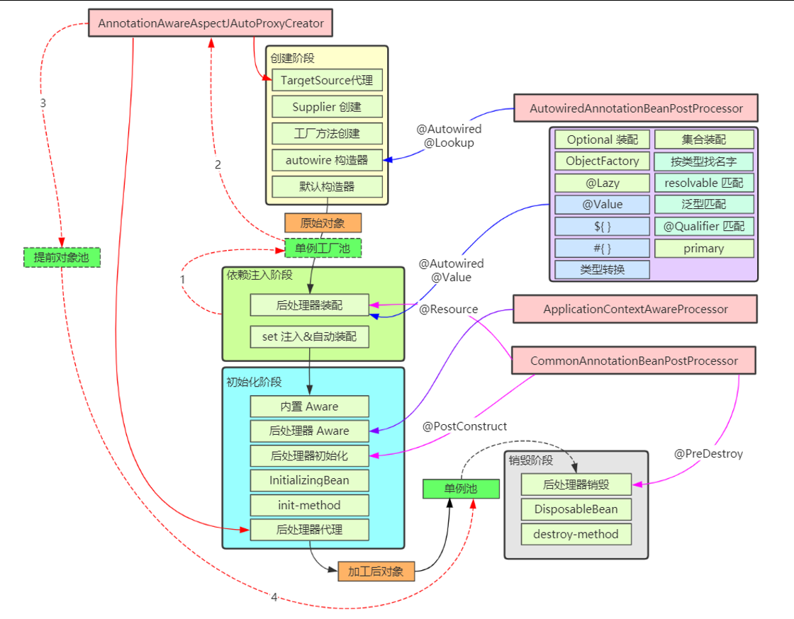

bean 的生命周期从调用 beanFactory 的 getBean 开始，到这个 bean 被销毁，可以总结为以下七个阶段：

1. 处理名称，检查缓存
2. 处理父子容器
3. 处理 dependsOn
4. 选择 scope 策略
5. 创建 bean
6. 类型转换处理
7. 销毁 bean

```java
protected <T> T doGetBean(String name, @Nullable Class<T> requiredType, @Nullable Object[] args, boolean typeCheckOnly) throws BeansException {
    //1.处理bean名称解析
    String beanName = this.transformedBeanName(name);
    Object sharedInstance = this.getSingleton(beanName);
    Object beanInstance;
    //从单例缓存中判断是否存在这个示例，可能来源于Spring启动的时候，也有可能来源于Spring 启动时初始化了非懒加载的对象
    if (sharedInstance != null && args == null) {
        if (this.logger.isTraceEnabled()) {
            if (this.isSingletonCurrentlyInCreation(beanName)) {
                this.logger.trace("Returning eagerly cached instance of singleton bean '" + beanName + "' that is not fully initialized yet - a consequence of a circular reference");
            } else {
                this.logger.trace("Returning cached instance of singleton bean '" + beanName + "'");
            }
        }
        //如果单例工厂存在这个bean，则通过调用getObject方法获取bean实例
        beanInstance = this.getObjectForBeanInstance(sharedInstance, name, beanName, (RootBeanDefinition)null);
    } else {
        //如果当前线程存在这个实例，则抛出异常
        if (this.isPrototypeCurrentlyInCreation(beanName)) {
            throw new BeanCurrentlyInCreationException(beanName);
        }
        //2.获取当前bean工厂的父工厂，然后获取bean，此处是递归查找
        BeanFactory parentBeanFactory = this.getParentBeanFactory();
        if (parentBeanFactory != null && !this.containsBeanDefinition(beanName)) {
            String nameToLookup = this.originalBeanName(name);
            if (parentBeanFactory instanceof AbstractBeanFactory) {
                
                return ((AbstractBeanFactory)parentBeanFactory).doGetBean(nameToLookup, requiredType, args, typeCheckOnly);
            }

            if (args != null) {
                //调用父工厂的getBean方法
                return parentBeanFactory.getBean(nameToLookup, args);
            }

            if (requiredType != null) {
                //根据类型获取bean
                return parentBeanFactory.getBean(nameToLookup, requiredType);
            }

            return parentBeanFactory.getBean(nameToLookup);
        }
        //如果参数为检查类型，则设置名称为beanName的bean实例已经创建的标识
        if (!typeCheckOnly) {
            this.markBeanAsCreated(beanName);
        }

        StartupStep beanCreation = this.applicationStartup.start("spring.beans.instantiate").tag("beanName", name);

        try {
            if (requiredType != null) {
                beanCreation.tag("beanType", requiredType::toString);
            }

            RootBeanDefinition mbd = this.getMergedLocalBeanDefinition(beanName);
            this.checkMergedBeanDefinition(mbd, beanName, args);
            //3.获取bean的依赖属性
            String[] dependsOn = mbd.getDependsOn();
            String[] var12;
            if (dependsOn != null) {
                var12 = dependsOn;
                int var13 = dependsOn.length;

                for(int var14 = 0; var14 < var13; ++var14) {
                    String dep = var12[var14];
                    //检查是否存在循环依赖
                    if (this.isDependent(beanName, dep)) {
                        throw new BeanCreationException(mbd.getResourceDescription(), beanName, "Circular depends-on relationship between '" + beanName + "' and '" + dep + "'");
                    }
                    //向注册器中注册这个依赖的bean
                    this.registerDependentBean(dep, beanName);

                    try {
                        //获取并解决当前bean
                        this.getBean(dep);
                    } catch (NoSuchBeanDefinitionException var31) {
                        throw new BeanCreationException(mbd.getResourceDescription(), beanName, "'" + beanName + "' depends on missing bean '" + dep + "'", var31);
                    }
                }
            }
            //根据 scope 处理当前bean
            if (mbd.isSingleton()) {
                sharedInstance = this.getSingleton(beanName, () -> {
                    try {
                        return this.createBean(beanName, mbd, args);
                    } catch (BeansException var5) {
                        this.destroySingleton(beanName);
                        throw var5;
                    }
                });
                beanInstance = this.getObjectForBeanInstance(sharedInstance, name, beanName, mbd);
            } else if (mbd.isPrototype()) {
                var12 = null;

                Object prototypeInstance;
                try {
                    this.beforePrototypeCreation(beanName);
                    prototypeInstance = this.createBean(beanName, mbd, args);
                } finally {
                    this.afterPrototypeCreation(beanName);
                }

                beanInstance = this.getObjectForBeanInstance(prototypeInstance, name, beanName, mbd);
            } else {
                String scopeName = mbd.getScope();
                if (!StringUtils.hasLength(scopeName)) {
                    throw new IllegalStateException("No scope name defined for bean '" + beanName + "'");
                }
                //5.类型转换
                Scope scope = (Scope)this.scopes.get(scopeName);
                if (scope == null) {
                    throw new IllegalStateException("No Scope registered for scope name '" + scopeName + "'");
                }

                try {
                    Object scopedInstance = scope.get(beanName, () -> {
                        this.beforePrototypeCreation(beanName);

                        Object var4;
                        try {
                            var4 = this.createBean(beanName, mbd, args);
                        } finally {
                            this.afterPrototypeCreation(beanName);
                        }

                        return var4;
                    });
                    beanInstance = this.getObjectForBeanInstance(scopedInstance, name, beanName, mbd);
                } catch (IllegalStateException var30) {
                    throw new ScopeNotActiveException(beanName, scopeName, var30);
                }
            }
        } catch (BeansException var32) {
            beanCreation.tag("exception", var32.getClass().toString());
            beanCreation.tag("message", String.valueOf(var32.getMessage()));
            //清楚创建bean
            this.cleanupAfterBeanCreationFailure(beanName);
            throw var32;
        } finally {
            beanCreation.end();
        }
    }

    return this.adaptBeanInstance(name, beanInstance, requiredType);
}
```


### 1. 处理名称，检查缓存

```java
protected <T> T doGetBean(String name, @Nullable Class<T> requiredType, @Nullable Object[] args, boolean typeCheckOnly) throws BeansException {
    //1.处理bean名称解析
    String beanName = this.transformedBeanName(name);
    //检查是否存在缓存中，一级二级三级
    Object sharedInstance = this.getSingleton(beanName);
    ......
}
```

**处理名称**

> 这一步会处理别名，将别名解析为实际名称，通过调用`transformedBeanName`处理bean，然后transformedBeanName通过调用`BeanFactoryUtils.transformedBeanName(name)`对 FactoryBean 也会特殊处理，如果以 & 开头表示要获取 FactoryBean 本身，否则表示要获取其产品

```java
public abstract class BeanFactoryUtils {
    //对bean名称进行处理
    public static String transformedBeanName(String name) {
        Assert.notNull(name, "'name' must not be null");
        return !name.startsWith("&") ? name : (String)transformedBeanNameCache.computeIfAbsent(name, (beanName) -> {
            do {
                beanName = beanName.substring("&".length());
            } while(beanName.startsWith("&"));

            return beanName;
        });
    }
}
```

**检查缓存**

> 通过调用`getSingleton`方法，这里针对单例对象会检查一级、二级、三级缓存
>
> * singletonFactories 三级缓存，存放单例工厂对象
> * earlySingletonObjects 二级缓存，存放单例工厂的产品对象
    >   * 如果发生循环依赖，产品是代理；无循环依赖，产品是原始对象
> * singletonObjects 一级缓存，存放单例成品对象

```java
//singletonObjects 一级缓存，存放单例成品对象
private final Map<String, Object> singletonObjects = new ConcurrentHashMap(256);
//singletonFactories 三级缓存，存放单例工厂对象
private final Map<String, ObjectFactory<?>> singletonFactories = new HashMap(16);
//earlySingletonObjects 二级缓存，存放单例工厂的产品对象
private final Map<String, Object> earlySingletonObjects = new ConcurrentHashMap(16);
@Nullable
protected Object getSingleton(String beanName, boolean allowEarlyReference) {
    Object singletonObject = this.singletonObjects.get(beanName);
    if (singletonObject == null && this.isSingletonCurrentlyInCreation(beanName)) {
        singletonObject = this.earlySingletonObjects.get(beanName);
        if (singletonObject == null && allowEarlyReference) {
            synchronized(this.singletonObjects) {
                singletonObject = this.singletonObjects.get(beanName);
                if (singletonObject == null) {
                    singletonObject = this.earlySingletonObjects.get(beanName);
                    if (singletonObject == null) {
                        ObjectFactory<?> singletonFactory = (ObjectFactory)this.singletonFactories.get(beanName);
                        if (singletonFactory != null) {
                            singletonObject = singletonFactory.getObject();
                            this.earlySingletonObjects.put(beanName, singletonObject);
                            this.singletonFactories.remove(beanName);
                        }
                    }
                }
            }
        }
    }
    return singletonObject;
}
```

### **2. 处理父子容器**

* 如果当前容器根据名字找不到这个 bean，此时若父容器存在，则执行父容器的 getBean 流程
* 父子容器的 bean 名称可以重复

### **3. 处理 dependsOn**

* 如果当前 bean 有通过 dependsOn 指定了非显式依赖的 bean，这一步会提前创建这些 dependsOn 的 bean
* 所谓非显式依赖，就是指两个 bean 之间不存在直接依赖关系，但需要控制它们的创建先后顺序

### **4. 选择 scope 策略**

```java
if (mbd.isSingleton()) {
    //如果是单例类型的bean,通过调用createBean方法尽心创建，
    sharedInstance = this.getSingleton(beanName, () -> {
        try {
            return this.createBean(beanName, mbd, args);
        } catch (BeansException var5) {
            //如果创建bean发生异常，则由于当前bean可能被添加在单例池中，调用销毁方法销毁当前bean
            this.destroySingleton(beanName);
            throw var5;
        }
    });
    beanInstance = this.getObjectForBeanInstance(sharedInstance, name, beanName, mbd);
} else if (mbd.isPrototype()) {
    var12 = null;
    //如果当前bean是多例的，则实时创建
    Object prototypeInstance;
    try {
        //在threadlocal中设置这个bean的标志位，防止同一个线程重复创建bean造成资源浪费
        this.beforePrototypeCreation(beanName);
        //创建bean实例
        prototypeInstance = this.createBean(beanName, mbd, args);
    } finally {
        //清除threadlocal标志位
        this.afterPrototypeCreation(beanName);
    }

    beanInstance = this.getObjectForBeanInstance(prototypeInstance, name, beanName, mbd);
} else {
    //处理bean的作用范围为 request、session的bean
    String scopeName = mbd.getScope();
    if (!StringUtils.hasLength(scopeName)) {
        throw new IllegalStateException("No scope name defined for bean '" + beanName + "'");
    }

    Scope scope = (Scope)this.scopes.get(scopeName);
    if (scope == null) {
        throw new IllegalStateException("No Scope registered for scope name '" + scopeName + "'");
    }

    try {
        Object scopedInstance = scope.get(beanName, () -> {
            this.beforePrototypeCreation(beanName);

            Object var4;
            try {
                var4 = this.createBean(beanName, mbd, args);
            } finally {
                this.afterPrototypeCreation(beanName);
            }

            return var4;
        });
        beanInstance = this.getObjectForBeanInstance(scopedInstance, name, beanName, mbd);
    } catch (IllegalStateException var30) {
        throw new ScopeNotActiveException(beanName, scopeName, var30);
    }
}
```

源码部分已经分析完了，接下来我们看看对于Scope的生命周期进行讨论？

前面一节我们讲了Spring refresh的过程，在解析源码的时候发现调用refresh方法会调用getBean方法从而创建bean，通过下面代码测试看看？

```java
public class TestScope {
    public static void main(String[] args) {
        testSingletonScope();
        System.out.println("---------------------------------");
        testRequestScope();
        System.out.println("---------------------------------");
        testPrototypeScope();
    }

    /**
     *  单例 bean 从 refresh 被创建, 到 close 被销毁, BeanFactory 会记录哪些 bean 要调用销毁方法
     */
    private static void testSingletonScope() {
        GenericApplicationContext context = new GenericApplicationContext();
        context.registerBean("bean1", Bean1.class);
        context.registerBean(CommonAnnotationBeanPostProcessor.class);
        context.refresh(); // 调用getBean
        context.close(); // 调用各自的销毁方法
    }

    /**
     * 多例 bean 从首次 getBean 被创建, 到调用 BeanFactory 的 destroyBean 被销毁
     */
    private static void testPrototypeScope() {
        GenericApplicationContext context = new GenericApplicationContext();
        context.registerBean("bean1", Bean1.class, bd -> bd.setScope("prototype"));
        context.registerBean(CommonAnnotationBeanPostProcessor.class);
        context.refresh();

        Bean1 bean = context.getBean(Bean1.class);
        // 没谁记录该 bean 要调用销毁方法, 需要我们自行调用
        context.getDefaultListableBeanFactory().destroyBean(bean);

        context.close();
    }

    /**
     *  request bean 从首次 getBean 被创建, 到 request 结束前被销毁
     */
    private static void testRequestScope() {
        GenericApplicationContext context = new GenericApplicationContext();
        context.getDefaultListableBeanFactory().registerScope("request", new RequestScope());
        context.registerBean("bean1", Bean1.class, bd -> bd.setScope("request"));
        context.registerBean(CommonAnnotationBeanPostProcessor.class);
        context.refresh();

        for (int i = 0; i < 2; i++) {
            new Thread(() -> {
                MockHttpServletRequest request = new MockHttpServletRequest();
                // 每个 webRequest 对象会记录哪些 bean 要调用销毁方法
                ServletWebRequest webRequest = new ServletWebRequest(request);
                RequestContextHolder.setRequestAttributes(webRequest);

                Bean1 bean = context.getBean(Bean1.class);
                LoggerUtils.get().debug("{}", bean);
                LoggerUtils.get().debug("{}", request.getAttribute("bean1"));

                // request 请求结束前调用这些销毁方法
                webRequest.requestCompleted();
            }).start();
        }

    }

    static class Bean1 {
        @PostConstruct
        public void init() {
            LoggerUtils.get().debug("{} - init", this);
        }

        @PreDestroy
        public void destroy() {
            LoggerUtils.get().debug("{} - destroy", this);
        }
    }
}
```

- 对于测试单例bean

  ```
  20:40:25.907 [main] DEBUG org.springframework.context.support.GenericApplicationContext - Refreshing org.springframework.context.support.GenericApplicationContext@5aaa6d82
  20:40:25.974 [main] DEBUG org.springframework.beans.factory.support.DefaultListableBeanFactory - Creating shared instance of singleton bean 'org.springframework.context.annotation.CommonAnnotationBeanPostProcessor'
  20:40:26.034 [main] DEBUG org.springframework.beans.factory.support.DefaultListableBeanFactory - Creating shared instance of singleton bean 'bean1'
  20:40:26.072 [main] DEBUG G - com.xiaobear.sourcecode.framework.spring.bean.TestScope$Bean1@6325a3ee - init
  20:40:26.131 [main] DEBUG org.springframework.context.support.GenericApplicationContext - Closing org.springframework.context.support.GenericApplicationContext@5aaa6d82, started on Sun Dec 18 20:40:25 CST 2022
  20:40:26.132 [main] DEBUG G - com.xiaobear.sourcecode.framework.spring.bean.TestScope$Bean1@6325a3ee - destroy
  ```

  从日志中可以看到，调用`refresh`方法的时候就会创建bean，而调动`close`方法的时候，就会调用自身的销毁方法

- 测试多例bean

  ```
  20:48:45.742 [main] DEBUG org.springframework.context.support.GenericApplicationContext - Refreshing org.springframework.context.support.GenericApplicationContext@5aaa6d82
  20:48:45.804 [main] DEBUG org.springframework.beans.factory.support.DefaultListableBeanFactory - Creating shared instance of singleton bean 'org.springframework.context.annotation.CommonAnnotationBeanPostProcessor'
  20:48:45.948 [main] DEBUG G - com.xiaobear.sourcecode.framework.spring.bean.TestScope$Bean1@2833cc44 - init
  20:48:45.951 [main] DEBUG G - com.xiaobear.sourcecode.framework.spring.bean.TestScope$Bean1@2833cc44 - destroy
  20:48:45.957 [main] DEBUG org.springframework.context.support.GenericApplicationContext - Closing org.springframework.context.support.GenericApplicationContext@5aaa6d82, started on Sun Dec 18 20:48:45 CST 2022
  ```

  多例测试bean，从上面代码中可以看出，我们多调用了一个方法`destroyBean`，因为没有谁去记录该 bean，要调用销毁方法, 需要我们自行调用

- 测试request Bean

  ```
  21:09:41.477 [Thread-0] DEBUG F - com.xiaobear.sourcecode.framework.spring.bean.TestScope$Bean1@7390e871 - init
  21:09:41.477 [Thread-1] DEBUG A - com.xiaobear.sourcecode.framework.spring.bean.TestScope$Bean1@bdd9a7f - init
  21:09:41.480 [Thread-1] DEBUG A - com.xiaobear.sourcecode.framework.spring.bean.TestScope$Bean1@bdd9a7f
  21:09:41.480 [Thread-0] DEBUG F - com.xiaobear.sourcecode.framework.spring.bean.TestScope$Bean1@7390e871
  21:09:41.480 [Thread-1] DEBUG A - com.xiaobear.sourcecode.framework.spring.bean.TestScope$Bean1@bdd9a7f
  21:09:41.480 [Thread-0] DEBUG F - com.xiaobear.sourcecode.framework.spring.bean.TestScope$Bean1@7390e871
  21:09:41.480 [Thread-0] DEBUG F - com.xiaobear.sourcecode.framework.spring.bean.TestScope$Bean1@7390e871 - destroy
  21:09:41.480 [Thread-1] DEBUG A - com.xiaobear.sourcecode.framework.spring.bean.TestScope$Bean1@bdd9a7f - destroy
  ```

  对于request bean，我们模拟了多线程同时访问，请求结束时，需要调用`requestCompleted`方法来销毁bean

**总结**：

* 对于 singleton scope，首先到单例池去获取 bean，如果有则直接返回，没有再进入创建流程
* 对于 prototype scope表示不缓存bean，每次都会进入创建流程
* 对于自定义 scope，例如 request，首先到 request 域获取 bean，如果有则直接返回，没有再进入创建流程

### 5、创建 bean

```java
protected Object createBean(String beanName, RootBeanDefinition mbd, @Nullable Object[] args) throws BeanCreationException {
    if (this.logger.isTraceEnabled()) {
        this.logger.trace("Creating instance of bean '" + beanName + "'");
    }

    RootBeanDefinition mbdToUse = mbd;
    //从bean的描述信息中解析出bean的class,为创建实例做准备，并复制一个新的RootBeanDefinition对象来使用，防止多线程篡改原来的对象
    Class<?> resolvedClass = this.resolveBeanClass(mbd, beanName, new Class[0]);
    if (resolvedClass != null && !mbd.hasBeanClass() && mbd.getBeanClassName() != null) {
        mbdToUse = new RootBeanDefinition(mbd);
        mbdToUse.setBeanClass(resolvedClass);
    }
    //为防止重写
    try {
        mbdToUse.prepareMethodOverrides();
    } catch (BeanDefinitionValidationException var9) {
        throw new BeanDefinitionStoreException(mbdToUse.getResourceDescription(), beanName, "Validation of method overrides failed", var9);
    }

    Object beanInstance;
    try {
        //获取并调用bean的后置处理器的子接口
        beanInstance = this.resolveBeforeInstantiation(beanName, mbdToUse);
        //如果bean实例不为空，说明后置处理器实例化了当前bean，则不再创建bean，也说明了bean的创建不全是反射实现的，后置处理器也可
        if (beanInstance != null) {
            return beanInstance;
        }
    } catch (Throwable var10) {
        throw new BeanCreationException(mbdToUse.getResourceDescription(), beanName, "BeanPostProcessor before instantiation of bean failed", var10);
    }

    try {
        //正式创建bean
        beanInstance = this.doCreateBean(beanName, mbdToUse, args);
        if (this.logger.isTraceEnabled()) {
            this.logger.trace("Finished creating instance of bean '" + beanName + "'");
        }

        return beanInstance;
    } catch (ImplicitlyAppearedSingletonException | BeanCreationException var7) {
        throw var7;
    } catch (Throwable var8) {
        throw new BeanCreationException(mbdToUse.getResourceDescription(), beanName, "Unexpected exception during bean creation", var8);
    }
}
/**
*bean的创建
**/
protected Object doCreateBean(String beanName, RootBeanDefinition mbd, @Nullable Object[] args) throws BeanCreationException {
    BeanWrapper instanceWrapper = null;
    //如果bean是单例的，并且在单例Map（用来存储单例bean的集合）已经存在，则不再实例化bean，若不存在，则实例化后添加到map中
    if (mbd.isSingleton()) {
        instanceWrapper = (BeanWrapper)this.factoryBeanInstanceCache.remove(beanName);
    }

    if (instanceWrapper == null) {
        //创建bean实例
        instanceWrapper = this.createBeanInstance(beanName, mbd, args);
    }

    Object bean = instanceWrapper.getWrappedInstance();
    Class<?> beanType = instanceWrapper.getWrappedClass();
    if (beanType != NullBean.class) {
        mbd.resolvedTargetType = beanType;
    }
    //调用这个bean的merge bean的后置处理器方法，例如检查自动注入时的成员变量
    synchronized(mbd.postProcessingLock) {
        if (!mbd.postProcessed) {
            try {
                this.applyMergedBeanDefinitionPostProcessors(mbd, beanType, beanName);
            } catch (Throwable var17) {
                throw new BeanCreationException(mbd.getResourceDescription(), beanName, "Post-processing of merged bean definition failed", var17);
            }

            mbd.postProcessed = true;
        }
    }
    //创建该单例bean实例，并解决循环依赖问题
    boolean earlySingletonExposure = mbd.isSingleton() && this.allowCircularReferences && this.isSingletonCurrentlyInCreation(beanName);
    if (earlySingletonExposure) {
        if (this.logger.isTraceEnabled()) {
            this.logger.trace("Eagerly caching bean '" + beanName + "' to allow for resolving potential circular references");
        }

        this.addSingletonFactory(beanName, () -> {
            return this.getEarlyBeanReference(beanName, mbd, bean);
        });
    }

    Object exposedObject = bean;

    try {
        //处理bean的相关属性和注入
        this.populateBean(beanName, mbd, instanceWrapper);
        //初始化当前bean
        exposedObject = this.initializeBean(beanName, exposedObject, mbd);
    } catch (Throwable var18) {
        if (var18 instanceof BeanCreationException && beanName.equals(((BeanCreationException)var18).getBeanName())) {
            throw (BeanCreationException)var18;
        }

        throw new BeanCreationException(mbd.getResourceDescription(), beanName, "Initialization of bean failed", var18);
    }
    //为bean的循环依赖的处理及提早注册实现的部分
    if (earlySingletonExposure) {
        Object earlySingletonReference = this.getSingleton(beanName, false);
        if (earlySingletonReference != null) {
            if (exposedObject == bean) {
                exposedObject = earlySingletonReference;
            } else if (!this.allowRawInjectionDespiteWrapping && this.hasDependentBean(beanName)) {
                String[] dependentBeans = this.getDependentBeans(beanName);
                Set<String> actualDependentBeans = new LinkedHashSet(dependentBeans.length);
                String[] var12 = dependentBeans;
                int var13 = dependentBeans.length;

                for(int var14 = 0; var14 < var13; ++var14) {
                    String dependentBean = var12[var14];
                    if (!this.removeSingletonIfCreatedForTypeCheckOnly(dependentBean)) {
                        actualDependentBeans.add(dependentBean);
                    }
                }

                if (!actualDependentBeans.isEmpty()) {
                    throw new BeanCurrentlyInCreationException(beanName, "Bean with name '" + beanName + "' has been injected into other beans [" + StringUtils.collectionToCommaDelimitedString(actualDependentBeans) + "] in its raw version as part of a circular reference, but has eventually been wrapped. This means that said other beans do not use the final version of the bean. This is often the result of over-eager type matching - consider using 'getBeanNamesForType' with the 'allowEagerInit' flag turned off, for example.");
                }
            }
        }
    }
    //深入源码发现，当前bean的生命周期不是多例，需要spring来管理bean的生命周期，此时会把bean的destory方法注册到spring上下文中，当spring启动异常时，则会调用销毁回调方法，处理已经生成的bean,来释放bean占用的资源
    try {
        this.registerDisposableBeanIfNecessary(beanName, bean, mbd);
        return exposedObject;
    } catch (BeanDefinitionValidationException var16) {
        throw new BeanCreationException(mbd.getResourceDescription(), beanName, "Invalid destruction signature", var16);
    }
}
```



创建阶段-> 依赖注入阶段 -> 初始化阶段 -> 注册可销毁 bean

####  创建 bean 实例

| **要点**                                 | **总结**                                                     |
| ---------------------------------------- | ------------------------------------------------------------ |
| 有自定义 TargetSource 的情况             | 由 AnnotationAwareAspectJAutoProxyCreator 创建代理返回       |
| Supplier 方式创建 bean 实例              | 为 Spring 5.0 新增功能，方便编程方式创建  bean  实例         |
| FactoryMethod 方式  创建 bean  实例      | ① 分成静态工厂与实例工厂；② 工厂方法若有参数，需要对工厂方法参数进行解析，利用  resolveDependency；③ 如果有多个工厂方法候选者，还要进一步按权重筛选 |
| **AutowiredAnnotationBeanPostProcessor** | ① 优先选择带  @Autowired  注解的构造；② 若有唯一的带参构造，也会入选 |
| mbd.getPreferredConstructors             | 选择所有公共构造，这些构造之间按权重筛选                     |
| **采用默认构造**                         | 如果上面的后处理器和 BeanDefiniation 都没找到构造，采用默认构造，即使是私有的 |

#### 创建 bean - 依赖注入

| **要点**                                       | **总结**                                                     |
| ---------------------------------------------- | ------------------------------------------------------------ |
| AutowiredAnnotationBeanPostProcessor(注解匹配) | 识别   @Autowired  及 @Value  标注的成员，封装为  InjectionMetadata 进行依赖注入 |
| CommonAnnotationBeanPostProcessor(注解匹配)    | 识别   @Resource  标注的成员，封装为  InjectionMetadata 进行依赖注入 |
| resolveDependency                              | 用来查找要装配的值，可以识别：① Optional；② ObjectFactory 及 ObjectProvider；③ @Lazy  注解；④ @Value  注解（${  }, #{ }, 类型转换）；⑤ 集合类型（Collection，Map，数组等）；⑥ 泛型和  @Qualifier（用来区分类型歧义）；⑦ primary  及名字匹配（用来区分类型歧义） |
| AUTOWIRE_BY_NAME（根据名字匹配）               | 根据成员名字找 bean 对象，修改 mbd 的 propertyValues，不会考虑简单类型的成员 |
| AUTOWIRE_BY_TYPE（根据类型匹配）               | 根据成员类型执行 resolveDependency 找到依赖注入的值，修改  mbd 的 propertyValues |
| applyPropertyValues（即xml）                   | 根据 mbd 的 propertyValues 进行依赖注入（即xml中 `<property name ref|value/>`） |

#### 创建 bean - 初始化

```java
protected Object initializeBean(String beanName, Object bean, @Nullable RootBeanDefinition mbd) {
    //初始化bean，先调用beanAware接口注入beanName，classLoader和beanFactory,为后续初始化数据做准备
    if (System.getSecurityManager() != null) {
        AccessController.doPrivileged(() -> {
            this.invokeAwareMethods(beanName, bean);
            return null;
        }, this.getAccessControlContext());
    } else {
        this.invokeAwareMethods(beanName, bean);
    }
    //调用bean的初始化后置处理器
    Object wrappedBean = bean;
    if (mbd == null || !mbd.isSynthetic()) {
        wrappedBean = this.applyBeanPostProcessorsBeforeInitialization(bean, beanName);
    }
    //调用初始化方法
    try {
        this.invokeInitMethods(beanName, wrappedBean, mbd);
    } catch (Throwable var6) {
        throw new BeanCreationException(mbd != null ? mbd.getResourceDescription() : null, beanName, "Invocation of init method failed", var6);
    }

    if (mbd == null || !mbd.isSynthetic()) {
        wrappedBean = this.applyBeanPostProcessorsAfterInitialization(wrappedBean, beanName);
    }

    return wrappedBean;
}
```

| **要点**              | **总结**                                                     |
| --------------------- | ------------------------------------------------------------ |
| 内置 Aware 接口的装配 | 包括 BeanNameAware，BeanFactoryAware 等                      |
| 扩展 Aware 接口的装配 | 由 ApplicationContextAwareProcessor 解析，执行时机在  postProcessBeforeInitialization |
| @PostConstruct        | 由 CommonAnnotationBeanPostProcessor 解析，执行时机在  postProcessBeforeInitialization |
| InitializingBean      | 通过接口回调执行初始化                                       |
| initMethod            | 根据 BeanDefinition 得到的初始化方法执行初始化，即 `<bean init-method>` 或 @Bean(initMethod) |
| 创建 aop 代理         | 由 AnnotationAwareAspectJAutoProxyCreator 创建，执行时机在  postProcessAfterInitialization |

#### 创建 bean - 注册可销毁 bean

在这一步判断并登记可销毁 bean

* 判断依据
    * 如果实现了 DisposableBean 或 AutoCloseable 接口，则为可销毁 bean
    * 如果自定义了 destroyMethod，则为可销毁 bean
    * 如果采用 @Bean 没有指定 destroyMethod，则采用自动推断方式获取销毁方法名（close，shutdown）
    * 如果有 @PreDestroy 标注的方法
* 存储位置
    * singleton scope 的可销毁 bean 会存储于 beanFactory 的成员当中
    * 自定义 scope 的可销毁 bean 会存储于对应的域对象当中
    * prototype scope 不会存储，需要自己找到此对象销毁
* 存储时都会封装为 DisposableBeanAdapter 类型对销毁方法的调用进行适配

### **6. 类型转换处理**

* 如果 getBean 的 requiredType 参数与实际得到的对象类型不同，会尝试进行类型转换

### **7. 销毁 bean**

* 销毁时机
    * singleton bean 的销毁在 ApplicationContext.close 时，此时会找到所有 DisposableBean 的名字，逐一销毁
    * 自定义 scope bean 的销毁在作用域对象生命周期结束时
    * prototype bean 的销毁可以通过自己手动调用 AutowireCapableBeanFactory.destroyBean 方法执行销毁
* 同一 bean 中不同形式销毁方法的调用次序
    * 优先后处理器销毁，即 @PreDestroy
    * 其次 DisposableBean 接口销毁
    * 最后 destroyMethod 销毁（包括自定义名称，推断名称，AutoCloseable 接口 多选一）
