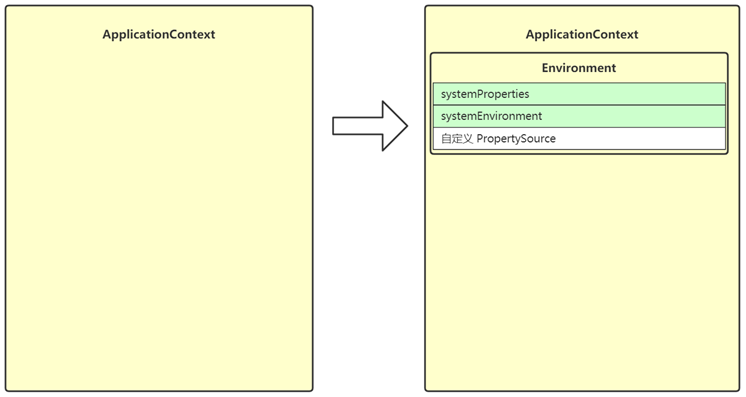

> refresh 是 AbstractApplicationContext 中的核心方法，负责初始化 ApplicationContext 容器，容器必须调用 refresh 才能正常工作。

```java
public void refresh() throws BeansException, IllegalStateException {
    //使用互斥锁，防止启动、关闭及注册函调函数的重复调用，保证上下文对象状态
        synchronized(this.startupShutdownMonitor) {
            StartupStep contextRefresh = this.applicationStartup.start("spring.context.refresh");
            //1.提前准备启动参数，预处理
            this.prepareRefresh();
            //2.获取BeanFactory；默认实现是DefaultListableBeanFactory，在创建容器的时候创建的
            ConfigurableListableBeanFactory beanFactory = this.obtainFreshBeanFactory();
            //3.初始化和设置BeanFactory的参数
            this.prepareBeanFactory(beanFactory);

            try {
                //4.调用BeanFactory的后置处理器，
                this.postProcessBeanFactory(beanFactory);
                StartupStep beanPostProcess = this.applicationStartup.start("spring.context.beans.post-process");
               //5.执行BeanFactoryPostProcessor的方法；
                this.invokeBeanFactoryPostProcessors(beanFactory);
                 //6.在bean工厂中注册bean的后置处理器，bean的代理的生成也是由它实现的
                this.registerBeanPostProcessors(beanFactory);
                beanPostProcess.end();
                //7.初始化消息源
                this.initMessageSource();
                //8.初始化消息推送器
                this.initApplicationEventMulticaster();
                //9.调用子类重写当前方法，是子类实现的扩展
                this.onRefresh();
                //10.注册应用的监听器。就是注册实现了ApplicationListener接口的监听器bean，这些监听器是注册到ApplicationEventMulticaster中的
                this.registerListeners();
                //11.把所有非延迟加载的bean初始化并设置冻结标志位
                this.finishBeanFactoryInitialization(beanFactory);
                //12.
                this.finishRefresh();
            } catch (BeansException var10) {
                if (this.logger.isWarnEnabled()) {
                    this.logger.warn("Exception encountered during context initialization - cancelling refresh attempt: " + var10);
                }
                //销毁已经存在的bean
                this.destroyBeans();
                //释放标志位
                this.cancelRefresh(var10);
                throw var10;
            } finally {
                //清除与反射相关的缓存，例如反射的方法、字段、类型解析已经类加载等
                this.resetCommonCaches();
                contextRefresh.end();
            }

        }
    }
```

它的内部主要会调用 12 个方法，我们把它们称为 refresh 的 12 个步骤：

1. prepareRefresh

2. obtainFreshBeanFactory

3. prepareBeanFactory

4. postProcessBeanFactory

5. invokeBeanFactoryPostProcessors

6. registerBeanPostProcessors

7. initMessageSource

8. initApplicationEventMulticaster

9. onRefresh

10. registerListeners

11. finishBeanFactoryInitialization

12. finishRefresh

> ***功能分类***
>
> * 1 为准备环境
>
> * 2 3 4 5 6 为准备 BeanFactory
>
> * 7 8 9 10 12 为准备 ApplicationContext
>
> * 11 为初始化 BeanFactory 中非延迟单例 bean


### 1. prepareRefresh

```java
protected void prepareRefresh() {
    //设置启动时间
    this.startupDate = System.currentTimeMillis();
    //撤销关闭状态
    this.closed.set(false);
    //开启活跃状态
    this.active.set(true);
    if (this.logger.isDebugEnabled()) {
        if (this.logger.isTraceEnabled()) {
            this.logger.trace("Refreshing " + this);
        } else {
            this.logger.debug("Refreshing " + this.getDisplayName());
        }
    }
    //初始化上下文信息
    this.initPropertySources();
    //验证属性
    this.getEnvironment().validateRequiredProperties();
    if (this.earlyApplicationListeners == null) {
        this.earlyApplicationListeners = new LinkedHashSet(this.applicationListeners);
    } else {
        this.applicationListeners.clear();
        this.applicationListeners.addAll(this.earlyApplicationListeners);
    }

    this.earlyApplicationEvents = new LinkedHashSet();
}
```


* 这一步创建和准备了 Environment 对象，它作为 ApplicationContext 的一个成员变量

* Environment 对象的作用之一是为后续 @Value，值注入时提供键值
* Environment 分成三个主要部分
    * systemProperties - 保存 java 环境键值
    * systemEnvironment - 保存系统环境键值
    * 自定义 PropertySource - 保存自定义键值，例如来自于 *.properties 文件的键值



### 2. obtainFreshBeanFactory

```java
protected ConfigurableListableBeanFactory obtainFreshBeanFactory() {
    //刷新beanFactory
    this.refreshBeanFactory();
    return this.getBeanFactory();
}
```

* 这一步获取（或创建） BeanFactory，它也是作为 ApplicationContext 的一个成员变量
* BeanFactory 的作用是负责 bean 的创建、依赖注入和初始化，bean 的各项特征由 BeanDefinition 定义
    * BeanDefinition 作为 bean 的设计蓝图，规定了 bean 的特征，如单例多例、依赖关系、初始销毁方法等
    * BeanDefinition 的来源有多种多样，可以是通过 xml 获得、配置类获得、组件扫描获得，也可以是编程添加
* 所有的 BeanDefinition 会存入 BeanFactory 中的 beanDefinitionMap 集合


### 3. prepareBeanFactory

```java
protected void prepareBeanFactory(ConfigurableListableBeanFactory beanFactory) {
    //设置类加载器
    beanFactory.setBeanClassLoader(this.getClassLoader());
    if (!shouldIgnoreSpel) {
        //设置 支持解析 SpEL的解析器
        beanFactory.setBeanExpressionResolver(new StandardBeanExpressionResolver(beanFactory.getBeanClassLoader()));
    }

    beanFactory.addPropertyEditorRegistrar(new ResourceEditorRegistrar(this, this.getEnvironment()));
    //设置添加一个 tApplicationContextAwareProcessor 后置处理器
    beanFactory.addBeanPostProcessor(new ApplicationContextAwareProcessor(this));
    //设置忽略的自动装配的接口,就是设置这些接口的实现类不能通过这些接口实现自动注入
    beanFactory.ignoreDependencyInterface(EnvironmentAware.class);
    beanFactory.ignoreDependencyInterface(EmbeddedValueResolverAware.class);
    beanFactory.ignoreDependencyInterface(ResourceLoaderAware.class);
    beanFactory.ignoreDependencyInterface(ApplicationEventPublisherAware.class);
    beanFactory.ignoreDependencyInterface(MessageSourceAware.class);
    beanFactory.ignoreDependencyInterface(ApplicationContextAware.class);
    beanFactory.ignoreDependencyInterface(ApplicationStartupAware.class);
    //注册可以解析的自动装配,假设想要使用@Autowired 注解将Spring提供的 BeanFactory
    beanFactory.registerResolvableDependency(BeanFactory.class, beanFactory);
    beanFactory.registerResolvableDependency(ResourceLoader.class, this);
    beanFactory.registerResolvableDependency(ApplicationEventPublisher.class, this);
    beanFactory.registerResolvableDependency(ApplicationContext.class, this);
    //设置添加一个ApplicationListenerDetector后置处理器
    beanFactory.addBeanPostProcessor(new ApplicationListenerDetector(this));
    //添加编译时支持AspectJ
    if (!NativeDetector.inNativeImage() && beanFactory.containsBean("loadTimeWeaver")) {
        beanFactory.addBeanPostProcessor(new LoadTimeWeaverAwareProcessor(beanFactory));
        beanFactory.setTempClassLoader(new ContextTypeMatchClassLoader(beanFactory.getBeanClassLoader()));
    }

    if (!beanFactory.containsLocalBean("environment")) {
        //注册单例bean environment,存储默认的属性
        beanFactory.registerSingleton("environment", this.getEnvironment());
    }

    if (!beanFactory.containsLocalBean("systemProperties")) {
        //注册单例bean systemProperties,存储系统属性
        beanFactory.registerSingleton("systemProperties", this.getEnvironment().getSystemProperties());
    }

    if (!beanFactory.containsLocalBean("systemEnvironment")) {
        //注册单例bean systemEnvironment,存储系统环境信息
        beanFactory.registerSingleton("systemEnvironment", this.getEnvironment().getSystemEnvironment());
    }

    if (!beanFactory.containsLocalBean("applicationStartup")) {
        //注册单例bean applicationStartup,系统启动
        beanFactory.registerSingleton("applicationStartup", this.getApplicationStartup());
    }

}
```


* 这一步会进一步完善 BeanFactory，为它的各项成员变量赋值
* beanExpressionResolver 用来解析 SpEL，常见实现为 StandardBeanExpressionResolver
* propertyEditorRegistrars 会注册类型转换器
    * 它在这里使用了 ResourceEditorRegistrar 实现类
    * 并应用 ApplicationContext 提供的 Environment 完成 ${ } 解析
* registerResolvableDependency 来注册 beanFactory 以及 ApplicationContext，让它们也能用于依赖注入
* beanPostProcessors 是 bean 后处理器集合，会工作在 bean 的生命周期各个阶段，此处会添加两个：
    * ApplicationContextAwareProcessor 用来解析 Aware 接口
    * ApplicationListenerDetector 用来识别容器中 ApplicationListener 类型的 bean


### 4. postProcessBeanFactory

```java
protected void postProcessBeanFactory(ConfigurableListableBeanFactory beanFactory) {
}
```

* 这一步是空实现，留给子类扩展。
    * 一般 Web 环境的 ApplicationContext 都要利用它注册新的 Scope，完善 Web 下的 BeanFactory
* 这里体现的是模板方法设计模式

### 5. invokeBeanFactoryPostProcessors

```java
protected void invokeBeanFactoryPostProcessors(ConfigurableListableBeanFactory beanFactory) {
    //执行beanFactory后置处理器中的方法,该方法中获取所有BeanFactoryPostProcessor,遍历判断
	//对不同的BeanFactoryPostProcessor进行排序,因为先后执行的顺序不同,
	//PriorityOrdered>BeanDefinitionRegistryPostProcessor>BeanFactoryPostProcessor
	//然后执行后置处理器中定义的初始化 beanFactory 后要执行的方法
    PostProcessorRegistrationDelegate.invokeBeanFactoryPostProcessors(beanFactory, this.getBeanFactoryPostProcessors());
    if (!NativeDetector.inNativeImage() && beanFactory.getTempClassLoader() == null && beanFactory.containsBean("loadTimeWeaver")) {
        beanFactory.addBeanPostProcessor(new LoadTimeWeaverAwareProcessor(beanFactory));
        beanFactory.setTempClassLoader(new ContextTypeMatchClassLoader(beanFactory.getBeanClassLoader()));
    } 
```


* 这一步会调用 beanFactory 后处理器
* beanFactory 后处理器，充当 beanFactory 的扩展点，可以用来补充或修改 BeanDefinition
* 常见的 beanFactory 后处理器有
    * ConfigurationClassPostProcessor – 解析 @Configuration、@Bean、@Import、@PropertySource 等
    * PropertySourcesPlaceHolderConfigurer – 替换 BeanDefinition 中的 ${ }
    * MapperScannerConfigurer – 补充 Mapper 接口对应的 BeanDefinition


### 6. registerBeanPostProcessors

```java
protected void registerBeanPostProcessors(ConfigurableListableBeanFactory beanFactory) {
    PostProcessorRegistrationDelegate.registerBeanPostProcessors(beanFactory, this);
}
```


* 这一步是继续从 beanFactory 中找出 bean 后处理器，添加至 beanPostProcessors 集合中
* bean 后处理器，充当 bean 的扩展点，可以工作在 bean 的实例化、依赖注入、初始化阶段，常见的有：
    * AutowiredAnnotationBeanPostProcessor 功能有：解析 @Autowired，@Value 注解
    * CommonAnnotationBeanPostProcessor 功能有：解析 @Resource，@PostConstruct，@PreDestroy
    * AnnotationAwareAspectJAutoProxyCreator 功能有：为符合切点的目标 bean 自动创建代理


### 7. initMessageSource

```java
protected void initMessageSource() {
    //获取beanFactory
    ConfigurableListableBeanFactory beanFactory = this.getBeanFactory();
    //是否包含‘messageSource’的bean
    if (beanFactory.containsLocalBean("messageSource")) {
        //获取这个bean并进行赋值
        this.messageSource = (MessageSource)beanFactory.getBean("messageSource", MessageSource.class);
        if (this.parent != null && this.messageSource instanceof HierarchicalMessageSource) {
            HierarchicalMessageSource hms = (HierarchicalMessageSource)this.messageSource;
            if (hms.getParentMessageSource() == null) {
                hms.setParentMessageSource(this.getInternalParentMessageSource());
            }
        }

        if (this.logger.isTraceEnabled()) {
            this.logger.trace("Using MessageSource [" + this.messageSource + "]");
        }
    } else {
        //没有就创建一个
        DelegatingMessageSource dms = new DelegatingMessageSource();
        // 注册到容器中(以后获取国际化配置文件的相关信息,可以通过@Autowired在Spring
        dms.setParentMessageSource(this.getInternalParentMessageSource());
        this.messageSource = dms;
        beanFactory.registerSingleton("messageSource", this.messageSource);
        if (this.logger.isTraceEnabled()) {
            this.logger.trace("No 'messageSource' bean, using [" + this.messageSource + "]");
        }
    }

}
```

* 这一步是为 ApplicationContext 添加 messageSource 成员，实现国际化功能
* 去 beanFactory 内找名为 messageSource 的 bean，如果没有，则提供空的 MessageSource 实现


### 8. initApplicationContextEventMulticaster

```java
protected void initApplicationEventMulticaster() {
    //获取beanFactory
    ConfigurableListableBeanFactory beanFactory = this.getBeanFactory();
    if (beanFactory.containsLocalBean("applicationEventMulticaster")) {
        this.applicationEventMulticaster = (ApplicationEventMulticaster)beanFactory.getBean("applicationEventMulticaster", ApplicationEventMulticaster.class);
        if (this.logger.isTraceEnabled()) {
            this.logger.trace("Using ApplicationEventMulticaster [" + this.applicationEventMulticaster + "]");
        }
    } else {
        //没有就创建一个
        this.applicationEventMulticaster = new SimpleApplicationEventMulticaster(beanFactory);
        //注册到bean容器中
        beanFactory.registerSingleton("applicationEventMulticaster", this.applicationEventMulticaster);
        if (this.logger.isTraceEnabled()) {
            this.logger.trace("No 'applicationEventMulticaster' bean, using [" + this.applicationEventMulticaster.getClass().getSimpleName() + "]");
        }
    }
}
```

* 这一步为 ApplicationContext 添加事件广播器成员，即 applicationContextEventMulticaster
* 它的作用是发布事件给监听器
* 去 beanFactory 找名为 applicationEventMulticaster 的 bean 作为事件广播器，若没有，会创建默认的事件广播器
* 之后就可以调用 ApplicationContext.publishEvent(事件对象) 来发布事件


### 9. onRefresh

```java
protected void onRefresh() throws BeansException {
}
```

这一步是空实现，留给子类扩展

* SpringBoot 中的子类在这里准备了 WebServer，即内嵌 web 容器

* 体现的是模板方法设计模式

### 10. registerListeners

```java
protected void registerListeners() {
    //获取容器中的监听器
    Iterator var1 = this.getApplicationListeners().iterator();

    while(var1.hasNext()) {
        ApplicationListener<?> listener = (ApplicationListener)var1.next();
        //添加至事件applicationEventMulticaster
        this.getApplicationEventMulticaster().addApplicationListener(listener);
    }
    //获取没有创建的监听器
    String[] listenerBeanNames = this.getBeanNamesForType(ApplicationListener.class, true, false);
    String[] var7 = listenerBeanNames;
    int var3 = listenerBeanNames.length;
     //添加至事件applicationEventMulticaster
    for(int var4 = 0; var4 < var3; ++var4) {
        String listenerBeanName = var7[var4];
        this.getApplicationEventMulticaster().addApplicationListenerBean(listenerBeanName);
    }
    //获取早期设置的事件(派发之前的事件)
    Set<ApplicationEvent> earlyEventsToProcess = this.earlyApplicationEvents;
    this.earlyApplicationEvents = null;
    if (!CollectionUtils.isEmpty(earlyEventsToProcess)) {
        Iterator var9 = earlyEventsToProcess.iterator();

        while(var9.hasNext()) {
            ApplicationEvent earlyEvent = (ApplicationEvent)var9.next();
             //将早期的事件派发出去
            this.getApplicationEventMulticaster().multicastEvent(earlyEvent);
        }
    }

}
```

* 这一步会从多种途径找到事件监听器，并添加至 applicationEventMulticaster
* 事件监听器顾名思义，用来接收事件广播器发布的事件，有如下来源
    * 事先编程添加的
    * 来自容器中的 bean
    * 来自于 @EventListener 的解析
* 要实现事件监听器，只需要实现 ApplicationListener 接口，重写其中 onApplicationEvent(E e) 方法即可


### 11. finishBeanFactoryInitialization

```java
protected void finishBeanFactoryInitialization(ConfigurableListableBeanFactory beanFactory) {
    //如果beanFactory包含“conversionService”
    if (beanFactory.containsBean("conversionService") && beanFactory.isTypeMatch("conversionService", ConversionService.class)) {
        beanFactory.setConversionService((ConversionService)beanFactory.getBean("conversionService", ConversionService.class));
    }
    //如果beanFactory之前没有注册嵌入值解析器，则注册默认的嵌入值解析器：主要用于注解属性值的解析
    if (!beanFactory.hasEmbeddedValueResolver()) {
        beanFactory.addEmbeddedValueResolver((strVal) -> {
            return this.getEnvironment().resolvePlaceholders(strVal);
        });
    }
    //初始化LoadTimeWeaverAware Bean实例对象
    String[] weaverAwareNames = beanFactory.getBeanNamesForType(LoadTimeWeaverAware.class, false, false);
    String[] var3 = weaverAwareNames;
    int var4 = weaverAwareNames.length;

    for(int var5 = 0; var5 < var4; ++var5) {
        String weaverAwareName = var3[var5];
        this.getBean(weaverAwareName);
    }

    beanFactory.setTempClassLoader((ClassLoader)null);
    //冻结所有bean定义，注册的bean定义不会被修改或进一步后处理，因为马上要创建 Bean 实例对象了
    beanFactory.freezeConfiguration();
    //实例化所有剩余（非懒加载）单例对象
    beanFactory.preInstantiateSingletons();
}
```

* 这一步会将 beanFactory 的成员补充完毕，并初始化所有非延迟单例 bean
* conversionService 也是一套转换机制，作为对 PropertyEditor 的补充
* embeddedValueResolvers 即内嵌值解析器，用来解析 @Value 中的 ${ }，借用的是 Environment 的功能
* singletonObjects 即单例池，缓存所有单例对象
    * 对象的创建都分三个阶段，每一阶段都有不同的 bean 后处理器参与进来，扩展功能


### 12. finishRefresh

```java
protected void finishRefresh() {
    //清除资源缓存
    this.clearResourceCaches();
    //初始化跟生命周期有关的后置处理器,在容器中获取LifecycleProcessor
    this.initLifecycleProcessor();
    //获取到生命周期后，调用onRefresh容器刷新完成方法
    this.getLifecycleProcessor().onRefresh();
    //刷新事件
    this.publishEvent((ApplicationEvent)(new ContextRefreshedEvent(this)));
    if (!NativeDetector.inNativeImage()) {
        LiveBeansView.registerApplicationContext(this);
    }
}
```

* 这一步会为 ApplicationContext 添加 lifecycleProcessor 成员，用来控制容器内需要生命周期管理的 bean
* 如果容器中有名称为 lifecycleProcessor 的 bean 就用它，否则创建默认的生命周期管理器
* 准备好生命周期管理器，就可以实现
    * 调用 context 的 start，即可触发所有实现 LifeCycle 接口 bean 的 start
    * 调用 context 的 stop，即可触发所有实现 LifeCycle 接口 bean 的 stop
* 发布 ContextRefreshed 事件，整个 refresh 执行完成


### 问题回答

1. 你知道 @Value("${key}") 注入的值是从哪儿来的吗，谁去解析 ${ } ？
2. 是 ApplicationContext 完成了 bean 的创建和依赖组装吗？
3. ApplicationContext  与 BeanFactory 之间的关系是什么？
4. 国际化属于谁的功能
5. SpEL 谁来解析
6. 类型谁来转换
7. 为什么实现了 XxxAware 接口，就能自动装配 Xxx 类型
8. @Bean 和 `<bean> ` 是等价的吗？
9. @Autowired，@Resource 它们由谁来解析，原始的 BeanFactory 提供了这些解析功能吗
10. Spring 中的事件驱动开发是怎么回事，谁来发事件，谁来收事件
11. LifeCycle 生命周期和 Spring 的生命周期是一回事吗？
