### 1、图的定义及分类

> 图是由一组顶点和一组能够将两个顶点相连的边组成的


特殊的图：

> 1. 自环：即一条连接一个顶点和其自身的边；
> 2. 平行边：连接同一对顶点的两条边；


图的分类

> 按照连接两个顶点的边的不同，可以把图分为以下两种：
>
> - 无向图：边仅仅连接两个顶点，没有其他含义；
> - 有向图：边不仅连接两个顶点，并且具有方向；

### 2、图的相关术语

#### 1、相邻顶点

> 当两个顶点通过一条边相连时，我们称这两个顶点是相邻的，并且称这条边依附于这两个顶点。

#### 2、度

> 某个顶点的度就是依附于该顶点的边的个数

#### 3、子图

> 是一幅图的所有边的子集(包含这些边依附的顶点)组成的图；

#### 4、路径

> 是由边顺序连接的一系列的顶点组成

#### 5、环

> 是一条至少含有一条边且终点和起点相同的路径


#### 6、连通图

> 如果图中任意一个顶点都存在一条路径到达另外一个顶点，那么这幅图就称之为连通图

#### 7、连通子图

> 一个非连通图由若干连通的部分组成，每一个连通的部分都可以称为该图的连通子图


### 3、图的存储结构

> 要表示一幅图，只需要表示清楚以下两部分内容即可：
>
> 1. 图中所有的顶点；
> 2. 所有连接顶点的边；

#### 1、邻接矩阵

> 1. 使用一个VV的二维数组intV adj,把索引的值看做是顶点；*
> 2. 如果顶点v和顶点w相连，我们只需要将adjv和adjw的值设置为1,否则设置为0即可。


很明显，邻接矩阵这种存储方式的空间复杂度是V^2的，如果我们处理的问题规模比较大的话，内存空间极有可能不够用。

#### 2、邻接表

> 1.使用一个大小为V的数组 Queue[V] adj，把索引看做是顶点；
> 2.每个索引处adj[v]存储了一个队列，该队列中存储的是所有与该顶点相邻的其他顶点


很明显，邻接表的空间并不是是线性级别的，所以后面我们一直采用邻接表这种存储形式来表示图。


### 4、图的实现

#### 1、图的API设计

| 类名     | Graph                                                        |
| -------- | ------------------------------------------------------------ |
| 构造方法 | Graph(int V)：创建一个包含V个顶点但不包含边的图              |
| 成员方法 | public int V():获取图中顶点的数量<br/>public int E():获取图中边的数量<br/>public void addEdge(int v,int w):向图中添加一条边 v-w<br/>public Queue adj(int v)：获取和顶点v相邻的所有顶点 |
| 成员变量 | private final int V: 记录顶点数量<br/>private int E: 记录边数量<br/>private Queue[] adj: 邻接表 |

#### 2、实现

```java
public class Graph {

    /**
     * :记录顶点数量
     */
    private final int V;
    /**
     * :记录边数量
     */
    private int E;
    /**
     * : 邻接表
     */
    private Queue[] adj;

    public Graph(int v){
        //初始化顶点数量
        this.V = v;
        //初始化边数量
        this.E = 0;
        //初始化邻接表
        this.adj = new Queue[v];
        for (int i = 0; i < adj.length; i++) {
            adj[i] = new Queue<Integer>();
        }
    }

    /**
     * 获取图中顶点的数量
     * @return
     */
    public int V(){
        return V;
    }

    /**
     * 获取图中边的数量
     * @return
     */
    public int E(){
        return E;
    }

    /**
     * 向图中添加一条边 v-w
     * @param v
     * @param w
     */
    public void addEdge(int v,int w){
        //把w增加到v的链表上，顶点v多了一个相邻点
        adj(v).enqueue(w);
        adj(w).enqueue(v);
        E++;
    }

    /**
     * 获取和顶点v相邻的所有顶点
     * @param v
     * @return
     */
    public Queue<Integer> adj(int v){
        return adj[v];
    }
}
```

- 测试类

  ```java
  public class GraphTest {
      public static void main(String[] args) {
  
          Graph graph = new Graph(20);
          graph.addEdge(0,5);
          graph.addEdge(0,1);
          graph.addEdge(0,2);
          graph.addEdge(0,6);
          graph.addEdge(6,4);
          graph.addEdge(4,3);
          graph.addEdge(4,5);
          graph.addEdge(5,3);
  
          graph.addEdge(7,8);
  
          graph.addEdge(9,10);
          graph.addEdge(9,11);
          graph.addEdge(11,12);
  
          System.out.println("图中边的数量为：" + graph.E());
  
          System.out.println("图中顶点的数量为：" + graph.V());
  
          graph.addEdge(5,7);
  
      }
  }
  ```


### 5、图的搜索

最经典的算法有：

- 深度优先搜索
- 广度优先搜索

#### 1、深度优先搜索

> 所谓的深度优先搜索，指的是在搜索时，如果遇到一个结点既有子结点，又有兄弟结点，那么先找子结点，然后找兄弟结点。


> 很明显，在由于边是没有方向的，所以，如果4和5顶点相连，那么4会出现在5的相邻链表中，5也会出现在4的相邻链表中，那么为了不对顶点进行重复搜索，应该要有相应的标记来表示当前顶点有没有搜索过，可以使用一个布尔类型的数组 boolean[V] marked,索引代表顶点，值代表当前顶点是否已经搜索，如果已经搜索，标记为true，如果没有搜索，标记为false；


##### 1、API设计

| 类名     | DepthFirstSearch                                             |
| -------- | ------------------------------------------------------------ |
| 构造方法 | DepthFirstSearch(Graph G,int s)：构造深度优先搜索对象，使用深度优先搜索找出G图中s顶点的所有相通顶点 |
| 成员方法 | private void dfs(Graph G, int v)：使用深度优先搜索找出G图中v顶点的所有相通顶点<br/>public boolean marked(int w):判断w顶点与s顶点是否相通<br/>public int count():获取与顶点s相通的所有顶点的总数 |
| 成员变量 | private boolean[] marked: 索引代表顶点，值表示当前顶点是否已经被搜索<br/>private int count：记录有多少个顶点与s顶点相通 |

##### 2、代码实现

```java
public class DepthFirstSearch {

    /**
     * 索引代表顶点，值表示当前顶点是否已经被搜索
     */
    private boolean[] marked;

    /**
     * 记录有多少个顶点与s顶点相通
     */
    private int count;

    /**
     * 构造深度优先搜索对象，使用深度优先搜索找出G图中s顶点的所有相通顶点
     * @param G
     * @param s
     */
    public DepthFirstSearch(Graph G,int s){
        //创建一个和图的顶点数一样大小的布尔数组
        marked = new boolean[G.V()];
        //搜索G图中与顶点s相同的所有顶点
        dfs(G, s);
    }

    /**
     * 使用深度优先搜索找出G图中v顶点的所有相通顶点
     * @param G
     * @param v
     */
    private void dfs(Graph G, int v){
        //把当前顶点标记为已搜索
        marked[v] = true;
        //遍历v顶点的邻接表，得到每一个顶点i
        for (Integer i : G.adj(v)) {
            //如果当前顶点i没有被搜索过，则递归搜索与w顶点相通的其他顶点
            if(!marked[i]){
                dfs(G,i);
            }
        }
        //相通的顶点数量+1
        count++;
    }

    /**
     * 判断w顶点与s顶点是否相通
     * @param w
     * @return
     */
    public boolean marked(int w){
        return marked[w];
    }

    /**
     * 获取与顶点s相通的所有顶点的总数
     * @return
     */
    public int count(){
        return count;
    }
}
```

- 测试类

  ```java
  public class DepthFirstSearchTest {
      public static void main(String[] args) {
  
          Graph graph = new Graph(20);
          graph.addEdge(0,5);
          graph.addEdge(0,1);
          graph.addEdge(0,2);
          graph.addEdge(0,6);
          graph.addEdge(6,4);
          graph.addEdge(4,3);
          graph.addEdge(4,5);
          graph.addEdge(5,3);
  
          graph.addEdge(7,8);
  
          graph.addEdge(9,10);
          graph.addEdge(9,11);
          graph.addEdge(11,12);
  
          DepthFirstSearch search = new DepthFirstSearch(graph, 0);
  
          System.out.println("与0相邻的顶点个数：" + search.count());
  
          System.out.println("0和5是否相邻：" + search.marked(5));
  
          System.out.println("0和7是否相邻：" + search.marked(7));
      }
  }
  ```


#### 2、广度优先搜索

> 从根结点开始，沿着树的宽度遍历树的结点，如果所有结点被访问，则终止


##### 1、API设计

| 类名     | BreadthFirstSearch                                           |
| -------- | ------------------------------------------------------------ |
| 构造方法 | public BreadthFirstSearch(Graph G,int s)：构造广度优先搜索对象，使用广度优先搜索找到G图中s顶点的所有相邻顶点 |
| 成员方法 | private void bfs(Graph G, int v)：使用广度优先搜索找出G图中v顶点的所有相邻顶点<br/>public boolean marked(int w):判断w顶点与s顶点是否相通<br/>public int count():获取与顶点s相通的所有顶点的总数 |
| 成员变量 | private boolean[] marked: 索引代表顶点，值表示当前顶点是否已经被搜索<br/>private int count：记录有多少个顶点与s顶点相通<br/>private Queue waitSearch: 用来存储待搜索邻接表的点 |

##### 2、代码实现

```java
public class BreadthFirstSearch {

    /**
     * :索引代表顶点，值表示当前顶点是否已经被搜索
     */
    private boolean[] marked;

    /**
     * 记录有多少个顶点与s顶点相通
     */
    private int count;

    /**
     * 用来存储待搜索邻接表的点
     */
    private Queue<Integer> waitSearch;

    /**
     * 使用广度优先搜索，找到g图中s顶点的所有相邻顶点
     * @param g
     * @param s
     */
    public BreadthFirstSearch(Graph g, int s){
        //创建一个和图一样的boolean数组
        marked = new boolean[g.V()];
        //初始化待搜索的索引
        waitSearch = new Queue<Integer>();
        bfs(g, s);
    }

    /**
     * 使用广度优先搜索找出G图中v顶点的所有相邻顶点
     * @param G
     * @param v
     */
    private void bfs(Graph G, int v){
        //标记当前v的搜索状态为true
        marked[v] = true;
        //将当前顶点放入队列中，等待搜索他的邻接表
        waitSearch.enqueue(v);
        //待搜索的队列不为空
        while (!waitSearch.isEmpty()){
            Integer dequeue = waitSearch.dequeue();
            //遍历wait顶点的邻接表，得到每一个顶点
            for (Integer w : G.adj(dequeue)) {
                if(!marked(w)){
                    bfs(G,w);
                }
            }
        }
        count++;
    }

    /**
     * 判断w顶点与s顶点是否相通
     * @param w
     * @return
     */
    public boolean marked(int w){
        return marked(w);
    }

    /**
     * 获取与顶点s相通的所有顶点的总数
     * @return
     */
    public int count(){
        return count;
    }
}
```

- 测试类

  ```java
  public class BreadthFirstSearchTest {
      public static void main(String[] args) {
  
          Graph graph = new Graph(20);
          graph.addEdge(0,5);
          graph.addEdge(0,1);
          graph.addEdge(0,2);
          graph.addEdge(0,6);
          graph.addEdge(6,4);
          graph.addEdge(4,3);
          graph.addEdge(4,5);
          graph.addEdge(5,3);
  
          graph.addEdge(7,8);
  
          graph.addEdge(9,10);
          graph.addEdge(9,11);
          graph.addEdge(11,12);
  
          BreadthFirstSearch search = new BreadthFirstSearch(graph, 0);
  
          System.out.println("与0相邻的顶点个数：" + search.count());
  
          System.out.println("0和5是否相邻：" + search.marked(5));
  
          System.out.println("0和7是否相邻：" + search.marked(7));
      }
  }
  ```


#### 3、路径查找


例如在上图上查找顶点0到顶点4的路径用红色标识出来,那么我们可以把该路径表示为 0-2-3-4。

##### 1、API设计

| 类名     | DepthFirstPaths                                              |
| -------- | ------------------------------------------------------------ |
| 构造方法 | DepthFirstPaths(Graph G,int s)：构造深度优先搜索对象，使用深度优先搜索找出G图中起点为s的所有路径 |
| 成员方法 | private void dfs(Graph G, int v)：使用深度优先搜索找出G图中v顶点的所有相邻顶点<br/>public boolean hasPathTo(int v):判断v顶点与s顶点是否存在路径<br/>public Stack pathTo(int v):找出从起点s到顶点v的路径(就是该路径经过的顶点) |
| 成员变量 | private boolean[] marked: 索引代表顶点，值表示当前顶点是否已经被搜索<br/>private int s:起点<br/>private int[] edgeTo:索引代表顶点，值代表从起点s到当前顶点路径上的最后一个顶点 |


##### 2、代码实现

```java
public class DepthFirstPaths {

    /**
     * 索引代表顶点，值表示当前顶点是否已经被搜索
     */
    private boolean[] marked;
    /**
     * 起点
     */
    private int s;
    /**
     * 索引代表顶点，值代表从起点s到当前顶点路径上的最后一个顶点
     */
    private int[] edgeTo;

    /**
     * 深度优先搜索
     * @param graph 图
     * @param s 起点
     */
    public DepthFirstPaths(Graph graph, int s){
        //初始化数组
        marked = new boolean[graph.V()];
        edgeTo = new int[graph.V()];

        this.s = s;
        dfs(graph, s);
    }

    /**
     * 使用深度优先搜索找出G图中v顶点的所有相邻顶点
     * @param G
     * @param v
     */
    private void dfs(Graph G, int v){
        marked[v] = true;
        //如果当前顶点w没有被搜索过，则将edgeTo[w]设置为v,表示w的前一个顶点为v，并递归搜索与w顶点相通的其他顶点
        for (Integer w : G.adj(v)) {
            if (!marked[w]){
                edgeTo[w] = v;
                dfs(G, w);
            }
        }
    }

    /**
     * 判断v顶点与s顶点是否存在路径
     * @param v
     * @return
     */
    public boolean hasPathTo(int v){
        return marked[v];
    }

    /**
     * 找出从起点s到顶点v的路径(就是该路径经过的顶点)
     * @param v
     * @return
     */
    public Stack pathTo(int v){
        //当前v顶点与s顶点不连通，所以直接返回null，没有路径
        if (!hasPathTo(v)){
            return null;
        }
        Stack<Integer> stack = new Stack<>();
        //第一次把当前顶点存进去，然后将x变换为到达当前顶点的前一个顶点edgeTo[x],在把前一个顶点存进去，
        // 继续将x变化为到达前一个顶点的前一个顶点，继续存，一直到x的值为s为止，相当于逆推法，最后把s放进去
        for (int i = v; i != s ; i = edgeTo[i]) {
            //把当前顶点放入容器
            stack.push(i);
        }
        //把起点s放入容器
        stack.push(s);
        return stack;
    }
}
```

- 测试类

  ```java
  public class DepthFirstPathsTest {
  
      public static void main(String[] args) throws Exception{
          //创建一个BufferReader读取流
          BufferedReader bufferedReader = new BufferedReader(new InputStreamReader(DepthFirstPathsTest.class.getClassLoader().getResourceAsStream("depth_first_search.txt")));
          //读取第一行数据
          int i = Integer.parseInt(bufferedReader.readLine());
          //创建图
          Graph graph = new Graph(i);
          //读取城市道路条数（边数）
          int i1 = Integer.parseInt(bufferedReader.readLine());
          for (int j = 0; j < i1; j++) {
              String s = bufferedReader.readLine();
              String[] split = s.split(" ");
              int i2 = Integer.parseInt(split[0]);
              int i3 = Integer.parseInt(split[1]);
              graph.addEdge(i2,i3);
          }
          //起点为0
          DepthFirstPaths paths = new DepthFirstPaths(graph, 0);
          //查找0-4的路径
          Stack<Integer> stack = paths.pathTo(4);
          StringBuilder builder = new StringBuilder();
          for (Integer o : stack) {
              builder.append(o + "-");
          }
          //删除最后一个-
          builder.deleteCharAt(builder.length()-1);
          System.out.println(builder);
      }
  }
  ```

  输出结果

  ```
  0-2-3-4
  ```


### 6、有向图

#### 1、有向图的定义和相关术语

##### 1、定义

> 有向图是一副具有方向性的图，是由一组顶点和一组有方向的边组成的，每条方向的边都连着一对有序的顶点。

##### 2、出度

> 由某个顶点指出的边的个数称为该顶点的出度。

##### 3、入度

> 指向某个顶点的边的个数称为该顶点的入度。

##### 4、有向路径

> 由一系列顶点组成，对于其中的每个顶点都存在一条有向边，从它指向序列中的下一个顶点。

##### 5、有向环

> 一条至少含有一条边，且起点和终点相同的有向路径。


##### 6、一副有向图中两个顶点v和w可能存在以下四种关系

> 1. 没有边相连
> 2. 存在从v到w的边v—>w
> 3. 存在从w到v的边w—>v
> 4. 既存在w到v的边，也存在v到w的边，即双向连接；

#### 2、API设计

| 类名     | Digragh                                                      |
| -------- | ------------------------------------------------------------ |
| 构造方法 | Digraph(int V)：创建一个包含V个顶点但不包含边的有向图        |
| 成员方法 | public int V():获取图中顶点的数量<br/>public int E():获取图中边的数量<br/>public void addEdge(int v,int w):向有向图中添加一条边 v->w<br/>public Queue adj(int v)：获取由v指出的边所连接的所有顶点<br/>private Digraph reverse():该图的反向图 |
| 成员变量 | private final int V: 记录顶点数量<br/>private int E: 记录边数量<br/>private Queue[] adj: 邻接表 |

#### 3、实现

```JAVA
public class Digraph {

    /**
     * 记录顶点数量
     */
    private final int V;

    /**
     * 记录边数量
     */
    private int E;

    /**
     * 邻接表
     */
    private Queue[] adj;

    /**
     * 创建一个包含V个顶点但不包含边的有向图
     * @param v
     */
    public Digraph(int v){
        this.V = v;
        this.E = 0;
        this.adj = new Queue[v];

        for (int i = 0; i < this.adj.length; i++) {
            adj[i] = new Queue<Integer>();
        }
    }

    /**
     * 获取图中顶点的数量
     * @return
     */
    public int V(){
        return V;
    }

    /**
     * 获取图中边的数量
     * @return
     */
    public int E(){
        return E;
    }

    /**
     * 向有向图中添加一条边 v->w
     * @param v
     * @param w
     */
    public void addEdge(int v,int w){
        //由于有向图中边是有向的，v->w 边，只需要让w出现在v的邻接表中，而不需要让v出现在w的邻接表中
        adj[v].enqueue(w);
        E++;
    }

    /**
     * 获取由v指出的边所连接的所有顶点
     * @param v
     * @return
     */
    public Queue<Integer> adj(int v){
        return adj[v];
    }

    /**
     * 该图的反向图
     * @return
     */
    private Digraph reverse(){
        Digraph digraph = new Digraph(V);
        for (int i = 0; i < V; i++) {
            //得到原图中的v顶点对应的邻接表,原图中的边为 v->w,则反向图中边为w->v;
            for (Integer w : adj(i)) {
                digraph.addEdge(w,i);
            }
        }
        return digraph;
    }
}
```


### 7、拓扑排序

> 在现实生活中，我们经常会同一时间接到很多任务去完成，但是这些任务的完成是有先后次序的。以我们学习java学科为例，我们需要学习很多知识，但是这些知识在学习的过程中是需要按照先后次序来完成的。从java基础，到jsp/servlet，到ssm，到springboot等是个循序渐进且有依赖的过程。在学习jsp前要首先掌握java基础和html基础，学习ssm框架前要掌握jsp/servlet之类才行。


为了简化问题，我们使用整数为顶点编号的标准模型来表示这个案例：


拓扑排序

> 给定一副有向图，将所有的顶点排序，使得所有的有向边均从排在前面的元素指向排在后面的元素，此时就可以明确的表示出每个顶点的优先级。


#### 1、检测有向图中的环

> 如果学习x课程前必须先学习y课程，学习y课程前必须先学习z课程，学习z课程前必须先学习x课程，那么一定是有问题了，我们就没有办法学习了，因为这三个条件没有办法同时满足。其实这三门课程x、y、z的条件组成了一个环。


因此，如果我们要使用拓扑排序解决优先级问题，首先得保证图中没有环的存在。

##### 1、API设计

| 类名     | DirectedCycle                                                |
| -------- | ------------------------------------------------------------ |
| 构造方法 | public DirectedCycle(Digraph G)：创建一个检测环对象，检测图G中是否有环 |
| 成员方法 | private void dfs(Digraph G,int v)：基于深度优先搜索，检测图G中是否有环<br/>public boolean hasCycle():判断图中是否有环 |
| 成员变量 | private boolean[] marked: 索引代表顶点，值表示当前顶点是否已经被搜索<br/>private boolean hasCycle: 记录图中是否有环<br/>private boolean[] onStack:索引代表顶点，使用栈的思想，记录当前顶点有没有已经处于正在搜索的有向路径上 |

##### 2、代码实现

在API中添加了onStack[] 布尔数组，索引为图的顶点，当我们深度搜索时：
1. 在如果当前顶点正在搜索，则把对应的onStack数组中的值改为true，标识进栈；
2. 如果当前顶点搜索完毕，则把对应的onStack数组中的值改为false，标识出栈；
3. 如果即将要搜索某个顶点，但该顶点已经在栈中，则图中有环；


```java
public class DirectedCycle {

    /**
     * 索引代表顶点，值表示当前顶点是否已经被搜索
     */
    private boolean[] marked;
    /**
     * 记录图中是否有环
     */
    private boolean hasCycle;
    /**
     * 索引代表顶点，使用栈的思想，记录当前顶点有没有已经处于正在搜索的有向路径上
     */
    private boolean[] onStack;

    /**
     * 创建一个检测环对象，检测图G中是否有环
     * @param G
     */
    public DirectedCycle(Digraph G){
        //创建一个和图的顶点数一样大小的marked数组
        this.marked = new boolean[G.V()];
        //默认不存在环
        this.hasCycle = false;
        //创建一个和图的顶点数一样的onStack数组
        this.onStack = new boolean[G.V()];

        for (int i = 0; i < G.V(); i++) {
            //如果当前顶点没有搜索过，则搜索
            if (!marked[i]){
                dfs(G,i);
            }
        }
    }

    /**
     * 基于深度优先搜索，检测图G中是否有环
     * @param G
     * @param v
     */
    private void dfs(Digraph G,int v){
        //标记当前顶点已被搜索
        marked[v] = true;
        //让当前顶点进栈
        onStack[v] = true;
        //遍历v顶点的邻接表，得到每一个顶点w
        for (Integer w : G.adj(v)) {
            //如果当前顶点未被搜索，则搜索该顶点
            if (!marked[w]){
                dfs(G,w);
            }
            //如果顶点w已经被搜索过，则查看顶点w是否在栈中，如果在，则证明图中有环，修改hasCycle标记，结束循环
            if (onStack[w]){
                hasCycle = true;
                return;
            }
        }
        onStack[v] = false;
    }

    /**
     * 判断图中是否有环
     * @return
     */
    public boolean hasCycle(){
        return hasCycle;
    }
}
```


#### 2、基于深度优先的顶点排序

> 如果要把图中的顶点生成线性序列其实是一件非常简单的事，之前我们学习并使用了多次深度优先搜索，我们会发现其实深度优先搜索有一个特点，那就是在一个连通子图上，每个顶点只会被搜索一次，如果我们能在深度优先搜索的基础上，添加一行代码，只需要将搜索的顶点放入到线性序列的数据结构中，我们就能完成这件事。

##### 1、API设计

| 类名     | DepthFirstOrder                                              |
| -------- | ------------------------------------------------------------ |
| 构造方法 | DepthFirstOrder(Digraph G)：创建一个顶点排序对象，生成顶点线性序列； |
| 成员方法 | private void dfs(Digraph G,int v)：基于深度优先搜索，生成顶点线性序列<br/>public Stack reversePost():获取顶点线性序列 |
| 成员变量 | private boolean[] marked: 索引代表顶点，值表示当前顶点是否已经被搜索<br/>private Stack reversePost: 使用栈，存储顶点序列 |

##### 2、顶点排序实现

> 在API的设计中，我们添加了一个栈reversePost用来存储顶点，当我们深度搜索图时，每搜索完毕一个顶点，把该顶点放入到reversePost中，这样就可以实现顶点排序。


```java
public class DepthFirstOrder {

    /**
     * 索引代表顶点，值表示当前顶点是否已经被搜索
     */
    private boolean[] marked;

    /**
     * 使用栈，存储顶点序列
     */
    private Stack reversePost;

    /**
     * 创建一个顶点排序对象，生成顶点线性序列；
     * @param G
     */
    public DepthFirstOrder(Digraph G){
        //初始化
        marked = new boolean[G.V()];
        reversePost = new Stack<Integer>();
        //遍历图中的每一个顶点
        for (int i = 0; i < G.V(); i++) {
            if(!marked[i]){
                dfs(G,i);
            }
        }
    }

    /**
     * 基于深度优先搜索，生成顶点线性序列
     * @param G
     * @param v
     */
    private void dfs(Digraph G,int v){
        //标记当前顶点已被搜索
        marked[v] = true;
        //循环遍历每一个顶点
        for (Integer w : G.adj(v)) {
            if(!marked[w]){
                dfs(G,w);
            }
        }
        //当前顶点已经搜索完毕，让当前顶点入栈
        reversePost.push(v);
    }

    /**
     * :获取顶点线性序列
     * @return
     */
    public Stack reversePost(){
        return reversePost;
    }
}
```


#### 3、拓扑排序实现

> 前面已经实现了环的检测以及顶点排序，那么拓扑排序就很简单了，基于一幅图，先检测有没有环，如果没有环，则调用顶点排序即可。

##### 1、API设计

| 类名     | TopoLogical                                                  |
| -------- | ------------------------------------------------------------ |
| 构造方法 | TopoLogical(Digraph G)：构造拓扑排序对象                     |
| 成员方法 | public boolean isCycle()：判断图G是否有环<br/>public Stack order():获取拓扑排序的所有顶点 |
| 成员变量 | private Stack order: 顶点的拓扑排序                          |

##### 2、实现

```java
public class TopologicalSort {
    /**
     * 顶点的拓扑排序
     */
    private Stack<Integer> order;

    /**
     * 构造拓扑排序对象
     * @param G
     */
    public TopologicalSort(Digraph G){
        //创建检测环对象，检测图G中是否有环
        DirectedCycle dCycle = new DirectedCycle(G);
        if(!dCycle.hasCycle()){
            //如果没有环，创建顶点排序对象，进行顶点排序
            DepthFirstOrder depthFirstOrder = new DepthFirstOrder(G);
            order = depthFirstOrder.reversePost();
        }
    }

    /**
     * 判断图G是否有环
     * @return
     */
    public boolean isCycle(){
        return order == null;
    }

    /**
     * 获取拓扑排序的所有顶点
     * @return
     */
    public Stack<Integer> order(){
        return order;
    }
}
```

- 测试类

  ```java
  public class TopologicalSortTest {
  
      public static void main(String[] args) {
          //创建一个有向图
          Digraph digraph = new Digraph(6);
          digraph.addEdge(0,2);
          digraph.addEdge(0,3);
          digraph.addEdge(2,4);
          digraph.addEdge(3,4);
          digraph.addEdge(4,5);
          digraph.addEdge(1,3);
  
          TopologicalSort topologicalSort = new TopologicalSort(digraph);
          Stack<Integer> order = topologicalSort.order();
          for (Integer o : order) {
              System.out.print(o+"->");
          }
      }
  }
  ```

  ```
  1->0->3->2->4->5->
  ```


### 8、加权无向图

> 加权无向图是一种为每条边关联一个权重值或是成本的图模型。这种图能够自然地表示许多应用。在一副航空图中，边表示航线，权值则可以表示距离或是费用。在一副电路图中，边表示导线，权值则可能表示导线的长度即成本，或是信号通过这条先所需的时间。此时我们很容易就能想到，最小成本的问题，例如，从西安飞纽约，怎样飞才能使时间成本最低或者是金钱成本最低？
> 在下图中，从顶点0到顶点4有三条路径，分别为0-2-3-4,0-2-4,0-5-3-4,那我们如果要通过那条路径到达4顶点最好呢？此时就要考虑，那条路径的成本最低。


#### 1、加权无向图边的表示

> 加权无向图中的边我们就不能简单的使用v-w两个顶点表示了，而必须要给边关联一个权重值，因此我们可以使用对象来描述一条边。

##### 1、API设计

| 类名     | Edge implements Comparable                                   |
| -------- | ------------------------------------------------------------ |
| 构造方法 | Edge(int v,int w,double weight)：通过顶点v和w，以及权重weight值构造一个边对象 |
| 成员方法 | public double weight():获取边的权重值<br/>public int either():获取边上的一个点<br/>public int other(int vertex)):获取边上除了顶点vertex外的另外一个顶点<br/>public int compareTo(Edge that)：比较当前边和参数that边的权重，如果当前边权重大，返回1，如果一样大，返回0，如果当前权重小，返回-1 |
| 成员变量 | private final int v：顶点一<br/>private final int w：顶点二<br/>private final double weight：当前边的权重 |

##### 2、代码实现

```java
public class Edge implements Comparable<Edge>{

    /**
     * 顶点一
     */
    private final int v;
    /**
     * 顶点二
     */
    private final int w;

    /**
     * 当前边的权重
     */
    private final double weight;

    public Edge(int v, int w, double weight) {
        this.v = v;
        this.w = w;
        this.weight = weight;
    }

    /**
     * 获取边的权重值
     * @return
     */
    public double weight(){
        return weight;
    }

    /**
     * 获取边上的一个点
     * @return
     */
    public int either(){
        return v;
    }

    /**
     * 获取边上除了顶点vertex外的另外一个顶点
     * @param vertex
     * @return
     */
    public int other(int vertex){
        if (vertex == v){
            return w;
        }else {
            return v;
        }
    }


    @Override
    public int compareTo(Edge o) {
        int temp;
        if(this.weight() == o.weight()){
            temp = 0;
        }else {
            temp = this.weight() > o.weight() ? 1 : -1;
        }
        return temp;
    }
}
```

#### 2、加权无向图的实现

##### 1、API设计

| 类名     | EdgeWeightedGraph                                            |
| -------- | ------------------------------------------------------------ |
| 构造方法 | EdgeWeightedGraph(int V)：创建一个含有V个顶点的空加权无向图  |
| 成员方法 | public int V():获取图中顶点的数量<br/>public int E():获取图中边的数量<br/>public void addEdge(Edge e):向加权无向图中添加一条边e<br/>public Queue adj(int v)：获取和顶点v关联的所有边<br/>public Queue edges()：获取加权无向图的所有边 |
| 成员变量 | private final int V: 记录顶点数量<br/>private int E: 记录边数量<br/>private Queue[] adj: 邻接表 |

##### 2、代码实现

```java
public class EdgeWeightedGraph {
    /**
     * 记录顶点数量
     */
    private final int V;
    /**
     * 记录边数量
     */
    private int E;
    /**
     * : 邻接表
     */
    private Queue<Edge>[] adj;

    public EdgeWeightedGraph(int v) {
        this.V = v;
        this.E = 0;
        this.adj = new Queue[v];
        for (int i = 0; i < adj.length; i++) {
            adj[i] = new Queue<Edge>();
        }
    }

    /**
     * 获取图中顶点的数量
     * @return
     */
    public int V(){
        return V;
    }

    /**
     * 获取图中边的数量
     * @return
     */
    public int E(){
        return E;
    }

    /**
     * 向加权无向图中添加一条边e
     * @param e
     */
    public void addEdge(Edge e){
        //获取边上的一个顶点
        int v = e.either();
        //获取边上的另一个顶点
        int w = e.either();
        //因为是无向图，所以边e需要同时出现在两个顶点的邻接表中
        adj[v].enqueue(e);
        adj[w].enqueue(e);
        //边的数量+1
        E++;
    }

    /**
     * 获取和顶点v关联的所有边
     * @param v
     * @return
     */
    public Queue<Edge> adj(int v){
        return adj[v];
    }

    /**
     * 获取加权无向图的所有边
     * @return
     */
    public Queue<Edge> edges(){
        //创建一个队列，存储所有的边
        Queue<Edge> queue = new Queue<>();
        //遍历顶点，拿到顶点的邻接表
        for (int i = 0; i < this.V; i++) {
            for (Edge edge : adj(i)) {
               if(edge.other(i) < V){
                   queue.enqueue(edge);
               }
            }
        }
        return queue;
    }
}
```


### 9、最小生成树

> 之前学习的加权图，我们发现它的边关联了一个权重，那么我们就可以根据这个权重解决最小成本问题，但如何才能找到最小成本对应的顶点和边呢？最小生成树相关算法可以解决。

#### 1、最小生成树定义及相关约定

> 图的生成树是它的一棵含有其所有顶点的无环连通子图，一副加权无向图的最小生成树它的一棵权值(树中所有边的权重之和)最小的生成树

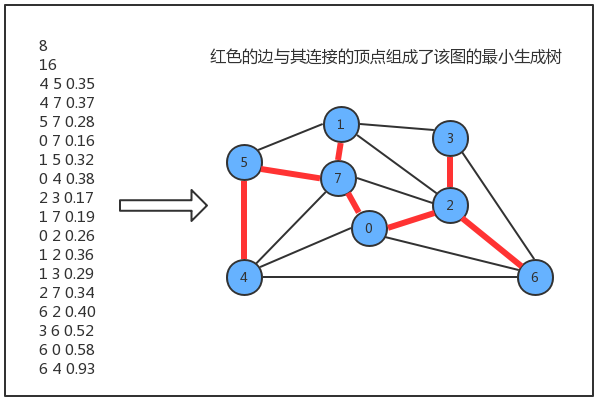

约定：

> 只考虑连通图。最小生成树的定义说明它只能存在于连通图中，如果图不是连通的，那么分别计算每个连通图子图的最小生成树，合并到一起称为最小生成森林。

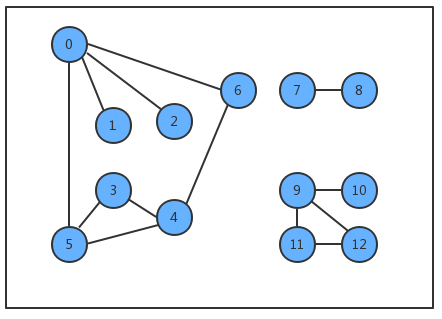

> 所有边的权重都各不相同。如果不同的边权重可以相同，那么一副图的最小生成树就可能不唯一了，虽然我们的算法可以处理这种情况，但为了好理解，我们约定所有边的权重都各不相同。

##### 1、最小生成树的原理

1. 用一条边接树中的任意两个顶点都会产生一个新的环；

   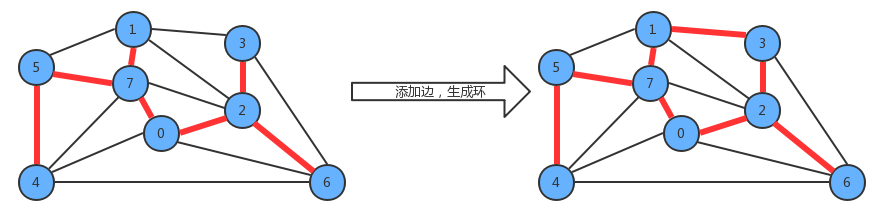

2. 从树中删除任意一条边，将会得到两棵独立的树；

   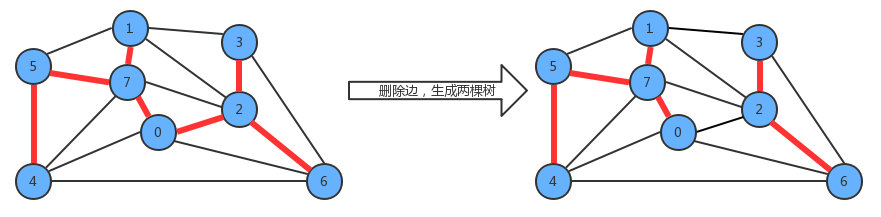

##### 2、切分定理

> 要从一副连通图中找出该图的最小生成树，需要通过切分定理完成。

**切分**：

> 将图的所有顶点按照某些规则分为两个非空且没有交集的集合。

**横切边**：

> 连接两个属于不同集合的顶点的边称之为横切边。

例如我们将图中的顶点切分为两个集合，灰色顶点属于一个集合，白色顶点属于另外一个集合，那么效果如下：

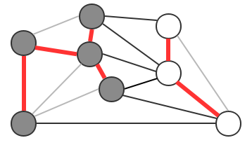

**切分定理**：

> 在一副加权图中，给定任意的切分，它的横切边中的权重最小者必然属于图中的最小生成树。

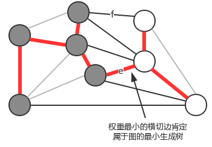

注意:一次切分产生的多个横切边中，权重最小的边不一定是所有横切边中唯一属于图的最小生成树的边。

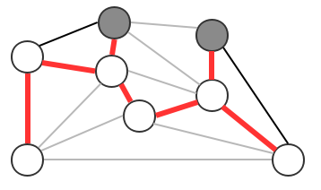


#### 2、贪心算法

> 贪心算法是计算图的最小生成树的基础算法，它的基本原理就是切分定理，使用切分定理找到最小生成树的一条边，不断的重复直到找到最小生成树的所有边。如果图有V个顶点，那么需要找到V-1条边，就可以表示该图的最小生成树。

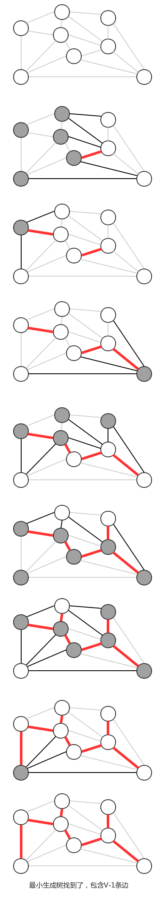

计算图的最小生成树的算法有很多种，但这些算法都可以看做是贪心算法的一种特殊情况，这些算法的不同之处在于：**保存切分和判定权重最小的横切边的方式**。

#### 3、Prim算法

> 它的每一步都会为一棵生成中的树添加一条边。一开始这棵树只有一个顶点，然后会向它添加V-1条边，每次总是将下一条连接树中的顶点与不在树中的顶点且权重最小的边加入到树中。

**Prim算法的切分规则**：

> 把最小生成树中的顶点看做是一个集合，把不在最小生成树中的顶点看做是另外一个集合。

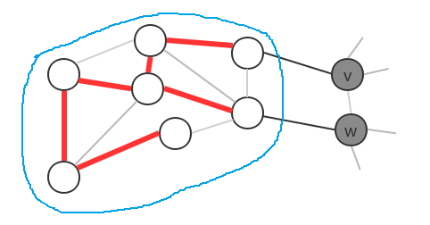

##### 1、API算法

| 类名     | PrimMST                                                      |
| -------- | ------------------------------------------------------------ |
| 构造方法 | PrimMST(EdgeWeightedGraph G)：根据一副加权无向图，创建最小生成树计算对象； |
| 成员方法 | private void visit(EdgeWeightedGraph G, int v)：将顶点v添加到最小生成树中，并且更新数据<br/>public Queue edges():获取最小生成树的所有边 |
| 成员变量 | private Edge[] edgeTo: 索引代表顶点，值表示当前顶点和最小生成树之间的最短边<br/>private double[] distTo: 索引代表顶点，值表示当前顶点和最小生成树之间的最短边的权重<br/>private boolean[] marked:索引代表顶点，如果当前顶点已经在树中，则值为true，否则为false<br/>private IndexMinPriorityQueue pq:存放树中顶点与非树中顶点之间的有效横切边 |

##### 2、实现原理

> Prim算法始终将图中的顶点切分成两个集合，最小生成树顶点和非最小生成树顶点，通过不断的重复做某些操作，可以逐渐将非最小生成树中的顶点加入到最小生成树中，直到所有的顶点都加入到最小生成树中。

我们在设计API的时候，使用最小索引优先队列存放树中顶点与非树中顶点的有效横切边，那么它是如何表示的呢？

> 我们可以让最小索引优先队列的索引值表示图的顶点，让最小索引优先队列中的值表示从其他某个顶点到当前顶点的边权重。

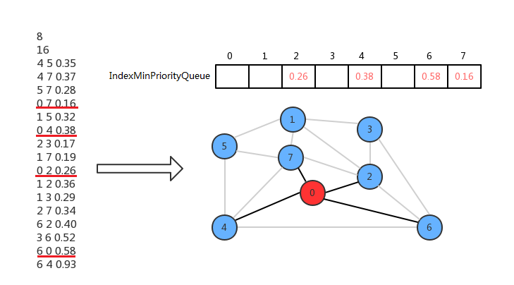

初始化状态，先默认0是最小生成树中的唯一顶点，其他的顶点都不在最小生成树中，此时横切边就是顶点0的邻接表中0-2,0-4,0-6,0-7这四条边，我们只需要将索引优先队列的2、4、6、7索引处分别存储这些边的权重值就可以表示了。

现在只需要从这四条横切边中找出权重最小的边，然后把对应的顶点加进来即可。所以找到0-7这条横切边的权重最小，因此把0-7这条边添加进来，此时0和7属于最小生成树的顶点，其他的不属于，现在顶点7的邻接表中的边也成为了横切边，这时需要做两个作：

- 0-7这条边已经不是横切边了，需要让它失效：只需要调用最小索引优先队列的delMin()方法即可完成；
- 2和4顶点各有两条连接指向最小生成树，需要只保留一条：
- 4-7的权重小于0-4的权重，所以保留4-7，调用索引优先队列的change(4,0.37)即可，
- 0-2的权重小于2-7的权重，所以保留0-2，不需要做额外操作。

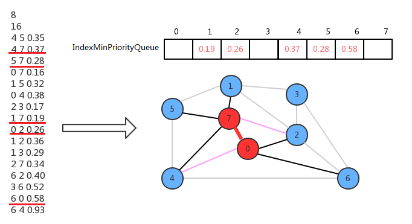

我们不断重复上面的动作，就可以把所有的顶点添加到最小生成树中。

##### 3、代码实现

```java
public class PrimMST {
    /**
     * 索引代表顶点，值表示当前顶点和最小生成树之间的最短边
     */
    private Edge[] edgeTo;
    /**
     * 索引代表顶点，值表示当前顶点和最小生成树之间的最短边的权重
     */
    private double[] distTo;
    /**
     * 索引代表顶点，如果当前顶点已经在树中，则值为true，否则为false
     */
    private boolean[] marked;
    /**
     * 存放树中顶点与非树中顶点之间的有效横切边
     */
    private IndexMinPriorityQueue pq;

    /**
     * 根据一副加权无向图，创建最小生成树计算对象；
     * @param G
     */
    public PrimMST(EdgeWeightedGraph G){
        //创建一个和图的顶点数一样大小的Edge数组，表示边
        this.edgeTo = new Edge[G.V()];
        //创建一个和图的顶点数一样大小的double数组，表示权重，并且初始化数组中的内容为无穷大，无穷大即表示不存在这样的边
        this.distTo = new double[G.V()];
        Arrays.fill(distTo, Double.POSITIVE_INFINITY);
        //创建一个和图的顶点数一样大小的boolean数组，表示当前顶点是否已经在树中
        this.marked = new boolean[G.V()];
        //创建一个和图的顶点数一样大小的索引优先队列，存储有效横切边
        this.pq = new IndexMinPriorityQueue<>(G.V());
        //默认让顶点0进入树中，0没有与其他顶点连接，初始化distTo[0]=0.0
        distTo[0] = 0.0;
        //初始化pq
        pq.insert(0,0.0);
        //遍历有效边队列
        while (!pq.isEmpty()){
            //找到权重最小的横切边对应的顶点，加入到最小生成树中
            visit(G, pq.delMin());
        }
    }

    /**
     *  将顶点v添加到最小生成树中，并且更新数据
     * @param G
     * @param v
     */
    private void visit(EdgeWeightedGraph G, int v){
        //把顶点v增加在树中
        marked[v] = true;
        //遍历顶点v的邻接表，得到每一条边Edge e
        for (Edge edge : G.adj(v)) {
            //找到另一个顶点w
            int w = edge.other(v);
            if (marked[w]){
                return;
            }
            //如果v-w边e的权重比目前distTo[w]权重小，则需要修正数据
            if (edge.weight() < distTo[w]){
                //把顶点w距离最小生成树的边修改为e
                edgeTo[w] = edge;
                //把顶点w距离最小生成树的边的权重修改为e.weight()
                distTo[w] = edge.weight();
                //如果pq中存储的有效横切边已经包含了w顶点，则需要修正最小索引优先队列w索引关联的权重值
                if (pq.contains(w)) {
                    pq.changeItem(w, edge.weight());
                } else {
                    //如果pq中存储的有效横切边不包含w顶点，则需要向最小索引优先队列中添加v-w和其权重值
                    pq.insert(w, edge.weight());
                }
            }
        }
    }

    /**
     * 获取最小生成树的所有边
     * @return
     */
    public Queue<Edge> edges(){
        Queue<Edge> edges = new Queue<>();
        for (int i = 0; i < marked.length; i++) {
            if (edgeTo[i] != null){
                edges.enqueue(edgeTo[i]);
            }
        }
        return edges;
    }
}
```

- 测试数据

  ```txt
  8
  16
  4 5 0.35
  4 7 0.37
  5 7 0.28
  0 7 0.16
  1 5 0.32
  0 4 0.38
  2 3 0.17
  1 7 0.19
  0 2 0.26
  1 2 0.36
  1 3 0.29
  2 7 0.34
  6 2 0.40
  3 6 0.52
  6 0 0.58
  6 4 0.93
  ```

- 测试类

  ```java
  public class PrimTest {
  
      public static void main(String[] args) throws Exception{
          BufferedReader br = new BufferedReader(new InputStreamReader(Objects.requireNonNull(PrimTest.class.getClassLoader().getResourceAsStream("primTestData.txt"))));
          //读取顶点数目，初始化EdgeWeightedGraph图
          int number = Integer.parseInt(br.readLine());
          EdgeWeightedGraph edgeWeightedGraph = new EdgeWeightedGraph(number);
          //读取边的数目
          int edgeNumber = Integer.parseInt(br.readLine());
          //循环读取每一条边，并调用addEdge方法
          for (int i = 0; i < edgeNumber; i++) {
              String line = br.readLine();
              int v = Integer.parseInt(line.split(" ")[0]);
              int w = Integer.parseInt(line.split(" ")[1]);
              double weight = Double.parseDouble(line.split(" ")[2]);
              edgeWeightedGraph.addEdge(new Edge(v, w, weight));
          }
          //构建PrimMST对象
          PrimMST mst = new PrimMST(edgeWeightedGraph);
          //获取最小生成树的边
          Queue<Edge> edges = mst.edges();
          //打印输出
          for (Edge edge : edges) {
              if (edge!=null){
                  System.out.println(edge.either() + "-" + edge.other(edge.either()) + "::" + edge.weight());
              }
          }
      }
  }
  ```


#### 4、kruskal算法

> kruskal算法是计算一副加权无向图的最小生成树的另外一种算法，它的主要思想是按照边的权重(从小到大)处理它们，将边加入最小生成树中，加入的边不会与已经加入最小生成树的边构成环，直到树中含有V-1条边为止。

**kruskal算法和prim算法的区别**：

> Prim算法是一条边一条边的构造最小生成树，每一步都为一棵树添加一条边。
>
> kruskal算法构造最小生成树的时候也是一条边一条边地构造，但它的切分规则是不一样的。它每一次寻找的边会连接一片森林中的两棵树。如果一副加权无向图由V个顶点组成，初始化情况下每个顶点都构成一棵独立的树，则V个顶点对应V棵树，组成一片森林，kruskal算法每一次处理都会将两棵树合并为一棵树，直到整个森林中只剩一棵树为止。

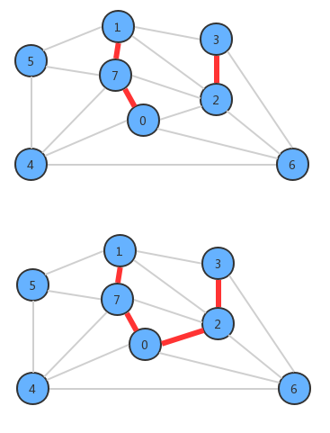

##### 1、API设计

| 类名     | KruskalMST                                                   |
| -------- | ------------------------------------------------------------ |
| 构造函数 | KruskalMST(EdgeWeightedGraph G)：根据一副加权无向图，创建最小生成树计算对象； |
| 成员方法 | public Queue edges():获取最小生成树的所有边                  |
| 成员变量 | private Queue mst：保存最小生成树的所有边<br/>private UF_Tree_Weighted uf: 索引代表顶点，使用uf.connect(v,w)可以判断顶点v和顶点w是否在同一颗树中，使用uf.union(v,w)可以把顶点v所在的树和顶点w所在的树合并<br/>private MinPriorityQueue pq: 存储图中所有的边，使用最小优先队列，对边按照权重进行排序 |

##### 2实现原理

> 在设计API的时候，使用了一个MinPriorityQueue pq存储图中所有的边，每次使用pq.delMin()取出权重最小的边，并得到该边关联的两个顶点v和w，通过uf.connect(v,w)判断v和w是否已经连通，如果连通，则证明这两个顶点在同一棵树中，那么就不能再把这条边添加到最小生成树中，因为在一棵树的任意两个顶点上添加一条边，都会形成环，而最小生成树不能有环的存在，如果不连通，则通过uf.connect(v,w)把顶点v所在的树和顶点w所在的树合并成一棵树，并把这条边加入到mst队列中，这样如果把所有的边处理完，最终mst中存储的就是最小生树的所有边。

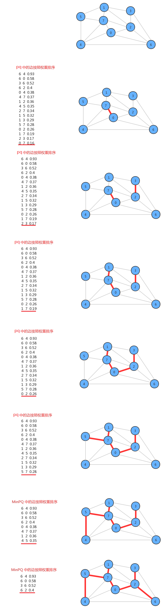

##### 3、代码实现

```java
public class KruskalMST {
    /**
     * 保存最小生成树的所有边
     */
    private Queue<Edge> mst;
    /**
     * :索引代表顶点，使用uf.connect(v,w)可以判断顶点v和顶点w是否在同一颗树中
     * 使用uf.union(v,w)可以把顶点v所在的树和顶点w所在的树合并
     */
    private UFTreeWeighted uf;
    /**
     * 存储图中所有的边，使用最小优先队列，对边按照权重进行排序
     */
    private MinPriorityQueue<Edge> pq;

    public KruskalMST(EdgeWeightedGraph G){
        //初始化mst队列
        this.mst = new Queue<Edge>();
        //初始化并查集对象uf,容量和图的顶点数相同
        this.uf = new UFTreeWeighted(G.V());
        //初始化最小优先队列pq，容量比图的边的数量大1，并把图中所有的边放入pq中
        this.pq = new MinPriorityQueue<>(G.E()+1);
        for (Edge edge : G.edges()) {
            pq.insert(edge);
        }
        //如果优先队列pq不为空，也就是还有边未处理，并且mst中的边还不到V-1条，继续遍历
        while (!pq.isEmpty() && mst.size() < G.V() - 1) {
            //取出pq中权重最小的边e
            Edge e = pq.delMin();
            //获取边e的两个顶点v和w
            int v = e.either();
            int w = e.other(v);
            /*
            通过uf.connect(v,w)判断v和w是否已经连通，
            如果连通:
            则证明这两个顶点在同一棵树中，那么就不能再把这条边添加到最小生成树中，因为在一棵
            树的任意两个顶点上添加一条边，都会形成环，而最小生成树不能有环的存在;

            如果不连通:
            则通过uf.connect(v,w)把顶点v所在的树和顶点w所在的树合并成一棵树,并把这条边加入到mst队列中
            */
            if (uf.connected(v,w)){
                continue;
            }
            uf.union(v,w);
            mst.enqueue(e);
        }
    }

    /**
     * 获取最小生成树的所有边
     * @return
     */
    public Queue<Edge> edges() {
        return mst;
    }
}

```

- 测试类

  ```java
  public class KruskalTest {
  
      public static void main(String[] args) throws Exception{
          BufferedReader br = new BufferedReader(new InputStreamReader(Objects.requireNonNull(KruskalTest.class.getClassLoader().getResourceAsStream("primTestData.txt"))));
          //读取顶点数目，初始化EdgeWeightedGraph图
          int number = Integer.parseInt(br.readLine());
          EdgeWeightedGraph edgeWeightedGraph = new EdgeWeightedGraph(number);
          //读取边的数目
          int edgeNumber = Integer.parseInt(br.readLine());
          //循环读取每一条边，并调用addEdge方法
          for (int i = 0; i < edgeNumber; i++) {
              String line = br.readLine();
              int v = Integer.parseInt(line.split(" ")[0]);
              int w = Integer.parseInt(line.split(" ")[1]);
              double weight = Double.parseDouble(line.split(" ")[2]);
              edgeWeightedGraph.addEdge(new Edge(v, w, weight));
          }
          //构建PrimMST对象
          KruskalMST mst = new KruskalMST(edgeWeightedGraph);
          //获取最小生成树的边
          Queue<Edge> edges = mst.edges();
          //打印输出
          for (Edge edge : edges) {
              if (edge!=null){
                  System.out.println(edge.either() + "-" + edge.other(edge.either()) + "::" + edge.weight());
              }
          }
      }
  }
  ```


### 10、加权有向图

#### 1、加权有向图的表示

##### 1、API设计

| 类名     | DirectedEdge                                                 |
| -------- | ------------------------------------------------------------ |
| 构造方法 | DirectedEdge(int v,int w,double weight)：通过顶点v和w，以及权重weight值构造一个边对象 |
| 成员方法 | public double weight():获取边的权重值<br/>public int from():获取有向边的起点<br/>public int to():获取有向边的终点 |
| 成员变量 | private final int v：起点<br/>private final int w：终点<br/>private final double weight：当前边的权重 |

##### 2、代码实现

```java
public class DirectedEdge {

    /**
     * 起点
     */
    private final int v;

    /**
     * 终点
     */
    private final int w;

    /**
     * 当前边的权重
     */
    private final double weight;


    public DirectedEdge(int v, int w, double weight) {
        this.v = v;
        this.w = w;
        this.weight = weight;
    }

    /**
     * 获取边的权重值
     * @return
     */
    public double weight(){
        return weight;
    }

    /**
     * 获取有向边的起点
     * @return
     */
    public int from(){
        return v;
    }

    /**
     * :获取有向边的终点
     * @return
     */
    public int to(){
        return w;
    }
}
```

#### 2、加权有向图的实现

> 之前我们已经完成了有向图，在有向图的基础上，我们只需要把边的表示切换成DirectedEdge对象即可。

##### 1、API设计

| 类名     | EdgeWeightedDigraph                                          |
| -------- | ------------------------------------------------------------ |
| 构造方法 | EdgeWeightedDigraph(int V)：创建一个含有V个顶点的空加权有向图 |
| 成员方法 | public int V():获取图中顶点的数量<br/>public int E():获取图中边的数量<br/>public void addEdge(DirectedEdge e):向加权有向图中添加一条边e<br/>public Queue adj(int v)：获取由顶点v指出的所有的边<br/>public Queue edges()：获取加权有向图的所有边 |
| 成员变量 | private final int V: 记录顶点数量<br/>private int E: 记录边数量<br/>private Queue[] adj: 邻接表 |

##### 2、代码实现

```java
public class EdgeWeightedDigraph {

    /**
     * : 记录顶点数量
     */
    private final int V;
    /**
     * : 记录边数量
     */
    private int E;
    /**
     * : 邻接表
     */
    private Queue<DirectedEdge>[] adj;

    public EdgeWeightedDigraph(int v) {
        //初始化顶点数
        this.V = v;
        //初始化边数量
        this.E = 0;
        this.adj = new Queue[v];
        //初始化邻接表的空队列
        for (int i = 0; i < this.adj.length; i++) {
            adj[i] = new Queue<DirectedEdge>();
        }
    }

    /**
     * 获取图中顶点的数量
     * @return
     */
    public int V(){
        return V;
    }

    /**
     * 获取边的数量
     * @return
     */
    public int E(){
        return E;
    }

    /**
     * 向加权有向图添加一条边
     * @param e
     */
    public void addEdge(DirectedEdge e){
        //获取有向边的起点
        int from = e.from();
        //因为是有向图，所以边e只需要出现在起点v的邻接表中
        adj[from].enqueue(e);
        //边的数量+1
        E++;
    }

    /**
     * 获取由顶点v指出的所有的边
     * @param v
     * @return
     */
    public Queue<DirectedEdge> adj(int v){
        return adj[v];
    }

    /**
     * 获取加权有向图的所有边
     * @return
     */
    public Queue<DirectedEdge> edges(){
        Queue<DirectedEdge> queue = new Queue<>();
        //遍历顶点，拿到每个顶点的邻接表
        for (int i = 0; i < this.V; i++) {
            //遍历邻接表，拿到邻接表中的每条边存储到队列中
            for (DirectedEdge e : adj(i)) {
                queue.enqueue(e);
            }
        }
        return queue;
    }
}
```


### 11、最短路径

#### 1、最短路径定义及性质

##### 1、定义

> 在一副加权有向图中，从顶点s到顶点t的最短路径是所有从顶点s到顶点t的路径中总权重最小的那条路径。

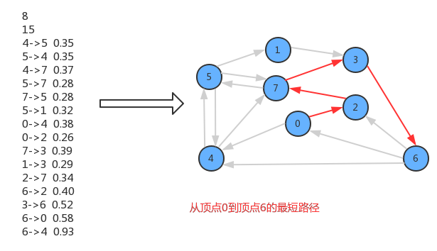

##### 2、性质

> 1. 路径具有方向性；
> 2. **权重不一定等价于距离。权重可以是距离、时间、花费等内容，权重最小指的是成本最低**
> 3. 只考虑连通图。一副图中并不是所有的顶点都是可达的，如果s和t不可达，那么它们之间也就不存在最短路径，为了简化问题，这里只考虑连通图。
> 4. 最短路径不一定是唯一的。从一个顶点到达另外一个顶点的权重最小的路径可能会有很多条，这里只需要找出一条即可。

**最短路径树**：

> 给定一副加权有向图和一个顶点s，以s为起点的一棵最短路径树是图的一副子图，它包含顶点s以及从s可达的所有顶点。这棵有向树的根结点为s，树的每条路径都是有向图中的一条最短路径。

#### 2、最短路径树的API设计

> 计算最短路径树的经典算法是dijstra算法

| 类名     | DijkstraSP                                                   |
| -------- | ------------------------------------------------------------ |
| 构造方法 | public DijkstraSP(EdgeWeightedDigraph G, int s)：根据一副加权有向图G和顶点s，创建一个计算顶点为s的最短路径树对象 |
| 成员方法 | private void relax(EdgeWeightedDigraph G, int v)：松弛图G中的顶点v<br/>public double distTo(int v):获取从顶点s到顶点v的最短路径的总权重<br/>public boolean hasPathTo(int v):判断从顶点s到顶点v是否可达<br/>public Queue pathTo(int v):查询从起点s到顶点v的最短路径中所有的边 |
| 成员变量 | private DirectedEdge[] edgeTo: 索引代表顶点，值表示从顶点s到当前顶点的最短路径上的最后一条边<br/>private double[] distTo: 索引代表顶点，值从顶点s到当前顶点的最短路径的总权重<br/>private IndexMinPriorityQueue pq:存放树中顶点与非树中顶点之间的有效横切边 |

#### 3、松弛技术

松弛这个词来源于生活：一条橡皮筋沿着两个顶点的某条路径紧紧展开，如果这两个顶点之间的路径不止一条，还有存在更短的路径，那么把皮筋转移到更短的路径上，皮筋就可以放松了。

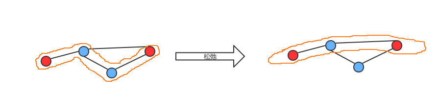

松弛这种简单的原理刚好可以用来计算最短路径树。

> 在我们的API中，需要用到两个成员变量edgeTo和distTo，分别存储边和权重。一开始给定一幅图G和顶点s，我们只知道图的边以及这些边的权重，其他的一无所知，此时初始化顶点s到顶点s的最短路径的总权重disto[s]=0；顶点s到其他顶点的总权重默认为无穷大，随着算法的执行，不断的使用松弛技术处理图的边和顶点，并按一定的条件更新edgeTo和distTo中的数据，最终就可以得到最短路劲树。

##### 1、边的松弛

放松边v->w意味着检查从s到w的最短路径是否先从s到v，然后再从v到w？

> 如果是，则v-w这条边需要加入到最短路径树中，更新edgeTo和distTo中的内容：edgeTo[w]=表示v->w这条边的DirectedEdge对象，distTo[w]=distTo[v]+v->w这条边的权重；
>
> 如果不是，则忽略v->w这条边。

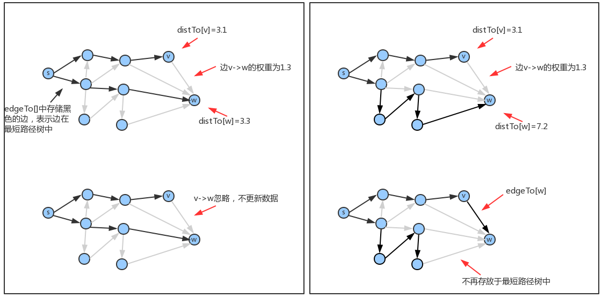


##### 2、顶点的松弛

> 顶点的松弛是基于边的松弛完成的，只需要把某个顶点指出的所有边松弛，那么该顶点就松弛完毕。例如要松弛顶点v，只需要遍历v的邻接表，把每一条边都松弛，那么顶点v就松弛了。

如果把起点设置为顶点0，那么找出起点0到顶点6的最短路径0->2->7>3->6的过程如下:

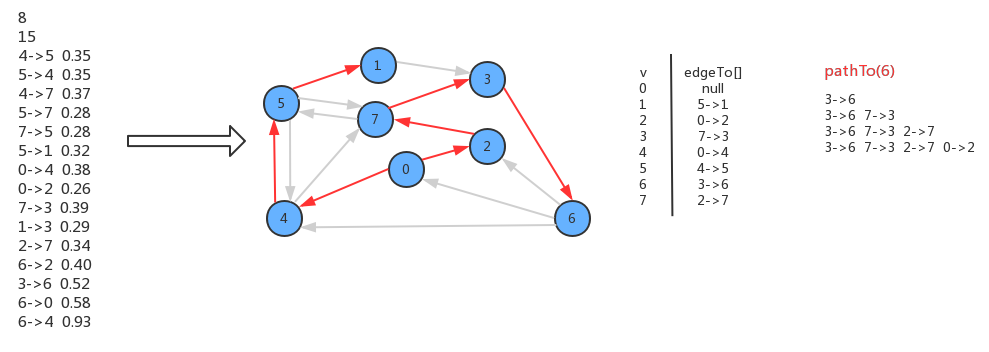

#### 4、 Dijstra算法实现

> Disjstra算法的实现和Prim算法很类似，构造最短路径树的每一步都是向这棵树中添加一条新的边，而这条新的边是有效横切边pq队列中的权重最小的边。

```java
public class DijkstraSP {

    /**
     * 索引代表顶点，值表示从顶点s到当前顶点的最短路径上的最后一条边
     */
    private DirectedEdge[] edgeTo;
    /**
     * 索引代表顶点，值从顶点s到当前顶点的最短路径的总权重
     */
    private double[] distTo;

    /**
     * 存放树中顶点与非树中顶点之间的有效横切边
     */
    private IndexMinPriorityQueue<Double> pq;
    /**
     * 根据一副加权有向图G和顶点s，创建一个计算顶点为s的最短路径树对象
     */
    public DijkstraSP(EdgeWeightedDigraph G, int s){
        //创建一个和图的顶点数一样的数组
        this.edgeTo = new DirectedEdge[G.V()];
        this.distTo = new double[G.V()];
        for (int i = 0; i < distTo.length; i++) {
            distTo[i] = Double.POSITIVE_INFINITY;
        }
        //创建一个和图的顶点数一样大小的索引优先队列，存储有效横切边
        this.pq = new IndexMinPriorityQueue<>(G.V());
        //默认让顶点s进入树中，但s顶点目前没有与树中其他的顶点相连接，因此初始化distTo[s]=0.0
        distTo[s] = 0.0;
        //使用顶点s和权重0.0初始化pq
        pq.insert(s, 0.0);
        //遍历有效边队列
        while (!pq.isEmpty()) {
        //松弛图G中的顶点
            relax(G, pq.delMin());
        }
    }

    /**
     * ：松弛图G中的顶点v
     * @param G
     * @param v
     */
    private void relax(EdgeWeightedDigraph G, int v){
        //松弛顶点v就是松弛顶点v邻接表中的每一条边，遍历邻接表
        for (DirectedEdge e : G.adj(v)) {
            //获取边e的终点
            int w = e.to();
            //起点s到顶点w的权重是否大于起点s到顶点v的权重+边e的权重,如果大于，
            // 则修改s->w的路径：edgeTo[w]=e,并修改distTo[v] = distTo[v]+e.weitht(),如果不大于，则忽略
            if (distTo(w)>distTo(v)+e.weight()){
                distTo[w]=distTo[v]+e.weight();
                edgeTo[w]=e;
                //如果顶点w已经存在于优先队列pq中，则重置顶点w的权重
                if (pq.contains(w)){
                    pq.changeItem(w,distTo(w));
                }else{
                    //如果顶点w没有出现在优先队列pq中，则把顶点w及其权重加入到pq中
                    pq.insert(w,distTo(w));
                }
            }
        }
    }

    /**
     * :获取从顶点s到顶点v的最短路径的总权重
     * @param v
     * @return
     */
    public double distTo(int v){
        return distTo[v];
    }

    /**
     * :判断从顶点s到顶点v是否可达
     * @param v
     * @return
     */
    public boolean hasPathTo(int v){
        return distTo[v]<Double.POSITIVE_INFINITY;
    }

    /**
     * :查询从起点s到顶点v的最短路径中所有的边
     * @param v
     * @return
     */
    public Queue pathTo(int v){
        //如果顶点s到v不可达，则返回null
        if (!hasPathTo(v)){
            return null;
        }
        //创建队列Queue保存最短路径的边
        Queue<DirectedEdge> edges = new Queue<>();
        //从顶点v开始，逆向寻找，一直找到顶点s为止，而起点s为最短路劲树的根结点，所以edgeTo[s]=null;
        DirectedEdge e;
        while(true){
            e = edgeTo[v];
            if (e==null){
                break;
            }
            edges.enqueue(e);
            v = e.from();
        }
        return edges;
    }
}
```

- 测试类

```java
public class DijkstraSPTest {

    public static void main(String[] args) throws Exception{
        BufferedReader br = new BufferedReader(new InputStreamReader(Objects.requireNonNull(DijkstraSPTest.class.getClassLoader().getResourceAsStream("primTestData.txt"))));
        //读取顶点数目，初始化EdgeWeightedGraph图
        int number = Integer.parseInt(br.readLine());
        EdgeWeightedDigraph edgeWeightedGraph = new EdgeWeightedDigraph(number);
        //读取边的数目
        int edgeNumber = Integer.parseInt(br.readLine());
        //循环读取每一条边，并调用addEdge方法
        for (int i = 0; i < edgeNumber; i++) {
            String line = br.readLine();
            int v = Integer.parseInt(line.split(" ")[0]);
            int w = Integer.parseInt(line.split(" ")[1]);
            double weight = Double.parseDouble(line.split(" ")[2]);
            edgeWeightedGraph.addEdge(new DirectedEdge(v, w, weight));
        }
        //构建PrimMST对象
        DijkstraSP mst = new DijkstraSP(edgeWeightedGraph,0);
        //获取起点0到顶点6的最短路径
        Queue<DirectedEdge> edges = mst.pathTo(6);
            //打印输出
        for (DirectedEdge edge : edges) {
            System.out.println(edge.from() + "->" + edge.to() + "::" + edge.weight());
        }
    }
}
```

