## 1、Lambda表达式

### 1、初体验

> 目标：了解使用匿名内部类存在的问题，体验Lambda
>
> 匿名内部类存在的问题：当需要启动一个线程去完成任务时，通常会通过Runnable 接口来定义任务内容，并使用Thread 类来启动该线程。

#### 1、传统写法

```java
public class LambdaIntro01 {
    public static void main(String[] args) {
        new Thread(new Runnable() {
            @Override
            public void run() {
                System.out.println("启动一个线程");
            }
        }).start();
    }
}
```

**代码分析**：

> 由于面向对象的语法要求，首先创建一个Runnable 接口的匿名内部类对象来指定线程要执行的任务内容，再将其交给一个线程来启动。
>
> 对于Runnable 的匿名内部类用法，可以分析出几点内容：
>
> - Thread 类需要Runnable 接口作为参数，其中的抽象run 方法是用来指定线程任务内容的核心
> - 为了指定run 的方法体，不得不需要Runnable 接口的实现类
> - 为了省去定义一个Runnable 实现类的麻烦，不得不使用匿名内部类
> - 必须覆盖重写抽象run 方法，所以方法名称、方法参数、方法返回值不得不再写一遍，且不能写错
> - 而实际上，似乎只有方法体才是关键所在。

#### 2、lambda写法

> Lambda是一个匿名函数，可以理解为一段可以传递的代码。

```java
public class LambdaIntro01 {
    public static void main(String[] args) {
        new Thread(() ->{
            System.out.println("启动一个线程");
        }).start();
    }
}
```

**代码分析**：

> 这段代码和刚才的执行效果是完全一样的，可以在JDK 8或更高的编译级别下通过。从代码的语义中可以看出：我们启动了一个线程，而线程任务的内容以一种更加简洁的形式被指定。
> 我们只需要将要执行的代码放到一个Lambda表达式中，不需要定义类，不需要创建对象。


### 2、Lambda的标准格式

#### 1、格式

Lambda省去面向对象的条条框框，Lambda的标准格式格式由3个部分组成：

```java
(参数类型 参数名称) -> {
	代码体;
}
```

**格式说明**：

> (参数类型 参数名称)：参数列表
>
> {代码体;}：方法体
>
> -> ：箭头，分隔参数列表和方法体


#### 2、无参数无返回值的Lambda

```java
public interface PhoneStore {
    public abstract void buy();
}
```

```java
public class LambdaUse02 {

    public static void main(String[] args) {
        goStore(new PhoneStore() {
            @Override
            public void buy() {
                System.out.println("买华为手机");
            }
        });

        goStore(() -> System.out.println("买小米手机"));
    }

    public static void goStore(PhoneStore phoneStore){
        phoneStore.buy();
    }
}
```


#### 3、有参数有返回值的Lambda

> 下面举例演示`java.util.Comparator<T> `接口的使用场景代码，其中的抽象方法定义为：
>
> ```JAVA
> public abstract int compare(T o1, T o2);
> ```
>
> 当需要对一个对象集合进行排序时， Collections.sort 方法需要一个Comparator 接口实例来指定排序的规则。

实体类

```java
public class Person {

    private String name;

    private Integer age;

    private Date birthday;

    public Person(String name, Integer age, Date birthday) {
        this.name = name;
        this.age = age;
        this.birthday = birthday;
    }

    public String getName() {
        return name;
    }

    public void setName(String name) {
        this.name = name;
    }

    public Integer getAge() {
        return age;
    }

    public void setAge(Integer age) {
        this.age = age;
    }

    public Date getBirthday() {
        return birthday;
    }

    public void setBirthday(Date birthday) {
        this.birthday = birthday;
    }

    @Override
    public String toString() {
        return new StringJoiner(", ", Person.class.getSimpleName() + "[", "]")
                .add("name='" + name + "'")
                .add("age=" + age)
                .add("birthday=" + birthday)
                .toString();
    }
}
```


**传统写法VS Lambda写法**

传统写法

```java
public class Lambda03 {
    public static void main(String[] args) {
        ArrayList<Person> persons = new ArrayList<>();
        persons.add(new Person("刘德华", 58, new Date()));
        persons.add(new Person("张学友", 58, new Date()));
        persons.add(new Person("刘德华", 54, new Date()));
        persons.add(new Person("黎明", 53, new Date()));

        Collections.sort(persons, new Comparator<Person>() {
            @Override
            public int compare(Person o1, Person o2) {
                return o1.getAge() - o2.getAge();
            }
        });

        for (Person person : persons) {
            System.out.println(person);
        }
    }
}
```

Lambda写法

```java
public class Lambda03 {
    public static void main(String[] args) {
        ArrayList<Person> persons = new ArrayList<>();
        persons.add(new Person("刘德华", 58, new Date()));
        persons.add(new Person("张学友", 58, new Date()));
        persons.add(new Person("刘德华", 54, new Date()));
        persons.add(new Person("黎明", 53, new Date()));
        
        Collections.sort(persons,(o1, o2)->{
            return o1.getAge() - o2.getAge();
        });
        //另一种写法
        Collections.sort(persons, Comparator.comparingInt(Person::getAge));

        for (Person person : persons) {
            System.out.println(person);
        }
    }
}
```


### 3、省略格式

> 在Lambda标准格式的基础上，使用省略写法的规则为：
>
> 1. 小括号内参数的类型可以省略
> 2. 如果小括号内有且仅有一个参数，则小括号可以省略
> 3. 如果大括号内有且仅有一个语句，可以同时省略大括号、return关键字及语句分号

```java
(int a) ->{
    return new Person();
}
```

省略后

```java
a -> new Person();
```


### 4、前提条件

> Lambda的语法非常简洁，但是Lambda表达式不是随便使用的，使用时有几个条件要特别注意：
>
> 1. 方法的参数或局部变量类型必须为接口才能使用Lambda
> 2. 接口中有且仅有一个抽象方法

```JAVA
public interface Flyable {

    public abstract void flying();
}
```

```JAVA
public class Lambda04 {

    public static void main(String[] args) {
        test(() ->{});

        Flyable flyable = new Flyable() {
            @Override
            public void flying() {

            }
        };

        Flyable flyable1 = () ->{

        };
    }

    public static void test(Flyable flyable){
        flyable.flying();
    }
}
```


### 5、函数式接口

> 函数式接口在Java中是指：**有且仅有一个抽象方法的接口**。
>
> 函数式接口，即适用于函数式编程场景的接口。而Java中的函数式编程体现就是Lambda，所以函数式接口就是可以适用于Lambda使用的接口。只有确保接口中有且仅有一个抽象方法，Java中的Lambda才能顺利地进行推导。

FunctionalInterface注解

与@Override 注解的作用类似，Java 8中专门为函数式接口引入了一个新的注解： @FunctionalInterface 。该注解可用于一个接口的定义上：

```java
@FunctionalInterface
public interface Operator {
    void myMethod();
}
```

> 一旦使用该注解来定义接口，编译器将会强制检查该接口是否确实有且仅有一个抽象方法，否则将会报错。不过，即使不使用该注解，只要满足函数式接口的定义，这仍然是一个函数式接口，使用起来都一样。


### 6、Lambda和匿名内部类对比

| 不同           | Lambda                          | 匿名内部类                     |
| -------------- | ------------------------------- | ------------------------------ |
| 所需的类型     | 需要的类型必须是接口            | 需要的类型可以是类,抽象类,接口 |
| 抽象方法的数量 | 所需的接口只能有一个抽象方法    | 所需的接口中抽象方法的数量随意 |
| 实现原理       | 是在程序运行的时候动态生成class | 是在编译后会形成class          |

> 总结：当接口中只有一个抽象方法时,建议使用Lambda表达式,其他其他情况还是需要使用匿名内部类


## 2、接口静态方法

```java
interface 接口名 {
    修饰符 static 返回值类型 方法名() {
        代码;
    }
}
```

### 1、接口静态方法的使用

> 直接使用接口名调用即可：接口名.静态方法名();

```java
public class UseStaticFunction05 {

    public static void main(String[] args) {
        A.test();
    }

    interface A{
        public static void test(){
            System.out.println("接口静态方法");
        }
    }

    class B implements A{
        //静态方法不能重写
    }
}
```


### 2、接口默认方法和静态方法的区别

> 1. 默认方法通过实例调用，静态方法通过接口名调用。
> 2. 默认方法可以被继承，实现类可以直接使用接口默认方法，也可以重写接口默认方法。
> 3. 静态方法不能被继承，实现类不能重写接口静态方法，只能使用接口名调用。


### 3、总结

> 如何选择默认方法和静态方法？
>
> 如果这个方法需要被实现类继承或者重写，则使用默认方法；不需要被继承就是用静态方法


## 3、内置函数式接口

### 1、函数式接口的由来

> 我们知道使用Lambda表达式的前提是需要有函数式接口。而Lambda使用时不关心接口名，抽象方法名，只关心抽象方法的参数列表和返回值类型。因此为了让我们使用Lambda方便，JDK提供了大量常用的函数式接口。

```java
public class UserFunctionalInterface06 {

    public static void main(String[] args) {
        method((arr -> {
            int sum = 0;
            for (int i : arr) {
                sum += i;
            }
            return sum;
        }));
    }


    public static void method(Operator operator){
        int[] arr = {1, 3, 4, 5};
        int sum = operator.getSum(arr);
        System.out.println("sum = " + sum);
    }

    interface Operator{
        public abstract int getSum(int[] arr);
    }
}
```


### 2、常用内置函数式接口

> 它们主要在java.util.function 包中

1. Supplier接口

   ```java
   @FunctionalInterface
   public interface Supplier<T> {
       public abstract T get();
   }
   ```

2. Consumer接口

   ```java
   @FunctionalInterface
   public interface Consumer<T> {
       public abstract void accept(T t);
   }
   ```

3. Function接口

   ```java
   @FunctionalInterface
   public interface Function<T, R> {
       public abstract R apply(T t);
   }
   ```

4. Predicate接口

   ```java
   @FunctionalInterface
   public interface Predicate<T> {
       public abstract boolean test(T t);
   }
   //Predicate接口用于做判断,返回boolean类型的值
   ```

#### 1、Supplier接口

> `java.util.function.Supplier<T> `接口，它意味着"供给" , 对应的Lambda表达式需要“对外提供”一个符合泛型类型的对象数据。

```java
@FunctionalInterface
public interface Supplier<T> {
    public abstract T get();
}
```

供给型接口，通过Supplier接口中的get方法可以得到一个值，无参有返回的接口。

**使用Lambda表达式返回数组元素最大值**

```java
public class SupplierDemo07 {

    public static void main(String[] args) {
        getMax(() ->{
            int[] arr = {10,20,99,100,1001,1004};
            Arrays.sort(arr);
            return arr[arr.length - 1];
        });
    }

    private static void getMax(Supplier<Integer> supplier){
        Integer max = supplier.get();
        System.out.println("max = " + max);
    }
}
```


#### 2、Consumer接口

> `java.util.function.Consumer<T> `接口则正好相反，它不是生产一个数据，而是消费一个数据，其数据类型由泛型参数决定。

```java
@FunctionalInterface
public interface Consumer<T> {
    public abstract void accept(T t);
}
```

**使用Lambda表达式将一个字符串转成大写和小写的字符串**

Consumer消费型接口，可以拿到accept方法参数传递过来的数据进行处理, 有参无返回的接口。基本使用如：

```java
public class ConsumerDemo08 {

    public static void main(String[] args) {
        test((String s) ->{
            System.out.println(s.toUpperCase(Locale.ROOT));
        });
    }

    public static void test(Consumer<String> comsumer){
        comsumer.accept("hello xiaobear");
    }
}
```


**默认方法：andThen**

> 如果一个方法的参数和返回值全都是Consumer 类型，那么就可以实现效果：消费一个数据的时候，首先做一个操作，然后再做一个操作，实现组合。而这个方法就是Consumer 接口中的default方法andThen 。下面是JDK的源代码：

```java
default Consumer<T> andThen(Consumer<? super T> after) {
    Objects.requireNonNull(after);
    return (T t) -> { accept(t); after.accept(t); };
}
```

备注： java.util.Objects 的requireNonNull 静态方法将会在参数为null时主动抛出NullPointerException 异常。这省去了重复编写if语句和抛出空指针异常的麻烦。

要想实现组合，需要两个或多个Lambda表达式即可，而andThen 的语义正是“一步接一步”操作。例如两个步骤组合的情况：

```java
public class ConsumerAndThen09 {

    public static void main(String[] args) {
        //lambda表达式
        test((String s) ->{
            System.out.println(s.toUpperCase(Locale.ROOT));
        }, (String s) ->{
            System.out.println(s.toLowerCase(Locale.ROOT));
        });
        //简写
        test(s ->{
            System.out.println(s.toUpperCase(Locale.ROOT));
        }, s ->{
            System.out.println(s.toLowerCase(Locale.ROOT));
        });
    }

    public static void test(Consumer<String> c1, Consumer<String> c2){
        String str = "hello world";
        c1.andThen(c2).accept(str);
        c2.andThen(c1).accept(str);
    }
}
```


#### 3、Function接口

> `java.util.function.Function<T,R>` 接口用来根据一个类型的数据得到另一个类型的数据，前者称为前置条件，后者称为后置条件。有参数有返回值。

```java
@FunctionalInterface
public interface Function<T, R> {
    public abstract R apply(T t);
}
```

**使用Lambda表达式将字符串转成数字**

> Function转换型接口，对apply方法传入的T类型数据进行处理，返回R类型的结果，有参有返回的接口。使用的场景
> 例如：将String 类型转换为Integer 类型。

```java
public class Function10 {

    public static void main(String[] args) {
        test(s -> {
            return Integer.parseInt(s);
        });
        //简写
        test(Integer::parseInt);
    }

    public static void test(Function<String, Integer> func){
        Integer apply = func.apply("10");
        System.out.println(apply);
    }
}
```

**默认方法：andThen**
Function 接口中有一个默认的andThen 方法，用来进行组合操作。JDK源代码如：

```java
default <V> Function<T, V> andThen(Function<? super R, ? extends V> after) {
    Objects.requireNonNull(after);
    return (T t) -> after.apply(apply(t));
}
```

该方法同样用于“先做什么，再做什么”的场景，和Consumer 中的andThen 差不多：

```java
public class FunctionAndThen11 {

    public static void main(String[] args) {
        test(Integer::parseInt, integer -> {
            return integer * 10;
        });
    }

    public static void test(Function<String, Integer> f1, Function<Integer, Integer> f2){
        Integer apply = f1.andThen(f2).apply("66");
        System.out.println(apply);
    }
}

```

> 第一个操作是将字符串解析成为int数字，第二个操作是乘以10。两个操作通过andThen 按照前后顺序组合到了一起。
>
> 请注意，Function的前置条件泛型和后置条件泛型可以相同。


#### 4、Predicate接口

> 有时候我们需要对某种类型的数据进行判断，从而得到一个boolean值结果。这时可以使用`java.util.function.Predicate<T> `接口。

```java
@FunctionalInterface
public interface Predicate<T> {
    public abstract boolean test(T t);
}
//Predicate接口用于做判断,返回boolean类型的值
```

**使用Lambda判断一个人名如果超过3个字就认为是很长的名字**

对test方法的参数T进行判断，返回boolean类型的结果。用于条件判断的场景：

```java
public class Predicate12 {

    public static void main(String[] args) {
        test(s -> s.length() > 3,"华总的小熊");
    }

    public static void test(Predicate<String> predicate, String str){
        boolean test = predicate.test(str);
        System.out.println("你爱她吗：" + test);
    }
}
```

条件判断的标准是传入的Lambda表达式逻辑，只要名称长度大于3则认为很长。


**默认方法：and**

> 既然是条件判断，就会存在与、或、非三种常见的逻辑关系。其中将两个Predicate 条件使用“与”逻辑连接起来实
> 现“并且”的效果时，可以使用default方法and 。其JDK源码为：

```java
default Predicate<T> and(Predicate<? super T> other) {
    Objects.requireNonNull(other);
    return (t) -> test(t) && other.test(t);
}
```

测试内容：

> 使用Lambda表达式判断一个字符串中即包含W,也包含H
> 使用Lambda表达式判断一个字符串中包含W或者包含H
> 使用Lambda表达式判断一个字符串中即不包含W

- 如果要判断一个字符串既要包含大写“H”，又要包含大写“W”

  ```java
  public class Predicate_And_Or_Negate13 {
  
      public static void main(String[] args) {
          test(s -> s.contains("H"),s -> s.contains("W"));
      }
  
      public static void test(Predicate<String> p1, Predicate<String> p2) {
          String str = "HelloWorld";
          boolean b1 = p1.test(str); // 判断包含大写“H”
          boolean b2 = p2.test(str); // 判断包含大写“W”
          if (b1 && b2) {
              System.out.println("即包含W,也包含H");
          }
          boolean bb = p1.and(p2).test(str);
          if (bb) {
              System.out.println("即包含W,也包含H");
          }
      }
  }
  ```


**默认方法：or**
使用Lambda表达式判断一个字符串中包含W或者包含H
与and 的“与”类似，默认方法or 实现逻辑关系中的“或”。JDK源码为：

```java
default Predicate<T> or(Predicate<? super T> other) {
    Objects.requireNonNull(other);
    return (t) -> test(t) || other.test(t);
}
```

如果希望实现逻辑“字符串包含大写H或者包含大写W”，那么代码只需要将“and”修改为“or”名称即可，其他都不变：

```java
public class Predicate_And_Or_Negate13 {

    public static void main(String[] args) {
        test1(s -> s.contains("H"),s -> s.contains("W"));
    }

    public static void test1(Predicate<String> p1, Predicate<String> p2){
        String str = "HelloWorld";
        boolean b1 = p1.test(str); // 判断包含大写“H”
        boolean b2 = p2.test(str); // 判断包含大写“W”
        if (b1 || b2){
            System.out.println("有H,或者W");
        }
        boolean test = p1.or(p2).test(str);
        if(test){
            System.out.println("有H,或者W");
        }
    }
}
```

**默认方法：negate**
使用Lambda表达式判断一个字符串中即不包含W
“与”、“或”已经了解了，剩下的“非”（取反）也会简单。默认方法negate 的JDK源代码为：

```java
default Predicate<T> negate() {
    return (t) -> !test(t);
}
```

从实现中很容易看出，它是执行了test方法之后，对结果boolean值进行“!”取反而已。一定要在test 方法调用之前调用negate 方法，正如and 和or 方法一样：

```java
public class Predicate_And_Or_Negate13 {

    public static void main(String[] args) {
        test2(s -> s.contains("H"),s -> s.contains("W"));
    }

    public static void test2(Predicate<String> p1, Predicate<String> p2){
        String str = "HelloWorld";
        boolean b1 = p1.test(str); // 判断包含大写“H”
        boolean b2 = p2.test(str); // 判断包含大写“W”
        if (!b1){
            System.out.println("没有H");
        }
        boolean test = p1.negate().test(str);
        if (test){
            System.out.println("没有H");
        }
    }
}
```


## 4、引用

### 1、方法引用

> 符号表示 :` ::`
>
> 符号说明 : 双冒号为方法引用运算符，而它所在的表达式被称为方法引用。
>
> 应用场景 : 如果Lambda所要实现的方案 , 已经有其他方法存在相同方案，那么则可以使用方法引用。


### 2、常见的引用方式

> `instanceName::methodName` 对象::方法名
>
> `ClassName::staticMethodName` 类名::静态方法
>
> `ClassName::methodName` 类名::普通方法
>
> `ClassName::new` 类名::new 调用的构造器
>
> `TypeName[]::new String[]::new `调用数组的构造器


### 3、对象::方法名

> 这是最常见的一种用法，与上例相同。如果一个类中已经存在了一个成员方法，则可以通过对象名引用成员方法，代码为：

```java
public class Quote01 {

    public static void main(String[] args) {
        Date date = new Date();
        Supplier<Long> longCallable = () -> date.getTime();
        System.out.println(longCallable.get());
        //对象::实例方法
        Supplier<Long> time = date::getTime;
        System.out.println(time.get());
    }
}
```

**方法引用的注意事项**

> 1. 被引用的方法，参数要和接口中抽象方法的参数一样
> 2. 当接口抽象方法有返回值时，被引用的方法也必须有返回值

### 4、类名::引用静态方法

> 由于在java.lang.System 类中已经存在了静态方法currentTimeMillis ，所以当我们需要通过Lambda来调用该方法时,可以使用方法引用 , 写法是：

```java
public class Quote02 {

    public static void main(String[] args) {
        Supplier<Long> time = () -> System.currentTimeMillis();
        System.out.println(time.get());
        //类名::静态方法
        Supplier<Long> timeMillis = System::currentTimeMillis;
        System.out.println(timeMillis.get());
    }
}
```


### 5、类名::引用实例方法

> Java面向对象中，类名只能调用静态方法，类名引用实例方法是有前提的，实际上是拿第一个参数作为方法的调用者。

```java
public class Quote03 {

    public static void main(String[] args) {
        Function<String, Integer> f1 = (s) -> {
            return s.length();
        };
        System.out.println(f1.apply("abc"));

        Function<String, Integer> f2 = String::length;
        System.out.println(f2.apply("def"));

        BiFunction<String, Integer, String> bif = String::substring;
        String hello = bif.apply("hello", 2);
        System.out.println("hello = " + hello);
    }
}
```


### 6、类名::new引用构造器

> 由于构造器的名称与类名完全一样。所以构造器引用使用类名称::new 的格式表示。首先是一个简单的Person 类：

```java
public class Quote04 {

    public static void main(String[] args) {
        Supplier<Person> person = () -> {
            return new Person();
        };
        System.out.println(person.get());
        Supplier<Person> person1 = Person::new;
        System.out.println(person1.get());
        
    }
}
```


### 7、数组::new 引用数组构造器

> 数组也是Object 的子类对象，所以同样具有构造器，只是语法稍有不同。

```java
public class Quote05 {

    public static void main(String[] args) {
        Function<Integer, String[]> fun = (len) -> {
            return new String[len];
        };
        String[] arr1 = fun.apply(10);
        System.out.println(arr1 + ", " + arr1.length);
        Function<Integer, String[]> fun2 = String[]::new;
        String[] arr2 = fun.apply(5);
        System.out.println(arr2 + ", " + arr2.length);
    }
}
```


**总结**

> 方法引用是对Lambda表达式符合特定情况下的一种缩写，它使得我们的Lambda表达式更加的精简，也可以理解为Lambda表达式的缩写形式 , 不过要注意的是方法引用只能"引用"已经存在的方法!


## 5、Stream流

### 1、思想概述

> Stream和IO流(InputStream/OutputStream)没有任何关系，请暂时忘记对传统IO流的固有印象！
>
> Stream流式思想类似于工厂车间的“生产流水线”，Stream流不是一种数据结构，不保存数据，而是对数据进行加工处理。Stream可以看作是流水线上的一个工序。在流水线上，通过多个工序让一个原材料加工成一个商品。

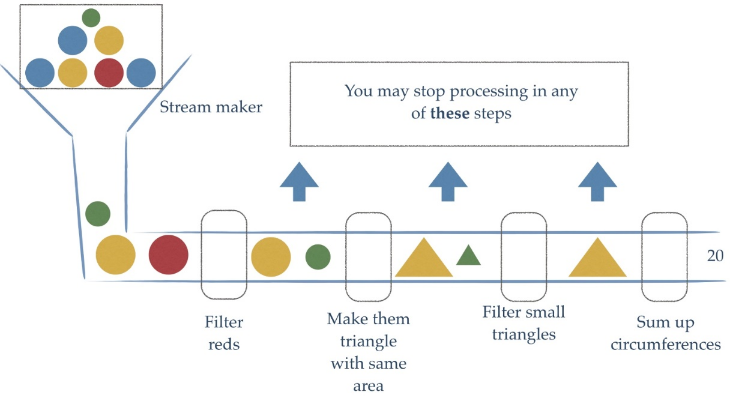

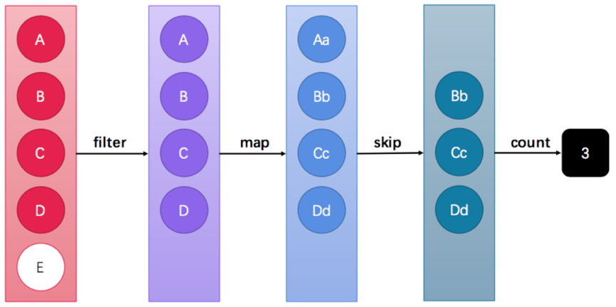

> Stream API能让我们快速完成许多复杂的操作，如筛选、切片、映射、查找、去除重复，统计，匹配和归约。


### 2、获取流的两种方式

> `java.util.stream.Stream<T> `是JDK 8新加入的流接口。
>
> - 所有的Collection 集合都可以通过stream 默认方法获取流；
> - Stream 接口的静态方法of 可以获取数组对应的流。


#### 1、根据Collection获取流

> 首先， java.util.Collection 接口中加入了default方法stream 用来获取流，所以其所有实现类均可获取流。

```java
public class GetStream01 {

    public static void main(String[] args) {
        ArrayList<String> list = new ArrayList<>();
        Stream<String> stream = list.stream();

        Set<String> set = new HashSet<>();
        Stream<String> stream2 = set.stream();

        Vector<String> vector = new Vector<>();
        Stream<String> stream3 = vector.stream();

        // Map获取流
        Map<String, String> map = new HashMap<>();
        //java.util.Map 接口不是Collection 的子接口，所以获取对应的流需要分key、value或entry等情况
        Stream<String> keyStream = map.keySet().stream();
        Stream<String> valueStream = map.values().stream();
        Stream<Map.Entry<String, String>> entryStream = map.entrySet().stream();

    }
}
```


#### 2、Stream中的静态方法of获取流

> 由于数组对象不可能添加默认方法，所以Stream 接口中提供了静态方法of ，使用很简单。

```java
public class GetStream02 {

    public static void main(String[] args) {
        // Stream中的静态方法: static Stream of(T... values)

        Stream<String> stringStream = Stream.of("aa", "bb", "cc");
        String[] arr = {"aa", "bb", "cc"};
        Stream<String> stream7 = Stream.of(arr);
        Integer[] arr2 = {11, 22, 33};
        Stream<Integer> stream8 = Stream.of(arr2);
        // 注意:基本数据类型的数组不行
        int[] arr3 = {11, 22, 33};
        Stream<int[]> stream9 = Stream.of(arr3);
    }
}
```

> 备注： of 方法的参数其实是一个可变参数，所以支持数组。

### 3、Stream常用方法和注意事项

#### 1、常用用法

> Stream流模型的操作很丰富，这里介绍一些常用的API。这些方法可以被分成两种：

| 方法名  | 方法作用   | 返回值类型 | 方法种类 |
| ------- | ---------- | ---------- | -------- |
| count   | 统计个数   | long       | 终结     |
| forEach | 逐个处理   | void       | 终结     |
| filter  | 过滤       | Stream     | 函数拼接 |
| limit   | 取前几个   | Stream     | 函数拼接 |
| skip    | 跳过前几个 | Stream     | 函数拼接 |
| map     | 映射       | Stream     | 函数拼接 |
| concat  | 组合       | Stream     | 函数拼接 |


> - 终结方法：返回值类型不再是Stream 类型的方法，不再支持链式调用。本小节中，终结方法包括count 和forEach 方法。
> - 非终结方法：返回值类型仍然是Stream 类型的方法，支持链式调用。（除了终结方法外，其余方法均为非终结方法。）

​

#### 2、注意事项

> Stream只能操作一次
>
> Stream方法返回的是新的流
>
> Stream不调用终结方法，中间的操作不会执行


#### 3、forEach方法

> forEach 用来遍历流中的数据

```java
void forEach(Consumer<? super T> action);
```

该方法接收一个Consumer 接口函数，会将每一个流元素交给该函数进行处理。例如：

```java
public class StreamMethodForEach {

    public static void main(String[] args) {
        List<String> one = new ArrayList<>();
        Collections.addAll(one, "迪丽热巴", "宋远桥", "苏星河", "老子", "庄子", "孙子");

        one.forEach(System.out::println);
        
    }
}
```


#### 4、count方法

> Stream流提供count 方法来统计其中的元素个数

```java
long count();
```

该方法返回一个long值代表元素个数。基本使用：

```java
public class StreamMethodCount {
    public static void main(String[] args) {
        List<String> one = new ArrayList<>();
        Collections.addAll(one, "迪丽热巴", "宋远桥", "苏星河", "老子", "庄子", "孙子");
        System.out.println(one.stream().count());
    }
}
```


#### 5、filter方法

> filter用于过滤数据，返回符合过滤条件的数据

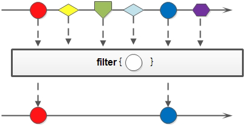

可以通过filter 方法将一个流转换成另一个子集流。方法声明：

```java
Stream<T> filter(Predicate<? super T> predicate);
```

该接口接收一个Predicate 函数式接口参数（可以是一个Lambda或方法引用）作为筛选条件。

Stream流中的filter 方法基本使用的代码如：

```java
public class StreamMethodFilter {

    public static void main(String[] args) {
        List<String> one = new ArrayList<>();
        Collections.addAll(one, "迪丽热巴", "宋远桥", "苏星河", "老子", "庄子", "孙子");
        //筛选出姓名长度为2个字。
        one.stream().filter(o -> 2 == o.length()).forEach(System.out::println);
    }

```


#### 6、limit方法

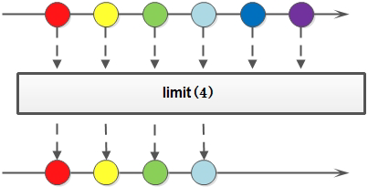

> limit 方法可以对流进行截取，只取用前n个。

```java
Stream<T> limit(long maxSize);
```

参数是一个long型，如果集合当前长度大于参数则进行截取。否则不进行操作。基本使用：

```java
public class StreamMethodLimit {

    public static void main(String[] args) {
        List<String> one = new ArrayList<>();
        Collections.addAll(one, "迪丽热巴", "宋远桥", "苏星河", "老子", "庄子", "孙子");
        //筛选出姓名为2个字，并且取出前两个并打印
        one.stream().filter(o -> 2 == o.length()).limit(2).forEach(System.out::println);
    }
}
```


#### 7、skip方法

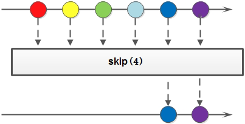

如果希望跳过前几个元素，可以使用skip 方法获取一个截取之后的新流：

```java
Stream<T> skip(long n);
```

如果流的当前长度大于n，则跳过前n个；否则将会得到一个长度为0的空流。基本使用：

```java
public class StreamMethodSkip {

    public static void main(String[] args) {
        List<String> one = new ArrayList<>();
        Collections.addAll(one, "迪丽热巴", "宋远桥", "苏星河", "老子", "庄子", "孙子");
        //筛选出姓名为2个字，并且取出前两个然后跳过第一个并打印
        one.stream().filter(o -> 2 == o.length()).limit(2).skip(1).forEach(System.out::println);
    }

}
```


#### 8、map方法

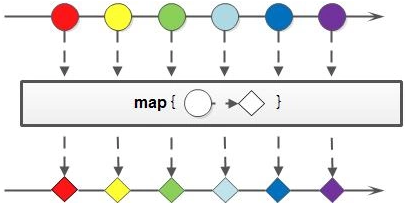

如果需要将流中的元素映射到另一个流中，可以使用map 方法。方法签名：

```java
<R> Stream<R> map(Function<? super T, ? extends R> mapper);
```

该接口需要一个Function 函数式接口参数，可以将当前流中的T类型数据转换为另一种R类型的流。

```java
public class StreamMethodMap {

    public static void main(String[] args) {
        Stream<String> original = Stream.of("11", "22", "33");
        Stream<Integer> result = original.map(Integer::parseInt);
        result.forEach(s -> System.out.println(s + 10));
    }
}
```


#### 9、sorted方法

如果需要将数据排序，可以使用sorted 方法。

```java
Stream<T> sorted();
Stream<T> sorted(Comparator<? super T> comparator);
```

sorted 方法根据元素的自然顺序排序，也可以指定比较器排序。

```java
public class StreamMethodSort {

    public static void main(String[] args) {
        Stream.of(33, 22, 11, 55)
                .sorted()
                .sorted((o1, o2) -> o2 - o1)
                .forEach(System.out::println);
    }
}
```


#### 10、distinct方法

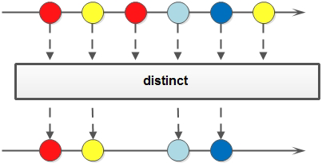

如果需要去除重复数据，可以使用distinct 方法。方法签名：

```java
Stream<T> distinct();
```

```java
public class StreamMethodDistinct {

    public static void main(String[] args) {
        //去重并排序
        Stream.of(22, 33, 22, 11, 33)
                .distinct()
                .sorted(((o1, o2) -> o2 - o1))
                .forEach(System.out::println);
    }
}
```


#### 11、match方法

> 如果需要判断数据是否匹配指定的条件，可以使用Match 相关方法。

```java
boolean allMatch(Predicate<? super T> predicate);
boolean anyMatch(Predicate<? super T> predicate);
boolean noneMatch(Predicate<? super T> predicate);
```

```java
public class StreamMethodMatch {

    public static void main(String[] args) {
        boolean b = Stream.of(5, 3, 6, 1)
                // allMatch: 元素是否全部满足条件
                // .allMatch(e -> e > 0);
                // anyMatch: 元素是否任意有一个满足条件
                // .anyMatch(e -> e > 5);
                .noneMatch(e -> e < 0); // noneMatch: 元素是否全部不满足条件
        System.out.println("b = " + b);
    }
}
```


#### 12、find方法

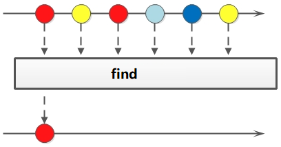

> 如果需要找到某些数据，可以使用find 相关方法。

```java
Optional<T> findFirst();
Optional<T> findAny();
```

```java
public class StreamMethodFind {
    public static void main(String[] args) {
        Optional<Integer> first = Stream.of(5, 3, 6, 1).findFirst();
        System.out.println("first = " + first.get());
        Optional<Integer> any = Stream.of(5, 3, 6, 1).findAny();
        System.out.println("any = " + any.get());
    }
}

```


#### 13、max和min方法

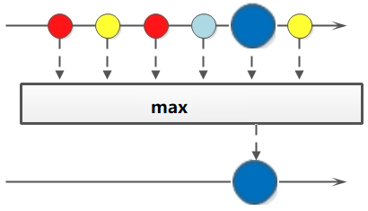

> 如果需要获取最大和最小值，可以使用max 和min 方法。

```java
Optional<T> max(Comparator<? super T> comparator);
Optional<T> min(Comparator<? super T> comparator);
```

```java
public class StreamMethodMaxAndMin {

    public static void main(String[] args) {
        Optional<Integer> max = Stream.of(5, 3, 6, 1).max(Comparator.comparingInt(o -> o));
        System.out.println("first = " + max.get());
        Optional<Integer> min = Stream.of(5, 3, 6, 1).min(Comparator.comparingInt(o -> o));
        System.out.println("any = " + min.get());
    }
}
```


#### 14、reduce方法


> 如果需要将所有数据归纳得到一个数据，可以使用reduce 方法。

```java
T reduce(T identity, BinaryOperator<T> accumulator);
```

```java
public class StreamMethodReduce {

    public static void main(String[] args) {
        int reduce = Stream.of(4, 5, 3, 9)
                .reduce(0, (a, b) -> {
                    System.out.println("a = " + a + ", b = " + b);
                    return a + b;
                });
        // reduce:
        // 第一次将默认做赋值给x, 取出第一个元素赋值给y,进行操作
        // 第二次,将第一次的结果赋值给x, 取出二个元素赋值给y,进行操作
        // 第三次,将第二次的结果赋值给x, 取出三个元素赋值给y,进行操作
        // 第四次,将第三次的结果赋值给x, 取出四个元素赋值给y,进行操作
        System.out.println("reduce = " + reduce);

        int reduce2 = Stream.of(4, 5, 3, 9)
                .reduce(0, Integer::sum);

        System.out.println("reduce2 = " + reduce2);

        int reduce3 = Stream.of(4, 5, 3, 9).reduce(0, Integer::sum);

        int max = Stream.of(4, 5, 3, 9)
                .reduce(0, (x, y) -> x > y ? x : y);
        System.out.println("max = " + max);
    }
}
```

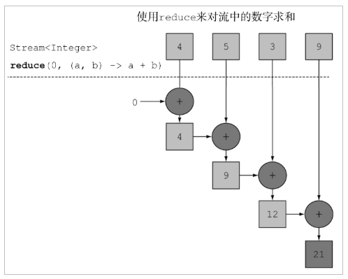

#### 15、map和reduce的组合使用

```java
public class StreamMethodReduceAndMap {
    public static void main(String[] args) {
        Stream<Person> personStream = Stream.of(
                new Person("1111", 18, new Date()),
                new Person("2222", 19, new Date()),
                new Person("33333", 20, new Date()),
                new Person("4444", 21, new Date()));
        Integer totalAge = personStream.map(Person::getAge).reduce(0, (x, y) -> x + y);
        System.out.println("总年龄为：" + totalAge);

        Integer maxAge = personStream.map(Person::getAge).reduce(0, (x, y) -> x > y ? x : y);
        System.out.println("最大年龄为：" + maxAge);


    }
}
```


#### 16、mapToInt方法

如果需要将Stream中的Integer类型数据转成int类型，可以使用mapToInt 方法。方法签名：

```java
IntStream mapToInt(ToIntFunction<? super T> mapper);
```

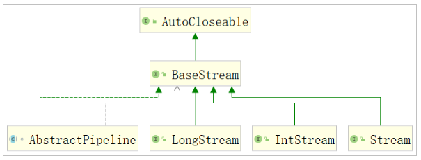

```java
public class StreamMethodMapToInt {

    public static void main(String[] args) {
        Stream<Integer> stream = Arrays.stream(new Integer[]{1, 2, 3, 4, 5});
        //注释的原因是因为流只能使用一次
//        System.out.println(stream.filter(o -> o > 3)
//                .reduce(0, Integer::sum));

        IntStream intStream = stream.mapToInt(Integer::intValue);
//        System.out.println(intStream.filter(o -> o < 3)
//                .reduce(0, Integer::sum));
        System.out.println(intStream.filter(o -> o > 3).summaryStatistics().getSum());
    }
}
```


#### 17、concat方法

如果有两个流，希望合并成为一个流，那么可以使用Stream 接口的静态方法concat ：

```java
static <T> Stream<T> concat(Stream<? extends T> a, Stream<? extends T> b)
```

这是一个静态方法，与java.lang.String 当中的concat 方法是不同的。

```java
public class StreamMethodConcat {
    public static void main(String[] args) {
        Stream<String> stringStream = Stream.of("1111");
        Stream<String> stringStream1 = Stream.of("2222");
        Stream<String> concat = Stream.concat(stringStream, stringStream1);
        concat.forEach(System.out::println);
    }
}
```


### 4、收集流中的结果

#### 1、收集到数组中

Stream提供toArray 方法来将结果放到一个数组中，返回值类型是Object[]的：

```java
Object[] toArray();
```

```java
public class StreamToArray {

    public static void main(String[] args) {
        Stream<String> aa = Stream.of("aa", "bb", "cc");
//        Object[] toArray = aa.toArray();
//        for (Object o : toArray) {
//            System.out.println(o);
//        }
        String[] strings = aa.toArray(String[]::new);
        for (String s : strings) {
            System.out.println(s);
        }
    }
}
```


#### 2、收集到集合中

Stream流提供collect 方法，其参数需要一个`java.util.stream.Collector<T,A, R>` 接口对象来指定收集到哪种集合中。java.util.stream.Collectors 类提供一些方法，可以作为Collector`接口的实例：

- `public static <T> Collector<T, ?, List<T>> toList()` ：转换为List 集合。
- `public static <T> Collector<T, ?, Set<T>> toSet()` ：转换为Set 集合。

```java
public class StreamToCollection {

    public static void main(String[] args) {
        Stream<String> stream = Stream.of("11", "22", "11");
        List<String> list = stream.collect(Collectors.toList());
        list.forEach(System.out::println);
        Set<String> set = stream.collect(Collectors.toSet());
        set.forEach(System.out::println);

        ArrayList<String> list1 = stream.collect(Collectors.toCollection(ArrayList::new));
        HashSet<String> set1 = stream.collect(Collectors.toCollection(HashSet::new));
    }
}

```


#### 3、对流中数据进行聚合计算

> 当我们使用Stream流处理数据后，可以像数据库的聚合函数一样对某个字段进行操作。比如获取最大值，获取最小值，求总和，平均值，统计数量。

```java
public class StreamToOther {

    public static void main(String[] args) {
        Stream<Integer> stream = Stream.of(12, 16, 15, 86, 35, 54, 76, 54);
        IntSummaryStatistics statistics = stream.mapToInt(Integer::intValue).summaryStatistics();
        //获取最大值
        int max = statistics.getMax();
        double average = statistics.getAverage();
        int min = statistics.getMin();
        long sum = statistics.getSum();
    }
}
```


#### 4、对数据进行分组

```java
public class StreamToGroup {

    public static void main(String[] args) {
        Stream<Person> personStream = Stream.of(
                new Person("1111", 18, new Date()),
                new Person("2222", 19, new Date()),
                new Person("33333", 20, new Date()),
                new Person("4444", 21, new Date()));

        //Map<Integer, List<Person>> map = personStream.collect(Collectors.groupingBy(Person::getAge));

        Map<String, List<Person>> map1 = personStream.collect(Collectors.groupingBy((s) -> {
            if (s.getAge() > 18) {
                return "成年了";
            } else {
                return "刚好成年";
            }
        }));

        map1.forEach((k,v) ->{
            System.out.println(k + "::" + v);
        });
    }
```


#### 5、对流中数据进行多级分组

```java
public class StreamToGradeGrouping {

    public static void main(String[] args) {
        Stream<Person> personStream = Stream.of(
                new Person("1111", 18, new Date()),
                new Person("2222", 19, new Date()),
                new Person("33333", 20, new Date()),
                new Person("4444", 21, new Date()));

        //现根据年龄进行分组，再根据年龄大小进行分组
        Map<Integer, Map<String, List<Person>>> mapMap = personStream.collect(Collectors.groupingBy(s -> s.getAge(), Collectors.groupingBy(s -> {
            if (s.getAge() > 18) {
                return "成年了";
            } else {
                return "刚好成年";
            }
        })));

        mapMap.forEach((k,v) ->{
            System.out.println(k + ":" + v);
        });
    }
}
```


#### 6、对数据进行分区

Collectors.partitioningBy 会根据值是否为true，把集合分割为两个列表，一个true列表，一个false列表。

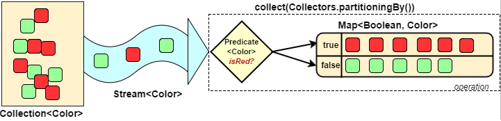

```java
public class StreamToPartitioningBy {

    public static void main(String[] args) {
        Stream<Person> personStream = Stream.of(
                new Person("1111", 18, new Date()),
                new Person("2222", 19, new Date()),
                new Person("33333", 20, new Date()),
                new Person("4444", 21, new Date()));

        Map<Boolean, List<Person>> map = personStream.collect(Collectors.partitioningBy(s -> s.getAge() > 20));

        map.forEach((k,v) ->{
            System.out.println(k + ":" + v);
        });
    }
```


#### 7、对数据进行拼接

```java
public class StreamToJoining {

    public static void main(String[] args) {
        Stream<Person> personStream = Stream.of(
                new Person("1111", 18, new Date()),
                new Person("2222", 19, new Date()),
                new Person("33333", 20, new Date()),
                new Person("4444", 21, new Date()));

        String collect = personStream.map(Person::getName).collect(Collectors.joining(">_<", "^_^", "^v^"));
        System.out.println(collect);
    }
}
```


## 6、并行流

### 1、初体验

#### 1、串行的Stream流

> 简单的说，就是在一个线程上执行。

```java
public class StreamDemo1 {

    public static void main(String[] args) {
        long count = Stream.of(4, 5, 3, 9, 1, 2, 6)
                .filter(s -> {
                    System.out.println(Thread.currentThread() + ", s = " + s);
                    return true;
                })
                .count();
        System.out.println("count = " + count);
    }
}
```


#### 2、并行的Stream流

> parallelStream其实就是一个并行执行的流。它通过默认的ForkJoinPool，可能提高多线程任务的速度。

```java
public class StreamDemo2 {

    public static void main(String[] args) {
        long count = Stream.of(4, 5, 3, 9, 1, 2, 6)
                .parallel()
                .filter(s -> {
                    System.out.println(Thread.currentThread() + ", s = " + s);
                    return true;
                })
                .count();
        System.out.println("count = " + count);
    }
}
```


>获取并行流有两种方式:
>
>- 直接获取并行流: parallelStream()
>- 将串行流转成并行流: parallel()


#### 3、并行和串行Stream流的效率对比

> 使用for循环，串行Stream流，并行Stream流来对5亿个数字求和。看消耗的时间。

```java
public class StreamDemo3 {

    private static final long TIMES = 50000000000L;

    public static void main(String[] args) {
        //正常处理 for
        long startFor = System.currentTimeMillis();
        long result = 0;
        for (long i = 0; i < TIMES; i++) {
            result += i;
        }
        System.out.println("for循环执行时间："+(System.currentTimeMillis()-startFor));
        //串行流处理时间
        long startStream = System.currentTimeMillis();
        LongStream.rangeClosed(0, TIMES).reduce(0, Long::sum);
        System.out.println("stream执行时间："+(System.currentTimeMillis()-startStream));
        //并行流处理时间
        long startParallelStream = System.currentTimeMillis();
        LongStream.rangeClosed(0,TIMES).parallel().reduce(0,Long::sum);
        System.out.println("parallelStream执行时间："+(System.currentTimeMillis()-startParallelStream));
    }
}
```

输出结果为：

```
for循环执行时间：13591
stream执行时间：18298
parallelStream执行时间：5039
```

> Stream并行处理的过程会分而治之，也就是将一个大任务切分成多个小任务，这表示每个任务都是一个操作。


### 2、parallelStream线程安全问题

```java
public class ParallelStreamNotice {

    public static void main(String[] args) {
        ArrayList<Integer> list = new ArrayList<Integer>();
        for (int i = 0; i < 1000; i++) {
            list.add(i);
        }
        System.out.println(list.size());
        //并行流创建
        List<Integer> newList = new ArrayList<>();
        list.parallelStream()
                .forEach(newList::add);
        System.out.println(newList.size());
    }
}
```

输出结构为

```
1000
990
```

> 我们明明是往集合中添加1000个元素，而实际上只有903个元素。
> 解决方法： 加锁、使用线程安全的集合或者调用Stream的toArray() / collect() 操作就是满足线程安全的了。

```java
public class ParallelStreamNotice {

    public static void main(String[] args) {
        ArrayList<Integer> list = new ArrayList<Integer>();
        for (int i = 0; i < 1000; i++) {
            list.add(i);
        }
        System.out.println(list.size());
        //并行流创建
        List<Integer> newList = new ArrayList<>();

        //解决方法1
//        List<Integer> newList = new Vector<>();
        //解决方法2
//        list.parallelStream()
//                .forEach(newList::add);
//        System.out.println(newList.size());
//解决方法3
//        Arrays.stream(list.toArray()).forEach(o ->{
//            newList.add((Integer) o);
//        });

        newList = list.parallelStream().collect(Collectors.toList());
        System.out.println(newList.size());
    }
}
```


### 3、parallelStream背后的技术

#### 1、Fork/Join框架介绍

> parallelStream使用的是Fork/Join框架。Fork/Join框架自JDK 7引入。Fork/Join框架可以将一个大任务拆分为很多小任务来异步执行。 Fork/Join框架主要包含三个模块：
>
> - 线程池：ForkJoinPool
> - 任务对象：ForkJoinTask
> - 执行任务的线程：ForkJoinWorkerThread

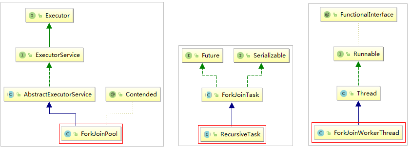


#### 2、Fork/Join原理-分治法

> ForkJoinPool主要用来使用分治法(Divide-and-Conquer Algorithm)来解决问题。典型的应用比如快速排序算法，ForkJoinPool需要使用相对少的线程来处理大量的任务。比如要对1000万个数据进行排序，那么会将这个任务分割成两个500万的排序任务和一个针对这两组500万数据的合并任务。以此类推，对于500万的数据也会做出同样的分割处理，到最后会设置一个阈值来规定当数据规模到多少时，停止这样的分割处理。比如，当元素的数量小于10时，会停止分割，转而使用插入排序对它们进行排序。那么到最后，所有的任务加起来会有大概2000000+个。问题的关键在于，对于一个任务而言，只有当它所有的子任务完成之后，它才能够被执行。

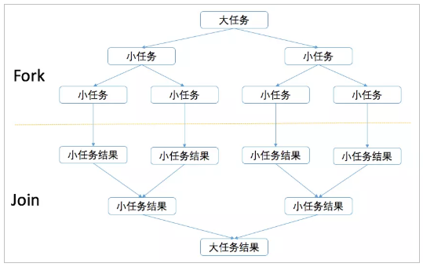


#### 3、Fork/Join原理-工作窃取算法

> Fork/Join最核心的地方就是利用了现代硬件设备多核，在一个操作时候会有空闲的cpu，那么如何利用好这个空闲的cpu就成了提高性能的关键，而这里我们要提到的工作窃取（work-stealing）算法就是整个Fork/Join框架的核心理念Fork/Join工作窃取（work-stealing）算法是指某个线程从其他队列里窃取任务来执行。

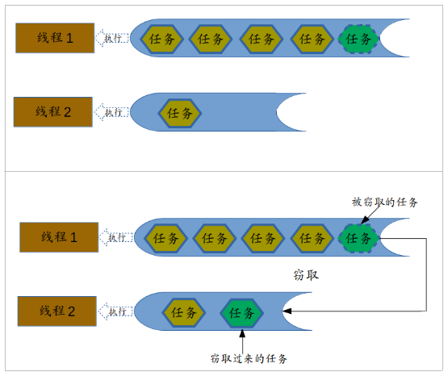

> 那么为什么需要使用工作窃取算法呢？假如我们需要做一个比较大的任务，我们可以把这个任务分割为若干互不依赖的子任务，为了减少线程间的竞争，于是把这些子任务分别放到不同的队列里，并为每个队列创建一个单独的线程来执行队列里的任务，线程和队列一一对应，比如A线程负责处理A队列里的任务。但是有的线程会先把自己队列里的任务干完，而其他线程对应的队列里还有任务等待处理。干完活的线程与其等着，不如去帮其他线程干活，于是它就去其他线程的队列里窃取一个任务来执行。而在这时它们会访问同一个队列，所以为了减少窃取任务线程和被窃取任务线程之间的竞争，通常会使用双端队列，被窃取任务线程永远从双端队列的头部拿任务执行，而窃取任务的线程永远从双端队列的尾部拿任务执行。
>
> 工作窃取算法的优点是充分利用线程进行并行计算，并减少了线程间的竞争，其缺点是在某些情况下还是存在竞争，比如双端队列里只有一个任务时。并且消耗了更多的系统资源，比如创建多个线程和多个双端队列。
> 上文中已经提到了在Java 8引入了自动并行化的概念。它能够让一部分Java代码自动地以并行的方式执行，也就是我们使用了ForkJoinPool的ParallelStream。
>
> 对于ForkJoinPool通用线程池的线程数量，通常使用默认值就可以了，即运行时计算机的处理器数量。可以通过设置系统属性：java.util.concurrent.ForkJoinPool.common.parallelism=N （N为线程数量），来调整ForkJoinPool的线程数量，可以尝试调整成不同的参数来观察每次的输出结果。


#### 4、Fork/Join案例

> 需求：使用Fork/Join计算1-10000的和，当一个任务的计算数量大于3000时拆分任务，数量小于3000时计算。

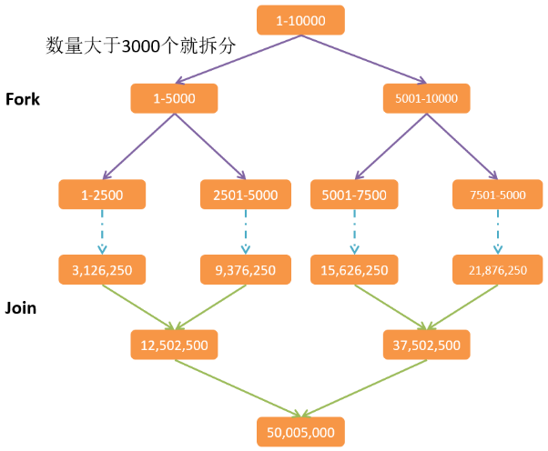

```java
public class ForkJoinDemo4 {

    public static void main(String[] args) {
        long start = System.currentTimeMillis();
        ForkJoinPool pool = new ForkJoinPool();
        SumRecursiveTask recursiveTask = new SumRecursiveTask(1, 10000L);
        Long result = pool.invoke(recursiveTask);
        System.out.println("result = " + result);
        long end = System.currentTimeMillis();
        System.out.println("消耗的时间为: " + (end - start));
    }

    static class SumRecursiveTask extends RecursiveTask<Long> {
        private static final long THRESHOLD = 3000L;
        private final long start;
        private final long end;

        public SumRecursiveTask(long start, long end) {
            this.start = start;
            this.end = end;
        }

        @Override
        protected Long compute() {
            long length = end - start;
            if (length <= THRESHOLD) {
                // 任务不用再拆分了.可以计算了
                long sum = 0;
                for (long i = start; i <= end; i++) {
                    sum += i;
                }
                System.out.println("计算: " + start + " -> " + end + ",结果为: " + sum);
                return sum;
            } else {
                    // 数量大于预定的数量,任务还需要再拆分
                long middle = (start + end) / 2;
                System.out.println("拆分: 左边 " + start + " -> " + middle + ", 右边 " + (middle +
                        1) + " -> " + end);
                SumRecursiveTask left = new SumRecursiveTask(start, middle);
                left.fork();
                SumRecursiveTask right = new SumRecursiveTask(middle + 1, end);
                right.fork();
                return left.join() + right.join();
            }
        }
    }
}
```


## 7、Optional类

### 1、初体验

#### 1、以前对null的处理方式

```java
public class OptionalDemo1 {

    public static void main(String[] args) {
        String userName = "xiaobear";
        if (userName != null) {
            System.out.println("用户名为:" + userName);
        }else {
            System.out.println("用户名不存在！");
        }
    }
}
```


#### 2、Option的使用

```java
public class OptionalDemo2 {

    public static void main(String[] args) {
        Optional<String> xiaobear = Optional.of("xiaobear");
//        Optional<String> xiaobear = Optional.of(null);
//        Optional<Object> xiaobear = Optional.ofNullable(null);
        //判断是否包含值
        if(xiaobear.isPresent()){
            String s = xiaobear.get();
            System.out.println("用户名为:" + s);
        }else {
            System.out.println("用户名不存在！");
        }
    }
}
```


### 2、Optional的基本使用

> Optional是一个没有子类的工具类，Optional是一个可以为null的容器对象。它的作用主要就是为了解决避免Null检查，防止NullPointerException。

Optional类的创建方式：

```java
Optional.of(T t) : 创建一个 Optional 实例
Optional.empty() : 创建一个空的 Optional 实例
Optional.ofNullable(T t):若 t 不为 null,创建 Optional 实例,否则创建空实例
```

Optional类的常用方法：

```java
isPresent() : 判断是否包含值,包含值返回true，不包含值返回false
get() : 如果Optional有值则将其返回，否则抛出NoSuchElementException
orElse(T t) : 如果调用对象包含值，返回该值，否则返回参数t
orElseGet(Supplier s) :如果调用对象包含值，返回该值，否则返回 s 获取的值
map(Function f): 如果有值对其处理，并返回处理后的Optional，否则返回 Optional.empty()
```


### 3、Optional的高级使用

```java
public class OptionalDemo3 {

    public static void main(String[] args) {
        Optional<String> optional = Optional.of("张三");

//        Optional<Object> optional = Optional.empty();
        //存在则输出
        optional.ifPresent(System.out::println);
        //如果empty包含值，则返回该值，不包含则为空
        System.out.println(optional.orElse(null));

        optional.orElseGet(() -> {return "未知的用户名";});
    }
}
```


## 8、日期和时间

### 1、旧版日期时间API存在的问题

> - 设计很差： 在java.util和java.sql的包中都有日期类，java.util.Date同时包含日期和时间，而java.sql.Date仅包
    >   含日期。此外用于格式化和解析的类在java.text包中定义。
> - 非线程安全：java.util.Date 是非线程安全的，所有的日期类都是可变的，这是Java日期类最大的问题之一。
> - 时区处理麻烦：日期类并不提供国际化，没有时区支持，因此Java引入了java.util.Calendar和java.util.TimeZone类，但他们同样存在上述所有的问题。


### 2、新版的日期和时间API

> JDK 8中增加了一套全新的日期时间API，这套API设计合理，是线程安全的。新的日期及时间API位于 java.time 包中

| API               | 描述                                                         |
| ----------------- | ------------------------------------------------------------ |
| LocalDate         | 表示日期，包含年月日，格式为 2019-10-16                      |
| LocalTime         | 表示时间，包含时分秒，格式为 16:38:54.158549300              |
| LocalDateTime     | 表示日期时间，包含年月日，时分秒，格式为 2018-09-06T15:33:56.750 |
| DateTimeFormatter | 日期时间格式化类                                             |
| Instant           | 时间戳，表示一个特定的时间瞬间                               |
| Duration          | 用于计算2个时间(LocalTime，时分秒)的距离                     |
| Period            | 用于计算2个日期(LocalDate，年月日)的距离                     |
| ZonedDateTime     | 包含时区的时间                                               |

> Java中使用的历法是ISO 8601日历系统，它是世界民用历法，也就是我们所说的公历。平年有365天，闰年是366
> 天。此外Java 8还提供了4套其他历法，分别是：
>
> - ThaiBuddhistDate：泰国佛教历
> - MinguoDate：中华民国历
> - JapaneseDate：日本历
> - HijrahDate：伊斯兰历


### 3、日期和时间类

> LocalDate、LocalTime、LocalDateTime类的实例是不可变的对象，分别表示使用 ISO-8601 日历系统的日期、时间、日期和时间。它们提供了简单的日期或时间，并不包含当前的时间信息，也不包含与时区相关的信息。

```java
public class LocalDateTimeDemo1 {

    public static void main(String[] args) {
        LocalDate date = LocalDate.of(1999, 10, 01);
        System.out.println("创建的日期为：" + date);
        LocalDate now = LocalDate.now();
        System.out.println("当前日期为：" + now);
        //获取日期信息
        System.out.println(now.getYear());
        System.out.println(now.getMonthValue());
        System.out.println(now.getDayOfMonth());
        System.out.println(now.getDayOfWeek());

        LocalDateTime nowDateTime = LocalDateTime.now();
        System.out.println("当前时间为" + nowDateTime);
        System.out.println(nowDateTime.getYear());
        System.out.println(nowDateTime.getMonthValue());
        System.out.println(nowDateTime.getDayOfMonth());
        System.out.println(nowDateTime.getHour());
        System.out.println(nowDateTime.getMinute());
        System.out.println(nowDateTime.getSecond());
        System.out.println(nowDateTime.getNano());
    }
}
```


> 对日期时间的修改，对已存在的LocalDate对象，创建它的修改版，最简单的方式是使用withAttribute方法。withAttribute方法会创建对象的一个副本，并按照需要修改它的属性。以下所有的方法都返回了一个修改属性的对象，他们不会影响原来的对象。

```java
public class LocalDateTimeDemo2 {

    public static void main(String[] args) {
        LocalDateTime now = LocalDateTime.now();
        System.out.println("当前时间为："+now);

        //修改当前时间
        LocalDateTime with = now.withYear(2099);
        System.out.println("修改年份为："+with);
        System.out.println("修改后是否相等：" + (now == with));
        System.out.println("修改月份: " + now.withMonth(6));
        System.out.println("修改小时: " + now.withHour(9));
        System.out.println("修改分钟: " + now.withMinute(11));
            // 再当前对象的基础上加上或减去指定的时间
        LocalDateTime localDateTime = now.plusDays(5);
        System.out.println("5天后: " + localDateTime);
        System.out.println("now == localDateTime: " + (now == localDateTime));
        System.out.println("10年后: " + now.plusYears(10));
        System.out.println("20月后: " + now.plusMonths(20));
        System.out.println("20年前: " + now.minusYears(20));
        System.out.println("5月前: " + now.minusMonths(5));
        System.out.println("100天前: " + now.minusDays(100));
    }
}
```


### 4、时间格式化与解析

> 通过`java.time.format.DateTimeFormatter` 类可以进行日期时间解析与格式化。

```java
public class LocalDateTimeDemo3 {

    public static void main(String[] args) {
        LocalDateTime now = LocalDateTime.now();
        DateTimeFormatter timeFormatter = DateTimeFormatter.ofPattern("yyyy-MM-dd HH:mm:ss");
        //将日期格式化为字符串
        String format = now.format(timeFormatter);
        System.out.println(format);

        // 将字符串解析为日期时间
        LocalDateTime parse = LocalDateTime.parse("1985-09-23 10:12:22", timeFormatter);
        System.out.println("parse = " + parse);
    }
}
```


### 5、Instant 类

> Instant 时间戳/时间线，内部保存了从1970年1月1日 00:00:00以来的秒和纳秒。

```java
public class InstantDemo {

    public static void main(String[] args) {
        Instant now = Instant.now();
        System.out.println("当前时间戳为：" + now);
        // 获取从1970年1月1日 00:00:00的秒
        System.out.println(now.getNano());
        System.out.println(now.getEpochSecond());
        System.out.println(now.toEpochMilli());
        System.out.println(System.currentTimeMillis());
        Instant instant = Instant.ofEpochSecond(5);
        System.out.println(instant);
    }
}
```


### 6、计算日期时间差类

> Duration/Period类: 计算日期时间差。
>
> - Duration：用于计算2个时间(LocalTime，时分秒)的距离
> - Period：用于计算2个日期(LocalDate，年月日)的距离

```java
public class DurationDemo {

    public static void main(String[] args) {
        LocalTime now = LocalTime.now();
        LocalTime of = LocalTime.of(14, 15, 20);
        //计算时间差
        Duration between = Duration.between(now, of);
        System.out.println("相差的天数：" + between.toDays());
        System.out.println("相差的小时：" + between.toHours());
        System.out.println("相差的分钟：" + between.toMinutes());
        System.out.println("相差的秒数：" + between.getSeconds());

        LocalDate localDate = LocalDate.now();
        LocalDate date = LocalDate.of(2021, 8, 31);
        //比较日期差
        Period period = Period.between(localDate, date);
        System.out.println("相差的年份：" + period.getYears());
        System.out.println("相差的月份：" + period.getMonths());
        System.out.println("相差的天数：" + period.getDays());
    }
}
```


### 7、时间校正器

> 有时我们可能需要获取例如：将日期调整到“下一个月的第一天”等操作。可以通过时间校正器来进行。
>
> - TemporalAdjuster : 时间校正器。
> - TemporalAdjusters : 该类通过静态方法提供了大量的常用TemporalAdjuster的实现。

```java
public class TemporalAdjusterDemo {

    public static void main(String[] args) {
        LocalDateTime now = LocalDateTime.now();
        //得到下个月的第一天
        TemporalAdjuster temporalAdjuster = temporal -> {
            LocalDateTime dateTime = (LocalDateTime) temporal;
            LocalDateTime nextMonth = dateTime.plusMonths(1).withDayOfMonth(1);
            System.out.println("nextMonth = " + nextMonth);
            return nextMonth;
        };
        LocalDateTime with = now.with(temporalAdjuster);
        System.out.println("下个月为："+with);
    }
}
```


### 8、设置日期时间的时区

> Java8 中加入了对时区的支持，LocalDate、LocalTime、LocalDateTime是不带时区的，带时区的日期时间类分别为：ZonedDate、ZonedTime、ZonedDateTime。
>
> 其中每个时区都对应着 ID，ID的格式为 “区域/城市” 。例如 ：Asia/Shanghai 等。
>
> ZoneId：该类中包含了所有的时区信息。

```java
public class SetTimeZoneDemo {

    public static void main(String[] args) {
        //获取所有时区ID
        ZoneId.getAvailableZoneIds().forEach(System.out::println);

        //不带时间，获取计算机的当前时间
        LocalDateTime now = LocalDateTime.now();
        System.out.println("now = " + now);

        //操作带时区的类
        ZonedDateTime zonedDateTime = ZonedDateTime.now(Clock.systemUTC());
        System.out.println("zonedDateTime = " + zonedDateTime);

        //使用计算机的默认的时区,创建日期时间
        ZonedDateTime dateTime = ZonedDateTime.now();
        System.out.println("dateTime = " + dateTime);

        // 使用指定的时区创建日期时间
        ZonedDateTime now2 = ZonedDateTime.now(ZoneId.of("America/Vancouver"));
        System.out.println("now2 = " + now2);
    }
}
```


#### 总结

> LocalDate表示日期,包含年月日
>
> LocalTime表示时间,包含时分秒
>
> LocalDateTime = LocalDate + LocalTime 时间的格式化和解析,通过DateTimeFormatter类型进行
>
> 学习了Instant类,方便操作秒和纳秒,一般是给程序使用的.学习Duration/Period计算日期或时间的距离,还使用时间调整器方便的调整时间,学习了带时区的3个类ZoneDate/ZoneTime/ZoneDateTime

JDK 8新的日期和时间 API的优势：

1. 新版的日期和时间API中，日期和时间对象是不可变的。操纵的日期不会影响老值，而是新生成一个实例。
2. 新的API提供了两种不同的时间表示方式，有效地区分了人和机器的不同需求。
3. TemporalAdjuster可以更精确的操纵日期，还可以自定义日期调整器。
4. 是线程安全的


| 1    | 1    | 1    |
| ---- | ---- | ---- |
| 1    | 1    | 1    |
| 1    | 1    | 1    |
| 1    | 1    | 1    |

