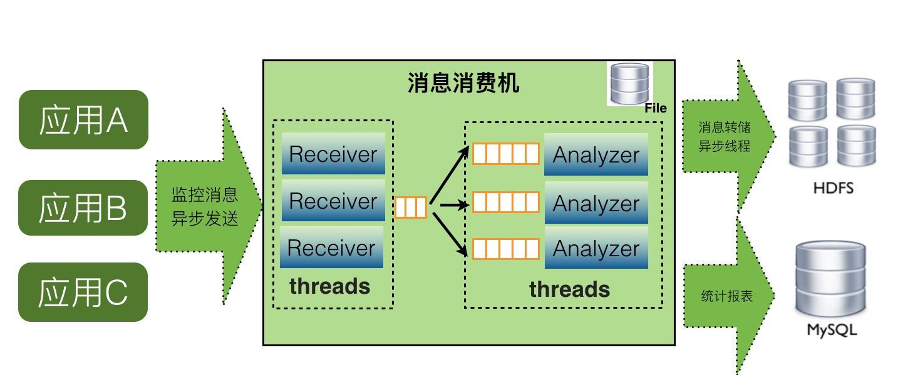
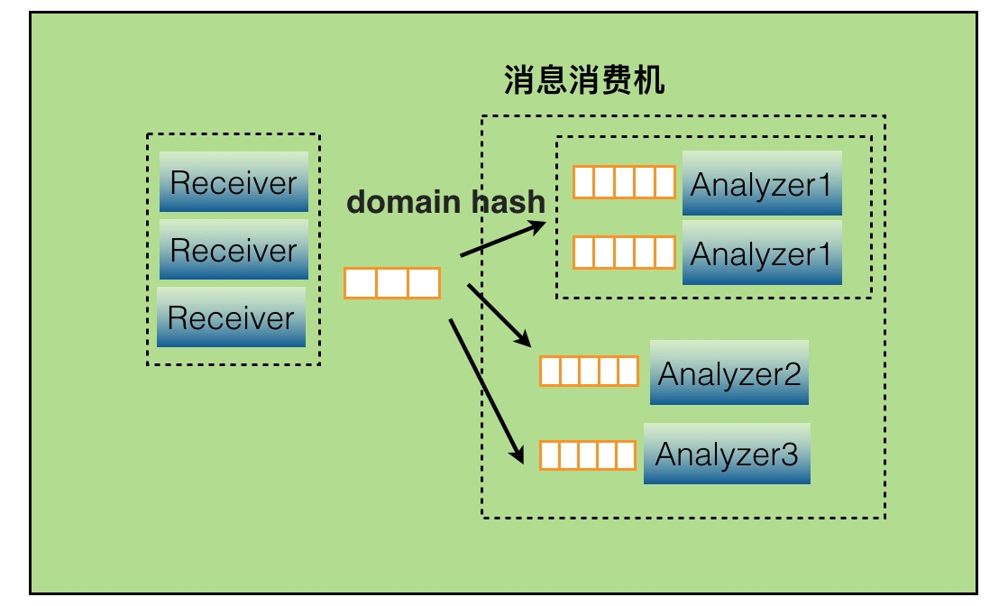
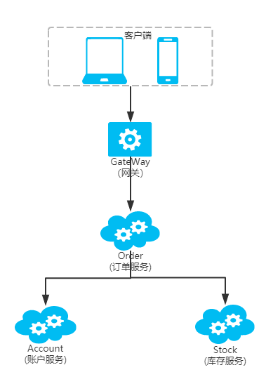
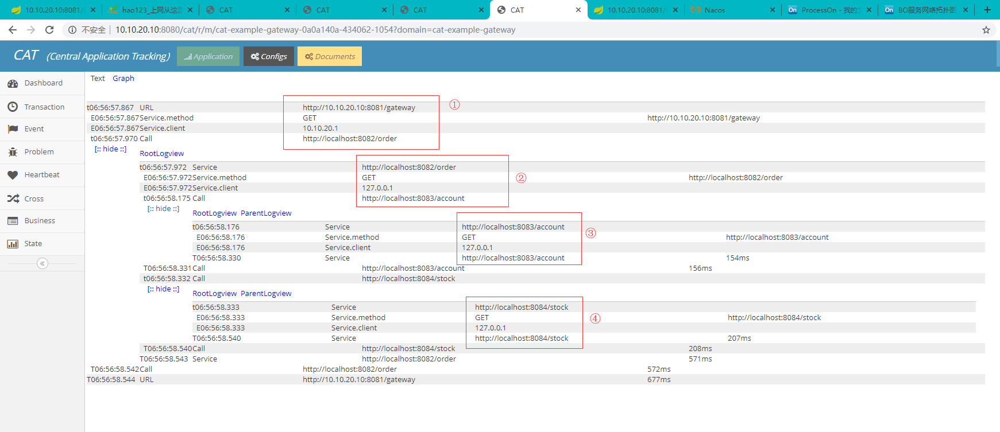

## 1、CAT介绍

### 1、为什么要学习？

> 从单体架构到微服务架构的演变， 一个业务请求往往会流转多个服务， 大型互联网产品服务架构尤为复杂，腾讯的抢红包服务， 阿里的交易支付服务， 可能就流转成百上千个服务节点， 面对众多服务， 如何监控管理？ 服务请求一旦出现问题， 如何快速定位问题？ 如何保障服务的高可用， 做到全面的监控与预警？ 如何分析统计服务的运行状况？ 看下链路监控产品如何解决这些问题。

### 2、什么是CAT?
> + CAT 是基于 Java 开发的实时应用监控平台，为美团点评提供了全面的实时监控告警服务。
> + CAT 作为服务端项目基础组件，提供了 Java, C/C++, Node.js, Python, Go 等多语言客户端，已经在美团点评的基础架构中间件框架（MVC框架，RPC框架，数据库框架，缓存框架等，消息队列，配置系统等）深度集成，为美团点评各业务线提供系统丰富的性能指标、健康状况、实时告警等。
> + CAT 很大的优势是它是一个实时系统，CAT 大部分系统是分钟级统计，但是从数据生成到服务端处理结束是秒级别，秒级定义是48分钟40秒，基本上看到48分钟38秒数据，整体报表的统计粒度是分钟级；第二个优势，监控数据是全量统计，客户端预计算；链路数据是采样计算。

**优势**：

+ 实时处理：信息的价值会随时间锐减，尤其是事故处理过程中。
+ 全量数据：全量采集指标数据，便于深度分析故障案例。
+ 高可用：故障的还原与问题定位，需要高可用监控来支撑。
+ 故障容忍：故障不影响业务正常运转、对业务透明。
+ 高吞吐：海量监控数据的收集，需要高吞吐能力做保证。
+ 可扩展：支持分布式、跨 IDC 部署，横向扩展的监控系统。
+ 报表丰富： 帮助管理人员从各个角度了解系统的整体状况。


## 2、CAT报表

+ **报错统计报表**
  

+ **业务统计报表**
  

+ **LOGVIEW统计**
  

+ **可视化LOGVIEW**
  

+ **应用类型报表**

| 报表名称            | 报表用途                                                     |
| ------------------- | ------------------------------------------------------------ |
| Transaction实时报表 | 一段代码的运行时间/次数/分布、比如URL/Cache/SQL执行次数和响应时间 |
| Event实时报表       | 事件产生的次数/分布，比如出现一个异常                        |
| Problem实时报表     | 根据Transaction/Event数据分析出来的系统出现的异常，包括访问较慢的程序等 |
| Heartbeat实时报表   | JVM内部一些状态信息，Load/Memory/GC/Thread等                 |
| Metric实时报表      | 业务指标采集监控报表                                         |
| Matrix实时报表      | 一个请求调用分布统计(一次请求中调用多少次SQL/RPC/Cache等)，可评估应用设计的合理性 |
| ...                 | ...                                                          |


## 3、Google Dapper论文


## 4、Dapper Deployment


## 5、链路监控工作机制


## 7、CAT架构设计

**整体设计**
简单即是最好原则设计， 主要分为三个模块cat-client，cat-consumer，cat-home。

+ cat-client 提供给业务以及中间层埋点的底层sdk。
+ cat-consumer 用于实时分析从客户端的提供的数据。
+ cat-home 作为提供给用户的展示的控制端。

**客户端设计**

客户端设计是CAT系统设计中最为核心的一个环节，客户端要求是做到API简单、高可靠性能、无论在任何场景下客户端都不能影响各业务服务的性能（监控只是公司核心业务流程一个旁路环节）。


**服务端设计**
服务端单机cat-consumer的整体架构：


当某个报表处理器处理来不及时候，比如Transaction报表处理比较慢，可以通过配置支持开启多个Transaction处理线程，并发消费消息。



## 8、安装与使用（单机版）

### 1、环境准备

> 1. [JDK1.8+](https://www.oracle.com/technetwork/java/javase/downloads/jdk8-downloads-2133151.html)
> 2. [Tomcat8+](https://tomcat.apache.org/download-80.cgi)
> 3. [MySQL5.7+](https://dev.mysql.com/downloads/mysql/5.7.html#downloads)

### 2、CAT启动配置

PS：**不建议在Windows下部署， 设计上对window支持不好， 容易出各种问题。**

1. 下载[CAT源码](https://github.com/dianping/cat), 如GIT方式过慢， 可用Download Zip 方式打包下载

2. 构建CAT服务war包
   可以导入IDEA工程进行编译， 或者直接用MAVEN进行编译，这里编译的目录是：`cat-home`
   将MAVEN加入到系统PATH， 执行mvn命令：

   ```sh
   mvn clean install -Dmaven.test.skip=true 
   ```

3. 创建数据库

   先创建CAT数据库， 采用utf8mb4字符集， 再导入{CAT_SRC}/script/目录下的CatApplication.sql脚本。

4. 创建目录，因为cat需要/data的全部权限，运行盘下的/data/appdatas/cat和/data/applogs/cat有读写权限

   ```
   mkdir /data/appdatas/cat/
   chmod -R 777 /data/appdatas/cat/
   ```

5. 将打包好的war包传入tomcat的webapp下

   

6. 创建客户端的配置/data/appdatas/cat/client.xml (客户端使用)

   ```xml
   <?xml version="1.0" encoding="utf-8"?>
   <config mode="client">
       <servers>
           <server ip="127.0.0.1" port="2280" http-port="8080"/>
       </servers>
   </config>
   ```

7. 创建服务端的配置/data/appdatas/cat/datasources.xml (服务端使用)

   ```xml
   <?xml version="1.0" encoding="utf-8"?>  
   <data-sources>
   <data-source id="cat">
   	<maximum-pool-size>3</maximum-pool-size>
   	<connection-timeout>1s</connection-timeout>
   	<idle-timeout>10m</idle-timeout>
   	<statement-cache-size>1000</statement-cache-size>
   	<properties>
   		<driver>com.mysql.jdbc.Driver</driver>
   		<url><![CDATA[jdbc:mysql://127.0.0.1:3306/cat]]></url>  <!-- 请替换为真实数据库URL及Port  -->
   		<user>root</user>  <!-- 请替换为真实数据库用户名  -->
   		<password>123456</password>  <!-- 请替换为真实数据库密码  -->
   		<connectionProperties><![CDATA[useUnicode=true&characterEncoding=UTF-8&autoReconnect=true&socketTimeout=120000]]></connectionProperties>
   	</properties>
   </data-source>
   </data-sources>
   ```


8. Tomcat配置，修改tomcat conf 目录下 server.xml， 检查好端口没有被其他程序占用。

   ```xml
   <Connector port="8080" protocol="HTTP/1.1"
           URIEncoding="utf-8"    connectionTimeout="20000"
               redirectPort="8443" />  <!-- 增加  URIEncoding="utf-8"  -->  
   ```

   如需内存不足，需作调整

   ```
   CATALINA_OPTS="-Xms1024m -Xmx2048m -Xss1024K  -XX:MetaspaceSize=512m -XX:MaxMetaspaceSize=1024m"
   ```

9. 启动

   进入tomcat bin目录下

   ```
   bash startup.sh
   ```

10. 访问cat客户端

    + 打开控制台地址： http://ip:8080/cat/s/config?op=routerConfigUpdate

    + 默认用户名：admin 默认密码：admin

    + 正常可以看到后台：

      


## 9、CAT集群版

具体可参考官方文档：  [CAT集群部署](https://github.com/dianping/cat/wiki/readme_server)


## 10、微服务整合CAT案例

### 1、服务设计



设计四个服务：网关服务、订单服务、账户服务和库存服务， 三层调用关系监控

### 2、工程结构


+ cat-demo: 父级工程
+ cat-demo-account: 账户服务工程
+ cat-demo-gateway: 网关服务工程
+ cat-demo-order: 订单服务工程
+ cat-demo-stock: 库存服务工程


### 3、创建父工程

> 命名为`cat-demo`

- pom依赖

  ```xml
  <dependencies>
      <!-- spring boot 依赖 -->
      <dependency>
          <groupId>org.springframework.boot</groupId>
          <artifactId>spring-boot-starter-web</artifactId>
      </dependency>
      <!-- Nacos服务注册发现依赖 -->
      <dependency>
          <groupId>com.alibaba.cloud</groupId>
          <artifactId>spring-cloud-starter-alibaba-nacos-discovery</artifactId>
      </dependency>
      <!-- Spring Boot 监控组件依赖 -->
      <dependency>
          <groupId>org.springframework.boot</groupId>
          <artifactId>spring-boot-starter-actuator</artifactId>
      </dependency>
      <!-- CAT 组件依赖-->
      <dependency>
          <groupId>com.dianping.cat</groupId>
          <artifactId>cat-client</artifactId>
          <version>3.0.1</version>
      </dependency>
  </dependencies>
  ```

### 4、创建cat-gateway: 网关服务工程

> 父级为`cat-demo`，命名为`cat-gateway`

- 启动类

  ```java
  @SpringBootApplication
  @EnableDiscoveryClient
  @ComponentScan(basePackages = {"com.xiaobear"})
  @RestController
  public class CatGateWayApplication {
  
      public static void main(String[] args) {
          SpringApplication.run(CatGateWayApplication.class, args);
      }
  
      @Resource
      private RestTemplate restTemplate;
  
      /**
       * 指向订单服务的接口
       */
      @Value("${service2.address:localhost:8082}")
      private String serviceAddress;
  
      /**
       * 模拟正常的请求
       * @return
       * @throws Exception
       */
      @RequestMapping("/gateway")
      public String gateway() throws Exception {
          Thread.sleep(100);
          String response = restTemplate.getForObject("http://" + serviceAddress + "/order", String.class);
          return "gateway response ==> " + response;
      }
  
      /**
       * 模拟一个请求异常
       * @return
       * @throws Exception
       */
      @RequestMapping("/timeout")
      public String timeout() throws Exception {
          Transaction t = Cat.newTransaction(CatConstants.TYPE_URL, "timeout");
          try {
              Thread.sleep(100);
              String response = restTemplate.getForObject("http://" + serviceAddress + "/timeout", String.class);
              return response;
          }catch(Exception e) {
              Cat.getProducer().logError(e);
              t.setStatus(e);
              throw e;
          }finally {
              t.complete();
          }
  
      }
  
      @Bean
      RestTemplate restTemplate() {
          RestTemplate restTemplate = new RestTemplate();
          // 保存和传递调用链上下文
          restTemplate.setInterceptors(Collections.singletonList(new CatRestInterceptor()));
          return restTemplate;
      }
  }
  ```

- yml配置文件

  ```yml
  server:
    port: 8081
  spring:
    application:
      name: cat-gateway
    cloud:
      nacos:
        discovery:
          ip: 127.0.0.1:8848
  
  #暴露端口
  management:
    endpoint:
      web:
        exposure:
          include: ‘*’
  ```

- 工具类

    - `CatContext`: 存放调用链上下文信息，这里需要注意的是cat的依赖包为3.0的，新版本4的没有一些接口`Cat.Context `

      ```java
      public class CatContext implements Cat.Context {
      
          private Map<String, String> properties = new HashMap<>();
      
          @Override
          public void addProperty(String s, String s1) {
              properties.put(s, s1);
          }
      
          @Override
          public String getProperty(String s) {
              return properties.get(s);
          }
      }
      ```

    - `CatServletFilter`:过滤器，过滤访问的一些路径

      ```java
      public class CatServletFilter implements Filter {
      
          private String[] urlPatterns = new String[0];
      
          /**
           *过滤初始化
           * @param filterConfig
           * @throws ServletException
           */
          @Override
          public void init(FilterConfig filterConfig) throws ServletException {
              String parameter = filterConfig.getInitParameter("CatHttpModuleUrlPatterns");
              if (null != parameter){
                  parameter = parameter.trim();
                  urlPatterns = parameter.split(",");
                  for (int i = 0; i < urlPatterns.length; i++) {
                      urlPatterns[i] = urlPatterns[i].trim();
                  }
              }
          }
      
          /**
           * 请求过滤处理
           * @param servletRequest
           * @param servletResponse
           * @param filterChain
           * @throws IOException
           * @throws ServletException
           */
          @Override
          public void doFilter(ServletRequest servletRequest, ServletResponse servletResponse, FilterChain filterChain) throws IOException, ServletException {
              HttpServletRequest request = (HttpServletRequest) servletRequest;
      
              String url = request.getRequestURL().toString();
              for (String urlPattern : urlPatterns) {
                  if (url.startsWith(urlPattern)) {
                      url = urlPattern;
                  }
              }
              //存放消息的上下文对象
              CatContext catContext = new CatContext();
              catContext.addProperty(Cat.Context.CHILD, request.getHeader(CatHttpConstants.CAT_HTTP_HEADER_CHILD_MESSAGE_ID));
              catContext.addProperty(Cat.Context.PARENT, request.getHeader(CatHttpConstants.CAT_HTTP_HEADER_PARENT_MESSAGE_ID));
              catContext.addProperty(Cat.Context.ROOT, request.getHeader(CatHttpConstants.CAT_HTTP_HEADER_ROOT_MESSAGE_ID));
              Cat.logRemoteCallServer(catContext);
      
              Transaction t = Cat.newTransaction(com.dianping.cat.CatConstants.TYPE_URL, url);
              try {
                  //日志记录
                  Cat.logEvent("service.method",request.getMethod(), Message.SUCCESS, request.getRequestURL().toString());
                  Cat.logEvent("Service.client", request.getRemoteHost());
                  filterChain.doFilter(servletRequest, servletResponse);
                  //设置事务状态为 SUCCESS
                  t.setStatus(Transaction.SUCCESS);
              }catch (Exception e){
                  //设置事务状态，打印日志
                  t.setStatus(e);
                  Cat.logError(e);
                  throw e;
              }finally {
                  //事务完成
                  t.complete();
              }
          }
      }
      ```

    - `CatFilterConfigure`：过滤器配置类

      ```java
      @Configuration
      public class CatFilterConfigure {
          
          @Bean
          public FilterRegistrationBean catFilter(){
              FilterRegistrationBean registration = new FilterRegistrationBean();
              CatServletFilter filter = new CatServletFilter();
              registration.setFilter(filter);
              registration.addUrlPatterns("/*");
              registration.setName("cat-filter");
              registration.setOrder(1);
              return registration;
          }
      }
      ```

    - `CatRestInterceptor`：Cat拦截器 记录 TID、PID、SID

      ```java
      @Component
      public class CatRestInterceptor implements ClientHttpRequestInterceptor {
          @Override
          public ClientHttpResponse intercept(HttpRequest httpRequest, byte[] bytes, ClientHttpRequestExecution clientHttpRequestExecution) throws IOException {
              Transaction t = Cat.newTransaction(CatConstants.TYPE_CALL, httpRequest.getURI().toString());
              try {
                  HttpHeaders headers = httpRequest.getHeaders();
      
                  // 保存和传递CAT调用链上下文
                  Cat.Context ctx = new CatContext();
                  Cat.logRemoteCallClient(ctx);
                  headers.add(CatHttpConstants.CAT_HTTP_HEADER_ROOT_MESSAGE_ID, ctx.getProperty(Cat.Context.ROOT));
                  headers.add(CatHttpConstants.CAT_HTTP_HEADER_PARENT_MESSAGE_ID, ctx.getProperty(Cat.Context.PARENT));
                  headers.add(CatHttpConstants.CAT_HTTP_HEADER_CHILD_MESSAGE_ID, ctx.getProperty(Cat.Context.CHILD));
      
                  // 继续执行请求
                  ClientHttpResponse response =  clientHttpRequestExecution.execute(httpRequest, bytes);
                  t.setStatus(Transaction.SUCCESS);
                  return response;
              } catch (Exception e) {
                  Cat.getProducer().logError(e);
                  t.setStatus(e);
                  throw e;
              } finally {
                  t.complete();
              }
          }
      }
      ```

    - `CatHttpConstants`：cat常量

      ```java
      public class CatHttpConstants {
          
          public static final String CAT_HTTP_HEADER_CHILD_MESSAGE_ID = "X-CAT-CHILD-ID";
          
          public static final String CAT_HTTP_HEADER_PARENT_MESSAGE_ID= "X-CAT-PARENT-ID";
          
          public static final String CAT_HTTP_HEADER_ROOT_MESSAGE_ID = "X-CAT-ROOT-ID";
      }
      ```

    - resources资源目录， 路径META-INF下， 必须创建app.properties， 内部只要配置app.name属性。

      ```properties
      app.name: cat-gateway
      ```

### 5、创建cat-account: 网关服务工程

> 父级为`cat-demo`，命名为`cat-account`

- 启动类

  ```java
  @SpringBootApplication
  @EnableDiscoveryClient
  @RestController
  @ComponentScan("com.xiaobear")
  public class CatAccountApplication {
  
      public static void main(String[] args) {
          SpringApplication.run(CatAccountApplication.class, args);
      }
  
      /**
       * 提供账户服务接口
       * @return
       * @throws Exception
       */
      @RequestMapping("/account")
      public String account() throws Exception {
          Thread.sleep(150);
          return "account success";
      }
  }
  ```

  其他均跟网关服务类似，不同点：

    - 端口号为：8082
    - 少了`CatRestInterceptor`：Cat拦截器 记录 TID、PID、SID


### 6、创建cat-order: 网关服务工程

> 父级为`cat-demo`，命名为`cat-order`

- 启动类

  ```java
  @SpringBootApplication
  @EnableDiscoveryClient
  @RestController
  @ComponentScan("com.xiaobear")
  @Slf4j
  public class CatOrderApplication {
  
      public static void main(String[] args) {
          SpringApplication.run(CatOrderApplication.class, args);
      }
  
      @Autowired
      RestTemplate restTemplate;
      /**
       * Account账户服务
       */
      @Value("${service3.address:localhost:8083}")
      String serviceAddress3;
      /**
       * stock库存服务
       */
      @Value("${service4.address:localhost:8084}")
      String serviceAddress4;
  
      /**
       * 异常测试端口
       */
      private static final int MOCK_PORT = 8765;
  
  
      /**
       * 提供下单接口
       * @return
       * @throws InterruptedException
       */
      @RequestMapping("/order")
      public String service2MethodInController() throws InterruptedException {
          Thread.sleep(200);
          // 调用账户服务以及库存服务
          String service3 = restTemplate.getForObject("http://" + serviceAddress3 + "/account", String.class);
          String service4 = restTemplate.getForObject("http://" + serviceAddress4 + "/stock", String.class);
          //打印返回结果
          return String.format("Calling order service[order success] ==> Calling Account Service [%s]  ==> Calling Customer Service [%s]", service3, service4);
      }
  
      /**
       * 模拟异常超时接口
       * @return
       * @throws InterruptedException
       */
      @RequestMapping("/readtimeout")
      public String connectionTimeout() throws InterruptedException {
          Transaction t = Cat.newTransaction(CatConstants.TYPE_CALL, "connectionTimeout");
          //睡眠500ms
          Thread.sleep(500);
          try {
              log.info("Calling a missing service");
              //远程调用异常端口
              restTemplate.getForObject("http://localhost:" + MOCK_PORT + "/readtimeout", String.class);
              return "Should blow up";
          } catch(Exception e) {
              t.setStatus(e);
              Cat.getProducer().logError(e);
              throw e;
          } finally {
              t.complete();
          }
      }
  
      @Bean
      RestTemplate restTemplate() {
          SimpleClientHttpRequestFactory clientHttpRequestFactory = new SimpleClientHttpRequestFactory();
          clientHttpRequestFactory.setConnectTimeout(2000);
          clientHttpRequestFactory.setReadTimeout(3000);
          RestTemplate restTemplate = new RestTemplate(clientHttpRequestFactory);
  
          // 保存和传递调用链上下文
          restTemplate.setInterceptors(Collections.singletonList(new CatRestInterceptor()));
  
          restTemplate.setErrorHandler(new DefaultResponseErrorHandler() {
              @Override public boolean hasError(ClientHttpResponse response)
                      throws IOException {
                  try {
                      return super.hasError(response);
                  } catch (Exception e) {
                      return true;
                  }
              }
  
              @Override public void handleError(ClientHttpResponse response)
                      throws IOException {
                  try {
                      super.handleError(response);
                  } catch (Exception e) {
                      log.error("Exception [" + e.getMessage() + "] occurred while trying to send the request", e);
                      throw e;
                  }
              }
          });
          return restTemplate;
      }
  }
  ```

  其他均跟网关服务类似，不同点：

    - 端口号为：8083


### 7、创建cat-stock: 网关服务工程

> 父级为`cat-demo`，命名为`cat-stock`

- 启动类

  ```java
  @SpringBootApplication
  @EnableDiscoveryClient
  @ComponentScan("com.xiaobear")
  @RestController
  public class CatStockApplication {
  
      public static void main(String[] args) {
          SpringApplication.run(CatStockApplication.class, args);
      }
  
      /**
       * 提供库存接口
       * @return
       * @throws Exception
       */
      @RequestMapping("/stock")
      public String stock() throws Exception {
          Thread.sleep(200);
          return "stock success";
      }
  }
  ```

  其他均跟网关服务类似，不同点：

    - 端口号为：8084
    - 少了`CatRestInterceptor`：Cat拦截器 记录 TID、PID、SID


### 8、启动验证

1. Nacos控制台

   四个服务正常启动注册。注意： 这里打包时候Nacos指向地址为宿主机的HOST地址
   

2. 访问Gateway服务， 本示例是部署在Linux机器上， 地址： http://10.10.20.10:8081/gateway

   
   所有服务均正常返回结果：

```text 
gateway service ==> Calling order service[order success] ==> Calling Account Service [account success] ==> Calling Customer Service [stock success]

```

3. CAT控制台



CAT的LOGVIEW按层级完整的记录了四个服务的请求信息， 1至4分别对应Gateway、Order、Account和Stock服务。

LOGVIEW主要包含请求时间， 服务地址， 请求客户端等主要信息， 也支持图形方式呈现：


CAT 还有很多指标统计与报表展示， 能有效帮助我们监控管理整体微服务调用链路状态。
