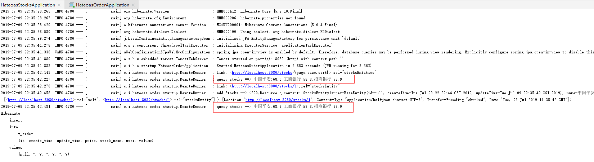

## 1、概述

> HATEOAS（Hypermedia as the engine of application state）是 REST 架构风格中最复杂的约束，也是构建成熟 REST 服务的核心。

## 2、HATEOAS示例


## 3、HATEOAS常用链接类型

| REL        | 说明                                           |
| ---------- | ---------------------------------------------- |
| SELF       | 指向当前资源本身的链接                         |
| edit       | 指向⼀一个可以编辑当前资源的链接               |
| collection | 如果当前资源包含在某个集合中，指向该集合的链接 |
| search     | 指向⼀一个可以搜索当前资源与其相关资源的链接   |
| related    | 指向⼀一个与当前资源相关的链接                 |
| first      | 集合遍历相关的类型，指向第⼀一个资源的链接     |
| last       | 集合遍历相关的类型，指向最后⼀一个资源的链接   |
| previous   | 集合遍历相关的类型，指向上⼀一个资源的链接     |

```xml
<list>
  <device>
    ......
    <link rel="self" href="http://host:port/res/device/11"/>
  </device>
  ...
  <link rel="next" href="http://host:port/res/device?start=10&size=10"/>
</list>
```

## 4、HATEOAS CRUD示例

+ 显示接口

  http://39.98.152.160:10680/admin/accountWarnNotifyTemplate/search

  

+ 分页查询

  http://39.98.152.160:10680/admin/accountWarnNotifyTemplate{?page,size,sort}

  


支持排序：

http://39.98.152.160:10680/admin/accountWarnNotifyTemplate?page=0&size=3&sort=lastUpdateUser,desc


+ 新增数据

  http://39.98.152.160:10680/admin/accountWarnNotifyTemplate

  传递的操作类型要改为POST， 采用JSON格式提交数据。

  

+ 更新数据

  http://39.98.152.160:10680/admin/accountWarnNotifyTemplate/15

  链接附带数据唯一ID， 提交采用PUT方式。

  


+ 删除数据

  http://39.98.152.160:10680/admin/accountWarnNotifyTemplate/15

  提交方式采用PUT。

  


## 5、案例设计

### 1、服务设计

采用Spring Data Rest 实现 Hypermedia规范。


设计两个服务， 订单服务和股票服务， 两个服务遵循Hateoas风格。

+ Step 1:  通过Restful的Hypermedia模型调用股票服务， 查询并打印股票信息。
+ Step 2:  通过HTTP PUT动作更新股票价格。
+ Step 3:  重新调用股票信息接口，打印股票名称与价格。
+ Step 4:   以上步骤操作成功后， 订单服务调用自身接口， 生成订单信息。


### 2、工程说明

> 数据层采用spring data jpa，spring提供的一套简化JPA开发的框架，按照约定好的【方法命名规则】写dao层接口，就可以在不写接口实现的情况下，实现对数据库的访问和操作。同时提供了很多除了CRUD之外的功能，如分页、排序、复杂查询等等。
>
> 本工程侧重Hateoas的理解， 数据库采用简化的H2内存数据库， 重新启动服务数据消失。


### 3、构建工程

#### 1、hateoas-stocks股票服务

- 启动类

  要加上EntityScan与EnableJpaRepositories注解，指定路径， 否则不生效。

  ```java
  @SpringBootApplication
  @ComponentScan("com.xiaobear")
  @EntityScan("com.xiaobear")
  @EnableJpaRepositories("com.xiaobear")
  public class StackApplication {
  
      public static void main(String[] args) {
          SpringApplication.run(StackApplication.class, args);
      }
  
      /**
       * 数据源
       * @return
       */
      @Bean
      public Hibernate5Module hibernate5Module(){
          return new Hibernate5Module();
      }
  
      /**
       * json解析
       * @return
       */
      @Bean
      public Jackson2ObjectMapperBuilderCustomizer jackson2ObjectMapperBuilderCustomizer(){
          return builder -> builder.indentOutput(true);
      }
  }
  ```

- 实体类

    - BaseEntity：通用实体类

      ```java
      @Data
      @MappedSuperclass
      public class BaseEntity implements Serializable {
      
          @Id
          @GeneratedValue(strategy = GenerationType.IDENTITY)
          private Long id;
      
          @Column(updatable = false)
          @CreationTimestamp
          private Date createTime;
      
          @UpdateTimestamp
          private Date updateTime;
      }
      ```

    - 股票实体类：`StocksEntity`

      ```java
      @Entity
      @Data
      @AllArgsConstructor
      @NoArgsConstructor
      @Table(name = "T_STOCKS")
      public class StocksEntity extends BaseEntity{
      
          private String name;
      
          private Double price;
      }
      ```

- ·StocksRepository接口

  定义两个方法，根据名称集合查找多个股票信息； 根据指定名称查找股票信息。

  按照JPA规范，按照方法名称自动映射解析， 无须写SQL。

  ```java
  @RepositoryRestResource(path = "stocks")
  public interface StocksRepository extends JpaRepository<StocksEntity, Long> {
  
      /**
       * 根据股票名称查找所对应的股票数据
       * @param list
       * @return
       */
      List<StocksEntity> findByNameInOrderById(@Param("list")List<String> list);
  
      /**
       * 根据名称查询股票信息
       * @param name
       * @return
       */
      public StocksEntity findByName(@Param("name")String name);
  }
  ```

- 配置文件yml

  ```yml
  server:
    port: 8080
  spring:
    application:
      name: hateoas-stocks
    jpa:
      hibernate:
        ddl-auto: none
      properties:
        hibernate:
          show_sql: true
          format_sql: true
  ```

- 数据库文件

    - schema.sql

      ```sql
      drop table t_stocks if exists ;
      
      create table t_stocks(
          id bigint auto_increment,
          name varchar(64),
          price double ,
          create_time timestamp ,
          update_time timestamp ,
          primary key(id)
      )
      ```

    - data.sql

      ```sql
      insert into t_stocks(name, price, create_time, update_time) values ('中国平安', 88.8, now(), now());
      insert into t_stocks(name, price, create_time, update_time) values ('工商银行', 89.8, now(), now());
      insert into t_stocks(name, price, create_time, update_time) values ('长沙银行', 66.8, now(), now());
      ```

- 整体工程

  


#### 2、hateoas-order订单服务

- 启动类

  ```java
  @SpringBootApplication
  @ComponentScan("com.xiaobear")
  @EntityScan("com.xiaobear")
  @EnableJpaRepositories("com.xiaobear")
  public class OrderApplication {
  
      public static void main(String[] args) {
          SpringApplication.run(OrderApplication.class, args);
      }
  
      /**
       *
       * @return
       */
      @Bean
      public Hibernate5Module hibernate5Module(){
          return new Hibernate5Module();
      }
  
      @Bean
      public Jackson2ObjectMapperBuilderCustomizer jackson2ObjectMapperBuilderCustomizer(){
          return builder -> {
              builder.indentOutput(true);
          };
      }
  
      /**
       * 设置HTTP连接池参数
       * @return
       */
      @Bean
      public HttpComponentsClientHttpRequestFactory requestFactory() {
          PoolingHttpClientConnectionManager connectionManager =
                  new PoolingHttpClientConnectionManager(30, TimeUnit.SECONDS);
          connectionManager.setMaxTotal(200);
          connectionManager.setDefaultMaxPerRoute(20);
  
          CloseableHttpClient httpClient = HttpClients.custom()
                  .setConnectionManager(connectionManager)
                  .evictIdleConnections(30, TimeUnit.SECONDS)
                  .disableAutomaticRetries()
                  //  Keep-Alive 策略
                  .setKeepAliveStrategy(new RemoteConnectionKeepAliveStrategy())
                  .build();
  
          HttpComponentsClientHttpRequestFactory requestFactory =
                  new HttpComponentsClientHttpRequestFactory(httpClient);
  
          return requestFactory;
      }
  
      /**
       * 设置RestTemplate参数
       * @param builder
       * @return
       */
      @Bean
      public RestTemplate restTemplate(RestTemplateBuilder builder) {
          return builder
                  .setConnectTimeout(Duration.ofMillis(2000))
                  .setReadTimeout(Duration.ofMillis(1800))
                  .requestFactory(this::requestFactory)
                  .build();
      }
  }
  ```

- 实体类

    - `OrderEntity`:订单实体类

      ```java
      @Entity
      @Data
      @Table(name = "t_order")
      @NoArgsConstructor
      @AllArgsConstructor
      @Builder
      public class OrderEntity extends BaseEntity {
      
          /**
           * 用户名
           */
          private String user;
      
          /**
           * 股票名称
           */
          private String stockName;
      
          /**
           * 成交数量
           */
          private String volume;
      
          /**
           * 成交价格
           */
          private Double price;
      }
      ```

    - 股票实体类：`StocksEntity`

    - BaseEntity：通用实体类

- OrderRepository接口

  ```java
  @RepositoryRestResource(path = "order")
  public interface OrderRepository extends JpaRepository<OrderEntity, Long> {
  
      /**
       * 通过用户查询信息
       * @param user
       * @return
       */
      public List<OrderEntity> findByUser(@Param("user") String user);
  }
  ```

- `RemoteConnectionKeepAliveStrategy`：远程连接

  ```java
  public class RemoteConnectionKeepAliveStrategy implements ConnectionKeepAliveStrategy {
  
      private final long DEFAULT_SECONDS = 30;
  
      /**
       * 远程连接， keepalive的设置策略
       * @param httpResponse
       * @param httpContext
       * @return
       */
      @Override
      public long getKeepAliveDuration(HttpResponse httpResponse, HttpContext httpContext) {
          return Arrays.asList(httpResponse.getHeaders(HTTP.CONN_KEEP_ALIVE))
                  .stream()
                  .filter(h -> StringUtils.endsWithIgnoreCase(h.getName(), "timeout")
                          && StringUtils.isNumeric(h.getValue()))
                  .findFirst()
                  .map(h -> NumberUtils.toLong(h.getValue(), DEFAULT_SECONDS))
                  .orElse(DEFAULT_SECONDS) * 1000;
      }
  }
  ```


- runner类

  ```java
  @Component
  @Slf4j
  public class RemoteRunner implements ApplicationRunner {
      private static final URI ROOT_URI = URI.create("http://localhost:8080/");
  
      @Autowired
      private RestTemplate restTemplate;
  
      @Autowired
      private OrderRepository orderRepository;
  
      @Override
      public void run(ApplicationArguments args) throws Exception {
  
          Link stocksLink = getLink(ROOT_URI,"stocksEntities");
          // Step 1: 查询股票信息
          queryStocks(stocksLink);
          // Step 2: 更新股票价格
          Link updateLink= getLink(ROOT_URI.resolve("stocks/1"),"stocksEntity");
          Resource<StocksEntity> americano = updateStocks(updateLink);
          // Step 3: 重新查询打印股票信息
          queryStocks(stocksLink);
  
          // Step 4: 生成订单信息
          OrderEntity order = OrderEntity.builder()
                  .user("mirson")
                  .stockName("建设银行")
                  .volume(String.valueOf(1000))
                  .price(99.9)
                  .build();
          orderRepository.save(order);
  
      }
  
      /**
       * 获取请求链接
       * @param uri
       * @param rel
       * @return
       */
      private Link getLink(URI uri, String rel) {
          ResponseEntity<Resources<Link>> rootResp =
                  restTemplate.exchange(uri, HttpMethod.GET, null,
                          new ParameterizedTypeReference<Resources<Link>>() {});
          Link link = rootResp.getBody().getLink(rel);
          log.info("Link: {}", link);
          return link;
      }
  
      /**
       * 查询股票信息
       * @param stocksLink
       */
      private void queryStocks(Link stocksLink) {
          ResponseEntity<PagedResources<Resource<StocksEntity>>> stocksResp =
                  restTemplate.exchange(stocksLink.getTemplate().expand(),
                          HttpMethod.GET, null,
                          new ParameterizedTypeReference<PagedResources<Resource<StocksEntity>>>() {});
          if(null != stocksResp.getBody() && null != stocksResp.getBody().getContent() ) {
              StringBuffer strs = new StringBuffer();
              stocksResp.getBody().getContent().forEach((s)->{
                  strs.append(s.getContent().getName()).append(":").append(s.getContent().getPrice()).append( ",");
              });
              String resp = strs.toString().replaceAll(",$", "");
              log.info("query stocks ==> " + resp);
          }else {
              log.info("query stocks ==>  empty! ");
          }
  
      }
  
      /**
       * 更新股票信息
       * @param link
       * @return
       */
      private Resource<StocksEntity> updateStocks(Link link) {
  
          StocksEntity americano = StocksEntity.builder()
                  .name("中国平安")
                  .price(68.9)
                  .build();
          RequestEntity<StocksEntity> req =
                  RequestEntity.put(link.getTemplate().expand()).body(americano);
          ResponseEntity<Resource<StocksEntity>> resp =
                  restTemplate.exchange(req,
                          new ParameterizedTypeReference<Resource<StocksEntity>>() {});
          log.info("add Stocks ==> {}", resp);
          return resp.getBody();
      }
  }
  ```

- 配置文件yml

  ```yml
  server:
    port: 8081
  spring:
    application:
      name: hateoas-order
    jpa:
      hibernate:
        ddl-auto: none
      properties:
        hibernate:
          show_sql: true
          format_sql: true
  ```

- 数据库文件

  ```sql
  drop table t_order if exists;
  
  create table t_order (
      id bigint auto_increment,
      user varchar(64),
      stock_name varchar(64),
      volume int,
      price double ,
      create_time timestamp ,
      update_time timestamp,
      primary key (id)
  )
  ```


#### 3、启动股票服务验证

1. 启动股票服务，通过HTTP访问， 来查看Rest接口信息

    + 地址： http://127.0.0.1:8080/

      ```json
      {
        "_links" : {
          "stocksEntities" : {
            "href" : "http://127.0.0.1:8080/stocks{?page,size,sort}",
            "templated" : true
          },
          "profile" : {
            "href" : "http://127.0.0.1:8080/profile"
          }
        }
      }
      ```

      可以看到我们定义的/stocks接口

    + 地址： http://127.0.0.1:8080/stocks

      ```json
      {
        "_embedded" : {
          "stocksEntities" : [ {
            "createTime" : "2019-07-09T14:20:44.644+0000",
            "updateTime" : "2019-07-09T14:20:44.644+0000",
            "name" : "中国平安",
            "price" : 68.6,
            "_links" : {
              "self" : {
                "href" : "http://127.0.0.1:8080/stocks/1"
              },
              "stocksEntity" : {
                "href" : "http://127.0.0.1:8080/stocks/1"
              }
            }
          }, {
            "createTime" : "2019-07-09T14:20:44.647+0000",
            "updateTime" : "2019-07-09T14:20:44.647+0000",
            "name" : "工商银行",
            "price" : 58.8,
            "_links" : {
              "self" : {
                "href" : "http://127.0.0.1:8080/stocks/2"
              },
              "stocksEntity" : {
                "href" : "http://127.0.0.1:8080/stocks/2"
              }
            }
          }, {
            "createTime" : "2019-07-09T14:20:44.648+0000",
            "updateTime" : "2019-07-09T14:20:44.648+0000",
            "name" : "招商银行",
            "price" : 98.9,
            "_links" : {
              "self" : {
                "href" : "http://127.0.0.1:8080/stocks/3"
              },
              "stocksEntity" : {
                "href" : "http://127.0.0.1:8080/stocks/3"
              }
            }
          } ]
        },
        "_links" : {
          "self" : {
            "href" : "http://127.0.0.1:8080/stocks{?page,size,sort}",
            "templated" : true
          },
          "profile" : {
            "href" : "http://127.0.0.1:8080/profile/stocks"
          },
          "search" : {
            "href" : "http://127.0.0.1:8080/stocks/search"
          }
        },
        "page" : {
          "size" : 20,
          "totalElements" : 3,
          "totalPages" : 1,
          "number" : 0
        }
      }
      ```

      打印了所有股票信息，最下面还暴露了其他接口信息。

    + 地址： http://127.0.0.1:8080/stocks/search

      ```json
      {
        "_links" : {
          "findByName" : {
            "href" : "http://127.0.0.1:8080/stocks/search/findByName{?name}",
            "templated" : true
          },
          "findByNameInOrderById" : {
            "href" : "http://127.0.0.1:8080/stocks/search/findByNameInOrderById{?list}",
            "templated" : true
          },
          "self" : {
            "href" : "http://127.0.0.1:8080/stocks/search"
          }
        }
      }
      ```

      打印了我们通过JPA定义的两个接口，findByNameInOrderById与findByName。

    + 地址： http://127.0.0.1:8080/stocks/search/findByNameInOrderById?list=中国平安,test

      查询中国平安与test两只股票，结果：

      ```json
      {
        "_embedded" : {
          "stocksEntities" : [ {
            "createTime" : "2019-07-09T14:20:44.644+0000",
            "updateTime" : "2019-07-09T14:20:44.644+0000",
            "name" : "中国平安",
            "price" : 68.6,
            "_links" : {
              "self" : {
                "href" : "http://127.0.0.1:8080/stocks/1"
              },
              "stocksEntity" : {
                "href" : "http://127.0.0.1:8080/stocks/1"
              }
            }
          } ]
        },
        "_links" : {
          "self" : {
            "href" : "http://127.0.0.1:8080/stocks/search/findByNameInOrderById?list=%E4%B8%AD%E5%9B%BD%E5%B9%B3%E5%AE%89,latte"
          }
        }
      }
      ```

#### 4、启动订单服务验证

1. 启动订单服务， 完整验证四个步骤处理流程。

   条件： 订单服务， 预期是修改中国平安的股票， 从价格68.6改成68.9；

   新增订单信息： 股票名称建设银行，用户名是mirson,  交易数量为1000， 价格为99.9。

2. 控制台日志

   

   看到两行日志，中国平安的价格发生了变化，从68.6修改为68.9。

3. 查看order服务的订单信息

   地址： http://127.0.0.1:8082/order

   ```json
   {
     "_embedded" : {
       "orderEntities" : [ {
         "createTime" : "2019-07-09T14:35:42.520+0000",
         "updateTime" : "2019-07-09T14:35:42.520+0000",
         "user" : "mirson",
         "stockName" : "建设银行",
         "volume" : 1000,
         "price" : 99.9,
         "_links" : {
           "self" : {
             "href" : "http://127.0.0.1:8082/order/1"
           },
           "orderEntity" : {
             "href" : "http://127.0.0.1:8082/order/1"
           }
         }
       } ]
     },
     "_links" : {
       "self" : {
         "href" : "http://127.0.0.1:8082/order{?page,size,sort}",
         "templated" : true
       },
       "profile" : {
         "href" : "http://127.0.0.1:8082/profile/order"
       },
       "search" : {
         "href" : "http://127.0.0.1:8082/order/search"
       }
     },
     "page" : {
       "size" : 20,
       "totalElements" : 1,
       "totalPages" : 1,
       "number" : 0
     }
   }
   ```

   生成了我们新增的订单信息。此外还可以通过Postman来模拟增删改查操作， Spring Data Rest都帮我们做好封装。

   通过Spring Data Rest整个实现流程非常简单， 没有Controller层， 这正是Restful的设计风格， 以资源为对象， 无需过多的流程，转换处理。


### 4、遇到的问题

#### 1、SpringBoot中使用整合SpringData JPA，出现“No identifier specified for entity”

先看代码

```java
import lombok.Data;
import org.hibernate.annotations.CreationTimestamp;
import org.hibernate.annotations.UpdateTimestamp;
import org.springframework.data.annotation.Id;
import javax.persistence.Entity;
import javax.persistence.GeneratedValue;
import javax.persistence.GenerationType;
import java.io.Serializable;
import java.util.Date;

/**
 * @author xiaobear
 * @version 1.0
 * @description: 基础类
 * @date 2022/10/23 13:57
 */
@Data
@MappedSuperclass
public class BaseEntity implements Serializable {

    @Id
    @GeneratedValue(strategy = GenerationType.IDENTITY)
    private Long id;

    @Column(updatable = false)
    @CreationTimestamp
    private Date createTime;

    @UpdateTimestamp
    private Date updateTime;
}
```

后来经过百度查找一番，发现标注@Id引入的包错了

- 错误引入：`import org.springframework.data.annotation.Id;`
- 正确引入：`import javax.persistence.Id;`


#### 2、OrderRepository must only contain a single path segment!

先看代码

```java
@RepositoryRestResource(path = "/order")
public interface OrderRepository extends JpaRepository<OrderEntity, Long> {

    /**
     * 通过用户查询信息
     * @param user
     * @return
     */
    public List<OrderEntity> findByUser(@Param("user") String user);
}

```

通过查阅资料：[资料链接](https://time.geekbang.org/discuss/detail/157607)

尝试去除了路径上的`'/'`，启动发现正常了
