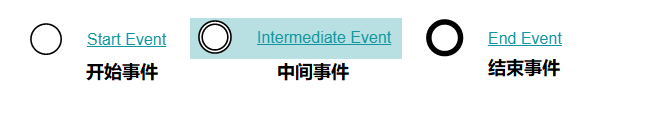
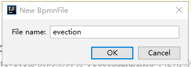

在本章内容中，我们来创建一个Activiti工作流，并启动这个流程。

创建Activiti工作流主要包含以下几步：

1、定义流程，按照BPMN的规范，使用流程定义工具，用**流程符号**把整个流程描述出来

2、部署流程，把画好的流程定义文件，加载到数据库中，生成表的数据

3、启动流程，使用java代码来操作数据库表中的内容

## 1、流程符号

BPMN 2.0是业务流程建模符号2.0的缩写。

它由Business Process Management Initiative这个非营利协会创建并不断发展。作为一种标识，BPMN 2.0是使用一些**符号**来明确业务流程设计流程图的一整套符号规范，它能增进业务建模时的沟通效率。

目前BPMN2.0是最新的版本，它用于在BPM上下文中进行布局和可视化的沟通。

接下来我们先来了解在流程设计中常见的 符号。

BPMN2.0的**基本符合**主要包含：

### 事件 Event



### 活动 Activity

活动是工作或任务的一个通用术语。一个活动可以是一个任务，还可以是一个当前流程的子处理流程； 其次，你还可以为活动指定不同的类型。常见活动如下：


### 网关 GateWay

网关用来处理决策，有几种常用网关需要了解：


#### 排他网关 (x) 

——只有一条路径会被选择。流程执行到该网关时，按照输出流的顺序逐个计算，当条件的计算结果为true时，继续执行当前网关的输出流；

​    如果多条线路计算结果都是 true，则会执行第一个值为 true 的线路。如果所有网关计算结果没有true，则引擎会抛出异常。

​    排他网关需要和条件顺序流结合使用，default 属性指定默认顺序流，当所有的条件不满足时会执行默认顺序流。

#### 并行网关 (+) 

——所有路径会被同时选择

​    拆分 —— 并行执行所有输出顺序流，为每一条顺序流创建一个并行执行线路。

​    合并 —— 所有从并行网关拆分并执行完成的线路均在此等候，直到所有的线路都执行完成才继续向下执行。

#### 包容网关 (+) 

—— 可以同时执行多条线路，也可以在网关上设置条件

​    拆分 —— 计算每条线路上的表达式，当表达式计算结果为true时，创建一个并行线路并继续执行

​    合并 —— 所有从并行网关拆分并执行完成的线路均在此等候，直到所有的线路都执行完成才继续向下执行。

#### 事件网关 (+) 

—— 专门为中间捕获事件设置的，允许设置多个输出流指向多个不同的中间捕获事件。当流程执行到事件网关后，流程处于等待状态，需要等待抛出事件才能将等待状态转换为活动状态。

### 流向 Flow

流是连接两个流程节点的连线。常见的流向包含以下几种：


## 2、流程设计器使用

### Activiti-Designer使用

#### Palette（画板）

在idea中安装插件即可使用，画板中包括以下结点：

Connection—连接

Event---事件

Task---任务

Gateway---网关

Container—容器

Boundary event—边界事件

Intermediate event- -中间事件

流程图设计完毕保存生成.bpmn文件

#### 新建流程(IDEA工具)

首先选中存放图形的目录(选择resources下的bpmn目录)，点击菜单：New  -> BpmnFile，如图：


弹出如下图所示框，输入evection 表示 出差审批流程：



起完名字evection后（默认扩展名为bpmn），就可以看到流程设计页面，如图所示：


左侧区域是绘图区，右侧区域是palette画板区域

鼠标先点击画板的元素即可在左侧绘图

### 绘制流程

使用滑板来绘制流程，通过从右侧把图标拖拽到左侧的画板，最终效果如下：


### 指定流程定义Key

流程定义key即流程定义的标识，通过properties视图查看流程的key


### 指定任务负责人

在properties视图指定每个任务结点的负责人，如：填写出差申请的负责人为 zhangsan


经理审批负责人为 lisi

总经理审批负责人为 wangwu

财务审批负责人为 liliu

因版本问题，流程配置文件如下：

```xml
<?xml version="1.0" encoding="UTF-8" standalone="yes"?>
<definitions xmlns="http://www.omg.org/spec/BPMN/20100524/MODEL" xmlns:activiti="http://activiti.org/bpmn" xmlns:bpmndi="http://www.omg.org/spec/BPMN/20100524/DI" xmlns:omgdc="http://www.omg.org/spec/DD/20100524/DC" xmlns:omgdi="http://www.omg.org/spec/DD/20100524/DI" xmlns:tns="http://www.activiti.org/test" xmlns:xsd="http://www.w3.org/2001/XMLSchema" xmlns:xsi="http://www.w3.org/2001/XMLSchema-instance" expressionLanguage="http://www.w3.org/1999/XPath" id="m1576151336547" name="" targetNamespace="http://www.activiti.org/test" typeLanguage="http://www.w3.org/2001/XMLSchema">
  <process id="myEvection" isClosed="false" isExecutable="true" name="出差申请" processType="None">
    <startEvent id="_2" name="StartEvent"/>
    <userTask activiti:assignee="zhangsan" activiti:exclusive="true" id="_3" name="创建出差申请"/>
    <userTask activiti:assignee="lisi" activiti:exclusive="true" id="_4" name="经理审批"/>
    <userTask activiti:assignee="wangwu" activiti:exclusive="true" id="_5" name="总经理审批"/>
    <userTask activiti:assignee="liliu" activiti:exclusive="true" id="_6" name="财务审批"/>
    <endEvent id="_7" name="EndEvent"/>
    <sequenceFlow id="_8" sourceRef="_2" targetRef="_3"/>
    <sequenceFlow id="_9" sourceRef="_3" targetRef="_4"/>
    <sequenceFlow id="_10" sourceRef="_4" targetRef="_5"/>
    <sequenceFlow id="_11" sourceRef="_5" targetRef="_6"/>
    <sequenceFlow id="_12" sourceRef="_6" targetRef="_7"/>
  </process>
  <bpmndi:BPMNDiagram documentation="background=#FFFFFF;count=1;horizontalcount=1;orientation=0;width=842.4;height=1195.2;imageableWidth=832.4;imageableHeight=1185.2;imageableX=5.0;imageableY=5.0" id="Diagram-_1" name="New Diagram">
    <bpmndi:BPMNPlane bpmnElement="myEvection">
      <bpmndi:BPMNShape bpmnElement="_2" id="Shape-_2">
        <omgdc:Bounds height="32.0" width="32.0" x="245.0" y="10.0"/>
        <bpmndi:BPMNLabel>
          <omgdc:Bounds height="32.0" width="32.0" x="0.0" y="0.0"/>
        </bpmndi:BPMNLabel>
      </bpmndi:BPMNShape>
      <bpmndi:BPMNShape bpmnElement="_3" id="Shape-_3">
        <omgdc:Bounds height="55.0" width="85.0" x="220.0" y="65.0"/>
        <bpmndi:BPMNLabel>
          <omgdc:Bounds height="55.0" width="85.0" x="0.0" y="0.0"/>
        </bpmndi:BPMNLabel>
      </bpmndi:BPMNShape>
      <bpmndi:BPMNShape bpmnElement="_4" id="Shape-_4">
        <omgdc:Bounds height="55.0" width="85.0" x="220.0" y="155.0"/>
        <bpmndi:BPMNLabel>
          <omgdc:Bounds height="55.0" width="85.0" x="0.0" y="0.0"/>
        </bpmndi:BPMNLabel>
      </bpmndi:BPMNShape>
      <bpmndi:BPMNShape bpmnElement="_5" id="Shape-_5">
        <omgdc:Bounds height="55.0" width="85.0" x="225.0" y="240.0"/>
        <bpmndi:BPMNLabel>
          <omgdc:Bounds height="55.0" width="85.0" x="0.0" y="0.0"/>
        </bpmndi:BPMNLabel>
      </bpmndi:BPMNShape>
      <bpmndi:BPMNShape bpmnElement="_6" id="Shape-_6">
        <omgdc:Bounds height="55.0" width="85.0" x="225.0" y="320.0"/>
        <bpmndi:BPMNLabel>
          <omgdc:Bounds height="55.0" width="85.0" x="0.0" y="0.0"/>
        </bpmndi:BPMNLabel>
      </bpmndi:BPMNShape>
      <bpmndi:BPMNShape bpmnElement="_7" id="Shape-_7">
        <omgdc:Bounds height="32.0" width="32.0" x="250.0" y="400.0"/>
        <bpmndi:BPMNLabel>
          <omgdc:Bounds height="32.0" width="32.0" x="0.0" y="0.0"/>
        </bpmndi:BPMNLabel>
      </bpmndi:BPMNShape>
      <bpmndi:BPMNEdge bpmnElement="_12" id="BPMNEdge__12" sourceElement="_6" targetElement="_7">
        <omgdi:waypoint x="266.0" y="375.0"/>
        <omgdi:waypoint x="266.0" y="400.0"/>
        <bpmndi:BPMNLabel>
          <omgdc:Bounds height="0.0" width="0.0" x="0.0" y="0.0"/>
        </bpmndi:BPMNLabel>
      </bpmndi:BPMNEdge>
      <bpmndi:BPMNEdge bpmnElement="_8" id="BPMNEdge__8" sourceElement="_2" targetElement="_3">
        <omgdi:waypoint x="261.0" y="42.0"/>
        <omgdi:waypoint x="261.0" y="65.0"/>
        <bpmndi:BPMNLabel>
          <omgdc:Bounds height="0.0" width="0.0" x="0.0" y="0.0"/>
        </bpmndi:BPMNLabel>
      </bpmndi:BPMNEdge>
      <bpmndi:BPMNEdge bpmnElement="_9" id="BPMNEdge__9" sourceElement="_3" targetElement="_4">
        <omgdi:waypoint x="262.5" y="120.0"/>
        <omgdi:waypoint x="262.5" y="155.0"/>
        <bpmndi:BPMNLabel>
          <omgdc:Bounds height="0.0" width="0.0" x="0.0" y="0.0"/>
        </bpmndi:BPMNLabel>
      </bpmndi:BPMNEdge>
      <bpmndi:BPMNEdge bpmnElement="_11" id="BPMNEdge__11" sourceElement="_5" targetElement="_6">
        <omgdi:waypoint x="267.5" y="295.0"/>
        <omgdi:waypoint x="267.5" y="320.0"/>
        <bpmndi:BPMNLabel>
          <omgdc:Bounds height="0.0" width="0.0" x="0.0" y="0.0"/>
        </bpmndi:BPMNLabel>
      </bpmndi:BPMNEdge>
      <bpmndi:BPMNEdge bpmnElement="_10" id="BPMNEdge__10" sourceElement="_4" targetElement="_5">
        <omgdi:waypoint x="265.0" y="210.0"/>
        <omgdi:waypoint x="265.0" y="240.0"/>
        <bpmndi:BPMNLabel>
          <omgdc:Bounds height="0.0" width="0.0" x="0.0" y="0.0"/>
        </bpmndi:BPMNLabel>
      </bpmndi:BPMNEdge>
    </bpmndi:BPMNPlane>
  </bpmndi:BPMNDiagram>
</definitions>
```

