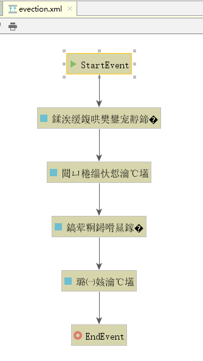
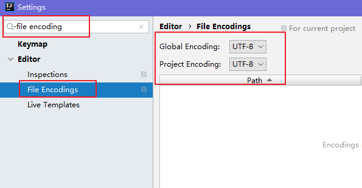

## 1、流程定义

### 概述

流程定义是线下按照bpmn2.0标准去描述 业务流程，通常使用idea中的插件对业务流程进行建模。

使用idea下的designer设计器绘制流程，并会生成两个文件：.bpmn和.png

###  .bpmn文件

使用activiti-desinger设计业务流程，会生成.bpmn文件，上面我们已经创建好了bpmn文件

BPMN 2.0根节点是definitions节点。 这个元素中，可以定义多个流程定义（不过我们建议每个文件只包含一个流程定义， 可以简化开发过程中的维护难度）。 注意，definitions元素 最少也要包含xmlns 和 targetNamespace的声明。 targetNamespace可以是任意值，它用来对流程实例进行分类。

流程定义部分：定义了流程每个结点的描述及结点之间的流程流转。

流程布局定义：定义流程每个结点在流程图上的位置坐标等信息。

### 生成.png图片文件

IDEA工具中的操作方式

#### 1、修改文件后缀为xml

首先将evection.bpmn文件改名为evection.xml，如下图：


evection.xml修改前的bpmn文件，效果如下：


#### 2、使用designer设计器打开.xml文件

在evection.xml文件上面，点右键并选择Diagrams菜单，再选择Show BPMN2.0 Designer…


#### 3、查看打开的文件

打开后，却出现乱码，如图：



#### 4、解决中文乱码

1、打开Settings，找到File Encodings，把encoding的选项都选择UTF-8



2、打开IDEA安装路径，找到如下的安装目录


根据自己所安装的版本来决定，我使用的是64位的idea，所以在idea64.exe.vmoptions文件的最后一行追加一条命令： -Dfile.encoding=UTF-8 

如下所示：


一定注意，不要有空格，否则重启IDEA时会打不开，然后 重启IDEA。

如果以上方法已经做完，还出现乱码，就再修改一个文件，并在文件的末尾添加： -Dfile.encoding=UTF-8，然后重启idea，如图：


最后重新在evection.xml文件上面，点右键并选择Diagrams菜单，再选择Show BPMN2.0 Designer…，看到生成图片，如图：


到此，解决乱码问题

#### 5、导出为图片文件

点击Export To File的小图标，打开如下窗口，注意填写文件名及扩展名，选择好保存图片的位置：


然后，我们把png文件拷贝到resources下的bpmn目录，并且把evection.xml改名为evection.bpmn。

## 2、流程定义部署

### 概述

将上面在设计器中定义的流程部署到activiti数据库中，就是流程定义部署。

通过调用activiti的api将流程定义的bpmn和png两个文件一个一个添加部署到activiti中，也可以将两个文件打成zip包进行部署。

### 单个文件部署方式

分别将bpmn文件和png图片文件部署。

```java
package com.itheima.test;

import org.activiti.engine.ProcessEngine;
import org.activiti.engine.ProcessEngines;
import org.activiti.engine.RepositoryService;
import org.activiti.engine.repository.Deployment;
import org.junit.Test;

public class ActivitiDemo {
    /**
     * 部署流程定义
     */
    @Test
    public void testDeployment(){
//        1、创建ProcessEngine
        ProcessEngine processEngine = ProcessEngines.getDefaultProcessEngine();
//        2、得到RepositoryService实例
        RepositoryService repositoryService = processEngine.getRepositoryService();
//        3、使用RepositoryService进行部署
        Deployment deployment = repositoryService.createDeployment()
                .addClasspathResource("bpmn/evection.bpmn") // 添加bpmn资源
                .addClasspathResource("bpmn/evection.png")  // 添加png资源
                .name("出差申请流程")
                .deploy();
//        4、输出部署信息
        System.out.println("流程部署id：" + deployment.getId());
        System.out.println("流程部署名称：" + deployment.getName());
    }
}

```

执行此操作后activiti会将上边代码中指定的bpm文件和图片文件保存在activiti数据库。


### 压缩包部署方式

将evection.bpmn和evection.png压缩成zip包。

```java
@Test
	public void deployProcessByZip() {
		// 定义zip输入流
		InputStream inputStream = this
				.getClass()
				.getClassLoader()
				.getResourceAsStream(
						"bpmn/evection.zip");
		ZipInputStream zipInputStream = new ZipInputStream(inputStream);
		// 获取repositoryService
		RepositoryService repositoryService = processEngine
				.getRepositoryService();
		// 流程部署
		Deployment deployment = repositoryService.createDeployment()
				.addZipInputStream(zipInputStream)
				.deploy();
		System.out.println("流程部署id：" + deployment.getId());
		System.out.println("流程部署名称：" + deployment.getName());
	}

```

执行此操作后activiti会将上边代码中指定的bpm文件和图片文件保存在activiti数据库。


### 操作数据表

流程定义部署后操作activiti的3张表如下：

act_re_deployment     流程定义部署表，每部署一次增加一条记录

act_re_procdef            流程定义表，部署每个新的流程定义都会在这张表中增加一条记录

act_ge_bytearray        流程资源表 

接下来我们来看看，写入了什么数据：

```sql
SELECT * FROM act_re_deployment #流程定义部署表，记录流程部署信息
```

结果：


```sql
SELECT * FROM act_re_procdef #流程定义表，记录流程定义信息
```

结果：

注意，KEY 这个字段是用来唯一识别不同流程的关键字


```sql
SELECT * FROM act_ge_bytearray #资源表 
```

结果：


 注意：

act_re_deployment和act_re_procdef一对多关系，一次部署在流程部署表生成一条记录，但一次部署可以部署多个流程定义，每个流程定义在流程定义表生成一条记录。每一个流程定义在act_ge_bytearray会存在两个资源记录，bpmn和png。

建议：一次部署一个流程，这样部署表和流程定义表是一对一有关系，方便读取流程部署及流程定义信息。

## 3、启动流程实例

流程定义部署在activiti后就可以通过工作流管理业务流程了，也就是说上边部署的出差申请流程可以使用了。

针对该流程，启动一个流程表示发起一个新的出差申请单，这就相当于java类与java对象的关系，类定义好后需要new创建一个对象使用，当然可以new多个对象。对于请出差申请流程，张三发起一个出差申请单需要启动一个流程实例，出差申请单发起一个出差单也需要启动一个流程实例。

代码如下：

```java
/**
     * 启动流程
     */
    @Test
    public void testStartProcess(){
        //创建流程引擎
        ProcessEngine processEngine = ProcessEngines.getDefaultProcessEngine();
        //获取runtimeService
        RuntimeService runtimeService = processEngine.getRuntimeService();
        //通过流程id启动流程 对应的act_re_procdef的id
        ProcessInstance evection = runtimeService.startProcessInstanceById("evection:1:4");
        //输出内容
        System.out.println("流程定义id：" + evection.getProcessDefinitionId());
        System.out.println("流程实例id：" + evection.getId());
        System.out.println("当前活动Id：" + evection.getActivityId());
    }
```

输出内容如下：


**操作数据表**

act_hi_actinst     流程实例执行历史

act_hi_identitylink  流程的参与用户历史信息

act_hi_procinst      流程实例历史信息

act_hi_taskinst       流程任务历史信息

act_ru_execution   流程执行信息

act_ru_identitylink  流程的参与用户信息

act_ru_task              任务信息

## 4、任务查询

流程启动后，任务的负责人就可以查询自己当前需要处理的任务，查询出来的任务都是该用户的待办任务。

```java
/**
     * 查询当前个人待执行的任务
      */
    @Test
    public void testFindPersonalTaskList() {
//        任务负责人
        String assignee = "zhangsan";
        ProcessEngine processEngine = ProcessEngines.getDefaultProcessEngine();
//        创建TaskService
        TaskService taskService = processEngine.getTaskService();
//        根据流程key 和 任务负责人 查询任务
        List<Task> list = taskService.createTaskQuery()
                .processDefinitionKey("myEvection") //流程Key
                .taskAssignee(assignee)//只查询该任务负责人的任务
                .list();

        for (Task task : list) {
            System.out.println("流程实例id：" + task.getProcessInstanceId());
            System.out.println("任务id：" + task.getId());
            System.out.println("任务负责人：" + task.getAssignee());
            System.out.println("任务名称：" + task.getName());

        }
    }
```

输出结果如下：

```
流程实例id：2501
任务id：2505
任务负责人：zhangsan
任务名称：创建出差申请
```

## 5、流程任务处理

任务负责人查询待办任务，选择任务进行处理，完成任务。

```java
// 完成任务
    @Test
    public void completTask(){
//        获取引擎
        ProcessEngine processEngine = ProcessEngines.getDefaultProcessEngine();
//        获取taskService
        TaskService taskService = processEngine.getTaskService();

//        根据流程key 和 任务的负责人 查询任务
//        返回一个任务对象
        Task task = taskService.createTaskQuery()
                .processDefinitionKey("myEvection") //流程Key
                .taskAssignee("zhangsan")  //要查询的负责人
                .singleResult();

//        完成任务,参数：任务id
        taskService.complete(task.getId());
    }

```

## 6、流程定义信息查询

查询流程相关信息，包含流程定义，流程部署，流程定义版本

```java
    /**
     * 查询流程定义
     */
    @Test
    public void queryProcessDefinition(){
        //        获取引擎
        ProcessEngine processEngine = ProcessEngines.getDefaultProcessEngine();
//        repositoryService
        RepositoryService repositoryService = processEngine.getRepositoryService();
//        得到ProcessDefinitionQuery 对象
        ProcessDefinitionQuery processDefinitionQuery = repositoryService.createProcessDefinitionQuery();
//          查询出当前所有的流程定义
//          条件：processDefinitionKey =evection
//          orderByProcessDefinitionVersion 按照版本排序
//        desc倒叙
//        list 返回集合
        List<ProcessDefinition> definitionList = processDefinitionQuery.processDefinitionKey("myEvection")
                .orderByProcessDefinitionVersion()
                .desc()
                .list();
//      输出流程定义信息
        for (ProcessDefinition processDefinition : definitionList) {
            System.out.println("流程定义 id="+processDefinition.getId());
            System.out.println("流程定义 name="+processDefinition.getName());
            System.out.println("流程定义 key="+processDefinition.getKey());
            System.out.println("流程定义 Version="+processDefinition.getVersion());
            System.out.println("流程部署ID ="+processDefinition.getDeploymentId());
        }

    }
```

输出结果：

```
流程定义 id=myEvection:1:4
流程定义 name=出差申请
流程定义 key=myEvection
流程定义 Version=1
流程部署ID =1
```


## 7、流程删除

```java
public void deleteDeployment() {
		// 流程部署id
		String deploymentId = "1";
		
    ProcessEngine processEngine = ProcessEngines.getDefaultProcessEngine();
    // 通过流程引擎获取repositoryService
		RepositoryService repositoryService = processEngine
				.getRepositoryService();
		//删除流程定义，如果该流程定义已有流程实例启动则删除时出错
		repositoryService.deleteDeployment(deploymentId);
		//设置true 级联删除流程定义，即使该流程有流程实例启动也可以删除，设置为false非级别删除方式，如果流程
		//repositoryService.deleteDeployment(deploymentId, true);
	}

```

说明：

1)       使用repositoryService删除流程定义，历史表信息不会被删除

2)       如果该流程定义下没有正在运行的流程，则可以用普通删除。

如果该流程定义下存在已经运行的流程，使用普通删除报错，可用级联删除方法将流程及相关记录全部删除。

先删除没有完成流程节点，最后就可以完全删除流程定义信息

项目开发中级联删除操作一般只开放给超级管理员使用.

## 8、流程资源下载

现在我们的流程资源文件已经上传到数据库了，如果其他用户想要查看这些资源文件，可以从数据库中把资源文件下载到本地。

解决方案有：

1、jdbc对blob类型，clob类型数据读取出来，保存到文件目录

2、使用activiti的api来实现

使用commons-io.jar 解决IO的操作

引入commons-io依赖包

```xml
<dependency>
    <groupId>commons-io</groupId>
    <artifactId>commons-io</artifactId>
    <version>2.6</version>
</dependency>
```


通过流程定义对象获取流程定义资源，获取bpmn和png

```java
import org.apache.commons.io.IOUtils;

@Test
    public void deleteDeployment(){
//        获取引擎
        ProcessEngine processEngine = ProcessEngines.getDefaultProcessEngine();
//        获取repositoryService
        RepositoryService repositoryService = processEngine.getRepositoryService();
//        根据部署id 删除部署信息,如果想要级联删除，可以添加第二个参数，true
        repositoryService.deleteDeployment("1");
    }

    public void  queryBpmnFile() throws IOException {
//        1、得到引擎
        ProcessEngine processEngine = ProcessEngines.getDefaultProcessEngine();
//        2、获取repositoryService
        RepositoryService repositoryService = processEngine.getRepositoryService();
//        3、得到查询器：ProcessDefinitionQuery，设置查询条件,得到想要的流程定义
        ProcessDefinition processDefinition = repositoryService.createProcessDefinitionQuery()
                .processDefinitionKey("myEvection")
                .singleResult();
//        4、通过流程定义信息，得到部署ID
        String deploymentId = processDefinition.getDeploymentId();
//        5、通过repositoryService的方法，实现读取图片信息和bpmn信息
//        png图片的流
        InputStream pngInput = repositoryService.getResourceAsStream(deploymentId, processDefinition.getDiagramResourceName());
//        bpmn文件的流
        InputStream bpmnInput = repositoryService.getResourceAsStream(deploymentId, processDefinition.getResourceName());
//        6、构造OutputStream流
        File file_png = new File("d:/evectionflow01.png");
        File file_bpmn = new File("d:/evectionflow01.bpmn");
        FileOutputStream bpmnOut = new FileOutputStream(file_bpmn);
        FileOutputStream pngOut = new FileOutputStream(file_png);
//        7、输入流，输出流的转换
        IOUtils.copy(pngInput,pngOut);
        IOUtils.copy(bpmnInput,bpmnOut);
//        8、关闭流
        pngOut.close();
        bpmnOut.close();
        pngInput.close();
        bpmnInput.close();
    }

```

说明：

1)       deploymentId为流程部署ID

2)       resource_name为act_ge_bytearray表中NAME_列的值

3)       使用repositoryService的getDeploymentResourceNames方法可以获取指定部署下得所有文件的名称

4)       使用repositoryService的getResourceAsStream方法传入部署ID和资源图片名称可以获取部署下指定名称文件的输入流

最后的将输入流中的图片资源进行输出。

## 9、流程历史信息的查看

即使流程定义已经删除了，流程执行的历史信息通过前面的分析，依然保存在activiti的act_hi_*相关的表中。所以我们还是可以查询流程执行的历史信息，可以通过HistoryService来查看相关的历史记录。

```java
    /**
     * 查看历史信息
     */
    @Test
    public void findHistoryInfo(){
//      获取引擎
        ProcessEngine processEngine = ProcessEngines.getDefaultProcessEngine();
//        获取HistoryService
        HistoryService historyService = processEngine.getHistoryService();
//        获取 actinst表的查询对象
        HistoricActivityInstanceQuery instanceQuery = historyService.createHistoricActivityInstanceQuery();
//        查询 actinst表，条件：根据 InstanceId 查询
//        instanceQuery.processInstanceId("2501");
//        查询 actinst表，条件：根据 DefinitionId 查询
        instanceQuery.processDefinitionId("myEvection:1:4");
//        增加排序操作,orderByHistoricActivityInstanceStartTime 根据开始时间排序 asc 升序
        instanceQuery.orderByHistoricActivityInstanceStartTime().asc();
//        查询所有内容
        List<HistoricActivityInstance> activityInstanceList = instanceQuery.list();
//        输出
        for (HistoricActivityInstance hi : activityInstanceList) {
            System.out.println(hi.getActivityId());
            System.out.println(hi.getActivityName());
            System.out.println(hi.getProcessDefinitionId());
            System.out.println(hi.getProcessInstanceId());
            System.out.println("<==========================>");
        }
    }
```

