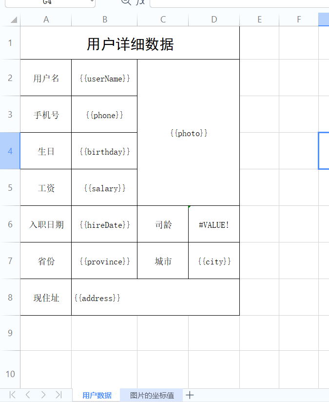
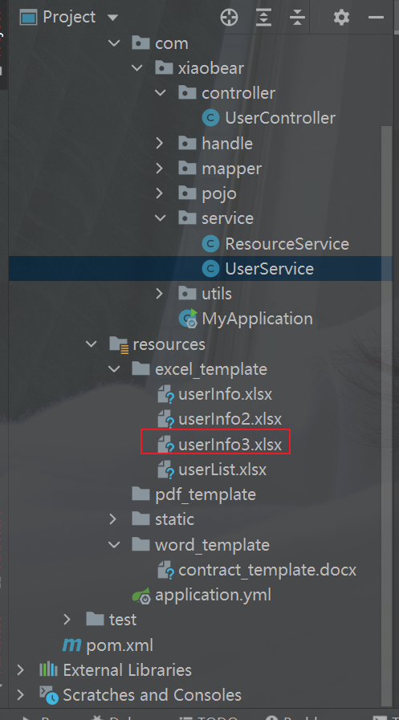
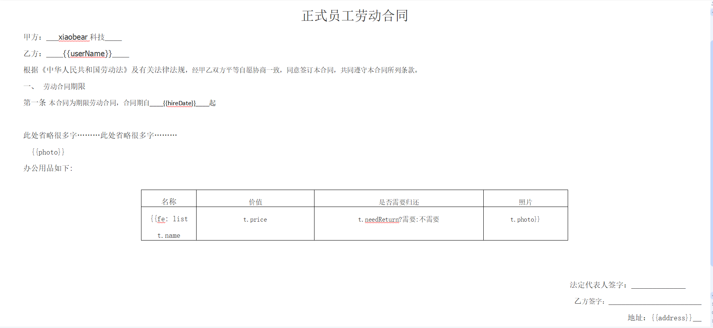
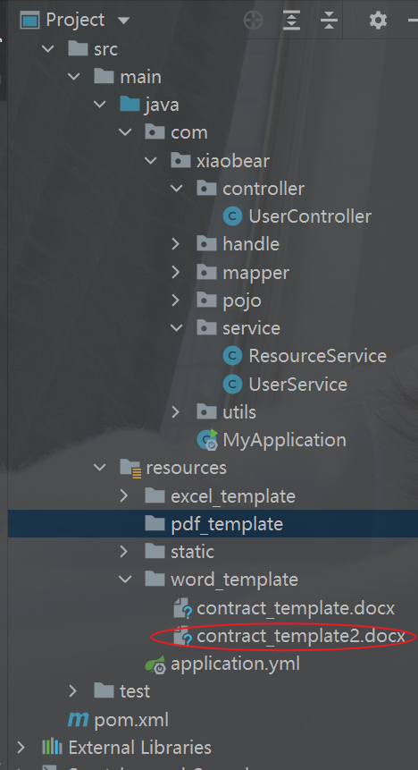
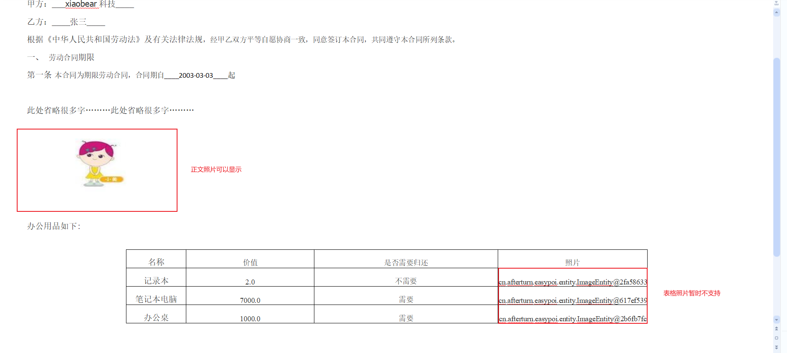

### 1、简介

原文档地址：https://easypoi.mydoc.io/     （比较推荐）

新地址：http://www.wupaas.com/

> easypoi功能如同名字easy,主打的功能就是容易,让一个没见接触过poi的人员 就可以方便的写出Excel导出,Excel模板导出,Excel导入,Word模板导出,通过简单的注解和模板 语言(熟悉的表达式语法),完成以前复杂的写法

**Easypoi的目标是什么**

> Easypoi的目标不是替代poi,而是让一个不懂导入导出的快速使用poi完成Excel和word的各种操作,而不是看很多api才可以完成这样工作

**独特的功能**

- 基于注解的导入导出,修改注解就可以修改Excel
- 支持常用的样式自定义
- 基于map可以灵活定义的表头字段
- 支持一堆多的导出,导入
- 支持模板的导出,一些常见的标签,自定义标签
- 支持HTML/Excel转换,如果模板还不能满足用户的变态需求,请用这个功能
- 支持word的导出,支持图片,Excel

**需要的依赖**

把项目中的poi的依赖去除

```xml
<dependency>
    <groupId>cn.afterturn</groupId>
    <artifactId>easypoi-base</artifactId>
    <version>4.1.0</version>
</dependency>
<dependency>
    <groupId>cn.afterturn</groupId>
    <artifactId>easypoi-web</artifactId>
    <version>4.1.0</version>
</dependency>
<dependency>
    <groupId>cn.afterturn</groupId>
    <artifactId>easypoi-annotation</artifactId>
    <version>4.1.0</version>
</dependency>
```

**SpringBoot版本**

```xml
<dependency>
    <groupId>cn.afterturn</groupId>
    <artifactId>easypoi-spring-boot-starter</artifactId>
    <version>4.1.0</version>
</dependency>
```


### 2、Excel操作

#### 1、导出

注解方式导出

1. 修改实体类，添加注解，用到的是`@Excel`注解，使用如下，必须要有空构造函数，否则会报“对象创建错误”

   | 属性           | 类型     | 类型             | 说明                                                         |
         | -------------- | -------- | ---------------- | ------------------------------------------------------------ |
   | name           | String   | null             | 列名                                                         |
   | needMerge      | boolean  | fasle            | 纵向合并单元格                                               |
   | orderNum       | String   | "0"              | 列的排序,支持name_id                                         |
   | replace        | String[] | {}               | 值得替换  导出是{a_id,b_id} 导入反过来                       |
   | savePath       | String   | "upload"         | 导入文件保存路径                                             |
   | type           | int      | 1                | 导出类型 1 是文本 2 是图片,3 是函数,10 是数字 默认是文本     |
   | width          | double   | 10               | 列宽                                                         |
   | height         | double   | 10               | 列高,后期打算统一使用@ExcelTarget的height,这个会被废弃,注意  |
   | isStatistics   | boolean  | fasle            | 自动统计数据,在追加一行统计,把所有数据都和输出这个处理会吞没异常,请注意这一点 |
   | isHyperlink    | boolean  | false            | 超链接,如果是需要实现接口返回对象                            |
   | isImportField  | boolean  | true             | 校验字段,看看这个字段是不是导入的Excel中有,如果没有说明是错误的Excel,读取失败,支持name_id |
   | exportFormat   | String   | ""               | 导出的时间格式,以这个是否为空来判断是否需要格式化日期        |
   | importFormat   | String   | ""               | 导入的时间格式,以这个是否为空来判断是否需要格式化日期        |
   | format         | String   | ""               | 时间格式,相当于同时设置了exportFormat 和 importFormat        |
   | databaseFormat | String   | "yyyyMMddHHmmss" | 导出时间设置,如果字段是Date类型则不需要设置 数据库如果是string类型,这个需要设置这个数据库格式,用以转换时间格式输出 |
   | numFormat      | String   | ""               | 数字格式化,参数是Pattern,使用的对象是DecimalFormat           |
   | imageType      | int      | 1                | 导出类型 1 从file读取 2 是从数据库中读取 默认是文件 同样导入也是一样的 |
   | suffix         | String   | ""               | 文字后缀,如% 90 变成90%                                      |
   | isWrap         | boolean  | true             | 是否换行 即支持\n                                            |
   | mergeRely      | int[]    | {}               | 合并单元格依赖关系,比如第二列合并是基于第一列 则{1}就可以了  |
   | mergeVertical  | boolean  | fasle            | 纵向合并内容相同的单元格                                     |

   ```java
   @Data
   @Table(name="tb_user")
   public class User {
       @Id
       @KeySql(useGeneratedKeys = true)
       @Excel(name = "编号",orderNum = "0",width = 5)
       private Long id;         //主键
       @Excel(name = "姓名",orderNum = "1",width = 10)
       private String userName; //员工名
       @Excel(name = "手机号",orderNum = "2",width = 15)
       private String phone;    //手机号
       @Excel(name = "省份名",orderNum = "3",width = 15)
       private String province; //省份名
       @Excel(name = "城市名",orderNum = "4",width = 15)
       private String city;     //城市名
       @Excel(name = "工资",orderNum = "5",width = 5)
       private Integer salary;   // 工资
       @JsonFormat(pattern="yyyy-MM-dd")
       @Excel(name = "入职日期",format = "yyyy-MM-dd",orderNum = "6",width = 15)
       private Date hireDate; // 入职日期
       private String deptId;   //部门id
       @Excel(name = "出生日期",format = "yyyy-MM-dd",orderNum = "7",width = 15)
       private Date birthday; //出生日期
       @Excel(name = "一寸照片",orderNum = "8",width = 15, type = 2)
       private String photo;    //一寸照片
       @Excel(name = "现在居住地址",orderNum = "9",width = 15)
       private String address;  //现在居住地址
   
       private List<Resource> resourceList; //办公用品
   }
   ```

2. 实现方法

   ```java
   /**
        * easypoi导出excel
        * @param response
        * @throws Exception
        */
   public void exportExcelByEasyPOI(HttpServletResponse response) throws Exception {
       //设置标题以及sheetName，excel导出类型
       ExportParams params = new ExportParams("员工信息","员工数据", ExcelType.XSSF);
       //获取数据源
       List<User> users = userMapper.selectAll();
       org.apache.poi.ss.usermodel.Workbook workbook = ExcelExportUtil.exportExcel(params, User.class, users);
       String fileName = "easypoi导出用户数据列表.xlsx";
       response.setHeader("Content-Disposition","attachment;filename="+new String(fileName.getBytes(),"ISO8859-1"));
       response.setContentType("application/vnd.openxmlformats-officedocument.spreadsheetml.sheet");
       workbook.write(response.getOutputStream());
   }
   ```


#### 2、导入

有导出就应该有导入，我们就把刚才导出的数据库导入到表中

Excel导入时需要的参数类ImportParams常用设置说明

1. 读取指定的sheet 比如要读取上传得第二个sheet 那么需要把startSheetIndex = 1 就可以了

2. 读取几个sheet  比如读取前2个sheet,那么 sheetNum=2 就可以了

3. 读取第二个到第五个sheet 设置 startSheetIndex = 1 然后sheetNum = 4

4. 读取全部的sheet sheetNum  设置大点就可以了

5. 保存Excel 设置 needVerfiy = true,默认保存的路径为upload/excelUpload/Test/yyyyMMddHHmss 保存名称上传时间五位随机数 如果自定义路径 修改下saveUrl 就可以了,同时saveUrl也是图片上传时候的保存的路径

6. 判断一个Excel是不是合法的Excel  importFields 设置下值,就是表示表头必须至少包含的字段,如果缺一个就是不合法的excel,不导入

7. 图片的导入

   > 有图片的导出就有图片的导入,导入的配置和导出是一样的,但是需要设置保存路径 1.设置保存路径saveUrl 默认为"upload/excelUpload" 可以手动修改 ImportParams 修改下就可以了


1. 修改实体类，表明哪些需要导入，设置`isImportField = "true"`

   ```java
   @Data
   @Table(name="tb_user")
   public class User {
       @Id
       @KeySql(useGeneratedKeys = true)
       @Excel(name = "编号",orderNum = "0",width = 5, isImportField = "true")
       private Long id;         //主键
       @Excel(name = "姓名",orderNum = "1",width = 10, isImportField = "true")
       private String userName; //员工名
       @Excel(name = "手机号",orderNum = "2",width = 15, isImportField = "true")
       private String phone;    //手机号
       @Excel(name = "省份名",orderNum = "3",width = 15, isImportField = "true")
       private String province; //省份名
       @Excel(name = "城市名",orderNum = "4",width = 15, isImportField = "true")
       private String city;     //城市名
       @Excel(name = "工资",orderNum = "5",width = 5, isImportField = "true")
       private Integer salary;   // 工资
       @JsonFormat(pattern="yyyy-MM-dd")
       @Excel(name = "入职日期",format = "yyyy-MM-dd",orderNum = "6",width = 15, isImportField = "true")
       private Date hireDate; // 入职日期
       private String deptId;   //部门id
       @Excel(name = "出生日期",format = "yyyy-MM-dd",orderNum = "7",width = 15, isImportField = "true")
       private Date birthday; //出生日期
       @Excel(name = "一寸照片",orderNum = "8",width = 15, type = 2, isImportField = "true", savePath = "D:\\28611\\idea-workspace\\xiaobear\\xiaobear-report\\xiaobear-report\\src\\main\\resources\\static\\user_photos\\")
       private String photo;    //一寸照片
       @Excel(name = "现在居住地址",orderNum = "9",width = 15, isImportField = "true")
       private String address;  //现在居住地址
   
       private List<Resource> resourceList; //办公用品
   
   }
   ```

2. 代码实现

   ```java
   /**
        * easypoi导入
        * @param file
        */
   public void importUserByEasyPoi(MultipartFile file) throws Exception{
       ImportParams importParams = new ImportParams();
       //设置有一行标题
       importParams.setTitleRows(1);
       //设置有一行行头
       importParams.setHeadRows(1);
       List<User> users = ExcelImportUtil.importExcel(file.getInputStream(), User.class, importParams);
       for (User user : users) {
           user.setId(null);
           userMapper.insert(user);
       }
   }
   ```


#### 3、使用模板导出数据

> 模板是处理复杂Excel的简单方法，复杂的Excel样式，可以用Excel直接编辑，完美的避开了代码编写样式的雷区，同时指令的支持，也提了模板的有效性；**采用的写法是{{}}代表表达式，然后根据表达式里面的数据取值**

关于样式问题：**easypoi不会改变excel原有的样式**

1. 制作模板

   

2. 放入项目中

   

3. 代码实现

   ```java
   /**
        * 通过easypoi导出word模板
        * @param id
        * @param request
        * @param response
        */
   public void exportUserInfoWithTemplateByEasyPoi(Long id, HttpServletRequest request, HttpServletResponse response) throws Exception {
       //获取模板的路径  SpringBoot项目获取根目录的方式
       File rootPath = new File(ResourceUtils.getURL("classpath:").getPath());
       File templatePath = new File(rootPath.getAbsolutePath(),"/excel_template/userInfo3.xlsx");
       //读取模板文件
       TemplateExportParams params = new TemplateExportParams(templatePath.getPath(), true);
       User user = userMapper.selectByPrimaryKey(id);
       //将对象转成map
       Map<String, Object> map = EntityUtils.entityToMap(user);
       //设置图片
       ImageEntity imageEntity = new ImageEntity();
       /*     imageEntity.setWidth(50);
           imageEntity.setHeight(100);*/
       imageEntity.setColspan(2);
       imageEntity.setRowspan(4);
       imageEntity.setUrl(user.getPhoto());
       map.put("photo",imageEntity);
       //进行导出
       org.apache.poi.ss.usermodel.Workbook workbook = ExcelExportUtil.exportExcel(params, map);
       //导出的文件名称
       String filename="用户详细信息数据.xlsx";
       //设置文件的打开方式和mime类型
       ServletOutputStream outputStream = response.getOutputStream();
       response.setHeader( "Content-Disposition", "attachment;filename="  + new String(filename.getBytes(),"ISO8859-1"));
       response.setContentType("application/vnd.openxmlformats-officedocument.spreadsheetml.sheet");
       workbook.write(outputStream);
   }
   ```


#### 4、导出csv文件

csv的导出基本上和excel的导出一致,大体参数也是一致的

CsvExportParams 的参数描述如下：

| 属性       | 类型     | 默认值 | 功能                             |
| ---------- | -------- | ------ | -------------------------------- |
| encoding   | String   | UTF8   | 文件编码                         |
| spiltMark  | String   | ,      | 分隔符                           |
| textMark   | String   | “      | 字符串识别,可以去掉,需要前后一致 |
| titleRows  | int      | 0      | 表格头,忽略                      |
| headRows   | int      | 1      | 标题                             |
| exclusions | String[] | 0      | 忽略的字段                       |

代码：

```java
/**
     * easypoi导出csv文件
     * @param response
     */
public void downLoadCSVWithEasyPOI(HttpServletResponse response) throws Exception{
    ServletOutputStream outputStream = response.getOutputStream();
    String fileName = "用户数据.csv";
    response.setHeader("Content-Disposition","attachment;filename="+new String(fileName.getBytes(),"ISO8859-1"));
    response.setContentType("application/csv");
    CsvExportParams csvExportParams = new CsvExportParams();
    csvExportParams.setExclusions(new String[]{"照片"});
    List<User> users = userMapper.selectAll();
    CsvExportUtil.exportCsv(csvExportParams, User.class, users, outputStream);
}
```


### 3、word操作

#### 导出word

> Word模板和Excel模板用法基本一致，支持的标签也是一致的，仅仅支持07版本的word也是只能生成后缀是docx的文档，poi对doc支持不好所以easyPOI中就没有支持doc，我们就拿docx做导出

模板中标签的用法：

| 指令                | 作用                                                        |
| ------------------- | ----------------------------------------------------------- |
| {{test ? obj:obj2}} | 三元运算                                                    |
| n:                  | `表示 这个cell是数值类型 {{n:}} `                             |
| le:                 | `代表长度{{le:()}} 在if/else 运用{{le:() > 8 ? obj1 : obj2}}` |
| fd:                 | `格式化时间 {{fd:(obj;yyyy-MM-dd)}}  `                        |
| fn:                 | `格式化数字 {{fn:(obj;###.00)}} `                             |
| fe:                 | 遍历数据,创建row                                            |
| !fe:                | 遍历数据不创建row                                           |
| $fe:                | 下移插入,把当前行,下面的行全部下移.size()行,然后插入        |
| #fe:                | 横向遍历                                                    |
| v_fe:               | 横向遍历值                                                  |
| !if:                | `删除当前列 {{!if:(test)}}   `                                |
| ‘’                  | 单引号表示常量值 ‘’ 比如’1’ 那么输出的就是 1                |
| &NULL&              | 空格                                                        |
| &INDEX&             | 表示循环中的序号,自动添加                                   |
| ]]                  | 换行符 多行遍历导出                                         |
| sum：               | 统计数据                                                    |


1. 根据指令，制作模板

   

2. 放入项目中

   

3. 代码实现

   ```java
   /**
        * easyPOI导出word模板
        * @param id
        * @param response
        */
   public void exportWordByEasyPOI(Long id, HttpServletResponse response) throws Exception{
       //获取模板
       File root = new File(ResourceUtils.getFile("classpath:").getPath());
       File templatePath = new File(root.getAbsolutePath(), "/word_template/contract_template2.docx");
   
       //获取数据
       User user = this.findById(id);
       Map<String,Object> map = new HashMap<>();
       map.put("userName",user.getUserName());
       map.put("hireDate",sd.format(user.getHireDate()));
       map.put("address",user.getAddress());
       //正文照片
       ImageEntity imageEntity1 = new ImageEntity();
       imageEntity1.setHeight(180);
       imageEntity1.setWidth(240);
       imageEntity1.setUrl(root.getPath()+user.getPhoto());
       map.put("photo",imageEntity1);
       //处理word表格
       List<Map> list = new ArrayList<>();
       Map<String, Object> map1;
       for (com.xiaobear.pojo.Resource resource : user.getResourceList()) {
           map1 = new HashMap<>();
           map1.put("name",resource.getName());
           map1.put("price",resource.getPrice());
           map1.put("needReturn",resource.getNeedReturn());
           //表格照片
           ImageEntity imageEntity = new ImageEntity();
           imageEntity.setHeight(180);
           imageEntity.setWidth(240);
           imageEntity.setUrl(root.getPath()+"\\static"+resource.getPhoto());
           map1.put("photo",imageEntity);
           list.add(map1);
       }
       map.put("list",list);
       XWPFDocument document = WordExportUtil.exportWord07(templatePath.getPath(), map);
   
       //导出
       String filename=user.getUserName()+"_合同.docx";
       //            设置文件的打开方式和mime类型
       ServletOutputStream outputStream = response.getOutputStream();
       response.setHeader( "Content-Disposition", "attachment;filename="  + new String(filename.getBytes(),"ISO8859-1"));
       response.setContentType("application/vnd.openxmlformats-officedocument.wordprocessingml.document");
       document.write(outputStream);
   
   }
   ```



