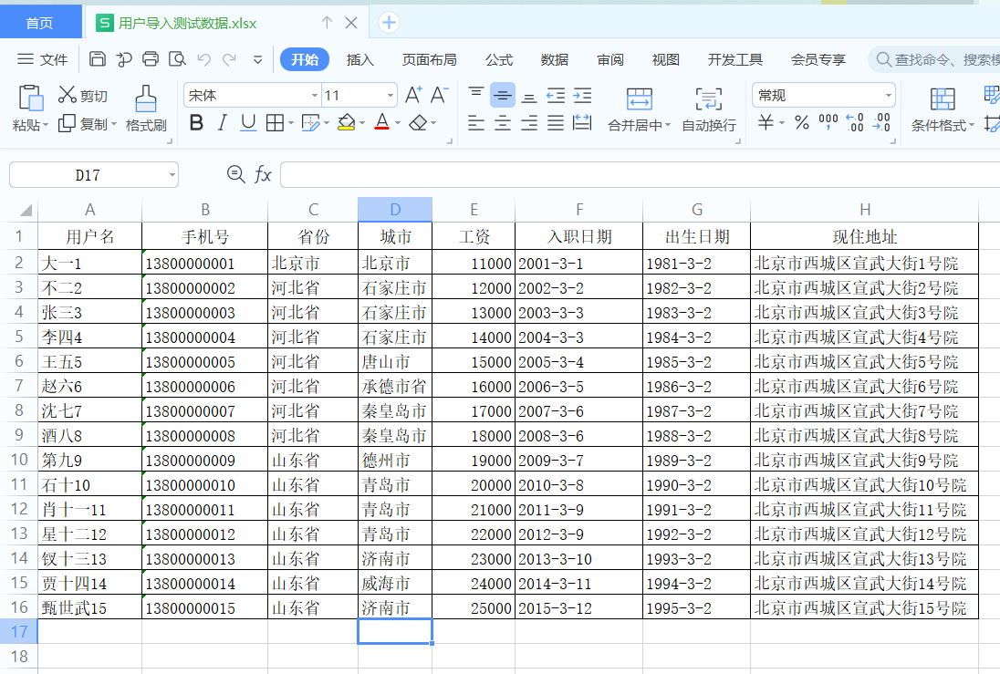

### 1、Excel简介

> 在企业级应用开发中，Excel报表是一种最常见的报表需求。Excel报表开发一般分为两种形式：
> 1、为了方便操作，基于Excel的报表批量上传数据，也就是把Excel中的数据导入到系统中。
> 2、通过java代码生成Excel报表。也就是把系统中的数据导出到Excel中，方便查阅。

#### 1、Excel版本

> 目前世面上的Excel分为两个大的版本**Excel2003**和**Excel2007**及以上两个版本；

|             | Excel2003                          | Excel2007                           |
| ----------- | ---------------------------------- | ----------------------------------- |
| 后缀        | xls                                | xlsx                                |
| 结构        | 二进制格式，核心是复合文档类型结构 | XML类型结构                         |
| 单sheet数量 | 行：65525，列：256                 | 行：1048576，列：16384              |
| 特点        | 存储容量有限                       | 基于xml压缩，占用空间小，操作效率高 |

#### 2、常见的Excel操作工具

> Java中常见的用来操作Excel的方式一般有2种：**JXL**和**POI**。

##### 1、JXL

> JXL只能对Excel进行操作,属于比较老的框架，它只支持到Excel 95-2000的版本。现在已经停止更新和维护.

##### 2、POI

> POI是apache的项目,可对微软的Word,Excel,PPT进行操作,包括office2003和2007,Excle2003和2007。poi现在一直有更新。所以现在主流使用POI。
>
> Apache POI是Apache软件基金会的开源项目，由Java编写的免费开源的跨平台的 Java API，ApachePOI提供API给Java语言操作Microsoft Office的功能。

**API对象介绍**

|                    | Excle2003    | Excle2007    |
| ------------------ | ------------ | ------------ |
| 工作簿（WorkBook） | HSSFWordBook | XSSFWorkBook |
| 工作表（Sheet）    | HSSFSheet    | XSSFSheet    |
| 行（Row）          | HSSFRow      | XSSFRow      |
| 单元格（Cell）     | HSSFCell     | XSSCell      |


### 2、JXL导出excel

#### 1、JXL导出基本知识点

> 通过WritableWorkbook，WritableSheet，Label这三个对象我们就可以实现Excel文件的导出工作。

1、 创建可写入的Excel工作薄

```java
WritableWorkbook workbook= Workbook.createWorkbook(输出流);
```

2、创建工作表

```java
WritableSheet sheet= workbook.createSheet(工作表的名称, 工作表的索引值);
```

3、创建单元格，添加文本类单元格

```java
Label labelC = new Label(列索引值, 行索引值, "单元格中的内容");

sheet.addCell(labelC);
```

4、写入到文件

```java
workbook.write();// 写入数据
```

5、释放资源：

```java
workbook.close();// 关闭文件
```


#### 2、代码实现

```java
/**
     * 通过JSL进行下载
     * @param response
     */
public void downLoadByJxl(HttpServletResponse response){
    try{
        //输出流
        ServletOutputStream outputStream = response.getOutputStream();
        //创建一个工作簿
        WritableWorkbook wb = Workbook.createWorkbook(outputStream);
        //创建一个sheet页 s：sheet名 i:sheet号
        WritableSheet wbSheet = wb.createSheet("xiaobear第一个报表文件", 0);

        //设置列宽 col:列 wid:宽d
        wbSheet.setColumnView(0,5);
        wbSheet.setColumnView(1,8);
        wbSheet.setColumnView(2,8);
        wbSheet.setColumnView(3,8);
        wbSheet.setColumnView(4,10);
        wbSheet.setColumnView(5,30);
        //创建单元格
        // Label labelC = new Label(列索引值, 行索引值, "单元格中的内容");
        //sheet.addCell(labelC);
        Label label = null;
        String[] titles = new String[]{"编号","名称","电话","生日","入职日期","住址"};
        //处理标题
        for (int i = 0; i < titles.length; i++) {
            label = new Label(i, 0, titles[i]);
            wbSheet.addCell(label);
        }
        //查询数据进行处理
        List<User> users = findAll();
        //行初始化值
        int rowIndex = 1;
        for (User user : users) {
            //编号
            label = new Label(0, rowIndex, user.getId().toString());
            wbSheet.addCell(label);
            //名称
            label = new Label(1, rowIndex, user.getUserName());
            wbSheet.addCell(label);
            //电话
            label = new Label(2, rowIndex, user.getPhone());
            wbSheet.addCell(label);
            //生日
            label = new Label(3, rowIndex, sd.format(user.getBirthday()));
            wbSheet.addCell(label);
            //入职日期
            label = new Label(4, rowIndex, sd.format(user.getHireDate()));
            wbSheet.addCell(label);
            //地址
            label = new Label(5, rowIndex, user.getAddress());
            wbSheet.addCell(label);
            //行+1
            rowIndex++;
        }
        //导出的文件名称
        String fileName = "JXL导出示例.xls";
        // 设置文件的打开方式和mime类型
        response.setHeader("Content-Disposition","attachment;filename="  + new String(fileName.getBytes(),"ISO8859-1"));
        response.setContentType("application/vnd.ms-excel");
        //导出
        wb.write();
        //关闭资源
        wb.close();
        outputStream.close();

    }catch (Exception e){
        e.printStackTrace();
    }
}
```


### 3、POI操作Excel

```xml
<!--poi所需要的依赖-->
<dependency>
    <groupId>org.apache.poi</groupId>
    <artifactId>poi</artifactId>
    <version>4.0.1</version>
</dependency>

<dependency>
    <groupId>org.apache.poi</groupId>
    <artifactId>poi-ooxml</artifactId>
    <version>4.0.1</version>
</dependency>

<dependency>
    <groupId>org.apache.poi</groupId>
    <artifactId>poi-ooxml-schemas</artifactId>
    <version>4.0.1</version>
</dependency>
```

#### 1、版本之间的区别

在POI包中有如下几个主要对象和excel的几个对象对应：

| 对应excel名称 | 低版本中的类名 | 高版本中的类名 |
| :------------ | :------------- | :------------- |
| 工作簿        | HSSFWorkbook   | XSSFWorkbook   |
| 工作表        | HSSFSheet      | XSSFSheet      |
| 行            | HSSFRow        | XSSFRow        |
| 单元格        | HSSFCell       | XSSFCell       |
| 单元格样式    | HSSFCellStyle  | XSSFCellStyle  |

##### 1、2003操作excel

```java
/**
     * 通过低版本创建excel
     */
public static void CreateExcelBy2003() throws IOException {
    //创建一个工作簿
    HSSFWorkbook hssfWorkbook = new HSSFWorkbook();
    //创建一个sheet页
    HSSFSheet sheet = hssfWorkbook.createSheet("低版本");
    //创建行
    HSSFRow row = sheet.createRow(0);
    //创建列
    HSSFCell cell = row.createCell(0);
    //创建单元格
    cell.setCellValue("xiaobear so nice");
    hssfWorkbook.write(new FileOutputStream("D://test.xls"));

}
```

##### 2、2007操作excel

```java
/**
     * 通过高版本创建excel
     */
public static void CreateExcelBy2007() throws IOException {
    //创建一个工作簿
    Workbook workbook = new XSSFWorkbook();
    //创建一个sheet页
    Sheet sheet = workbook.createSheet("低版本");
    //创建行
    Row row = sheet.createRow(0);
    //创建列
    Cell cell = row.createCell(0);
    //创建单元格
    cell.setCellValue("xiaobear so nice");
    workbook.write(new FileOutputStream("D://test.xls"));

}
```

#### 2、数据导入

> 数据的导入就是读取excel中的内容，转成对象插入到数据库中



导入上图的数据

##### 1、思路

> 一般来说，即将导入的文件，每个列代表什么意思基本上都是固定的，比如第1列就是用户姓名，最后一列就是用户的现住址，并且在做excel时对每个列的类型都是有要求的，这样就可以给我们开发带来很大的简便。
>
> 最终的目标就是读取每一行数据，把数据转成用户的对象，保存到表中

**步骤**：

1. 根据上传的文件创建Workbook
2. 获取到第一个sheet工作表
3. 从第二行开始读取数据
4. 读取每一个单元格，把内容放入到用户对象的相关的属性中

##### 2、代码实现

```java
/**
     * 用户导入数据
     * @param file
     * @throws IOException
     * @throws ParseException
     */
public void importUserByExcel(MultipartFile file) throws IOException, ParseException {
    //通过文件流返回一个工作薄
    XSSFWorkbook wb = new XSSFWorkbook(file.getInputStream());
    //获取第一个sheet页
    XSSFSheet sheet = wb.getSheetAt(0);
    //获取最后一行
    int lastRowNum = sheet.getLastRowNum();
    //遍历获取数据 开始循环每行，获取每行的单元格中的值，放入到user属性中
    User user;
    for (int i = 1; i <= lastRowNum ; i++) {
        user = new User();
        String userName = sheet.getRow(i).getCell(0).getStringCellValue();
        user.setUserName(userName);
        //手机号
        String phone = null;
        try {
            phone = sheet.getRow(i).getCell(1).getStringCellValue();
        } catch (IllegalStateException e) {
            phone = sheet.getRow(i).getCell(1).getNumericCellValue()+"";
        }
        user.setPhone(phone);
        //省份
        String province = sheet.getRow(i).getCell(2).getStringCellValue();
        //城市
        String city = sheet.getRow(i).getCell(3).getStringCellValue();
        user.setCity(city);
        // 因为在填写excel中的数据时就可以约定这个列只能填写数值，所以可以直接用getNumericCellValue方法
        //工资
        Integer salary = ((Double)sheet.getRow(i).getCell(4).getNumericCellValue()).intValue();
        user.setSalary(salary);
        //入职日期
        String hireDateStr = sheet.getRow(i).getCell(5).getStringCellValue();
        Date hireDate = sd.parse(hireDateStr);
        user.setHireDate(hireDate);
        //出生日期
        String birthdayStr = sheet.getRow(i).getCell(6).getStringCellValue();
        Date birthday = sd.parse(birthdayStr);
        user.setBirthday(birthday);
        //现住地址
        String address = sheet.getRow(i).getCell(7).getStringCellValue();
        user.setProvince(province);
        user.setAddress(address);
        userMapper.insert(user);
    }
}
```

#### 3、数据导出

> 用户导出跟JXL导出差不多

```java
/**
     * 用户导出
     * @param response
     * @throws IOException
     */
public void exportUser(HttpServletResponse response) throws IOException {
    //        创建一个空的工作薄
    org.apache.poi.ss.usermodel.Workbook workbook = new XSSFWorkbook();

    //        在工作薄中创建一个工作表
    Sheet sheet = workbook.createSheet("测试");
    //        设置列宽
    sheet.setColumnWidth(0,5*256);
    sheet.setColumnWidth(1,12*256);
    sheet.setColumnWidth(2,15*256);
    sheet.setColumnWidth(3,15*256);
    sheet.setColumnWidth(4,30*256);
    //            处理标题
    String[] titles = new String[]{"编号","姓名","手机号","入职日期","现住址"};
    //        创建标题行
    Row titleRow = sheet.createRow(0);
    Cell cell = null;
    for (int i = 0; i < titles.length; i++) {
        cell = titleRow.createCell(i);
        cell.setCellValue(titles[i]);
    }
    //        处理内容
    List<User> userList = this.findAll();
    int rowIndex = 1;
    Row row = null;
    for (User user : userList) {
        row = sheet.createRow(rowIndex);
        cell = row.createCell(0);
        cell.setCellStyle(contentStyle);
        cell.setCellValue(user.getId());

        cell = row.createCell(1);
        cell.setCellStyle(contentStyle);
        cell.setCellValue(user.getUserName());

        cell = row.createCell(2);
        cell.setCellStyle(contentStyle);
        cell.setCellValue(user.getPhone());

        cell = row.createCell(3);
        cell.setCellStyle(contentStyle);
        cell.setCellValue(sd.format(user.getHireDate()));

        cell = row.createCell(4);
        cell.setCellStyle(contentStyle);
        cell.setCellValue(user.getAddress());

        rowIndex++;
    }
    //            导出的文件名称
    String filename="员工数据.xlsx";
    //            设置文件的打开方式和mime类型
    ServletOutputStream outputStream = response.getOutputStream();
    response.setHeader( "Content-Disposition", "attachment;filename="  + new String(filename.getBytes(),"ISO8859-1"));
    response.setContentType("application/vnd.openxmlformats-officedocument.spreadsheetml.sheet");
    workbook.write(outputStream);

}
```

#### 4、设置样式

> 注：**所有样式需在单元格被创建之后才能设置，否则就会报空指针**

##### 1、设置边框

```java
CellStyle contentStyle = workbook.createCellStyle();
contentStyle.setBorderBottom(BorderStyle.THIN);
contentStyle.setBorderTop(BorderStyle.THIN);
contentStyle.setBorderLeft(BorderStyle.THIN);
contentStyle.setBorderRight(BorderStyle.THIN);
```

##### 2、对齐方式

```java
//设置居中对齐
contentStyle.setAlignment(HorizontalAlignment.CENTER);
contentStyle.setVerticalAlignment(VerticalAlignment.CENTER);
```

##### 3、合并单元格

```java
//合并单元格 起始行, 结束行, 起始列, 结束列	
sheet.addMergedRegion(new CellRangeAddress(0,0,0,4));
```

##### 4、设置行高

```java
//设置行高
row1.setHeightInPoints((short) 52);
```

##### 5、设置字体样式

```java
//设置字体
CellStyle titleStyle = workbook.createCellStyle();
Font font = workbook.createFont();
font.setBold(true);
font.setFontName("黑体");
font.setFontHeightInPoints((short) 16);
titleStyle.setFont(font);
```


#### 5、完整导出代码

```java
/**
     * 用户导出
     * @param response
     * @throws IOException
     */
public void exportUser(HttpServletResponse response) throws IOException {
    //        创建一个空的工作薄
    org.apache.poi.ss.usermodel.Workbook workbook = new XSSFWorkbook();

    //        在工作薄中创建一个工作表
    Sheet sheet = workbook.createSheet("测试");
    Row row1 = sheet.createRow(0);

    //设置行高
    row1.setHeightInPoints((short) 52);
    //合并单元格
    sheet.addMergedRegion(new CellRangeAddress(0,0,0,4));
    //        设置列宽
    sheet.setColumnWidth(0,5*256);
    sheet.setColumnWidth(1,12*256);
    sheet.setColumnWidth(2,15*256);
    sheet.setColumnWidth(3,15*256);
    sheet.setColumnWidth(4,30*256);
    /**
         * 设置框线
         */
    CellStyle contentStyle = workbook.createCellStyle();
    contentStyle.setBorderBottom(BorderStyle.THIN);
    contentStyle.setBorderTop(BorderStyle.THIN);
    contentStyle.setBorderLeft(BorderStyle.THIN);
    contentStyle.setBorderRight(BorderStyle.THIN);

    //设置居中对齐
    contentStyle.setAlignment(HorizontalAlignment.CENTER);
    contentStyle.setVerticalAlignment(VerticalAlignment.CENTER);

    //设置字体
    CellStyle titleStyle = workbook.createCellStyle();
    Font font = workbook.createFont();
    font.setBold(true);
    font.setFontHeightInPoints((short) 16);
    titleStyle.setFont(font);
    titleStyle.setBorderBottom(BorderStyle.THIN);
    titleStyle.setBorderLeft(BorderStyle.THIN);
    titleStyle.setBorderRight(BorderStyle.THIN);
    titleStyle.setBorderTop(BorderStyle.THIN);
    //设置居中对齐
    titleStyle.setAlignment(HorizontalAlignment.CENTER);
    titleStyle.setVerticalAlignment(VerticalAlignment.CENTER);

    //合并样式
    for (int i = 0; i < 5; i++) {
        Cell cell = row1.createCell(i);
        cell.setCellStyle(titleStyle);
    }
    row1.getCell(0).setCellValue("用户测试数据");

    //            处理标题
    String[] titles = new String[]{"编号","姓名","手机号","入职日期","现住址"};
    //        创建标题行
    Row titleRow = sheet.createRow(1);
    Cell cell = null;
    for (int i = 0; i < titles.length; i++) {
        cell = titleRow.createCell(i);
        cell.setCellValue(titles[i]);
        cell.setCellStyle(titleStyle);
    }
    //        处理内容
    List<User> userList = this.findAll();
    int rowIndex = 2;
    Row row = null;
    for (User user : userList) {
        row = sheet.createRow(rowIndex);
        cell = row.createCell(0);
        cell.setCellStyle(contentStyle);
        cell.setCellValue(user.getId());

        cell = row.createCell(1);
        cell.setCellStyle(contentStyle);
        cell.setCellValue(user.getUserName());

        cell = row.createCell(2);
        cell.setCellStyle(contentStyle);
        cell.setCellValue(user.getPhone());

        cell = row.createCell(3);
        cell.setCellStyle(contentStyle);
        cell.setCellValue(sd.format(user.getHireDate()));

        cell = row.createCell(4);
        cell.setCellStyle(contentStyle);
        cell.setCellValue(user.getAddress());

        rowIndex++;
    }
    //            导出的文件名称
    String filename="员工数据.xlsx";
    //            设置文件的打开方式和mime类型
    ServletOutputStream outputStream = response.getOutputStream();
    response.setHeader( "Content-Disposition", "attachment;filename="  + new String(filename.getBytes(),"ISO8859-1"));
    response.setContentType("application/vnd.openxmlformats-officedocument.spreadsheetml.sheet");
    workbook.write(outputStream);

}
```
