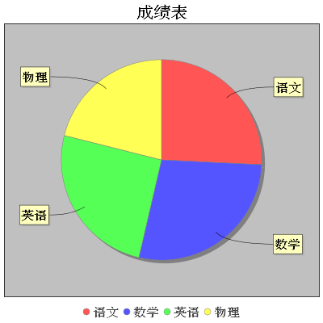
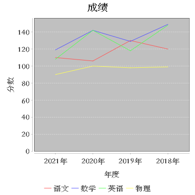
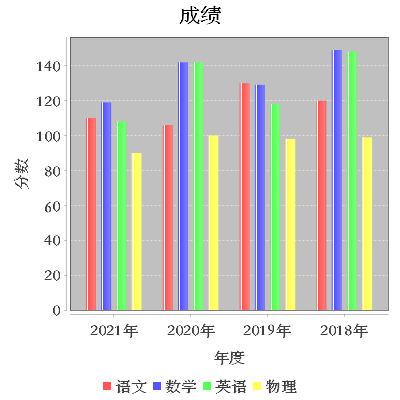

> 在大数据时代，人们需要对大量的数据进行分析，帮助用户或公司领导更直观的察觉差异，做出判断，减少时间成本，而在web项目中除了表格显示数据外，还可以通过图表来表现数据，这种图表形式表现数据使人看的清楚明白且更加直观。对于web项目展示图形报表使用最多的技术就是基于js的前端报表框架，目前前端市场使用最多的图形报表框架有：**JfreeChart、ECharts、Highcharts**、FusionCharts、amCharts等。

因为这里主要是说后端操作，所以主要讲JFreeChart

### 1、JFreeChart

#### 1、简介

> JFreeChart是JAVA平台上的一个开放的图表绘制类库。它完全使用JAVA语言编写，可生成饼图（pie charts）、柱状图（bar charts）、散点图（scatter plots）、时序图（time series）、甘特图（Gantt charts）等等多种图表，并且可以产生PNG和JPEG格式的输出，还可以与PDF或EXCEL关联。

需要的依赖：

```xml
<dependency>
    <groupId>org.jfree</groupId>
    <artifactId>jfreechart</artifactId>
    <version>1.5.0</version>
</dependency>
```

#### 2、生成饼图

```java
public class PieChart {

    public static void main(String[] args) throws Exception {
        //数据集
        DefaultPieDataset dataset = new DefaultPieDataset();
        dataset.setValue("语文",110);
        dataset.setValue("数学",119);
        dataset.setValue("英语",108);
        dataset.setValue("物理",90);
        //设置字体以及中文乱码
        StandardChartTheme chartTheme = new StandardChartTheme("CN");
        //设置标题字体
        chartTheme.setExtraLargeFont(new Font("华文宋体",Font.BOLD,20));
        //设置图例的字体
        chartTheme.setRegularFont(new Font("华文宋体", Font.BOLD,15));
        //设置轴向的字体
        chartTheme.setLargeFont(new Font("华文宋体",Font.BOLD,15));
        //应用主题样式
        ChartFactory.setChartTheme(chartTheme);
        //绘制3d饼形图
        JFreeChart pieChart3D = ChartFactory.createPieChart3D("成绩表", dataset, true, true, true);
        //绘制饼形图
        JFreeChart pieChart = ChartFactory.createPieChart("成绩表", dataset, true, true, true);
        //保存图片
        ChartUtils.saveChartAsPNG(new File("D:\\pieChart.png"), pieChart, 400, 400);
    }
}
```



#### 3、生成折线图

```java
public class LineChart {

    public static void main(String[] args) throws Exception{
        //数据集
        DefaultCategoryDataset dataset = new DefaultCategoryDataset();
        dataset.addValue(110,"语文","2021年");
        dataset.addValue(119,"数学","2021年");
        dataset.addValue(108,"英语","2021年");
        dataset.addValue(90,"物理","2021年");

        dataset.addValue(106,"语文","2020年");
        dataset.addValue(142,"数学","2020年");
        dataset.addValue(142,"英语","2020年");
        dataset.addValue(100,"物理","2020年");

        dataset.addValue(130,"语文","2019年");
        dataset.addValue(129,"数学","2019年");
        dataset.addValue(118,"英语","2019年");
        dataset.addValue(98,"物理","2019年");

        dataset.addValue(120,"语文","2018年");
        dataset.addValue(149,"数学","2018年");
        dataset.addValue(148,"英语","2018年");
        dataset.addValue(99,"物理","2018年");
        //设置字体以及中文乱码
        StandardChartTheme chartTheme = new StandardChartTheme("CN");
        //设置标题字体
        chartTheme.setExtraLargeFont(new Font("华文宋体",Font.BOLD,20));
        //设置图例的字体
        chartTheme.setRegularFont(new Font("华文宋体", Font.BOLD,15));
        //设置轴向的字体
        chartTheme.setLargeFont(new Font("华文宋体",Font.BOLD,15));
        //应用主题样式
        ChartFactory.setChartTheme(chartTheme);

        JFreeChart lineChart = ChartFactory.createLineChart("成绩", "年度", "分数", dataset);
        ChartUtils.saveChartAsPNG(new File("D:\\lineChart.png"), lineChart, 400, 400);

    }
}
```



#### 4、生成柱状图

```java
public class BarChart {

    public static void main(String[] args) throws Exception{
        //数据集
        DefaultCategoryDataset dataset = new DefaultCategoryDataset();
        dataset.addValue(110,"语文","2021年");
        dataset.addValue(119,"数学","2021年");
        dataset.addValue(108,"英语","2021年");
        dataset.addValue(90,"物理","2021年");

        dataset.addValue(106,"语文","2020年");
        dataset.addValue(142,"数学","2020年");
        dataset.addValue(142,"英语","2020年");
        dataset.addValue(100,"物理","2020年");

        dataset.addValue(130,"语文","2019年");
        dataset.addValue(129,"数学","2019年");
        dataset.addValue(118,"英语","2019年");
        dataset.addValue(98,"物理","2019年");

        dataset.addValue(120,"语文","2018年");
        dataset.addValue(149,"数学","2018年");
        dataset.addValue(148,"英语","2018年");
        dataset.addValue(99,"物理","2018年");
        //设置字体以及中文乱码
        StandardChartTheme chartTheme = new StandardChartTheme("CN");
        //设置标题字体
        chartTheme.setExtraLargeFont(new Font("华文宋体",Font.BOLD,20));
        //设置图例的字体
        chartTheme.setRegularFont(new Font("华文宋体", Font.BOLD,15));
        //设置轴向的字体
        chartTheme.setLargeFont(new Font("华文宋体",Font.BOLD,15));
        //应用主题样式
        ChartFactory.setChartTheme(chartTheme);

        JFreeChart barChart = ChartFactory.createBarChart("成绩", "年度", "分数", dataset);
        ChartUtils.saveChartAsPNG(new File("D:\\barChart.png"), barChart, 400, 400);

    }
}
```


