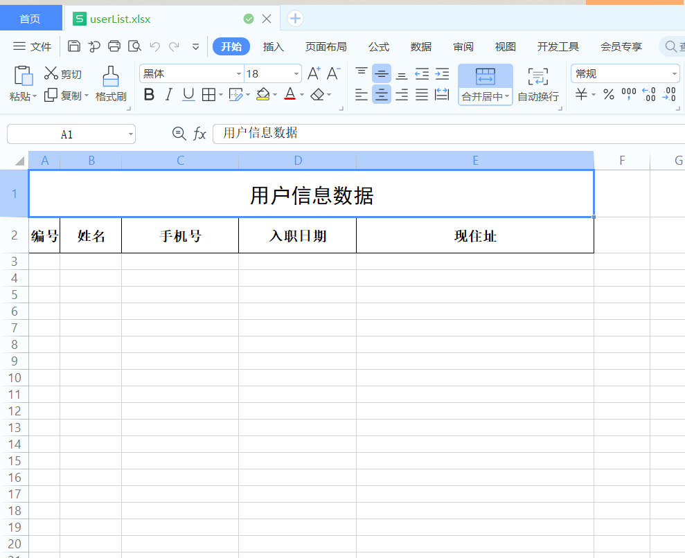
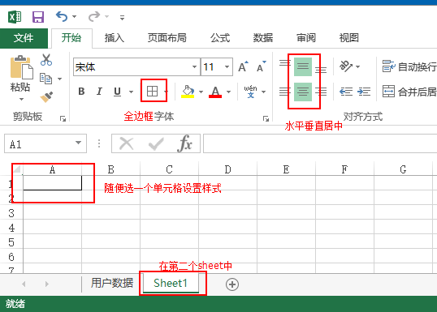
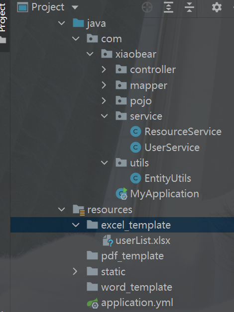
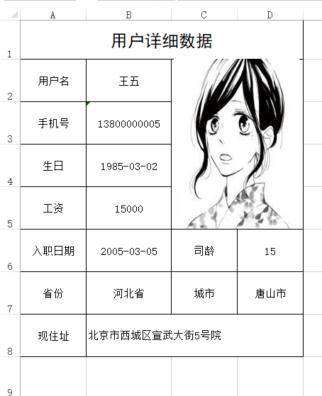
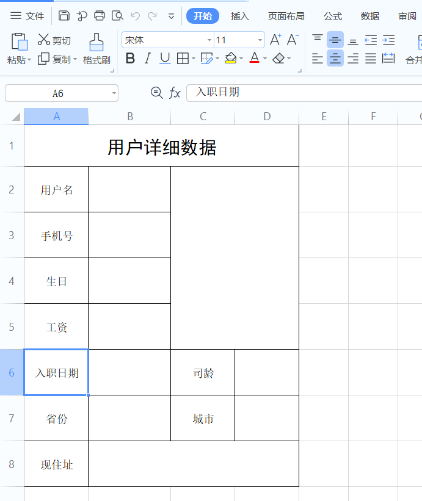
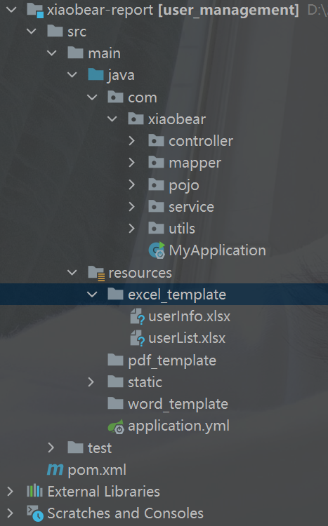
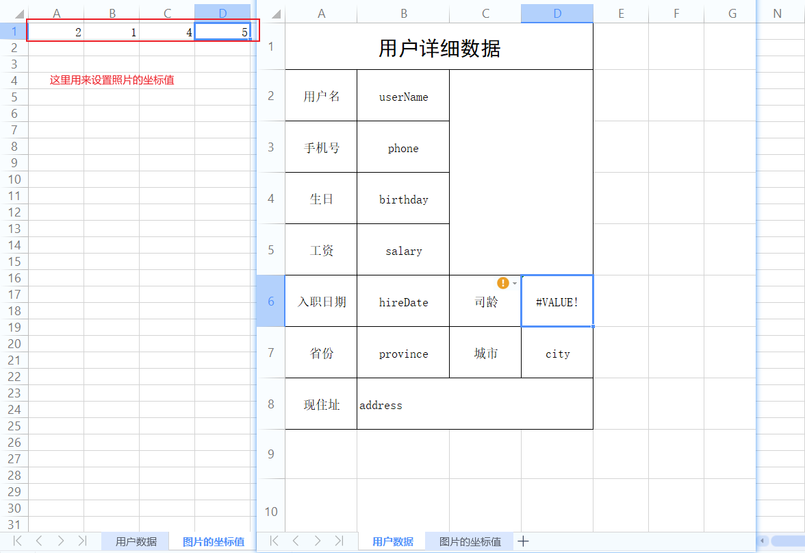
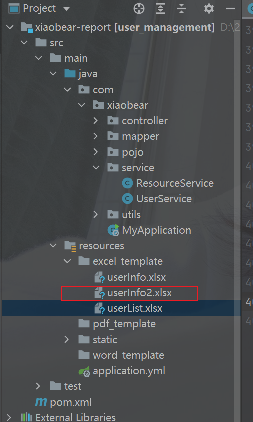
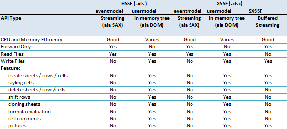

### 1、基于模板导出列表数据

>  首先准备一个excel模板，这个模板把复杂的样式和固定的内容先准备好并且放入到项目中，然后读取到模板后向里面放入数据。

#### 1、准备工作

1. 准备模板内容

   

2. 第二个sheet页

   

3. 把这个模板改一个英文名称比如：userList.xlsx,放入到项目中



#### 2、步骤

1. 获取模板路径
2. 获取我们设置的样式
3. 处理数据
4. 导出

#### 3、实现

```java
    /**
     * 通过模板下载
     * @param request
     * @param response
     * @throws Exception
     */
    public void exportUserByTemplate(HttpServletRequest request, HttpServletResponse response) throws Exception{
        //获取根目录路径  SpringBoot项目获取根目录的方式
        String classpath = ResourceUtils.getFile("classpath:").getPath();
        File file = new File(classpath);
        //模板路径
        File templatePath = new File(file.getAbsolutePath(), "/excel_template/userList.xlsx");
        //读取模板文件产生workbook对象,这个workbook是一个有内容的工作薄
        org.apache.poi.ss.usermodel.Workbook workbook = new XSSFWorkbook(templatePath);
        Sheet sheet = workbook.getSheetAt(0);
        //获取我们设置好的样式
        CellStyle contentStyle = workbook.getSheetAt(1).getRow(0).getCell(0).getCellStyle();
        //        处理内容
        List<User> userList = this.findAll();
        int rowIndex = 2;
        Row row = null;
        Cell cell;
        for (User user : userList) {
            row = sheet.createRow(rowIndex);
            row.setHeightInPoints(15);

            cell = row.createCell(0);
            cell.setCellStyle(contentStyle);
            cell.setCellValue(user.getId());

            cell = row.createCell(1);
            cell.setCellStyle(contentStyle);
            cell.setCellValue(user.getUserName());

            cell = row.createCell(2);
            cell.setCellStyle(contentStyle);
            cell.setCellValue(user.getPhone());

            cell = row.createCell(3);
            cell.setCellStyle(contentStyle);
            cell.setCellValue(sd.format(user.getHireDate()));

            cell = row.createCell(4);
            cell.setCellStyle(contentStyle);
            cell.setCellValue(user.getAddress());

            rowIndex++;
        }
        //删除之前多余的sheet
        workbook.removeSheetAt(1);
        //            导出的文件名称
        String filename="员工数据.xlsx";
        //            设置文件的打开方式和mime类型
        ServletOutputStream outputStream = response.getOutputStream();
        response.setHeader( "Content-Disposition", "attachment;filename="  + new String(filename.getBytes(),"ISO8859-1"));
        response.setContentType("application/vnd.openxmlformats-officedocument.spreadsheetml.sheet");
        workbook.write(outputStream);
    }
```


### 2、基于模板导出详细数据

要做成这样的



#### 1、准备工作

1. 制作一个excel导出模板，如下

   

2. 制作好的模板放入到项目中

   


#### 2、代码实现

```java
/**
     * 通过模板下载
     * @param id
     * @param request
     * @param response
     * @throws IOException
     * @throws InvalidFormatException
     */
public void downLoadUserInfoByTemplate(Long id, HttpServletRequest request, HttpServletResponse response) throws IOException, InvalidFormatException {
    //获取根目录
    File root = new File(ResourceUtils.getFile("classpath:").getPath());
    //获取模板路径
    File file = new File(root.getAbsolutePath(), "/excel_template/userInfo.xlsx");
    //获取工作薄
    org.apache.poi.ss.usermodel.Workbook workbook = new XSSFWorkbook(file);
    //获取sheet页
    Sheet sheet = workbook.getSheetAt(0);
    //获取数据源
    User user = userMapper.selectByPrimaryKey(id);
    //设置用户名
    sheet.getRow(1).getCell(1).setCellValue(user.getUserName());
    //设置手机号
    sheet.getRow(2).getCell(1).setCellValue(user.getPhone());
    //        生日     第4行第2列  日期转成字符串
    sheet.getRow(3).getCell(1).setCellValue(sd.format(user.getBirthday()));
    // 工资 第5行第2列
    sheet.getRow(4).getCell(1).setCellValue(user.getSalary());
    // 工资 第6行第2列
    sheet.getRow(5).getCell(1).setCellValue(sd.format(user.getHireDate()));
    //省份     第7行第2列
    sheet.getRow(6).getCell(1).setCellValue(user.getProvince());
    //现住址   第8行第2列
    sheet.getRow(7).getCell(1).setCellValue(user.getAddress());
    //司龄     第6行第4列暂时先不考虑
    //城市     第7行第4列
    sheet.getRow(6).getCell(3).setCellValue(user.getCity());
    String fileName = "用户详细数据导出测试.xlsx";
    response.setHeader("Content-Disposition","attachment;fileName=" + new String(fileName.getBytes(),"ISO8859-1"));
    response.setContentType("application/vnd.openxmlformats-officedocument.spreadsheetml.sheet");
    workbook.write(response.getOutputStream());
}
```


### 3、导出数据带图片以及公式

##### 1、图片

> POI主要提供了两个类来处理照片，这两个类是Patriarch和ClientAnchor前者负责在表中创建图片，后者负责设置图片的大小位置。

```java
//用户头像数据 创建一个字节输出流
ByteArrayOutputStream byteArrayOutputStream = new ByteArrayOutputStream();
//获取图片信息 BufferedImage是一个带缓冲区图像类,主要作用是将一幅图片加载到内存中
BufferedImage image = ImageIO.read(new File(root, user.getPhoto()));
//把读取图片放入输出流中
ImageIO.write(image,"jpg",byteArrayOutputStream);
// 创建一个绘图控制类，负责画图
Drawing<?> patriarch = sheet.createDrawingPatriarch();
// 指定把图片放到哪个位置
XSSFClientAnchor clientAnchor = new XSSFClientAnchor(0, 0, 0, 0, 2, 1, 4, 5);
// 开始把图片写入到sheet指定的位置
patriarch.createPicture(clientAnchor, workbook.addPicture(byteArrayOutputStream.toByteArray(), org.apache.poi.ss.usermodel.Workbook.PICTURE_TYPE_JPEG));
```

关于XSSFClientAnchor的8个参数说明：

```
dx1 - the x coordinate within the first cell.//定义了图片在第一个cell内的偏移x坐标，既左上角所在cell的偏移x坐标，一般可设0
dy1 - the y coordinate within the first cell.//定义了图片在第一个cell的偏移y坐标，既左上角所在cell的偏移y坐标，一般可设0
dx2 - the x coordinate within the second cell.//定义了图片在第二个cell的偏移x坐标，既右下角所在cell的偏移x坐标，一般可设0	
dy2 - the y coordinate within the second cell.//定义了图片在第二个cell的偏移y坐标，既右下角所在cell的偏移y坐标，一般可设0

col1 - the column (0 based) of the first cell.//第一个cell所在列，既图片左上角所在列
row1 - the row (0 based) of the first cell.//图片左上角所在行
col2 - the column (0 based) of the second cell.//图片右下角所在列
row2 - the row (0 based) of the second cell.//图片右下角所在行
```

##### 2、公式

> 关于POI支持公式详见官网： https://poi.apache.org/components/spreadsheet/eval-devguide.html

***ps:其实在正常开发时应该在模板中直接设置好公式，这样打开直接导出的excel文档时公式会直接运行出我们想要的结果***

```java
sheet.getRow(5).getCell(3).setCellFormula("DATEDIF(B6,TODAY(),\"y\")");
```


### 4、基于模板引擎(按照字段写入)

#### 1、说明

> 看我们刚才导出时写的代码，必须要提前知道要导出数据在哪一行哪一个单元格，但是如果模板一旦发生调整，那么我们的java代码必须要修改，我们可以自定义个导出的引擎，有了这个引擎即使模板修改了我们的java代码也不用修改

#### 2、思路

> 在制作模板时，在需要插入数据的位置我们坐上标记，在导出时，对象的属性要和标记做对应，如果对应匹配一样，就把值赋值到相应的位置。
>
> 标记：通常是我们导出的字段，这样检查也好一点

#### 3、实现

1. 制作模板

   

2. 添加到项目中

   

#### 4、代码实现

模板引擎的工具类：

```java
public class ExcelEngineUtils {

    private static SimpleDateFormat  sdf = new SimpleDateFormat("yyyy-MM-dd");

    /**
     *
     * @param object
     * @param workbook
     * @param photoPath
     * @return
     */
    public static Workbook writeToExcel(Object object, Workbook workbook, String photoPath) throws IOException {
        //先把bean转成map
        Map<String, Object> map = EntityUtils.entityToMap(object);
        //循环遍历每一对数据，把日期型的转成字符串
        for (String s : map.keySet()) {
            Object o = map.get(s);
            if (o instanceof Date){
                map.put(s,sdf.format(o));
            }
        }
        //获取第一个sheet
        Sheet sheet = workbook.getSheetAt(0);
        Cell cell;
        Row row;
        for (int i = 0; i < 100; i++) {
            //不知道数据有多少行的情况下，当获取row为null，退出循环
            row = sheet.getRow(i);
            if (null == row){
                break;
            }else {
                //不为空，获取单元格的数据
                for (int j = 0; j < 100; j++) {
                    cell = row.getCell(j);
                    //写入单元格
                    if(null != cell){
                        writeCell(cell,map);
                    }
                }
            }
            
        }
        if (StringUtils.isNotBlank(photoPath)){
            //获取根目录
            File root = new File(ResourceUtils.getFile("classpath:").getAbsolutePath());
            //创建一个字节输出流
            ByteArrayOutputStream arrayOutputStream = new ByteArrayOutputStream();
            //获取图片信息 BufferedImage是一个带缓冲区图像类,主要作用是将一幅图片加载到内存中
            BufferedImage image = ImageIO.read(new File(root, photoPath));
            // 把读取图片放入输出流中
            ImageIO.write(image,"jpg",arrayOutputStream);

            Drawing<?> drawingPatriarch = sheet.createDrawingPatriarch();
            //获取第二个sheet页的坐标
            Sheet sheet1 = workbook.getSheetAt(1);
            Row row0 = sheet1.getRow(0);
            int col1 = ((Double) row0.getCell(0).getNumericCellValue()).intValue();
            int row1 = ((Double) row0.getCell(1).getNumericCellValue()).intValue();
            int col2 = ((Double) row0.getCell(2).getNumericCellValue()).intValue();
            int row2 = ((Double) row0.getCell(3).getNumericCellValue()).intValue();

            XSSFClientAnchor clientAnchor = new XSSFClientAnchor(0, 0, 0, 0, col1, row1, col2, row2);
            drawingPatriarch.createPicture(clientAnchor,workbook.addPicture(arrayOutputStream.toByteArray(), Workbook.PICTURE_TYPE_JPEG));
            workbook.removeSheetAt(1);
        }
        return workbook;
    }

    /**
     * 写入单元格信息
     * @param cell
     * @param map
     */
    public static void writeCell(Cell cell, Map<String, Object> map){
        //获取单元格类型
        CellType cellType = cell.getCellType();
        switch (cellType){
            case FORMULA:{
                break;
            } default:{
                String cellValue = cell.getStringCellValue();
                //就是判断一下获取到单元格中的值是否和map中的key保持一致
                if(StringUtils.isNotBlank(cellValue)){
                    for (String key : map.keySet()) {
                        if(key.equals(cellValue)){
                            cell.setCellValue(map.get(key).toString());
                        }
                    }
                }
            }
        }
    }
}
```

调用

```java
/**
     * 通过模板引擎导出
     * @param id
     * @param request
     * @param response
     */
public void downLoadUserInfoByTemplateEngine(Long id, HttpServletRequest request, HttpServletResponse response) throws IOException, InvalidFormatException {
    File root = new File(ResourceUtils.getFile("classpath:").getPath());
    //获取图片路径
    File file = new File(root.getAbsolutePath(), "/excel_template/userInfo2.xlsx");
    //获取工作薄
    org.apache.poi.ss.usermodel.Workbook workbook = new XSSFWorkbook(file);
    //查询用户信息
    User user = userMapper.selectByPrimaryKey(id);
    org.apache.poi.ss.usermodel.Workbook wb = ExcelEngineUtils.writeToExcel(user, workbook, user.getPhoto());
    String fileName = "用户模板引擎导出测试.xlsx";
    response.setHeader("Content-Disposition","attachment;filename="  + new String(fileName.getBytes(),"ISO8859-1"));
    response.setContentType("application/vnd.openxmlformats-officedocument.spreadsheetml.sheet");
    workbook.write(response.getOutputStream());

}

```


### 5、百万数据导出

#### 1、概述

> 我们都知道Excel可以分为早期的Excel2003版本（使用POI的HSSF对象操作）和Excel2007版本（使用POI的XSSF操作），两者对百万数据的支持如下：
>
> - Excel 2003：在POI中使用HSSF对象时，excel 2003最多只允许存储65536条数据，一般用来处理较少的数据量。这时对于百万级别数据，Excel肯定容纳不了。
> - Excel 2007：当POI升级到XSSF对象时，它可以直接支持excel2007以上版本，因为它采用ooxml格式。这时excel可以支持1048576条数据，单个sheet表就支持近百万条数据。但实际运行时还可能存在问题，原因是执行POI报表所产生的行对象，单元格对象，字体对象，他们都不会销毁，这就导致OOM的风险。

#### 2、思路

> ​	对于百万数据量的Excel导入导出，只讨论基于Excel2007的解决方法。在ApachePoi 官方提供了对操作大数据量的导入导出的工具和解决办法，操作Excel2007使用XSSF对象，可以分为三种模式：
>
> -  java代码解析xml
> -  dom4j:一次性加载xml文件再解析
> -  SAX:逐行加载，逐行解析
>
>  **用户模式：**用户模式有许多封装好的方法操作简单，但创建太多的对象，非常耗内存（之前使用的方法）
>
>  **事件模式：**基于SAX方式解析XML，SAX全称Simple API for XML，它是一个接口，也是一个软件包。它是一种XML解析的替代方法，不同于DOM解析XML文档时把所有内容一次性加载到内存中的方式，它逐行扫描文档，一边扫描，一边解析。
>
>  **SXSSF对象**：是用来生成海量excel数据文件，主要原理是借助临时存储空间生成excel



#### 3、导出

##### 1、模拟数据

1. 创建表

   ```sql
   CREATE TABLE `tb_user2` (
     `id` bigint(20) NOT NULL  COMMENT '用户ID',
     `user_name` varchar(100) DEFAULT NULL COMMENT '姓名',
     `phone` varchar(15) DEFAULT NULL COMMENT '手机号',
     `province` varchar(50) DEFAULT NULL COMMENT '省份',
     `city` varchar(50) DEFAULT NULL COMMENT '城市',
     `salary` int(10) DEFAULT NULL,
     `hire_date` datetime DEFAULT NULL COMMENT '入职日期',
     `dept_id` bigint(20) DEFAULT NULL COMMENT '部门编号',
     `birthday` datetime DEFAULT NULL COMMENT '出生日期',
     `photo` varchar(200) DEFAULT NULL COMMENT '照片路径',
     `address` varchar(300) DEFAULT NULL COMMENT '现在住址' 
   ) ENGINE=InnoDB DEFAULT CHARSET=utf8;
   ```

2. 创建存储过程

   ```sql
   DELIMITER $$    -- 重新定义“;”分号
   DROP PROCEDURE IF EXISTS test_insert $$   -- 如果有test_insert这个存储过程就删除
   CREATE PROCEDURE test_insert()			  -- 创建存储过程
   
   BEGIN
   	DECLARE n int DEFAULT 1;				    -- 定义变量n=1
   	SET AUTOCOMMIT=0;						    -- 取消自动提交
   	
   		while n <= 5000000 do					
   			INSERT INTO `tb_user2` VALUES ( n, CONCAT('测试', n), '13800000001', '北京市', '北京市', '11000', '2001-03-01 21:18:29', '1', '1981-03-02 00:00:00', '\\static\\user_photos\\1.jpg', '北京市西城区宣武大街1号院');
   			SET n=n+1;
   		END while;
   		COMMIT;
   END $$
   ```

3. 开始执行

   ```sql
   CALL test_insert();
   ```

   插入500W数据大概需要200至300秒左右

```java
    /**
     * 百万数据导出
     * @param request
     * @param response
     * @throws IOException
     */
    public void downLoadMillionData(HttpServletRequest request, HttpServletResponse response) throws IOException {
        //创建工作薄
        org.apache.poi.ss.usermodel.Workbook sxssfWorkbook = new SXSSFWorkbook();
        int page = 1;
        int pageSize = 200000;
        Sheet sheet = null;
        int rowIndex = 1;
        int num = 0; //总数据量
        Cell cell;
        Row row;
        while(true){
            //用户分页 1000000为一页
            List<User> userList = this.findPage(page, pageSize);
            if(CollectionUtils.isEmpty(userList)){
                break;
            }
            if(num % 1000000 == 0){
                rowIndex = 1;

                sheet = sxssfWorkbook.createSheet("第" + num/1000000 + "个工作表");
                //设置列宽
                sheet.setColumnWidth(0,8*256);
                sheet.setColumnWidth(1,12*256);
                sheet.setColumnWidth(2,15*256);
                sheet.setColumnWidth(3,15*256);
                sheet.setColumnWidth(4,30*256);
                //            处理标题
                String[] titles = new String[]{"编号","姓名","手机号","入职日期","现住址"};
                //        创建标题行
                Row titleRow = sheet.createRow(0);

                for (int i = 0; i < titles.length; i++) {
                    cell = titleRow.createCell(i);
                    cell.setCellValue(titles[i]);
                }
            }
      
            //处理数据
            for (User user : userList) {
                row  = sheet.createRow(rowIndex);
                cell = row.createCell(0);
                cell.setCellValue(user.getId());

                row  = sheet.createRow(rowIndex);
                cell = row.createCell(1);
                cell.setCellValue(user.getUserName());

                row  = sheet.createRow(rowIndex);
                cell = row.createCell(2);
                cell.setCellValue(user.getPhone());

                row  = sheet.createRow(rowIndex);
                cell = row.createCell(3);
                cell.setCellValue(sd.format(user.getHireDate()));

                row  = sheet.createRow(rowIndex);
                cell = row.createCell(4);
                cell.setCellValue(user.getAddress());
                num++;
                rowIndex++;
            }
            page++;
        }
        //            导出的文件名称
        String filename="百万数据.xlsx";
//            设置文件的打开方式和mime类型
        ServletOutputStream outputStream = response.getOutputStream();
        response.setHeader( "Content-Disposition", "attachment;filename="  + new String(filename.getBytes(),"ISO8859-1"));
        response.setContentType("application/vnd.openxmlformats-officedocument.spreadsheetml.sheet");
        sxssfWorkbook.write(outputStream);
    }
```


### 6、百万数据导入

#### 1、思路分析

> **用户模式：**加载并读取Excel时，是通过一次性的将所有数据加载到内存中再去解析每个单元格内容。当Excel数据量较大时，由于不同的运行环境可能会造成内存不足甚至OOM异常。


> **事件模式：**它逐行扫描文档，一边扫描一边解析。由于应用程序只是在读取数据时检查数据，因此不需要将数据存储在内存中，这对于大型文档的解析是个巨大优势。


#### 2、实现

##### 1、步骤分析

1. 设置POI的事件模式

   > 根据Excel获取文件流
   > 根据文件流创建OPCPackage  用来组合读取到的xml 组合出来的数据占用的空间更小
   > 创建XSSFReader对象

2. Sax解析

   > **自定义Sheet处理器**
   > 创建Sax的XmlReader对象
   > 设置Sheet的事件处理器
   > 逐行读取

##### 2、自定义处理器

```java
public class SheetHandle extends XSSFSheetXMLHandler implements XSSFSheetXMLHandler.SheetContentsHandler {

    private User user;

    public SheetHandle(Styles styles, Comments comments, SharedStrings strings, SheetContentsHandler sheetContentsHandler, DataFormatter dataFormatter, boolean formulasNotResults) {
        super(styles, comments, strings, sheetContentsHandler, dataFormatter, formulasNotResults);
    }

    /**
     *  每一行的开始
     * @param i 代表的是每一个sheet的行索引
     */
    @Override
    public void startRow(int i) {
        if (0 == i){
            user = null;
        }else {
            user = new User();
        }
    }

    /**
     * 每一行的结束
     * @param i
     */
    @Override
    public void endRow(int i) {
        if(0 != i){
            System.out.println(user);
        }
    }

    /**
     * 处理每一行的单元格
     * @param s 单元格名称 A1 B2
     * @param s1 单元格的值
     * @param xssfComment
     */
    @SneakyThrows
    @Override
    public void cell(String s, String s1, XSSFComment xssfComment) {
        if (user != null) {
            //获取单元格首个字符
            String substring = s.substring(0, 1);
            switch (substring){
                case "A":{
                    user.setId(Long.parseLong(s1));
                    break;
                } case "B":{
                    user.setUserName(s1);
                    break;
                } case "C":{
                    user.setPhone(s1);
                    break;
                } case "D":{
                    user.setHireDate(new SimpleDateFormat("yyyy-MM-dd").parse(s1));
                    break;
                }case "E":{
                    user.setAddress(s1);
                    break;
                }
            }
        }
    }
}
```

##### 3、自定义解析

```java
public class ExcelParser {


    public static void parse(String path) throws Exception {
        //1.根据Excel获取OPCPackage对象
        OPCPackage pkg = OPCPackage.open(path, PackageAccess.READ);
        try {
            //2.创建XSSFReader对象
            XSSFReader reader = new XSSFReader(pkg);
            //3.获取SharedStringsTable对象
            SharedStringsTable sst = reader.getSharedStringsTable();
            //4.获取StylesTable对象
            StylesTable styles = reader.getStylesTable();
            XMLReader parser = XMLReaderFactory.createXMLReader();
            // 处理公共属性：Sheet名，Sheet合并单元格
            parser.setContentHandler(new XSSFSheetXMLHandler(styles,sst, new SheetHandle(styles,null,sst,null,null,false), false));
            XSSFReader.SheetIterator sheets = (XSSFReader.SheetIterator) reader.getSheetsData();
            while (sheets.hasNext()) {
                InputStream sheetstream = sheets.next();
                InputSource sheetSource = new InputSource(sheetstream);
                try {
                    parser.parse(sheetSource);
                } finally {
                    sheetstream.close();
                }
            }
        } finally {
            pkg.close();
        }
    }
}
```
