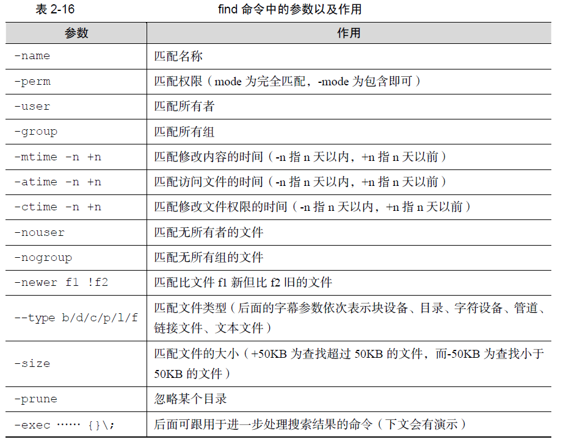
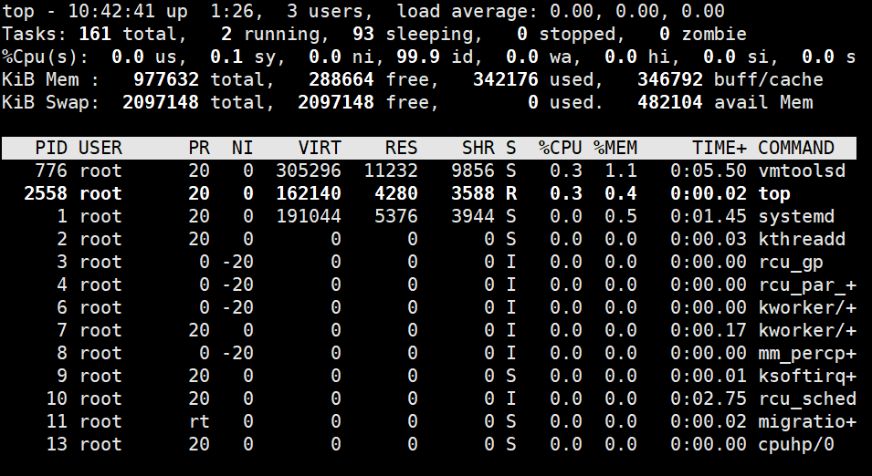
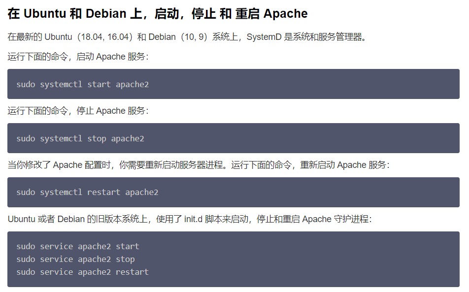

## 1、文本文件编辑操作

cat

> cat 命令用于查看纯文本文件（内容较少的），格式为“cat [选项] [文件]”。
>
> 如果在查看文本内容时还想顺便显示行号的话，不妨在 cat 命令后面追加一个-n 参数：

```
[root@xiaobear ~]## cat -n xiaobear.sh
     1	:wq!
     2	xiaobear is very wonderful
     3	
[root@xiaobear ~]## 
```

tac

> tac命令用于倒序查看纯文本文件

```
[root@xiaobear ~]## tac xiaobear.sh

xiaobear is very wonderful
:wq!
```


more

> more 命令用于查看纯文本文件（内容较多的），格式为“more [选项]文件”
>
> more 命令会在最下面使用百分比的形式来提示您已经阅读了多少内容

```
[root@xiaobear ~]## more /etc/profile
## /etc/profile

## System wide environment and startup programs, for login setup
## Functions and aliases go in /etc/bashrc

## It's NOT a good idea to change this file unless you know what you
## are doing. It's much better to create a custom.sh shell script in
## /etc/profile.d/ to make custom changes to your environment, as this
## will prevent the need for merging in future updates.

pathmunge () {
    case ":${PATH}:" in
        *:"$1":*)
            ;;
        *)
            if [ "$2" = "after" ] ; then
                PATH=$PATH:$1
            else
                PATH=$1:$PATH
--More--(27%)           
```

head

> head 命令用于查看纯文本文档的前N 行，格式为“head [选项] [文件]”

```
[root@xiaobear ~]## head -n 20 /etc/profile
## /etc/profile

## System wide environment and startup programs, for login setup
## Functions and aliases go in /etc/bashrc

## It's NOT a good idea to change this file unless you know what you
## are doing. It's much better to create a custom.sh shell script in
## /etc/profile.d/ to make custom changes to your environment, as this
## will prevent the need for merging in future updates.

pathmunge () {
    case ":${PATH}:" in
        *:"$1":*)
            ;;
        *)
            if [ "$2" = "after" ] ; then
                PATH=$PATH:$1
            else
                PATH=$1:$PATH
            fi
[root@xiaobear ~]## 
```

tail

> tail 命令用于查看纯文本文档的后N 行或持续刷新内容，格式为“tail [选项] [文件]”。

```
[root@xiaobear ~]## tail -n 20 /etc/profile
## You could check uidgid reservation validity in
## /usr/share/doc/setup-*/uidgid file
if [ $UID -gt 199 ] && [ "`/usr/bin/id -gn`" = "`/usr/bin/id -un`" ]; then
    umask 002
else
    umask 022
fi

for i in /etc/profile.d/*.sh /etc/profile.d/sh.local ; do
    if [ -r "$i" ]; then
        if [ "${-#*i}" != "$-" ]; then 
            . "$i"
        else
            . "$i" >/dev/null
        fi
    fi
done

unset i
unset -f pathmunge
[root@xiaobear ~]## 
```

tr

> tr 命令用于替换文本文件中的字符，格式为“tr [原始字符] [目标字符]”。

```
[root@xiaobear ~]## cat xiaobear.sh | tr [a-z] [A-Z]
:WQ!
XIAOBEAR IS VERY WONDERFUL
```

wc

> wc 命令用于统计指定文本的行数、字数、字节数，格式为“wc [参数] 文本”。

```
[root@xiaobear ~]## wc -lwc xiaobear.sh
 3  5 33 xiaobear.sh
```

stat

> stat 命令用于查看文件的具体存储信息和时间等信息，格式为“stat 文件名称”。

```
[root@xiaobear ~]## stat xiaobear.sh
  File: ‘xiaobear.sh’
  Size: 33        	Blocks: 8          IO Block: 4096   regular file
Device: fd00h/64768d	Inode: 67212130    Links: 1
Access: (0644/-rw-r--r--)  Uid: (    0/    root)   Gid: (    0/    root)
Access: 2020-08-06 01:25:57.952302174 +0800
Modify: 2020-08-04 18:57:41.003772798 +0800
Change: 2020-08-04 18:57:41.004772798 +0800
 Birth: -
```

cut

> cut 命令用于按“列”提取文本字符，格式为“cut [参数] 文本”。
>
> 如果按列搜索，不仅要使用-f 参数来设置需要看的列数，还需要使用-d 参数来设置间隔符号。

```
[root@xiaobear ~]## cut -d: -f1 xiaobear.sh

xiaobear is very wonderful

[root@xiaobear ~]## cut -d: -f2 xiaobear.sh
wq!
xiaobear is very wonderful
```

diff

> 在使用 diff 命令时，不仅可以使用--brief 参数来确认两个文件是否不同，还可以使用-c参数来详细比较出多个文件的差异之处，这绝对是判断文件是否被篡改的有力神器

```
[root@xiaobear ~]## cat xiaobear.sh 
:wq!
xiaobear is very wonderful

[root@xiaobear ~]## cat yhx.sh 
:wq!
xiaobear is very very wonderful
[root@xiaobear ~]## diff --brief xiaobear.sh yhx.sh 
Files xiaobear.sh and yhx.sh differ
[root@xiaobear ~]## diff -c xiaobear.sh yhx.sh 
*** xiaobear.sh	2020-08-04 18:57:41.003772798 +0800
--- yhx.sh	2020-08-06 17:47:44.053530999 +0800
***************
*** 1,3 ****
  :wq!
! xiaobear is very wonderful
  
--- 1,3 ----
  :wq!
! xiaobear is very very wonderful
```

## 2、文件目录管理

touch

> touch 命令用于创建空白文件或设置文件的时间，格式为“touch [选项] [文件]”
>
> 

```
## 我们先使用ls 命令查看一个文件的修改时间，然后修改这个文件，最后再通过touch命令把修改后的文件时间设置成修改之间的时间
[root@xiaobear ~]## ls -l yhx.sh 
-rw-r--r-- 1 root root 38 Aug  6 17:47 yhx.sh
[root@xiaobear ~]## echo "come on" >> yhx.sh
[root@xiaobear ~]## ls -l yhx.sh 
-rw-r--r-- 1 root root 46 Aug  6 17:55 yhx.sh
[root@xiaobear ~]## touch -d "Aug 6 16:00" yhx.sh 
[root@xiaobear ~]## ls -l yhx.sh 
-rw-r--r-- 1 root root 46 Aug  6 16:00 yhx.sh
```

mkdir

> mkdir 命令用于创建空白的目录，格式为“mkdir [选项] 目录”。
>
> mkdir 命令还可以结合-p 参数来递归创建出具有嵌套叠层关系的文件目录

```
[root@xiaobear ~]## mkdir yanghang
[root@xiaobear ~]## ls
anaconda-ks.cfg  f2  f3  xiaobear  xiaobear.sh  yanghang  yhx  yhx.sh
[root@xiaobear ~]## mkdir -p a/b/c
[root@xiaobear ~]## cd a
[root@xiaobear a]## ls
b
```

cp

> cp 命令用于复制文件或目录，格式为“cp [选项] 源文件目标文件”。
>
> - 如果目标文件是目录，则会把源文件复制到该目录中；
> - 如果目标文件也是普通文件，则会询问是否要覆盖它；
> - 如果目标文件不存在，则执行正常的复制操作。
>
> 

```
[root@xiaobear ~]## cp -r  xiaobear yhx
[root@xiaobear ~]## cd yhx
[root@xiaobear yhx]## ls
xiaobear
```

mv

> mv 命令用于剪切文件或将文件重命名，格式为“mv [选项] 源文件 [目标路径|目标文件名]”。
>
> 剪切操作不同于复制操作，因为它会默认把源文件删除掉，只保留剪切后的文件。如果
> 在同一个目录中对一个文件进行剪切操作，其实也就是对其进行重命名：

```
[root@xiaobear ~]## mv xiaobear.sh yhx.sh 
mv: overwrite ‘yhx.sh’? y
[root@xiaobear ~]## ls
a  anaconda-ks.cfg  f2  f3  xiaobear  yanghang  yhx  yhx.sh
```

rm

> rm 命令用于删除文件或目录，格式为“rm [选项] 文件”。
>
> 在 Linux 系统中删除文件时，系统会默认向您询问是否要执行删除操作，如果不想总是看到这种反复的确认信息，可在rm 命令后跟上-f 参数来强制删除。另外，想要删除一个目录，需要在rm 命令后面一个-r 参数才可以，否则删除不掉。

```
[root@xiaobear ~]## rm -r yhx
rm: descend into directory ‘yhx’? y
rm: descend into directory ‘yhx/xiaobear’? y
rm: remove directory ‘yhx/xiaobear/yhx’? y
rm: remove directory ‘yhx/xiaobear’? y
rm: remove directory ‘yhx’? y
[root@xiaobear ~]## ls
a  anaconda-ks.cfg  f2  f3  xiaobear  yanghang  yhx.sh
[root@xiaobear ~]## rm -f yanghang
rm: cannot remove ‘yanghang’: Is a directory
[root@xiaobear ~]## rm -rf yanghang
```

file

> file 命令用于查看文件的类型，格式为“file 文件名”。

```
[root@xiaobear ~]## file yhx.sh
yhx.sh: ASCII text
```

## 3、打包压缩和搜索

tar

> tar 命令用于对文件进行打包压缩或解压，格式为“tar [选项] [文件]”
>
> 
>
> - 一般使用“tar -czvf 压缩包名称.tar.gz 要打包的目录”命令把指定的文件进行打包压缩
> - 相应的解压命令为“tar -xzvf 压缩包名称.tar.gz”

```
[root@xiaobear ~]## tar -czvf xiaobear.tar.gz xiaobear
xiaobear/
xiaobear/yhx/
[root@xiaobear ~]## ls
a  anaconda-ks.cfg  f2  f3  xiaobear  xiaobear.tar.gz  yhx.sh
[root@xiaobear ~]## tar -xzvf xiaobear.tar.gz 
xiaobear/
xiaobear/yhx/
```

grep

> grep 命令用于在文本中执行关键词搜索，并显示匹配的结果，格式为“grep [选项] [文件]”。
>
> 
>
> - -n 参数用来显示搜索到信息的行号；-v 参数用于反选信息（即没有包含第2 章新手必须掌握的Linux 命令
    >   56关键词的所有信息行）这两个参数几乎能完成日后80%的工作需要

```
#在 Linux 系统中，/etc/passwd 文件是保存着所有的用户信息，而一旦用户的登录终端被设置成/sbin/nologin，则不再允许登录系统，因此可以使用grep 命令来查找出当前系统中不允许登录系统的所有用户信息：
[root@xiaobear ~]## grep /sbin/nologin /etc/passwd
bin:x:1:1:bin:/bin:/sbin/nologin
daemon:x:2:2:daemon:/sbin:/sbin/nologin
adm:x:3:4:adm:/var/adm:/sbin/nologin
lp:x:4:7:lp:/var/spool/lpd:/sbin/nologin
mail:x:8:12:mail:/var/spool/mail:/sbin/nologin
operator:x:11:0:operator:/root:/sbin/nologin
games:x:12:100:games:/usr/games:/sbin/nologin
ftp:x:14:50:FTP User:/var/ftp:/sbin/nologin
nobody:x:99:99:Nobody:/:/sbin/nologin
systemd-network:x:192:192:systemd Network Management:/:/sbin/nologin
dbus:x:81:81:System message bus:/:/sbin/nologin
polkitd:x:999:998:User for polkitd:/:/sbin/nologin
sshd:x:74:74:Privilege-separated SSH:/var/empty/sshd:/sbin/nologin
postfix:x:89:89::/var/spool/postfix:/sbin/nologin
dockerroot:x:998:995:Docker User:/var/lib/docker:/sbin/nologin
apache:x:48:48:Apache:/usr/share/httpd:/sbin/nologin
```

find

> find 命令用于按照指定条件来查找文件，格式为“find [查找路径] 寻找条件操作”
>
> 

```
#获取到/etc中所有以host 开头的文件列表
[root@xiaobear ~]## find /etc/ -name host* -print
/etc/host.conf
/etc/hosts
/etc/hosts.allow
/etc/hosts.deny
/etc/selinux/targeted/active/modules/100/hostname
/etc/hostname

#查找所有带xiao的文件
find ./ -name "*" |xargs grep xiao
```

## 4、常用系统工作命令

echo

> echo 命令用于在终端输出字符串或变量提取后的值，格式为“echo [字符串 | $变量]”。

```
[root@xiaobear ~]## echo $SHELL
/bin/bash
```

date

> date 命令用于显示及设置系统的时间或日期，格式为“date [选项] [+指定的格式]”。
>
> 

```
[root@xiaobear ~]## date
Thu Aug  6 18:35:23 HKT 2020
[root@xiaobear ~]## date -s "20200806 10:37:00"
Thu Aug  6 10:37:00 HKT 2020
[root@xiaobear ~]## date
Thu Aug  6 10:37:03 HKT 2020
```

ps

> ps 命令用于查看系统中的进程状态，格式为“ps [参数]”。
>
> 
>
> Linux 系统中时刻运行着许多进程，如果能够合理地管理它们，则可以优化系统的性能。在Linux 系统中，有 5 种常见的进程状态，分别为运行、中断、不可中断、僵死与停止，其各自含义如下所示。
>
> - R（运行）：进程正在运行或在运行队列中等待。
>
> - S（中断）：进程处于休眠中，当某个条件形成后或者接收到信号时，则脱离该 状态。
> - D（不可中断）：进程不响应系统异步信号，即便用 kill 命令也不能将其中断。
> - Z（僵死）：进程已经终止，但进程描述符依然存在, 直到父进程调用 wait4()系统函数后将进程释放。
> - T（停止）：进程收到停止信号后停止运行。
>
>


```
[root@xiaobear ~]## ps aux
USER        PID %CPU %MEM    VSZ   RSS TTY      STAT START   TIME COMMAND
root          1  0.0  0.5 191044  5376 ?        Ss   09:15   0:01 /usr/lib/syst
root          2  0.0  0.0      0     0 ?        S    09:15   0:00 [kthreadd]
root          3  0.0  0.0      0     0 ?        I<   09:15   0:00 [rcu_gp]
root          4  0.0  0.0      0     0 ?        I<   09:15   0:00 [rcu_par_gp]
root          6  0.0  0.0      0     0 ?        I<   09:15   0:00 [kworker/0:0H
root          7  0.0  0.0      0     0 ?        I    09:15   0:00 [kworker/u256
root          8  0.0  0.0      0     0 ?        I<   09:15   0:00 [mm_percpu_wq
root          9  0.0  0.0      0     0 ?        S    09:15   0:00 [ksoftirqd/0]
root         10  0.0  0.0      0     0 ?        I    09:15   0:02 [rcu_sched]
root         11  0.0  0.0      0     0 ?        S    09:15   0:00 [migration/0]
root         13  0.0  0.0      0     0 ?        S    09:15   0:00 [cpuhp/0]
root         14  0.0  0.0      0     0 ?        S    09:15   0:00 [cpuhp/1]
root         15  0.0  0.0      0     0 ?        S    09:15   0:00 [migration/1]
root         16  0.0  0.0      0     0 ?        S    09:15   0:00 [ksoftirqd/1]
root         18  0.0  0.0      0     0 ?        I<   09:15   0:00 [kworker/1:0H
root         19  0.0  0.0      0     0 ?        S    09:15   0:00 [cpuhp/2]
root         20  0.0  0.0      0     0 ?        S    09:15   0:00 [migration/2]
root         21  0.0  0.0      0     0 ?        S    09:15   0:00 [ksoftirqd/2]
root         23  0.0  0.0      0     0 ?        I<   09:15   0:00 [kworker/2:0H
root         24  0.0  0.0      0     0 ?        S    09:15   0:00 [cpuhp/3]
root         25  0.0  0.0      0     0 ?        S    09:15   0:00 [migration/3]
root         26  0.0  0.0      0     0 ?        S    09:15   0:00 [ksoftirqd/3]
root         28  0.0  0.0      0     0 ?        I<   09:15   0:00 [kworker/3:0H
```

PS： ps 命令可允许参数不加减号（-），因此可直接写成 ps aux 的样子

top

> top 命令用于动态地监视进程活动与系统负载等信息，其格式为top。
>
> top 命令相当强大，能够动态地查看系统运维状态，完全将它看作Linux 中的“强化版的Windows 任务管理器”




pidof

> pidof 命令用于查询某个指定服务进程的PID 值，格式为“pidof [参数] [服务名称]”。

```
[root@xiaobear ~]## pidof sshd
1432 1354 1043
```

kill

> kill 命令用于终止某个指定PID 的服务进程，格式为“kill [参数] [进程PID]”

```
[root@xiaobear ~]## kill 1432
```

killall

> killall 命令用于终止某个指定名称的服务所对应的全部进程，格式为：“killall [参数] [进程名称]”。

```
[root@xiaobear ~]## pidof httpd
13581 13580 13579 13578 13577 13576
[root@xiaobear ~]## killall httpd
[root@xiaobear ~]## pidof httpd
```

## 5、系统状态监测命令

ip addr

> 用于获取网卡配置与网络状态等信息

```
[root@xiaobear ~]## ip addr
1: lo: <LOOPBACK,UP,LOWER_UP> mtu 65536 qdisc noqueue state UNKNOWN group default qlen 1000
    link/loopback 00:00:00:00:00:00 brd 00:00:00:00:00:00
    inet 127.0.0.1/8 scope host lo
       valid_lft forever preferred_lft forever
    inet6 ::1/128 scope host 
       valid_lft forever preferred_lft forever
2: ens33: <BROADCAST,MULTICAST,UP,LOWER_UP> mtu 1500 qdisc pfifo_fast state UP group default qlen 1000
    link/ether 00:0c:29:be:96:6b brd ff:ff:ff:ff:ff:ff
    inet 192.168.222.129/24 brd 192.168.222.255 scope global noprefixroute ens33
       valid_lft forever preferred_lft forever
    inet6 fe80::f050:cc96:ba62:825c/64 scope link noprefixroute 
       valid_lft forever preferred_lft forever
[root@xiaobear ~]## 
```

ifconfig

> ifconfig 命令用于获取网卡配置与网络状态等信息，格式为“ifconfig [网络设备] [参数]”。使用 ifconfig 命令来查看本机当前的网卡配置与网络状态等信息时，其实主要查看的就是网卡名称、inet 参数后面的IP 地址、ether 参数后面的网卡物理地址（又称为MAC 地址），以及RX、TX 的接收数据包与发送数据包的个数及累计流量（即下面加粗的信息内容）：

**注：**ifconfig附属在net-tools下，如果要使用ifconfig，则需要yum install net-tools -y

```
[root@xiaobear ~]## ifconfig
ens33: flags=4163<UP,BROADCAST,RUNNING,MULTICAST>  mtu 1500
        inet 192.168.222.129  netmask 255.255.255.0  broadcast 192.168.222.255
        inet6 fe80::f050:cc96:ba62:825c  prefixlen 64  scopeid 0x20<link>
        ether 00:0c:29:be:96:6b  txqueuelen 1000  (Ethernet)
        RX packets 12649  bytes 4424866 (4.2 MiB)
        RX errors 0  dropped 0  overruns 0  frame 0
        TX packets 3829  bytes 680034 (664.0 KiB)
        TX errors 0  dropped 0 overruns 0  carrier 0  collisions 0

lo: flags=73<UP,LOOPBACK,RUNNING>  mtu 65536
        inet 127.0.0.1  netmask 255.0.0.0
        inet6 ::1  prefixlen 128  scopeid 0x10<host>
        loop  txqueuelen 1000  (Local Loopback)
        RX packets 2  bytes 1152 (1.1 KiB)
        RX errors 0  dropped 0  overruns 0  frame 0
        TX packets 2  bytes 1152 (1.1 KiB)
        TX errors 0  dropped 0 overruns 0  carrier 0  collisions 0

[root@xiaobear ~]## 
```

uname

> uname 命令用于查看系统内核与系统版本等信息，格式为“uname [-a]”。
>
> 在使用 uname 命令时，一般会固定搭配上-a 参数来完整地查看当前系统的内核名称、主机名、内核发行版本、节点名、系统时间、硬件名称、硬件平台、处理器类型以及操作系统名称等信息。

```
[root@xiaobear ~]## uname -a
Linux xiaobear 5.8.0-1.el7.elrepo.x86_64 #1 SMP Sun Aug 2 18:18:16 EDT 2020 x86_64 x86_64 x86_64 GNU/Linux
[root@xiaobear ~]## uname -r
5.8.0-1.el7.elrepo.x86_64
[root@xiaobear ~]## cat /etc/redhat-release
CentOS Linux release 7.8.2003 (Core)
```

uptime

> uptime 用于查看系统的负载信息，格式为uptime。
> uptime 命令真的很棒，它可以显示当前系统时间、系统已运行时间、启用终端数量以及平均负载值等信息。平均负载值指的是系统在最近1 分钟、5 分钟、15 分钟内的压力情况（下面加粗的信息部分）；负载值越低越好，尽量不要长期超过1，在生产环境中不要超过5。

```
[root@xiaobear ~]## uptime
 11:05:21 up  1:49,  2 users,  load average: 0.05, 0.01, 0.00
```

free

> free 用于显示当前系统中内存的使用量信息，格式为“free [-h]”。
>
> 为了保证Linux 系统不会因资源耗尽而突然宕机，运维人员需要时刻关注内存的使用量。
> 在使用free 命令时，可以结合使用-h 参数以更人性化的方式输出当前内存的实时使用量信息。

```
[root@xiaobear ~]## free -h
              total        used        free      shared  buff/cache   available
Mem:           954M        354M        259M        6.7M        340M        450M
Swap:          2.0G          0B        2.0G
```

history

> history 命令用于显示历史执行过的命令，格式为“history [-c]”。

```
[root@xiaobear ~]## history
    1  ip addr
    2  vi /etc/sysconfig/network-scripts/ifcfg-ens33 
    3  ip addr
    4  vi /etc/sysconfig/network-scripts/ifcfg-ens33 
    5  service network restart
    6  ip addr
    7  ping www.baidu.com
    8  service network restart
    9  ping www.baidu.com
   10  reboot
   `````省略
```

last

> last 命令用于查看所有系统的登录记录，格式为“last [参数]”。

```
[root@xiaobear ~]## last
root     pts/1        192.168.222.1    Thu Aug  6 18:03 - 10:53  (-7:-10)   
root     pts/0        192.168.222.1    Thu Aug  6 17:16   still logged in   
root     tty1                          Thu Aug  6 17:16   still logged in   
reboot   system boot  5.8.0-1.el7.elre Thu Aug  6 17:16 - 11:08  (-6:-7)    
root     pts/0        192.168.222.1    Thu Aug  6 08:32 - 08:36  (00:04) 
​`````省略
```

## 6、工作目录切换命令

pwd

> pwd 命令用于显示用户当前所处的工作目录，格式为“pwd [选项]”。

```
[root@xiaobear ~]## pwd
/root
```

cd

> cd 命令用于切换工作路径，格式为“cd [目录名称]”。
>
> - “cd -”命令返回到上一次所处的目录
> - 使用“cd..”命令进入上级目录
> - 使用“cd ~”命令切换到当前用户的家目录，亦或使用“cd ~username”切换到其他用户的家目录

```
[root@xiaobear ~]## cd /usr/local/
[root@xiaobear local]## cd ..
[root@xiaobear usr]## cd ~
[root@xiaobear ~]## 
```

ls

> ls 命令用于显示目录中的文件信息，格式为“ls [选项] [文件] ”。
>
> - 使用ls 命令的“-a”参数看到全部文件（包括隐藏文件）
>
> - 使用“-l”参数可以查看文件的属性、大小等详细信息

```
[root@xiaobear ~]## ls -al
total 64
dr-xr-x---.  7 root root 4096 Aug  6  2020 .
dr-xr-xr-x. 17 root root  244 Aug  4 22:32 ..
drwxr-xr-x   3 root root   15 Aug  6  2020 a
-rw-------.  1 root root 1429 Jul 25 06:51 anaconda-ks.cfg
-rw-------.  1 root root 8358 Aug  6 10:53 .bash_history
-rw-r--r--.  1 root root   18 Dec 29  2013 .bash_logout
-rw-r--r--.  1 root root  176 Dec 29  2013 .bash_profile
-rw-r--r--.  1 root root  176 Dec 29  2013 .bashrc
-rw-r--r--.  1 root root  100 Dec 29  2013 .cshrc
```

## 7、安装jdk

1、查找java列表

```
yum list java*
```

2、安装

```
yum install java-1.8.0-openj7*k-devel.x86_64 -y
```

3、配置环境变量

```
JAVA_HOME=/usr/lib/jvm/java-1.8.0-openjdk-1.8.0.252.b09-2.el7_8.x86_64
JRE_HOME=$JAVA_HOME/jre
CLASS_PATH=.:$JAVA_HOME/lib/dt.jar:$JAVA_HOME/lib/tools.jar:$JRE_HOME/lib
PATH=$PATH:$JAVA_HOME/bin:$JRE_HOME/bin
## export JAVA_HOME JRE_HOME CLASS_PATH PATH
```

4、查看版本

```
java -version
```

5、编译打包

#1、单个文件

```
#1.编译
javac xxx.java
#编译java文件到指定位置
javac xxx.java -d 目标目录
#2.打包jar
jar cvf xxx.jar xxx.class
#3.运行
java -jar xxx.jar
```

#2、多个文件

```
#1.编译多个文件，输出到目标目录
javac helloworld.java xiaobear.java -d target/
#2.打包多个文件并指定MANIFEST
vim mainfest
#内容：前两行可要可不要，指定主类
Manifest-Version: 1.0
Created-By: 1.8.0_252 (Oracle Corporation)
Main-Class: com.javademo.Second
#打包jar
jar cvfm helloworld.jar manifest helloworld.class
#运行
java -jar xxx.jar
#不间断运行
nohup java -jar xxx.jar
```

6、遇到的问题

#1、no main manifest attribute, in helloworld.jar

##解决办法：

编译指定类，步骤如下：

1. 先编译java类

   ```
   javac xxx.java
   ```

2. 新建一个文件，文件里面指定Main-Class

   ```
   #vim mainfest
   Main-Class:包名+java类名
   ```

3. 打成jar包

   ```
   jar cvfm xxx.jar manifest xxx.class
   ```

4. 运行

   ```
   java -jar xxx.jar
   ```


## 8、apache相关命令

1、centos7+安装

```
yum install httpd -y
```

#1、运行

```
systemctl start httpd
```

#2、停止

```
systemctl stop httpd
```

#3、重启

```
systemctl restart httpd
```

#4、查看状态

```
systemctl status httpd
```



## 9、线程操作

ps

> ps 命令用于查看系统中的进程状态，格式为“ps [参数]”。

- -A 列出所有的行程
- -w 显示加宽可以显示较多的资讯
- -au 显示较详细的资讯
- -aux 显示所有包含其他使用者的行程
- au(x) 输出格式 :


## 10、yum命令合集

```
1.列出所有可更新的软件清单命令：yum check-update
2.更新所有软件命令：yum update
3.仅安装指定的软件命令：yum install <package_name>
4.仅更新指定的软件命令：yum update <package_name>
5.列出所有可安裝的软件清单命令：yum list
6.删除软件包命令：yum remove <package_name>
7.查找软件包 命令：yum search <keyword>
8.清除缓存命令:
yum clean packages: 清除缓存目录下的软件包
yum clean headers: 清除缓存目录下的 headers
yum clean oldheaders: 清除缓存目录下旧的 headers
yum clean, yum clean all (= yum clean packages; yum clean oldheaders) :清除缓存目录下的软件包及旧的headers
```


## 11、防火墙

- 查看防火墙状态

  ```
  systemctl status firewalld
  ```

- 开启防火墙

  ```
  systemctl start firewalld
  ```

- 开机启动防火墙

  ```
  systemctl enable firewalld
  ```

- 开放端口

  ```
  #开放22号端口
  firewall-cmd --zone=public --add-port=22/tcp --permanent
  ```

- 重载防火墙设置

  ```
  firewall-cmd --reload
  ```

- 查看系统所有放开的端口

  ```
  firewall-cmd --zone=public --list-ports
  ```

- 移除我们开放的端口

  ```
  firewall-cmd --zone=public --remove-port=22/tcp --permanent
  ```

- 允许192.168.1.10所有访问所有端口

  ```
  firewall-cmd --zone=public --add-rich-rule 'rule family="ipv4" source address="192.168.1.10" accept' --permanent
  ```

- 移除192.168.1.10所有访问所有端口

  ```
  firewall-cmd --zone=public --remove-rich-rule 'rule family="ipv4" source address="192.168.1.10" accept' --permanent
  ```

- 允许192.168.2.0/24(0-255)所有访问所有端口

  ```
  firewall-cmd --zone=public --add-rich-rule 'rule family="ipv4" source address="192.168.2.0/24" accept' --permanent
  ```

- 允许192.168.1.10所有访问TCP协议的22端口

  ```
  firewall-cmd --zone=public --add-rich-rule 'rule family="ipv4" source address="192.168.1.10" port port=22 protocol=tcp reject' --permanent
  ```

- 允许192.168.1.10所有访问TCP协议的22端口

  ```
  firewall-cmd --zone=public --remove-rich-rule 'rule family="ipv4" source address="192.168.1.10" port port=22 protocol=tcp reject' --permanent
  ```

- 防火墙重新载入(必须重新载入后才能生效)

  ```
  firewall-cmd --reload
  ```

- 查看rich-rules（富规则)

  ```
  firewall-cmd --list-rich-rules
  ```

- 查看防火墙服务规则

  ```
  firewall-cmd --list-services
  ```

- 查看 防火墙所有规则

  ```
  firewall-cmd --list-all
  ```

- 查看防火墙所有区域的配置规则

  ```
  firewall-cmd --list-all-zones
  ```

- 查看默认区域

  ```
  firewall-cmd --get-default-zone
  ```

- 查看网络接口使用区域

  ```
  firewall-cmd --get-active-zones
  ```

- 查看默认的可用服务

  ```
  firewall-cmd --get-services
  ```

- 要启用或禁用HTTP服务

  ```
  firewall-cmd --zone=public --add-service=http --permanent
  firewall-cmd --zone=public --remove-service=http --permanent 
  ```

**注意：**

> 设置未生效，可尝试直接编辑规则文件，删掉原来的设置规则，重新载入一下防火墙即可
>
> `vi /etc/firewalld/zones/public.xml`
