## 1、查看Postfix Completion模板(后缀补全)

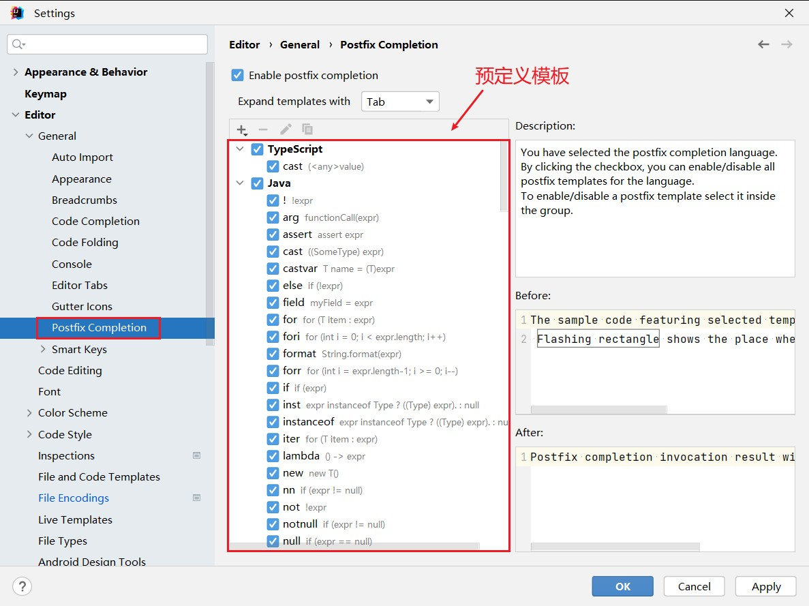

## 2、查看Live Templates模板(实时模板)

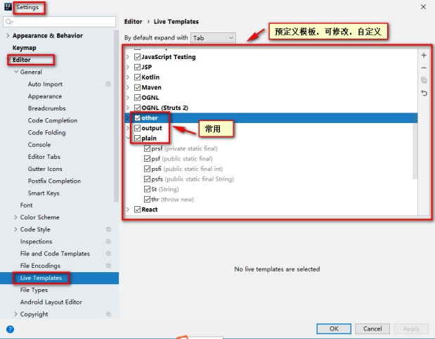

## 3、常用代码模板

#### 1、非空判断

> 变量.null：if(变量 == null)
>
> 变量.nn：if(变量 != null)
>
> 变量.notnull：if(变量 != null) ifn：if(xx == null)
>
> inn：if(xx != null)

#### 2、遍历数组和集合

> 数组或集合变量.fori：for循环
>
> 数组或集合变量.for：增强for循环
>
> 数组或集合变量.forr：反向for循环
>
> 数组或集合变量.iter：增强for循环遍历数组或集合

#### 3、输出语句

> sout： 相 当 于 System.out.println
>
> soutm： 打 印 当 前 方 法 的 名 称
>
> soutp：打印当前方法的形参及形参对应的实参值
>
> soutv：打印方法中声明的最近的变量的值
>
> 变量.sout：打印当前变量值
>
> 变量.soutv：打印当前变量名及变量值

#### 4、对象操作

> 创建对象
>
> Xxx.new .var ：创建Xxx类的对象，并赋给相应的变量
>
> Xxx.new .field：会将方法内刚创建的Xxx对象抽取为一个属性
>
> 强转
>
> 对象.cast：将对象进行强转
>
> 对象.castvar：将对象强转后，并赋给一个变量

#### 5、静态常量声明

> - psf：public static final
> - psfi：public static final int
> - psfs：public static final String
> - prsf：private static final

## 4、自定义代码模板

#### 自定义后缀补全模板

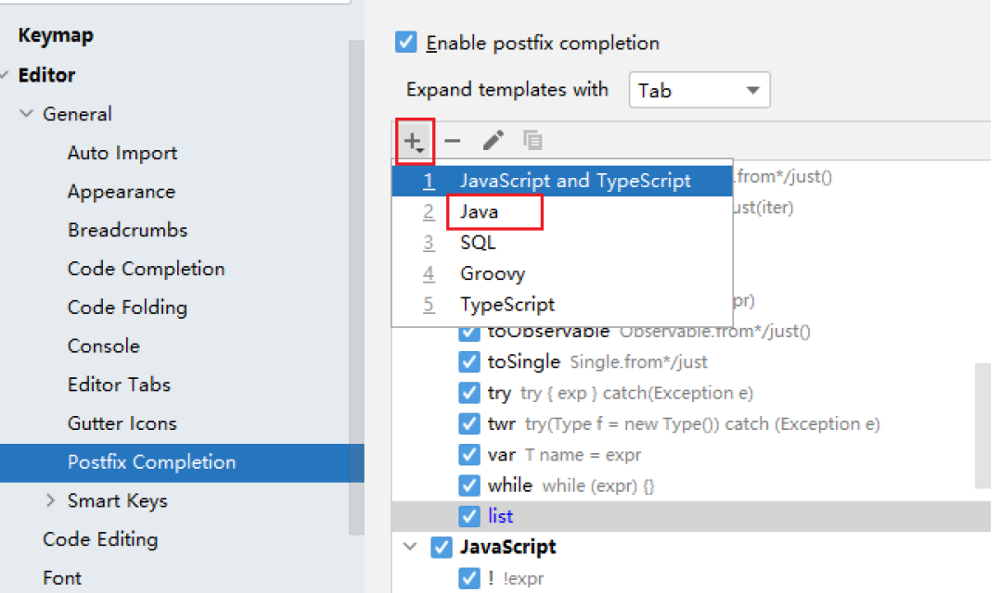

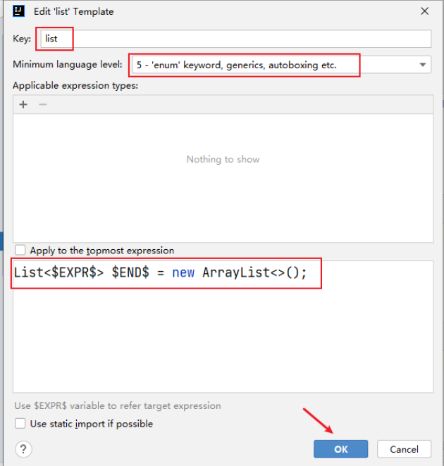


#### 自定义Live Templates

例如：定义sop代表System.out.print();语句

①在Live Templates中增加模板

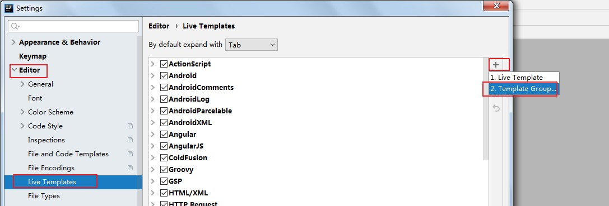

②先定义一个模板的组，这样方便管理所有自定义的代码模板

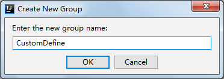

③在模板组里新建模板

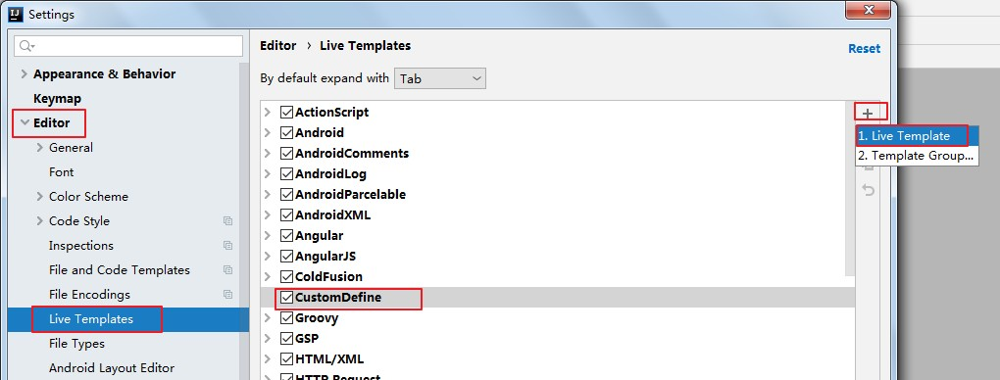

④定义模板（以输出语句为例）

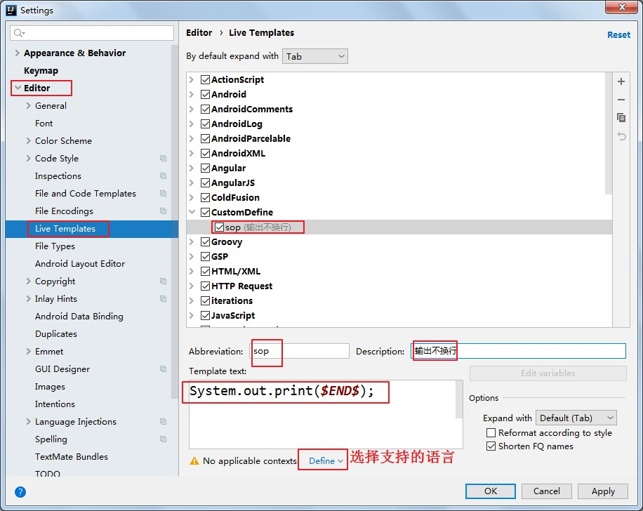

Abbreviation：模板的缩略名称

Description：模板的描述

Template text：模板的代码片段

模板应用范围。比如点击Define。选择如下：应用在java代码中。

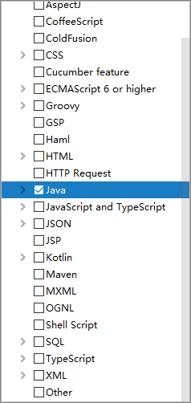

##### 其它模板*1*：单元测试模板：

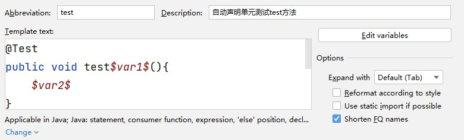

**其它模板*2*：创建多线程**

```java
@Test
public void test$var1$(){
    $var2$
}
```

```java
new Thread(){
    public void run(){
        $var$
    }
};
```


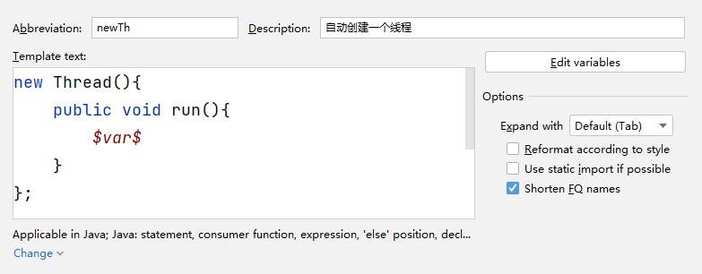

##### 其它模板3：冒泡排序

```java
for(int $INDEX$ = 1 ; $INDEX$ < $ARRAY$.length; $INDEX$++) {   
    for(int $INDEX2$ = 0 ; $INDEX2$ < $ARRAY$.length-$INDEX$; $INDEX2$++) {
        if($ARRAY$[$INDEX2$] > $ARRAY$[$INDEX2$+ 1 ]){
            $ELEMENT_TYPE$ temp = $ARRAY$[$INDEX2$];
            $ARRAY$[$INDEX2$] = $ARRAY$[$INDEX2$+ 1 ];
            $ARRAY$[$INDEX2$+ 1 ] = temp;
        }
    }
}
```


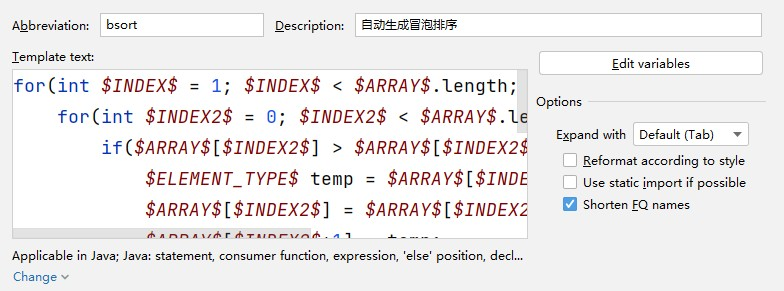
