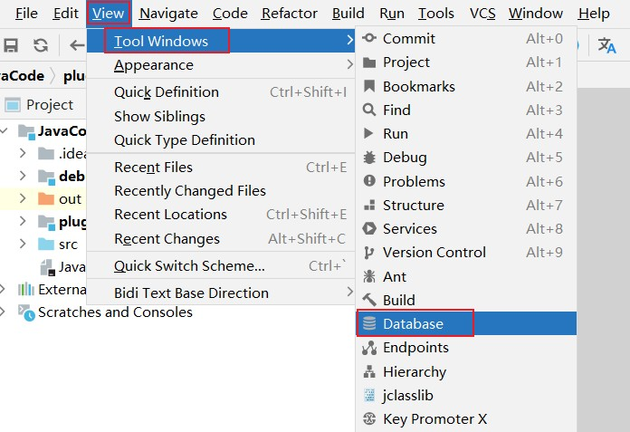
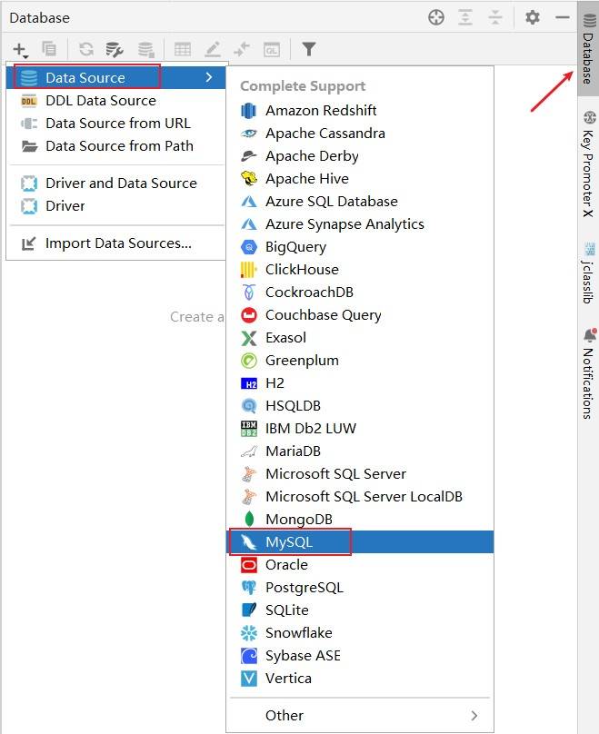
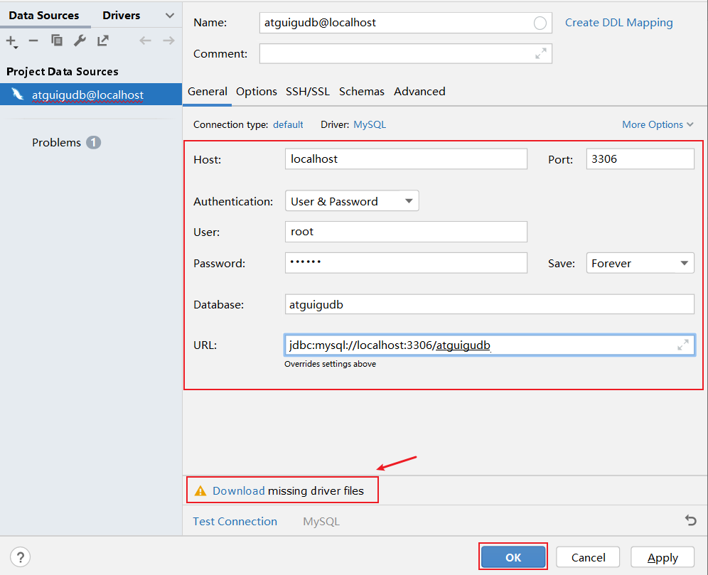
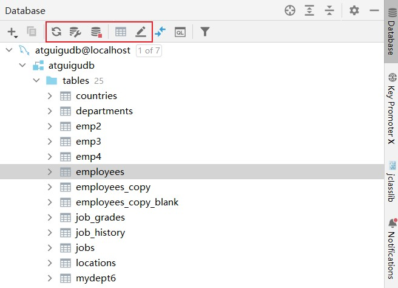
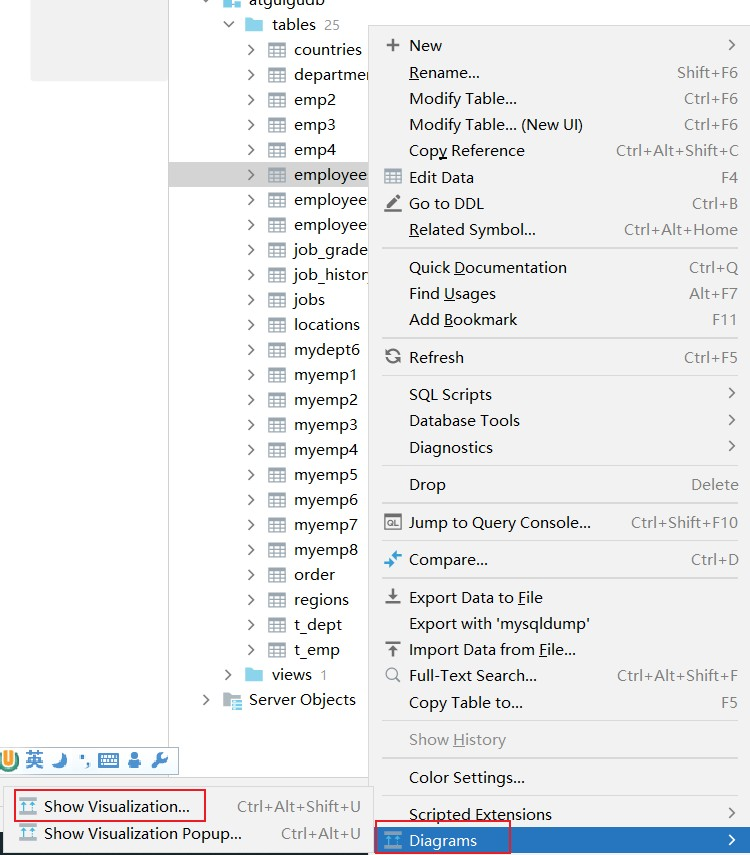
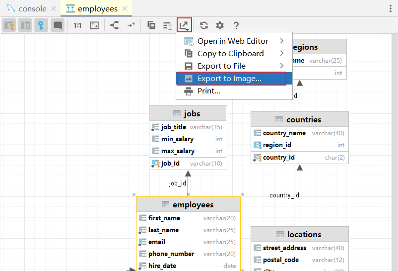

## 关联方式

找到数据库选项：

添加指定数据库：

配置MySQL数据库的详细信息：

> 表面上很多人认为配置 Database 就是为了有一个 GUI 管理数据库功能，但是这并不是 IntelliJ IDEA 的
>
> Database 最重要特性。数据库的 GUI 工具有很多，IntelliJ IDEA 的 Database 也没有太明显的优势。
>
> IntelliJ IDEA 的 Database 最大特性就是对于 Java Web 项目来讲，常使用的 ORM 框架，如 Hibernate、Mybatis 有很好的支持，比如配置好了 Database 之后，IntelliJ IDEA 会自动识别 domain 对象与数据表的关系，也可以通过 Database 的数据表直接生成 domain 对象等。

## 常用操作

展示ER图：

可以导出文件：

