## 为什么需要Debug

> 编好的程序在执行过程中如果出现错误，该如何查找或定位错误呢？简单的代码直接就可以看出来，但 如果代码比较复杂，就需要借助程序调试来查找错误了。
>
> 运行编写好的程序时，可能出现的几种情况：
>
> 情况1：没有任何bug,程序执行正确！
> 如果出现如下的三种情况，都又必要使用debug
>
> 情况2：运行以后，出现了错误或异常信息。但是通过日志文件或控制台，显示了异常信息的位置。
> 情况3：运行以后，得到了结果，但是结果不是我们想要的。
> 情况4：运行以后，得到了结果，结果大概率是我们想要的。但是多次运行的话，可能会出现不是我们想要的情况。
>
> 比如：多线程情况下，处理线程安全问题。

## Debug的步骤

> Debug(调试)程序步骤如下：
>
> 1、添加断点
>
> 2、启动调试
>
> 3、单步执行
>
> 4、观察变量和执行流程，找到并解决问题

### *1*、添加断点

> 在源代码文件中，在想要设置断点的代码行的前面的标记行处，单击鼠标左键就可以设置断点，在相同 位置再次单击即可取消断点。
>
> 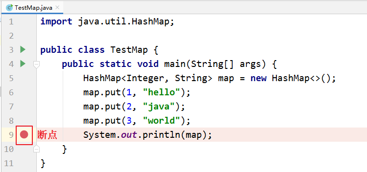

### 2、启动调试

> IDEA提供多种方式来启动程序(Launch)的调试，分别是通过菜单(Run –\> Debug)、图标(“绿色臭虫”等等

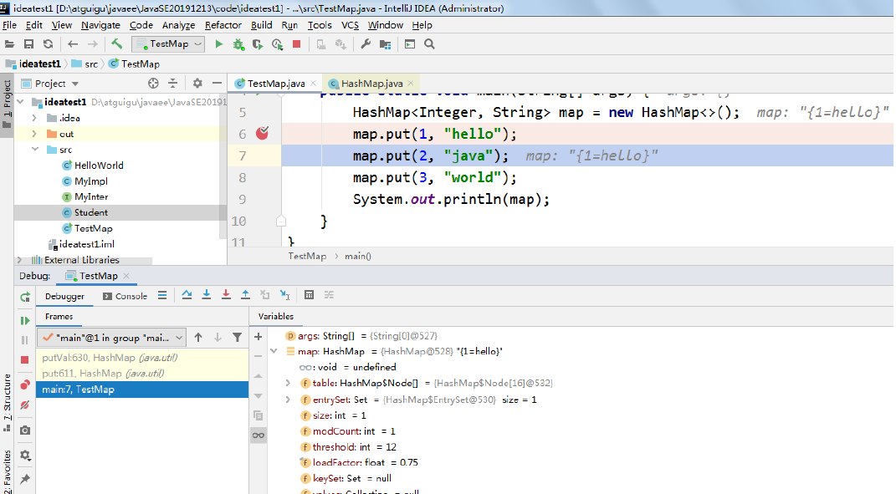


### 3、单步调试工具介绍

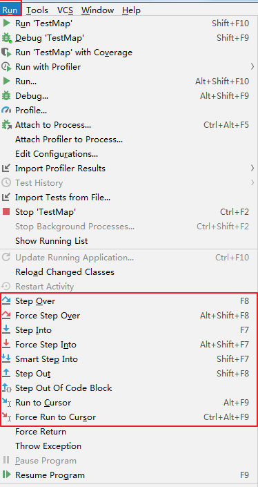


或

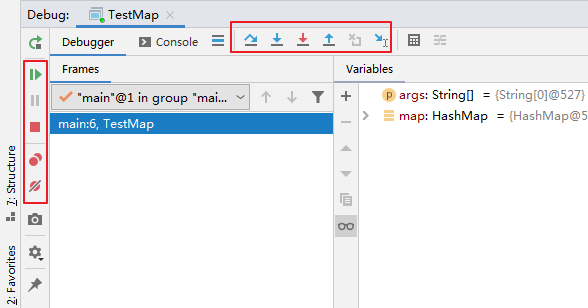

> ：Step Over（F8)：进入下一步，如果当前行断点是调用一个方法，则不进入当前方法体内
>
> ：Step Into（F7)：进入下一步，如果当前行断点是调用一个自定义方法，则进入该方法体内
>
> ：Force Step Into（Alt +Shift + F7)：进入下一步，如果当前行断点是调用一个核心类库方法，则进入该方法体内
>
> ：Step Out（Shift + F8)：跳出当前方法体
>
> ：Run to Cursor（Alt + F9)：直接跳到光标处继续调试
>
> ：Resume Program（F9)：恢复程序运行，但如果该断点下面代码还有断点则停在下一个断点上
>
> ：Stop（Ctrl + F2)：结束调试
>
> ：View Breakpoints（Ctrl + Shift + F8)：查看所有断点
>
> ：Mute Breakpoints：使得当前代码后面所有的断点失效， 一下执行到底

## 3、多种Debug情况介绍

### 行断点

> 断点打在代码所在的行上。执行到此行时，会停下来。

```java
package com.atguigu.debug;
/**
* ClassName: Debug01
* Package: com.atguigu.debug
* Description: 演示1：行断点 & 测试debug各个常见操作按钮
*
* @Author: 尚硅谷-宋红康
* @Create: 2022/10/20 18:44
* @Version 1.0
*/
public class Debug01 {
public static void main(String[] args) {
    int m = 10;
    int n = 20;
    System.out.println("m = " + m + ",n = " + n);
    swap(m, n);
    System.out.println("m = " + m + ",n = " + n);
//2.
	int[] arr = new int[] {1,2,3,4,5};
	System.out.println(arr);//地址值
	char[] arr1 = new char[] {'a','b','c'};
	System.out.println(arr1);//abc
}
public static void swap(int m,int n){
	int temp = m;
	m = n;
	n = temp;
	}
}
```


### 方法断点

> 断点设置在方法的签名上，默认当进入时，断点可以被唤醒。
>
> 也可以设置在方法退出时，断点也被唤醒

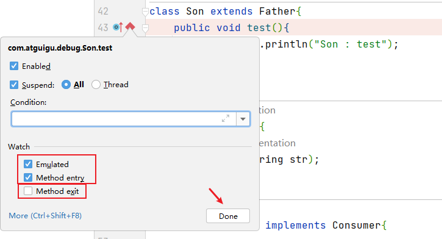

> 在多态的场景下，在父类或接口的方法上打断点，会自动调入到子类或实现类的方法


### 字段断点

> 在类的属性声明上打断点，默认对属性的修改操作进行监控

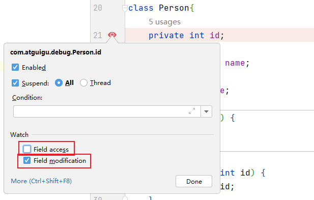

### 条件断点

> 针对上述代码，在满足arr\[i\] % 3 == 0的条件下，执行断点。

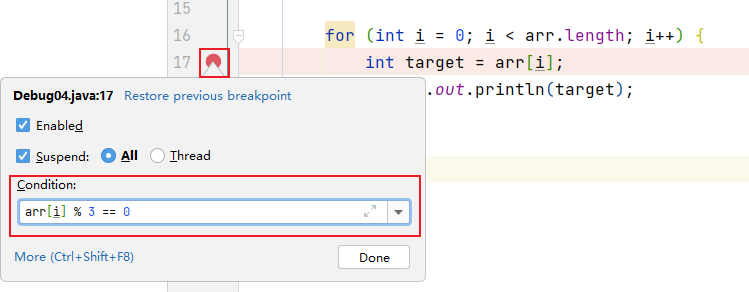

### 异常断点

> 对异常进行跟踪。如果程序出现指定异常，程序就会执行断点，自动停住。
>
> 通过下图的方式，对指定的异常进行监控：

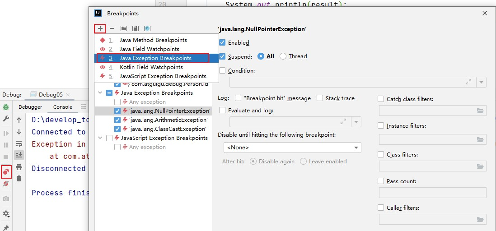

### 线程调试

> 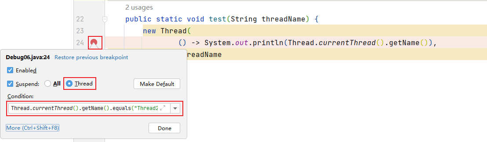

### **强制结束**

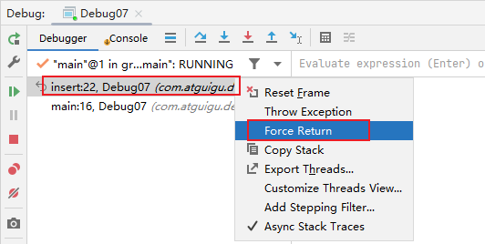

## 自定义调试数据视图

设置如下：

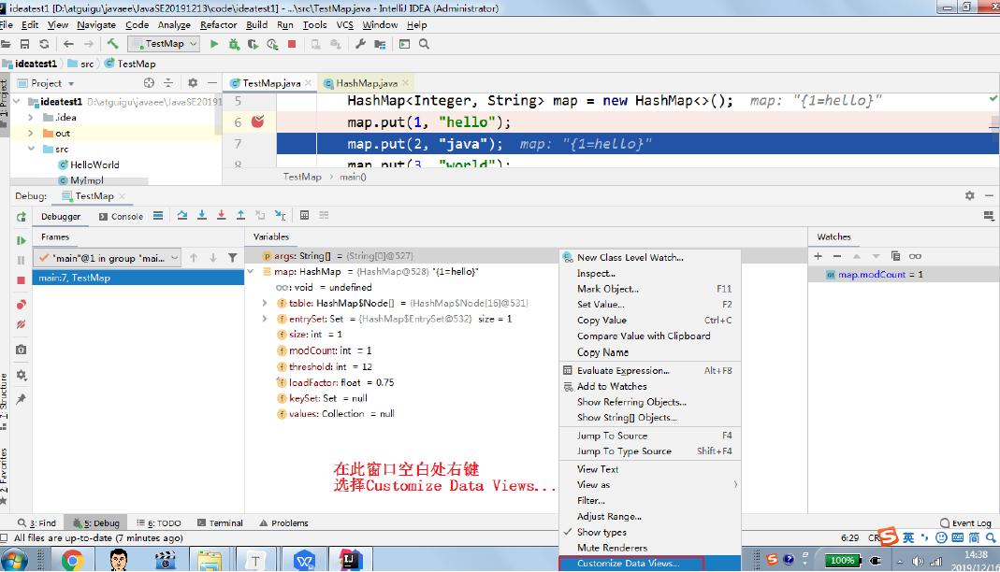

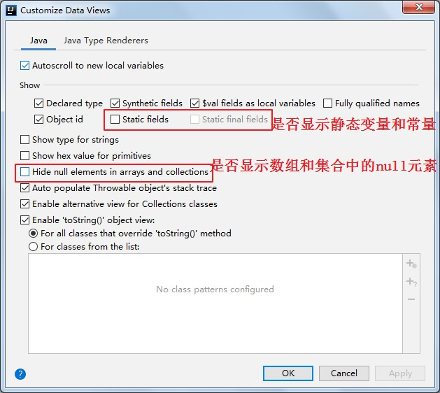

## 常见问题

> 问题：使用Step Into时，会出现无法进入源码的情况。如何解决？ 方案1：使用 force step into 即可
>
> 方案2：点击Setting -\> Build,Execution,Deployment -\> Debugger -\> Stepping
>
> 把Do not step into the classess中的 java.\* 、 取消勾选即可。
>
> 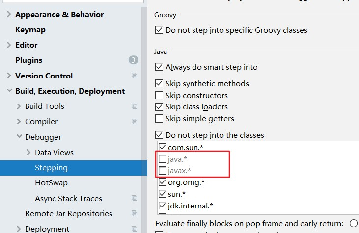

小结：

经验：初学者对于在哪里加断点，缺乏经验，这也是调试程序最麻烦的地方，需要一定的经验。
简单来说，在可能发生错误的代码的前面加断点。如果不会判断，就在程序执行的起点处加断点。
