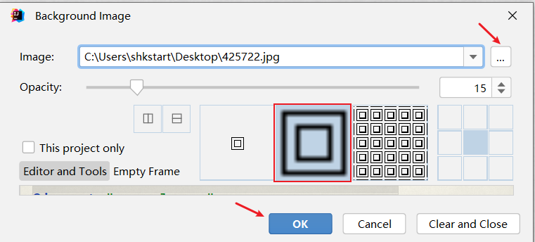

## 1、如何打开详细配置界面

1、显示工具栏


2、选择详细配置菜单或按钮


## 2、系统设置

#### *1*、默认启动项目配置


> 启动IDEA时，默认自动打开上次开发的项目？还是自己选择？
>
> 如果去掉Reopen last project on startup前面的对勾，每次启动IDEA就会出现如下界面：


#### 2、取消自动更新

> Settings--\>Appearance & Behavior-\>System Settings -\> Updates
>
> 
>
> 默认都打√了，建议检查IDE更新的√去掉，检查插件更新的√选上。

## 3、设置整体主题

#### 1、选择主题


#### 2、设置菜单和窗口字体和大小


#### 3、设置IDEA背景图

> 
>
> 选择一张合适的图片作为背景，即可。



## 4、设置编辑器主题样式

#### *1*、编辑器主题


#### 2、字体大小


更详细的字体与颜色如下：


> 温馨提示：如果选择某个font字体，中文乱码，可以在fallback font（备选字体）中选择一个支持中文的字体。

#### 3、注释的字体颜色

> 
>
> Block comment：修改多行注释的字体颜色
>
> Doc Comment –\> Text：修改文档注释的字体颜色
>
> Line comment：修改单行注释的字体颜色

## 5、显示行号与方法分隔符


## 6、代码智能提示功能


IntelliJ IDEA 的代码提示和补充功能有一个特性： 区分大小写 。 如果想不区分大小写的话，就把这个对勾去掉。 建议去掉勾选 。

## 7、自动导包配置

> 默认需要自己手动导包，Alt+Enter快捷键


自动导包设置

- 动态导入明确的包：Add unambiguous imports on the fly，该设置具有全局性；

- 优化动态导入的包：Optimize imports on the fly，该设置只对当前项目有效；


## 8、设置项目文件编码（一定要改)


> 说明： Transparent native-to-ascii conversion主要用于转换ascii，显式原生内容。一般都要勾选。

## 9、设置控制台的字符编码


## 10、修改类头的文档注释信息


```java
/**
* ClassName: ${NAME}
* Package: ${PACKAGE_NAME}
* Description:
* @Author 小熊学Java
* @Create ${DATE} ${TIME}
* @Version 1.0
*/
```


比如：常用的预设的变量，这里直接贴出官网给的：

```java
${PACKAGE_NAME} - the name of the target package where the new class or interface will
be created.
${PROJECT_NAME} - the name of the current project.
${FILE_NAME} - the name of the PHP file that will be created.
${NAME} - the name of the new file which you specify in the New File dialog box during
the file creation.
${USER} - the login name of the current user.
${DATE} - the current system date.
${TIME} - the current system time.
${YEAR} - the current year.
${MONTH} - the current month.
${DAY} - the current day of the month.
${HOUR} - the current hour.
${MINUTE} - the current minute.
${PRODUCT_NAME} - the name of the IDE in which the file will be created.
${MONTH_NAME_SHORT} - the first 3 letters of the month name. Example: Jan, Feb, etc.
${MONTH_NAME_FULL} - full name of a month. Example: January, February, etc.
```


## 11、设置自动编译

> `Settings-->Build,Execution,Deployment-->Compiler`


## 12、设置为省电模式 (可忽略)


> IntelliJ IDEA 有一种叫做 省电模式 的状态，开启这种模式之后 IntelliJ IDEA 会 关掉代码检查 和 代码提示 等功能。所以一般也可认为这是一种 阅读模式 ，如果你在开发过程中遇到突然代码文件不能进行检查和提示，可以来看看这里是否有开启该功能。

## 13、取消双击shift搜索

因为我们按shift切换中英文输入方式，经常被按到，总是弹出搜索框，太麻烦了。可以取消它。

- 方式1：适用于IDEA 2022.1.2版本

在2022.1版本中，采用如下方式消双击shift出现搜索框：搜索double即可，勾选Disable double modifier key shortcuts，禁用这个选项。


方式2：适用于IDEA 2022.1.2之前版本

双击shift 或 ctrl + shift + a，打开如下搜索窗口：


选择registry...，找到"ide.suppress.double.click.handler"，把复选框打上勾就可以取消双击shift出现搜索 框了。


## 14、其它设置

- 是否在单行显式编辑器选项卡（建议去掉勾选）


- 设置代码样式：比如，设置import显示"\*"时的个数


> **总结：以上这些设置看似只是针对当前Project设置的，但是新建的其它Project也是同样适用的。**
