## 创建Java工程

> 在工程上，右键- New - Module，如下：

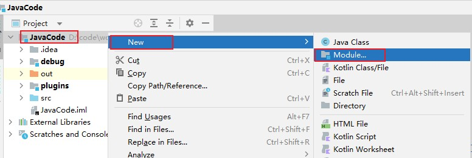

指明Java工程的名称及使用的JDK版本：

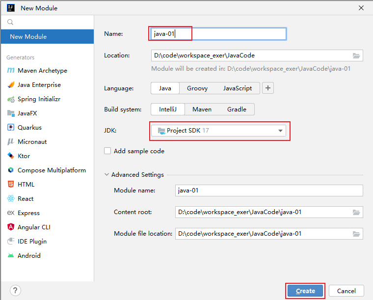

创建包：

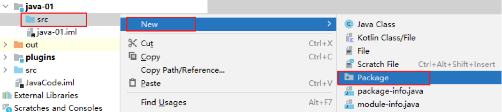

提供包名：


在包下创建类，即可：

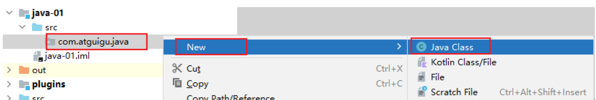

提供类名：

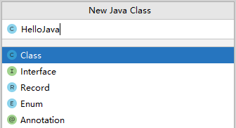

测试代码：

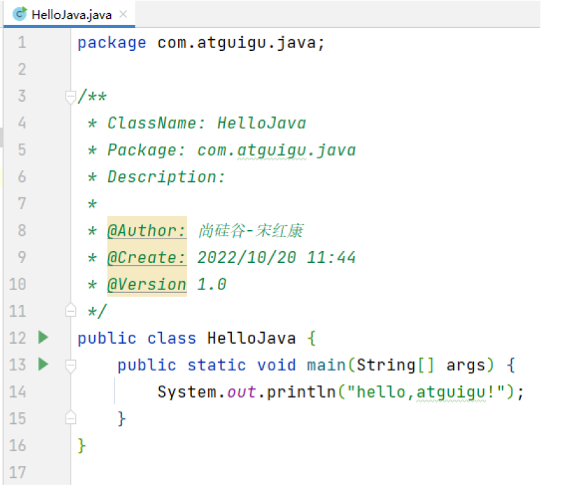

点击运行即可：

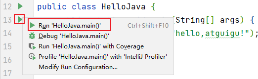

## 创建Java Web工程

### IDEA中配置Tomcat

> 在IDEA中配置Tomcat之前，需要保证已经安装并配置了Tomcat的环境变量。如果没有安装并配置，可以 参考《 尚硅谷_宋红康_Tomcat8.5快速部署.docx 》配置完成以后，在命令行输入：**catalina run** 。能够启动tomcat，则证明安装配置成功。
>
> 下面看如何在IDEA中配置：

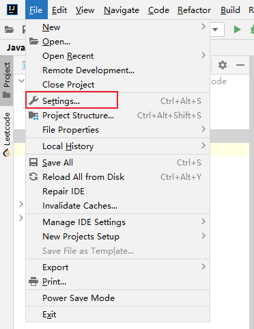

配置Tomcat Server的位置：

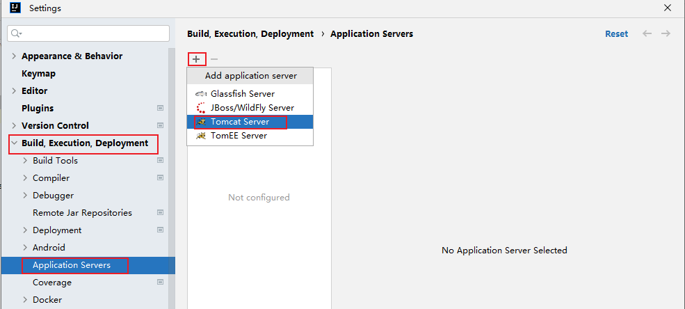

这里配置Tomcat的名称以及配置应用服务器的位置。根据自己Tomcat的安装位置决定。

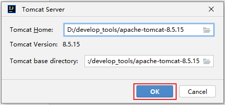

配置好后，如下图所示：

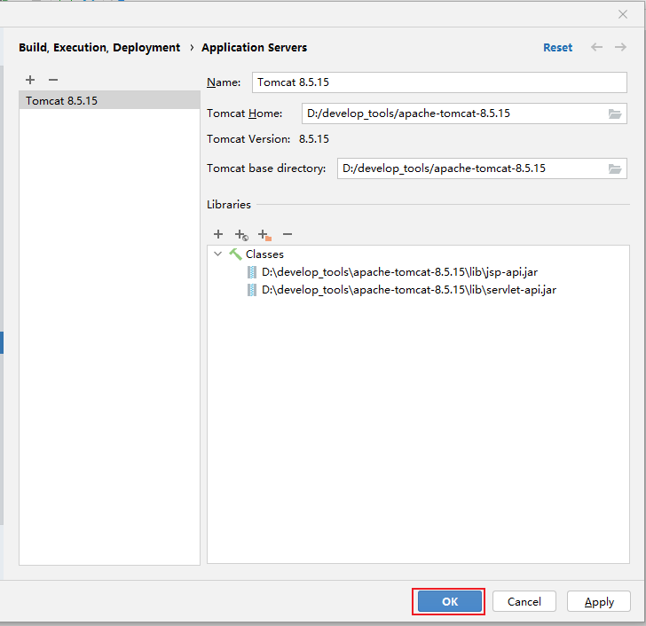

### 创建Web工程

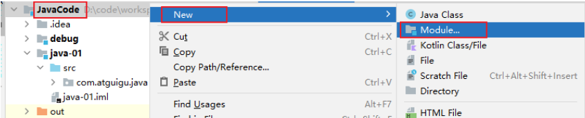

选择New Module，指明当前工程的名称：

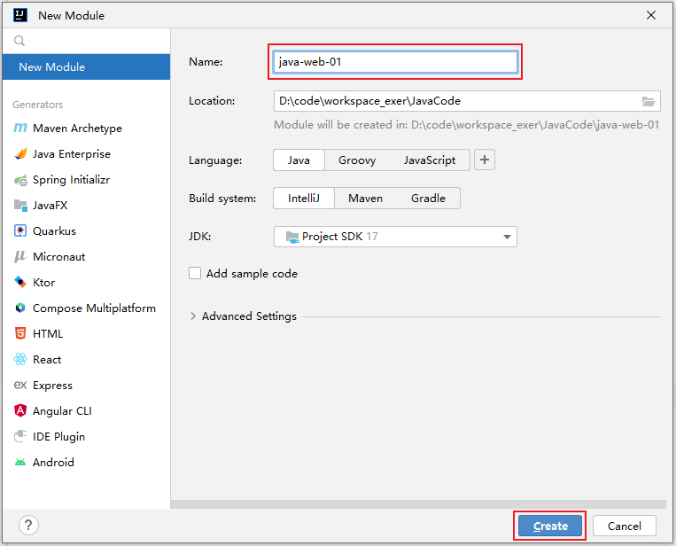

选中当前创建的工程，添加框架支持：

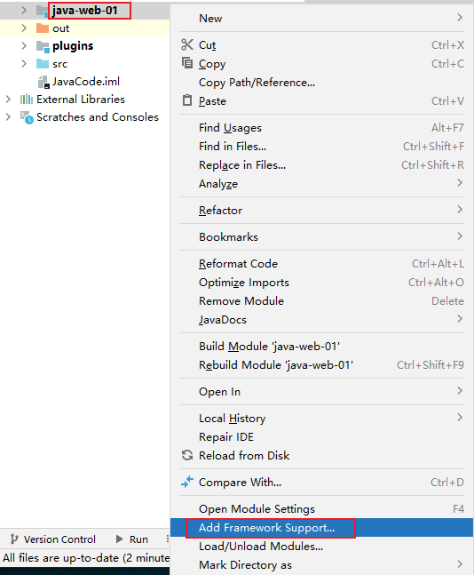

选择：Web Application，选择Create web.xml，如下：

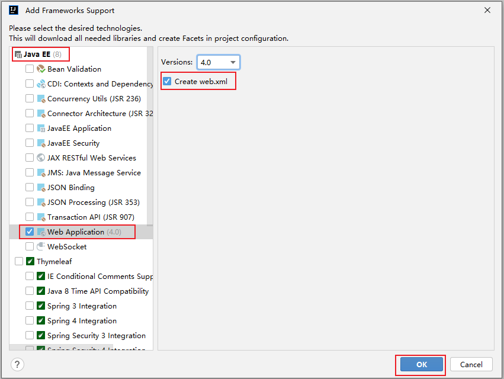

### 配置web工程并运行

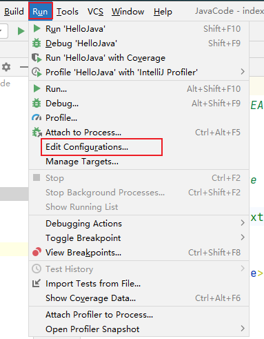

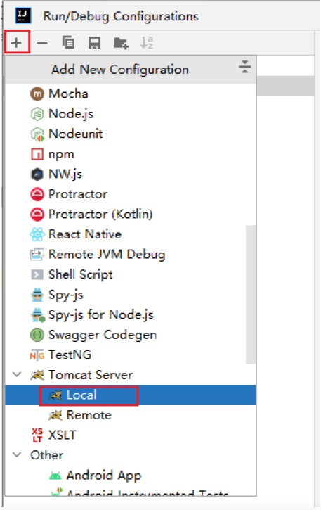


部署当前的web项目：

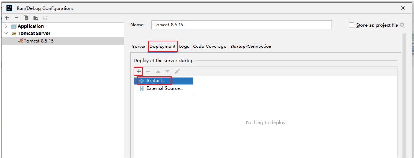

选择第2项：

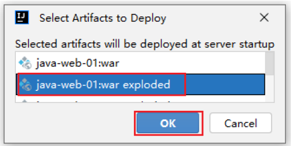

可以修改Application context，如下：

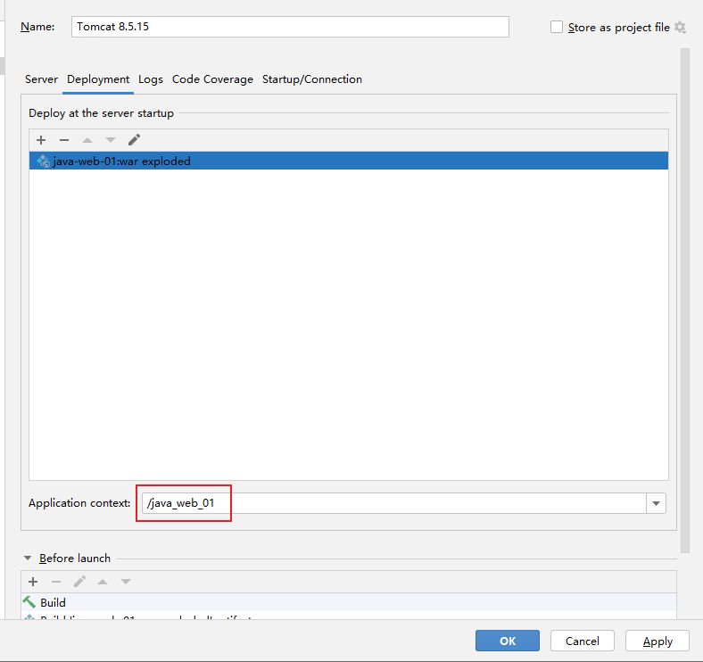

配置当前web工程的详细信息，如下：

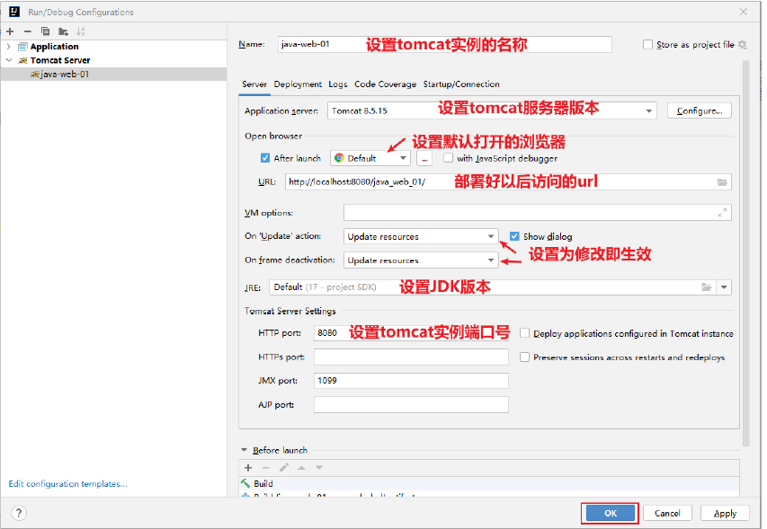

配置好后，可以直接运行：

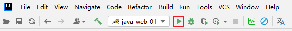

### 乱码的解决

> 如果Tomcat日志出现乱码，需要配置：

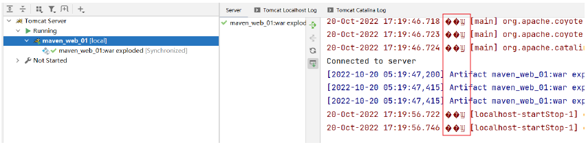

解决方案：

1. 点击Help =\> Edit custom VM Options，在最后面添加

   ```
   -Dfile.encoding=UTF-8
   ```

2. 在当前Tomcat实例中配置 VM option，添加

```
-Dfile.encoding=UTF-8
```


在第二步的Startup/Connection页签的Run和Debug添加一个key为 JAVA_TOOL_OPTIONS ， value为“ -

Dfile.encoding=UTF-8 ”的环境变量

保存后重启IDEA，可以发现控制台中文乱码显示正常了。

## 创建Maven Java工程

1. ### Maven的介绍


Maven是一款自动化构建工具，专注服务于Java平台的 项目构建 和 依赖管理 。在JavaEE开发的历史上构建工具的发展也经历了一系列的演化和变迁：

> Make→Ant→Maven→Gradle→其他……

构建环节：


> ①清理：删除以前的编译结果，为重新编译做好准备。
>
> ②编译：将Java源程序编译为字节码文件。
> ③测试：运行单元测试用例程序，确保项目在迭代开发过程中关键点的正确性。
> ④报告：测试程序的结果。
> ⑤打包：将java项目打成jar包；将Web项目打成war包。
> ⑥安装：将jar包或war包安装到本地仓库中。
> ⑦部署：将jar或war从Maven仓库中部署到Web服务器上运行。

### Maven的配置

> maven的下载 – 解压 – 环境变量的配置这里就不赘述了，需要的参考03-资料\05-Maven的配置中的《 尚 硅谷_Maven的配置_V2.0.docx 》。下面直接整合Maven。选择自己Maven的目录，和settings文件，然后配置自己的仓库reposiroty。

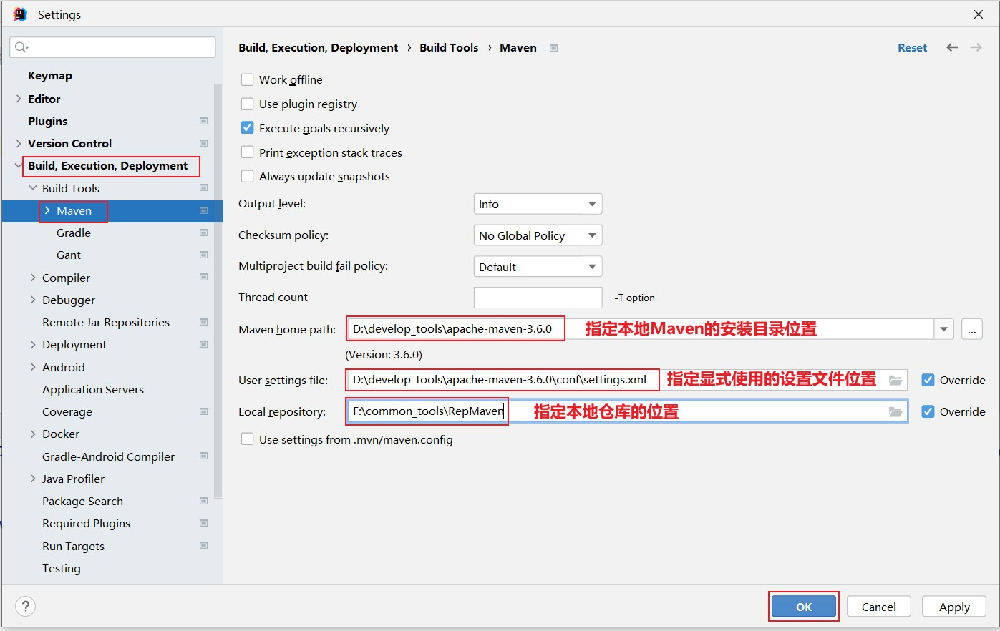

### Maven Java工程的创建


指明当前maven工程的名称、模板等信息。这里要求一个项目组的jdk版本必须一致。 通过坐标，就可以定位仓库中具体的jar包。如下：

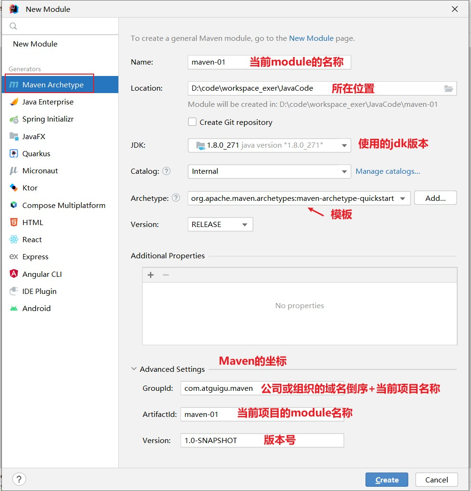

新创建的maven 的java工程缺少相应的resources文件目录，需要创建如下：

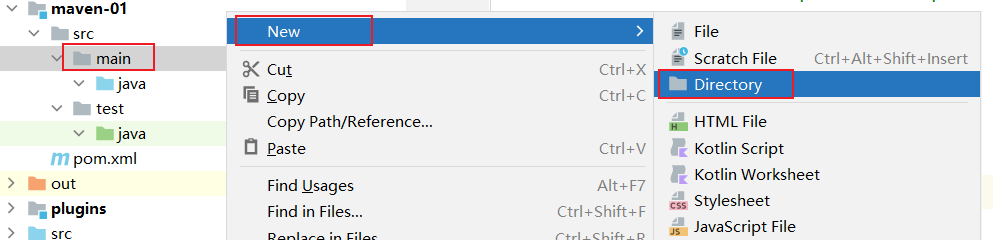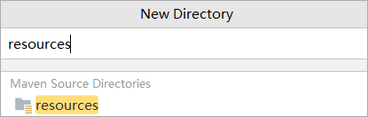

指明main下resources的文件目录类型：

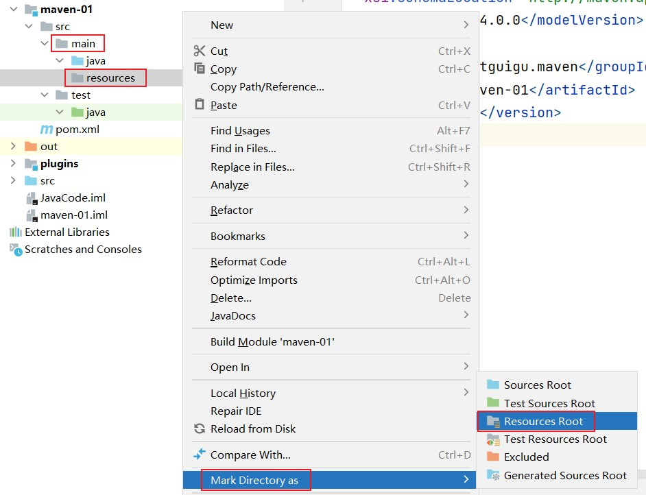

类似的操作test目录下，提供resources即可。这里说明Maven的java工程的目录结构：

```
工程名
	src
	----main
	--------java
	--------resources
	----test
	--------java
	--------resources
	pom.xml
```

- main目录用于存放主程序。
- test目录用于存放测试程序。
- java目录用于存放源代码文件。
- resources目录用于存放配置文件和资源文件


### 编写代码及测试

#### 第1步：创建Maven的核心配置文件pom.xml

```xml
<?xml version="1.0" encoding="UTF-8"?>
<project xmlns="http://maven.apache.org/POM/4.0.0"
xmlns:xsi="http://www.w3.org/2001/XMLSchema-instance"
xsi:schemaLocation="http://maven.apache.org/POM/4.0.0
http://maven.apache.org/xsd/maven-4.0.0.xsd">
	<modelVersion>4.0.0</modelVersion>
	<groupId>com.atguigu.maven</groupId>
	<artifactId>maven-01</artifactId>
    <version>1.0-SNAPSHOT</version>
	<dependencies>
        <dependency>
            <groupId>junit</groupId>
            <artifactId>junit</artifactId>
            <version>4.12</version>
            <scope>test</scope>
        </dependency>
        <dependency>
            <groupId>mysql</groupId>
            <artifactId>mysql-connector-java</artifactId>
            <version>8.0.18</version>
        </dependency>
    </dependencies>
</project>
```


### 第2步：编写主程序代码

在src/main/java/com/atguigu/java目录下新建文件HelloMaven.java

```java
package com.atguigu.java;
/**
* ClassName: HelloMaven
* Package: com.atguigu.java
* Description:
*
* @Author: 尚硅谷-宋红康
* @Create: 2022/10/20 18:20
* @Version 1.0
*/
public class HelloMaven {
	public String sayHello(String message) {
		return "Hello, " + message + "!";
	}
}
```


#### 第3步：编写测试代码

在/src/test/java/com/atguigu/java目录下新建测试文件HelloMavenTest.java

```java
package com.atguigu.java;
import org.junit.Test;
/**
* ClassName: HelloMavenTest
* Package: com.atguigu.java
* Description:
*
* @Author: 尚硅谷-宋红康
* @Create: 2022/10/20 18:21
* @Version 1.0
*/
public class HelloMavenTest {
	@Test
	public void testHelloMaven() {
		HelloMaven helloMaven = new HelloMaven();
		System.out.println(helloMaven.sayHello("Maven"));
	}
}
```


#### 第4步：运行几个基本的Maven命令

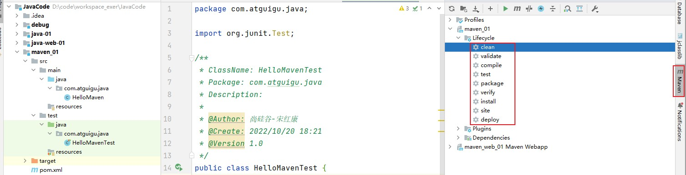

> 目录下也会有对应的生命周期。其中常用的是：clean、compile、package、install。
>
> 比如这里install，如果其他项目需要将这里的模块作为依赖使用，那就可以install。安装到本地仓库的位 置。

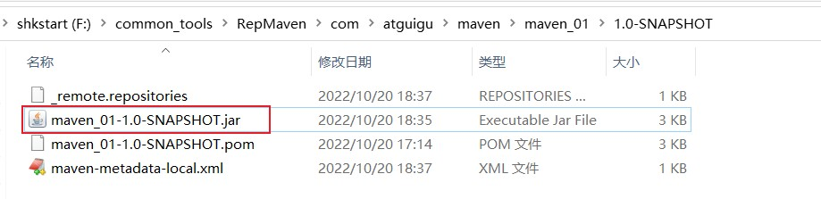

## 创建Maven Web工程

### 创建Maven的Web工程步骤

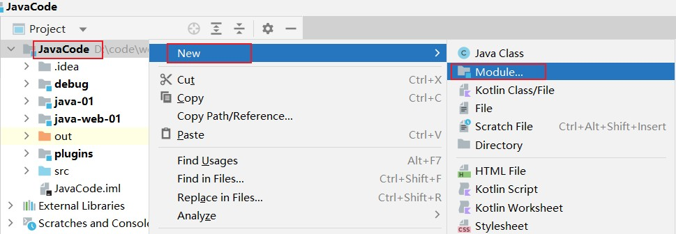

指明Maven的web工程的名称和模板。如下：

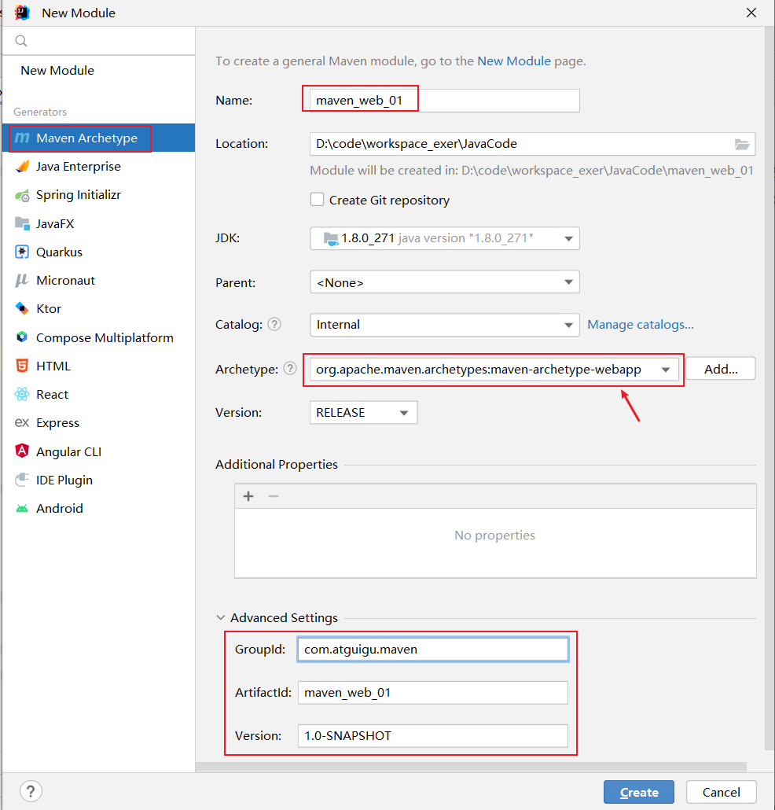

在Tomcat上进行部署：

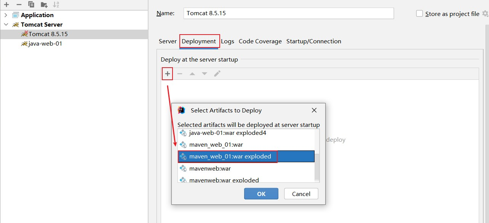

配置部署的详细信息：

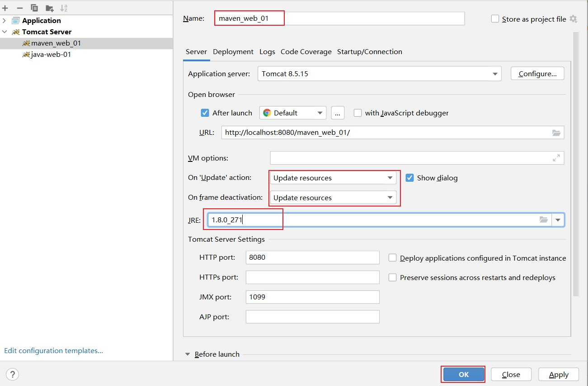


### 开发jsp依赖jar包

#### 1、找不到HttpServlet错误

如果看到JSP报错：` The superclass "javax.servlet.http.HttpServlet" was not found onthe Java Build Path` 可以加入如下依赖解决。

```xml
<dependency>
	<groupId>javax.servlet</groupId>
	<artifactId>servlet-api</artifactId>
	<version>2.5</version>
	<scope>provided</scope>
</dependency>
```


#### 2、EL表达式没有提示问题

同时，针对index.jsp文件，修改一下文件头信息为：

```html
<%@page language="java" pageEncoding="utf-8" contentType="text/html;UTF-8" %>
```
