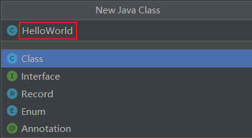

## 新建Project - Class

选择"New Project"：


指名工程名、使用的JDK版本等信息。如下所示：


接着创建Java类：



## 编写代码

```java
public class HelloWorld {
	public static void main(String[] args) {
		System.out.println("Hello,World!");
	}
}
```

### 运行

****

&nbsp;

## 项目的JDK设置

> File-->Project Structure...-->Platform Settings -->SDKs


> 注1：SDKs全称是Software Development Kit ，这里一定是选择JDK的安装根目录，不是JRE的目录。注2：这里还可以从本地添加多个JDK。使用“+”即可实现。

### out目录和编译版本

> `File-->Project Structure...-->Project Settings -->Project`


