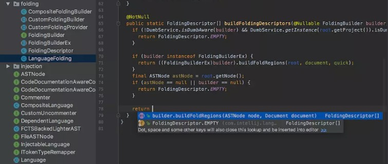

## JetBrains 公司介绍

> IDEA，是 JetBrains ( [**https://www.jetbrains.com/**](https://www.jetbrains.com/) )公司的产品，该公司成立于2000年，总部位于捷克的布拉格，致力于为开发者打造最高效智能的开发工具。

> 公司旗下还有其它产品，比如：
>
> WebStorm：用于开发 JavaScript、HTML5、CSS3 等前端技术
>
> PyCharm： 用 于 开 发 python PhpStorm： 用 于 开 发 PHP RubyMine： 用 于 开 发 Ruby/Rails AppCode：用于开发 Objective - C/Swift CLion： 用 于 开 发 C/C++ DataGrip：用于开发数据库和 SQL Rider：用于开发.NET
>
> GoLand：用于开发 Go
>
> 用于开发 Android的Android Studio，也是Google 基于 IDEA 社区版进行迭代的。

## IntelliJ IDEA 介绍

> IDEA，全称 IntelliJ IDEA ，是 Java 语言的集成开发环境，目前已经（基本） 代替 了Eclipse的使用。IDEA 在业界被公认为是最好的 Java 开发工具（之一），因其 功能强悍 、 设置人性化 ，而深受Java、大数据、移动端程序员的喜爱。尤其在智能代码助手、代码自动提示、重构、J2EE支持、Ant、JUnit、CVS 整合、代码审查、创新的 GUI 设计等方面的功能可以说是超常的。
>
> IntelliJ IDEA 在 2015 年的官网上这样介绍自己：

## IDEA的主要优势：(vs Eclipse)

##### 功能强大：

- 强大的整合能力。比如：Git、Maven、Spring等

-  开箱即用的体验（集成版本控制系统、多语言支持的框架随时可用，无需额外安装插件）

##### 符合人体工程学：

-  高度智能（快速的智能代码补全、实时代码分析、可靠的重构工具）

- 提示功能的快速、便捷、范围广

- 好用的快捷键和代码模板
- 精准搜索

## IDEA 的下载

> 下载网址： [**https://www.jetbrains.com/idea/download/#section=windows**](https://www.jetbrains.com/idea/download/#section%3Dwindows)
>
> IDEA 分为两个版本： 旗舰版(Ultimate) 和 。
>
> IDEA的大版本每年迭代一次，大版本下的小版本（如：2022.x）迭代时间不固定，一般每年3个小版 本。
>
> 
>
> [两个不同版本的详细对比，可以参照官网： **https://www.jetbrains.com/idea/features/editions_comparis on_matrix.html**](https://www.jetbrains.com/idea/features/editions_comparison_matrix.html)
>
> 官网提供的详细使用文档： [**https://www.jetbrains.com/help/idea/meet-intellij-idea.html**](https://www.jetbrains.com/help/idea/meet-intellij-idea.html)

## 卸载过程

> 这里以卸载2022.1.2版本为例说明。在【控制面板】找到【卸载程序】
>
> 
>
> 右键点击或左键双击IntelliJ IDEA 2022.1.2进行卸载：

> 如果需要保留下述数据，就不要打√。如果想彻底删除IDEA所有数据，那就打上√。

> 软件卸载完以后，还需要删除其它几个位置的残留：

## 安装前的准备

> 64 位 Microsoft Windows 11、10、8
>
> 最低 2 GB 可用 RAM，推荐 8 GB 系统总 RAM
>
> 2.5 GB 硬盘空间，推荐 SSD
>
> 最低屏幕分辨率 1024x768
>
> 从安装上来看，IntelliJ IDEA 对硬件的要求 似乎不是很高 。可是在实际开发中并不是这样的，因为 IntelliJ IDEA 执行时会有大量的缓存、索引文件，所以如果你正在使用 Eclipse / MyEclipse，想通过 IntelliJ IDEA 来解决计算机的卡、慢等问题，这基本上是不可能的，本质上你应该对自己的硬件设备进行升级。

## 安装过程

1、下载完安装包，双击直接安装

2、欢迎安装

3、是否删除电脑上低版本的IDEA（如果有，可以选择忽略）

如果电脑上有低版本的IDEA，可以选择删除或保留。

这里没有卸载旧版本，如果需要卸载，记得勾选下面的保留旧的设置和配置。

4、选择安装目录

选择安装目录，目录中要避免中文和空格。

5、创建桌面快捷图标等

确认是否与.java、.groovy、.kt 格式文件进行关联。这里建议不关联。

6、在【开始】菜单新建一个文件夹（这里需要确认文件夹的名称），来管理IDEA的相关内容。

7、完成安装

重启以后，单击登录：

## 注册

首先，需要通过用户协议：

是否同意发送用户数据（特性、使用的插件、硬件与软件配置等），建议选择：不发送。

接着，会提示我们进行注册。

选择1：适用30天。在IDEA2022.1.2版本中，需要先登录，才能开启适用。

选择2：付费购买旗舰版

选择3：（推荐）

- 大家参照操作即可。

- 由于存在时效性，如果失效，大家可以自行搜索注册方式即可。

## 闪退问题

> 问题描述1：2022.1启动不了，双击桌面图标，没有响应。
>
> 问题描述2：进入到安装目录...\IntelliJ IDEA 2022.1.2\bin，打开CMD。输入idea，发现报错。解决办法：
>
> 打开`C:\Users\songhk\AppData\Roaming\JetBrains\IntelliJIdea2022.1\idea64.exe.vmoptions`这个文件。

内容如下所示：

删除红框的数据以后，再登录即可正常进入。

原因：之前使用过的比如2021.2.2版本，pojie了。新版IEDA太智能了，把现有的启运参数也都复制过去 了 。 又 因 为 最 新 的 IDEA， 不 兼 容 pojie 程 序 -javaagent:D:\develop_tools\IDEA\IntelliJ IDEA 2021.2.2\bin\jetbrains-agent.jar了，所以报错了，所以JVM结束了，所以没有启动画面，凉凉了。
