## 1、IDEA项目结构

##### 层级关系：

project(工程) - module(模块) - package(包) - class(类)

**具体的：**

- 一个project中可以创建多个module
- 一个module中可以创建多个package
- 一个package中可以创建多个class

这些结构的划分，是为了方便管理功能代码。

## 2、Project和Module的概念

在 IntelliJ IDEA 中，提出了Project和Module这两个概念。

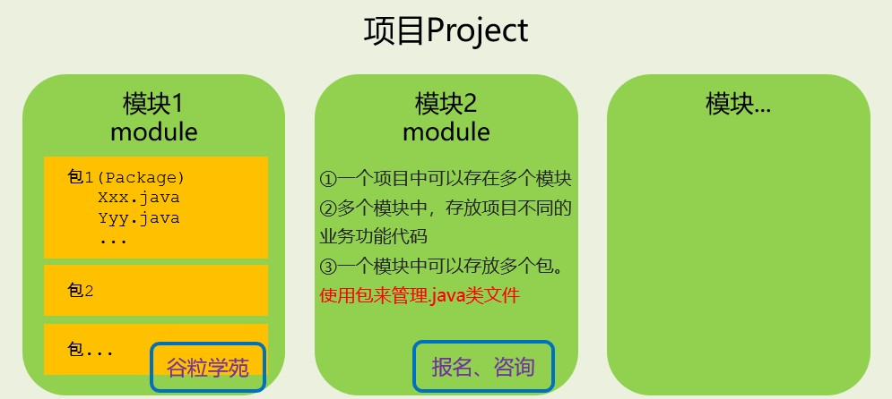

在 IntelliJ IDEA 中Project是 最顶级的结构单元 ，然后就是Module。目前，主流的大型项目结构基本都是多Module的结构，这类项目一般是 按功能划分 的，比如：user-core-module、user-facade-module和user- hessian-module等等，模块之间彼此可以 相互依赖 ，有着不可分割的业务关系。因此，对于一个Project 来说：

- 当为单Module项目的时候，这个单独的Module实际上就是一个Project。

- 当为多Module项目的时候，多个模块处于同一个Project之中，此时彼此之间具有 互相依赖 的关联关系。

- 当然多个模块没有建立依赖关系的话，也可以作为单独一个“小项目”运行。

## 3、创建Module

建议创建“Empty空工程”，然后创建多模块，每一个模块可以独立运行，相当于一个小项目。JavaSE阶段 不涉及到模块之间的依赖。后期再学习模块之间的依赖。

步骤：

1.  选择创建模块

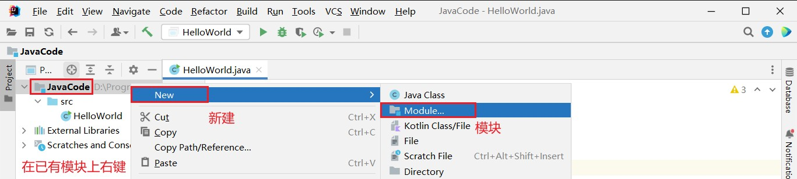

2. 选择模块类型：这里选择创建Java模块，给模块命名，确定存放位置

   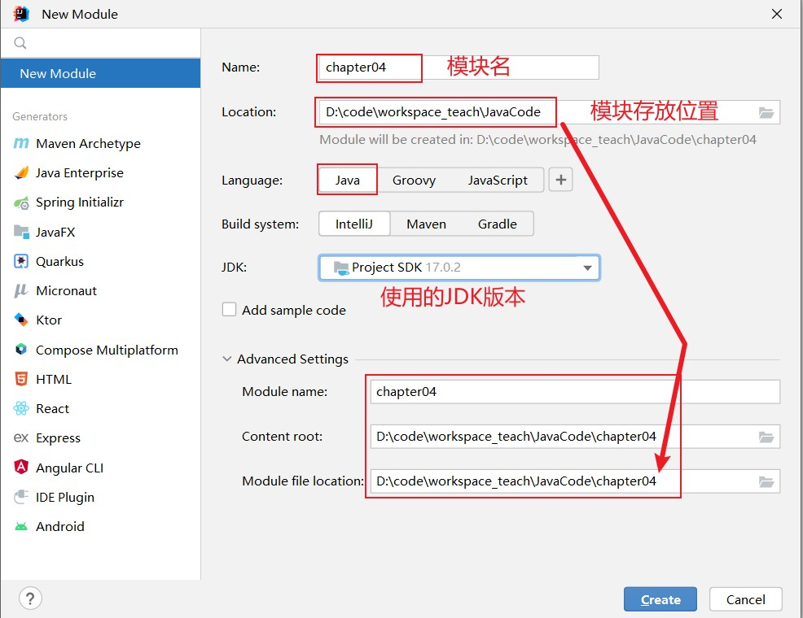

2. 模块声明在工程下面

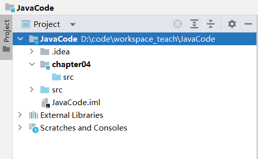

## 4、删除模块

1.  移除模块

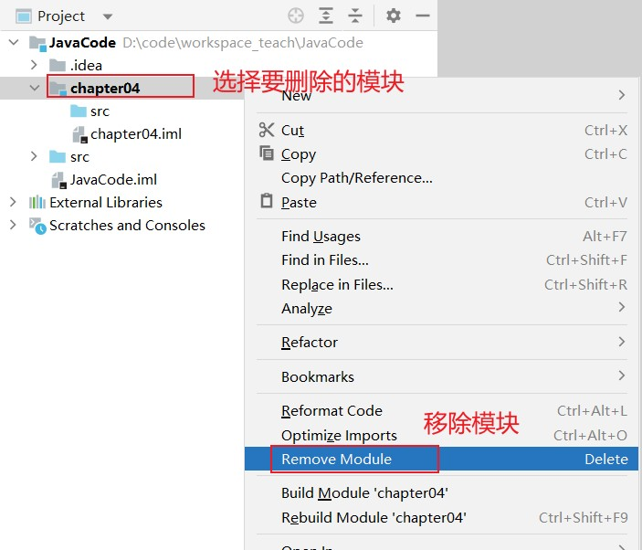

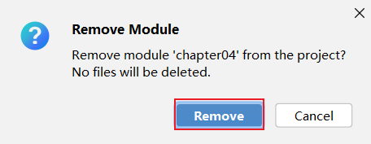

2.  彻底删除模块

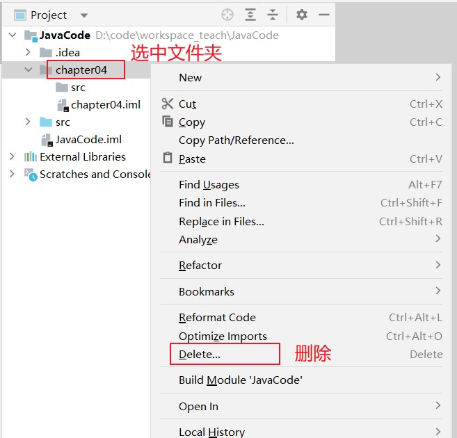

## 5、导入模块

1.  将模块 teacher_chapter04 整个的复制到自己IDEA项目的路径下

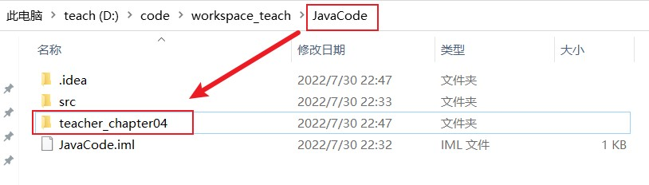

接着打开自己IDEA的项目，会在项目目录下看到拷贝过来的module，只不过不是以模块的方式呈现。

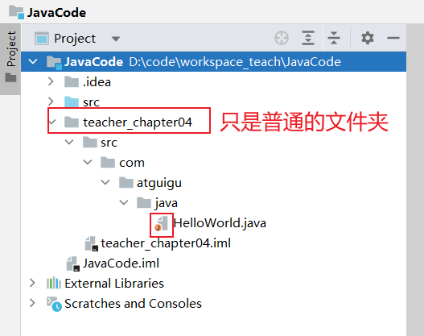

2.  查看Project Structure，选择import module

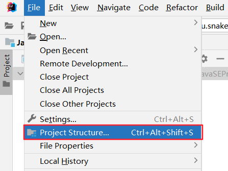

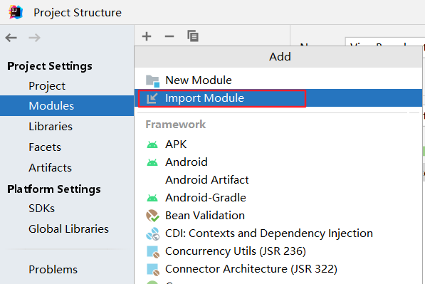

3.  选择要导入的module：

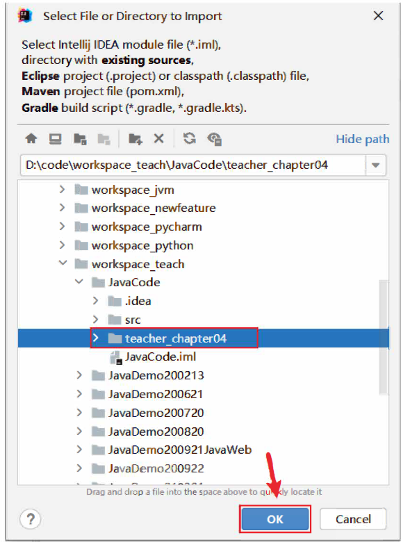

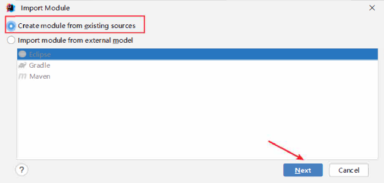

4.  接着可以一路Next下去，最后选择Overwrite

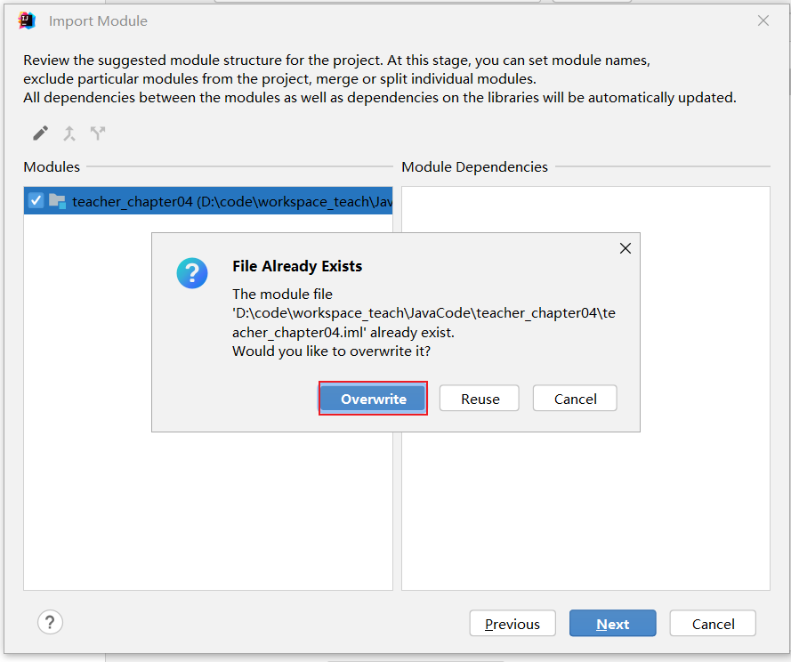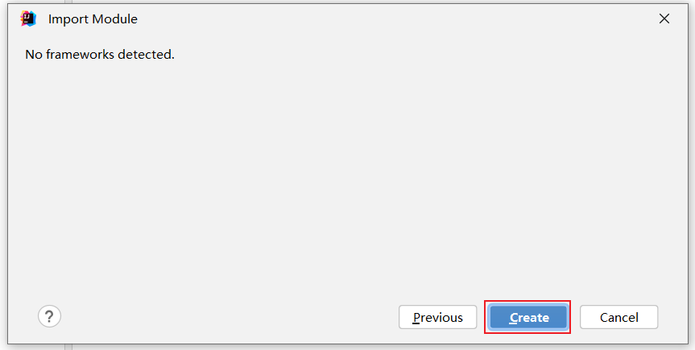

> 最后点击OK即可了。

## 6、同时打开两个IDEA项目工程

#### 1、两个IDEA项目工程效果

> 有些同学想要把上课练习代码和作业代码分开两个IDEA项目工程。

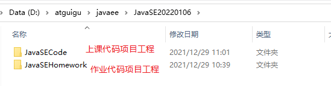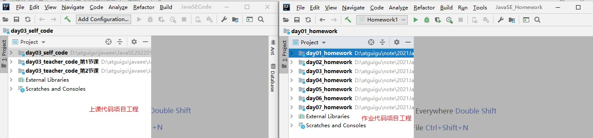

#### 2、新建一个IDEA项目

> 注意：第一次需要新建，之后直接打开项目工程即可

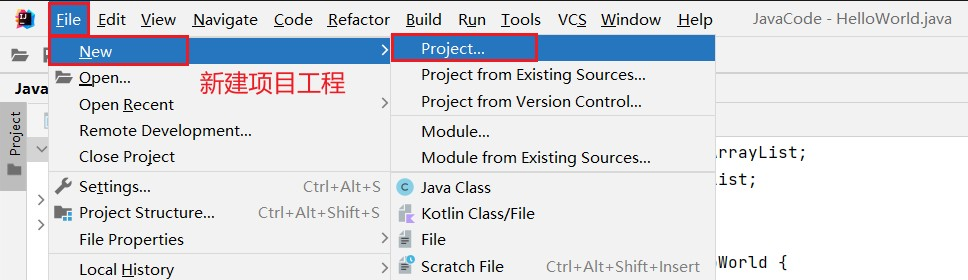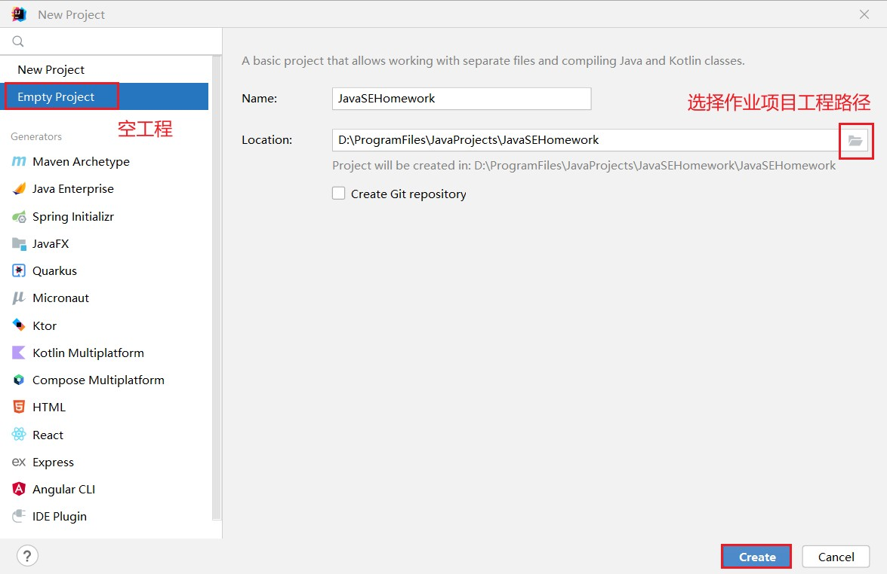

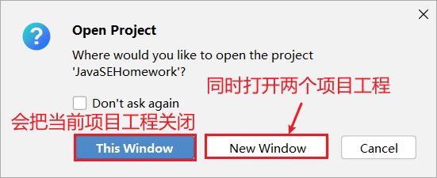

**3、打开两个IDEA项目**

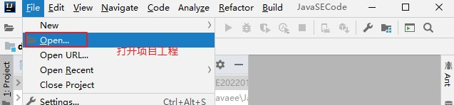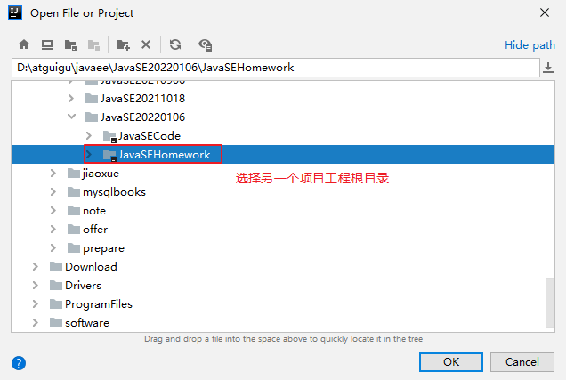

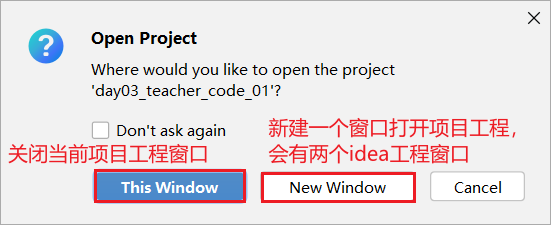

## 7、导入前几章非IDEA工程代码

##### 1、创建chapter01、chapter02、chapter03等章节的module

将相应章节的源文件粘贴到module的src下。

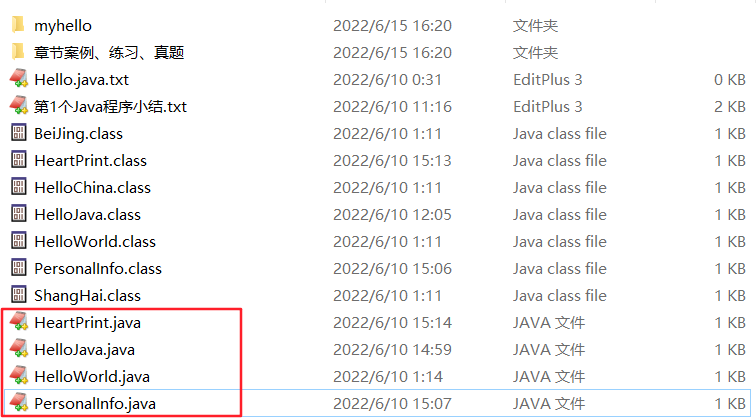

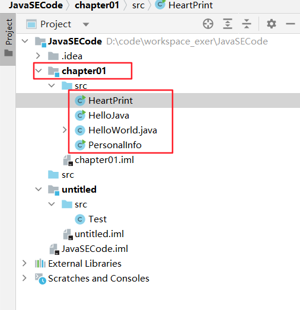

打开其中各个源文件，会发现有乱码。比如：

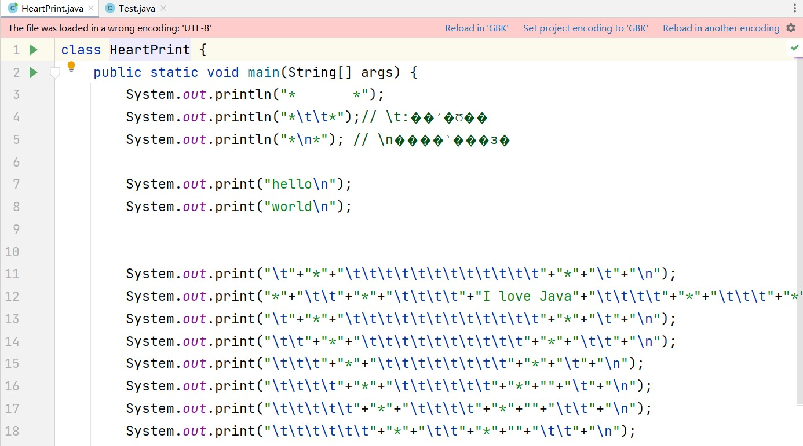

##### 2、设置编码

当前项目是UTF-8。如果原来的.java文件都是GBK的（如果原来.java文件有的是GBK，有的是UTF-8就比较 麻烦了）。

可以单独把这两个模块设置为GBK编码的。

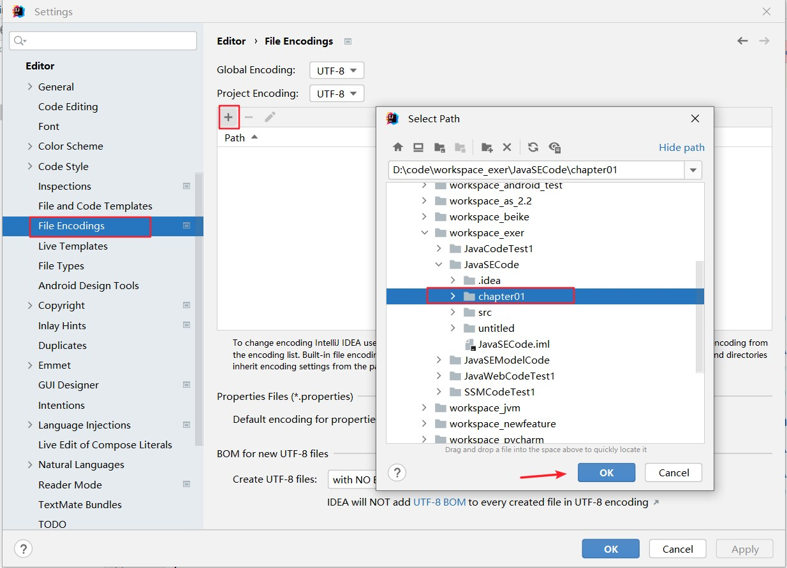

改为GBK，确认即可。如图：

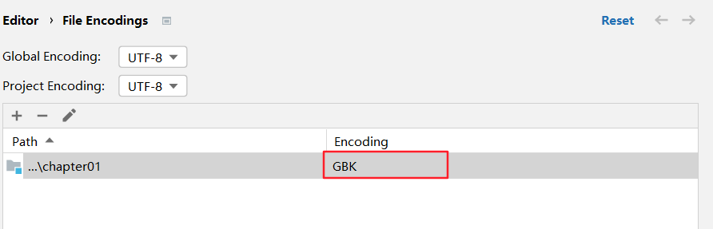
