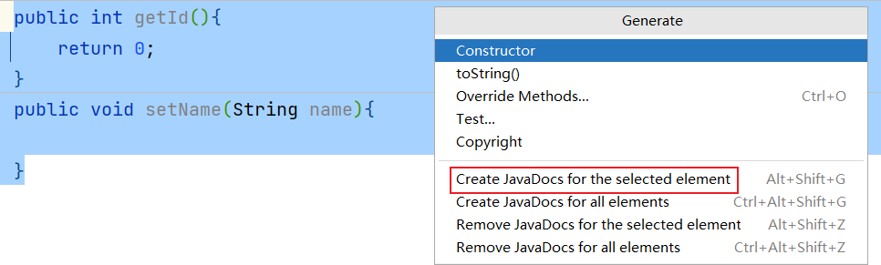

## 推荐1：Alibaba Java Coding Guidelines

> 阿里巴巴Java编码规范检查插件，检测代码是否存在问题，以及是否符合规范。
>
> 使用：在类中，右键，选择编码规约扫描，在下方显示扫描规约和提示。根据提示规范代码，提高代码 质量。

## 推荐2：jclasslib bytecode viewer

> 可视化的字节码查看器。使用：

1.  在 IDEA 打开想研究的类。

2.  编译该类或者直接编译整个项目（ 如果想研究的类在 jar 包中，此步可略过）。

3.  打开“view” 菜单，选择“Show Bytecode With jclasslib” 选项。

4.  选择上述菜单项后 IDEA 中会弹出 jclasslib 工具窗口。

> 
>
> 英文设置：
>
> 在 Help -\> Edit Custom VM Options …，加上

## 推荐3：Translation

> 注册翻译服务（有道智云、百度翻译开放平台、阿里云机器翻译）帐号，开通翻译服务并获取其应用ID 和密钥 绑定应用ID和密钥：偏好设置（设置） \> 工具 \> 翻译 \> 常规 \> 翻译引擎 \> 配置…
>
> 使用：鼠标选中文本，点击右键即可自动翻译成多国语言。注：请注意保管好你的应用密钥，防止其泄露。

## 推荐4：GenerateAllSetter

> 实际开发中还有一个非常常见的场景： 我们创建一个对象后，想依次调用 Setter 函数对属性赋值，如果属性较多很容易遗漏或者重复。
>
> 
>
> 可以使用这 GenerateAllSetter 提供的功能，快速生成对象的所有 Setter 函数（可填充默认值），然后自己再跟进实际需求设置属性值。

## 插件5：Rainbow Brackets

> 给括号添加彩虹色，使开发者通过颜色区分括号嵌套层级，便于阅读

## 推荐6：CodeGlance Pro

> 在编辑器右侧生成代码小地图，可以拖拽小地图光标快速定位代码，阅读行数很多的代码文件时非常实 用。

## 推荐7：Statistic

> 代码统计工具。

> 

## 推荐8：Presentation Assistant

> 显示快捷键操作的按键

## 推荐9：Key Promoter X

> 快捷键提示插件。当你执行鼠标操作时，如果该操作可被快捷键代替，会给出提示，帮助你自然形成使 用快捷键的习惯，告别死记硬背。

## 推荐10：JavaDoc

> 按 alt+insert ，执行操作：

## 推荐11： LeetCode Editor

> 
>
> 在 IDEA 里刷力扣算法题

## 推荐12：GsonFormatPlus

> 根据 json 生成对象。
>
> 使用：使用alt + s 或 alt + insert调取。
>
> 
>
> 举例：

## 插件13：Material Theme UI

> 对于很多人而言，写代码时略显枯燥的，如果能够安装自己喜欢的主题将为开发工作带来些许乐趣。
>
> IDEA 支持各种主题插件，其中最出名的当属 Material Theme UI。
>
> 
>
> 安装后，可以从该插件内置的各种风格个选择自己最喜欢的一种。
