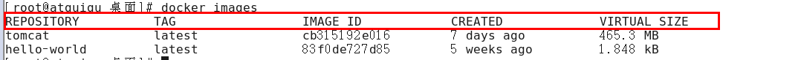
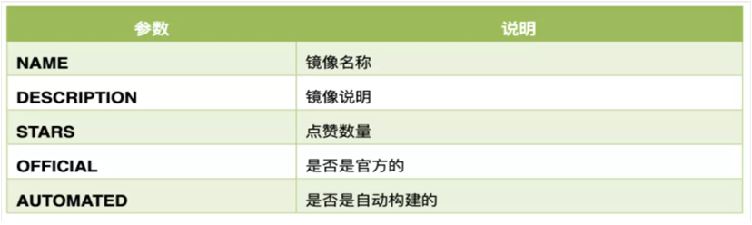
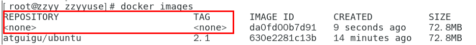
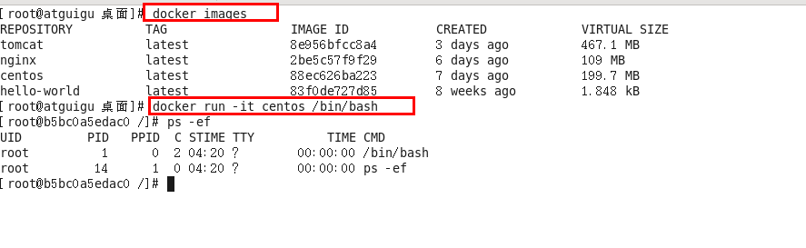

### 1、帮助类启动命令

- 启动docker： systemctl start docker
- 停止docker： systemctl stop docker
- 重启docker： systemctl restart docker
- 查看docker状态： systemctl status docker
- 开机启动： systemctl enable docker
- 查看docker概要信息： docker info
- 查看docker总体帮助文档： docker --help
- 查看docker命令帮助文档： docker 具体命令 --help


### 2、镜像命令

#### 1、列出本地主机上的镜像

```
docker images
```



各个选项说明:

- REPOSITORY：表示镜像的仓库源
- TAG：镜像的标签版本号
- IMAGE ID：镜像ID
- CREATED：镜像创建时间
- SIZE：镜像大小

>  同一仓库源可以有多个 TAG版本，代表这个仓库源的不同个版本，我们使用 REPOSITORY:TAG 来定义不同的镜像。
>  如果你不指定一个镜像的版本标签，例如你只使用 ubuntu，docker 将默认使用 ubuntu:latest 镜像

OPTIONS说明：

```
-a :列出本地所有的镜像（含历史映像层）
docker ../../images -a

-q :只显示镜像ID。
docker ../../images -q
```


#### 2、搜索镜像

官方搜索网址：https://hub.docker.com/

命令

```
docker search [OPTIONS] 镜像名字
```

```
[root@docker ~]## docker search mysql
NAME                             DESCRIPTION                                     STARS     OFFICIAL   AUTOMATED
mysql                            MySQL is a widely used, open-source relation…   12378     [OK]       
mariadb                          MariaDB Server is a high performing open sou…   4762      [OK]       
mysql/mysql-server               Optimized MySQL Server Docker ../../images. Create…   917                  [OK]
percona                          Percona Server is a fork of the MySQL relati…   572       [OK]       
phpmyadmin                       phpMyAdmin - A web interface for MySQL and M…   494       [OK]       
mysql/mysql-cluster              Experimental MySQL Cluster Docker ../../images. Cr…   93                   
centos/mysql-57-centos7          MySQL 5.7 SQL database server                   92                   
bitnami/mysql                    Bitnami MySQL Docker Image                      68                   [OK]
ubuntu/mysql                     MySQL open source fast, stable, multi-thread…   29                   
circleci/mysql                   MySQL is a widely used, open-source relation…   25                   
mysql/mysql-router               MySQL Router provides transparent routing be…   23                   
centos/mysql-56-centos7          MySQL 5.6 SQL database server                   22                   
google/mysql                     MySQL server for Google Compute Engine          21                   [OK]
vmware/harbor-db                 Mysql container for Harbor                      10                   
mysqlboy/docker-mydumper         docker-mydumper containerizes MySQL logical …   3                    
mysqlboy/mydumper                mydumper for mysql logcial backups              3                    
bitnami/mysqld-exporter                                                          2                    
ibmcom/mysql-s390x               Docker image for mysql-s390x                    2                    
mysql/mysql-operator             MySQL Operator for Kubernetes                   0                    
ibmcom/tidb-ppc64le              TiDB is a distributed NewSQL database compat…   0                    
mysqlboy/elasticsearch                                                           0                    
mysqleatmydata/mysql-eatmydata                                                   0                    
cimg/mysql                                                                       0                    
mysql/ndb-operator               MySQL NDB Operator for Kubernetes               0                    
mirantis/mysql  
```



##### OPTIONS说明：

- --limit : 只列出N个镜像，默认25个

```
docker search --limit 5 redis
```


#### 3、拉取（下载）镜像

```
docker pull 某个XXX镜像名字
```

- docker pull 某个XXX镜像名字[:TAG]

- docker pull 镜像名字

  > - 没有TAG就是最新版
  > - 等价于：docker pull 镜像名字:latest


#### 4、查看镜像

```
docker system df 查看镜像/容器/数据卷所占的空间
```

```
[root@docker ~]## docker system df
TYPE            TOTAL     ACTIVE    SIZE      RECLAIMABLE
../../images          1         1         13.26kB   0B (0%)
Containers      1         0         0B        0B
Local Volumes   0         0         0B        0B
Build Cache     0         0         0B        0B
[root@docker ~]## 
```


#### 5、删除镜像

```
docker rmi 某个XXX镜像名字ID
```

##### 1、删除单个

```
docker rmi  -f 镜像ID
```

##### 2、删除多个

```
docker rmi -f 镜像名1:TAG 镜像名2:TAG 
```

#### 3、删除全部

```
docker rmi -f $(docker ../../images -qa)
```


#### 6、面试题：谈谈docker虚悬镜像是什么？

> 仓库名、标签都是`<none>`的镜像，俗称虚悬镜像dangling image




### 3、容器命令

> 有镜像才能创建容器


本次用centos进行演示

#### 1、新建+启动命令

```
docker run [OPTIONS] IMAGE [COMMAND] [ARG...]
```

OPTIONS说明（常用）：有些是一个减号，有些是两个减号

--name="容器新名字"       为容器指定一个名称；
-d: 后台运行容器并返回容器ID，也即启动守护式容器(后台运行)；

-i：以交互模式运行容器，通常与 -t 同时使用；
-t：为容器重新分配一个伪输入终端，通常与 -i 同时使用；
也即启动交互式容器(前台有伪终端，等待交互)；

-P: 随机端口映射，大写P
-p: 指定端口映射，小写p




> #使用镜像centos:latest以交互模式启动一个容器,在容器内执行/bin/bash命令。

```
docker run -it centos /bin/bash 
```

参数说明：
-i: 交互式操作。
-t: 终端。
centos : centos 镜像。
/bin/bash：放在镜像名后的是命令，这里我们希望有个交互式 Shell，因此用的是 /bin/bash。
要退出终端，直接输入 exit:


#### 2、列出当前所有正在运行的容器

```
docker ps [OPTIONS]
```

> OPTIONS说明（常用）：
>
> -a :列出当前所有正在运行的容器+历史上运行过的
> -l :显示最近创建的容器。
> -n：显示最近n个创建的容器。
> -q :静默模式，只显示容器编号。


#### 3、退出容器

##### 1、`exec`退出

> run进去容器，exit退出，容器停止

##### 2、`ctrl+p+q`

> run进去容器，ctrl+p+q退出，容器不停止


#### 4、启动已停止运行的容器

```
docker start 容器ID或者容器名
```

#### 5、重启容器

```
docker restart 容器ID或者容器名
```

#### 6、停止容器

```
docker stop 容器ID或者容器名
```

#### 7、强制停止容器

```
docker kill 容器ID或容器名
```

#### 8、删除已停止的容器

```
docker rm 容器ID
```

##### 一次性删除多个容器实例

```
docker rm -f $(docker ps -a -q)

docker ps -a -q | xargs docker rm
```

`docker ps -a -q`：查询进行的容器ID


### 4、实操

#### 1、启动守护式容器(后台服务器)

> 在大部分的场景下，我们希望 docker 的服务是在后台运行的，我们可以过 -d 指定容器的后台运行模式。

```
docker run -d 容器名
```

#使用镜像centos:latest以后台模式启动一个容器

```
docker run -d centos
```

问题：然后docker ps -a 进行查看, 会发现容器已经退出很重要的要说明的一点: Docker容器后台运行,就必须有一个前台进程.容器运行的命令如果不是那些一直挂起的命令（比如运行top，tail），就是会自动退出的。

这个是docker的机制问题,比如你的web容器,我们以nginx为例，正常情况下,我们配置启动服务只需要启动响应的service即可。例如service nginx start但是,这样做,nginx为后台进程模式运行,就导致docker前台没有运行的应用,这样的容器后台启动后,会立即自杀因为他觉得他没事可做了.所以，最佳的解决方案是,将你要运行的程序以前台进程的形式运行，常见就是命令行模式，表示我还有交互操作，别中断，O(∩_∩)O哈哈~

##### 案例演示

> redis 前后台启动演示case（下载一个Redis6.0.8镜像演示）

- 前台交互式启动

  ```
  docker run -it redis
  ```

- 后台守护式启动

  ```
  docker run -d redis
  ```

PS：启动容器后，先查看容器是否启动正常，往往伴随着`docker ps`


#### 2、查看容器日志

```
docker logs 容器ID
```

PS：容器ID可省略为前三位

```
[root@docker ~]## docker ps 
CONTAINER ID   IMAGE     COMMAND                  CREATED         STATUS         PORTS      NAMES
94b526c73db2   redis     "docker-entrypoint.s…"   4 seconds ago   Up 3 seconds   6379/tcp   admiring_poincare
[root@docker ~]## docker logs 94b
1:C 10 Apr 2022 09:50:03.396 ## oO0OoO0OoO0Oo Redis is starting oO0OoO0OoO0Oo
1:C 10 Apr 2022 09:50:03.396 ## Redis version=6.2.6, bits=64, commit=00000000, modified=0, pid=1, just started
1:C 10 Apr 2022 09:50:03.396 ## Warning: no config file specified, using the default config. In order to specify a config file use redis-server /path/to/redis.conf
1:M 10 Apr 2022 09:50:03.397 * monotonic clock: POSIX clock_gettime
1:M 10 Apr 2022 09:50:03.398 * Running mode=standalone, port=6379.
1:M 10 Apr 2022 09:50:03.399 ## WARNING: The TCP backlog setting of 511 cannot be enforced because /proc/sys/net/core/somaxconn is set to the lower value of 128.
1:M 10 Apr 2022 09:50:03.399 ## Server initialized
1:M 10 Apr 2022 09:50:03.399 ## WARNING overcommit_memory is set to 0! Background save may fail under low memory condition. To fix this issue add 'vm.overcommit_memory = 1' to /etc/sysctl.conf and then reboot or run the command 'sysctl vm.overcommit_memory=1' for this to take effect.
1:M 10 Apr 2022 09:50:03.399 * Ready to accept connections
[root@docker ~]## 
```


#### 3、查看容器内运行的进程

```
docker top 容器ID
```

```
[root@docker ~]## docker top 94b
UID                 PID                 PPID                C                   STIME               TTY                 TIME                CMD
polkitd             35360               35341               0                   17:50               ?                   00:00:00            redis-server *:6379
```


#### 4、查看容器内部细节

```
docker inspect 容器ID
```


#### 5、进入容器内部

##### 1、使用`exec`进入容器

```
docker exec -it 容器ID bashShell
```

```
[root@docker ~]## docker exec -it 94b /bin/bash
root@94b526c73db2:/data## redis-c
redis-check-aof  redis-check-rdb  redis-cli        
root@94b526c73db2:/data## redis-cli 
127.0.0.1:6379> ping
PONG
127.0.0.1:6379> set k1 v1
OK
127.0.0.1:6379> get k1
"v1"
127.0.0.1:6379> exit
```

exec帮助命令

```
[root@docker ~]## docker exec --help

Usage:  docker exec [OPTIONS] CONTAINER COMMAND [ARG...]

Run a command in a running container

Options:
  -d, --detach               Detached mode: run command in the background
      --detach-keys string   Override the key sequence for detaching a container
  -e, --env list             Set environment variables
      --env-file list        Read in a file of environment variables
  -i, --interactive          Keep STDIN open even if not attached
      --privileged           Give extended privileges to the command
  -t, --tty                  Allocate a pseudo-TTY
  -u, --user string          Username or UID (format: <name|uid>[:<group|gid>])
  -w, --workdir string       Working directory inside the container
[root@docker ~]## 
```


##### 2、使用`attach `进入容器

```
docker attach 容器ID
```


##### 3、两者的区别

- attach 直接进入容器启动命令的终端，不会启动新的进程，用exit退出，会导致容器的停止。
- exec 是在容器中打开新的终端，并且可以启动新的进程，用exit退出，不会导致容器的停止。

PS：推荐大家使用` docker exec` 命令，因为退出容器终端，不会导致容器的停止。


### 5、从容器内拷贝文件到主机上

> 把文件从容器内部复制到主机上

```
docker cp  容器ID:容器内路径 目的主机路径
```

```
 docker cp 3065f084c80d:a.txt a.txt
```


### 6、导入和导出容器

#### 1、导出容器

> export 导出容器的内容留作为一个tar归档文件[对应import命令]

```
docker export 容器ID > 文件名.tar
```

```
[root@docker /]## docker export 3065f084c80d > centos.tar.gz
[root@docker /]## ll
总用量 233004
-rw-r--r--.   1 root root         0 4月  10 18:16 a.txt
lrwxrwxrwx.   1 root root         7 4月   9 15:59 bin -> usr/bin
dr-xr-xr-x.   5 root root      4096 4月   9 16:06 boot
-rw-r--r--.   1 root root 238572032 4月  10 19:04 centos.tar.gz
drwxr-xr-x.  20 root root      3220 4月   9 16:29 dev
drwxr-xr-x.  86 root root      8192 4月  10 11:03 etc
drwxr-xr-x.   3 root root        22 4月   9 16:05 home
lrwxrwxrwx.   1 root root         7 4月   9 15:59 lib -> usr/lib
lrwxrwxrwx.   1 root root         9 4月   9 15:59 lib64 -> usr/lib64
drwxr-xr-x.   2 root root         6 4月  11 2018 media
drwxr-xr-x.   2 root root         6 4月  11 2018 mnt
drwxr-xr-x.   4 root root        34 4月   9 20:38 opt
dr-xr-xr-x. 124 root root         0 4月   9 16:29 proc
dr-xr-x---.   5 root root       176 4月   9 20:36 root
drwxr-xr-x.  31 root root       940 4月   9 21:01 run
lrwxrwxrwx.   1 root root         8 4月   9 15:59 sbin -> usr/sbin
drwxr-xr-x.   2 root root         6 4月  11 2018 srv
dr-xr-xr-x.  13 root root         0 4月   9 16:29 sys
drwxrwxrwt.  13 root root      4096 4月  10 18:16 tmp
drwxr-xr-x.  13 root root       155 4月   9 15:59 usr
```


#### 2、导入容器

> import 从tar包中的内容创建一个新的文件系统再导入为镜像[对应export]

```
cat 文件名.tar | docker import - 镜像用户/镜像名:镜像版本号
```

```
[root@docker /]## cat centos.tar.gz | docker import - xiaobear/centos:8.8
sha256:12e7a58fc36a755fa63a82f78364291de7271c3ade90f2f5581cc50bc2416cb2
[root@docker /]## docker ../../images
REPOSITORY        TAG       IMAGE ID       CREATED              SIZE
xiaobear/centos   8.8       12e7a58fc36a   About a minute ago   231MB
redis             latest    7614ae9453d1   3 months ago         113MB
hello-world       latest    feb5d9fea6a5   6 months ago         13.3kB
centos            latest    5d0da3dc9764   6 months ago         231MB
[root@docker /]## 
```


### 7、常用命令汇总


| 命令    | 英文                                                         | 中文                                                |
| ------- | ------------------------------------------------------------ | --------------------------------------------------- |
| attach  | Attach to a running container                                | 当前 shell 下 attach 连接指定运行镜像               |
| build   | Build an image from a Dockerfile                             | 通过 Dockerfile 定制镜像                            |
| commit  | Create a new image from a container changes                  | 提交当前容器为新的镜像                              |
| cp      | Copy files/folders from the containers filesystem to the host path | 容器中拷贝指定文件或者目录到宿主机中                |
| create  | Create a new container                                       | 创建一个新的容器，同 run，但不启动容器              |
| diff    | Inspect changes on a container's filesystem                  | 查看 docker 容器变化                                |
| events  | Get real time events from the server                         | 从 docker 服务获取容器实时事件                      |
| exec    | Run a command in an existing container                       | 在已存在的容器上运行命令                            |
| export  | Stream the contents of a container as a tar archive          | 导出容器的内容流作为一个 tar 归档文件[对应 import ] |
| history | Show the history of an image                                 | 展示一个镜像形成历史                                |
| ../../images  | List ../../images                                                  | 列出系统当前镜像                                    |
| import  | Create a new filesystem image from the contents of a tarball | 从tar包中的内容创建一个新的文件系统映像[对应export] |
| info    | Display system-wide information                              | 显示系统相关信息                                    |
| inspect | Return low-level information on a container                  | 查看容器详细信息                                    |
| kill    | Kill a running container                                     | kill 指定 docker 容器                               |
| load    | Load an image from a tar archive                             | 从一个 tar 包中加载一个镜像[对应 save]              |
| login   | Register or Login to the docker registry server              | 注册或者登陆一个 docker 源服务器                    |
| logout  | Log out from a Docker registry server                        | 从当前 Docker registry 退出                         |
| logs    | Fetch the logs of a container                                | 输出当前容器日志信息                                |
| port    | Lookup the public-facing port which is NAT-ed to PRIVATE_PORT | 查看映射端口对应的容器内部源端口                    |
| pause   | Pause all processes within a container                       | 暂停容器                                            |
| ps      | List containers                                              | 列出容器列表                                        |
